# 将 Adonis.js API 自动部署到 Heroku | CircleCI

> 原文：<https://circleci.com/blog/automating-the-deploy-of-an-adonis-api-to-heroku/>

凭借 GitHub 上的 8000 多颗星和 Node.js 网站上的[顶级 Node.js web 框架](https://nodejs.dev/learn)之一， [Adonis.js](https://adonisjs.com/) 正在成为 Node.js 社区的主要参与者，成为构建 web 应用程序的可靠框架。它圆滑简洁的 API 使得它对开发人员非常友好，易于扩展，并且具有很高的性能。在本教程中，我们将使用 Adonis.js 构建一个简单的 API，并自动将其部署到 [Heroku](https://heroku.com/) 。

## 先决条件

要遵循本教程，需要做一些事情:

1.  JavaScript 的基础知识
2.  安装在您系统上的[node . js](https://nodejs.org)(>= 8.0)
3.  全局安装 Adonis.js CLI(运行`npm i -g @adonisjs/cli`进行安装)
4.  一个英雄的账户
5.  一个[圆](https://circleci.com/signup/)的账户
6.  GitHub 的一个账户

所有这些安装和设置，让我们开始教程。

## 创建 Adonis.js API 项目

首先，通过运行下面的命令，创建一个新的仅支持 API 的 Adonis.js 应用程序:

```
adonis new my-adonis-api --api-only 
```

这将搭建一个 Adonis.js 项目，该项目仅用于构建 API 端点，而非网页。该项目将被放置在`adonis new`命令后指定的`my-adonis-api`文件夹中。一旦搭建过程完成，进入项目的根目录(`cd my-adonis-api`)并运行以下命令来启动应用程序:

```
adonis serve --dev 
```

这将在`http://localhost:3333`启动一个本地服务器，您可以通过浏览器或在 CLI 上使用`curl`来访问它。点击这个根端点将返回下面的 JSON 数据:

```
{ "greeting": "Hello world in JSON" } 
```

## 为本地开发设置 SQLite

在开始编写 API 代码之前，我们需要一个本地开发数据库。默认情况下，我们的 Adonis.js 项目被配置为使用一个带有设置的`SQLite`数据库来连接到在`./config/database.js`中找到的数据库。

```
 module.exports = {

  connection: Env.get("DB_CONNECTION", "sqlite"),

  sqlite: {
    client: "sqlite3",
    connection: {
      filename: Helpers.databasePath(
        `${Env.get("DB_DATABASE", "development")}.sqlite`
      ),
    },
    useNullAsDefault: true,
    debug: Env.get("DB_DEBUG", false),
  },

  .....
} 
```

并且在项目根目录下的环境配置文件(`.env`)中，我们也有一些要使用的数据库的配置。

```
DB_CONNECTION=sqlite
DB_HOST=127.0.0.1
DB_PORT=3306
DB_USER=root
DB_PASSWORD=
DB_DATABASE=adonis
HASH_DRIVER=bcrypt 
```

该配置定义了要使用的数据库连接(`DB_CONNECTION`)和数据库名称(`DB_DATABASE`)。这里的连接设置为`sqlite`，数据库名设置为`adonis`。那部分可以走了。

现在我们已经有了数据库，下一步是安装`sqlite3` Node.js 包。这是连接到我们的`SQLite`数据库的驱动程序。通过运行以下命令安装软件包:

```
npm install sqlite3 --save 
```

安装了这个包之后，接下来我们将运行必要的迁移来设置我们的数据库模式。Adonis.js 使用迁移以编程方式设置和更新数据库模式，以便在不同的环境中轻松复制模式，并在开发团队和部署环境中保持一致性。

迁移文件可以在`./database/migrations`中找到。默认情况下，这个文件夹包含两个迁移，一个是针对`users`表的，另一个是针对`tokens`表的。要运行这些迁移并设置我们的数据库模式，请在项目的根目录下运行以下命令:

```
adonis migration:run 
```

上面的命令将在`./database`文件夹中创建一个新的`adonis.sqlite`数据库文件(因为它还不存在)并运行我们的迁移。

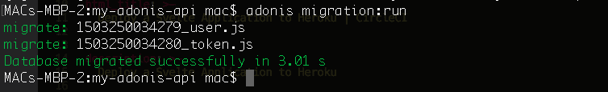

我们现在已经为使用我们的`SQLite`数据库做好了一切准备。接下来，我们将为一个简单的`User` API 编写代码，该 API 允许我们创建和获取用户记录。

## 创建 API 的用户模型

为了开始开发我们的`User` API，我们需要定义我们的`User`模型。Adonis.js 模型可以在`./app/Models`文件夹中找到。在该目录中找到`User.js`文件(该文件是在搭建过程中创建的)，并输入以下代码:

```
"use strict";

const Model = use("Model");

const Hash = use("Hash");

class User extends Model {
  static get table() {
    return "users";
  }

  static boot() {
    super.boot();

    this.addHook("beforeSave", async (userInstance) => {
      if (userInstance.dirty.password) {
        userInstance.password = await Hash.make(userInstance.password);
      }
    });
  }

  tokens() {
    return this.hasMany("App/Models/Token");
  }

  static async createUser(data) {
    const newUser = await this.create(data);

    return newUser;
  }

  static async getUsers(filter) {
    const allUsers = await this.query().where(filter).fetch();

    return allUsers;
  }
}

module.exports = User; 
```

在上面的代码中，我们创建了一个扩展基类`Model`的`User`模型。然后我们定义一个`table` getter 来返回这个模型引用的表的名称。接下来，我们添加一个`beforeSave`钩子，确保我们的明文密码在用户创建时被保存到数据库之前被加密。

创建一个`tokens`关系函数来引用`Token`模型，它也存在于`/app/Models`目录中。这种关系允许我们在登录时获取每个用户的访问令牌。

最后，我们再创建两个模型函数，一个创建新用户(`createUser`)，另一个基于查询过滤器获取用户列表(`getUsers`)。

## 创建 API 用户控制器

我们的下一个任务是创建一个`User`控制器。js 是一个模型视图控制器(MVC)框架，所以我们需要控制器来处理我们的 API 请求。

我们将在我们的控制器方法中做一些验证。这意味着我们需要用 Adonis.js 验证包来设置我们的项目。要在 Adonis.js 中实现验证，请使用以下命令安装验证程序包:

```
adonis install @adonisjs/validator 
```

一旦软件包安装完毕，将以下项目添加到`./start/app.js`中的`providers`数组:

```
 const providers = [
    ....,
    '@adonisjs/validator/providers/ValidatorProvider'
] 
```

通过运行以下命令创建新的控制器:

```
adonis make:controller User --type http 
```

该命令将在`./app/Controllers`中创建一个名为`Http`的新文件夹，并在该文件夹中创建一个新文件`UserController.js`。在新创建的控制器中，用下面的代码替换文件中的代码:

```
"use strict";

const Logger = use("Logger");
const { validate } = use("Validator");
const User = use("App/Models/User");

class UserController {
  async create({ request, response }) {
    const data = request.post();

    const rules = {
      username: `required|unique:${User.table}`,
      email: `required|unique:${User.table}`,
      password: `required`
    };

    const messages = {
      "username.required": "A username is required",
      "username.unique": "This username is taken. Try another.",
      "email.required": "An Email is required",
      "email.unique": "Email already exists",
      "password.required": "A password for the user"
    };

    const validation = await validate(data, rules, messages);

    if (validation.fails()) {
      const validation_messages = validation.messages().map((msgObject) => {
        return msgObject.message;
      });

      return response.status(400).send({
        success: false,
        message: validation_messages
      });
    }

    try {
      let create_user = await User.createUser(data);

      let return_body = {
        success: true,
        details: create_user,
        message: "User Successfully created"
      };

      response.send(return_body);
    } catch (error) {
      Logger.error("Error : ", error);
      return response.status(500).send({
        success: false,
        message: error.toString()
      });
    }
  } //create

  async fetch({ request, response }) {
    const data = request.all();

    try {
      const users = await User.getUsers(data);

      response.send(users);
    } catch (error) {
      Logger.error("Error : ", error);
      return response.status(500).send({
        success: false,
        message: error.toString()
      });
    }
  } //fetch
}

module.exports = UserController; 
```

在上面的代码中，我们创建了两个控制器函数(`create`和`fetch`)，它们分别创建一个新用户和获取一个用户列表。在`create`函数中，我们使用我们的`Validator`模块来验证`request`数据，以确保创建新用户的每个必选项都存在。我们还为验证设置了适当的错误消息。

## 在 API 上注册路线

现在是我们注册路线的时候了，这是开发 API 的最后一步。打开文件`./start/routes.js`，用以下代码替换其中的代码:

```
"use strict";

const Route = use("Route");

Route.get("/", () => {
  return { greeting: "Welcome to the Adonis API tutorial" };
});

//User routes
Route.group(() => {
  Route.post("create", "UserController.create");

  Route.route("get", "UserController.fetch", ["GET", "POST"]);
}).prefix("user"); 
```

在上面的文件中，我们将`/`路由中的默认`greeting`消息更改为`Welcome to the Adonis API tutorial`。接下来，我们注册分别映射到`UserController`的`create`和`fetch`函数的`/create`和`/get`路线。我们给这两个端点加上前缀`/user`来增加一些路由命名空间。

## 在 Postman 中测试端点

现在让我们通过调用我们的端点来测试我们的 API。我们将使用[邮递员](https://www.postman.com/)来测试我们的端点。确保您的应用程序正在运行。如果没有，运行`adonis serve --dev`再次启动。

下面是用户创建和获取用户的测试:

### 用户创建-验证失败

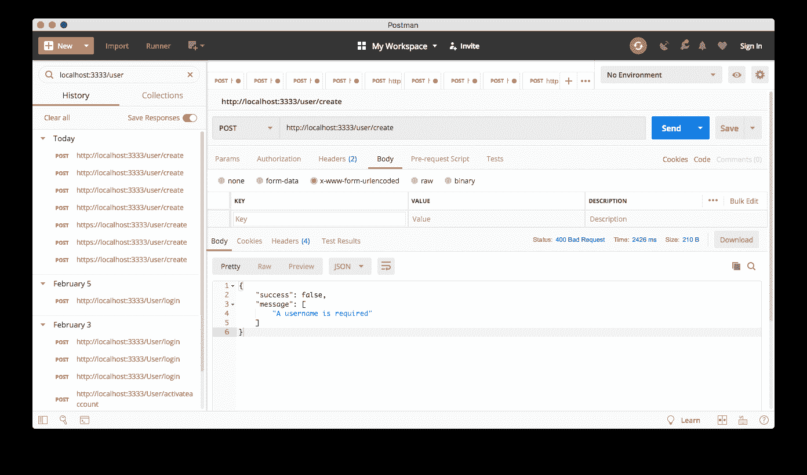

### 用户创建-成功

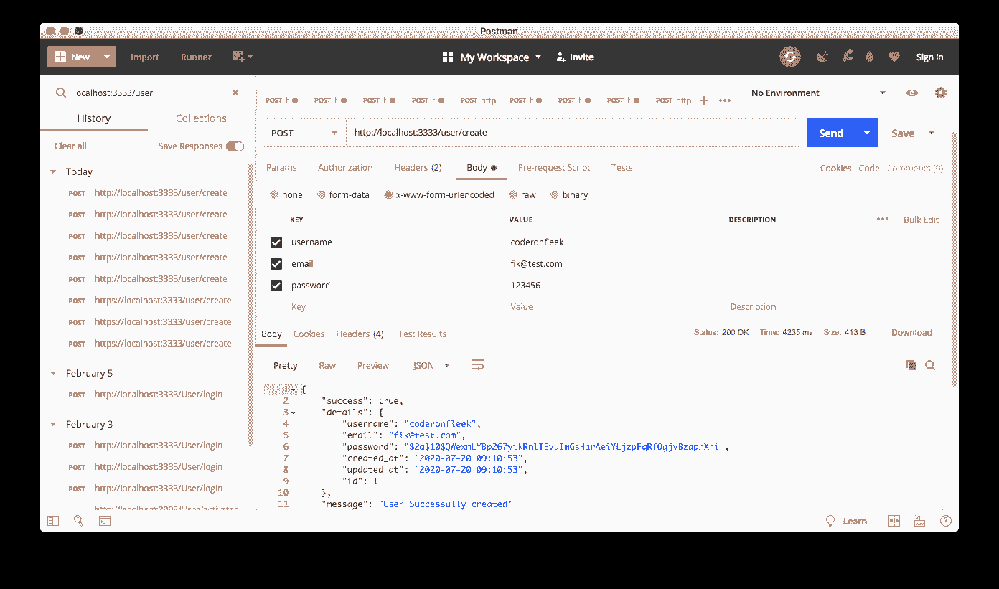

### 用户获取

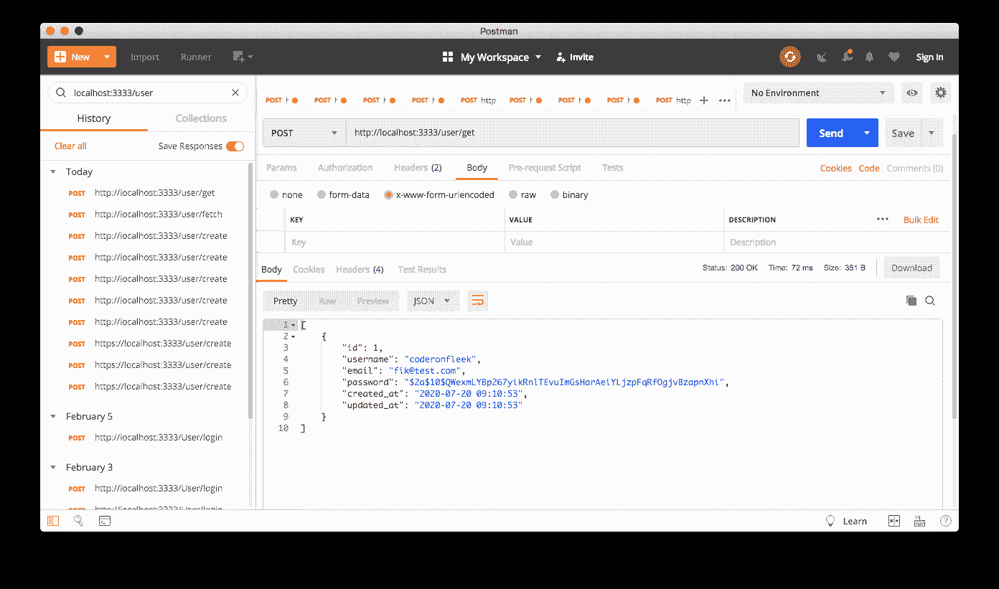

## 为生产部署设置 Heroku 和 MySQL

到目前为止，我们所做的一切都可以在本地机器上完美地工作，但是本教程的目的是让我们的 API 托管在生产环境中，并自动化部署过程。因此，我们将把 API 托管在 Heroku 平台上，而不是在我们的机器上运行。此外，我们将使用`MySQL`，而不是使用`SQLite`，这是一个更健壮的关系数据库管理系统，适用于生产环境。

我们还想确保当我们在本地机器上运行时，使用`SQLite`，当在生产中运行时，我们的代码自动切换到`MySQL`。

为了在 Heroku 上托管我们的 API，我们需要创建一个 Heroku 应用程序。登录您的 Heroku 帐户并创建一个新的应用程序。

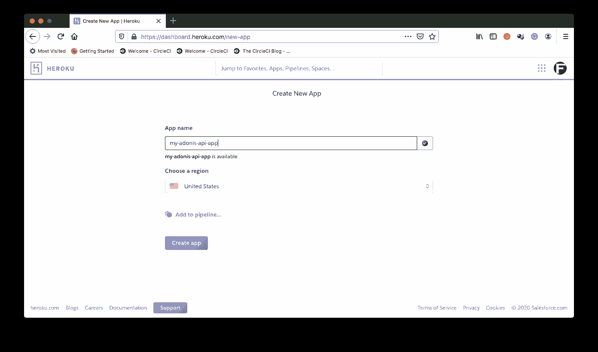

接下来，我们需要创建一个远程`MySQL`实例。幸运的是，我们能够访问 Heroku 上的附加组件。其中一个附加组件是通过 [ClearDB](https://www.cleardb.com/) 的`MySQL`实例。

**注意** : *要在你的 Heroku 应用程序上安装插件，你需要在 Heroku 上设置账单。请确保在您的帐户设置中添加一张付费卡。*

要添加一个`MySQL`插件，进入应用程序的`Resources`选项卡，搜索`MySQL`，如下所示。

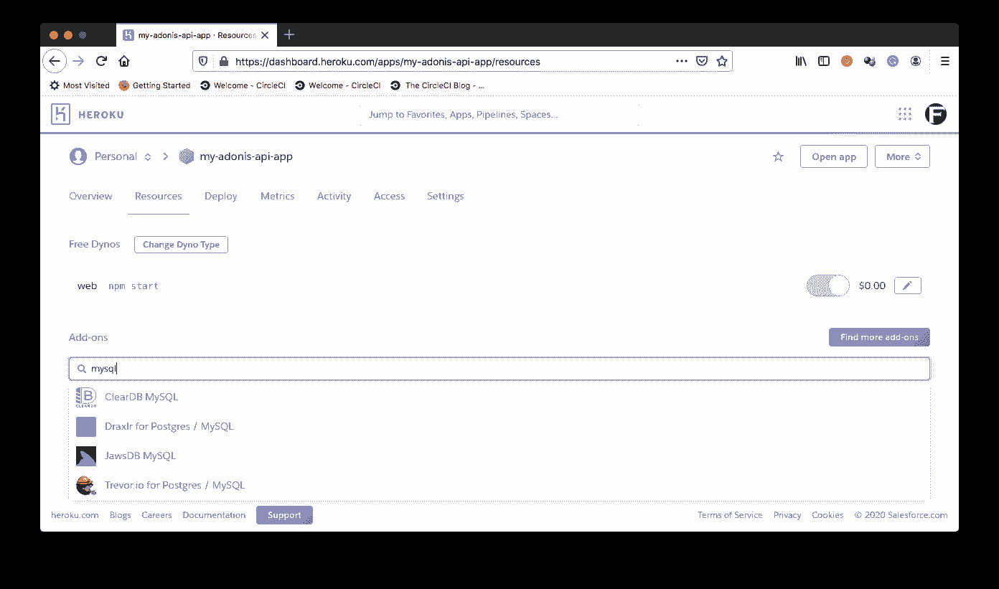

选择 ClearDB 选项来设置`MySQL`实例。在附加弹出屏幕上，选择免费的`Ignite`计划。

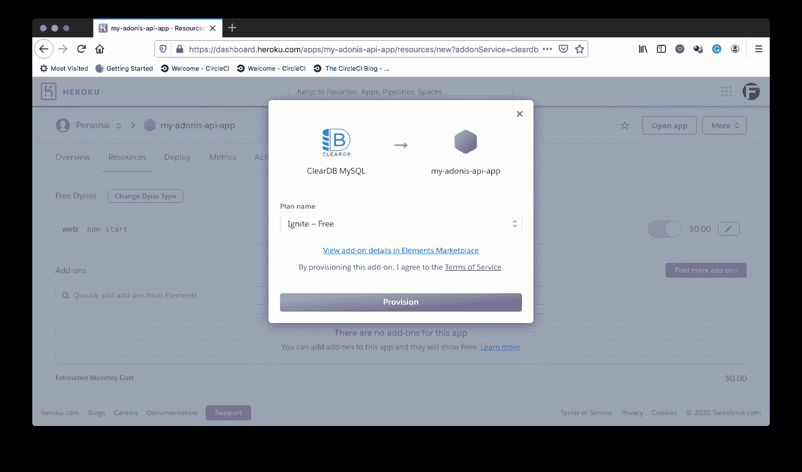

点击 **Provision** 设置数据库。一旦完成，它将被添加到您的附加组件列表中，并且一个新的`CLEARDB_DATABASE_URL`环境变量将被添加到您的应用程序中。它可以在你的申请的`Settings`页面的`Config Vars`部分找到。

在该页面上，单击**显示配置变量**来显示您的环境变量。现在，将另外两个环境变量添加到该列表中:

*   `APP_KEY`:在`.env`文件中找到您的应用程序的 API 密钥
*   `DB_CONNECTION`:为了确保`MySQL`用于生产而不是`SQlite`，将此设置为`mysql`

设置我们的生产数据库的最后一步是在`./config/database.js`中配置我们的`mysql`连接。我们需要`url-parse`包来帮助我们正确解析 ClearDB 上的`MySQL`数据库的连接字符串。我们还需要`mysql`包作为我们的驱动程序来连接到我们的生产数据库。使用以下命令安装这些软件包:

```
npm install url-parse mysql --save 
```

现在，用下面的代码替换`./config/database.js`中的所有内容:

```
"use strict";

const Env = use("Env");

const Helpers = use("Helpers");
const URL = require("url-parse");
const PROD_MYSQL_DB = new URL(Env.get("CLEARDB_DATABASE_URL"));

module.exports = {
  connection: Env.get("DB_CONNECTION", "sqlite"),

  sqlite: {
    client: "sqlite3",
    connection: {
      filename: Helpers.databasePath(
        `${Env.get("DB_DATABASE", "adonis")}.sqlite`
      )
    },
    useNullAsDefault: true,
    debug: Env.get("DB_DEBUG", false)
  },

  mysql: {
    client: "mysql",
    connection: {
      host: Env.get("DB_HOST", PROD_MYSQL_DB.host),
      port: Env.get("DB_PORT", ""),
      user: Env.get("DB_USER", PROD_MYSQL_DB.username),
      password: Env.get("DB_PASSWORD", PROD_MYSQL_DB.password),
      database: Env.get("DB_DATABASE", PROD_MYSQL_DB.pathname.substr(1))
    },
    debug: Env.get("DB_DEBUG", false)
  }
}; 
```

在上面的文件中，我们已经配置了我们的`mysql`连接，以便在生产中使用我们的 ClearDB 实例，并且`sqlite`连接将在我们的本地机器上用作后备。

## 在 CircleCI 上配置项目

我们的下一个任务是在 CircleCI 建立我们的项目。从[将你的项目推送到 GitHub](https://circleci.com/blog/pushing-a-project-to-github/) 开始。

接下来，转到 CircleCI 仪表板上的**添加项目**页面。

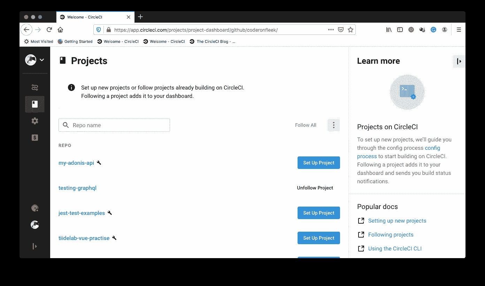

点击**设置项目**开始。这将加载下一个屏幕。

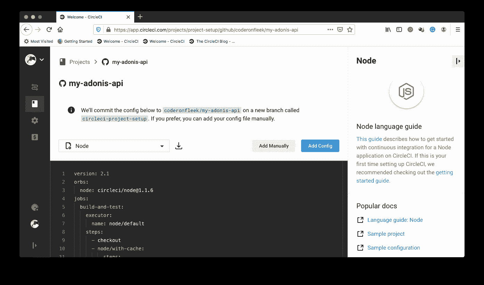

在设置页面上，单击**手动添加**以指示 CircleCI 我们将手动添加配置文件，而不使用显示的示例。接下来，您会得到提示，要么下载管道的配置文件，要么开始构建。

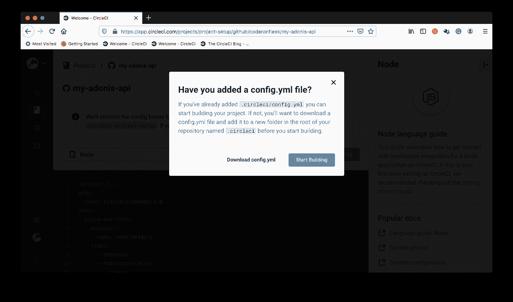

点击**开始构建**开始构建。这个构建将会失败，因为我们还没有设置配置文件。我们稍后会做这件事。

我们需要在 CircleCI 控制台上做的最后一件事是为我们刚刚添加的项目设置环境变量。这将使它能够对我们的 Heroku 应用程序进行身份验证访问，以进行部署。

点击**管道**页面上的**项目设置**进入您的项目设置(确保您的项目是当前选择的项目)。

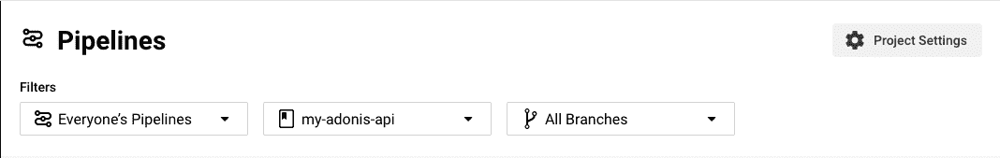

在这个页面上，点击侧面菜单上的**环境变量**。

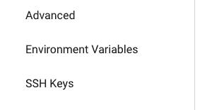

点击**添加环境变量**添加新的环境变量。

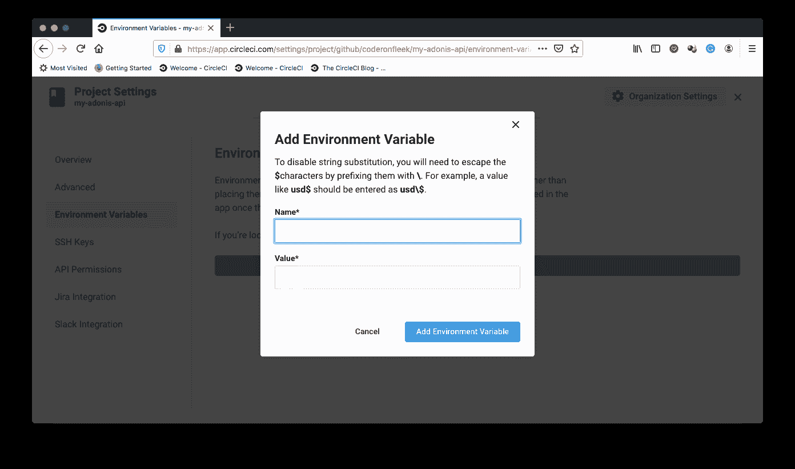

添加以下环境变量:

*   `HEROKU_APP_NAME`:这是您的 Heroku 应用程序的名称(在本例中为`my-adonis-api-app`)
*   `HEROKU_API_KEY`:在**账户设置**下你的 Heroku 账户的**账户**标签下找到你的 Heroku 账户 API key。

添加完成后，您现在已经在 CircleCI 控制台上为部署到 Heroku 做好了一切准备。

## 自动化 API 的部署

我们现在正处于将 Adonis.js API 自动部署到 Heroku 主机平台的最后阶段。在我看来，这是最简单的一步。

我们需要创建一个 Heroku `Procfile`来为 Heroku 提供关于如何部署我们的应用程序的指令。在项目的根目录下，创建一个名为`Procfile`(没有文件扩展名)的文件。将以下命令粘贴到其中:

```
release: ENV_SILENT=true node ace migration:run --force
web: ENV_SILENT=true npm start 
```

在上面的文件中，我们指示 Heroku 使用`node ace migration:run --force`运行我们的迁移。这是对`adonis migration:run`命令的替代。这是有意使用的，因为 Heroku 环境没有像我们在本地计算机上那样全局安装 Adonis CLI。这一步是在 Heroku 的`release`阶段完成的。

接下来，我们使用`npm start`命令指示 Heroku 运行我们的应用程序。

我们在两个命令前都添加了前缀`ENV_SILENT=true`,以抑制一些 Adonis.js 警告，因为它试图查找一个`.env`文件，该文件的用途已经被我们之前在 Heroku 应用程序中设置的环境变量所替代。

现在我们可以编写部署脚本了。在项目的根目录下，创建一个名为`.circleci`的文件夹和一个名为`config.yml`的文件。在`config.yml`文件中，输入以下代码:

```
version: 2.1
orbs:
  heroku: circleci/heroku@0.0.10
workflows:
  heroku_deploy:
    jobs:
      - heroku/deploy-via-git 
```

在上面的配置中，我们引入了 Heroku orb ( `circleci/heroku@0.0.10`)，它自动为我们提供了一组强大的 Heroku 任务和命令。其中一个任务是`heroku/deploy-via-git`，它直接从你的 GitHub repo 将你的应用程序部署到你的 Heroku 账户。这项工作已经负责安装 Heroku CLI、安装项目依赖项和部署应用程序。它还获取我们的 CircleCI 环境变量，以便顺利部署到我们的 Heroku 应用程序。

提交对我们的项目所做的所有更改，并推送到您的 repo 来触发部署。如果遵循了所有的说明，您就已经构建了一个成功的部署管道。

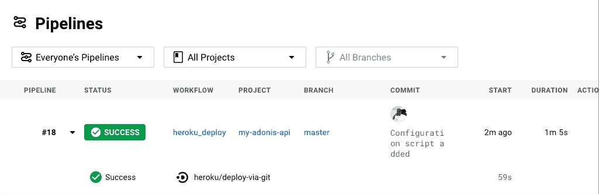

要查看部署的幕后操作，请单击 **build** 。

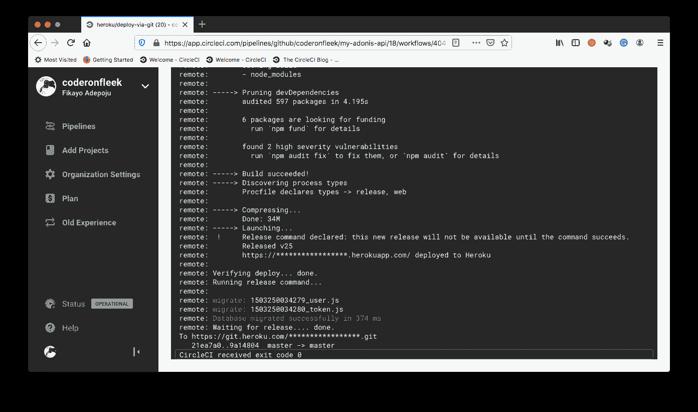

如果您仔细观察，上面的屏幕显示我们的迁移运行成功。要完全确认我们的应用程序已经成功部署，请访问站点`https://[APP_NAME].herokuapp.com`的默认 Heroku 地址。在我们的例子中，这是`https://my-adonis-api-app.herokuapp.com/`。

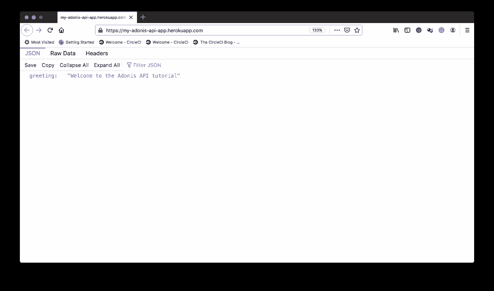

**注意** : *我在浏览器上使用的是 JSON 格式化程序，所以你的显示格式可能会有所不同。*

现在，您可以从 Postman 对您的生产 API 运行一些测试。

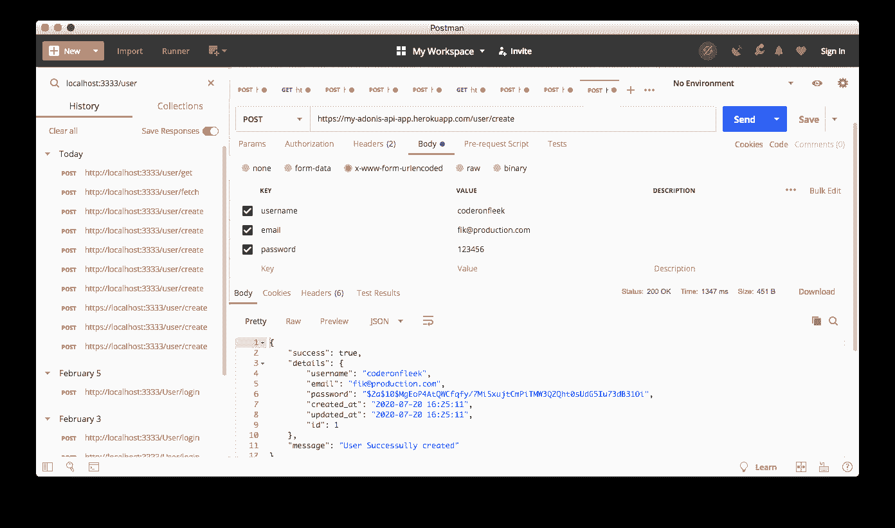

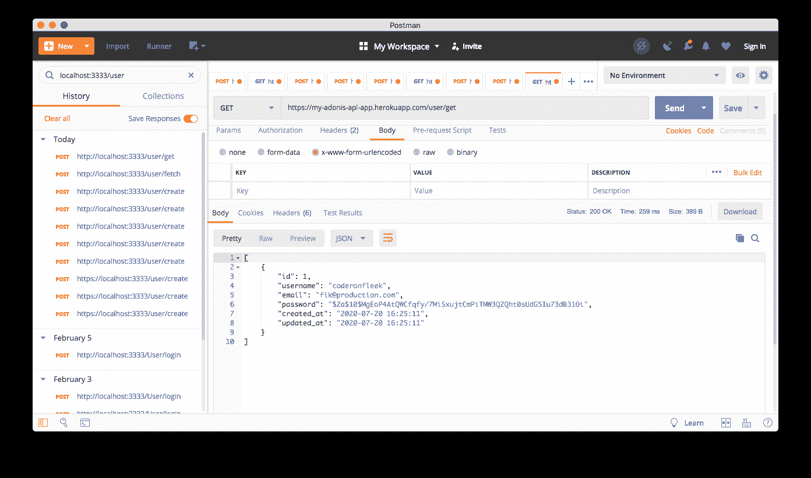

厉害！

从上面的屏幕可以看出，我们现在已经有了一个部署到 Heroku 的工作生产 API。

## 结论

使用 Adonis.js 构建 API 很有趣。在本教程中，我们学习了如何使用 CircleCI 创建一个自动连续部署(CD)管道，以便在每次将代码推送到我们的存储库时，自动将 Adonis.js API 部署到 Heroku。我们还学习了为我们的开发和生产环境配置不同的数据库系统。

编码快乐！

* * *

Fikayo Adepoju 是 LinkedIn Learning(Lynda.com)的作者、全栈开发人员、技术作者和技术内容创建者，精通 Web 和移动技术以及 DevOps，拥有 10 多年开发可扩展分布式应用程序的经验。他为 CircleCI、Twilio、Auth0 和 New Stack 博客撰写了 40 多篇文章，并且在他的个人媒体页面上，他喜欢与尽可能多的从中受益的开发人员分享他的知识。你也可以在 Udemy 上查看他的视频课程。

[阅读 Fikayo Adepoju 的更多帖子](/blog/author/fikayo-adepoju/)