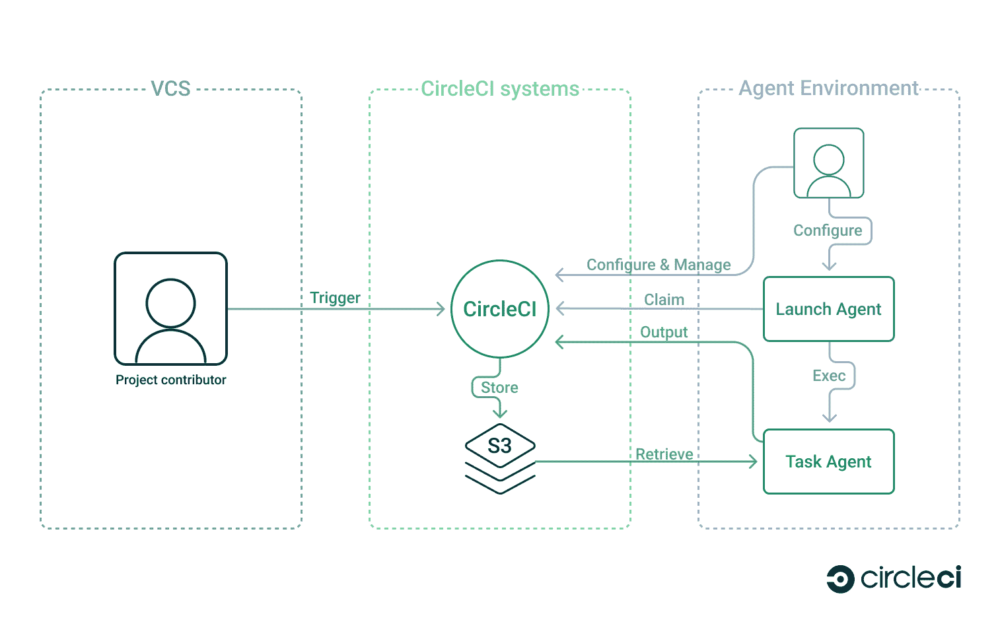
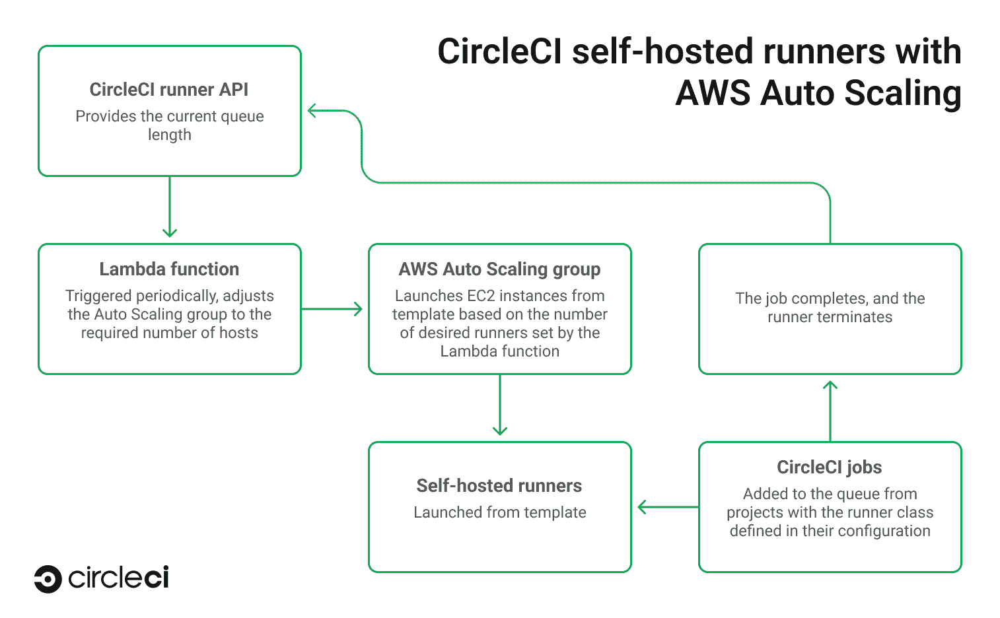
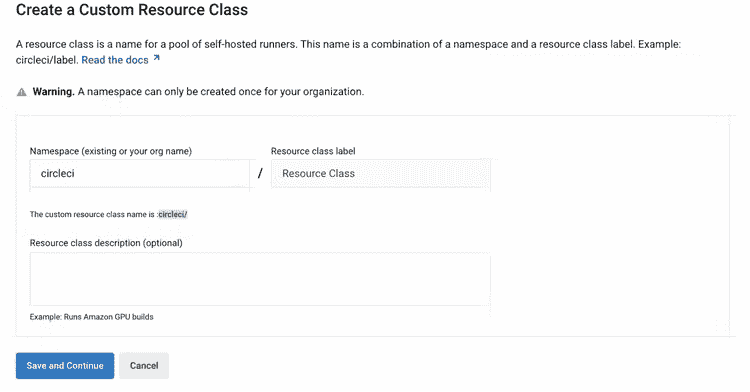
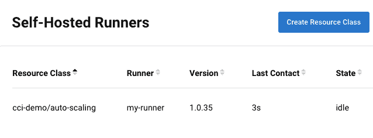
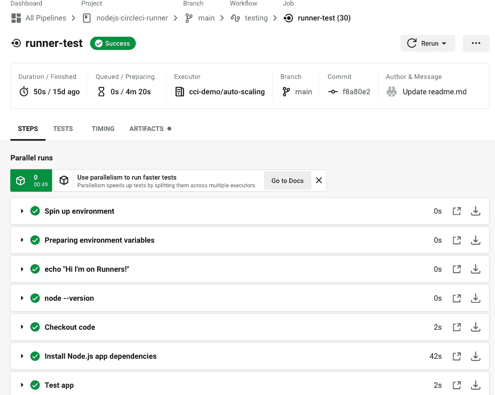
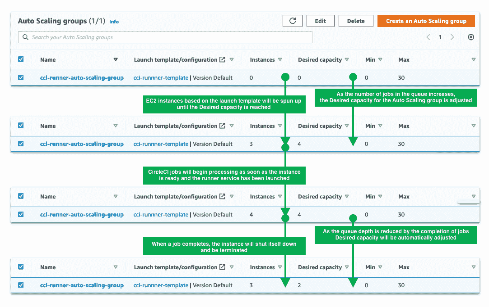

# 自动扩展 AWS 中的自托管跑步者以满足需求| CircleCI

> 原文：<https://circleci.com/blog/autoscale-self-hosted-runners-aws/>

自托管运行器允许您在您的私有云或内部托管您自己的可扩展执行环境，让您能够更加灵活地定制和控制您的 CI/CD 基础架构。具有独特安全或计算需求的团队可以在五分钟内[设置并开始使用自托管跑步者。设置完成后，您的团队可以访问 CircleCI 云平台上可用的一系列流行功能，包括并行性和测试分割、使用 SSH 进行调试，以及直接在 CircleCI UI 中管理自托管跑步者。](https://circleci.com/blog/install-runner-in-five-minutes/)

大多数团队在整个工作日都会经历资源需求的波动，维护未使用的计算能力会导致不必要的成本。为了防止这种情况，您可以实施一个[扩展解决方案](https://circleci.com/docs/runner-scaling/)来根据队列中的作业数量自动启动和关闭自托管运行程序，使您能够按需访问所需的计算能力，而不会有在闲置资源上浪费资金的风险。在本教程中，您将学习如何使用 AWS 自动缩放组(ASG)为 CircleCI 的自托管跑步者设置基本的自动缩放解决方案。如果您对 Kubernetes 集群中的自动伸缩运行器感兴趣，您还可以查看我们的[容器运行器](https://circleci.com/docs/container-runner) /)选项。

## 自托管运行程序—完全由您控制的执行环境

[自托管运行器](https://circleci.com/docs/runner-overview/)提供了一个完全可定制的执行环境。使用自托管运行程序时，CircleCI 会将作业发送到您的计算机，以执行所需的 CI/CD 步骤。如果您的应用程序需要访问内部数据库或敏感资源以进行适当的测试，您可以将它部署到防火墙后的自托管运行程序。



跑步者被设计成尽可能易于配置、管理和部署。下图提供了与您将在本教程中实现的解决方案相关的转轮行为的一些详细信息。更多关于自助跑步者的信息可以在[常见问题](https://circleci.com/docs/runner-faqs/)和[跑步者概念](https://circleci.com/docs/runner-concepts/)页面上找到。

*   **资源类:**自主运行者被分组为唯一命名的`resource classes`，用于识别和分配任务。所有自托管运行程序资源类必须有一个唯一的名称，以确保可以从 CircleCI web 界面中正确地识别和管理运行程序。
*   **计算一致性:**保持自托管运行程序的底层计算在资源类中的一致性是一个最佳实践，每台机器都应该配置相同的架构和环境。这可以防止任何意外行为，并使故障排除更加容易。在本教程中，我们将使用 EC2 模板来确保 runner 代理得到统一配置。
*   **作业排队:**如果没有可用的运行程序，CircleCI 作业将等待，直到所需资源类的自托管运行程序可用。如果您已经实现了自动缩放解决方案，这将为您的自托管运行程序提供启动时间
*   **连接需求**:跑步者为新工作轮询 CircleCI，因此不需要来自互联网的连接。这意味着您不需要配置任何传入防火墙规则或端口转发，并且运行者不需要静态公共 IP 地址。

既然您已经熟悉了使用 CircleCI 自托管运行器的基础知识，那么就让我们开始学习教程吧。

## 通过 AWS 自动缩放组自动缩放自托管跑步者

这个示例实现演示了如何使用 AWS 自动伸缩功能来伸缩自托管运行程序，从而根据需求增加或减少可用的自托管运行程序的数量。

[示例库](https://github.com/sebastian-lerner/nodejs-circleci-runner)包括一个基本的 Node.js 应用程序和一个 [CircleCI 管道配置](https://github.com/sebastian-lerner/nodejs-circleci-runner/blob/main/.circleci/config.yml)来测试它。为了执行这个 CircleCI 管道，您将设置一个自托管的 runner 作为基于 Ubuntu 的 AWS EC2 启动模板。launch template 和 Auto Scaling 组将用于根据由给定运行程序资源类的[运行程序 API](https://circleci.com/docs/runner-api/) 提供的队列深度(队列中的作业数量)值启动实例——所有这些都由定期检查 API 的 Lambda 函数触发。



### 在 CircleCI 中设置 runner 资源类

第一步是创建一个资源类。您可以在 [CircleCI UI](https://circleci.com/blog/install-runner-in-five-minutes/) 中点击一次来完成此操作。



一旦创建了资源类，**记下为它生成的认证令牌**。**不会再播了。**在下一步中，您将需要此令牌向 CircleCI 认证自托管跑步者。

### 准备自托管 runner 安装脚本

接下来，您需要创建一个安装脚本，以便在 AWS 中自动安装和配置自托管运行器。当从下一步中创建的模板启动 AWS 实例时，这个 Bash 脚本将在完成引导后作为 root 用户被调用。您可以在示例存储库中的文件[AWS _ config/install _ runner _ Ubuntu . sh](https://github.com/sebastian-lerner/nodejs-circleci-runner/blob/main/aws_config/install_runner_ubuntu.sh)中找到该脚本的模板。

使用上一步中的资源类和令牌，更新脚本模板中的以下变量:

*   RUNNER_NAME:可以是您希望为您的跑步者指定的任何字母数字名称，因为它将出现在 CircleCI UI 中。
*   AUTH_TOKEN:应该替换为在创建资源类期间出现在 UI 中的资源类令牌。

然后，您需要添加一些步骤，以便在作业运行时安装任何您希望作为执行环境一部分的依赖项或包。这个**必须在**启用和启动 runner 服务之前在脚本**中完成。**

例如，如果您正在开发和测试一个 Node.js 应用程序，您将希望向脚本中添加安装 Node.js 的步骤。

```
# aws_config/install_runner_ubuntu.sh

#------------------------------------------------------------------------------
# Configure your runner environment
# This script must be able to run unattended - without user input
#------------------------------------------------------------------------------
apt install -y nodejs npm 
```

由于该脚本将在启动时为自动缩放组中创建的每个实例执行，因此它必须能够无人值守地运行(无需用户输入)。

在安装脚本中，注意 CircleCI runner 的短暂(`1m` ) idle_timeout 时间。这有助于缩减不再需要的自托管运行程序和实例。

```
# aws_config/install_runner_ubuntu.sh

#------------------------------------------------------------------------------
# Install the CircleCI runner configuration
# CircleCI Runner will be executing as the configured $USERNAME
# Note the short idle timeout - this script is designed for auto-scaling scenarios - if a runner is unclaimed, it will quit and the system will shut down as  defined in the below service definition
#------------------------------------------------------------------------------

cat << EOF >$CONFIG_PATH
api:
 auth_token: $AUTH_TOKEN
runner:
 name: $UNIQUE_RUNNER_NAME
 command_prefix: ["sudo", "-niHu", "$USERNAME", "--"]
 working_directory: /opt/circleci/workdir/%s
 cleanup_working_directory: true
 idle_timeout: 1m
 max_run_time: 5h
 mode: single-task
EOF 
```

并注意相关服务`ExecStopPost`设置中的关机命令。

```
# aws_config/install_runner_ubuntu.sh

#------------------------------------------------------------------------------
# Create the service
# The service will shut down the instance when it exits - that is, the runner  has completed with a success or error
#------------------------------------------------------------------------------

cat << EOF >$SERVICE_PATH
[Unit]
Description=CircleCI Runner
After=network.target
[Service]
ExecStart=$prefix/circleci-launch-agent --config $CONFIG_PATH
ExecStopPost=shutdown now -h
Restart=no
User=root
NotifyAccess=exec
TimeoutStopSec=18300
[Install]
WantedBy = multi-user.target
EOF 
```

这确保了任何没有请求作业的空闲运行者和任何已经完成任务的运行者将被快速终止，以避免浪费资源。

在配置您的服务时，如果您需要进行更改，请参考 [systemd 文档](https://www.freedesktop.org/software/systemd/man/systemd.service.html)。如果服务运行时间超过 5 小时(18300 秒)，前面的示例将终止服务，这与跑步者的`max_run_time`相匹配。

### 创建启动模板

登录 [AWS 管理控制台](https://aws.amazon.com/console/)并导航至管理 EC2 的服务页面。您需要[创建一个启动模板](https://docs.aws.amazon.com/autoscaling/ec2/userguide/create-launch-template.html#create-launch-template-for-auto-scaling)，并填写如下字段:

*   给你的新模板起一个合理的名字，比如 CCI-转轮-模板。
*   选择“提供指导以帮助我设置一个可用于 EC2 自动缩放的模板”复选框
*   对于启动模板内容 AMI，选择**快速启动**，然后选择 **Ubuntu 22.04 LTS** 。
*   选择一个**实例类型**——您需要根据您的需求选择一个。
*   选择一个`Key pair`进行登录。当您需要通过 SSH 登录来对实例进行故障排除时，这很有帮助。
*   对于网络设置和安全组，选择一个现有的安全组或创建一个。明智的做法是只允许来自可信 IP 地址的 SSH，并阻止所有其他传入流量。
    *   自托管 runner 轮询 CircleCI 的新工作，不需要任何传入连接。
*   对于高级网络配置，点击**添加网络接口**并启用**为该接口自动分配公共 IP** 。
*   配置存储—如果您认为需要，可以增加每个实例的硬盘大小。
*   对于高级细节，将 [`install_runner_ubuntu.sh`](https://github.com/sebastian-lerner/nodejs-circleci-runner/blob/main/aws_config/install_runner_ubuntu.sh) 的内容全部复制粘贴到**用户数据字段**中。当实例启动时，该字段的内容将作为 shell 脚本执行[。](https://docs.aws.amazon.com/AWSEC2/latest/UserGuide/user-data.html)
*   其他一切都可以保留默认值。

请注意，资源类认证令牌存储在启动模板中(作为 runner 安装脚本的一部分)，所以不要共享它！

### 创建自动缩放组

接下来，您需要[创建一个自动缩放组](https://docs.aws.amazon.com/autoscaling/ec2/userguide/create-asg-launch-template.html)。为每个部分输入这些值:

*   **第一步:**选择启动模板或配置。
    *   给你的团队起一个合理的名字，比如`cci-runner-auto-scaling-group`。
    *   确保您创建的模板被设置为`Launch template`。
    *   其他一切都保持原样。
*   **步骤 2:** 选择实例启动选项。
    *   对于实例启动选项，请选择一个可用性区域和子网。如果您的实例需要与其他 AWS 资产通信，请将它们分配到适当的区域/子网。
    *   其他一切都保持原样。
*   **第三步:**配置高级选项。
    *   让一切保持原样。
*   **步骤 4:** 配置组大小和扩展策略。
    *   将所需容量、最小容量和最大容量设置为 0。在后续步骤中创建的 Lambda 函数将更新这些值，以满足您的缩放要求。
    *   选中“启用扩展保护”复选框，以防止实例过早终止。作业可能会不按提交顺序完成，从而降低队列深度，并导致自动扩展组终止较旧的实例，即使它们可能不是已完成任务的自托管运行程序。
    *   其他一切都保持原样。
*   **跳过步骤 5 和 6。**
*   **第七步:**复习。
    *   检查您的配置并保存。

一旦启动，实例将负责自己的生命周期。自托管运行程序将在基于`idle_timeout flag`的短暂空闲时间后终止。因为运行程序处于[单任务模式](https://circleci.com/docs/runner-config-reference/#runner-mode/)，所以自托管运行程序也将在作业完成时优雅地终止(成功或失败)。我们还将服务配置为在实例退出时关闭实例。

### 创建 IAM 策略和角色

Lambda 函数需要权限来监控队列和更改自动缩放参数。您需要设置一个身份和访问管理(IAM)策略和相关角色来授予这些权限。

[创建一个具有所需权限的策略](https://docs.aws.amazon.com/IAM/latest/UserGuide/access_policies_create-console.html)。您可以从我们的示例存储库中的文件[AWS _ config/lambda _ iam . JSON](https://github.com/sebastian-lerner/nodejs-circleci-runner/blob/main/aws_config/lambda_iam.json)或者从下面的代码块中复制并粘贴策略。该策略将授予更新自动缩放组和从 AWS 机密管理器读取机密的权限，这是 Lambda 函数所需的两个权限。

```
{
    "Version": "2012-10-17",
    "Statement": [
        {
            "Sid": "VisualEditor0",
            "Effect": "Allow",
            "Action": "autoscaling:UpdateAutoScalingGroup",
            "Resource": "*"
        },
        {
            "Sid": "VisualEditor1",
            "Effect": "Allow",
            "Action": "secretsmanager:GetSecretValue",
            "Resource": "*"
        }
    ]
} 
```

一旦建立了策略，[为您的 Lambda 函数创建一个新角色](https://docs.aws.amazon.com/IAM/latest/UserGuide/id_roles_create_for-service.html#roles-creatingrole-service-console),并将新策略分配给该角色。

同样，保持命名的一致性，以便您可以在以后轻松地找到和识别 AWS 组件。给 IAM 组件起一个合理的名字，比如:`cci-runner-lambda-iam-policy`和`cci-runner-lambda-iam-role`。

### 创造(和保持)秘密

AWS secrets manager 提供了一种安全的方式来存储 API 密钥和其他敏感信息，以便在 Lambda 函数中使用。机密以键/值对的形式存储。[用这些选项创建一个秘密](https://docs.aws.amazon.com/secretsmanager/latest/userguide/create_secret.html):

*   **第一步:**选择密件类型。
    *   选择**其他类型的密码**。
    *   添加以下键/值对:
        *   `resource_class_`:CCI 跑步者的资源类，格式为用户名/类名。
        *   这将是一个用于轮询 runner API 的 CircleCI [个人令牌](https://circleci.com/docs/managing-api-tokens/)——它不是上面安装脚本中使用的 runner 令牌。
    *   将加密密钥设置为`aws/secretsmanager`。
*   **第二步:**配置你的秘密。
    *   给你的秘密取一个合理的名字，比如 CCI-朗纳-拉姆达-秘密。
    *   让其余的保持原样。
*   **第三步:**配置旋转—可选。
*   **第四步:**复习。
    *   查看并保存您的秘密。
    *   此时不需要复制和粘贴生成的代码——它已经包含在存储库中的示例 Lambda 函数中。请务必记下机密名称和区域。

### 创建 Lambda 函数

AWS Lambda 函数是执行代码的[无服务器函数](https://circleci.com/blog/serverless-vs-containers/)。此示例使用一个按计划触发的 Lambda 函数来运行一个 Python 脚本，该脚本检查 CircleCI runner API 并改变自动缩放组以增加或减少运行实例的数量。[从头开始创建一个 Lambda 函数](https://docs.aws.amazon.com/lambda/latest/dg/getting-started.html#getting-started-create-function)，配置如下:

*   给你的函数起一个合理的名字，比如`cci-runner-lambda-function`。
*   将运行时间设置为`Python 3.8`。
*   将架构设置为`x64_64`。
*   点击**执行角色**，然后**使用已有的角色**。选择您之前创建的 IAM 角色。

将[aws _ config/lambda _ function . py](https://github.com/sebastian-lerner/nodejs-circleci-runner/blob/main/aws_config/lambda_function.py)文件的内容复制并粘贴到 AWS 控制台的函数源中。

```
# aws_config/lambda_function.py

import json, urllib3, boto3, base64, os

# This script polls the number of unclaimed tasks for a Circle CI runner class, and sets the parameters for an AWS Auto Scaling group 
# It uses the CircleCI runner API https://circleci.com/docs/2.0/runner-api/
# It requires the included IAM role and should be triggered every minute using an EventBridge Cron event

# Retrieve environment variables
secret_name   = os.environ['SECRET_NAME'] 
secret_region = os.environ['SECRET_REGION']
auto_scaling_max = os.environ['AUTO_SCALING_MAX'] 
auto_scaling_group_name = os.environ['AUTO_SCALING_GROUP_NAME']
auto_scaling_group_region = os.environ['AUTO_SCALING_GROUP_REGION']

# Function to retrieve secrets from AWS Secrets manager
# https://aws.amazon.com/secrets-manager/
def get_secret(secret_name, region_name):
    session = boto3.session.Session()
    client = session.client(
        service_name='secretsmanager',
        region_name=region_name
    )

    get_secret_value_response = client.get_secret_value(
        SecretId=secret_name
    )

    if 'SecretString' in get_secret_value_response:
        secret = get_secret_value_response['SecretString']
        return(secret)
    else:
        decoded_binary_secret = base64.b64decode(get_secret_value_response['SecretBinary'])
        return(decoded_binary_secret)

# Make a HTTP GET request with the given URL and headers
def get_request(url, headers):
    http = urllib3.PoolManager()
    r = http.request('GET', url, headers=headers)
    r_json = json.loads(r.data.decode("utf-8"))
    return(r_json)

# The handler function - is executed every time the Lambda function is triggered
def lambda_handler(event, context):
    # Get secrets
    secrets = json.loads(get_secret(secret_name, secret_region))

    # Configure Runner API endpoint https://circleci.com/docs/2.0/runner-api/#endpoints
    endpoint_url = 'https://runner.circleci.com/api/v2/tasks?resource-class=' + secrets['resource_class']
    headers = {'Circle-Token': secrets['circle_token']}

    # Get result from API endpoint
    result = get_request(endpoint_url, headers)

    # Configure Runner API endpoint https://circleci.com/docs/2.0/runner-api/#endpoints
    endpoint_url = 'https://runner.circleci.com/api/v2/tasks/running?resource-class=' + secrets['resource_class']
    headers = {'Circle-Token': secrets['circle_token']}

    # Get result from API endpoint
    result_running = get_request(endpoint_url, headers)

    total_desired = int(result["unclaimed_task_count"]) + int(result_running["running_runner_tasks"]) 

    # Update the auto scaling group with a desired number of instances set to the number of jobs in the queue, or the maximum, whichever is smallest
    instances_min = 0
    instances_max = int(auto_scaling_max)
    instances_desired = min(total_desired, int(auto_scaling_max))
    # Set the Auto Scaling group configuration
    client = boto3.client('autoscaling', region_name=auto_scaling_group_region)
    client.update_auto_scaling_group(
        AutoScalingGroupName=auto_scaling_group_name,
        MinSize=instances_min,
        MaxSize=instances_max,
        DesiredCapacity=instances_desired
    )  

    # Lambda functions should return a result, even if it isn't used
    return result["unclaimed_task_count"] 
```

在 Lambda 函数的 Configuration 选项卡下，导航到*环境变量*，然后编辑并添加以下键/值对:

*   `SECRET_NAME`:上面创建的秘密的名称。
*   `SECRET_REGION`:上面那个秘密的区域。
*   `AUTO_SCALING_MAX`:要加速旋转的最大实例数，为整数。
    *   我们建议将最大值设置为 CircleCI 计划中自托管运行程序的并发限制。
*   `AUTO_SCALING_GROUP_NAME`:自动缩放组的名称。
*   `AUTO_SCALING_GROUP_REGION`:自动缩放组的区域。

其他一切都保留默认值。

### 按计划触发 Lambda 功能

Lambda 函数可以通过多种方式触发。在这种情况下，它将按计划执行[。我们建议每分钟调用一次该函数来检查队列深度，并及时做出适当的调整。](https://docs.aws.amazon.com/eventbridge/latest/userguide/eb-run-lambda-schedule.html)

要进行设置，进入 Lambda 函数编辑屏幕，点击**添加触发器**。搜索并选择**event bridge(cloud watch Events)**，然后选择**创建新规则**。填写以下详细信息:

*   给你的规则起个合理的名字，比如`cci-runner-scheduled-trigger`。
*   将规则类型设置为**调度表达式**。
*   输入值`cron(0/1 * * * ? *)`每分钟触发一次功能。

点击**添加**完成定时触发的设置。

### 测试和部署

这样，您的自动缩放流道解决方案的所有移动部件都就位了。现在您可以将它添加到您的 CircleCI 配置中并开始使用它了！

在 Lambda 函数编辑屏幕中，返回到代码选项卡并单击 **Deploy** 。就是这样！一切都在运行，随时可以使用。

要进行测试，请转到测试选项卡。让一切保持原样(防止测试被保存)。点击**测试**。

结果将是成功或失败，如果需要，您将能够调试您的函数代码。如果一切恢复正常，您就可以开始运行了。

如果您希望监控您的函数，您可以使用 Lambda 中的 monitor 选项卡来确保您的函数按照您在上一节中设置的时间表运行。

### 在自动缩放的自托管运行程序上运行 CircleCI 作业

要在新的自动缩放资源类上运行 CircleCI 作业，首先需要将该资源类添加到您的 [CircleCI 配置](https://circleci.com/docs/configuration-reference/#self-hosted-runner/)文件中。

[。示例存储库中的 circleci/config.yml](https://github.com/bgmorton/nodejs-circleci-runner/blob/main/.circleci/config.yml) 文件使用了`machine`和`resource_class`选项。

```
# .circleci/config.yml

version: 2.1

workflows:
  testing:
    jobs:
      - runner-test

jobs:
  runner-test:
    machine: true
    resource_class: NAMESPACE/-NAMENAME # Update this to reflect your self-hosted runner resource class details 
    steps:
      - run: echo "Hi I'm on Runners!"
      - run: node --version
      - checkout
      - run:
          command: npm install
          name: Install Node.js app dependencies
      - run:
          command: npm run test
          name: Test app 
```

一旦您运行了一个作业，自托管的运行程序将在启动时出现在 CircleCI web 界面中。当作业出现在队列中时，AWS Lambda 功能将触发自动缩放组来增加其容量。当实例准备好时，作业将从 CircleCI 发送到 runner 来执行。



您可以通过 CircleCI web 界面监控自托管跑步者的状态。完成后，运行器将终止它正在运行的实例，自动缩放组将减少所需的实例数量，以匹配新的队列长度。


您的管道结果将与您的 CircleCI 云作业一起发送回 CircleCI UI。



在 AWS 端，您将能够看到随着队列深度的变化和作业的完成，Lambda 函数正在调整自动缩放组。



## CircleCI 是一个灵活的 CI/CD 平台，以您的方式工作

使用自托管运行程序，您可以完全控制 CI/CD 管道，包括执行环境以及存储和处理数据的位置。

CircleCI 鼓励 DevOps 最佳实践——但它并没有规定你应该如何做事。您需要能够发挥团队的优势，利用您的工具链所允许的全部灵活性，同时保持合规性和安全性。您可以从使用预构建的执行环境开始，随着您的需求变得更加专业化，部署您自己定制的、可扩展的自托管运行程序，并通过简单的配置更改开始使用它们，而不必彻底检查您的整个 CI/CD 工具链。

今天你可以通过[注册一个免费计划](https://circleci.com/signup/)开始使用 CircleCI。您的免费计划提供了开始构建您自己的自动化 CI/CD 管道来测试和部署您的代码所需的一切。所有计划中都包含自托管跑步者，当您准备开始尝试 CircleCI 提供的高级功能时，您可以使用这些跑步者。

您可以通过以下资源了解有关在 CircleCI 管道中使用自托管运行器的更多信息: