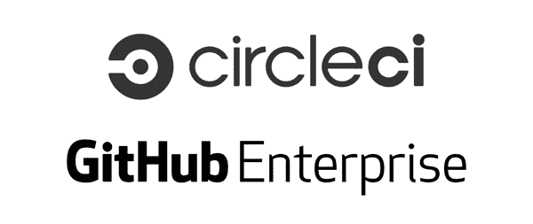

# 在您的防火墙后面:CircleCI Enterprise 现已上市

> 原文：<https://circleci.com/blog/behind-your-firewall-circleci-enterprise-available-today/>

**来自出版商的说明:**您已经找到了我们的一些旧内容，这些内容可能已经过时和/或不正确。尝试在[我们的文档](https://circleci.com/docs/)或[博客](https://circleci.com/blog/)中搜索最新信息。

* * *

在过去的四年里，我们已经帮助数千个开发团队更快地发布了更好的应用。在听到客户想要在他们自己的防火墙后使用 CircleCI 的方法后，我们开始着手使之成为可能。我们在几十个客户中测试了 [CircleCI Enterprise](https://circleci.com/enterprise/) ，我们很兴奋地宣布，从今天起， [CircleCI Enterprise 正式上市](http://www.marketwired.com/press-release/-2081778.htm)。

CircleCI 企业用户可以访问 CircleCI Insights，这是一个交互式可视化仪表板，有助于清晰、实时地理解构建数据。

## 如何知道 CircleCI 企业是否适合你

选择 CircleCI Enterprise 而不是 CircleCI.com 的四个最常见的原因是:

*   **GitHub 企业支持。**使用 GitHub Enterprise 的组织是完美的候选人，因为我们提供与 GitHub Enterprise 的现成集成。

*   **定制的执行环境。** CircleCI Enterprise 允许您定制运行您的构建的容器，*创建您的团队需要的确切环境*。

*   **调优构建资源。**使用 CircleCI Enterprise，您可以控制您的构建车队，并可以调整分配给容器的 CPU 和 RAM。

*   **监管和政策考虑。**组织可能会面临阻止代码脱离其直接控制的法规要求。其他组织出于各种原因制定政策，阻止他们的团队使用由第三方管理的基于云的服务。有了 CircleCI，企业可以测试、部署和管理构建，所有这些都在他们自己的防火墙后面。

## 到目前为止的故事…

我们将继续我们的使命，让软件团队更有生产力，我们一直在寻找新的方法来帮助团队将代码转化为可靠的产品。CircleCI Enterprise 是我们产品套件的最新成员，为团队利用自动化测试和部署的能力提供了另一种选择。

我们喜欢听软件团队是如何工作的，以及我们可以做些什么来帮助您提高流程的可靠性和吞吐量，所以请在[sayhi@circleci.com](mailto:sayhi@circleci.com)给我们留言，分享您的想法或与我们讨论 CircleCI 如何帮助您的团队。