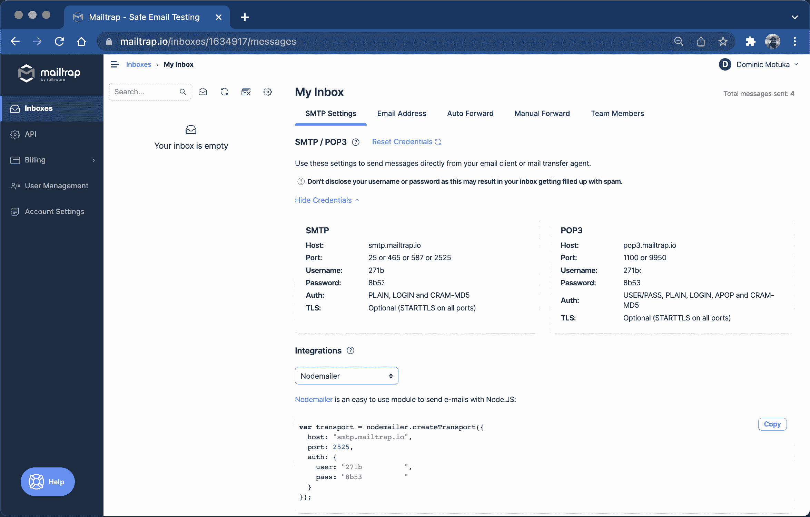
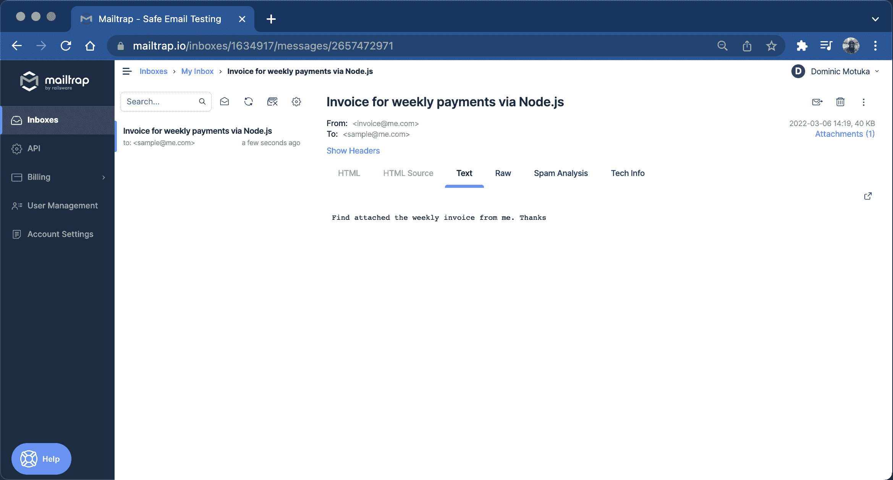
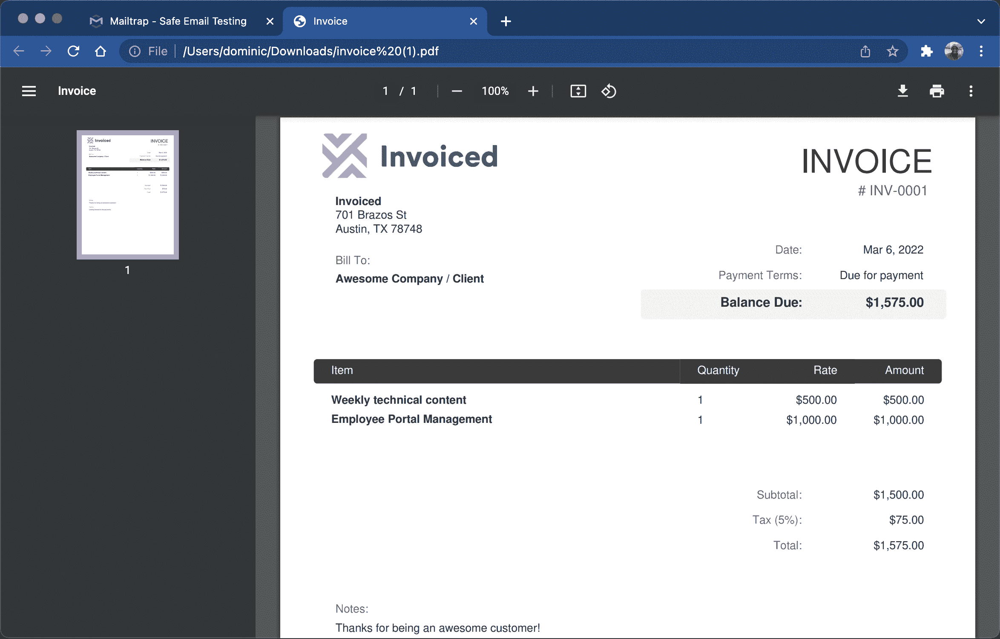
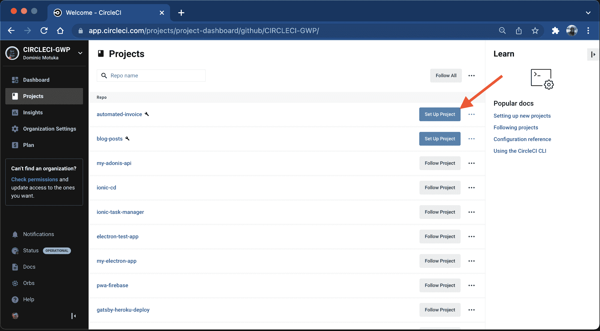
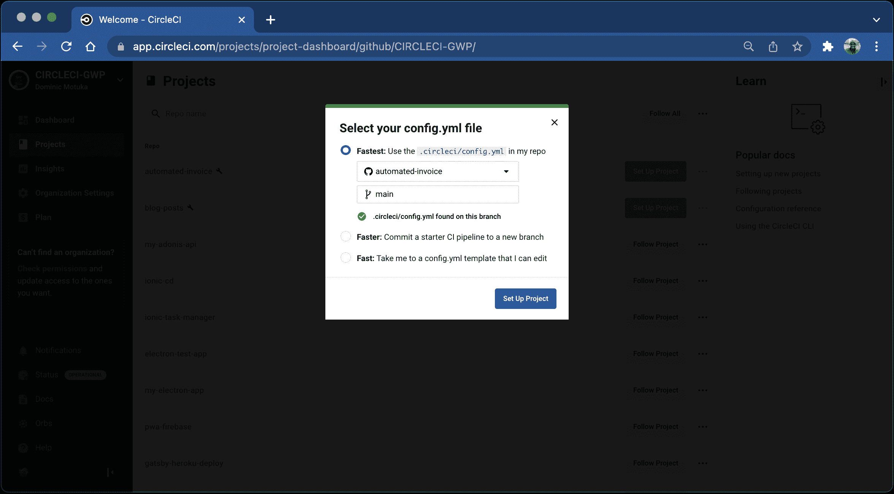
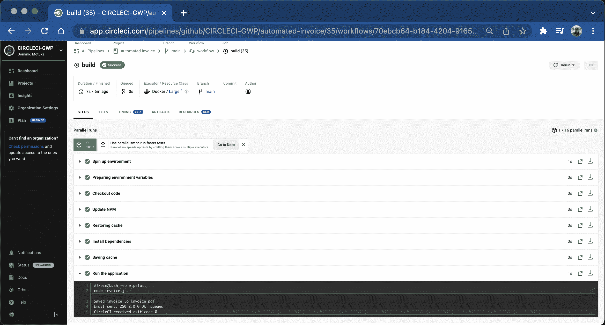
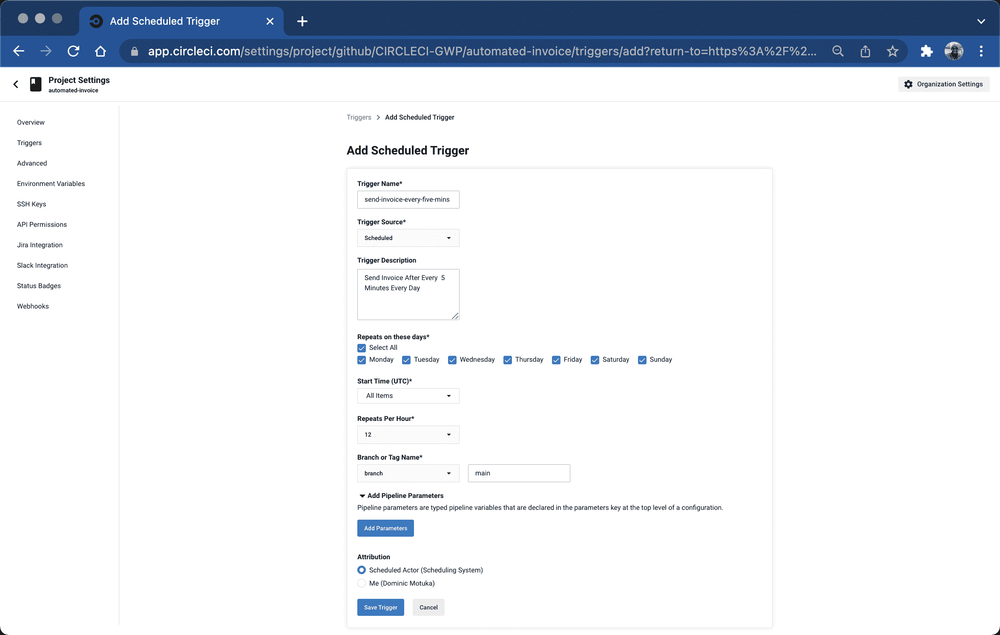
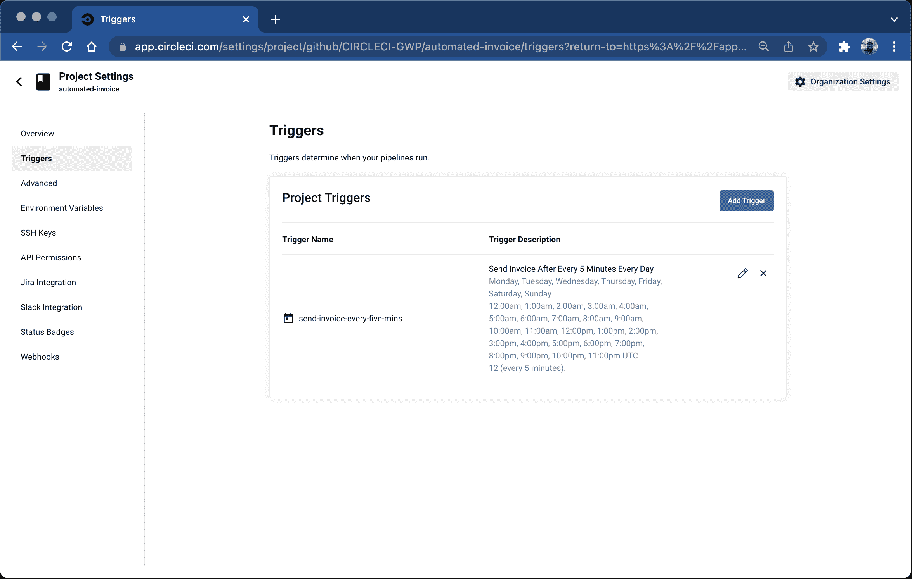
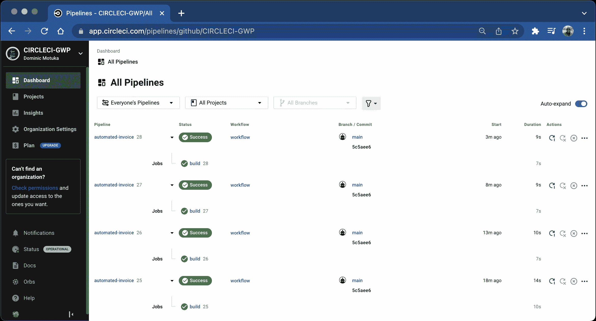
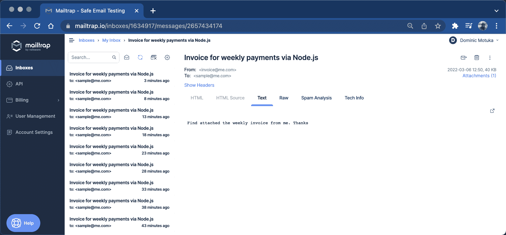

# 构建自动发票生成器应用程序| CircleCI

> 原文：<https://circleci.com/blog/build-automated-invoice-app/>

> 本教程向您展示如何:
> 
> 1.  使用 API 生成发票并将其发送给客户
> 2.  将计划管道添加到您的配置中
> 3.  使用项目设置定义计划触发器

作为一名软件工程师和技术内容创作者，我与许多公司签订了许多不同的合同。为了获得工作报酬，大多数公司都要求我开发票。有时，他们希望每天都有，在周末，甚至在项目已经完成的时候。

给我的客户寄一张发票是至关重要的，因为它决定了我何时以及是否能按时拿到钱。如果这听起来像是一个重复的任务，会占用我大量的工作时间，那么你是对的。为了集中精力完成任务，我决定建立一个自动化的发票工作流程。

在本教程中，我将向您展示如何使用[发票生成器 API](https://invoice-generator.com/developers) 和[调度管道](https://circleci.com/blog/benefits-of-scheduling-ci-pipelines/)有效地生成发票并将其发送给客户。

## 先决条件

对于本教程，您需要:

## 克隆演示应用程序

对于本教程，我已经建立了一个简单的 Node.js 项目，并在`invoice.js`文件中定义了一个现有的`generateInvoice()`函数。要开始，请运行以下命令:

```
git clone https://github.com/yemiwebby/automated-invoice-starter.git automated-invoice 
```

这会将项目克隆到开发目录中的一个`automated-invoice`文件夹中(或者当您从运行命令时)。

接下来，转到新创建的项目并安装它的依赖项:

```
cd automated-invoice

npm install 
```

## 在本地生成发票

要确认项目按预期运行，请在本地运行应用程序。通过运行以下命令生成发票:

```
node invoice.js 
```

输出应该显示一张发票已经生成并保存在您的项目目录中。

```
Saved invoice to invoice.pdf 
```

现在，您可以设置将发票作为附件发送。

## 将发票作为附件发送

从部署在互联网上的任何应用程序发送电子邮件都需要 SMTP 服务器和一些其他配置。对于本教程，我使用了 Mailtrap，它提供免费的 SMTP 服务来试验电子邮件发送功能。如果您还没有这样做，请在此处创建一个[邮件陷阱帐户。](https://mailtrap.io/register/signup)

接下来，转到[收件箱](https://mailtrap.io/inboxes)页面查看您的 SMTP 和 POP3 凭证。



### 创建环境变量

使用以下命令在项目的根目录下创建一个`.env`文件:

```
cp .env.sample .env 
```

用 mailtrap.io 仪表板上的值替换占位符`MAILTRAP_USERNAME`和`MAILTRAP_PASSWORD`。

### 将发票作为附件发送电子邮件

该应用程序使用 [nodemailer 模块](https://www.npmjs.com/package/nodemailer)发送带有发票附件的电子邮件。该模块已经安装。你需要做的就是打开`invoice.js`文件，用下面的代码替换它的内容:

```
var https = require("https");
var fs = require("fs");
require("dotenv").config();
var nodemailer = require("nodemailer");

const generateInvoice = (invoice, filename, success, error) => {
  var postData = JSON.stringify(invoice);
  var options = {
    hostname: "invoice-generator.com",
    port: 443,
    path: "/",
    method: "POST",
    headers: {
      "Content-Type": "application/json",
      "Content-Length": Buffer.byteLength(postData),
    },
  };
  var file = fs.createWriteStream(filename);
  var req = https.request(options, function (res) {
    res
      .on("data", function (chunk) {
        file.write(chunk);
      })
      .on("end", function () {
        file.end();
        if (typeof success === "function") {
          success();
          sendEmail(filename);
        }
      });
  });
  req.write(postData);
  req.end();
  if (typeof error === "function") {
    req.on("error", error);
  }
};

const sendEmail = (file) => {
  var transport = nodemailer.createTransport({
    host: "smtp.mailtrap.io",
    port: 2525,
    auth: {
      user: process.env.MAILTRAP_USERNAME,
      pass: process.env.MAILTRAP_PASSWORD,
    },
  });
  var mailOptions = {
    from: "invoice@me.com",
    to: "sample@me.com",
    subject: "Invoice for weekly payments via Node.js",
    text: "Find attached the weekly invoice from me. Thanks",
    attachments: [
      {
        path: file,
      },
    ],
  };
  transport.sendMail(mailOptions, function (error, info) {
    if (error) {
      console.log(error);
    } else {
      console.log("Email sent: " + info.response);
    }
  });
};

let invoice = {
  logo: "http://invoiced.com/img/logo-invoice.png",
  from: "Invoiced\n701 Brazos St\nAustin, TX 78748",
  to: "Awesome Company / Client",
  currency: "usd",
  number: "INV-0001",
  payment_terms: "Due for payment",
  items: [
    {
      name: "Weekly technical content",
      quantity: 1,
      unit_cost: 500,
    },
    {
      name: "Employee Portal Management",
      quantity: 1,
      unit_cost: 1000,
    },
  ],
  fields: {
    tax: "%",
  },
  tax: 5,
  notes: "Thanks for being an awesome customer!",
  terms: "Looking forward to the payments",
};

generateInvoice(
  invoice,
  "invoice.pdf",
  () => console.log("Saved invoice to invoice.pdf"),
  (err) => console.log(err)
); 
```

对这个代码块的更改通过要求`nodemailer`模块来修改文件。创建一个`sendEmail()`函数，它将生成的文件作为参数，并作为附件发送。附件被发送给用`mailOptions`变量定义的接收者。`*generateInvoice()*`函数调用`sendEmail()`方法并传递适当的参数给它。

现在，使用以下命令再次运行应用程序:

```
node invoice.js 
```

输出是:

```
Saved invoice to invoice.pdf
Email sent: 250 2.0.0 Ok: queued 
```

此输出显示发票已成功生成并发送。前往您的 [Mailtrap 收件箱](https://mailtrap.io/inboxes)查看邮件。



点击**附件**打开发票。



## 添加 CircleCI 配置文件

接下来，您需要为 CircleCI 添加管道配置，以自动创建和发送发票。

在项目的根目录下，创建一个名为`.circleci`的文件夹。在该文件夹中，创建一个名为`config.yml`的文件。在新创建的文件中，添加以下配置:

```
version: 2.1
jobs:
  build:
    working_directory: ~/project
    docker:
      - image: cimg/node:17.4.0
    steps:
      - checkout
      - run:
          name: Update NPM
          command: "sudo npm install -g npm"
      - restore_cache:
          key: dependency-cache-{{ checksum "package-lock.json" }}
      - run:
          name: Install Dependencies
          command: npm install
      - save_cache:
          key: dependency-cache-{{ checksum "package-lock.json" }}
          paths:
            - ./node_modules
      - run:
          name: Run the application
          command: node invoice.js
          background: true 
```

该脚本获取 Node.js Docker 映像并安装项目的依赖项。最后一步运行命令来生成并发送发票。

接下来，在 GitHub 上建立一个存储库，并将项目链接到 CircleCI。查看[将项目推送到 GitHub](https://circleci.com/blog/pushing-a-project-to-github/) 以获得分步说明。

登录您的 CircleCI 帐户。如果你注册了你的 GitHub 账户，你所有的库都可以在你项目的仪表盘上看到。

点击**为您的`automated-invoice`项目设置项目**



将提示您几个关于配置文件的选项。选择`use the .circleci/config.yml in my repo`选项。在 GitHub 上输入你的代码所在的分支名称，然后点击**设置项目**按钮。



您的第一个工作流将开始运行，但会失败。这是因为您没有提供邮件陷阱的配置详细信息。你现在可以弥补了。

点击**项目设置**按钮，然后点击**环境变量**。添加这两个新变量:

*   `MAILTRAP_USERNAME`
*   `MAILTRAP_PASSWORD`

重新运行工作流。将会生成发票并发送电子邮件。



## 设置计划的管道

通常，一旦您将代码推送到存储库，CircleCI 工作流就会自动执行。但是，对于本教程，目标是以特定的时间间隔运行这个管道，最好是每周一次。使用 CircleCI 上的调度管道，您可以像配置一个`cron`作业一样配置您的管道，并按时间间隔运行它。有两种方法可以做到这一点:

*   使用 API
*   使用项目设置

对于本教程，我们将使用项目设置来配置管道触发器。从您的项目中，进入**项目设置**。从左侧工具条的菜单中点击**触发器**。

在触发器页面上，点击**添加预定触发器**。填写触发器表单以配置管道。



以下是这些字段的输入内容:

*   `Trigger name`是唯一的时间表名称。
*   `Trigger Source`表示将触发管道的源(在本教程中为`scheduled`)。
*   `Trigger description`是一个可选字段，可用于添加有关触发器的更多信息。
*   `Timetable`定义运行预定管道的时间和频率。
*   `Pipeline Parameters`是在参数键中声明的变量。它们可用于检查何时运行管道，但是本教程不需要它们。
*   `Attribution`指定与日程相关联的用户。它可以是中立演员的系统。或者它可以是当前的，这将获取您当前用户的权限(根据您正在使用的令牌)。

这些设置将管道配置为每天每五分钟运行一次。点击**保存触发器**将其激活。

您可以从“项目触发器”页面查看创建的触发器。



返回到管道页面，等待至少五分钟。你的管道会被 CircleCI 系统触发。



您也可以检查您的邮件陷阱收件箱，以查看生成的发票。



## 结论

在本教程中，您能够快速生成一张发票，并毫不费力地将其发送给特定的收件人。为了实现开票流程的自动化，我们使用了 CircleCI 的预定管道功能。

因为您在这里实现的内容很少，所以它可以很容易地包含在现有项目或新项目中。这种工作流程的另一个优点是，当 CircleCI 自动处理发票时，您可以保持项目的持续集成和部署。这一新增功能消除了繁琐的手动任务并实现了自动化，因此您可以将更多时间用于开发和部署应用程序。

我希望本教程对你有所帮助。完整的源代码可以在 GitHub 的[这里找到。](https://github.com/CIRCLECI-GWP/automated-invoice)

* * *

[Oluyemi](https://twitter.com/yemiwebby) 是一名拥有电信工程背景的技术爱好者。出于对解决用户日常遇到的问题的浓厚兴趣，他冒险进入编程领域，并从那时起将他解决问题的技能用于构建 web 和移动软件。Oluyemi 是一名热衷于分享知识的全栈软件工程师，他在世界各地的几个博客上发表了大量技术文章和博客文章。由于精通技术，他的爱好包括尝试新的编程语言和框架。

* * *

Oluyemi 是一名拥有电信工程背景的技术爱好者。出于对解决用户日常遇到的问题的浓厚兴趣，他冒险进入编程领域，并从那时起将他的问题解决技能用于构建 web 和移动软件。Oluyemi 是一名热衷于分享知识的全栈软件工程师，他在世界各地的几个博客上发表了大量技术文章和博客文章。作为技术专家，他的爱好包括尝试新的编程语言和框架。

[阅读更多 Olususi Oluyemi 的帖子](/blog/author/olususi-oluyemi/)