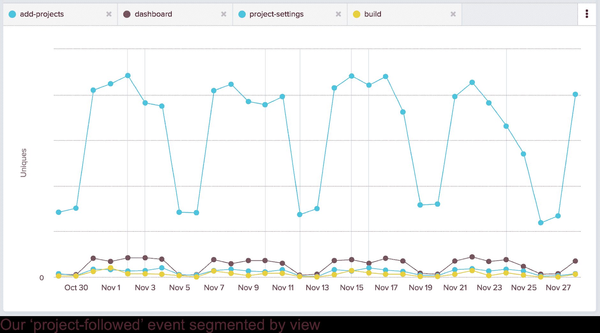
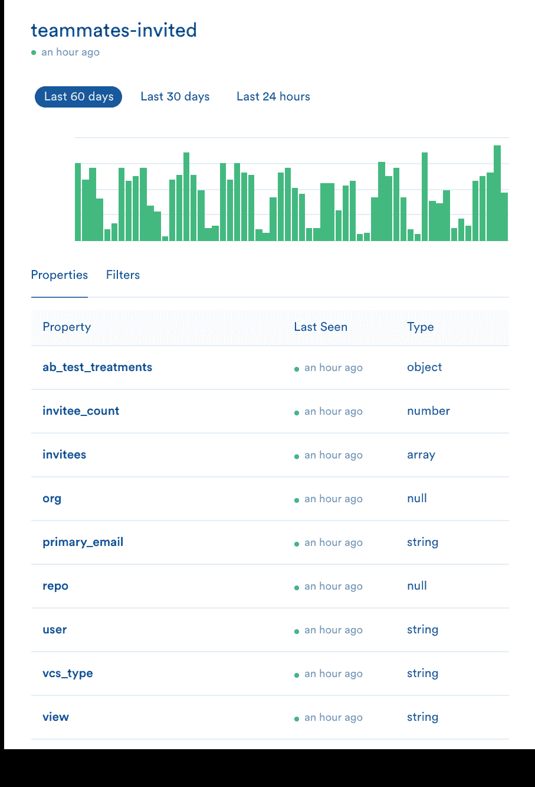
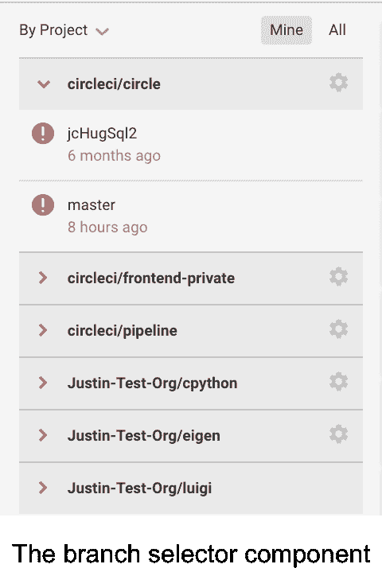
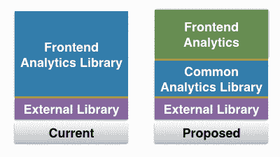

# 在 CircleCI - CircleCI 为行为分析开发一致的分类法

> 原文：<https://circleci.com/blog/building-a-consistent-taxonomy-for-behavioral-analytics-with-amplitude-segment-schema-and-om/>

**来自出版商的说明:**您已经找到了我们的一些旧内容，这些内容可能已经过时和/或不正确。尝试在[我们的文档](https://circleci.com/docs/)或[博客](https://circleci.com/blog/)中搜索最新信息。

* * *

这是 CircleCI 关于构建分析的第二篇也是最后一篇文章。这篇文章从上一篇文章停止的地方[开始，并专门讨论了我为解决第 1 部分中的问题而提出的内部实现。](https://circleci.com/blog/testing-with-untrustworthy-data-means-nothing-how-circleci-came-to-grips-with-declaring-bankruptcy-on-analytics-and-rebuilt-from-the-ground-up/?utm_campaign=analytics-blog&utm_medium=post&utm_source=circleci&utm_content=part-one)

我们决定采用的第三方平台(细分、幅度和旁观者)解决了人口统计(持久)和行为(特定事件)数据的组合问题，以及创建组织渠道的问题。我们解决了数据完整性问题——该问题是由与我们之前的分析提供商的不良集成造成的——通过在切换到我们的新提供商 Segment 时重写我们的集成代码。这种平台组合没有帮助缓解的另一个主要问题是数据的内聚性和一致性。因此，这成为我在实施过程中的主要关注点。

没有重复事件的一致分类是强大的行为分析基础设施的基石。有了这个基础，就更容易理解，更容易理解和有效地使用数据，最终加快分析和采用率。

因此，我的工作是构建一个平台，确保开发者以一种不仅对用户清晰的方式命名事件，而且不会意外地创建类似或重复的事件。然而，同样重要的是，分类法必须使开发人员添加新事件变得简单。因为当事件创建变得太困难时，它被视为生产力的负担，并且不被添加到开发工作流中。

## 事件模式和分类

行为分析有两个主要部分，因此我需要关注两个地方来确保一致性:事件名称和事件数据。

### 事件名称

由于没有事件名称的权威模式，我们以前的实现已经发现了类似事件名称的问题，例如`clicked-signup`和`signup-clicked`。为了抵消这种事件名称的狂野西部，我解决了我的第一个挑战:设计一个既一致又直观的模式。

看看我们在网站上关心的用户交互，很明显大多数是由用户的行为触发的印象、点击和状态变化。在回顾了我们现有的许多事件名称之后，我将必要的结构浓缩成一个模式，可以处理所有这些情况。新约定变成: <feature>- <action>。</action></feature>

这种分解的一个例子可以在`upgrade-button-impression`、`upgrade-button-clicked`和`plan-upgraded`的执行中看到。每一个都代表我们的计划升级漏斗的一部分:一个是当用户看到升级按钮时，另一个是当他们点击它时，另一个是当他们的计划在数据库中升级时。并且每个都属于该模式。

从事件名称中排除的*和包含的*一样重要。就拿这个美女来说:`blue-signup-button-header-enterprise-page-clicked`。CircleCI 并不是唯一一个反对简洁的人；我在我以前的许多公司都看到过这种冗长。一方面，这个名字极其直观。数据消费者几乎不可能误解这个事件的动作。然而，如果事件名称太细，它们就有污染分析名称空间的风险，成为分析的负担。

从数据分析的角度来看，这种激进的细分会造成统计上的噩梦。为了计算像注册按钮被点击的数量这样基本的事情，现在有必要汇总几个事件的信息。简化您的行为数据可以让您快速、轻松地获得一个高层视图，了解您的平台上的哪些功能正在执行哪些操作。

如果这个例子看起来有点夸张，那是因为它确实如此。通常，开发人员不会试图将关于一个事件的所有信息都强加到它的名称中。然而，有一条信息是开发人员一直热衷于放入名称中的:活动的地点。然而，该模式有意地从事件名称中排除了这一信息。事件名称应该是视图(和组件)不可知的；名字应该**只**代表用户动作，而不包括动作发生的地方。

### 事件数据

现在，我不是说一个事件的地点不重要；绝对是。它不应该存储在事件名称中。如果你发现一周内注册人数增加了 30%,你肯定会想看看是哪个页面产生了这些注册人数。

输入事件数据的用途。

借助我们的行为分析平台(细分+幅度)，事件数据对于细分事件至关重要。在我们的 SQL 仓库中，Segment 为每个惟一的事件名创建一个表，并将每个事件数据转换成该表中的一列。这使我们能够使用 WHERE 和 GROUP BY 等 SQL 语句来划分事件表，并获得更细粒度的洞察力。

在广度上，我们可以使用这些相同的事件数据片段来分割数据或创建用户群组。例如，我们可以根据用户如何跟踪他们的第一个项目(通过我们的“添加项目”页面或构建顶部的“跟踪项目”按钮)来将用户分组。这些群组(分别为`project-followed.view` = `add-projects`和`project-followed.view` = `build`)随后可用于测量保持力。



与事件名称一样，拥有一致的事件数据模式也很重要。如果`org`在一个事件中引用组织名称，在另一个事件中引用组织 id，那么事件数据就会变得和我们过去的事件名称一样混乱和无效。

因为每个事件都可能需要定制数据，所以完全系统化事件数据分类是一项挑战。例如，我们的`teammates-invited`事件有一个`num-teammates`属性，表示有多少队友收到了邀请。其他事件很少使用这个`num-teammates`数据，所以将它添加到已定义的事件数据分类中是没有意义的。

然而，有四个事件数据在 CircleCI 的所有事件中普遍存在:`org`、`view`、`user`和`repo`。这些数据通常表示用户在组织(org)环境下的页面(视图)上执行的操作，有时也表示在特定项目(repo)环境下执行的操作。给定事件数据的全局上下文，跟踪这四个属性似乎是全局事件数据模式最合理的起点。

## 将想法转化为代码

我的计划的关键是创建一个基础设施，它执行我提出的事件命名模式，并为全局事件数据模式创建一个基础。

为了加强这种一致性，我使用了 [plumatic 模式库](https://github.com/plumatic/schema)。对于那些不熟悉模式的人来说:“模式是描述数据形状的 Clojure(脚本)数据结构，可用于记录和验证函数和数据。”这个验证功能意味着我可以使用“模式检查”来确保传递到分析库中的数据来自一组预定义的好值。

**注意 1** :因为我正在使用 [plumatic 模式库](https://github.com/plumatic/schema)来执行我的事件命名模式，所以在下面的部分中‘模式’是一个有点超载的术语。为了清楚起见，我将把这个库和这个库创建的对象称为专有名词(schema)，而我的事件命名 schema 称为普通名词(Schema)。

**注 2** :本文中的代码示例并不完全代表我们的产品代码。我这样做有两个原因。**第一个**，尝试并强调我所提出的概念的实现，**第二个**，让非 Clojure 开发者更容易理解。然而，代码片段是基于我们的开源前端的，所以如果你想看真实的东西，请随意[查看](https://github.com/circleci/frontend-private/tree/master/src-cljs/frontend/analytics)！

### 一致的名字

我使用 Schema 验证的第一件事是事件名称的中央存储库。正如你们中的一些人所知，创建事件命名模式是一回事，实施它是另一回事。

首先，我创建了一个包含所有事件的[列表，这些事件当前都是从我们的 web 应用程序中触发的。然后，我使用 Schema 通过添加以下代码来验证传递给 track 函数的事件名称:](https://github.com/circleci/frontend-private/blob/master/src-cljs/frontend/analytics/core.cljs#L22)

```
;; Below are the lists of our supported events.
;;     Events should NOT be view-specific.
;;     They should be view agnostic and include a view in the properties.
;; Add new events here and keep each list of event types sorted alphabetically
(def supported-events
	#{:account-settings-clicked
	   …
	   :web-notifications-permissions-set})

;; Create an enum from the set of supported events
(def SupportedEvents
(apply s/enum supported-events))

;; Create an AnalyticsEvent which is a merge of the CoreAnalyticsEvent
;; and a dictionary with a key :event-type, whose value must be found in the
;; enum of SupportedEvents
(def AnalyticsEvent
(merge CoreAnalyticsEvent {:event-type SupportedEvents}))

;; Create a track function, which expects a dictionary (event-data) of the
;; schema defined by AnalyticsEvent. That way, if the argument passed to track
;; does not have a key :event-data, with a value found in the SupportedEvents enum,
;; it will throw an Exception and not fire the event.
(defn track [event-data :- AnalyticsEvent]
	track stuff…) 
```

Plumatic Schema 确保开发人员在添加新事件时必须首先手动将其添加到受支持的事件集中，否则他们会在测试时在 JS 控制台中看到错误。这种强制实现了三件事，它:

描述事件命名模式( <feature>- <action>)，开发人员应该使用它来添加事件，增加他们遵循命名模式的机会。提供了大量遵循命名模式的示例，鼓励正确使用命名法。通过保持事件按字母顺序排序，不鼓励创建类似的事件，为开发人员提供了查看某个特性的现有事件的机会。</action></feature>

一个额外的、个人的好处:作为我们分析的所有者，这给了我一个地方来检查模式之外的事件没有被添加。以前，事件分散在整个代码库中，因此很难枚举它们。这个事件名称列表已经允许我捕获事件命名模式之外的事件。

### 一致的数据

我需要确保一致性的下一个地方是事件数据，因为精心选择的事件数据提供了对用户参与的更细粒度细节的宝贵见解。



幸运的是，在 CircleCI，我们使用 [Om](https://github.com/omcljs/om) (脸书 [React](https://facebook.github.io/react/) 框架上的 clojurescript 包装器)作为我们的前端网络应用。这意味着我们的应用程序由保存在内存中的大型状态图提供支持，并通过用户交互或 API 调用的响应进行更新。这种结构的一个主要好处是，在任何给定的时间，我们的应用程序“知道”它的操作上下文，无论是当前页面、当前用户，还是特定的组织或存储库。

为了确保这种状态信息总是包含在分析调用的事件数据中，我做了几件事:

首先，我以一致的方式从状态中提取这些信息。其次，我确保状态总是被传递给分析函数。最后，在向我们的第三方提供者发出跟踪调用之前，我总是将这些键添加到事件数据中。考虑到这些目标，我最终编写了以下代码:

```
;; Define an `AnalyticsEvent` schema, which requires an `:event-type` key and 
;; a `:current-state` key. The `:event-type` value must come from our our enum of `supported-events` (described in the code block above).
;; The `:current-state` can be a map with any values (this is the app state).
(def AnalyticsEvent
{:event-type SupportedEvents
 :current-state {s/Any s/Any})

;; Given the `current-state`, return a dictionary of the properties that we want
;; to track with every event.
(defn- properties-to-track-from-state [current-state]
  "Get a map of the mutable properties we want to track out of the
  state. Also add a timestamp."
 	{:user (get-in current-state state/user-login-path)
 	 :view (get-in current-state state/current-view-path)
  	 :repo (get-in current-state state/navigation-repo-path)
  	 :org (get-in current-state state/navigation-org-path)})

;; A `track` function which takes a single argument `event-data`, a dictionary
;; in the shape described by the schema `AnalyticsEvent`.
;; If the input data is not in the correct shape, it throws an Exception.
(defn track [event-data :- AnalyticsEvent]
(let [{:keys [event-type current-state]} event-data]
		(segment/track-external-click event-type
(properties-to-track-from-state current-state)))) 
```

通过阅读上面的代码可以看到，我们的 track 函数有一个参数`event-data`，它有一个键`current-state`(事件触发时应用程序的状态)。然后，我们解析状态中的重要属性，并将该字典作为事件的数据发送。

但是:尽管这种实现确保了每个事件用一组一致的填充键来触发，但是它非常严格。如果开发人员需要添加额外的数据，比如 A/B 测试处理，该怎么办？或者更糟的是，如果出现自动填充数据出错的极端情况，该怎么办？

考虑我们的[仪表板页面](https://app.circleci.com/dashboard)。虽然此页面既没有组织也没有存储库上下文(它显示所有组织和存储库，但不特定于任何组织和存储库)，但它有特定于组织或存储库的链接。例如，页面左侧分支选择器组件上的任何链接都有一个关联的组织和存储库。



由于这些情况，我们需要能够修改属性字典。我通过向`track`函数签名添加一个新的`properties`参数来实现这一点，它优先于自动生成的映射。以下是更新后的代码:

```
;; Same as the AnalyticsEvent above, but now has an optional key `properties`
;; `properties` is a map that has Clojure keywords as keys, and allows custom user-set values.
(def AnalyticsEvent
  {:event-type (s/enum supported-api-response-events)
   :current-state {s/Any s/Any}
   (s/optional-key :properties) {s/Keyword s/Any}})

;; This function gets the data we want to track automatically out of the `current-state`,
;; and then merges the `properties` passed in. Because we pass in `properties` as the second
;; argument to the `merge` call, the `properties` take precedence.
;; So, if `properties` has an `:org` key, its value will overwrite the value of `:org` returned from
;; `properties-to-track-from-state`.
(defn- supplement-tracking-properties [{:keys [properties current-state]}]
  "Fill in any unsupplied property values with those supplied
  in the current app state."
  (-> current-state
      (properties-to-track-from-state)
      (merge properties)))

;; Same as the track call above, but can take a `properties` key in its input map.
;; This map of properties takes precedence over the map generated automatically
;; by parsing the app’s state.
(defn track :default [event-data :- AnalyticsEvent]
  (let [{:keys [event-type properties current-state]} event-data]
    (segment/track-event event-type
                                       (supplement-tracking-properties {:properties properties
                                                                                            :current-state current-state})))) 
```

代码现在允许开发人员根据需要向事件数据添加自定义属性。此外，在自动添加的属性是错误的情况下，它允许开发人员用正确的值覆盖它们。

### 就这样结束了！

三个第三方平台和一次大规模的事件命名分类检查之后，我们现在有一个分析库，可以确保我们的数据消费者的一致性，同时为我们的开发人员提供灵活性和易用性。

## 展望未来——需要优化的领域

在这个分析库首次推出以来的八个月里，它已经成为我们收集行为数据的主要方式。在这段时间里，我了解了我做得好的地方和做得差的地方。我不认为这是一篇诚实的博文，如果我不解决错误或伸缩问题的话，所以这里有一些八个月后我想到的事情。

### 关注点分离

在我们当前的架构中，CircleCI 前端分析的一部分和便携式分析库的实际部分之间没有分离。虽然这在从单一来源触发事件时并不重要，但当我们将行为分析扩展到多个服务时，该基础架构在验证这些事件及其数据时至关重要。拥有一个公共库可以鼓励不同代码库之间的最佳实践。



我们已经感受到这种痛苦的地方是我们的服务器端事件。虽然前端被很好地模式化了，但是服务器端没有严格的模式化。结果是，在相似的事件中，有不同的键代表同一件事(即:不同事件上的`org`和`org-name`)。拥有一个合适的库可以让我重用模式检查并防止这种情况发生。

### 事件名称的缩放

到目前为止，事件名称集已经非常成功，但是随着我们添加越来越多的事件，[列表](https://github.com/circleci/frontend-private/blob/master/src-cljs/frontend/analytics/core.cljs#L22)正在快速增长。在这一点上，我开始怀疑这个列表是否保持了它原来的有用性，或者是否有更好的方法来对它进行分层以便于使用。

如果您查看列表，您会注意到事件名称实际上只是功能和动作的组合。那么为什么要把它们放在一起呢？为什么不拥有一组有效的功能、一组有效的动作，然后让分析库根据客户端传递给它的功能/动作组合自动生成事件名称呢？这将更具可伸缩性，并使创建不属于分类法的事件名称变得更加困难。这是我将来想尝试的东西。

### 其余的事件数据

我们恰当地规划了四个事件数据键，但是其他的呢？我们运行 A/B 测试，所以那些处理也应该自动填充事件数据。数据越多越好，但我们的事件数据字典之间也越有可能出现分歧。

那么，我们如何确保随着行为分析复杂性的增加，我们的事件数据模式保持一致呢？这可能是最难解决的问题，但在扩大我们对行为数据的使用方面，这将是一个重要的问题。

### 等待下一个 Om

我们目前正在将我们现有的前端从 om 迁移到 Om(你可以在这里[阅读](https://circleci.com/blog/why-we-use-om-and-why-were-excited-for-om-next/))。这种大规模迁移令人兴奋的一点是，它允许开发人员解决第一个架构解决方案中可能遗漏的问题。

例如，当我们迁移到 Om 时，CircleCI 没有数据分析师或增长团队，也不太致力于利用数据。由于我们更加依赖数据，分析在此次迁移中受到了优先考虑，这将使我们能够解决我们当前实施中遇到的一些问题。

### 结论

再周密的计划和设计，事情总会被遗忘。这种事件分类和模式的实现将我们从一个不区分数据优先级的公司带到了一个根据数据做出决策的公司。也就是说，随着我们规模的扩大，它已经开始出现一些裂缝。我期待着花一些时间来解决这些问题，并希望写另一篇博文来分享未来的见解。

有兴趣了解更多关于这个话题的信息吗？[12 月办公时间回复](https://www.meetup.com/CircleCI-Office-Hours/events/233569074/)12 月 14 日星期三，Justin 将在 Heavybit 俱乐部会所介绍 all things data。空间有限。