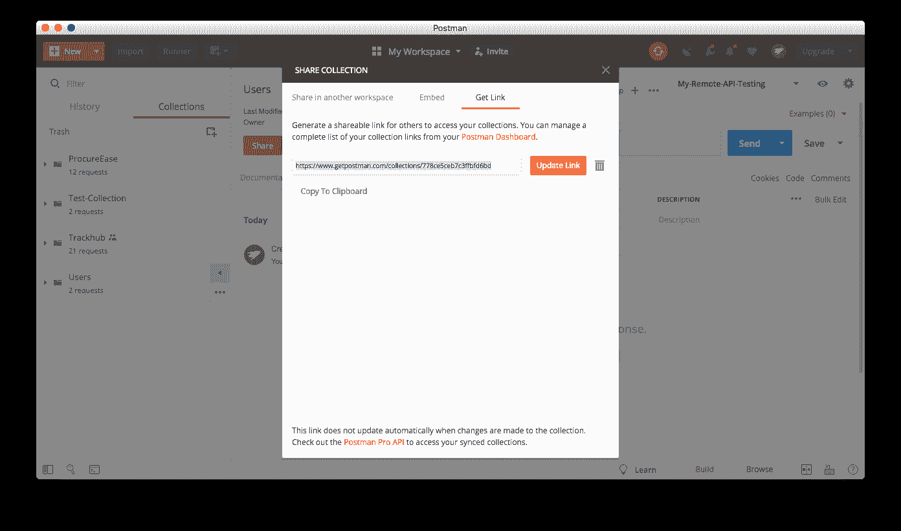
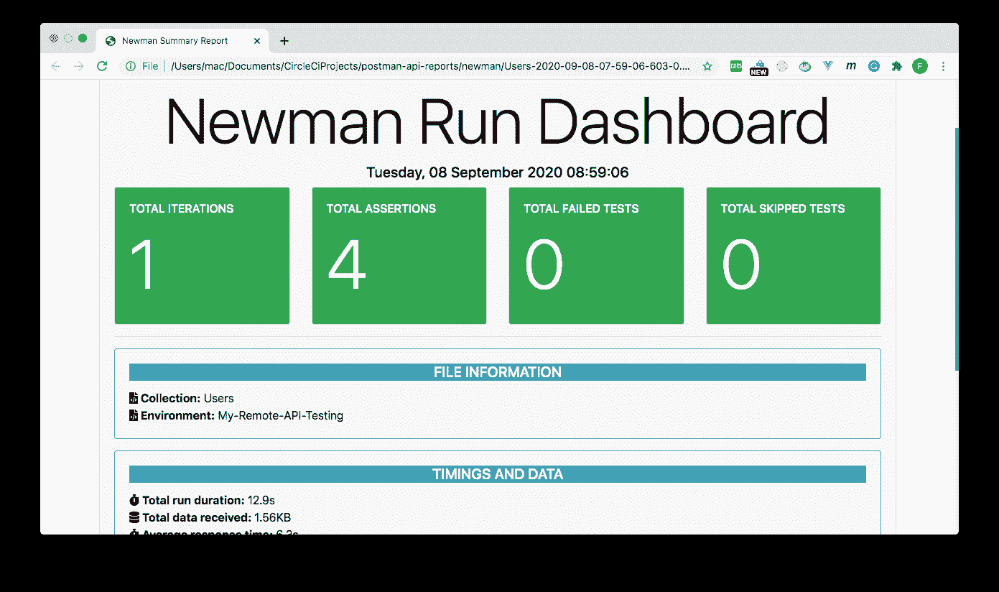
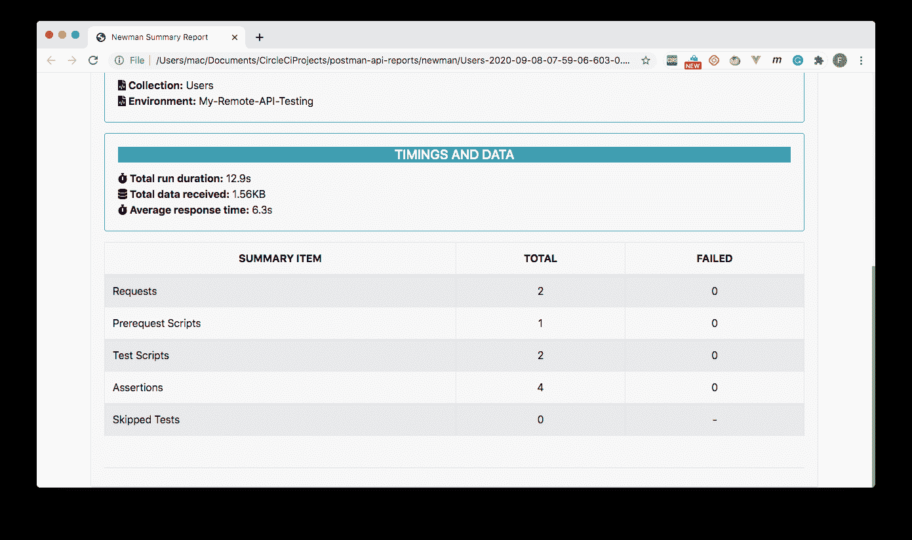
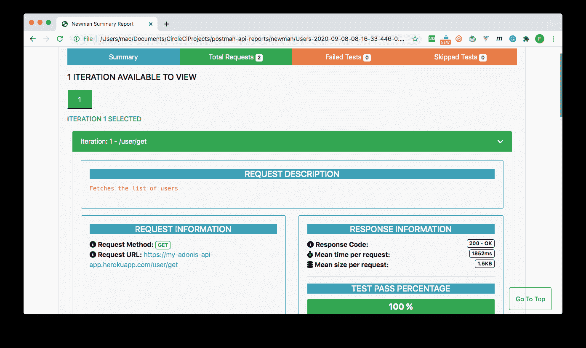
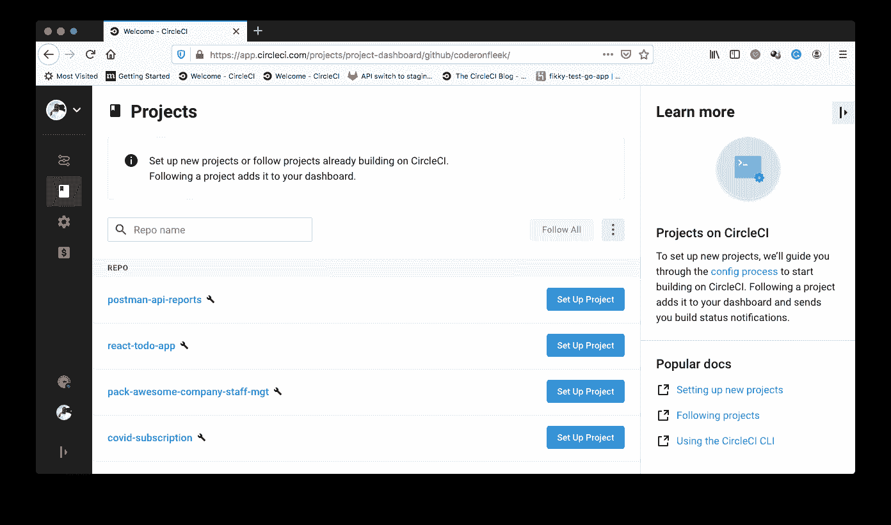
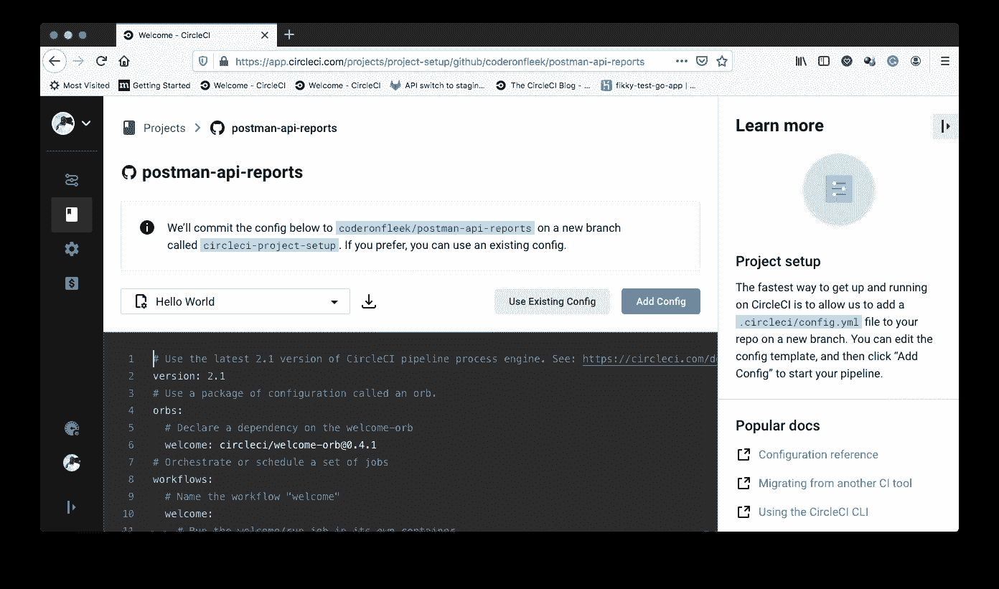
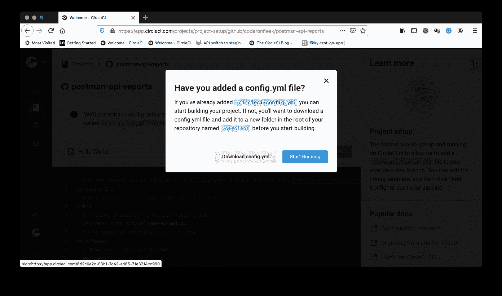
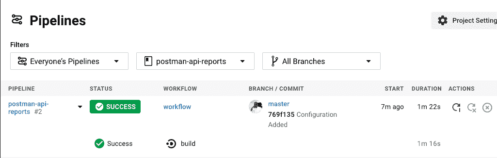
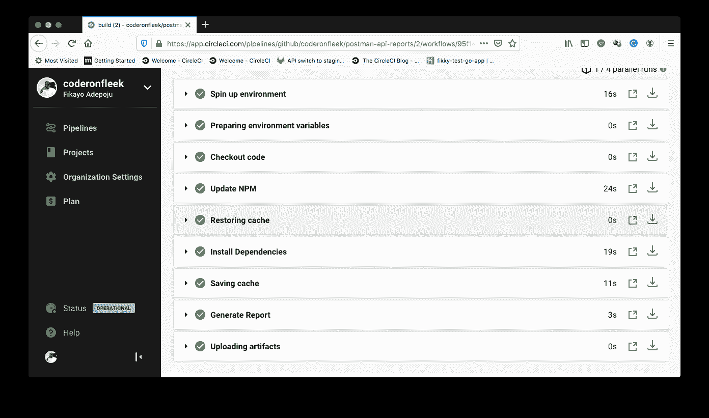

# 生成邮递员测试报告| CircleCI

> 原文：<https://circleci.com/blog/building-postman-test-reports/>

在用 Postman 测试 API 的[中，我们使用](https://circleci.com/blog/testing-an-api-with-postman/) [Postman](https://www.postman.com/) 集合和 Postman 命令行实用程序 [Newman](https://www.npmjs.com/package/newman) 为 API 端点设置了自动测试。在本教程中，我们将通过使用`Newman` CLI 工具来为我们的 API 测试生成详细的、可存储的报告，从而建立这种经验。

## 先决条件

要跟进这篇文章，需要做一些事情:

1.  JavaScript 的基础知识
2.  Postman for Desktop 安装在您的系统上(您可以在这里下载它
3.  一个[圆](https://circleci.com/signup/)的账户
4.  GitHub 的一个账户
5.  安装在您系统上的 [Node.js](https://nodejs.org) (版本> = 10)
6.  要报告的集合和环境

**注意** : *如果您完成了[用 Postman](https://circleci.com/blog/testing-an-api-with-postman/) 测试 API 教程中的任务，您就有了一个可以用于报告的集合和环境。如果您不熟悉邮递员集合，在开始本教程之前完成该教程可能会有所帮助。*

## 获取邮递员集合公共 URL

现在，每次我们需要添加更多的测试和请求时，我们用来测试 API 的集合都必须更新。这个手动步骤很麻烦。您需要导出集合文件并更新自动化测试项目。幸运的是，Postman 提供了一项服务，可以让你上传和同步你的收藏。

打开 Postman 桌面应用程序并登录。您的本地收藏会自动上传和同步。

一旦你做到了这一点，你就可以获得你的收藏的公共链接。此链接将指向您在邮递员服务上托管的收藏版本。对您的收藏所做的任何更改都可以通过该链接立即获得。只要你登录，邮递员同步所有更新。这就是使用链接而不是将收藏导出为`json`的最大好处。

要获取您的链接，请打开您的收藏的弹出菜单，然后单击**共享**。从弹出对话框中复制您收藏的公共链接，如下图所示。



通过此链接，您不再需要导出和移动收藏文件。

## 使用 Newman 的 HTMLExtra Reporter 创建报表项目

接下来，我们需要为运行 API 测试和生成测试报告设置一个项目。Newman 支持多种报告生成包。我用得最成功的是[Newman-reporter-htm extra](https://www.npmjs.com/package/newman-reporter-htmlextra)。

虽然纽曼和记者通常在全球范围内安装和运行，但我们将为这个项目做一些稍微不同的事情。我们将在本地安装这两个包，以便在运行项目时避免全局依赖。

使用以下命令创建一个项目文件夹并在本地安装这两个包:

```
mkdir postman-api-reports
cd postman-api-reports
npm init -y
npm install newman
npm install -S newman-reporter-htmlextra 
```

将导出的环境文件放在项目的根目录下。现在，项目已经为 API 测试生成报告做好了一切准备。

## 在本地生成报告

接下来，我们将运行命令来测试 API 并生成测试报告。使用以下格式，使用特定于您的项目的信息:

```
npx newman run [YOUR_COLLECTION_PUBLIC_LINK] -e ./[POSTMAN_ENVIRONMENT_FILENAME].json -r htmlextra 
```

这个命令使用`npx`调用`newman`的本地安装，然后运行集合中的测试。结果从`newman-reporter-htmlextra`包传递给`htmlextra`命令，后者生成报告。

您可以从 CLI 运行此命令来生成报告，但是每次都运行长命令可能不太实际。相反，您可以将它作为名为`report`的`npm`脚本添加到`package.json`文件中，如下例所示:

```
"script" : {
    "report": "npx newman run https://www.getpostman.com/collections/778ce5ceb7c3ffbfd6bd -e ./My-Remote-API-Testing.postman_environment.json -r htmlextra"
} 
```

运行以下命令来运行测试并生成报告:

```
npm run report 
```

第一次运行该命令时，它会在项目的根目录下创建一个新文件夹`newman`，并向该文件夹添加一个带有时间戳的`html`文件。在浏览器中打开该文件以查看测试报告。







默认情况下，报告显示摘要。摘要显示了测试迭代的数量，以及失败的、通过的和跳过的测试。单击任一选项卡可获得有关该类别结果的更多详细信息。您甚至可以将显示主题从亮模式切换到暗模式。

## 为报表自动化设置 CircleCI 项目

太棒了——我们已经生成了测试报告。干得好！现在是自动化这个过程的时候了。从[将你的项目推送到 GitHub](https://circleci.com/blog/pushing-a-project-to-github/) 开始。

添加一个`.gitignore`文件，并指示 Git 忽略`node_modules`和`newman`文件夹。在您的`.gitignore`文件中，输入:

```
node_modules
newman 
```

对项目做出承诺。

现在，转到 CircleCI 仪表板上的**添加项目**页面来添加项目。



点击**设置项目**。



点击**使用现有配置**。此设置指示您正在手动添加配置文件，而不是使用示例。

接下来，系统会提示您下载配置文件或开始构建。



点击**开始建造**。这个构建将会失败，因为我们还没有设置配置文件。我们将在下一步中设置一个。

## 自动生成报告

现在是时候编写自动化脚本了。在项目的根目录下创建一个名为`.circleci`的文件夹，并向其中添加一个名为`config.yml`的配置文件。在该文件中，输入以下代码:

```
version: 2.1
jobs:
  build:
    working_directory: ~/repo
    docker:
      - image: circleci/node:10.16.3
    steps:
      - checkout
      - run:
          name: Update NPM
          command: "sudo npm install -g npm@5"
      - restore_cache:
          key: dependency-cache-{{ checksum "package-lock.json" }}
      - run:
          name: Install Dependencies
          command: npm install
      - save_cache:
          key: dependency-cache-{{ checksum "package-lock.json" }}
          paths:
            - ./node_modules
      - run:
          name: Generate Report
          command: npm run report
      - store_artifacts:
          path: ~/repo/newman 
```

在上面的配置中，`node.js` Docker 映像作为运行测试的环境被引入。然后，`npm`被更新，依赖项被安装并缓存。所有依赖项就绪后，使用`npm`运行定制的`report`脚本。该命令运行测试并生成报告。最后，reports 文件夹(`newman`)被存储为一个工件。它可以在 CircleCI 控制台的**工件**选项卡上找到。

推动新的变革。



单击构建以显示摘要。



点击**工件**找到您生成的报告。

## 结论

在本教程中，您已经通过使 Postman 生成可访问的详细测试报告，扩展了它的端到端测试能力。您可以使用这些过程来确保测试运行，并确保每当您向 API 推送更新时都会生成报告。

编码快乐！

* * *

Fikayo Adepoju 是 LinkedIn Learning(Lynda.com)的作者、全栈开发人员、技术作者和技术内容创建者，精通 Web 和移动技术以及 DevOps，拥有 10 多年开发可扩展分布式应用程序的经验。他为 CircleCI、Twilio、Auth0 和 New Stack 博客撰写了 40 多篇文章，并且在他的个人媒体页面上，他喜欢与尽可能多的从中受益的开发人员分享他的知识。你也可以在 Udemy 上查看他的视频课程。

[阅读 Fikayo Adepoju 的更多帖子](/blog/author/fikayo-adepoju/)