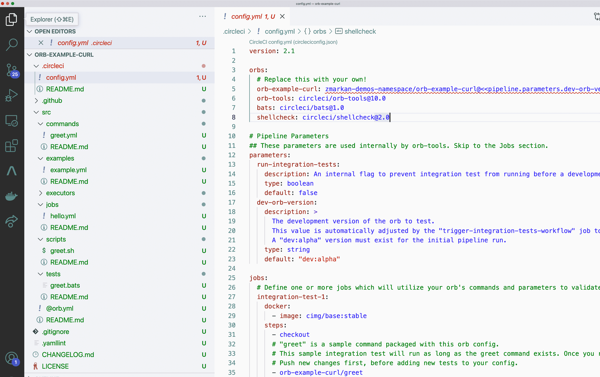

# 在任何组织| CircleCI 上建造私人 CircleCI 球体

> 原文：<https://circleci.com/blog/building-private-orbs/>

使用 CircleCI 的 orbs 是跨项目共享 CI/CD 配置的一个好方法。公共 orb 能够很好地被广泛采用，但是私有 orb 对于需要以安全、非公共的方式共享公共内部配置的组织来说是很有帮助的。私有 orb 只在发布它们的组织内工作。

我们最近向所有 CircleCI 客户开放了私人 orbs，包括那些参加了[免费计划](/blog/new-cicd-free-plan-what-devs-get/)的客户。这种新的访问方式为您的管道开辟了许多新的可能性。

在这篇文章中，你将了解到私有球体以及如何在你自己的组织中使用它们。我们将使用我构建的示例 orb，它包含一个命令和一个作业，允许您使用 cURL 在其他项目中触发 CircleCI 管道。你可以在[这个资源库](https://github.com/zmarkan-demos/api-requester-orb-sample)中找到该项目的源代码。

## 先决条件

本文假设:

*   [CircleCI](https://circleci.com/docs/) 的工作知识
*   了解管道的工作原理
*   在您的机器上本地安装和配置的 CircleCI CLI
*   您正在 GitHub 上使用项目组织或您的个人组织

## 私有球体的用例

与一般的 orb 一样，私有 orb 对于共享多个项目共有的步骤和任务非常有用。

许多组织都有自己的框架和跨许多团队使用的内部工具。有了私人宝珠，他们可以轻松地分享这些工具，而无需向更广阔的世界开放。私有 orb 的一些用例包括部署到您专有的 Kubernetes 集群或其他基础设施，处理定制硬件，一直到日志记录或常见的管理任务。

## 初始设置

我们将使用 CircleCI CLI 来完成此任务。使用 CLI，您将创建一个新的 orb，并将其注册到 CircleCI，以便它可以被其他 CircleCI 管道引用。CLI 允许您发布 orb 的新版本。

整个 orb 创建过程[记录在 CircleCI 文档](https://circleci.com/docs/local-cli/)中。本文将对其进行快速回顾，并解释相关步骤。

创建一个空的 git 存储库并记下它的路径。我在我的`zmarkan-demos`组织下创建了我的，命名为`api-requester-orb-sample`，所以路径是:`git@github.com:zmarkan-demos/api-requester-orb-sample.git`。

接下来，使用 CLI 的`circleci orb init`命令创建实际的 orb，传递您希望 orb 源所在的本地路径。该目录必须是新的；不要使用已经存在的。对我来说，这是:

```
circleci orb init ~/github/api-requester-orb-sample --private 
```

公共球体和私有球体的主要区别在于末尾的`--private`标志。

CLI 要求您要么按照指导设置，这是我做的，要么自己做。我推荐使用自动化过程，因为它将使用一个空的 orb 模板设置目录中的所有内容，并将其链接到您的存储库，为您的 orb 创建一个名称空间，并为新的 orb 创建一个 CircleCI 项目，只需确保从您之前创建的存储库中复制 git URL。

最后，您需要将本地代码推送到远程存储库-

```
cd ~/github/api-requester-orb-sample
git push origin master 
```

注意:所有 orb 都存在于您组织内的一个名称空间中。这对于您已经注册的任何跑步代理都是一样的。

你也可以在你的组织设置中查看你的新的私有球体，它们在`type`部分被清楚地标记为私有。


## 开发一个球体

orb 开发过程取决于您是选择自动化指导过程还是遵循您自己的过程。与设置部分一样，CircleCI 文档涵盖了这两种情况。

如果您遵循了快速设置路线，那么 CLI 将从模板中为您生成整个项目。它包含命令、作业、执行器的示例，以及对它的测试。



你可以移除任何你不需要的部分。在我的例子中，我删除了脚本和执行器，保留了命令和作业。orb 只是 CircleCI 配置脚本的集合，当您运行管道时，这些脚本会被解析和绑定。

我们创建了 2 个脚本:

*   一个`commands/trigger-pipeline.yml`命令
*   一份工作

作业包装命令并在基本 Docker 执行器中执行。

### 使用触发器管道命令

`trigger-pipeline`命令有 4 个参数和一个单步，如以下代码示例所示:

```
description: >
  This command triggers CircleCI pipeline specified.
  The job execution environment must have cURL utility available

parameters:
  repo-name:
    type: string
    description: "Repo name to trigger pipeline for"

  branch-name:
    type: string
    default: main
    description: "Branch name to trigger"

  trigger-params-json:
    type: string
    default: "{}"
    description: Pipeline trigger parameters in JSON format

  circle-token-env-var:
    type: env_var_name
    default: CIRCLE_TOKEN
    description: Environment variable containing your CircleCI API Key. Default is $CIRCLECI_API_KEY

steps:
  - run:
      name: Run cURL request
      command: |
        curl --request POST \
            --url "https://circleci.com/api/v2/project/gh/${CIRCLE_PROJECT_USERNAME}/<< parameters.repo-name >>/pipeline" \
            --header "Circle-Token: ${<< parameters.circle-token-env-var >>}" \
            --header "content-type: application/json" \
            --data '{"branch":"<< parameters.branch-name >>","parameters":<< parameters.trigger-params-json >>}"' 
```

与完整的 CircleCI 管道配置不同，这个配置不需要一个`version`节。由于只有一个命令源，它也没有`jobs`或`workflows`。与完整的 CircleCI 配置中可用的管道参数不同，所有 4 个参数也专用于该命令。

run 步骤中的`curl`命令点击 CircleCI API 来触发另一个管道。在这篇博文中有详细的描述。

### 使用触发器循环管道作业

编写一个使用我们刚刚创建的命令的作业非常简单。在同一个 orb 中，您可以使用该命令，就像它是您在配置中定义的本地命令一样。在我们的`jobs/trigger-circleci-pipeline.yml`示例中，看起来是这样的:

```
description: >
  Job that trigger CircleCI pipeline in another project with the payload specified

docker:
  - image: cimg/base:2021.12

parameters:
  repo-name:
    type: string
    description: "Repo name to trigger pipeline for"
  branch-name:
    type: string
    default: main
    description: "Branch name to trigger"

  trigger-params-json:
    type: string
    default: "{}"
    description: Pipeline trigger parameters in JSON format

  circle-token-env-var:
    type: env_var_name
    default: CIRCLE_TOKEN
    description: Environment variable containing your CircleCI API Key. Default is $CIRCLECI_API_KEY

steps:
  - trigger-pipeline:
      repo-name: << parameters.repo-name >>
      branch-name: << parameters.branch-name >>
      trigger-params-json: << parameters.trigger-params-json >>
      circle-token-env-var: << parameters.circle-token-env-var >> 
```

这个命令有参数，和 CircleCI 中的所有其他作业一样，我们需要执行程序:`docker`。`steps`节包含一个单独的步骤，使用我们设置的任何参数调用之前的`trigger-pipeline`命令。

## 测试和部署 orb

为了构建、测试和部署我们的 orb，orb 模板项目使用 CircleCI 本身。在`.circleci/config.yml`的配置中，几乎所有东西都是为您预先准备好的。你需要做的就是为它编写测试。默认情况下，它包含一个名为`integration-test-1`的作业，您可以修改它以使用您自己的 orb。下面是调用`trigger-pipeline`命令的一个片段:

```
jobs:
  integration-test-1:
    docker:
      - image: cimg/base:stable
    steps:
      - checkout
      - api-requester-orb-sample/trigger-pipeline:
          repo-name: pinging-me-softly
          branch-name: main
          trigger-params-json: '{"image-name": "cimg/base:2021.12"}' 
```

要发布发布版本，您需要:

*   从默认的`alpha`分支变为`master`或`main`分支
*   在提交中包含一条`[semver:patch|minor|major]`消息

## 结论

在这篇文章中，你已经学习了如何为 CircleCI 建造私人球体，现在 CircleCI 的所有客户都可以使用。私有 orb 允许您在多个项目之间共享 CI/CD 管道配置。组织中的任何团队成员都可以使用这些私有 orb，而不会有将您的配置公开的风险。

整个过程对于发布公共 orb 几乎是相同的。只需在`circleci orb init`命令中添加`--private`标志。

要阅读更多关于 orb 开发的内容，请查看创作 orb 的文档页面。

要了解如何使用 BATS 和 ShellCheck 在 orb 中测试和验证 bash 脚本，[请查看 orb 测试方法的文档页面](https://circleci.com/docs/testing-orbs/)。

如果你对这篇文章有任何问题或建议，或者对未来的文章和指南有什么想法，请通过 [Twitter - @zmarkan](https://twitter.com/zmarkan) 或 [email 给我](mailto:zan@circleci.com)联系我。