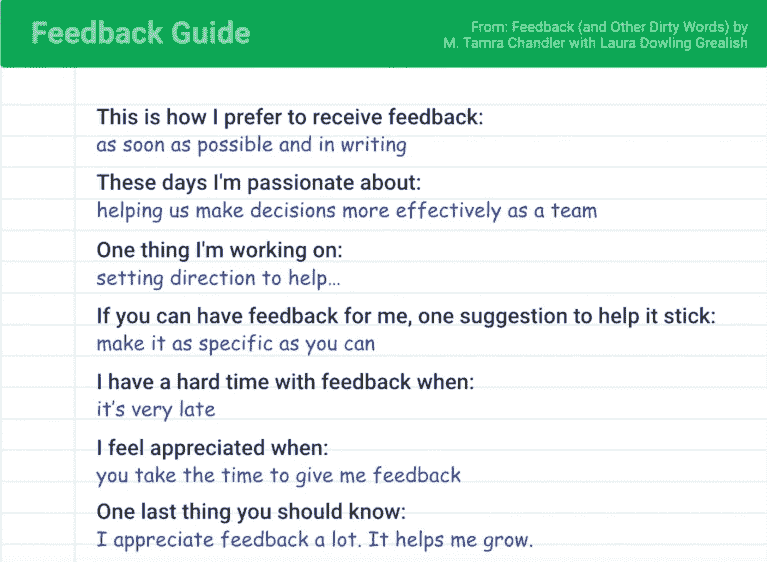

# 构建强大的分布式团队，一次一个像素

> 原文：<https://circleci.com/blog/building-strong-distributed-teams-one-pixel-at-a-time/>

我的工作生活每天都是由数百万像素组成的。我的团队分布在全球各地，大多数时候，我的队友在缩放会议、闲聊和电子邮件中被简化为像素。我们带来了不同的背景、经历、沟通方式和协作偏好，以及更多的差异。

在我过去六年的职业生涯中，我建立并支持了遍布全球的分布式团队。虽然这是一个我将永远感激的机会，我可以和出色的人一起工作，但它也挑战了我作为一名领导者和经理的能力。

通过渗透，或在字面上的水冷却器，很少发生有机的事情，但与此同时，所有团队面临的许多挑战，如沟通和协作，在我们跨地点和时区分布时会加剧。

> 建立和领导团队的常用方法就是不能简单应用。这意味着作为领导者，我们经常需要更有创造力。

与此同时，作为一名经理，我必须更有目的性，这让我学到了很多东西，我也感谢我的团队如何帮助我进步。我学到的主要经验是，尽管不在同一个地方，我们仍然可以创建更强大、更谨慎的分布式团队，并产生与共享同一张餐桌的团队相同甚至更好的结果。

在这篇文章中，我将分享我在基于三个关键“C”支柱改进团队方面的经验:联系、沟通和协作。无论你是管理世界各地的团队，还是在同一栋大楼里，这些方法都可以帮助你变得更具战略性，更好地沟通，并建立高度一致、联系良好的团队，交付优秀的产品。

## 创建高绩效分布式团队的五个因素

你如何将复杂、遥远的系统，如我们广泛分布的人类系统，转变成团队？研究表明，团队高绩效有五个关键因素:

*   **心理安全。**这意味着我们可以随意向他人表达我们与工作相关的想法和感受，并且我们相信，如果我们犯了一个善意的错误或寻求帮助，他们不会看轻我们。
*   可靠性。这意味着我们的团队正在按时完成高质量的工作。
*   **结构&清晰。**每个人都需要了解自己的角色、期望和计划。
*   **意。**能够从事对我们有意义的工作。
*   **影响。**我们在工作或产出中找到了目标感。

现在，关于高绩效团队的研究并没有说每个人都必须在同一个办公室，共用同一个冰箱(根据我对办公室冰箱的了解，这实际上可能是一件好事)。但是，当所有人都在同一个房间里时，高绩效团队使用的许多实践要容易得多。

> 团队成员需要自由地向他人表达与工作相关的想法和感受，并相信如果他们犯了善意的错误或寻求帮助，人们不会轻视他们。

如果构建团队整体上很难，那么构建分布式团队就更难了。通过渗透作用，或在字面上的水冷却器，有机发生的要少得多。当我们分布在不同的地点和时区时，所有团队面临的许多挑战都会加剧。建立和领导团队的常用方法就是不能简单应用。这意味着作为领导者，我们经常需要更有创造力。

## 领导高绩效团队的三个 c

创建一个高绩效的分布式团队从根本上讲是关于包容的:确保每个人都有平等的贡献机会，方法是创造公平的竞争环境，消除障碍。与此同时，我认为不可能为每个人复制完全相同的工作体验，我也不认为这应该是我们的目标。相反，我们应该确保每个人都能够以有意义的方式做出贡献，并尽自己最大的努力。

那么作为一个分布式团队的领导者意味着什么呢？我们创建结构来帮助人们一起工作，这样每个人都可以做到最好。我们为他人提供依靠和依赖的基石。

> 作为工程领导者，我们就像砖块之间的砂浆:我们连接结构、团队和人。

我们把他们团结在一起。作为领导者，我们的工作不应该是关于我们自己的。这是关于我们支持的人和团队。我们建立结构来帮助他人发光。

在我到目前为止的工作中，我一直在使用不同的方法来实现这一点，专注于构建结构和支持团队中的联系、沟通和协作。让我们来看看你如何利用这些来帮助你的团队提高。

### 联系:有目的地一起工作

作为人类，我们努力与更大的目标联系在一起。但我们也寻求与周围的人建立联系。当我们和队友在同一个位置时，我们会接收到关于他们的小信号。当他们早上走进办公室时，我们看到他们的肢体语言。我们知道人们是紧张还是放松，或者可能会意识到他们比平时喝了更多的咖啡。

用小小的行动打开联系之门。微小的信号在远处消失了，这意味着其他事情变得更加重要，比如理解人们不同的能量水平。当我在旧金山的同事开始他们一天的工作时，他们精力充沛，非常兴奋。但对我来说，柏林是下午 5 点或 6 点，如果是冬天，外面可能已经黑了。有些日子我很累，无法集中注意力，但我仍然希望能为我的团队服务。在这种情况下，如果我们在谈话中对对方的精神状态和我们在工作日的位置都很敏感，会有所帮助。

为人类腾出空间。当我在 2018 年加入 CircleCI 时，我与我们工程组织中的所有人见了面，因为我想了解与我们一起工作的人。在一次谈话中，我们的一位工程师对我说，“我需要时不时地亲自见见我的团队，提醒自己他们是真实的人。”这种情绪引起了我的共鸣。

> 当我们在视频通话中以像素的形式或在聊天应用程序中以图标的形式与人互动时，很容易忘记屏幕的另一端也有人。

当我们以彼此的人性为中心时，我们超越了队友的专业领域。我们需要对他们是什么样的人感到好奇，并知道他们的动力和动机是什么。

### 沟通:创造明确的期望

定义期望，并揭示什么是重要的。作为领导，我们有责任确保团队中的每个人都清楚我们的期望。这就是为什么每周一对一的会议是我们沟通的支柱，以及我们与队友关系的支柱的众多原因之一。

当您的组织处于高速增长模式时尤其如此。当我在 2018 年加入 CircleCI 时，工程团队的年增长率为 50%，地理分布也在增加。相反，管理团队小得令人难以置信。在所有这些增长之后，我们在发展我们的工程文化方面遇到了挑战。我们团队中有很多知识仓库。但与此同时，我们也有热衷于发展的人。我们需要的是为所有这些热情建立一条途径，让我们能够扩大业务规模。

我们在 CircleCI 做的事情之一是创建一个工程能力矩阵，并将其传达给我们的团队。这是我们工程师的职业发展框架。这个矩阵现在已经融入到我们做的每一件事情中，从招聘到结构化反馈，再到绩效评估。这有助于我们让每个人都遵循相同的标准，并在我们扩展时阐明期望。

一旦我们设定了对增长和绩效的期望，接下来我们需要做的就是传达这些标准并要求彼此遵守。表扬是一种非常好的方式，可以让团队联系和交流。在我们公司 Slack，我们有一个名为#感恩的频道，在这个频道里，人们分享他们对帮助过他们的人的感激。它让我们看到小小的善举如何帮助我们作为一个公司联系在一起。

**一起成长。**作为一个团队，更好的联系和沟通方式是通过建设性的批评帮助彼此成长。在分布式团队中，这可能很难做好。当我们主要在屏幕上看到对方时，很难进行更艰难的对话。

我有一个从 M. Tamra Chandler 的《反馈和其他脏话》一书中摘抄的模板，我经常用它作为起点。我将要求我的团队以这种形式讨论我们的反馈偏好，然后分组讨论反馈。我们利用学到的知识给彼此提供更有意义、更具体的反馈。

当我们为彼此的人性腾出空间时，我们澄清了期望，我们帮助彼此成长。我们与队友建立信任，这为我们的团队合作提供了基础。

### 协作:为他人创造空间

我们在很大程度上用自己的思维模式来塑造协作。例如，我们需要经常思考团队和组织中的权力动态。我们中的许多人通过正式或非正式的领导角色、领域专长、资历或任期，在团队中拥有显性或隐性的权力。但是我们所有人都有偏见和盲点。当我们带着谦逊和对权力动态的认识来对待这些偏见时，我们可以为更好的合作做好准备。

保持谦逊，为他人腾出空间。正如我们试图用许多小方法建立联系一样，也有一些小方法可以让我们在整个工作日成为更好的合作者。例如，我们可以避免主导对话，即使是书面交流。想一想当你给队友发送大量文本时，或者当你将文档隐藏在评论中时。当我们在开会时，或者当我们在聊天中讨论时，我们需要问自己，“我现在占用了多少空间？”我们有责任为他人打开空间，邀请他们加入对话，问他们:“你对此有什么看法？我想听听你们的想法。”

建立基础关系。协作是分布式团队建立关系的最佳工具之一。作为领导者，关系是我们能够做好工作的基础。但是关系对我们团队中的每个人都同样重要，因为协作不仅仅是工作的产出。我们的工程团队经常使用结对编程技术，这有助于他们加强与队友的关系，并使团队更有弹性。结对编程还有助于我们避免知识孤岛和分发信息——对于新队友的入职来说，这是一个非常好的工具。

打击英雄文化，解决结构性问题。“英雄文化”描述了一种文化，在这种文化中，组织奖励那些非常有才华的人，他们在巨大的压力下，坚持不懈地付出额外的努力，独自完成看似不可能的任务。许多公司通过提升、增加影响力、薪酬或知名度来奖励这种英雄行为。英雄文化在我们的行业中仍然非常普遍，我已经看到它对团队和组织产生了灾难性的影响。

英雄文化在分布式团队中更为普遍，因为与其他工作相比，这种类型的工作具有不成比例的高可见性:“英雄任务”，例如独自解决一个通常不会工作的问题，通常具有高可见性，而围绕维持团队和在后台支持队友的艰苦工作通常更不受注意。

> 英雄文化不仅会削弱团队，还会给英雄施加压力，让他们成为唯一能解决问题的人，从而导致失败。

英雄文化是组织失败的结果，很难对抗，但作为领导者，我们有责任识别并修复它，让受其影响的人过得更好。作为领导者，我们有责任通过确保我们建立的支持结构有助于避免或至少减少这种英雄行为的必要性，来打击英雄文化。我们还需要留意我们鼓励、奖励和要求人们做出的行为，即使是暗示或无意的。

## 不断建设我们的团队

这里还有一个“C”支柱值得注意:连续性。建立优秀的团队需要做大量的工作，而且这个过程永远不会结束。我们都在不断成长和变化，我们工作的组织也在不断发展，充满了惊喜。这是我如此喜欢与人共事的主要原因之一。

组建团队是每天持续的过程。无论你处于团队发展的哪个阶段——也无论你最亲密的队友是坐在桌子对面还是隔着一个大洋——都要关注强有力的联系、有意的合作以及与队友的有意识的交流。每天继续建立你的团队，一次一个像素。