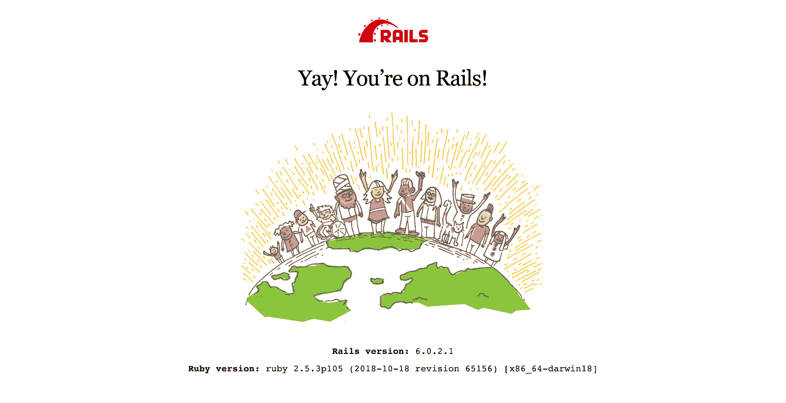
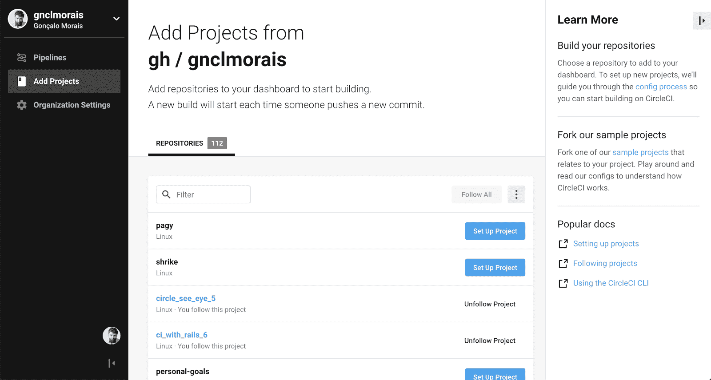
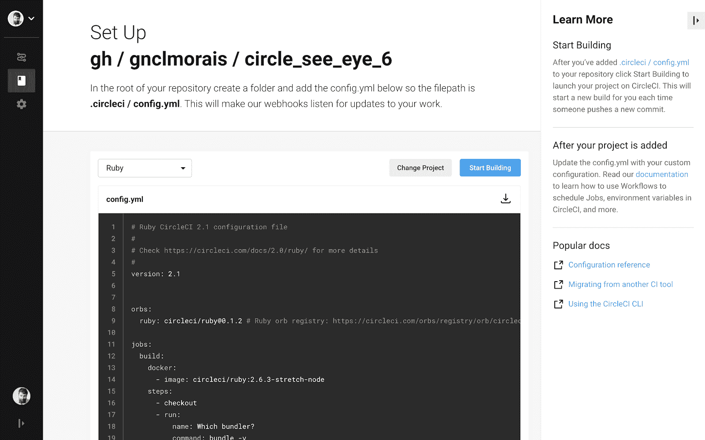
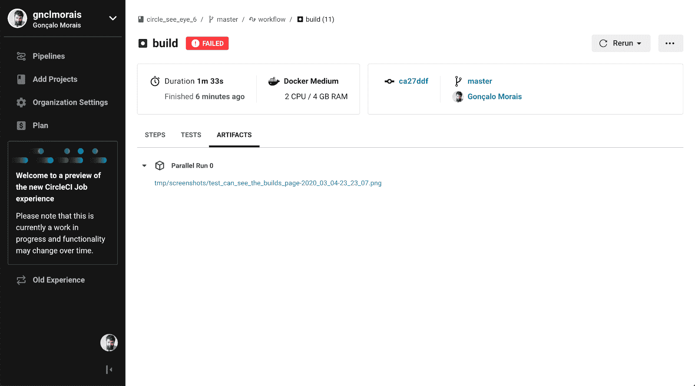

# 捕获失败的端到端测试的截图，这些测试在您的机器上通过，但在 CircleCI 上中断

> 原文：<https://circleci.com/blog/capture-screenshots-of-flaky-end-to-end-tests/>

如果你熟悉 Ruby on Rails，你就会知道它是一个内置了[测试实践的 web 框架](https://guides.rubyonrails.org/testing.html#why-write-tests-for-your-rails-applications-questionmark)。在我工作的公司， [BridgeU](https://bridge-u.com/) ，我们努力通过从[单元](https://en.wikipedia.org/wiki/Unit_testing)到[特性测试](https://en.wikipedia.org/wiki/Software_reliability_testing#Feature_test)的大量测试来尽可能地保护我们编写的特性。当正确设置时，测试套件会给你对系统的可靠信任感，并在你必须重构部分代码时提供指导——这是开发生命周期中不可避免的一部分。然而，建立一个全面而稳定的测试套件需要实践、经验和一点点尝试和错误。所有这些测试的目的是增加你对你的系统的信心，但是有一个问题会困扰这种安全感:古怪的测试。

## 背景

如果在您的[持续集成](https://circleci.com/continuous-integration/) (CI)系统上一次又一次地通过测试，那么一切都很好。如果它总是失败，那也不错——您可以发现它，了解它来自哪里，并解决它。然而，如果你遇到一个有时失败的测试，那可能是一个真正的挫折来源。您发现自己在测试真正通过和代码投入使用之前，在 CI 系统上点击了几次 rebuild。这可能看起来无害，但是如果几个开发人员一天多次发布新东西，那么时间浪费就很大了。

前一段时间，我们最大的挑战是 thoughtbot 所谓的特性测试，这是一种验收测试。这些是围绕整个应用程序的高级场景，以确保每个部分都能协同工作。也许是这些测试中移动部分的绝对数量，或者也许是它们更高层次的关注使我们更难准确预测较低层次变化的后果。事实是，我们发现自己创建了一个电子表格来记录这些古怪的测试，所以我们可以知道它们有多频繁。

这些测试的不稳定性使他们很难找到可重复的案例。此外，我们得到的错误信息根本不够丰富。我们开始寻找保留更多故障数据的方法，这时候我们突然想到了这一点。如果发生时我们看不到测试失败，那就拍张照片吧！唯一要弄清楚的是在 CI 系统上的哪里以及如何存储这些照片——但是有一个 API 可以做到这一点: [CircleCI Artifacts](https://circleci.com/docs/artifacts/) 。

归结起来就是:如果一个测试失败了，截取一个网页的截图并保存在某个地方——这样，我们可以在测试套件运行后查看失败的原因。有了所发生事情的图像，我们就可以知道从哪里开始寻找问题。从不再存在的简单按钮，到来自其他测试的后台 JavaScript 请求，以及对当前正在运行的测试的干扰，我们能够一个接一个地修复这些脆弱的测试。在本文中，我将向您展示如何用 CircleCI 设置这个截图收集过程。

## 示例应用程序

让我们设置一个 Rails 应用程序来看看它的运行情况。我们将使用有意义的默认值来加快设置过程。如果您已经有了一个想要设置屏幕截图收集的应用程序，您可以直接跳到“保存屏幕截图”部分。否则，请继续阅读。

我们假设你的机器上安装了 Ruby on Rails，但是如果你没有，有几个教程(比如[这个](https://guides.rubyonrails.org/v5.0/getting_started.html#installing-rails)，和[这个](https://gorails.com/setup/osx))可以带你去那里。现在已经安装了 Rails，您可以运行下面的代码来获得一个简单的应用程序来进行测试:

```
rails new circle_see_eye --skip-action-mailer --skip-active-storage --skip-javascript --skip-spring 
```

如果你在没有旗帜的情况下运行这个，我建议你去喝杯咖啡——这将需要一段时间。这些可选参数将跳过生产应用程序中可能需要的组件，但这些组件不是本演示所必需的。如果你对它们感兴趣，你可以通过运行 rails new-help 来检查所有可用的标志。

让我们确保设置好数据库，因为 Rails 自带 SQLite 支持:

```
cd circle_see_eye
bin/rails db:migrate 
```

注意:对我来说，设置 Rails 5 应用程序揭示了 sqlite3 上的一个小问题，在这里阅读更多。

应用程序设置的最后一步是确保一切按预期运行。进入刚刚创建的项目文件夹，运行您的服务器:bin/rails 服务器

你可以在`http://localhost:3000`看到你的新 Rails 应用！🙌



## 写一个测试

目前，我们没有测试。因为本文的目的是获得失败测试的可视化，所以让我们创建一个。如果你已经有了想看一眼的测试，直接跳到“保存截图”部分。

Rails 是围绕[资源](https://guides.rubyonrails.org/routing.html#resource-routing-the-rails-default)的概念构建的，因此对于这个应用程序，我们将使用 CircleCI: builds 上熟悉的东西。让我们创建一个 Builds 控制器，我们可以在其中设置一个#index 操作——只是一个供我们加载的默认页面。

```
bin/rails generate controller Builds index --no-test-framework 
```

检查 [Rails routes](https://guides.rubyonrails.org/routing.html#listing-existing-routeshttps://guides.rubyonrails.org/routing.html#listing-existing-routes) 会显示我们现在访问的页面及其路径:

```
bin/rails routes 
```

要快速加载我们创建的页面，只需使用 bin/rails server 再次运行您的服务器，并转到我们上面看到的路径，`http://localhost:3000/builds/index`。

我们现在准备为我们的特性编写一个测试！然而，这就是事情分裂的地方。

## 系统测试与集成测试

在其 5.1 版本中，Rails 引入了[系统测试](https://guides.rubyonrails.org/testing.html#system-testing)的概念，为用户交互测试带来了几个有用的默认值。我们不会详细讨论这个版本之前和之后的验收测试，但是让我们只说系统测试和它们的默认值，框架为你做了大部分的工作。从版本 5.1 开始，失败的系统测试的屏幕截图是开箱即用的，所以如果你有系统测试，你真幸运！然而，如果像我们一样，你不…有更多的设置要做。

## 启用系统测试？

如果你的应用有系统测试，做得好！这使得[设置测试](https://guides.rubyonrails.org/testing.html#implementing-a-system-test)变得更加容易。让我们再次运行我们神奇的 Rails 助手之一:

```
bin/rails generate system_test builds 
```

测试还没有做任何事情，它的所有代码都被注释掉了。让我们把它改成简单但真实的东西:

```
require "application_system_test_case"

class BuildsTest < ApplicationSystemTestCase
  test "visiting the index" do
    visit builds_index_url

    assert_selector "h1", text: "Builds"
  end
end 
```

您可以使用 bin/rails test:system 运行测试套件(目前只有这个测试)。既然我们已经看到它运行并通过，让我们让它失败。

改变…

```
 assert_selector "h1", text: "Builds" 
```

…到…

```
 assert_selector "h1", text: "Huzzah!" 
```

再次运行(`bin/rails test:system`)并等待它失败。我们现在建立了正确的条件，让我们的截图进入 CircleCI。接下来，让我们把你的项目放到 CircleCI 上。

## 没有系统测试？

如果您有一个在 Rails 5.1 之前启动的应用程序，很可能您没有进行系统测试，但是进行了某种端到端测试，可能由 Selenium 提供支持。如果你这样做了，很好，你可以跳到下一节“把你的项目放到 CircleCI 上”。如果你没有，让我们确保我们有一个案例运行。

让我们从为这个过程安装重要的宝石开始。打开您的 Gemfile 并添加:

```
group :test do
  gem 'activesupport-testing-metadata'
  gem 'capybara'
  gem 'webdrivers', '~> 4.0', require: false
end 
```

`activesupport-testing-metadata`将允许我们在 JavaScript 支持下标记要运行的测试(这样我们就可以截图)，水豚将使用硒来控制这些测试，而网络驱动程序是为测试提供真实浏览器的一种更新方式。

有了这些新的宝石，我们可以为这些类型的测试设置一个新的助手，让我们称之为`test/integration_test_helper.rb`:

```
require 'test_helper'

require 'active_support/testing/metadata'
require 'capybara/minitest'
require 'capybara/rails'
require 'webdrivers/geckodriver'

class AcceptanceTest < ActionDispatch::IntegrationTest
  include Capybara::DSL
  include Capybara::Minitest::Assertions

  setup do
    if metadata[:js]
      Capybara.current_driver = :selenium_headless
    end
  end

  teardown do
    if metadata[:js]
      Capybara.use_default_driver
    end
  end
end 
```

简单地说，这个文件是:

*   基于 Rails 的`ActionDispatch::IntegrationTest`创建一个新的测试类(`AcceptanceTest`)
*   包括有用的水豚助手
*   为此类连接两个挂钩，`setup`和`teardown`。他们将负责检查测试属性，并在需要时调用 JavaScript 驱动程序

有了我们的验收测试类，我们将创建一个使用它的测试，`test/integration/builds_test.rb`:

```
require 'integration_test_helper'

class BuildsTest < AcceptanceTest
  test "can see the builds page", js: true do
    visit builds_index_path

    assert has_content? "Builds#cats"
  end
end 
```

注意我们故意引入的错误，看看测试失败:`#index → #cats`。现在通过执行`bin/rails test`来运行这个测试，并观察它的失败。

我保证这是测试设置的最后一步。为了在同一级别的系统测试中直观地记录失败的测试，我们还需要一个东西:保存一个截图。

我们在应用程序中设置元数据 gem 的主要原因有两个:

*   为了保存截图，我们需要一个可以运行 JavaScript 的驱动程序，所以我们需要标记哪些测试需要不同的驱动程序；
*   我们可能会在一个浏览器上运行每个测试，但由于启动这些浏览器比使用 [Capybara 的默认驱动程序](https://github.com/teamcapybara/capybara#drivers) ( `rack_test`)需要更长的时间，所以根据具体情况战略性地使用另一个驱动程序是一个好的举措。

现在还有最后一步，允许我们新的`AcceptanceTest`类记录失败测试的截图。让我们编辑我们的集成测试助手，如下所示:

```
require 'test_helper'

require 'active_support/testing/metadata'
require 'capybara/minitest'
require 'capybara/rails'
require 'webdrivers/geckodriver'

class AcceptanceTest < ActionDispatch::IntegrationTest
  include Capybara::DSL
  include Capybara::Minitest::Assertions

  setup do
    if metadata[:js]
      Capybara.current_driver = :selenium_headless
    end
  end

  teardown do
    if metadata[:js]
      save_timestamped_screenshot(Capybara.page) unless passed?

      Capybara.use_default_driver
    end
  end

  private

  def save_timestamped_screenshot(page)
    timestamp = Time.zone.now.strftime("%Y_%m_%d-%H_%M_%S")
    filename = "#{method_name}-#{timestamp}.png"
    screenshot_path = Rails.root.join("tmp", "screenshots", filename)

    page.save_screenshot(screenshot_path)
  end
end 
```

我们添加的方法将获得当前时间戳，为我们将要保存的图像创建一个路径，并将当前页面的截图保存到该路径中(在`tmp/screenshots/`内的某个位置)。这将只针对标有`js: true`且未通过的测试运行。我们现在正处于一个很好的时机，可以在 CircleCI 上保存这些截图，以供以后分析。

## 把你的项目放到 CircleCI 上

在 CircleCI 上看到任何东西之前，我们还需要一样东西:CircleCI 配置。您可以[前往文档](https://circleci.com/docs/language-ruby/#build-the-demo-ruby-on-rails-project-yourself)阅读更多相关内容，但 CircleCI 上有一个有用的总结，告诉您如何在添加项目后立即完成:



为了简单起见，我们从 GitHub 仓库添加我们的项目。只需点击 Set Up Project，您将看到一个简单的操作说明和一个要添加的示例 CircleCI 配置文件:



好了，让我们按照说明(添加配置文件，推到 GitHub 并按下开始构建)看看我们得到了什么。不要忘记将 gem 文件中的 Ruby 版本与`.circleci/config.yml`上的版本进行匹配。Rails 文件的最小功能配置如下所示，例如:

```
version: 2.1
orbs:
  ruby: circleci/ruby@0.1.2

jobs:
  build:
    docker:
      - image: circleci/ruby:2.5.3-stretch-node-browsers
    steps:
      - checkout
      - run:
          name: Install dependencies
          command: bundle
      - run:
          name: Database setup
          command: bin/rails db:migrate
      - run:
          name: Run tests
          command: bin/rails test 
```

第一次构建可能需要一段时间，因为还没有为它缓存任何东西，并且需要获取和安装所有的 gem。但是现在我们已经有了一个工作管道，让我们建立一个测试并捕捉它的失败。

## 保存截图

现在我们已经准备好了一切，我们的应用程序已经有了可视化测试，让我们告诉 CircleCI 保存它们以供以后分析。记住困难的工作已经完成:您的应用程序截取失败测试的截图并保存这些图片。如果你有这个，现在在 CircleCI 上保存它们就很简单了。

你可以在[文档](https://circleci.com/docs/artifacts/)中读到更多关于它的内容，但是关键是工件的概念——它们在工作完成后仍然存在。考虑到这一点，我们需要在我们的`.circleci/config.yml`文件中描述我们希望保存什么工件。

打开 CircleCI 配置文件，将以下内容作为最后一项添加到 steps 键中:

```
 - store_artifacts:
          path: tmp/screenshots 
```

从现在开始，每当你的测试套件在 CircleCI 上运行并且一个可视化测试失败时，Rails 将会截取一个失败的截图，CircleCI 将会保存它以备将来调查。以下是您将在界面中看到的内容，以及我们的屏幕截图:



## 结论

古怪的测试令人讨厌，但是有一些工具可以帮助你摆脱它们。有了正确的心态，他们会教你避免有问题的情况，并帮助你建立更健壮的测试用例场景。在 BridgeU，对这些问题进行截图有助于我们识别某些测试相互干扰的情况，并且我们的测试实践也因此得到了改进。

此外，为什么只在测试失败时截图？也许您可以使用这种技术来自动抓取产品的更新快照，并帮助您保持文档或营销材料的更新。你的想象力是这项技术带来的所有自动化可能性的极限！

* * *

贡萨洛·莫莱斯是一名计算机工程师，对网络情有独钟。他目前正在帮助 BridgeU 的学生选择更好的职业，由 Rails 和 JavaScript 提供支持。Gonç alo 是 Recurse 中心的校友，偶尔也是 ultrarunner 和 boulderer。

[阅读更多贡萨洛·莫莱斯的文章](/blog/author/goncalo-morais/)