# 自动将 Angular 应用部署到 Firebase | CircleCI

> 原文：<https://circleci.com/blog/cd-angular-firebase/>

> 本教程涵盖:
> 
> 1.  克隆示例应用程序
> 2.  在 Firebase 上创建和设置项目
> 3.  初始化和部署项目

开发人员使用 Angular、React 和 Vue.js 等 JavaScript 框架构建各种各样的单页面应用程序，从简单到复杂。通过分离 JavaScript 和 CSS，框架让开发团队以模块化的代码块来构建应用程序，实现单一的功能。

这很好，但是一旦您的应用程序准备好部署到生产环境中，您将需要一个命令来编译并将独立的文件捆绑成一个文件。然后，您将需要部署到一个平台，如 Firebase 托管。

Firebase 是 Google 开发的一个开发平台，提供文件存储、托管、数据库、认证和分析。Firebase 是免费的，默认提供 SSL 证书，并在多个地区提供令人印象深刻的速度。

在本教程中，我将向您展示如何为一个 Angular 应用程序设置持续部署到 Firebase 主机。

## 先决条件

对于本教程，您需要:

> 我们的教程是平台无关的，但是使用 CircleCI 作为例子。如果你没有 CircleCI 账号，请在 注册一个免费的 [**。**](https://circleci.com/signup/)

## 克隆演示项目

要开始，请运行以下命令:

```
git clone https://github.com/CIRCLECI-GWP/circleci-angular-demo.git angular-ci-firebase 
```

Git 会将演示应用程序克隆到一个名为`angular-ci-firebase`的新文件夹中。进入新克隆的应用程序并安装其所有依赖项:

```
// Change directory
cd angular-ci-firebase

// Install dependencies
npm install

// Run the application
ng serve 
```

转到`http://localhost:4200`打开应用程序。

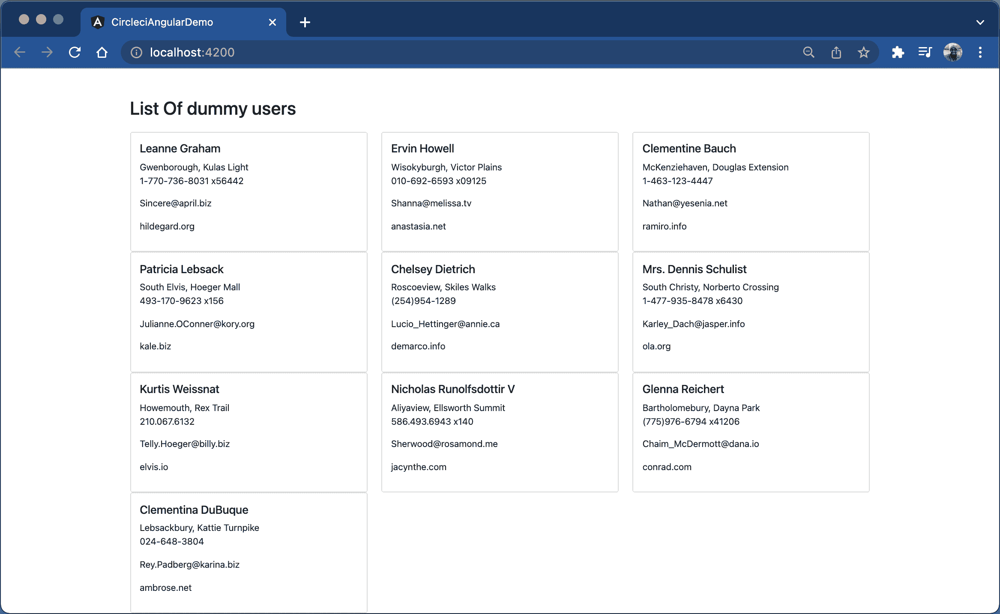

这个应用程序从测试用的免费 Rest API 中检索虚拟用户列表。

## 在本地运行测试

使用以下命令运行应用程序测试:

```
npm run test 
```

下面的输出将是这样的:

```
> circleci-angular-demo@0.0.0 test
> ng test --no-watch --no-progress --browsers=ChromeHeadless

06 02 2022 10:10:27.402:INFO [karma-server]: Karma v6.3.9 server started at http://localhost:9876/
06 02 2022 10:10:27.406:INFO [launcher]: Launching browsers ChromeHeadless with concurrency unlimited
06 02 2022 10:10:30.530:INFO [launcher]: Starting browser ChromeHeadless
06 02 2022 10:10:37.570:INFO [Chrome Headless 97.0.4692.99 (Mac OS 10.15.7)]: Connected on socket njOp1_5ETVTaRVo-AAAB with id 68498281
Chrome Headless 97.0.4692.99 (Mac OS 10.15.7): Executed 4 of 4 SUCCESS (0.001 secs / 0.055 secs)
TOTAL: 4 SUCCESS 
```

演示应用程序现在已经在本地设置好了，并且运行良好。

## 在 Firebase 上创建项目

如果你还没有这样做，打开一个 [Firebase 账户](https://firebase.google.com/)，导航到 Firebase 主页，点击**创建一个项目**。

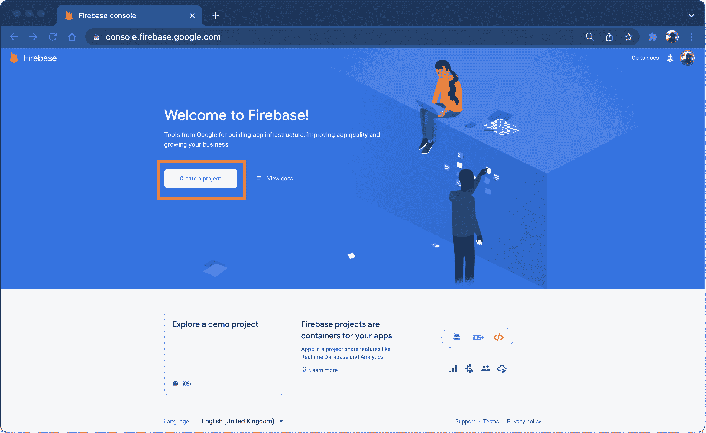

接下来，使用以下步骤:

1.  点击**添加项目**按钮。
2.  输入项目的名称。我给我的取名为`angular-ci-project`。请记住，项目 id 在 Firebase 中是唯一的。
3.  点击**继续**。
4.  禁用谷歌分析；这个项目不需要它。
5.  再次点击**继续**。

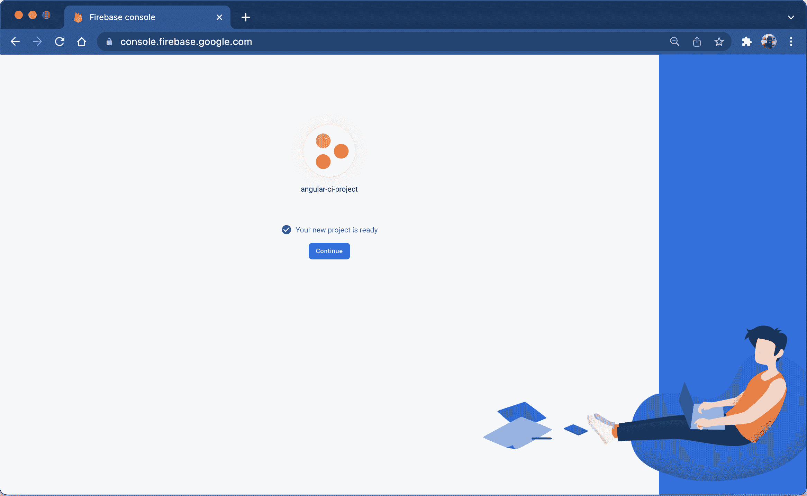

这就是了。您已经成功地在 Firebase 上创建了一个项目。

## 设置 Firebase 托管

为了在 Firebase 上成功地托管您的应用程序，您需要安装它的工具，并在您的项目中初始化它。

### 安装 Firebase CLI

打开新的终端。要全局安装 Firebase 工具，请运行以下命令:

```
npm install -g firebase-tools 
```

您现在可以全局访问 Firebase 命令行界面工具。您可以使用它们将代码和资产部署到新创建的 Firebase 项目中。

### 初始化 Firebase 项目

从终端登录到您的 Firebase 帐户:

```
firebase login 
```

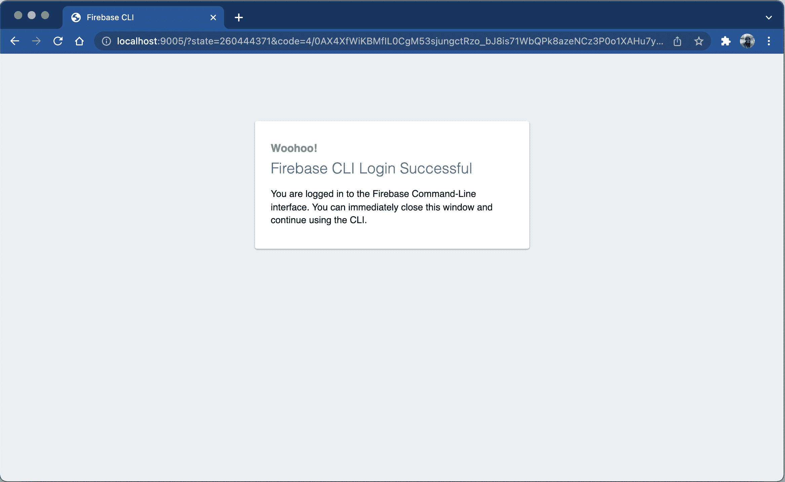

接下来，初始化项目:

```
firebase init 
```

系统会提示您回答一些问题。

*   选择托管:为 Firebase 托管配置文件，并(可选)设置 GitHub 操作部署。
*   使用现有项目:选择您之前创建的 Firebase 项目:`angular-ci-project`。
*   输入`dist/angular-ci-firebase`作为公共目录。注意`angular-ci-firebase`是项目文件夹的名称。如果您的不同，请更改此内容。
*   配置为单页应用程序:是。
*   使用 GitHub: No 设置自动构建和部署。对于本教程，我们使用 CircleCI 来运行测试和处理部署。

下面是步骤的输出和截图。

```
 ######## #### ########  ######## ########     ###     ######  ########
     ##        ##  ##     ## ##       ##     ##  ##   ##  ##       ##
     ######    ##  ########  ######   ########  #########  ######  ######
     ##        ##  ##    ##  ##       ##     ## ##     ##       ## ##
     ##       #### ##     ## ######## ########  ##     ##  ######  ########

You're about to initialize a Firebase project in this directory:

  /Users/yemiwebby/tutorial/circleci/angular/angular-ci-firebase

? Which Firebase features do you want to set up for this directory? Press Space to select features, then Enter to confirm your choices. Hosting: Configure files for Firebase Hosting and (optionally)
 set up GitHub Action deploys

=== Project Setup

First, let's associate this project directory with a Firebase project.
You can create multiple project aliases by running firebase use --add,
but for now we'll just set up a default project.

? Please select an option: Use an existing project
? Select a default Firebase project for this directory: angular-ci-project (angular-ci-project)
i  Using project angular-ci-project (angular-ci-project)

=== Hosting Setup

Your public directory is the folder (relative to your project directory) that
will contain Hosting assets to be uploaded with firebase deploy. If you
have a build process for your assets, use your build's output directory.

? What do you want to use as your public directory? dist/angular-ci-firebase
? Configure as a single-page app (rewrite all urls to /index.html)? Yes
? Set up automatic builds and deploys with GitHub? No
✔  Wrote dist/angular-ci-firebase/index.html

i  Writing configuration info to firebase.json...
i  Writing project information to .firebaserc...

✔  Firebase initialization complete! 
```

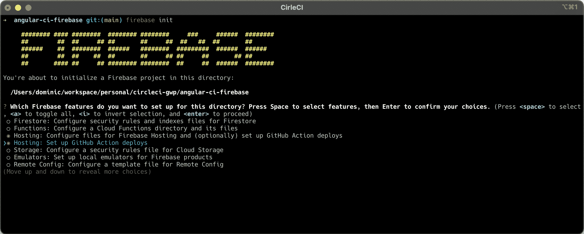

项目的初始化过程还在项目的根目录下生成了两个唯一的文件。这些文件是成功部署所必需的，并且必须签入源代码管理。它们是:

*   `firebase.json`包含您项目的托管配置。它的内容指示 Firebase CLI 上传和部署项目目录中的文件。
*   `.firebaserc`指定成功部署到 Firebase 后，连接到上传代码的项目。

## 更改输出路径

一旦您准备好构建您的生产应用程序，Angular CLI 将把它编译成在`angular.json`文件中指定的输出路径。打开这个文件，确保`outputPath`指向`dist/angular-ci-firebase`:

```
 "build": {
          "builder": "@angular-devkit/build-angular:browser",
          "options": {
            "outputPath": "dist/angular-ci-firebase",
            "index": "src/index.html",
            "main": "src/main.ts",
            "polyfills": "src/polyfills.ts",
            "tsConfig": "tsconfig.app.json",
            "assets": ["src/favicon.ico", "src/assets"],
            "styles": [
              "./node_modules/bootstrap/dist/css/bootstrap.css",
              "src/styles.css"
            ],
            "scripts": []
          }, 
```

## 配置 CircleCI

接下来，将`.circleci/config.yml`的内容替换为:

```
version: 2.1
orbs:
  browser-tools: circleci/browser-tools@1.2.3
jobs:
  build:
    working_directory: ~/ng-project
    docker:
      - image: cimg/node:16.13.1-browsers
    steps:
      - browser-tools/install-chrome
      - browser-tools/install-chromedriver
      - run:
          command: |
            google-chrome --version
            chromedriver --version
          name: Check install
      - checkout
      - restore_cache:
          key: ng-project-{{ .Branch }}-{{ checksum "package-lock.json" }}
      - run: npm install
      - run: npm install --save-dev firebase-tools
      - save_cache:
          key: ng-project-{{ .Branch }}-{{ checksum "package-lock.json" }}
          paths:
            - "node_modules"
      - run:
          name: "Run test"
          command: npm run test
      - run:
          name: "Build application for production"
          command: npm run build
      - run:
          name: "Deploy app to Firebase Hosting"
          command: "./node_modules/.bin/firebase deploy --token=$FIREBASE_TOKEN" 
```

这个配置指定了在 CircleCI 上安装和运行应用程序测试所需的所有工具。config 用`npm install --save-dev firebase-tools`安装了 Firebase 工具，并设置了一个命令，一旦测试成功，就自动将应用程序部署到 Firebase。

部署将需要`FIREBASE_TOKEN`。由于您是从终端登录的，因此可以使用 Firebase CLI 轻松创建令牌。输入以下命令:

```
firebase login:ci 
```

这将打开一个浏览器，您可以在其中验证您的帐户。然后，令牌会打印在您的终端上。

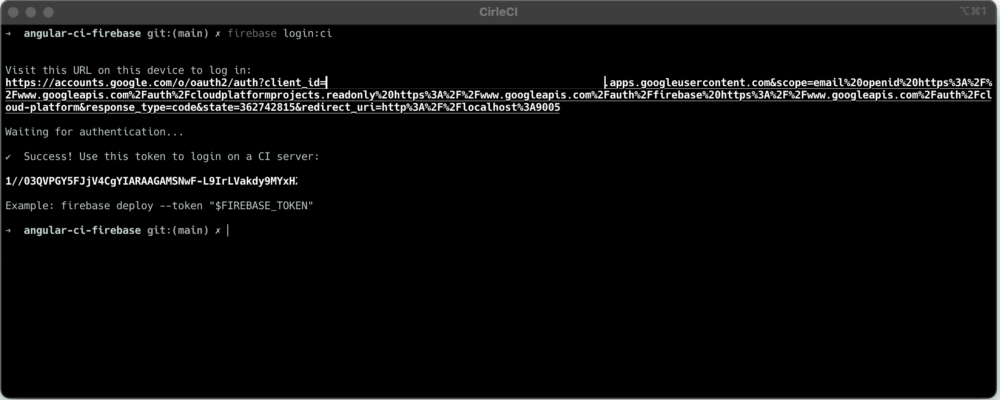

把这个复制下来，保存在方便的地方。你以后会需要它的。

下一步是在 GitHub 上建立一个资源库，并将项目链接到 CircleCI。查看[将项目推送到 GitHub](https://circleci.com/blog/pushing-a-project-to-github/) 以获取指示。

登录您的 CircleCI 帐户。如果你注册了你的 GitHub 账户，你所有的库都可以在你项目的仪表盘上看到。

在您的`angular-ci-firebase`项目旁边，点击**设置项目**。

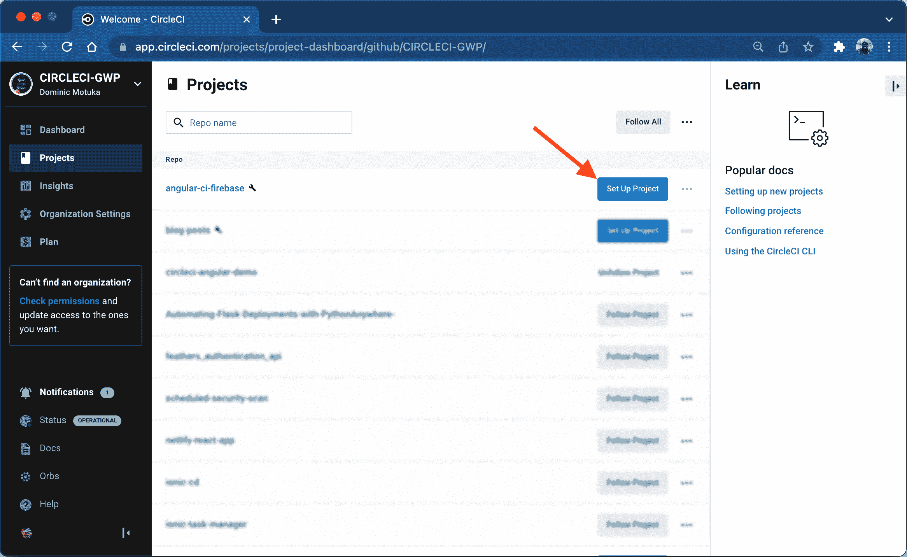

系统将提示您编写新的配置文件或使用现有的配置文件。选择现有的分支，并输入您的代码在 GitHub 上所在的分支的名称。点击**走吧**。

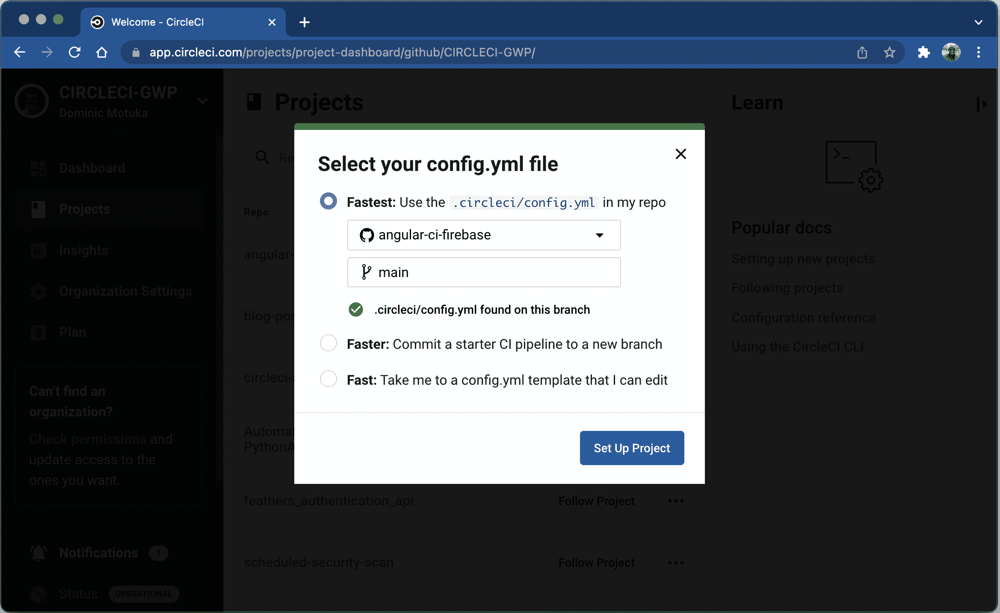

您的第一个工作流将开始运行，但是不出所料，构建将会失败，因为您还没有创建`FIREBASE_TOKEN`环境变量。

要解决这个问题，您需要添加`FIREBASE_TOKEN`作为环境变量。点击**项目设置**。

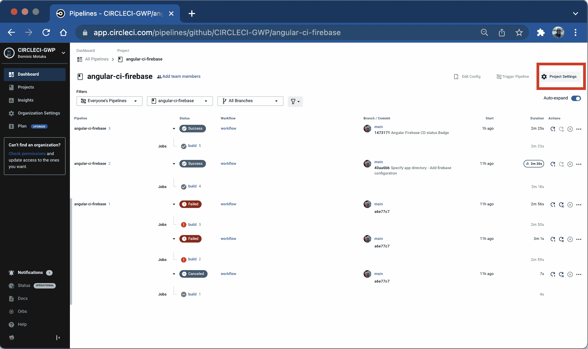

点击左侧工具条上的**环境变量**并创建该变量:

*   `FIREBASE_TOKEN`是您之前从终端生成的令牌的值。

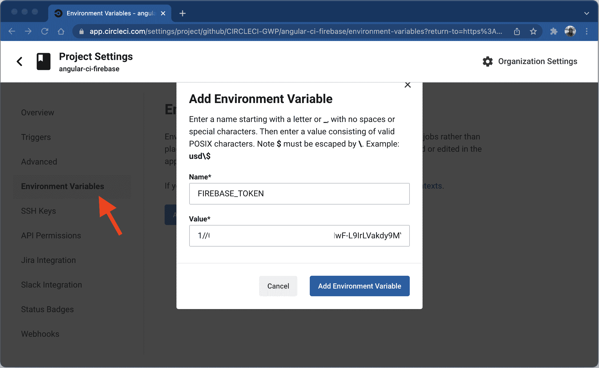

回到仪表板。点击**从失败的**重新运行工作流程。

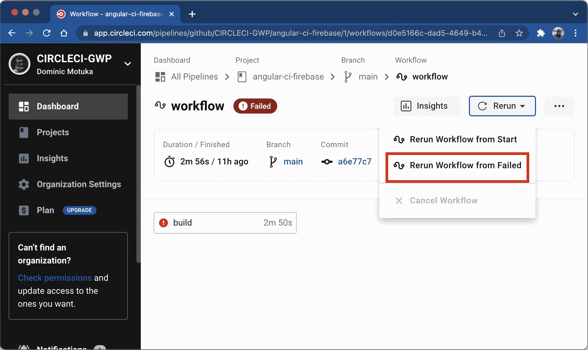

您的构建应该会成功完成！

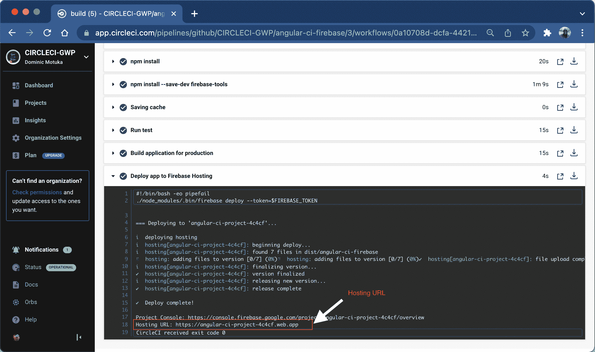

导航到上一步中显示的托管 URL。对我来说网址是:`https://angular-ci-project-4c4cf.web.app`。

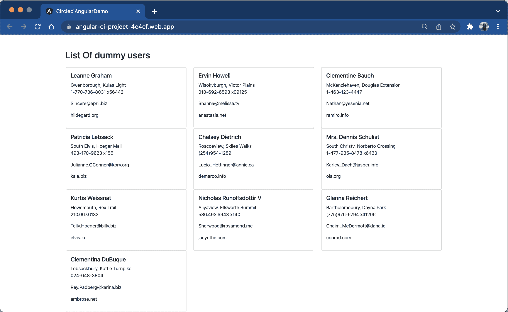

## 结论

您已经到达了本 Angular to Firebase 部署教程的末尾。在系统上本地安装 Firebase 工具后，您可以直接部署到 Firebase，但是这违背了持续集成和部署的目的。理想的方法是使用 CircleCI 这样的平台运行测试，一旦测试通过，立即部署到您的主机提供商，在这种情况下是 Firebase。

利用您在本教程中学到的知识，您可以在每次更改代码库时轻松地运行测试和部署应用程序。

我希望这对你有所帮助。本教程的完整源代码可以在 GitHub 上找到[。](https://github.com/yemiwebby/angular-ci-firebase)

* * *

[Oluyemi](https://twitter.com/yemiwebby) 是一名拥有电信工程背景的技术爱好者。出于对解决用户日常遇到的问题的浓厚兴趣，他冒险进入编程领域，并从那时起将他解决问题的技能用于构建 web 和移动软件。Oluyemi 是一名热衷于分享知识的全栈软件工程师，他在世界各地的几个博客上发表了大量技术文章和博客文章。由于精通技术，他的爱好包括尝试新的编程语言和框架。

* * *

Oluyemi 是一名拥有电信工程背景的技术爱好者。出于对解决用户日常遇到的问题的浓厚兴趣，他冒险进入编程领域，并从那时起将他的问题解决技能用于构建 web 和移动软件。Oluyemi 是一名热衷于分享知识的全栈软件工程师，他在世界各地的几个博客上发表了大量技术文章和博客文章。作为技术专家，他的爱好包括尝试新的编程语言和框架。

[阅读更多 Olususi Oluyemi 的帖子](/blog/author/olususi-oluyemi/)