# 将 Node.js 持续部署到 Azure VM | CircleCI

> 原文：<https://circleci.com/blog/cd-azure-vm/>

虚拟机为托管 web 应用程序提供了极大的灵活性。作为开发人员或工程师，您可以配置和控制应用程序运行所需的每个软件和每个设置。 [Azure](https://azure.microsoft.com/) ，最大的云托管平台之一，为基于 Linux 和 Windows 的操作系统提供虚拟机产品。在本教程中，您将学习如何设置一个连续部署管道来将 Node.js 应用程序部署到 Azure 虚拟机。

## 先决条件

要跟进这篇文章，需要做一些事情:

1.  您系统上安装的 [Node.js](https://nodejs.org) (版本> = 10.3)
2.  一个蓝色的账户
3.  一个[圆](https://circleci.com/)的账户
4.  GitHub 的一个账户
5.  安装在您系统上的 Azure CLI

> 我们的教程是平台无关的，但是使用 CircleCI 作为例子。如果你没有 CircleCI 账号，请在 注册一个免费的 [**。**](https://circleci.com/signup/)

安装并设置好所有这些之后，您就可以开始本教程了。

## 克隆 Node.js 项目

首先，您需要克隆将要部署到 Azure VM 的项目。这个项目是一个基本的 Node.js API，它有一个端点用于返回一组`todo`对象。转到您想要存储项目的位置并克隆它:

```
git clone --single-branch --branch base-project https://github.com/CIRCLECI-GWP/cd-node-azure-vm.git 
```

项目克隆完成后，转到项目的根目录并安装依赖项:

```
cd cd-node-azure-vm
npm install 
```

使用`npm run dev`命令运行应用程序。应用程序将在地址`http://localhost:3000`启动。当应用程序启动并运行时，在浏览器中输入`http://localhost:3000/todos`以查看`todos`列表。

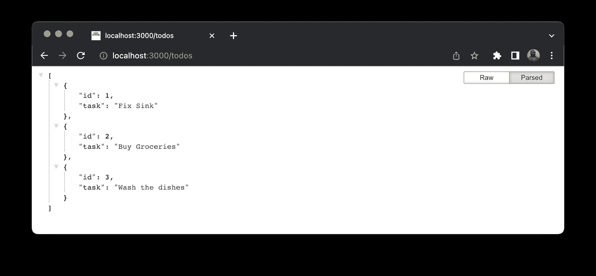

现在，转到项目的`package.json`文件，将这些脚本添加到`scripts`部分:

```
"scripts": {
    .....,
    "stop": "pm2 kill",
    "start": "pm2 start server.js"
} 
```

`start`和`stop`脚本将使用 [pm2](https://www.npmjs.com/package/pm2) 进程管理器来启动和停止虚拟机上的 Node.js 应用程序。当`pm2`脚本设置好后，它将被全局安装在虚拟机上。

在项目的根目录下，运行`rm -rf .git`命令来删除任何`.git`历史。然后[把项目推给 GitHub](https://circleci.com/blog/pushing-a-project-to-github/) 。确保这是连接到您的 CircleCI 帐户的 GitHub 帐户。

## 在 Azure 上设置虚拟机以运行 Node.js

接下来，在 Azure 上创建一个新的 VM，并设置它的环境来托管 Node.js 应用程序。这些是步骤:

1.  创建新的虚拟机实例
2.  安装〔t0〕engine〔t1〕
3.  将`nginx`配置为代理服务器。将虚拟机上端口`80`的所有流量路由到端口`3000`上正在运行的 Node.js 应用程序实例
4.  在虚拟机上安装 Node.js，并将应用程序从 GitHub repo 克隆到虚拟机的一个文件夹中
5.  全局安装`pm2`

不要被这些步骤的复杂性吓倒！您可以用一个命令完成这五项任务。在项目的根目录下，创建一个名为`cloud-init-github.txt`的新文件；这是一个[云初始化](https://cloudinit.readthedocs.io/en/latest/index.html)文件。Cloud-init 是云实例初始化的行业标准方法。

在云初始化文件中，输入:

```
#cloud-config
package_upgrade: true
packages:
  - nginx
write_files:
  - owner: www-data:www-data
    path: /etc/nginx/sites-available/default
    content: |
      server {
        listen 80;
        location / {
          proxy_pass http://localhost:3000;
          proxy_http_version 1.1;
          proxy_set_header Upgrade $http_upgrade;
          proxy_set_header Connection keep-alive;
          proxy_set_header X-Forwarded-For $remote_addr;
          proxy_set_header Host $host;
          proxy_cache_bypass $http_upgrade;
        }
      }
runcmd:
  # install Node.js
  - 'curl -sL https://deb.nodesource.com/setup_12.x | sudo -E bash -'
  - 'sudo apt-get install -y nodejs'
  # clone GitHub Repo into myapp directory
  - 'cd /home/azureuser'
  - git clone "https://github.com/CIRCLECI-GWP/cd-node-azure-vm" myapp
  # Install pm2
  - 'sudo npm install pm2 -g'
  # restart NGINX
  - service nginx restart 
```

我前面描述的所有五个步骤都包含在这个文件中。确保在`git clone`命令中用您的存储库的名称替换示例 GitHub repo。注意，您正在主目录`/home/azureuser`下的`myapp`文件夹中克隆项目。

接下来，使用上面文件中的配置在 Azure 上创建一个新的 VM 实例。确保您在 CLI 上登录到 Azure(运行`az login`登录):

首先，您需要一个资源组。运行以下命令创建一个:

```
az group create --name Demos-Group --location eastus 
```

**注意:** *您不必为此创建新的资源组。如果您愿意，可以使用现有的。*

接下来，运行以下命令创建虚拟机实例:

```
az vm create --resource-group Demos-Group --name node-vm --image UbuntuLTS --admin-username azureuser --custom-data cloud-init-github.txt --generate-ssh-keys 
```

记下命令中每个参数集的值:

*   `Demos-Group`是您正在其中创建虚拟机的 Azure 资源组
*   `node-vm`是您的虚拟机的名称
*   `eastus`是您正在创建虚拟机的区域
*   `UbuntuLTS`是虚拟机操作系统
*   `azureuser`是虚拟机的管理员用户；它将用于通过 SSH 连接到虚拟机
*   `cloud-init-github.txt`是你刚刚写的云 VM 配置文件

当命令运行完毕时，一个响应对象被打印到屏幕上。确保保存了对象的`privateIpAddress`属性。`privateIpAddress`是您将用于在浏览器中通过`ssh`访问您的应用程序的 IP 地址。

转到 Azure 门户中的资源页面。点击**虚拟机**查看您的虚拟机实例。

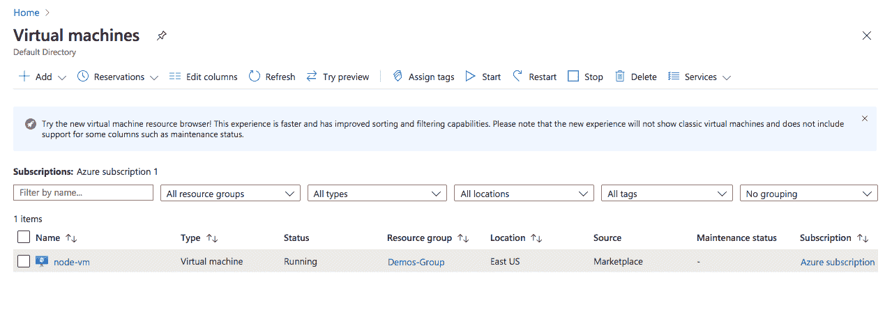

默认情况下，虚拟机上的 Web 端口`80`未打开。您需要显式打开此端口，以允许 web 请求到达服务器。要打开端口`80`，运行:

```
az vm open-port --port 80 --resource-group Demos-Group --name node-vm 
```

请注意，虚拟机名称和资源组是在该命令中传递的。当这个命令完成后，一大块`json`就会打印在您的 CLI 上。我们在教程中不会用到它，所以可以忽略它。

## 在服务器上生成 SSH 密钥

您的下一步是在服务器上生成`ssh`密钥，以允许连续部署管道脚本访问 VM。

SSH 到您的服务器，确保用设置 VM 时返回的内容替换`YOUR-PUBLIC-IP-ADDRESS`:

```
ssh azureuser@YOUR-PUBLIC-IP-ADDRESS 
```

这个命令让您进入主目录。通过运行`cd .ssh`转到`.ssh`文件夹。生成 ssh 密钥:

```
ssh-keygen 
```

按**键输入**接受默认位置，文件名为`id_rsa`。CircleCI 需要一个空密码进行访问，因此按两次 **Enter** 以响应`passphrase`和`confirm passphrase`提示。

接下来，通过运行以下命令将公钥的内容附加到`authorized_keys`文件中:

```
cat id_rsa.pub >> authorized_keys 
```

然后，打印出私钥的内容:

```
cat id_rsa 
```

复制这些信息并保存在安全的地方。稍后您将把它添加到 CircleCI。

## 向虚拟机用户分配权限

在设置过程中克隆项目文件夹时，`root`用户创建了`myapp`文件夹。这意味着您的虚拟机管理员用户`azureuser`不能更新`myapp`文件夹的内容。你需要给你的虚拟机的管理员用户更新`myapp`文件夹的权限。

首先，确保您已经从`.ssh`文件夹移回到包含`myapp`的主目录。使用命令将`azureuser`更改为默认组`root`:

```
sudo usermod -g root azureuser 
```

接下来，您需要将`myapp`中所有文件的所有者和组更改为`azureuser`和`root`。使用命令:

```
sudo chown -R azureuser:root myapp 
```

现在，如果您运行`ls -l myapp`，您将看到输出表明`azureuser`拥有`myapp`及其内容的所有权。

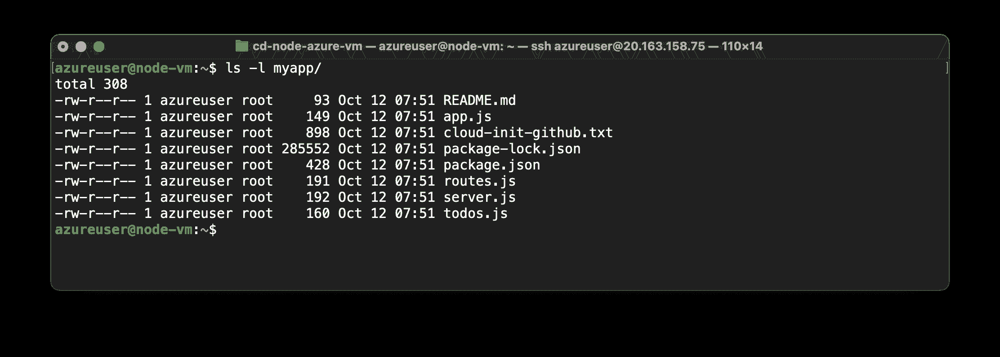

您现在可以为`owner`和`group`设置所有文件夹和文件的读/写/执行权限，而为`public`设置任何权限。输入:

```
sudo chmod -R 770 myapp 
```

## 配置部署管道

在项目的根目录下，创建一个文件夹，并将其命名为`.circleci`。在该文件夹中，创建一个名为`config.yml`的文件。在`config.yml`里面，输入这个代码:

```
version: 2.1
jobs:
  build:
    working_directory: ~/repo
    docker:
      - image: cimg/node:18.10.0
    steps:
      - checkout
      - add_ssh_keys:
          fingerprints:
            - $AZURE_VM_SSH_FINGERPRINT
      - run:
          name: Copy updated files to VM
          command: scp -o StrictHostKeyChecking=no -r ./* $AZURE_VM_USER@$AZURE_VM_IP:~/myapp

  deploy:
    machine:
      enabled: true
    steps:
      - run:
          name: Deploy Over SSH
          command: |
            ssh $AZURE_VM_USER@$AZURE_VM_IP "cd myapp && sudo npm run-script stop && sudo npm install && sudo npm start"

workflows:
  version: 2
  build:
    jobs:
      - build:
        filters:
          branches:
            only: main
      - deploy:
          requires:
            - build
          filters:
            branches:
              only: main 
```

您的新`config.yml`文件包含两个任务。

`build`作业检查代码，并使用 SSH 密钥将更新的文件从应用程序安全地复制到 Azure VM `myapp`文件夹，使用`scp`命令。该命令的`StrictHostKeyChecking=no`部分抑制了要求确认检查主机密钥的提示。这可以防止提示阻塞自动化过程。

然后,`deploy`作业通过 SSH 部署应用程序。它进入`myapp`文件夹，停止应用程序，安装依赖项，并重启应用程序。

`config.yml`文件包含一个`workflow`定义，确保在`deploy`运行之前`build`任务成功完成。工作流还确保只有当代码被推送到`main`分支时，部署才会发生。当团队成员正在推进特性分支时，这阻止了应用程序的部署。

下一步是用新的更新来更新存储库。查看[将项目推送到 GitHub](https://circleci.com/blog/pushing-a-project-to-github/) 以获取指示。

## 将项目添加到 CircleCI

首先，确保您已经将项目的最新更新发布到了 GitHub。接下来，登录您的 CircleCI 帐户。如果你注册了你的 GitHub 账户，你所有的库都可以在你项目的仪表盘上看到。

找到你的`cd-node-azure-vm`项目，点击**设置项目**。

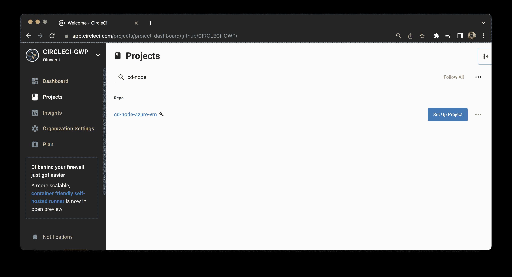

出现提示时，输入`main`作为包含您的 CircleCI 配置的 GitHub 分支的名称，然后点击**设置项目**。

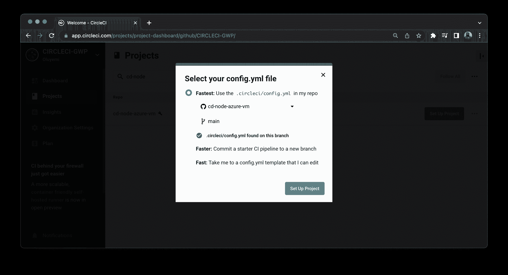

CircleCI 然后将启动我们的管道，它将运行测试，但无法部署。此构建失败，因为您尚未设置配置文件来存放 Azure 上虚拟机的变量。

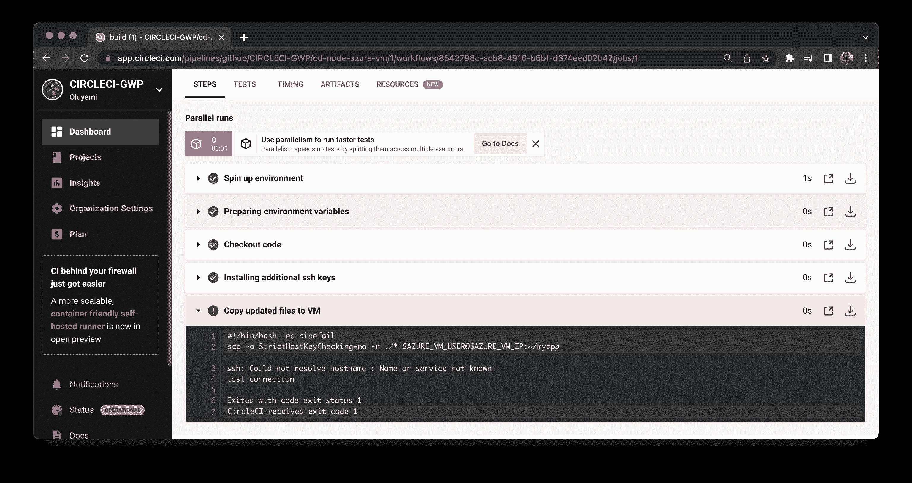

### 创建管道配置环境变量

要解决这个问题，首先添加您之前保存的 SSH 密钥(您复制到安全位置的私有密钥)。转到项目的项目设置页面。从侧面菜单中，点击 **SSH 按键**。向下滚动到附加 SSH 密钥部分并点击**添加 SSH 密钥**。出现提示时，在**主机名**字段中输入您的公共 IP，在**私钥**字段中输入您的私钥。点击**添加 SSH 密钥**保存信息。

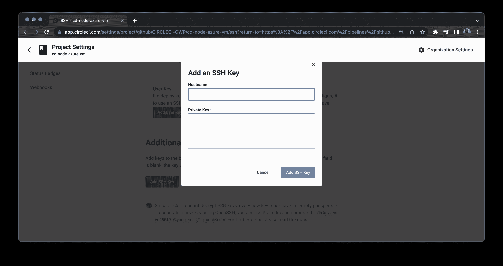

添加密钥后，它将显示在附加 SSH 密钥部分的表格中的主机名/指纹对中。复制这个指纹。管道配置文件中将需要它。

因为 VM 用户和公共 IP 将在管道配置中使用，所以最好将它们作为环境变量。从侧面菜单中，点击**环境变量**并输入以下信息:

*   对于`AZURE_VM_SSH_FINGERPRINT`，输入添加 SSH 密钥后生成的指纹
*   对于`AZURE_VM_USER`，输入虚拟机管理员，`azureuser`
*   在`AZURE_VM_IP`中输入您的虚拟机公共 IP 地址

回到仪表板。点击**从失败的**重新运行工作流程。这将触发工作流，这次应该会成功构建。

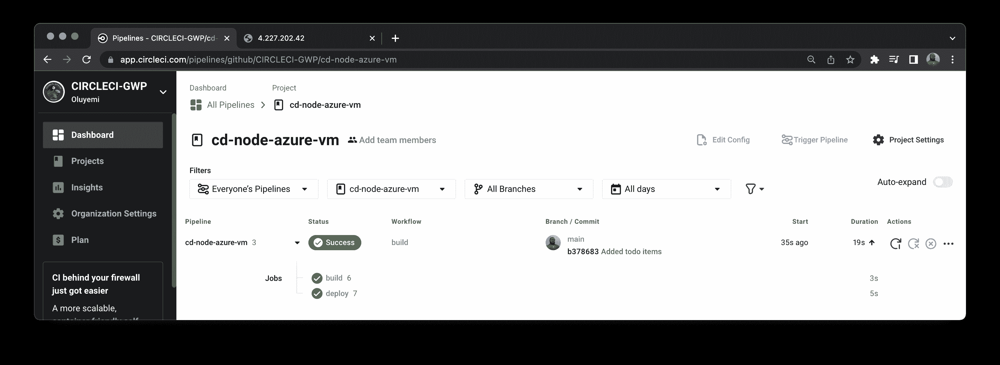

点击`build`任务查看详细信息。

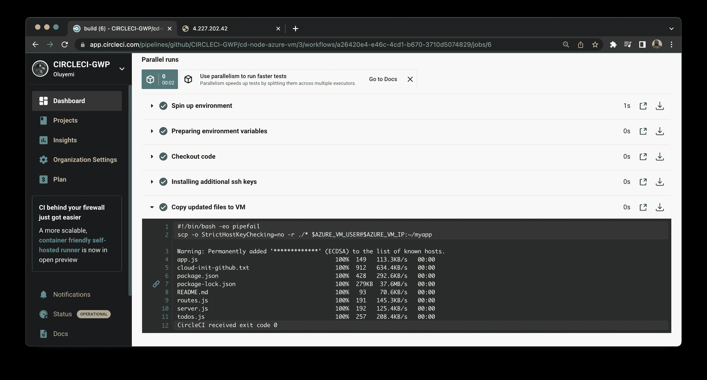

接下来，单击`deploy`任务查看其详细信息。

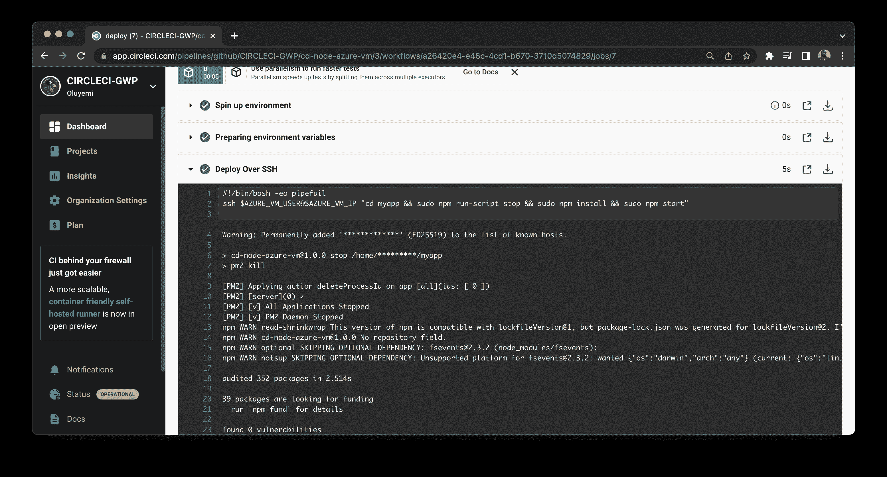

所以工作流程运行顺畅。这很好，但是更有说服力的流程测试是在浏览器中打开部署的应用程序。在您的浏览器中，加载端点`http://[YOUR_PUBLIC_IP]/todos`。确保用正确的信息替换占位符`YOUR_PUBLIC_IP`。

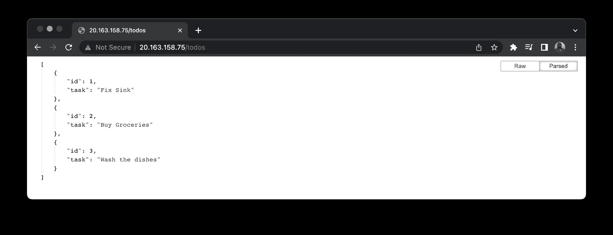

现在，*那个*是有说服力的。

接下来，向您的`todos.js`文件添加更多的`todo`对象:

```
module.exports = [
  ...,
  {
    id: 4,
    task: "Make Dinner"
  },
  {
    id: 5,
    task: "Take out the trash"
  }
]; 
```

提交您的更新并将其推送到您的存储库，以再次运行管道。工作流完成后，重新加载浏览器以检查您的更改。

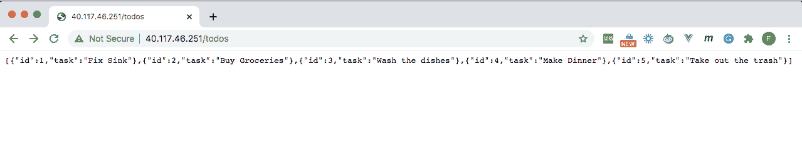

## 结论

虚拟机具有强大的功能和灵活性，Azure 提供了市场上最可靠的虚拟机产品之一。如本教程所示，将应用程序自动部署到 Azure 虚拟机，结合了 Azure 的可靠性和 CircleCI 的易用性。您的团队将受益于更容易部署的可靠的 web 应用程序。

编码快乐！

* * *

Fikayo Adepoju 是 LinkedIn Learning(Lynda.com)的作者、全栈开发人员、技术作者和技术内容创建者，精通 Web 和移动技术以及 DevOps，拥有 10 多年开发可扩展分布式应用程序的经验。他为 CircleCI、Twilio、Auth0 和 New Stack 博客撰写了 40 多篇文章，并且在他的个人媒体页面上，他喜欢与尽可能多的从中受益的开发人员分享他的知识。你也可以在 Udemy 上查看他的视频课程。

[阅读 Fikayo Adepoju 的更多帖子](/blog/author/fikayo-adepoju/)