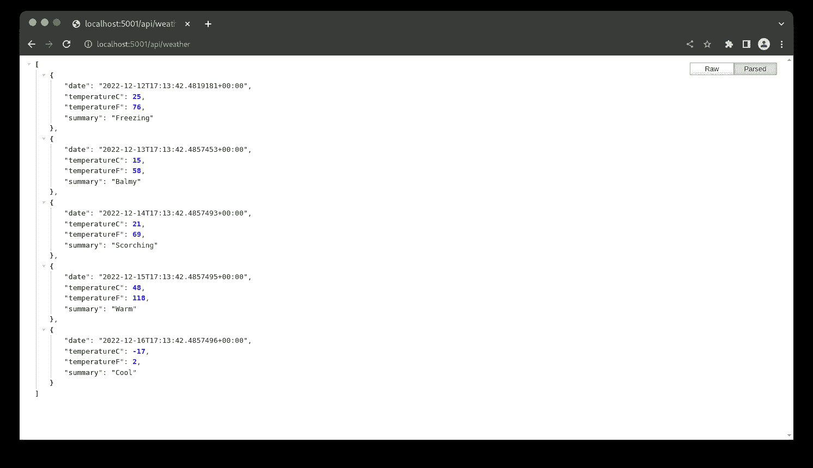
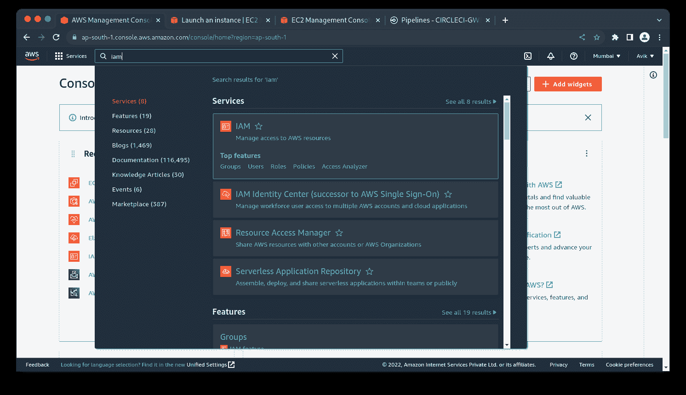
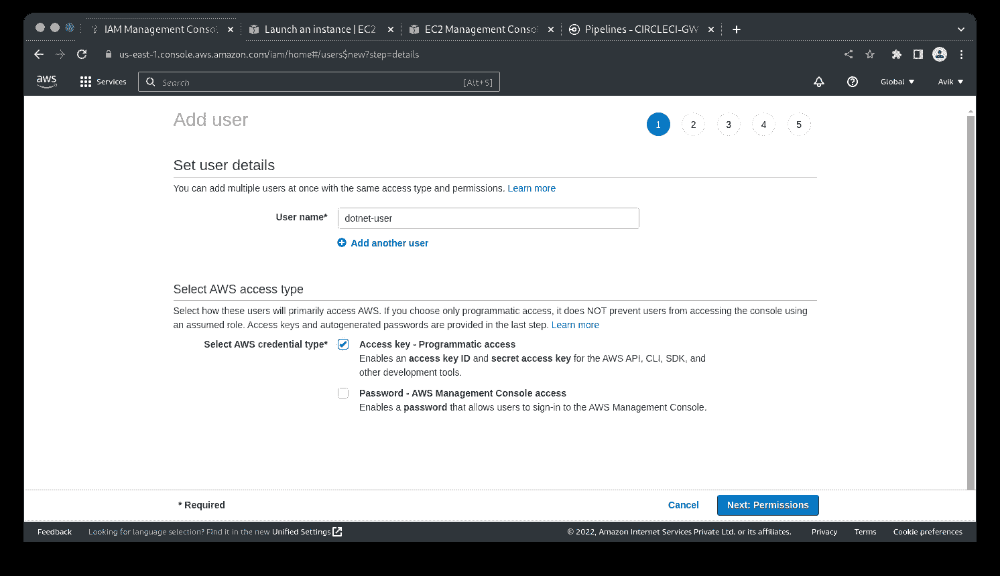
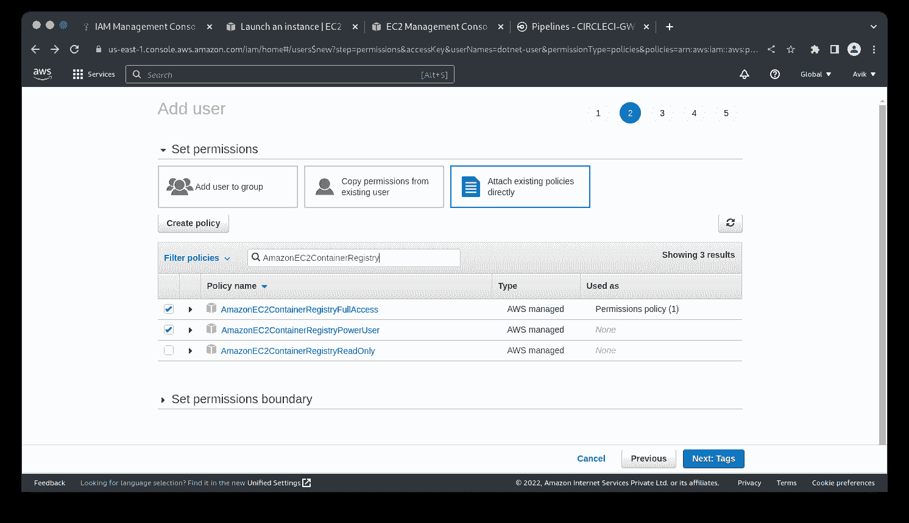
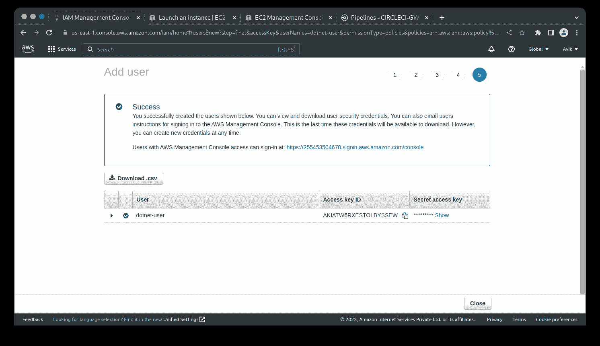
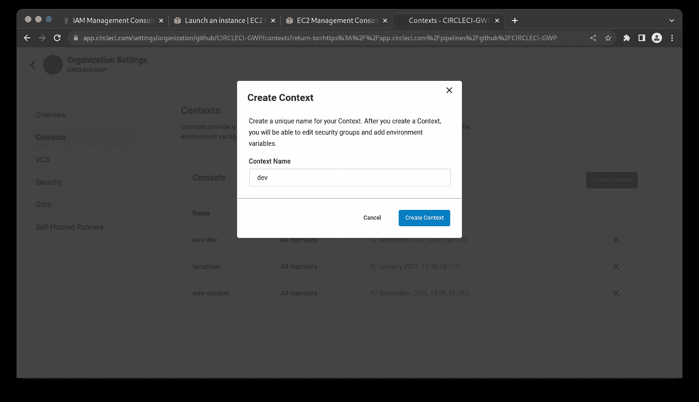
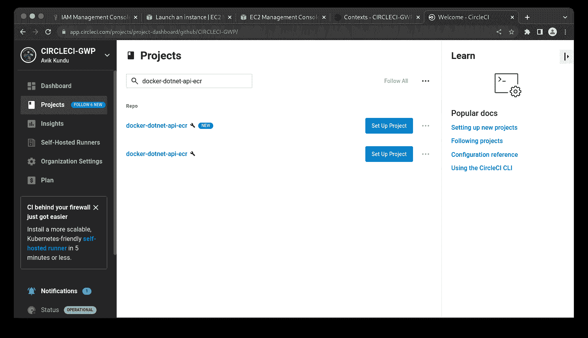
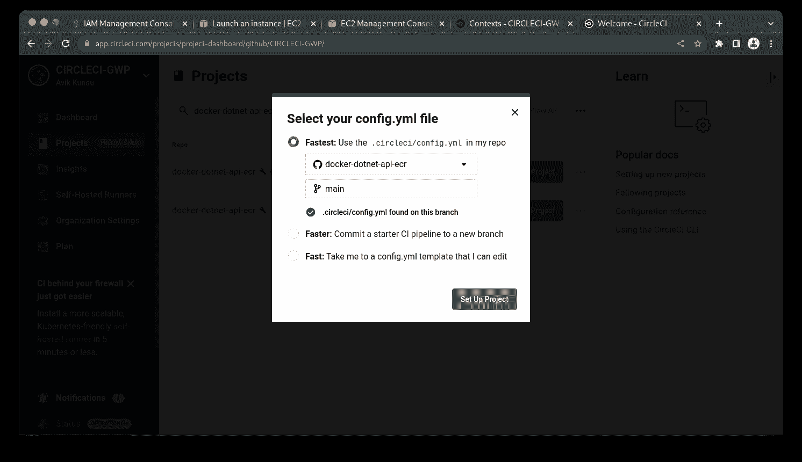
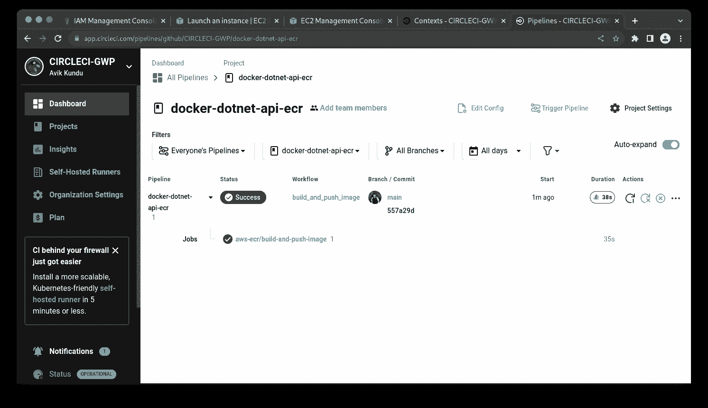
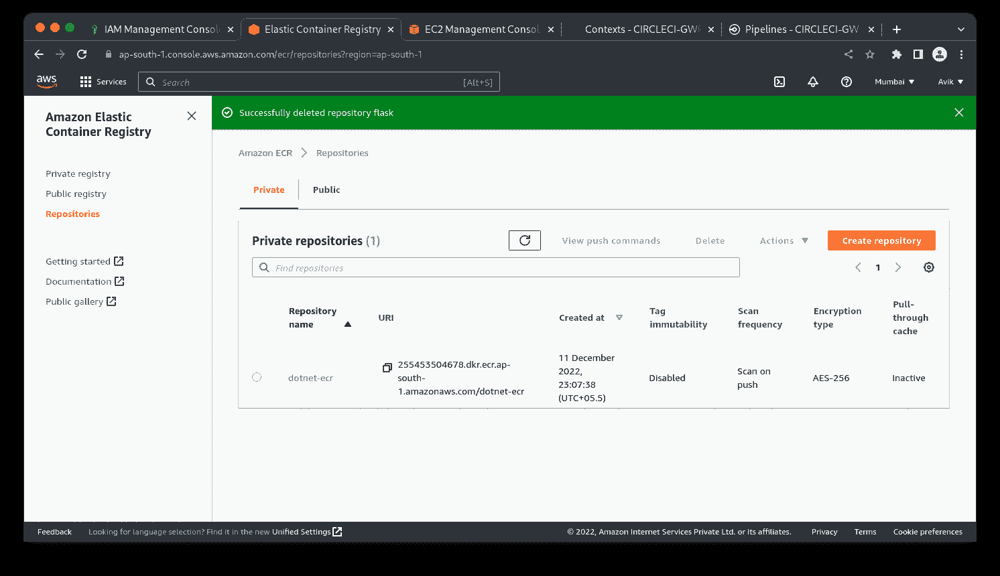

# 连续部署一个 Dockerized。AWS ECR - CircleCI 的 NET Core 应用程序

> 原文：<https://circleci.com/blog/cd-for-dockerized-dotnet-core-to-aws-ecr/>

> 本教程涵盖:
> 
> 1.  为克隆的创建容器映像。Net 核心演示应用程序，在本地构建和运行容器
> 2.  将 Docker 映像部署到 AWS ECR
> 3.  使用 CircleCI 编写一个配置文件来自动构建和部署容器映像

容器是部署应用程序的有用工具，因为它们允许将应用程序的代码、库和依赖项打包到一个独立的单元中。这使得在安装了必要的容器软件的任何计算机或服务器上部署和运行应用程序变得容易。

[AWS 弹性容器注册(ECR)](https://aws.amazon.com/ecr/) 是一个托管容器注册服务，用于存储、管理和部署容器映像。它与其他 AWS 服务完全集成，并提供了一种可伸缩且安全的方法来管理您的容器映像。ECR 允许您使用 Docker CLI 存储和检索图像，还可以与其他 Docker 工具集成，如 Docker Compose 和 Docker Swarm。使用 ECR，您可以在一个中心位置轻松存储和管理 Docker 图像，并从 AWS 帐户的任何位置访问它们。

在本教程中，您将使用 Docker 构建一个 ASP.NET 核心容器，并将容器映像推送到 Amazon Elastic Container Registry(Amazon ECR)。当您完成项目时，由于对您的代码库所做的更改而构建的每个新容器映像都将被推送并存储在 AWS 容器注册表中。

## 先决条件

本教程需要以下内容:

> 我们的教程是平台无关的，但是使用 CircleCI 作为例子。如果你没有 CircleCI 账号，请在 注册一个免费的 [**。**](https://circleci.com/signup/)

## 克隆演示项目

首先，从终端发出以下命令，使用 Git 从 GitHub 克隆演示项目:

```
git clone https://github.com/CIRCLECI-GWP/docker-dotnet-api-ecr 
```

这将把项目克隆到您的开发文件夹中的一个`docker-dotnet-api-ecr`文件夹中(或者当您从运行命令时)。

## 在本地构建 Docker 映像

为了为这个项目构建一个定制的 Docker 映像，您需要创建一个名为`Dockerfile`的特殊类型的文件。

`Dockerfile`是一个文本文件，包含一组用于构建 Docker 映像的指令。它是一个简单而强大的工具，允许开发人员定义以一致和可靠的方式运行他们的应用程序所需的环境和依赖关系。

在本教程中，您将使用下载的演示项目中包含的 Dockerfile 来构建自定义容器映像。`Dockerfile`包含安装所有项目依赖项、构建项目并运行它所需的命令。

转到应用程序的根目录，打开`Dockerfile`，确保它有以下内容:

```
# Build Stage
FROM mcr.microsoft.com/dotnet/sdk:6.0 AS build
WORKDIR /app
COPY . ./
RUN dotnet restore
RUN dotnet publish -c Release -o output

# Serve Stage
FROM mcr.microsoft.com/dotnet/aspnet:6.0 AS runtime
WORKDIR /app
COPY --from=build /app/output .
ENTRYPOINT [ "dotnet", "docker-dotnet-api.dll" ] 
```

该文件中指定了两个不同的阶段:

*   `Build`采用[。NET SDK](https://hub.docker.com/_/microsoft-dotnet-sdk) 在构建项目并将其发布到名为`out`的文件夹之前安装任何所需的依赖项。
*   `Serve`使用[ASP.NET 核心运行时映像](https://hub.docker.com/_/microsoft-dotnet-aspnet)从指定的工作目录运行应用程序，在本例中是`app`。

这有时被称为[多级 Dockerfile](https://docs.docker.com/develop/develop-images/multistage-build/) 。它将开发和生产指令合并到一个 Dockerfile 文件中，降低了流程的复杂性。

接下来，发出以下命令来构建 Docker 映像:

```
docker build -t dotnet-api:latest . 
```

基于应用程序和 Dockerfile 文件的内容，这个命令将构建容器映像。您可以使用下面的命令打印出容器图像列表，确认图像是创建的:

```
docker images 
```

您将看到一个图像列表，包括`dotnet-api`。

```
REPOSITORY          TAG       IMAGE ID       CREATED          SIZE
dotnet-api          latest    b7b390e1661b   43 seconds ago   215MB 
```

## 在本地运行 Docker 映像

成功构建本地版本的容器映像后，使用以下命令运行它:

```
docker run -dit -p 5001:80 dotnet-api:latest 
```

该命令在后台运行容器，将容器 ID 打印到终端，并在端口`5001`上运行应用程序。请访问`http://localhost:5001/api/weather`查看。



## 将 Docker 映像部署到 Amazon ECR

在本节中，您将创建一个用户，该用户可以通过编程将容器图像推送到 Amazon registry。为此，导航到 [AWS 管理控制台](https://aws.amazon.com/console)并选择 IAM。此服务允许您管理对 AWS 资源的访问。



创建具有唯一名称的用户。我把我的叫做`dotnet-user`。确保您勾选了选项**访问键-编程访问**。



接下来，为用户设置权限。点击**直接附加已有保单**。搜索并选择这些策略:

*   `AmazonEC2ContainerRegistryFullAccess`:该策略允许用户完全访问容器注册表及其 API。
*   `AmazonEC2ContainerRegistryPowerUser`:授予用户读写存储库的管理权限。



从这里，点击**下一个**两次，然后点击查看页面中的**创建用户**按钮。

您将看到一条成功消息以及您的用户凭据。该页面只显示一次，因此请记下**访问密钥 ID** 和**秘密访问密钥**。如果您愿意，可以下载包含相同凭据的. csv 文件。



## 自动化容器映像部署

接下来，您将使用 CircleCI 自动将 Docker 映像部署到 Amazon ECR。要轻松做到这一点，您将利用专门用命令创建的圆形球体名称 [**circleci/aws-ecr**](https://circleci.com/developer/orbs/orb/circleci/aws-ecr) 来自动:

1.  建立码头工人形象
2.  登录亚马逊容器注册中心
3.  创建一个 Amazon ECR repo(如果不存在)
4.  将图片推送到亚马逊 ECR

下载的项目已经包含一个带有`config.yml`文件的`.circleci`文件夹。打开`config.yml`文件，确认里面有这个内容:

```
version: 2.1
orbs:
  aws-ecr: circleci/aws-ecr@8.1.3
workflows:
  build_and_push_image:
    jobs:
      - aws-ecr/build-and-push-image:
          context: dev
          create-repo: true
          dockerfile: Dockerfile
          path: .
          repo: dotnet-ecr
          tag: "$CIRCLE_SHA1" 
```

这个配置文件使用 [Amazon 弹性容器注册中心](https://circleci.com/developer/orbs/orb/circleci/aws-ecr) orb 来构建和部署 Docker 映像。`dockerfile:`命令指定 docker 文件的路径。

`repo`命令将 ECR 储存库指定为`dotnet-ecr`。如果`create-repo`标志声明它不存在，那么它将被创建。此外，要成功地将映像部署到 Amazon ECR，您需要提供您的 Amazon 凭据。为此，你应该在 CircleCI 中使用[上下文](https://circleci.com/docs/contexts/)。

## 为 Amazon ECR 凭据添加上下文

从您的 [CircleCI 仪表板](https://app.circleci.com/)，点击侧边栏中的链接，进入**组织设置**页面。

然后，选择**上下文**，点击**创建上下文**按钮，为您的上下文添加一个唯一的名称。上下文出现在安全设置为`All members`的列表中。这意味着组织中的任何人都可以在运行时访问该上下文。正如本教程的`.circleci/config.yml`配置中所指定的，上下文名称应该是`dev`。



接下来，选择`dev`上下文，点击**添加环境变量**，输入这些变量:

*   `AWS_ACCESS_KEY_ID` -您之前创建的`dotnet-user` IAM 角色的 AWS 访问键 id。
*   `AWS_SECRET_ACCESS_KEY` -您之前创建的`dotnet-user` IAM 角色的 AWS 密钥。
*   `AWS_ECR_REGISTRY_ID` -与 ECR 账户相关的 12 位 AWS id。这也称为帐户 ID。你可以从 [AWS 支持页面](https://docs.aws.amazon.com/IAM/latest/UserGuide/console_account-alias.html#FindingYourAWSId)找到这个。
*   `AWS_REGION` -您的 ECR 资源将位于的 AWS 区域。

## 将应用程序连接到 CircleCI

现在你可以[改变你的远程存储库 URL](https://docs.github.com/en/get-started/getting-started-with-git/managing-remote-repositories#changing-a-remote-repositorys-url) ，如果你克隆了本教程的 repo 并且[将你的项目推送到 GitHub](https://circleci.com/blog/pushing-a-project-to-github/) 。

登录您的 CircleCI 帐户。如果你注册了你的 GitHub 账户，你所有的库都可以在你项目的仪表盘上看到。找到`dotnet-ecr`项目，点击**设置项目**。



在 GitHub 上输入您的代码所在的分支的名称，然后点击**设置项目**。



您的第一个工作流将开始运行并成功完成。



要查看存储库信息，请转到您的 [AWS 管理控制台](https://console.aws.amazon.com/ecr/repositories)。



## 结论

通过正确配置 CircleCI 部署，您可以轻松地对您的代码库进行更改，部署到 GitHub，并确保您在 Amazon container registry 上的 Docker 映像将始终更新为新版本，而无需您进行任何手动操作。

我希望本教程对你有所帮助。编码快乐！

* * *

Oluyemi 是一名拥有电信工程背景的技术爱好者。出于对解决用户日常遇到的问题的浓厚兴趣，他冒险进入编程领域，并从那时起将他的问题解决技能用于构建 web 和移动软件。Oluyemi 是一名热衷于分享知识的全栈软件工程师，他在世界各地的几个博客上发表了大量技术文章和博客文章。作为技术专家，他的爱好包括尝试新的编程语言和框架。

[阅读更多 Olususi Oluyemi 的帖子](/blog/author/olususi-oluyemi/)