# 离子应用的持续部署| CircleCI

> 原文：<https://circleci.com/blog/cd-for-ionic-apps/>

当谈到移动应用程序开发时， [Ionic 框架](https://ionicframework.com/)仍然是首选，多年来，它已经发展成为一个用于开发移动、桌面和[渐进式 web 应用程序的全功能应用程序框架](https://web.dev/progressive-web-apps/)。它受欢迎的部分原因是它是框架不可知的。它允许开发者使用 [Angular](https://angular.io/) 、 [React](https://reactjs.org/) 或 [Vue](https://vuejs.org/) 进行开发。在本教程中，我们将演示如何将 Ionic 移动应用程序部署到 [Firebase](https://firebase.google.com/) 托管平台。

## 先决条件

要跟进这篇文章，需要做一些事情:

1.  [React.js](https://reactjs.org/) 的基础知识
2.  系统上安装的 [Node.js](https://nodejs.org)
3.  安装在系统上的 Ionic CLI
4.  一个[圆](https://circleci.com/signup/)的账户
5.  一个 [Firebase](https://firebase.google.com/) 账户(带有一个 [Gmail](https://mail.google.com) 账户)

## 构建一个简单的离子应用程序

首先，让我们通过运行以下命令来构建一个新的 Ionic 应用程序:

```
ionic start ionic-cd tabs --type=react 
```

这将立即触发 Ionic CLI 使用名为`ionic-cd`的文件夹中的`tabs`模板为我们搭建一个新项目。

**注意**:如果提示`Create a free Ionic account?`则提示*。点击`n`拒绝。欲了解更多关于创建 Ionic 账户的信息，请点击[本页](https://ionicframework.com/appflow)。*

完成后，进入应用程序的根目录(`cd ionic-cd`)，运行以下命令在您的 web 浏览器中为应用程序提供服务:

```
ionic serve 
```

一旦该命令完成初始化，您将看到一个类似于下图的应用程序视图。CLI 会自动在默认浏览器中打开一个选项卡。

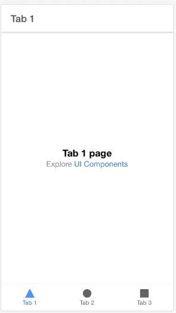

**注意** : *我使用的是 Chrome 开发工具中激活的移动预览。*

接下来，让我们开始构建主应用程序。进入应用程序的`src/pages`文件夹，打开文件`Tab1.tsx`，这是新搭建的应用程序的默认主页。删除该文件中的所有内容，并替换为以下代码:

```
import React, { useState } from "react";
import {
  IonContent,
  IonHeader,
  IonPage,
  IonTitle,
  IonToolbar,
  IonList,
  IonItemSliding,
  IonItem,
  IonLabel,
  IonItemOptions,
  IonItemOption,
  IonFab,
  IonFabButton,
  IonIcon,
  IonModal,
  IonButton,
  IonCard,
  IonCardContent,
  IonInput
} from "@ionic/react";

import { add } from "ionicons/icons";

import "./Tab1.css";

interface Task {
  id: number;
  name: string;
}

const Tab1: React.FC = () => {
  const [tasks, setTasks] = useState<Task[]>([]);
  const [showModal, setShowModal] = useState(false);
  const [taskName = "", setTaskName] = useState<string>();

  function addNewTask() {
    const new_id = tasks.length + 1;

    const newTask = {
      id: new_id,
      name: taskName
    };

    tasks.push(newTask);

    setTasks(tasks);

    setTaskName("");

    setShowModal(false);
  }

  return (
    <IonPage>
      <IonHeader>
        <IonToolbar>
          <IonTitle color="primary">Task Manager</IonTitle>
        </IonToolbar>
      </IonHeader>
      <IonContent>
        <IonList>
          {tasks.length > 0 ? (
            tasks.map((item: Task) => {
              return (
                <IonItemSliding key={item.id}>
                  <IonItem className="todo-item">
                    <IonLabel>{item.name}</IonLabel>
                  </IonItem>
                  <IonItemOptions side="end">
                    <IonItemOption onClick={() => {}}>Done</IonItemOption>
                  </IonItemOptions>
                </IonItemSliding>
              );
            })
          ) : (
            <IonItem>
              <IonLabel color="danger">
                You have not yet added tasks for today
              </IonLabel>
            </IonItem>
          )}
        </IonList>

        {/* Modal*/}
        <IonModal isOpen={showModal}>
          <IonCard>
            <IonItem>
              <IonLabel color="primary">Add New Task</IonLabel>
            </IonItem>

            <IonCardContent>
              <IonItem>
                <IonInput
                  value={taskName}
                  placeholder="Enter Task Name..."
                  onIonChange={(e) => setTaskName(e.detail.value!)}
                ></IonInput>
              </IonItem>

              <IonButton
                expand="full"
                color="success"
                onClick={() => addNewTask()}
              >
                Add Task
              </IonButton>
            </IonCardContent>
          </IonCard>
          <IonButton color="success" onClick={() => setShowModal(false)}>
            Close Modal
          </IonButton>
        </IonModal>

        {/* FAB */}
        <IonFab vertical="bottom" horizontal="end" slot="fixed">
          <IonFabButton color="success" onClick={() => setShowModal(true)}>
            <IonIcon icon={add} />
          </IonFabButton>
        </IonFab>
      </IonContent>
    </IonPage>
  );
};

export default Tab1; 
```

我们在这里构建的是一个简单的任务列表应用程序，我们可以在其中添加当天的任务。让我们看一下上面的代码片段。

我们首先导入必要的依赖项，包括页面的 CSS 文件。然后我们定义一个接口来定义我们的任务对象。

```
...
interface Task {
  id: number;
  name: string;
}
... 
```

接下来，我们将组件创建为类型为`React.FC`的 React.js 函数，并通过使用钩子定义我们想要保存在状态中的数据来开始该函数:

*   一组`Task`的`tasks`
*   一个`showModal`布尔值来控制我们的任务创建表单的打开和关闭
*   一个保存新任务值的`taskName`

```
...
const [tasks, setTasks] = useState<Task[]>([]);
const [showModal, setShowModal] = useState(false);
const [taskName = "", setTaskName] = useState<string>();
... 
```

接下来是我们调用的添加新任务的函数。该函数通过根据数组的长度设置其`id`来创建一个新任务，并在将新任务添加到我们现有的任务列表后清除表单。

```
...
function addNewTask() {
  const new_id = tasks.length + 1;

  const newTask = {
    id: new_id,
    name: taskName
  };

  tasks.push(newTask);

  setTasks(tasks);

  setTaskName("");

  setShowModal(false);
}
... 
```

接下来，我们呈现我们的模板以显示我们的任务列表和一条有用的消息，当任务列表为空时显示为`You have not yet added tasks for today`。列表后面是一个模态组件，它包含用于添加新任务的任务表单。组件下面是一个浮动的操作按钮，用户单击它可以打开模式。

在我们预览之前，打开与`Tab1.tsx`位于同一文件夹的`Tab1.css`，并用以下代码替换其内容:

```
.todo-item {
  --min-height: 70px;
  font-size: 1.2em;
} 
```

这增加了列表项的高度和字体大小。

现在进入你的浏览器，加载你的应用程序的主页(Tab1)。

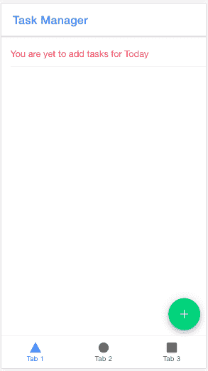

如页面所示，因为我们还没有添加任何任务，所以我们会显示消息**您还没有添加今天**的任务。右下角还有我们的**添加任务**按钮，带有`plus`符号。

要添加新任务，请单击右下角的绿色按钮(带加号)并键入任务。

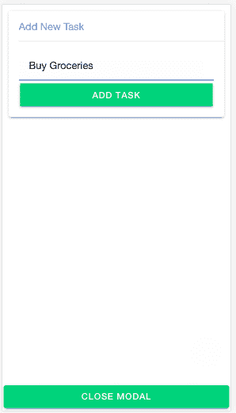

点击**添加任务**，然后再添加两三个。现在，我们在页面上有足够的任务让我们的应用程序看起来正常。

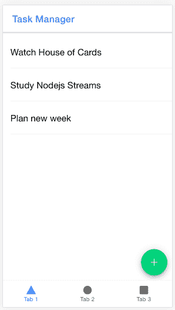

## 为部署到 Firebase 进行设置

现在我们已经有了一个工作的 Ionic 应用程序，让我们为部署到 Firebase 做准备。

首先，您需要安装 Firebase 工具。要检查是否已安装，请运行以下命令:

```
firebase 
```

这将在您的终端中输出 Firebase CLI 命令/选项列表。如果没有，您需要运行以下命令来安装 CLI:

```
npm install -g firebase-tools 
```

如果您的 Firebase CLI 版本低于`8`，您也需要运行这个命令。要检查您的版本，请运行以下命令:

```
firebase --version 
```

要为我们的项目设置 Firebase 托管，我们需要创建一个 Firebase 项目。去你的 [Firebase 控制台](https://console.firebase.google.com/)创建一个新项目。

点击**添加项目**，在弹出的第一页输入你的项目名称。

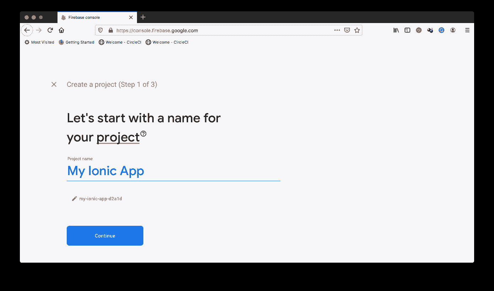

点击**继续**。在下一页(关于添加*谷歌分析*，关闭`Enable Google Analytics for this project`切换按钮。这是一个演示项目，我们不需要分析。

现在点击**创建项目**。等待 Firebase 完成项目设置，然后单击**继续**导航到您的项目仪表板。

下一步是使用我们刚刚创建的项目在 Firebase 上设置我们的 Ionic 应用程序。在默认浏览器上保持登录 Firebase。然后转到您的 CLI 运行以下命令:

```
firebase login:ci 
```

该命令将通过重定向到您当前登录的浏览器，让您登录 Firebase。身份验证过程完成后，您将在 CLI 上登录 Firebase，并且您的 Firebase 令牌将打印在屏幕上的`✔ Success! Use this token to login on a CI server`行下方。请保管好这个令牌，因为您将在本教程的后面需要它。

接下来，在项目的根目录下运行以下命令来初始化 Firebase 设置:

```
firebase init 
```

您将从该命令得到的第一个提示是`? Which Firebase CLI features do you want to set up for this folder? Press Space to select features, then Enter to confirm your choices.`。选择`Hosting`并点击`Enter`进入下一个提示。

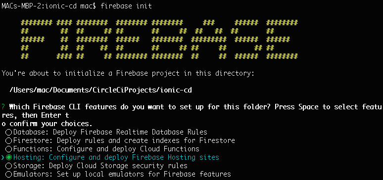。

下一个提示是关于将您的本地项目与您的 Firebase 帐户上的 Firebase 项目相关联。在这里，您可以选择使用现有项目或创建一个新项目。选择`Use an existing project`并点击`Enter`进入下一个提示。

这一选择将导致 CLI 加载 Firebase 项目，供您在下一个提示中选择。在 Firebase 控制台上选择我们刚刚创建的项目，然后点击`Enter`确认您的选择。

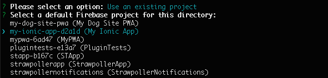。

**注意** : *如果您的项目在列表中不可见，停止这个过程(`Ctrl + C`)，然后重新运行带有`--project`选项的命令:`firebase init --project <projectId>`用您新创建的 Firebase 项目 ID 替换`projectId`。像以前一样选择**托管**。*

下一个提示询问项目文件夹，并建议使用`public`文件夹。Ionic 将它的生产版本保存在一个名为`build`的文件夹中，因此在这个提示符下输入`build`并点击`Enter`。

以下提示显示`? Configure as a single-page app (rewrite all urls to /index.html)?`。键入`y`，然后点击`Enter`。

这将完成设置，您将拥有两个新文件:`.firebaserc`，它为该应用程序设置项目 id，以及`firebase.json`，它包含关于我们在设置过程中选择的选项和一些其他默认设置的详细信息。我们现在可以着手构建我们的部署管道了。

## 构建 CD 管道

要设置我们的持续部署管道，我们需要采取以下步骤:

1.  将我们的项目推到一个连接到 CircleCI 帐户的远程存储库(本例中是 GitHub)
2.  将我们的应用程序作为新项目添加到 CircleCI 上
3.  将 Firebase 令牌作为环境变量添加到 CircleCI 项目中
4.  在项目中本地安装`firebase-tools`
5.  创建我们的管道配置文件
6.  将项目变更推送到我们的存储库以启动部署

我们开始吧。

首先，通过运行以下命令来搭建一个快速的`package.json`文件:

```
npm init -y 
```

然后，[将你的项目推送到 GitHub](https://circleci.com/blog/pushing-a-project-to-github/) 。

下一步是将我们的项目的存储库设置为 CircleCI 项目。

在 [CircleCI 控制台](https://app.circleci.com/projects)上，选择账户查看您的`Projects`页面。如果 GitHub repo 在这里不可见，那么点击侧菜单上的**添加项目**。

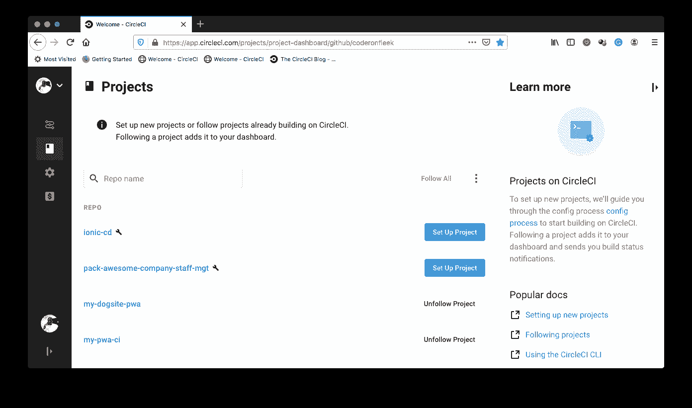

点击**设置项目**。

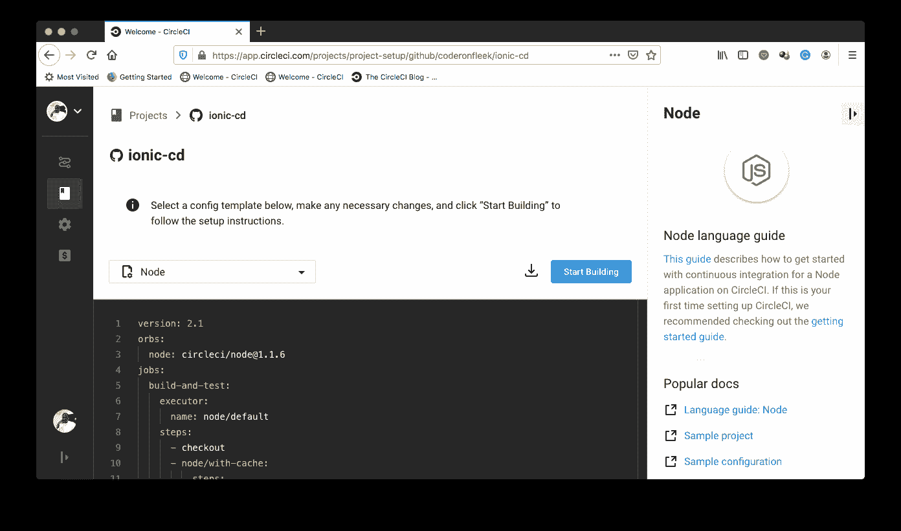

在设置页面上，点击**开始构建**。在构建开始之前，您会得到一个提示，要么下载并使用所提供的 CircleCI 配置文件，并将它放在一个单独的分支上，要么手动设置一个。

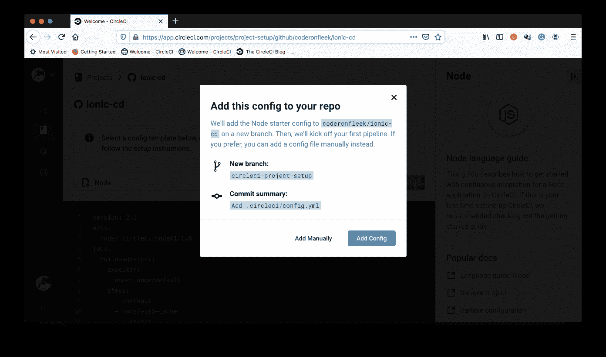

选择**手动添加**继续。这将提示另一个对话框，检查确认您已经设置了配置文件，可以开始构建了。

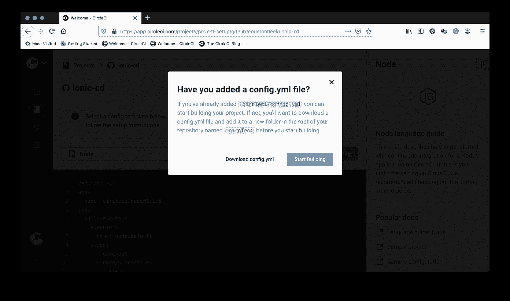

点击**开始构建**完成设置。这将立即触发管道。构建将失败，因为我们还没有添加管道配置文件。

我们的下一步是将 Firebase 令牌作为环境变量添加到我们刚刚创建的 CircleCI 项目中。在**管道**页面，选中我们的项目，点击**项目设置**(在网页右上角)。

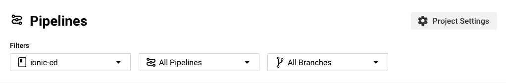

在设置页面侧菜单上，点击`Environment Variables`。在变量设置页面，点击**添加环境变量**。将出现一个对话框。在`Name`字段中，输入`FIREBASE_TOKEN`，并在`Value`字段中，粘贴您之前从 CLI 获得的 Firebase 令牌。点击`Submit`完成该过程。现在，您已经注册了令牌变量。

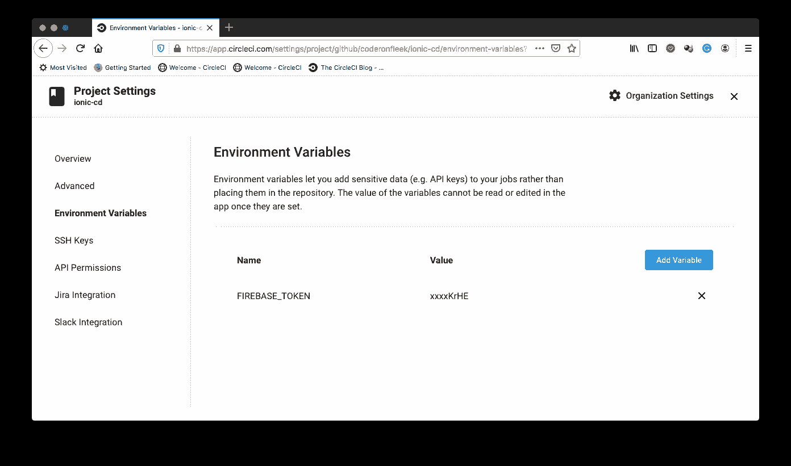

返回到系统上的项目。运行以下命令，在应用程序的根目录下安装`firebase-tools`,这样您就可以在`package.json`中将它注册为开发依赖项:

```
npm install -D firebase-tools 
```

一旦该过程完成，就该创建我们的部署配置文件了。在项目的根目录下，创建一个名为`.circleci`的文件夹和一个名为`config.yml`的文件。在`config.yml`文件中，输入以下代码:

```
version: 2
jobs:
  build:
    docker:
      - image: cimg/node:12.16
    working_directory: ~/repo
    steps:
      - checkout
      # Download and cache dependencies
      - restore_cache:
          keys:
            - v1-dependencies-{{ checksum "package.json" }}
            - v1-dependencies-
      - run:
          name: Install Dependencies
          command: npm install
      - run:
          name: Build Application
          command: npm run build
      - save_cache:
          key: v1-npm-deps-{{ checksum "package-lock.json" }}
          paths:
            - ./node_modules
      - run:
          name: Deploy to Firebase
          command: ./node_modules/.bin/firebase deploy --token "$FIREBASE_TOKEN" --only hosting 
```

在上面的部署文件中，我们从从我们的远程存储库中检出项目开始。然后我们安装我们的依赖项。接下来，我们运行`package.json`中的`build`脚本，在`build`文件夹中创建 Ionic 应用的生产版本，然后缓存我们的依赖关系。最后，我们从本地安装运行我们的`firebase-tools`,使用我们的 Firebase 令牌来部署我们的应用程序。

是时候把钱花在我们该花的地方了。让我们提交我们的更改，并将它们推送到我们的存储库，以触发我们的部署脚本，并将我们的应用程序部署到 Firebase 主机。

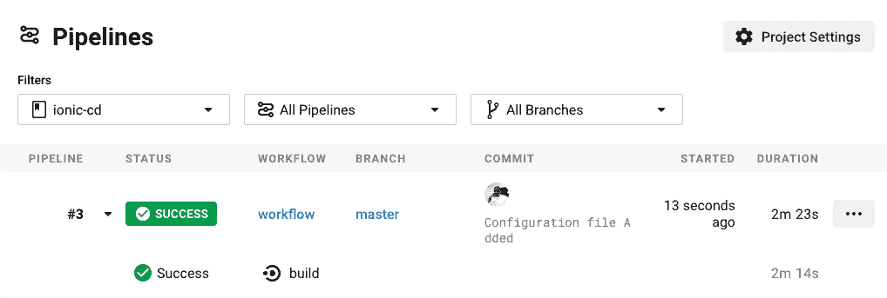

单击构建查看部署的幕后情况，如下所示。

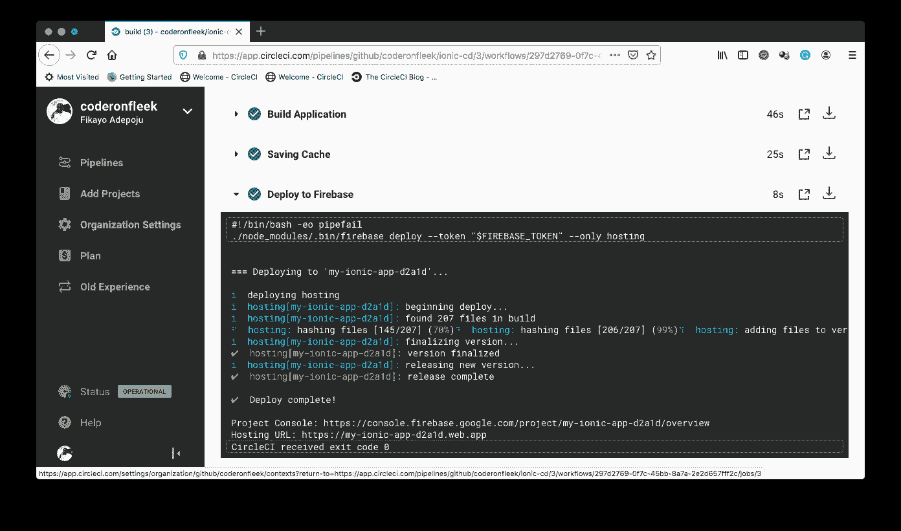

从`Deploy to Firebase`部分。您可以看到部署的应用程序的 URL。对于本教程，它是`https://my-ionic-app-d2a1d.web.app/`。将您的应用程序加载到浏览器中以测试您的应用程序。

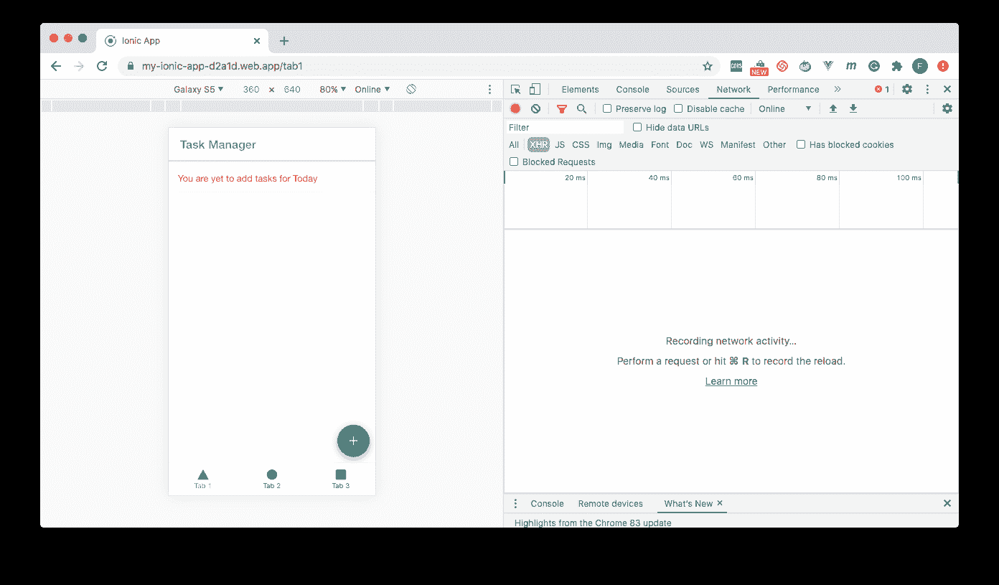

## 结论

如果您仍然在每次更新应用程序时手动将文件复制到您的服务器，那么您需要设置一个自动化部署管道，以便在您推送更新时完成部署，从而减轻您的压力。有了它，您只需要担心构建您的应用程序， [CircleCI](https://circleci.com/) 会为您完成部署。

编码快乐！

* * *

Fikayo Adepoju 是 LinkedIn Learning(Lynda.com)的作者、全栈开发人员、技术作者和技术内容创建者，精通 Web 和移动技术以及 DevOps，拥有 10 多年开发可扩展分布式应用程序的经验。他为 CircleCI、Twilio、Auth0 和 New Stack 博客撰写了 40 多篇文章，并且在他的个人媒体页面上，他喜欢与尽可能多的从中受益的开发人员分享他的知识。你也可以在 Udemy 上查看他的视频课程。

[阅读 Fikayo Adepoju 的更多帖子](/blog/author/fikayo-adepoju/)