# 渐进式 web 应用的持续部署| CircleCI

> 原文：<https://circleci.com/blog/cd-for-pwa/>

[渐进式网络应用(PWAs)](https://web.dev/progressive-web-apps/) 由于其类似本地的属性，继续获得广泛的关注、接受和与网络浏览器的兼容性。部署这些应用程序的强制性安全考虑之一是它们必须安全托管。因此，PWA 功能将无法在不安全的 URL 上工作，即不使用安全`https://`协议的 URL。在本帖中，我们将创建一个自动部署管道，将我们的 PWA 部署到 [Firebase](https://firebase.google.com/) 上的一个安全 URL。

## 先决条件

要跟进这篇文章，需要做一些事情:

1.  Javascript 的基础知识
2.  系统上安装的 [Node.js](https://nodejs.org)
3.  一个 [HTTP 服务器模块](https://www.npmjs.com/package/http-server)全局安装在您的系统上(`npm install -g http-server`)
4.  一个[火基](https://firebase.google.com/)账户
5.  一个[圆](https://circleci.com/)的账户
6.  GitHub 的一个账户

所有这些安装和设置，让我们开始教程。

## 设置演示应用程序

第一项任务是创建我们将部署到 Firebase 的演示应用程序。运行以下命令为项目创建一个目录，并进入该目录的根目录:

```
mkdir my-pwa-firebase
cd my-pwa-firebase 
```

接下来，让我们创建我们的应用程序主页。在项目的根目录下创建一个名为`index.html`的文件，并将以下代码粘贴到其中:

```
 <!DOCTYPE html>
<html lang="en">
  <head>
    <meta charset="UTF-8" />
    <meta name="viewport" content="width=device-width, initial-scale=1.0" />
    <link rel="manifest" href="manifest.json" />
    <meta name="theme-color" content="#db4938" />
    <link rel="stylesheet" type="text/css" href="styles.css" media="all" />

    <title>DogVille</title>
  </head>
  <body>
    <h2>
      Welcome to the home of Dogs
    </h2>

    <div class="dog-list">
      <div class="dog-pic"></div>
      <div class="dog-pic"></div>
      <div class="dog-pic"></div>
      <div class="dog-pic"></div>
    </div>

    <script src="app.js"></script>
  </body>
</html> 
```

在上面的主页文件中，我们链接到三个文件:`manifest.json`，我们将使用它们来设置**添加到主屏幕** PWA 特性，`styles.css`将一些基本样式应用到我们的页面，以及`app.js`，它们将加载我们还没有创建但很快就会创建的服务工作者。在我们页面的主体，我们有一个标题，写着**欢迎来到狗狗之家**，在它下面，我们显示了一个狗狗图片列表。如你所见，这是一个狗的网站(向爱猫人士道歉)。

狗的图像包含在项目根目录下的一个`images`文件夹中。我已经根据`images`中使用的文件名引用了`index.html`中的狗图片。继续创建这个文件夹，你可以在这里免费下载[狗狗图片，并给它们重新命名。](https://pixabay.com/images/search/dog/)

让我们通过在项目的根目录下创建文件`styles.css`并在其中粘贴以下代码来添加样式:

```
body {
  background-color: orange;
}

h2 {
  color: white;
} 
```

这个文件给了我们的页面背景颜色，并使标题文本为白色。让我们在项目的根目录下运行以下命令，调用全局`http-server`模块来启动本地服务器为我们的应用程序提供服务，以此来测试我们的应用程序:

```
http-server 
```

当你在浏览器中加载网址时，你会看到一个类似下面的屏幕(你的狗可能与我的不同):

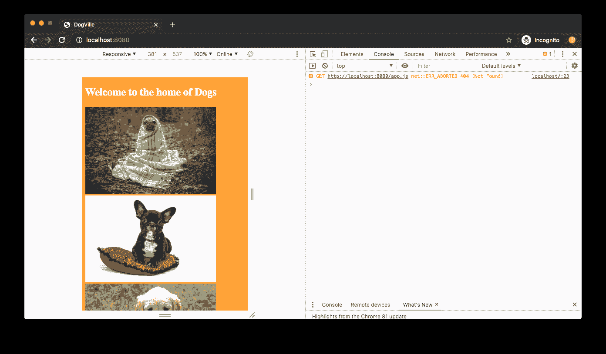

## 添加服务人员

现在，让我们加入 PWAs 的果汁，这位[服务人员](https://developers.google.com/web/fundamentals/primers/service-workers)。在项目的根目录下创建一个`serviceworker.js`文件，并将以下代码粘贴到其中:

```
var cacheName = "sw-v1";
var filesToCache = [
  "./",
  "./index.html",
  "./styles.css",
  "./app.js",
  "./images/dog1.jpg",
  "./images/dog2.jpg",
  "./images/dog3.jpg",
  "./images/dog4.jpg"
];

self.addEventListener("install", function (e) {
  console.log("<ServiceWorker> ---- Install v1");
  e.waitUntil(
    caches.open(cacheName).then(function (cache) {
      console.log("<ServiceWorker> --- Caching app shell");
      return cache.addAll(filesToCache);
    })
  );
});

self.addEventListener("activate", (event) => {
  event.waitUntil(self.clients.claim());
});

self.addEventListener("fetch", function (event) {
  event.respondWith(
    caches.match(event.request).then(function (response) {
      if (response) {
        return response;
      }
      return fetch(event.request);
    })
  );
}); 
```

在上面的服务工作者文件中，我们缓存了所有的静态文件，包括我们的项目根和图像。然后我们监听`install`事件来安装我们的服务工作者，并使用指定的`cacheName`作为标识符为这些文件创建一个缓存。

接下来，我们监听`activate`事件，以确保已经安装的任何新服务工作器都是为我们的缓存服务的，而不是旧版本。

最后，我们监听`fetch`事件来拦截任何请求，并检查我们的缓存中是否已经有了所请求的资源。如果是，我们提供缓存版本，如果不是，我们发出新的请求来获取资源。

现在，让我们将服务人员文件加载到应用程序中。在项目的根目录下创建一个`app.js`文件，并将以下代码粘贴到其中:

```
 if ("serviceWorker" in navigator) {
  window.addEventListener("load", function () {
    navigator.serviceWorker.register("./serviceworker.js").then(
      function (registration) {
        console.log("Hurray! Service workers with scope: ", registration.scope);
      },
      function (err) {
        console.log("Oops! ServiceWorker registration failed: ", err);
      }
    );
  });
} 
```

让我们带我们的服务人员去兜兜风。确保您的应用程序仍在运行，然后在当前加载应用程序的浏览器选项卡上进行硬重新加载(`Ctrl + Shift + R`)。现在检查浏览器控制台，查看我们为确认服务人员的安装而编写的控制台日志消息。您将在控制台中看到以下消息。

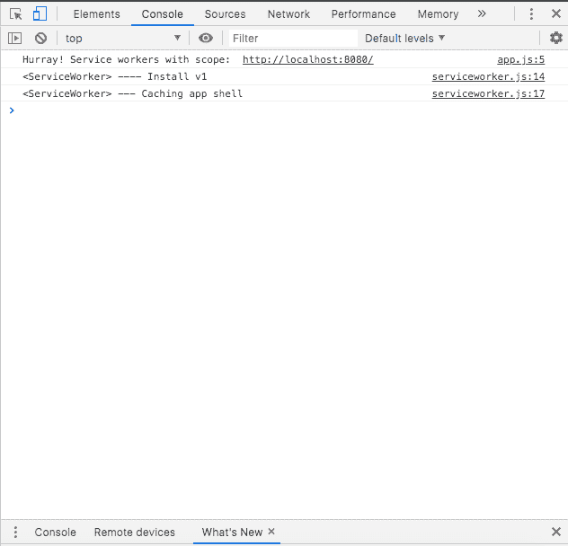

为了确认我们现在已经安装了服务人员的离线功能，使用`Ctrl + C`关闭`http-server`服务，然后在浏览器上刷新应用程序。此时，您通常会看到脱机页面，因为应用程序不再运行，但是借助服务人员的魔力，您仍然可以看到您的应用程序主页。还要注意，所有的狗图片都是离线加载的。

太好了！

## 添加清单文件

让我们通过在项目的根目录下创建我们的`manifest.json`文件来结束我们的演示应用程序。你可以生成一个简单的带有图标[的`manifest.json`文件。](https://app-manifest.firebaseapp.com/)

下面是我的`manifest.json`文件中的代码。**注意** : *我已经在我的例子中移除了一些图标。*

```
{
  "name": "my-dogsite-pwa",
  "short_name": "my-dogsite-pwa",
  "theme_color": "#000000",
  "background_color": "#ffffff",
  "display": "standalone",
  "orientation": "portrait",
  "scope": "/index.html",
  "start_url": "/index.html",
  "icons": [
    {
      "src": "icons/icon-128x128.png",
      "sizes": "128x128",
      "type": "image/png"
    },
    {
      "src": "icons/icon-144x144.png",
      "sizes": "144x144",
      "type": "image/png"
    },
    {
      "src": "icons/icon-152x152.png",
      "sizes": "152x152",
      "type": "image/png"
    },
    {
      "src": "icons/icon-192x192.png",
      "sizes": "192x192",
      "type": "image/png"
    },
    {
      "src": "icons/icon-512x512.png",
      "sizes": "512x512",
      "type": "image/png"
    }
  ]
} 
```

在上面的文件中，定义了应用的`name`、首选的`short name`、应用栏的`theme_color`和闪屏的`background_color`。

**注意:** *添加`short_name`是一个最佳实践，这是一个可选字段，指定将在应用程序启动器或新标签页中显示的名称。否则会使用`name`，超过 12 个字符就会被截断。*

`icons`数组还添加了一组图标对象定义，指向我们将用于 PWA 的图标。记得创建`icons`文件夹，并用清单文件中命名的图标填充它。

## 设置 Firebase 的部署

现在我们的 PWA 已经完成，让我们开始为部署到 Firebase 做准备。您需要安装 Firebase 工具。要检查是否已安装，请运行以下命令:

```
firebase 
```

这将向您的 CLI 返回 Firebase 命令列表。如果没有，您需要运行以下命令来安装它:

```
npm install -g firebase-tools 
```

如果您的`firebase-tools`版本低于 8，您也需要运行上面的命令。要检查您的`firebase-tools`版本，运行以下命令:

```
firebase --version 
```

要为我们的项目设置 Firebase 托管，我们需要创建一个 Firebase 项目。去你的 [Firebase 控制台](https://console.firebase.google.com/)创建一个新的 Firebase 项目。

点击`Add Project`，在弹出的第一页输入你的项目名称。

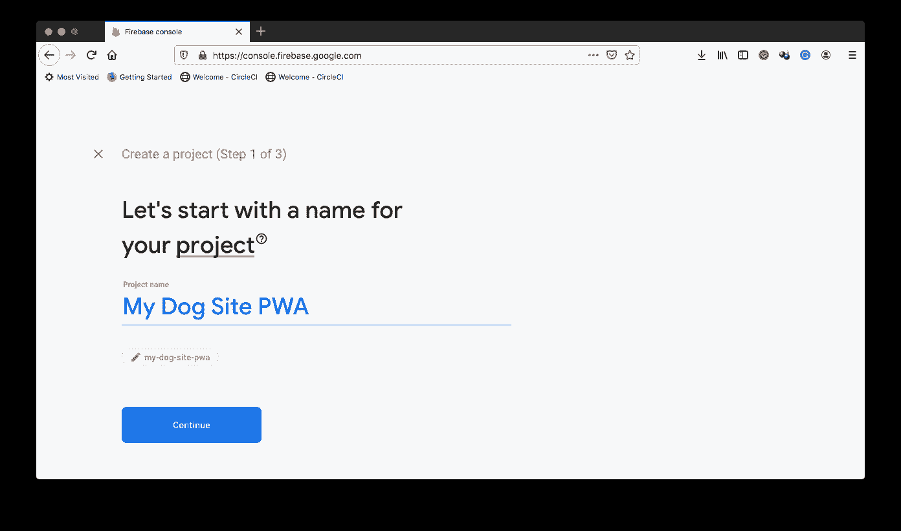

点击`Continue`，在下一页关于添加**谷歌分析**的页面，关闭`Enable Google Analytics for this project`切换按钮。由于这是一个演示项目，我们将不需要分析。

现在点击`Create Project`。等待 Firebase 完成项目设置，然后单击`Continue`导航到您的项目仪表板。

现在我们已经设置好了项目，下一步是使用我们刚刚创建的项目来设置 PWA 以托管在 Firebase 上。在默认浏览器上保持登录 Firebase，然后转到 CLI 运行以下命令:

```
firebase login:ci 
```

该命令将通过重定向到您当前登录的浏览器，让您登录 Firebase。一旦认证过程完成，你的 Firebase 令牌将被打印在屏幕上的`✔ Success! Use this token to login on a CI server`行下面。请安全地保存这个令牌，因为在本教程的后面会用到它。

接下来，在 PWA 项目的根目录下运行以下命令来初始化 Firebase 设置:

```
firebase init 
```

该命令的第一个提示是

```
? Which Firebase CLI features do you want to set up for this folder? Press Space to select features, then Enter to confirm your choices. 
```

。使用箭头键导航到`Hosting`选项，点击`Spacebar`进行选择，点击`Enter`进入下一个提示。

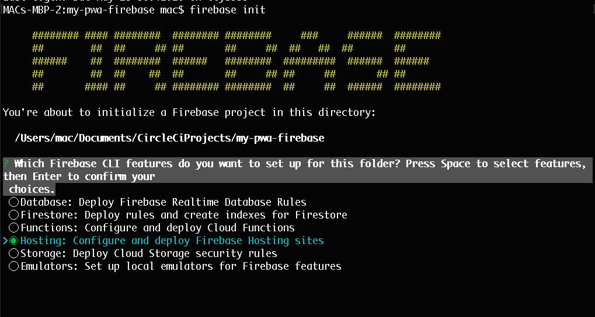

接下来的提示是将您的本地项目与您的 Firebase 帐户上的 Firebase 项目相关联。在这里，您可以选择使用现有项目或创建一个新项目。选择`Use an existing project`并点击`Enter`进入下一个提示。这个选项将提示 CLI 工具加载 Firebase 项目，供您在下一个提示中进行选择。我正在选择我们刚刚在 Firebase 控制台上创建的项目。

点击`Enter`确认您的选择。

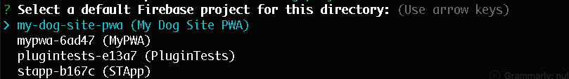

下一个提示询问项目文件夹并建议文件夹`public`。对于我们的项目，一切都发生在根上，所以只需输入`/`并点击`Enter`继续。

下一个提示是`? Configure as a single-page app (rewrite all urls to /index.html)?`。因为我们的整个应用程序驻留在`index.html`中，所以键入`y`并点击`Enter`。这个提示对于区分单页应用程序和传统的多页应用程序非常重要，这样 Firebase 主机就知道如何处理它们。

下一个提示检测到我们已经有了一个`index.html`文件，并询问是否应该覆盖它。为此键入`N`并点击`Enter`。这就完成了设置，现在您将拥有一个为该应用程序设置项目 id 的`.firebaserc`文件，一个包含我们在设置过程中选择的选项和一些其他默认设置的详细信息的`firebase.json`文件，以及一个用于 Firebase 的标准`.gitignore`文件。

这样，我们现在可以继续创建我们的部署管道。

## 构建 CD 管道

要设置我们的自动化部署管道，我们需要采取以下步骤:

1.  将我们的项目推到一个连接到 CircleCI 帐户的远程存储库(本例中为 GitHub)
2.  将我们的应用程序作为新项目添加到 CircleCI 上
3.  将 Firebase 令牌作为环境变量添加到 CircleCI 项目中
4.  在项目中本地安装`firebase-tools`
5.  创建我们的管道配置文件
6.  将项目变更推送到我们的存储库以启动部署

我们开始吧。通过运行以下命令搭建一个快速的`package.json`文件:

```
npm init -y 
```

然后，[将项目推送到 GitHub](https://circleci.com/blog/pushing-a-project-to-github/) 。

下一步是将我们的项目的存储库设置为 CircleCI 项目。

在 CircleCI 控制台上，转到**添加项目**页面。

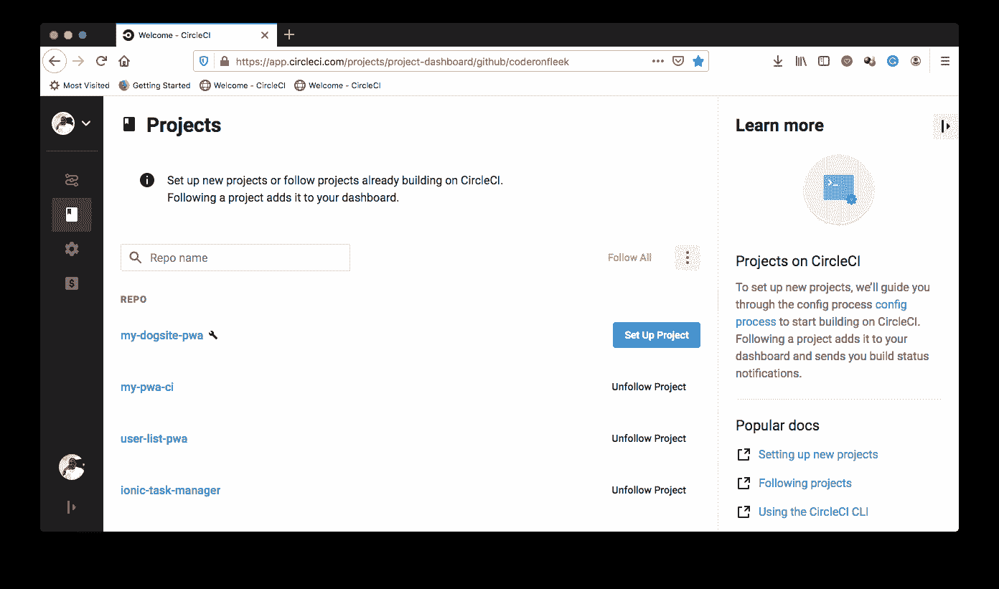

点击**设置项目**。这将加载下一个屏幕。

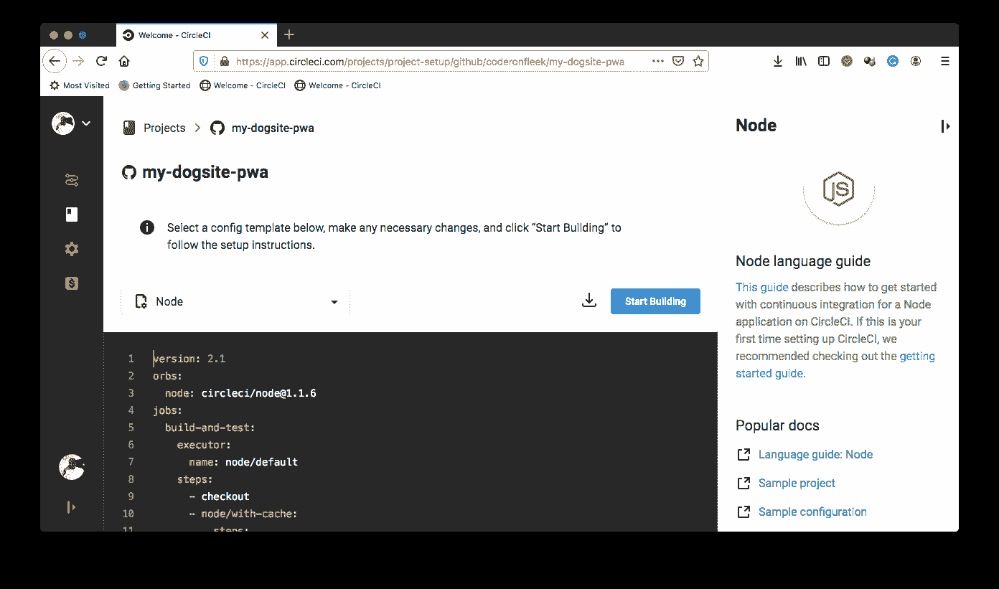

在设置页面上，点击**开始构建**。在构建开始之前，您会得到一个提示，要么下载并使用所提供的 CircleCI 配置文件并将它放在一个单独的分支上，要么手动设置一个。

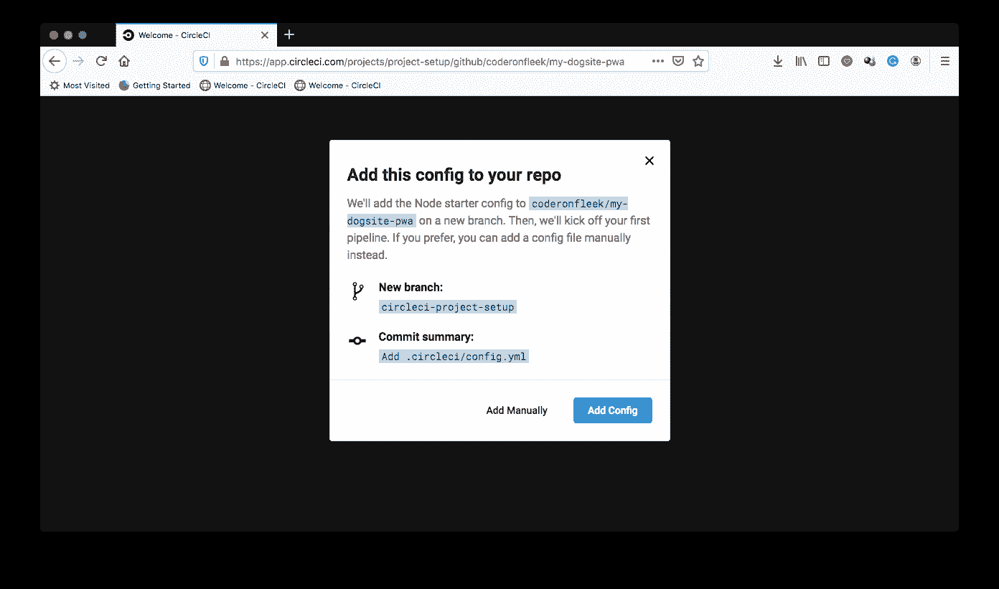

选择**手动添加**继续。这将提示另一个对话框，检查确认您已经设置了配置文件，可以开始构建了。

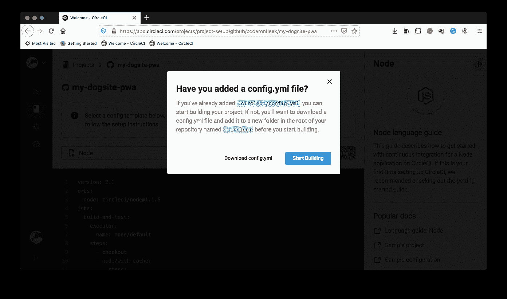

点击**开始构建**以完成设置。这将立即触发管道。构建将失败，因为我们还没有添加管道配置文件。

我们的下一步是将 Firebase 令牌作为环境变量添加到我们刚刚创建的 CircleCI 项目中。在**管道**页面，选中我们的项目，点击**项目设置**。

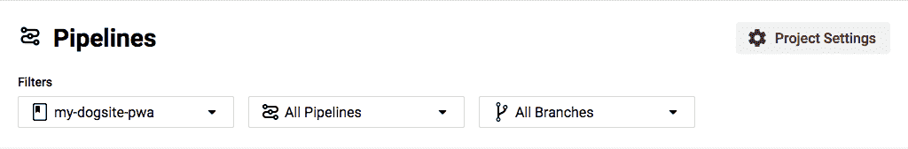

在设置页面侧菜单上，点击`Environment Variables`。在变量设置页面上，点击`Add Environment Variable`。将出现一个对话框。在`Name*`字段中，输入`FIREBASE_TOKEN`，并在`Value*`字段中，粘贴上一步中从 CLI 获得的 Firebase 令牌。点击**提交**完成流程。现在，您已经注册了令牌变量。

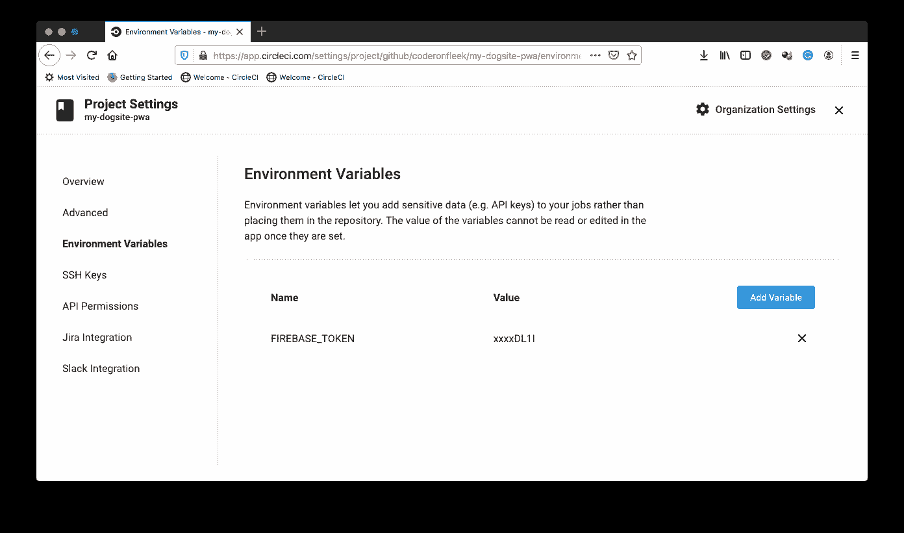

返回到系统上的 PWA 项目。运行下面的命令将`firebase-tools`安装在项目的根目录下，这样您就可以在`package.json`中将它注册为一个开发依赖项:

```
npm install -D firebase-tools 
```

一旦该过程完成，就该创建我们的部署配置文件了。在项目的根目录下，创建一个名为`.circleci`的文件夹，并在其中创建一个名为`config.yml`的文件。在`config.yml`文件中，输入以下代码:

```
version: 2
jobs:
  build:
    docker:
      - image: circleci/node:10.16.0
    working_directory: ~/repo
    steps:
      - checkout
      # Download and cache dependencies
      - restore_cache:
          keys:
            - v1-dependencies-{{ checksum "package.json" }}
            - v1-dependencies-
      - run:
          name: Install Dependencies
          command: npm install
      - save_cache:
          key: v1-npm-deps-{{ checksum "package-lock.json" }}
          paths:
            - ./node_modules
      - run:
          name: Deploy to Firebase
          command: ./node_modules/.bin/firebase deploy --token "$FIREBASE_TOKEN" --only hosting 
```

在上面的配置文件中，我们从从我们的远程存储库中检出项目开始。然后，我们安装依赖项，缓存它们，并从本地安装运行我们的`firebase-tools`,以使用我们的 Firebase 令牌来部署我们的应用程序。

现在是关键时刻了。让我们提交我们的更改，并将它们推送到我们的存储库，以触发我们的部署脚本，并将我们的应用程序部署到 Firebase hosting。

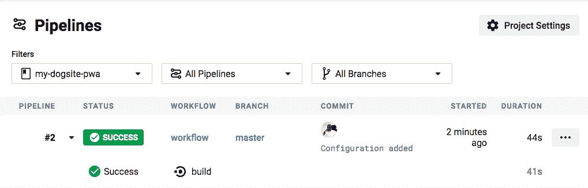

点击进入构建查看项目的幕后。

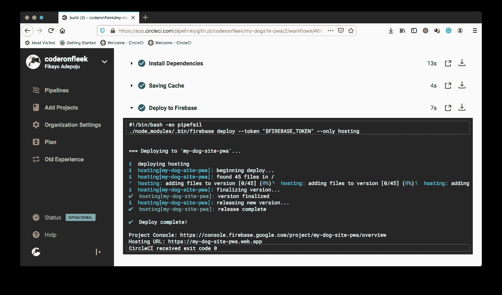

从`Deploy to Firebase`部分。您可以看到部署的应用程序的 URL。对于这个练习，是`https://my-dog-site-pwa.web.app`。将您的应用程序加载到浏览器中以测试您的应用程序。

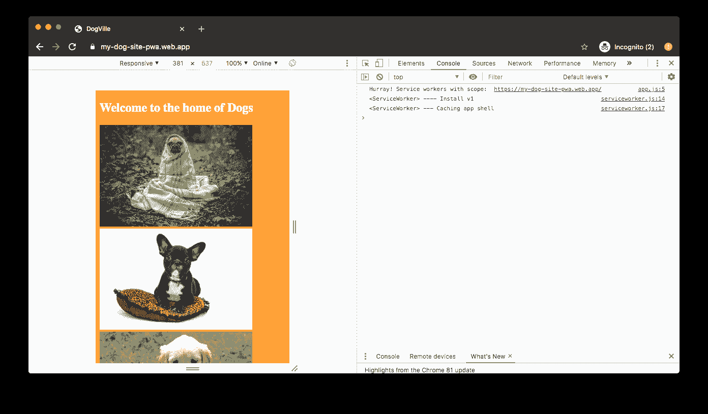

正如您在上面看到的，地址栏正在加载我们的 Firebase URL，我们可以看到控制台消息，表明我们的服务人员已经安装。如果你关闭你的网络并刷新这个页面，你会看到应用程序，所有的狗图片和样式，而不是通常的离线屏幕。

## 结论

大多数开发人员都不喜欢为`https://`URL 设置 SSL 证书。有时这导致不愿意采用公共福利援助方案。然而，在这篇文章中，我们展示了如何通过 CircleCI 和 Firebase 建立一个自动化的[持续集成](https://circleci.com/continuous-integration/) /持续部署管道来安全托管 PWAs。

编码快乐！

* * *

Fikayo Adepoju 是 LinkedIn Learning(Lynda.com)的作者、全栈开发人员、技术作者和技术内容创建者，精通 Web 和移动技术以及 DevOps，拥有 10 多年开发可扩展分布式应用程序的经验。他为 CircleCI、Twilio、Auth0 和 New Stack 博客撰写了 40 多篇文章，并且在他的个人媒体页面上，他喜欢与尽可能多的从中受益的开发人员分享他的知识。你也可以在 Udemy 上查看他的视频课程。

[阅读 Fikayo Adepoju 的更多帖子](/blog/author/fikayo-adepoju/)