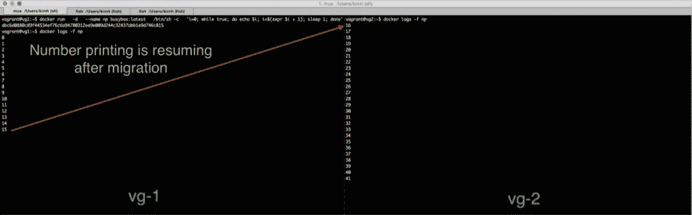

# 使用 CRIU - CircleCI 检查点和恢复 Docker 容器

> 原文：<https://circleci.com/blog/checkpoint-and-restore-docker-container-with-criu/>

**来自出版商的说明:**您已经找到了我们的一些旧内容，这些内容可能已经过时和/或不正确。尝试在[我们的文档](https://circleci.com/docs/)或[博客](https://circleci.com/blog/)中搜索最新信息。

* * *

## TL；灾难恢复:Docker 检查点和恢复的简单演示

## 启动容器

```
$ export cid=$(docker run -d busybox tail -f /dev/null) 
```

## 检查集装箱

```
$ docker checkpoint $cid
7cc692f22c11 
```

## 它不再跑了

```
$ docker ps --quiet
No containers shown here 
```

## 恢复容器

```
$ docker restore $cid
7cc692f22c11 
```

## 它又跑了！！

```
$ docker ps --quiet
7cc692f22c11 
```

## 什么是 CR 和 CRIU？

CR (checkpoint and restart)是一种将进程的内存状态保存到文件中，并从保存的状态恢复进程的技术。 [CRIU](https://github.com/xemul/criu) 是最初开发用于 LXC 集装箱的工具。

既然 Docker 可以运行 LXC 容器，我们应该可以通过使用 CRIU CR Docker 容器，对吗？我以前做过这个实验，写过[这篇文章](http://kimh.github.io/blog/en/criu/experiment-to-suspend-and-resume-docker-container-with-criu/)。不幸的是，实验没有成功，因为 CRIU 当时没有很好地支持 Docker。

一年多过去了，CRIU 团队为支持 Docker 付出了很多努力。

在这篇文章中，我将向您展示 Docker 检查点/恢复如何与 CRIU 一起工作，以及为什么我对它的用例感到兴奋。

## CRIU Vagrant box

使用 CRIU 的 CR Docker 仍在实验中，因此您需要构建启用了实验特性的 Docker。此外，它没有完全合并到 Docker 中，所以你需要使用 CRIU 团队的一个开发人员创建的 Docker 的一个分支。除此之外，您还需要编译启用了特殊内核模块的内核。

做这些事情都不是很好玩，但是不用担心！我已经为你创建了一个包含所有这些事情的流浪盒子，并且已经上传了！你只需要下载盒子并在你的本地机器上运行。

## 旋转流浪盒

假设 VM 的名字是 **vg-1** ，运行下面的命令。

```
vagrant box add https://atlas.hashicorp.com/kimh/boxes/criu
mkdir 'path to vg-1'
cd 'path to vg-1'
vagrant init kimh/criu
vagrant up
vagrant ssh 
```

这就是你尝试 CRIU 所要做的一切！

## docker 恢复/检查点命令

运行在 **vg-1** 上的 Docker 被启用了实验性功能，并拥有两个你从未见过的命令。

```
$ docker checkpoint --help

Usage:  docker checkpoint [OPTIONS] CONTAINER [CONTAINER...]

Checkpoint one or more running containers
....

```

```
$ docker restore --help

Usage:  docker restore [OPTIONS] CONTAINER [CONTAINER...]

Restore one or more checkpointed containers
....

```

这些`checkpoint`和`restore`命令使用了我编译并安装在流浪者盒子上的 CRIU 可执行文件。

```
$ criu --help

Usage:
  criu dump|pre-dump -t PID []
  criu restore []
  criu check [--ms]
  criu exec -p PID
  criu page-server
  criu service []
  criu dedup

.... 
```

这里有一个非常简单的例子来说明如何 CR Docker 容器。

## 启动容器

```
docker run \
  --name np \
  --rm \
  busybox:latest \
  /bin/sh -c \
  'i=0; while true; do echo $i; i=$(expr $i + 1); sleep 1; done' 
```

这个命令下载 busybox 映像并运行一个数字打印机容器，该容器一直打印递增的数字。

## 检查容器

现在，让我们检查一下这个集装箱。你可以用`docker checkpoint`命令来完成。因为 number-printer 容器在前台运行，所以从另一个终端执行此操作。

```
docker checkpoint np 
```

一旦你检查容器，你会看到它停止打印数字。`docker ps`命令不再显示容器。

## 恢复容器

让我们用`docker restore`命令恢复数字打印容器。

```
docker restore np 
```

如果恢复成功，数字打印容器再次开始打印数字。也是回到了`docker ps`的结果里。我们成功地检查和恢复了容器！

## 暂停/取消暂停与检查点/恢复

你可能会说，*“等等，你已经可以用 docker pause/unpause 命令做到这一点了”。*

没错，在前面的示例中，您看不到暂停/取消暂停和检查点/恢复之间的行为差异。这两个命令都在中途停止容器的作业，稍后再继续。

区别在于检查点/重启将容器的内存状态保存到磁盘中，而暂停/取消暂停则没有。

您可以将 pause/unpause 视为向 UNIX 进程发送 SIGSTOP 和 SIGCONT。您可以在前台运行一个进程，按 Ctrl+z 将停止该进程。也可以用`fg job-id`还原过程。暂停/取消暂停命令做的事情与运行容器类似。

检查点/恢复做更复杂的事情。它将正在运行的容器的内存状态转储到磁盘中，并通过读取内存转储来恢复容器。

因为检查点/恢复将容器的状态保存到磁盘中，所以我们可以做更多有趣的事情，而这些事情是暂停/取消暂停所做不到的。我们将在下一节看到这些有趣的用例。

## 用例

以下是 CR Docker 容器的一些使用案例。

### (1)恢复长期运行的容器

你有时想运行需要很长时间的任务。例如，如果您在 Docker 容器上运行一个计算圆周率位数的程序，该容器需要长时间运行才能计算万亿位数。

但是如果你不小心关闭了你的主机呢？这将关闭 Pi 容器，您将丢失容器计算的万亿位数。

CRIU 是解决这个问题的一个很好的工具。你可以定期检查集装箱，为事故做好准备。如果事故发生，你只需要恢复容器，中间恢复计算。

### (2)加快慢速启动集装箱

有些应用程序需要很长时间才能启动。您可以通过在缓慢的应用程序启动后对容器进行检查点操作来加速这些容器。

这里有一个例子来演示这个用例。我们假设 redis 启动超级慢(这在现实中完全不成立！！).

我们只是像往常一样启动一个 redis 容器。

```
cid=$(docker run -d redis) 
```

因为 redis 在这个博客的世界中启动很慢，所以我们需要等待 20 秒，redis 才能准备好接受连接。等了 20 秒后，我们检查了集装箱。

```
docker checkpoint --image-dir=/tmp/redis $cid 
```

我们需要将 redis 容器恢复到一个新的容器中，以便您可以从保存的容器中启动多个容器。为此，您需要使用**–force = true**并传递一个新的容器 id。

```
docker create --name=redis-0 redis
docker restore --force=true --image-dir=/tmp/redis redis-0 
```

启动的容器立即准备好接受连接，无需等待 20 秒。

酷的事情是，你可以重复同样的过程来启动多个容器非常快。

```
for i in 1 2 3 4 5; do
  docker create --name=redis-$i redis
  docker restore --force=true --image-dir=/tmp/redis redis-$i
done 
```

上述示例理论上需要 100 秒(20 秒 x 5)才能完成，没有 CR。有了 CR，这五个容器瞬间就启动了。

### (3)集装箱迁移

你可以和 CRIU 一起做码头集装箱迁移。

要了解这是如何工作的，您需要运行两个流浪虚拟机。你应该已经运行了 **vg-1** ，所以你需要再运行一个虚拟机 **vg-2** 。

### 创建 vg-2

```
mkdir 'path to vg-2'
cd 'path to vg-2'
vagrant init kimh/criu
vagrant up 
```

一旦 **vg-2** 启动，运行以下命令来运行容器。这是必要的，因为在 CRIU 有一个错误。否则，下面的例子不起作用。所以，请不要忘记这样做。

ssh 漫游–' dock run–name = foo-d busybox tail-f/dev/null & & docker RM-f foo '

你现在运行的是两个流浪虚拟机 **vg-1** 和 **vg-2** 。在 **vg-1** 上运行数字打印机容器。

```
docker run \
  -d \
  --name np busybox:latest \
  /bin/sh -c \
  'i=0; while true; do echo $i; i=$(expr $i + 1); sleep 1; done' 
```

你可以看到数字打印机容器一直在打印数字。

```
$ docker logs -f np
1
2
3
4
5
.... 
```

现在让我们将容器迁移到 **vg-2** 。我做了一个[助手 shell 脚本](https://gist.github.com/kimh/79f7bcb195466acea39a)来做这件事，所以你需要把它下载到你的本地机器上。

```
curl -L -o docker-migrate.sh https://gist.githubusercontent.com/kimh/79f7bcb195466acea39a/raw/ca0965d90c850dcbe54654a6002678fff333d408/docker-migrate.sh
chmod +x docker-migrate.sh 
```

您需要传递三个参数来使用该脚本。

第一个参数是要迁移的容器的名称。在我们的例子中，是 **np** 。

第二个和第三个参数是迁移源目录和迁移目标目录的路径。

```
docker-migrate.sh np 'path to vg-1' 'path to vg-2'

Ex. /tmp/docker-migrate.sh np /Users/kimh/vagrant/vg1 /Users/kimh/vagrant/vg2 
```

一旦脚本成功完成，你可以去 **vg-2** 用`docker logs -f np`命令检查。您应该看到数字打印容器从它在 vg-1 上暂停的地方恢复打印数字。

迁移成功！

## 包扎

我们已经看到了如何用 CRIU 和一些用例来 CR Docker 容器。我希望人们能想出更多有趣的用例，并开发利用 CR 优势的工具。

这里是有用的资源，以了解更多关于 CR Docker 与 CRIU。

[CRIU 主网站](http://criu.org/Docker) [Docker 叉着 CRIU 支持](https://github.com/boucher/docker/blob/cr-combined/experimental/checkpoint_restore.md) [Kubernetes 关于 CRIU 的博客](http://blog.kubernetes.io/2015/07/how-did-quake-demo-from-dockercon-work.html)