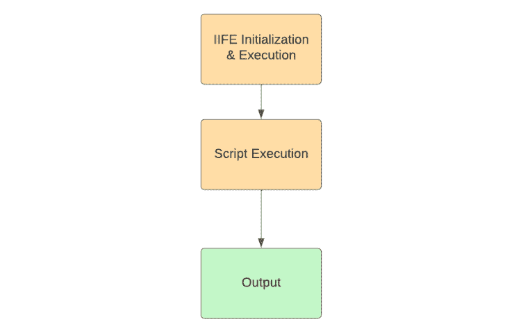
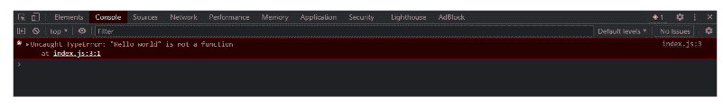
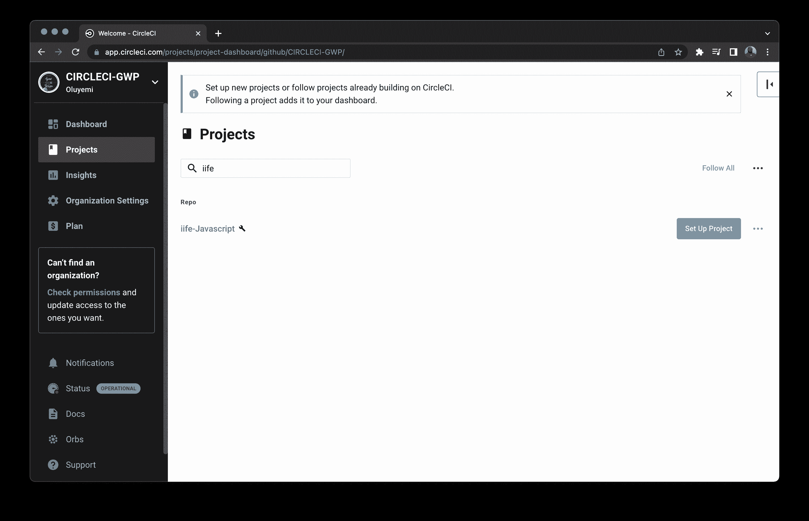
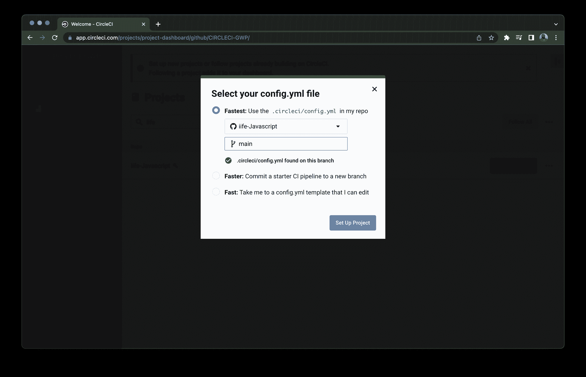
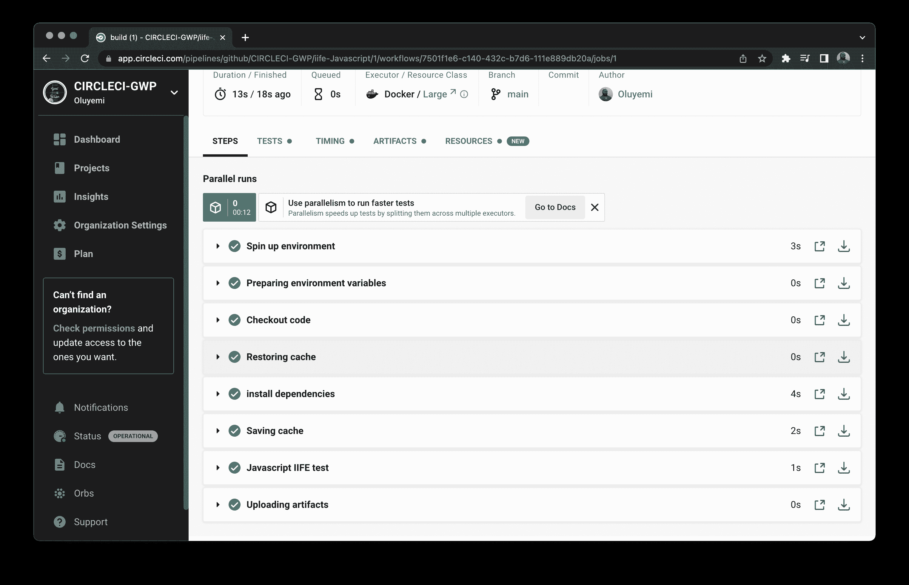

# JavaScript 立即调用函数表达式| CircleCI

> 原文：<https://circleci.com/blog/ci-cd-for-js-iifes/>

> 本教程涵盖:
> 
> 1.  何时使用 IIFEs 代替传统函数
> 2.  为生活写测试
> 3.  集成 CI/CD 进行寿命测试

JavaScript 立即调用函数表达式(IIFEs)是在初始化时执行的函数。可以初始化或定义一个生命(发音为“iffy”)来实现某个目的。在本教程中，您将了解 IIFEs 的用例，以及使用它们优于传统函数的好处。您还将为您的函数编写测试，并为这些测试集成 CI/CD。

## 先决条件

要轻松跟上，您需要具备:

*   一个 [GitHub](https://github.com/) 账户。
*   一个 [CircleCI](https://circleci.com/) 账户。
*   本地安装的节点。
*   对 JavaScript、Git 和单元测试有基本的了解。

> 我们的教程是平台无关的，但是使用 CircleCI 作为例子。如果你没有 CircleCI 账号，请在 注册一个免费的 [**。**](https://circleci.com/signup/)

## 什么是生活？

IIFE(立即调用的函数表达式)是在 JavaScript 事件循环中被调用或调用时运行的函数。

在某些情况下，拥有一个这样的函数会很有用。

防止全球 JS 范围的污染。在传统的函数中，如果你在函数中创建一个变量，它可以在全局对象中被访问。如果你在生活中定义了一个变量，它只能在函数中直接访问。

例如，库 jQuery 拥有对象`$`。如果您有另一个模块也导入这个对象，您可能会遇到一些混乱和错误。生活会消除那些错误。您可以使用 IIFE 为 jQuery 及其方法创建一个范围。

使用 IIFEs 的另一个好处是执行异步操作，比如`setTimeout()`方法。在本教程后面关于闭包的部分，您将有机会使用它。

IIFEs 也可以用来创建私有变量。这些变量在需要防止意外修改或更改重要值的情况下非常有用。



## 设置应用程序

克隆教程的[库](https://github.com/CIRCLECI-GWP/iife-Javascript)。它包含您将在首选位置使用的代码。打开终端并运行以下命令:

```
git clone https://github.com/CIRCLECI-GWP/iife-Javascript.git` 
```

克隆存储库后，通过运行以下命令将目录更改为项目目录:

```
cd  iife-JavaScript 
```

您还需要通过运行以下命令来安装所需的依赖项:

```
npm install 
```

## 在函数中使用函数

生活可以用于不同的目的。这些函数的主要用途之一是声明全局变量。

这段代码片段展示了如何使用 IIFE 进行全局变量声明:

```
// Global variable declaration
<script>
  (function ($){
     let counter = 1;
      $("#increment").click(function () {
        $(this).text("Number of clicks: " + counter++);
      })
  })(jQuery)
</script> 
```

通过这样使用 jQuery，您可以访问`$`对象。IIFE 中使用该对象的任何代码都将只引用 jQuery。然后，这个对象让我们可以访问 jQuery 函数，而不会弄乱全局名称空间。

理解生命本身就是函数也很重要。唯一的区别是它们不需要等待调用。通过进一步研究，您可以在这个代码片段中看到:

```
(function myFunc() { // Beginning of function
    console.log(greeting)
    }) // End of function
    () //calls the function execution e.g. myFunc() 
```

### 生命前的分号

需要注意的一件事是没有被封闭的变量或者 JavaScript 认为没有被封闭的变量。如果省略分号，可能会出错，尤其是在使用分号的应用程序中。这里有一个例子:

```
const greeting = "Hello world"

(function () {
    console.log(greeting);
})() 
```

如果你运行这个，你会得到一个错误。



对于像变量这样的未终止语句，[自动分号插入](https://developer.mozilla.org/en-US/docs/Web/JavaScript/Reference/Lexical_grammar#automatic_semicolon_insertion) (ASI)和像 webpack 这样的捆绑器将防止这类错误。然而，它们并不适用于所有情况，包括生活。您可以通过在语句的末尾或生命的开头添加分号来绕过这一点。此代码片段执行时没有错误，因为您关闭了变量:

```
const greeting = "Hello world"; 
(function () {
    console.log(greeting);
})() 
```

## 命名与匿名生活

你可以给你的生活命名，也可以匿名。请注意，命名它们并不意味着它们在执行后会被调用。命名非常有用，尤其是当您有几个执行不同操作的生命彼此靠近的时候。以下代码片段显示了一个命名生命的示例:

```
const greeting = "Hello world";

(function myGreeting() {
    console.log(greeting);
})() 
```

这个函数被命名为 life，但它并不比未命名的 life 更有优势。未命名的生命没有函数名，只有关键字`function`。这是匿名生活的结构:

```
(function() {
//Your code goes here
})() 
```

语法类似于 JavaScript 的匿名函数。您也可以使用箭头函数变体:

```
(() => {
//Your code goes here
})() 
```

## 使用带有闭包的文件

生命的另一个重要用途是[闭包](https://developer.mozilla.org/en-US/docs/Web/JavaScript/Closures)。闭包是函数利用其局部范围之外的变量或其他信息的能力。例如，上一个代码片段中的函数显示了问候语，尽管它的值是在函数之外定义的。这个例子展示了 IIFEs 如何使用闭包:

```
const friendlyFunction = (function () {
    let greetCount = 0;
    return function () {
        console.log(`Hello ${greetCount}x`);
        return greetCount++;
    }
})();

friendlyFunction();
friendlyFunction();
friendlyFunction(); 
```

在这段代码中，您定义了生命，并将其存储在变量`friendlyFunction`中。如前所述，生命在被定义时就被执行。不过在这种情况下，内部函数直到调用`friendlyFunction()`才会执行。如果您注释掉底部的函数调用，控制台上将不会有输出。

`greetCount`变量是私有的，只能在生命中访问。当分别调用函数时，`greetCount`变量的值会随着每次调用而持久化和递增。如果没有闭包，值将始终是`0`。因此，IIFE 中的闭包确保了全局名称空间不会被污染，即使您决定使用全局范围内存在的变量名来命名您的 IIFE 变量。

## 积分电路

上一节描述了生命有用的一些方式。如果不编写测试并将它们与 CI/CD 集成，这个列表就不完整。在这种情况下，CircleCI。

要做到这一点，你首先需要为你的生命函数编写测试。您将使用 Jest，这是一个 JavaScript 测试框架。

在克隆的库中的`users.js`下，你有这种从免费的 [API](https://jsonplaceholder.typicode.com/users) 获取用户的异步生活。以下是您将在本部分使用的内容:

```
const axios = require('axios')

//Asynchronous IIFEs
const getUsers = (async () => {
    async function fetchUsers() {
        const users = await axios.get('https://jsonplaceholder.typicode.com/users')
            .then((response) => response.data)
            .catch((err) => console.log(err))
        return users
    }

    return {
        array: await fetchUsers()
    } 

})() // should get users when we execute `node users.js`

module.exports = getUsers 
```

这个函数返回一个包含 10 个用户的数组。您可以使用该数组中的数据来编写测试，以确保获得正确的用户数组:

```
const getUsers  = require('./users')

describe('JavaScript IIFE test', () => {
    test('should get the users array', async () => {
        const response = await getUsers
        expect(response).not.toBeNull();
        expect(response.array).not.toBeNull();
        expect(response.array.length).toBe(10);
        expect(response.array).toBeInstanceOf(Array);
        expect(response.array[0]).toBeInstanceOf(Object);
    });

    test('should get a single user', async () => {
        const response = await getUsers
        expect(response).toBeDefined();
        expect(response.array[0].name).toEqual("Leanne Graham")
    })
}); 
```

这个代码片段有一个测试套件，它使用 Jest 来确保您收到的数据是预期的。这个代码可以在`app.test.js`文件中找到。在本地运行此测试文件:

```
 npm run test 
```

如果您的断言是正确的，测试应该通过，如下所示:

```
PASS  ./app.test.js
  JavaScript IIFE test
    √ should get the users array (1563 ms)
    √ should get a single user (10 ms)

Test Suites: 1 passed, 1 total
Tests:       2 passed, 2 total
Snapshots:   0 total
Time:        4.956 s
Ran all test suites. 
```

## 积分电路

CircleCI 是一个 [CI/CD 工具](https://circleci.com/blog/what-is-a-ci-cd-pipeline/)，它可以帮助你自动化工作流程和运行测试。

在您的[项目](https://github.com/CIRCLECI-GWP/iife-Javascript)的根文件夹中，创建一个`.circleci`文件夹。在里面添加一个`config.yml`文件。在`config.yml`文件中，添加以下内容:

```
version: 2.1
jobs:
  build:
    working_directory: ~/repo
    docker:
      - image: cimg/node:14.17.1
    steps:
      - checkout
      - restore_cache:
          key: dependency-cache-{{ checksum "package-lock.json" }}
      - run:
          name: install dependencies
          command: npm install
      - save_cache:
          key: dependency-cache-{{ checksum "package-lock.json" }}
          paths:
            - ./node_modules
      - run:
          name: JavaScript IIFE test
          command: npm test
      - store_artifacts:
          path: ~/iife-JavaScript 
```

CircleCI 为管道执行创建了一个虚拟环境。在这个代码片段中，我们正在安装必要的依赖项，为更快的构建保存缓存，然后执行您的测试。

保存您的本地更改，提交并将其推送到 GitHub。登录您的 CircleCI 帐户。在 Projects 选项卡中，单击远程存储库名称旁边的 **Set Up Project** 。



在弹出的界面上，选择**最快**，然后点击**设置项目**。



CircleCI 将运行构建作业，它应该会成功。



## 结论

在本教程中，您了解了 JavaScript 立即调用函数表达式(IIFEs)如何因为立即调用而导致更快的工作流。您还了解了生命的不同用例以及它们解决的一些问题。最后，您编写了测试并集成了 CircleCI。我希望你喜欢阅读这篇教程，直到下一篇，继续学习！

* * *

Waweru Mwaura 是一名软件工程师，也是一名专门研究质量工程的终身学习者。他是 Packt 的作者，喜欢阅读工程、金融和技术方面的书籍。你可以在[他的网页简介](https://waweruh.github.io/)上了解更多关于他的信息。

[阅读更多 Waweru Mwaura 的帖子](/blog/author/waweru-mwaura/)