# 使用 Kubernetes Docker | CircleCI 的 Node.js 项目

> 原文：<https://circleci.com/blog/ci-cd-for-node-js-projects-using-circleci-kubernetes-and-docker-with-deployment-to-the-google-cloud-platform/>

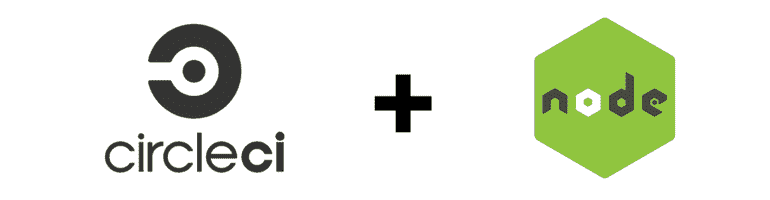

图片来源:Meshstudio

自动化软件交付可以解决许多与手动部署相关的问题。这篇文章的目标是提供对 Node.js 项目的持续集成/持续部署(CI/CD)的见解。本教程将重点介绍几种工具的使用:[Docker](https://www . Docker . com/为了帮助我们实现容器化， [Kubernetes](https://kubernetes.io/) 将被用作我们的编排工具，[谷歌云平台](https://cloud.google.com/) (GCP)将成为云服务提供商，最后， [CircleCI](https://circleci.com/) 。

通过阅读这篇文章，您将对部署自动化有更好的理解。这将减少软件交付所需的时间并提高生产率。这是一个伟大的技能，将有利于许多开发人员。

以下是我们将要遵循的关键步骤:

1.  构建应用程序并添加测试
2.  通过 Docker 文件为此应用程序定义新的 Docker 映像
3.  设置谷歌云平台
4.  配置 Kubernetes
5.  添加一些脚本
6.  CircleCI 设置

## 构建应用程序

首先，创建一个`index.html`文件，并用以下内容填充它:

```
<html>
 <head>
  <title></title>
<link href="https://maxcdn.bootstrapcdn.com/bootstrap/3.4.0/css/bootstrap.min.css" rel="stylesheet">
 </head>
 <body>

  <div class="col-md-10 col-md-offset-1" style="margin-top:20px">
   <div class="panel panel-primary">
     <div class="panel-heading">
       <h3 class="panel-title">Welcome To My Demo App</h3>
     </div>
      <div class="panel-body">
       <div class="alert alert-success">
          <p>This is a basic app used to demonstrate CI/CD on Google Cloud using K8s, CircleCI and Docker </p>
       </div>
         <div class="col-md-9">
           <p>Author:</p>
           <div class="col-md-3">
             <a href="https://twitter.com/delan_hype">@delan_hype</a>
           </div>
         </div>
      </div>
  </div>
  </div>

<script src="https://code.jquery.com/jquery-3.1.1.slim.min.js"></script>
<script src="https://maxcdn.bootstrapcdn.com/bootstrap/4.0.0-alpha.6/js/bootstrap.min.js"></script>
 </body>
</html> 
```

接下来，用以下内容创建一个名为`server.js`的服务器文件:

```
const express = require('express');
const path = require('path');
const morgan = require('morgan');
const bodyParser = require('body-parser');

/* eslint-disable no-console */

const port = process.env.PORT || 3000;
const app = express();

app.use(morgan('dev'));
app.use(bodyParser.json());
app.use(bodyParser.urlencoded({ extended: 'true' }));
app.use(bodyParser.json({ type: 'application/vnd.api+json' }));

app.use(express.static(path.join(__dirname, './')));

app.get('*', (req, res) => {
  res.sendFile(path.join(__dirname, './index.html'));
});

app.listen(port, (err) => {
  if (err) {
    console.log(err);
  } else {
    console.log(`App at: http://localhost:${port}`);
  }
});
module.exports = app; 
```

要创建的另一个重要文件是一个`package.json`文件，它将保存这个项目所需的 Node.js 包。创建文件并复制以下内容:

```
{
  "name": "gcloud-deploy-node-app-ci-ci-circleci",
  "version": "1.0.0",
  "description": "Tutorial leading to a deployment of a simple Node.js app to gcloud",
  "main": "server.js",
  "scripts": {
    "start": "node server.js",
    "test": "mocha"
  },
  "keywords": [
    "gcloud",
    "node"
  ],
  "author": "Collins",
  "license": "MIT",
  "dependencies": {
    "body-parser": "^1.17.2",
    "express": "^4.15.3",
    "morgan": "^1.8.2"
  },
  "devDependencies": {
    "chai": "^4.1.2",
    "mocha": "^5.2.0",
    "request": "^2.88.0"
  }
} 
```

### 在本地运行应用程序

导航到上面项目所在的目录。通过运行以下命令安装所需的 Node.js 包:

```
npm install 
```

现在，您可以使用以下命令启动应用程序:

```
npm start 
```

在浏览器中，导航到 http://localhost:3000。应用程序应该如下所示运行:

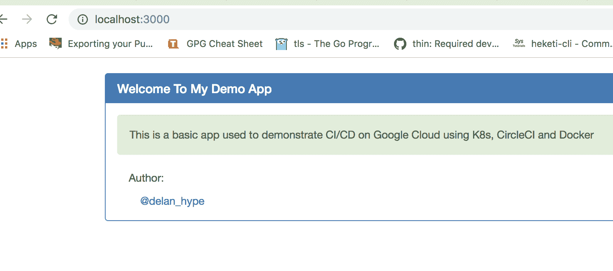

本地运行的项目

## Docker 设置

按照[这个链接](https://docs.docker.com/install/)的说明安装 Docker。当你打开上面的链接，你会发现为你的操作系统安装 Docker 的基本步骤。

如果你想跟进但不想自己构建项目，你可以在 GitHub [这里](https://github.com/collins-b/ci-cd)找到回购。这是一个简单的 Node.js 应用程序，为 HTML 页面提供服务。我构建这个项目是为了让这篇文章能够实际操作，我保持它的简单，这样我就可以清楚地演示 [CI/CD](https://circleci.com/continuous-integration/) 流程。在存储库中，您会找到如下所示的各种文件:

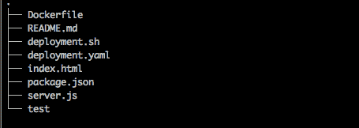

项目文件夹结构

为了将项目归档，我们需要创建一个 dockerize 文件，包含以下几行:

```
FROM node
ENV NPM_CONFIG_LOGLEVEL warn
RUN mkdir -p /usr/src/app
EXPOSE 3000
WORKDIR /usr/src/app
ADD package.json /usr/src/app/
RUN npm install --production
ADD . /usr/src/app/
ENTRYPOINT ["npm", "start"] 
```

打开一个文本编辑器，将这些行复制到其中。将文件保存为项目根目录中的`Dockerfile`。

在本文中，我不会深入介绍 Docker，但是对于那些不熟悉 Docker 的人，让我解释一下上面文件中的一些命令:

**FROM -** 在我们的例子中，构建新映像的基础映像是节点。该命令必须位于 Dockerfile 文件的顶部。
ENV-它定义了一个环境变量。
**RUN -** 用于在 docker 映像的构建过程中执行命令。
**添加-** 将文件从主机复制到新的 docker 镜像。
**ENTRYPOINT -** 定义容器运行时将执行的默认命令。
**工作目录-** 这是要执行的入口点命令的指令。
**EXPOSE -** 公开容器运行的指定端口。

现在，让我们建立我们的形象。运行:

```
docker build -t ci-cd . 
```

结果将类似于:

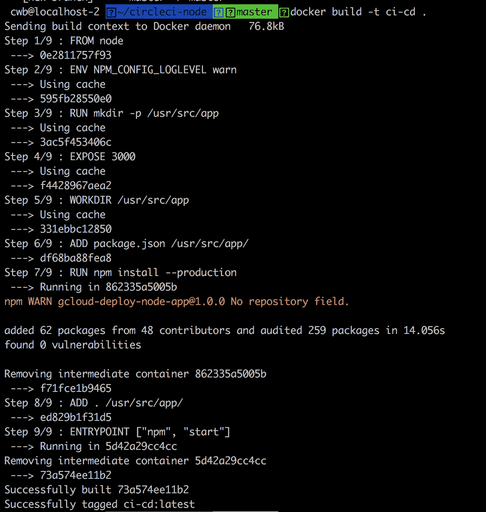

Docker 构建步骤

为了测试图像是否构建良好，让我们运行它，看看是否可以访问我们的应用程序。

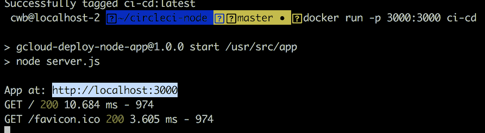

Dockerized 应用程序运行

导航到 http://localhost:3000 应该会产生以下结果:


在浏览器上实现应用程序运行访问

这表明项目构建成功。我们需要做的下一件事是将它推送到 Docker 注册表。这是存储图像的地方。谷歌计算注册表(GCR)将在这里使用，因为我们正在使用 GCP。

标记图像:

```
docker tag <HOSTNAME>/<YOUR-PROJECT-ID>/<IMAGE-NAME> 
```

示例:

```
docker tag ci-cd gcr.io/ci-cd-12347/ci-cd:0.1.0 
```

推送图像:

```
gcloud docker -- push <HOSTNAME>/<YOUR-PROJECT-ID/<IMAGE-NAME> 
```

示例:

```
gcloud docker -- push gcr.io/ci-cd-12347/ci-cd:0.1.0 
```

## Google 云平台设置

我将使用 GCP 作为应用程序将部署的云服务提供商。您需要做的第一件事是安装和配置`gcloud`。如果你没有谷歌云账户，你可以在这里创建一个[。](https://cloud.google.com/free/)

### Mac OS/Linux

在您的终端上，运行:

```
curl https://sdk.cloud.google.com | bash 
```

完成上述步骤后，重新启动 shell:

```
exec -l $SHELL 
```

初始化`gcloud`环境:

```
gcloud init 
```

### Windows 操作系统

在这里下载安装程序[并启动它。安装完成后，启动](https://dl.google.com/dl/cloudsdk/channels/rapid/GoogleCloudSDKInstaller.exe) [cloud SDK](https://circleci.com/docs/google-auth/) shell，使用命令初始化`gcloud`:

```
gcloud init 
```

接下来要做的是通过运行以下命令来验证`gcloud`:

```
gcloud auth login 
```

将自动打开一个浏览器，提供将在终端上显示的链接。类似于:

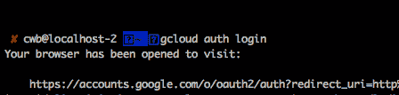

谷歌云认证

在打开的浏览器选项卡上，点击**允许**认证`gcloud`:

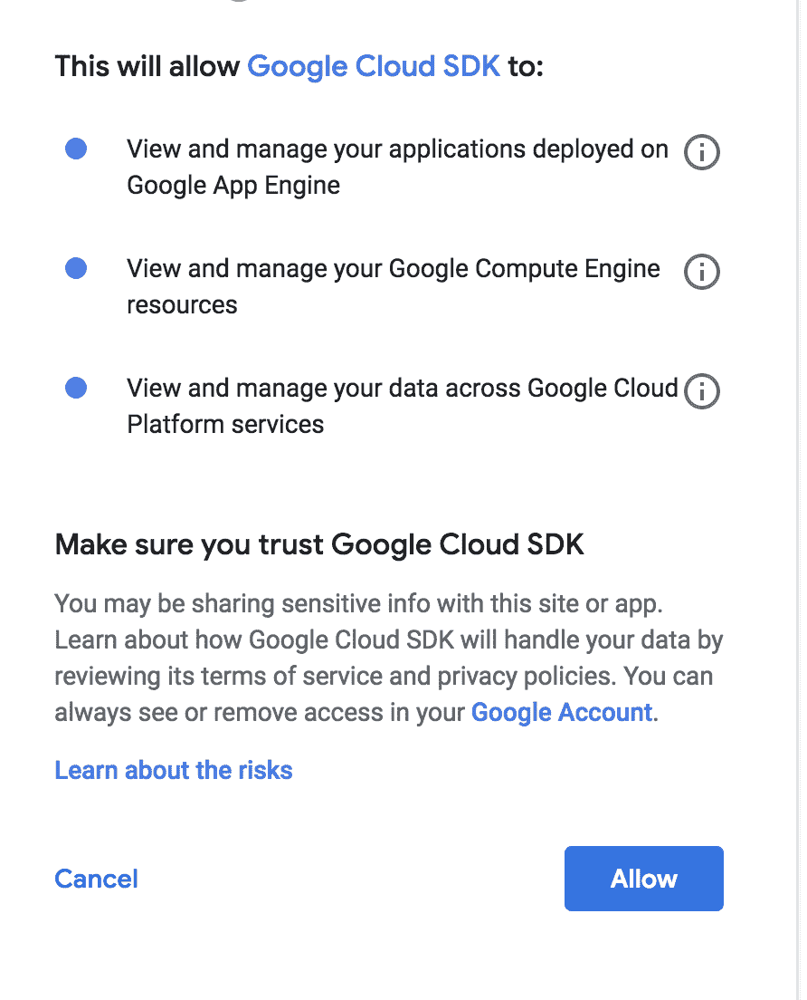

授予 Google Cloud SDK 权限

## Kubernetes 设置

在这个例子中，我们将使用 Kubernetes 来编排和管理容器。安装 Kubernetes 有多种方法。最简单的方法是使用下面的命令下载作为 [Google Cloud SDK](https://circleci.com/docs/google-auth/) 一部分的`kubectl`二进制文件:

```
gcloud components install kubectl 
```

通过运行以下命令确认 Kubernetes 安装正确:

```
kubectl version 
```

输出将类似于:

```
Client Version: version.Info{Major:"1", Minor:"8", GitVersion:"v1.8.6", GitCommit:"6260bb08c46c31eea6cb538b34a9ceb3e406689c", GitTreeState:"clean", BuildDate:"2017-12-21T06:34:11Z", GoVersion:"go1.8.3", Compiler:"gc", Platform:"darwin/amd64"}
Server Version: version.Info{Major:"1", Minor:"8", GitVersion:"v1.8.0", GitCommit:"0b9efaeb34a2fc51ff8e4d34ad9bc6375459c4a4", GitTreeState:"clean", BuildDate:"2017-11-29T22:43:34Z", GoVersion:"go1.9.1", Compiler:"gc", Platform:"linux/amd64"} 
```

对于成功的安装，您应该看到客户端和服务器版本。

接下来，按照此处列出的[步骤创建一个 GCP 项目。该项目将帮助我们创建、启用和使用所有的 GCP 服务，如 Kubernetes 引擎和容器注册。此后，按照](https://cloud.google.com/resource-manager/docs/creating-managing-projects)[这些](https://cloud.google.com/kubernetes-engine/docs/how-to/creating-a-cluster)步骤创建并建立一个带状 Kubernetes 集群。集群是 Kubernetes 引擎的基础。所有容器化的应用程序都运行在集群之上。因此，我们需要集群来运行和管理我们的应用程序。

例如，要使用您的终端创建集群，请运行以下命令，用您的值替换默认值:

```
gcloud container clusters create CLUSTER_NAME 
```

其中`CLUSTER_NAME`是您为集群选择的名称。

最后，通过在终端上运行以下命令来本地设置集群:

```
gcloud container clusters get-credentials <CLUSTER_NAME> --zone <TIME_ZONE> --project <PROJECT_ID> 
```

例如:

```
gcloud container clusters get-credentials ci-cd --zone us-west1-a --project ci-cd-12347 
```

您可以通过运行以下命令来确认集群集是否正确:

```
kubectl config current-context 
```

输出应该是上一步中创建的集群的名称。

## 库比涅斯配置

这涉及到使用 YAML 创建清单。让我们将服务和部署放在一个文件中，如下所示，用`---`分隔每个文档。如果你熟悉 YAML，那么这应该是一个熟悉的概念。

```
apiVersion: v1
kind: Service
metadata:
  name: ci-cd
  labels:
    app: ci-cd
spec:
  ports:
    - port: 3000
  selector:
    app: ci-cd
    tier: frontend
  type: LoadBalancer
---
apiVersion: apps/v1beta1
kind: Deployment
metadata:
  name: ci-cd
  labels:
    app: ci-cd
spec:
  selector:
    matchLabels:
      app: ci-cd
      tier: frontend
  strategy:
    type: Recreate
  template:
    metadata:
      labels:
        app: ci-cd
        tier: frontend
    spec:
      containers:
      - image: gcr.io/ci-cd-217118/ci-cd:0.1.0
        name: ci-cd
        ports:
        - containerPort: 3000
          name: ci-cd 
```

如果你对 Kubernetes 有点熟悉的话，理解上面文件中的内容并不困难，但是我将在下面简要描述一下其中的亮点:

**apiVersion -** 指定 Kubernetes API 版本。
**【种类】-** 指定需要供应什么资源，例如服务、部署等。
**元数据-** 给出了资源的更多描述，例如名称，它指定了资源名称。
**spec -** 给出资源规格，如港口、集装箱等。
**图像-** 指定容器使用的图像。它需要图像的 URL。

将上面几行复制并粘贴到文本编辑器中，并在项目的根目录下保存为`deployment.yaml`。

现在，让我们使用以下命令创建/触发初始部署:

```
kubectl create -f deployment.yaml 
```

确认 pod 的状态为`Running`，外部 IP 地址显示在端口 3000 上，并且`AVAILABLE`标签至少为 1:

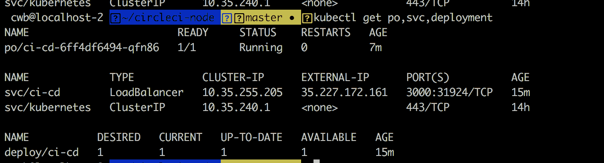

列出 Kubernetes pods、服务和部署

如您所见，部署、服务和 pod 都已启动并运行。在我的例子中，应用程序运行在 http://35.227.172.161:3000/,上，如上图所示。如果您一直跟随，您的应用程序将运行在不同的 IP 上。在端口 3000 上导航到它。

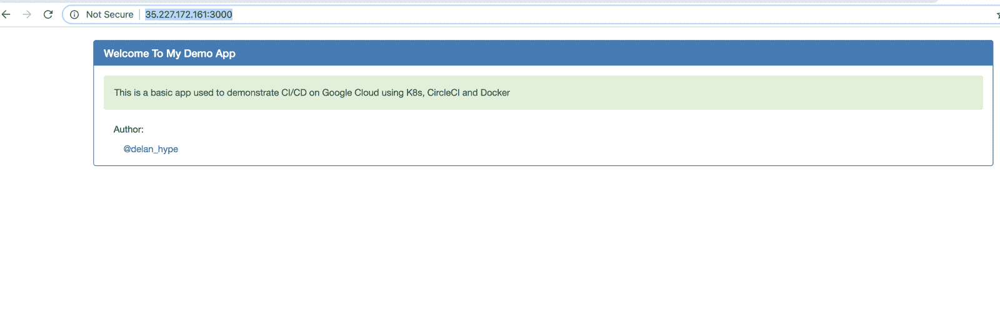

部署的应用程序

**注:** *当你读到这篇文章的时候，我已经为了节约成本而破坏了集群，所以这个 IP 不会再起作用了。*

要删除集群，请在终端中运行以下命令:

```
gcloud container clusters delete [CLUSTER_NAME] 
```

然后删除具有集群的 GCP 项目:

```
gcloud projects delete [PROJECT_NAME] 
```

如您所见，在部署期间，我们不得不手动运行`kubectl`命令。如果每次应用程序有变化时都必须运行它，那么这将是很费力的。接下来，我们将使用 [CircleCI](https://circleci.com/) 来实现自动化。

## 脚本

这需要一个简单的 shell 脚本来帮助部署。这个脚本将由 CircleCI 运行，作为部署应用程序的构建步骤。该脚本如下所示:

```
# !/bin/bash
set -e
echo "Deploying to ${DEPLOYMENT_ENVIRONMENT}"
echo $ACCOUNT_KEY_STAGING > service_key.txt
base64 -i service_key.txt -d > ${HOME}/gcloud-service-key.json
gcloud auth activate-service-account ${ACCOUNT_ID} --key-file ${HOME}/gcloud-service-key.json
gcloud config set project $PROJECT_ID
gcloud --quiet config set container/cluster $CLUSTER_NAME
gcloud config set compute/zone $CLOUDSDK_COMPUTE_ZONE
gcloud --quiet container clusters get-credentials $CLUSTER_NAME
docker build -t gcr.io/${PROJECT_ID}/${REG_ID}:$CIRCLE_SHA1 .
gcloud docker -- push gcr.io/${PROJECT_ID}/${REG_ID}:$CIRCLE_SHA1
kubectl set image deployment/${DEPLOYMENT_NAME} ${CONTAINER_NAME}=gcr.io/${PROJECT_ID}/${REG_ID}:$CIRCLE_SHA1
echo " Successfully deployed to ${DEPLOYMENT_ENVIRONMENT}" 
```

创建一个名为`deployment.sh`的文件，用上面的内容填充。

## 圆形构型

配置文件将位于根目录下的`.circleci`文件夹中。如果你很好奇，查看[这里](https://circleci.com/docs/configuration-reference/)阅读更多关于如何配置 CircleCI 的信息。

最终配置如下所示，您可以将其复制粘贴到您的`.circleci/config.yml`文件中:

```
version: 2
jobs:
  build:
    docker:
      - image: wecs/circle-ci-gcloud-node:0.1.0
    working_directory: ~/workspace
    environment:
      DEPLOYMENT_NAME: ci-cd
      PROJECT_ID: ci-cd-217118
      CLUSTER_NAME: ci-cd
      CLUSTER_NAME_STAG: ci-cd-stag
      CLOUDSDK_COMPUTE_ZONE: us-west1-a 
      CONTAINER_NAME: ci-cd
      IMAGE: ci-cd
      REG_ID: ci-cd
      REG_ID_PROD: ci-cd-prod
      IMG_TAG: 0.1.0
      PROJECT_NAME: ci-cd
      DEPLOYMENT_ENVIRONMENT: staging
    steps:
      - checkout
      - setup_remote_docker
      - restore_cache:
          keys:
          - v1-dependencies-{{ checksum "package.json" }}
          - v1-dependencies-
      - run:
          name: Install node packages
          command: |
            npm install

      - run:
          name: Start app
          command: |
            npm start &
      - run:
          name: Run tests
          command: |
            npm test
      - restore_cache:
          keys:
          - v1-dependencies-{{ checksum "package.json" }}
          - v1-dependencies-
      - save_cache:
          paths:
            - node_modules
          key: v1-dependencies-{{ checksum "package.json" }}

      - run:
          name: Build and Deploy
          command: |
            if [ "${CIRCLE_BRANCH}" == "master" ]; then
              ./deployment.sh
            fi 
```

接下来，[提交更改并推送到 GitHub](https://circleci.com/blog/pushing-a-project-to-github/) :

要理解 CircleCI 配置文件的核心步骤，请阅读本演练。还有一点需要注意的是，我用了一个自定义的基础镜像，`wecs/circle-ci-gcloud-node:0.1.0`，里面安装了`gcloud`、`kubectl`、`docker`、`node`等。使用自定义图像的原因是，我想要一个基础图像，其中包含该项目的所有必需工具。

要将 CircleCI 整合到您的项目中，首先[注册 CircleCI 账户](https://circleci.com/signup/)，如果您还没有的话。然后，在控制台上点击**添加项目**。它位于仪表板页面的最左侧。将出现如下所示的项目列表:

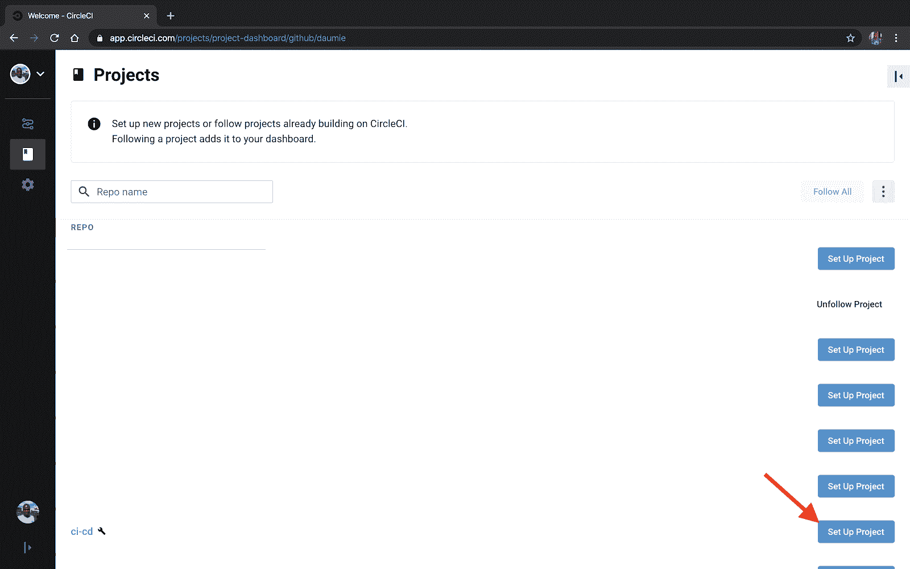

在 CircleCI 中添加项目

接下来，导航到页面的最右侧，点击**设置项目**:

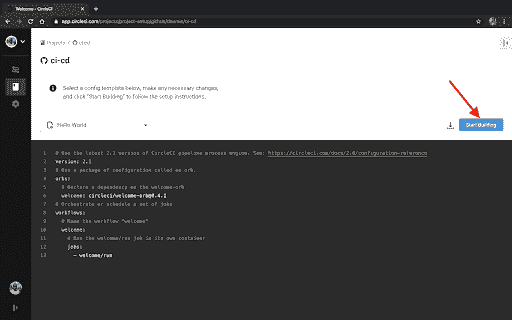

项目配置按钮

将出现如下所示的页面。点击**开始构建**并观察构建。构建将失败，因为我们还没有认证 CircleCI 从 GCP 写/读。

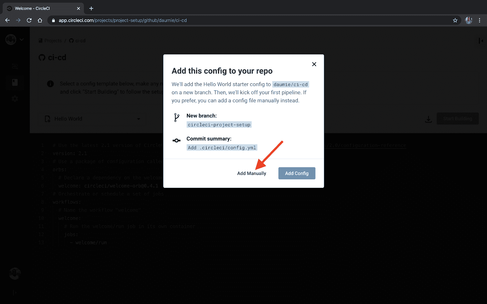

初始建筑

CircleCI 需要一种方法在 GCP 上验证自己。我们将使用服务帐户。前往 GCP 控制台，按照那里列出的步骤创建一个服务帐户。


服务帐户的创建

然后，将创建服务帐户后下载的文件内容复制为 CircleCI 中的环境变量，首先对其进行编码:

```
base64 ci-cd-2328-6575986.json 
```

然后将结果复制到 CircleCI 环境变量中。

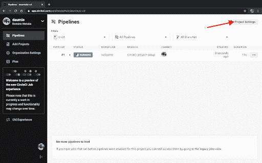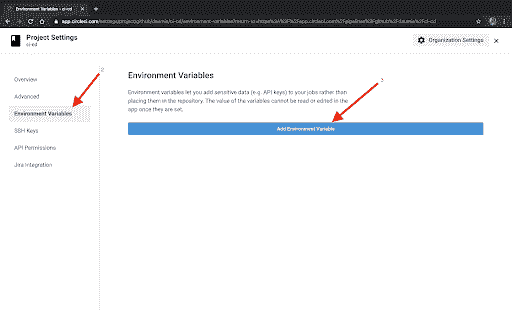

添加服务帐户密钥作为环境变量

## 测试

现在让我们测试我们的 CI/CD 管道。

这是初始的 HTML 文件。该文件应该与 docker 文件位于同一目录中。请参考我上面分享的项目的文件夹结构。

```
<html>
 <head>
  <title></title>
<link href="https://maxcdn.bootstrapcdn.com/bootstrap/3.4.0/css/bootstrap.min.css" rel="stylesheet">
 </head>
 <body>
  <div class="col-md-10 col-md-offset-1" style="margin-top:20px">
   <div class="panel panel-primary">
     <div class="panel-heading">
       <h3 class="panel-title">Welcome To My Demo App</h3>
     </div>
      <div class="panel-body">
       <div class="alert alert-success">
          <p>This is a basic app used to demonstrate CI/CD on Google Cloud using K8s, CircleCI and Docker </p>
       </div>
         <div class="col-md-9">
           <p>Author:</p>
           <div class="col-md-3">
             <a href="https://twitter.com/delan_hype">@delan_hype</a>
           </div>
         </div>
      </div>
  </div>
  </div>
<script src="https://code.jquery.com/jquery-3.1.1.slim.min.js"></script>
<script src="https://maxcdn.bootstrapcdn.com/bootstrap/4.0.0-alpha.6/js/bootstrap.min.js"></script>
 </body>
</html> 
```

让我们修改它，看看 CI/CD 管道是否会部署新的更改。尝试在 HTML 文件的主体部分添加一些内容。例如，替换为:

```
<p>This is a basic app used to demonstrate CI/CD on Google Cloud using K8s, CircleCI and Docker </p> 
```

有了这个:

```
<p>If this change is reflected, then the CI/CD pipeline is functional... 👏🏿 😈 </p> 
```

如果您在一个不同的 Git 分支上，将变更推送到 master 或者将 PR 合并到 master。

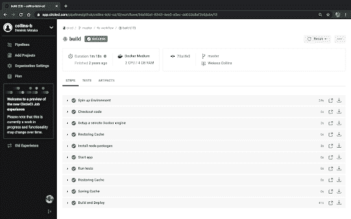

成功的构建步骤

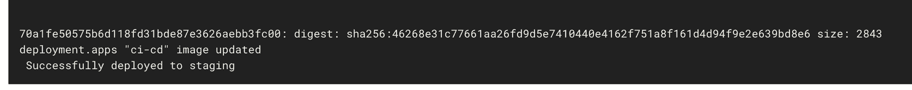

成功部署到试运行

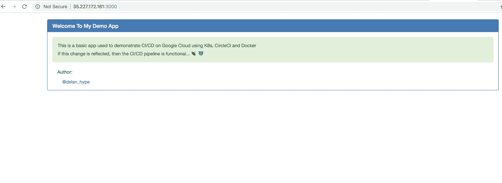

耶！成功了！您现在可以使用管道了，但是请确保完成上述步骤来删除您的集群，并避免在完成后产生任何费用。

## 结论

我们已经在 GCP 上使用 CircleCI 2.0 成功地为 Node.js 项目建立了一个 CI/CD 管道。现在，您可以为自己的 Node.js 项目设置 CI/CD 管道，并按照上面的步骤利用 Kubernetes 进行编排，将您的应用程序 dockerize 并部署到 GCP！

完整的项目可以在这里找到[。](https://github.com/collins-b/ci-cd)

* * *

Collins Wekesa 是安德拉的一名肯尼亚 DevOps 工程师，也是一名区块链爱好者。在空闲时间，他喜欢写技术博客。

[阅读柯林斯·韦克萨的更多帖子](/blog/author/collins-wekesa/)