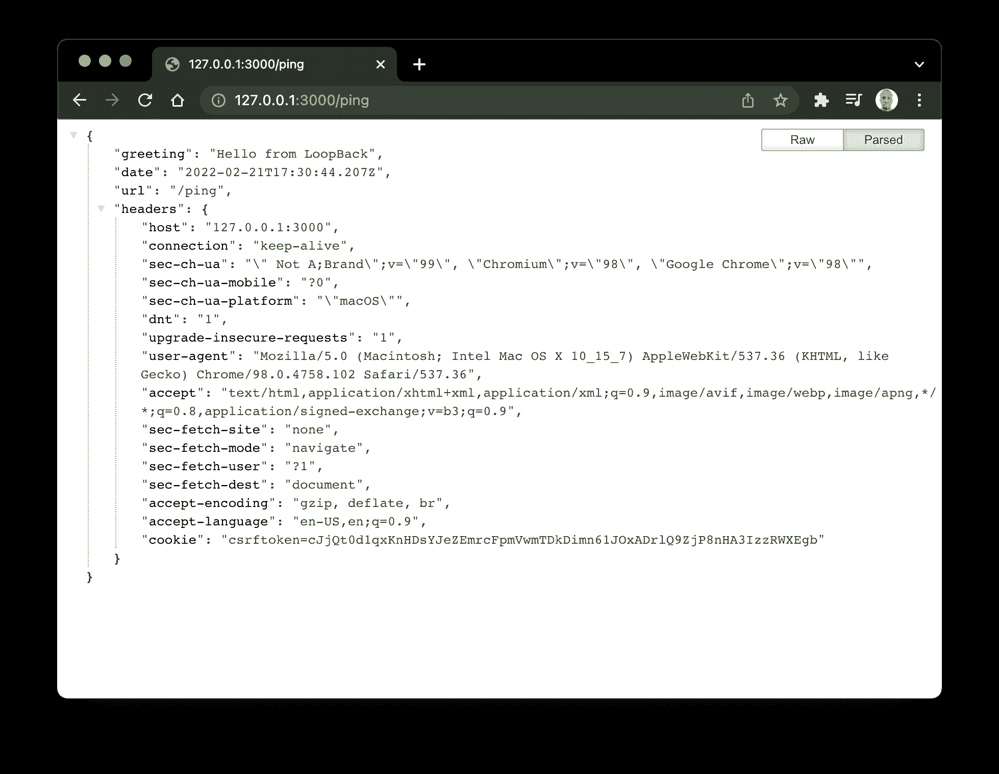
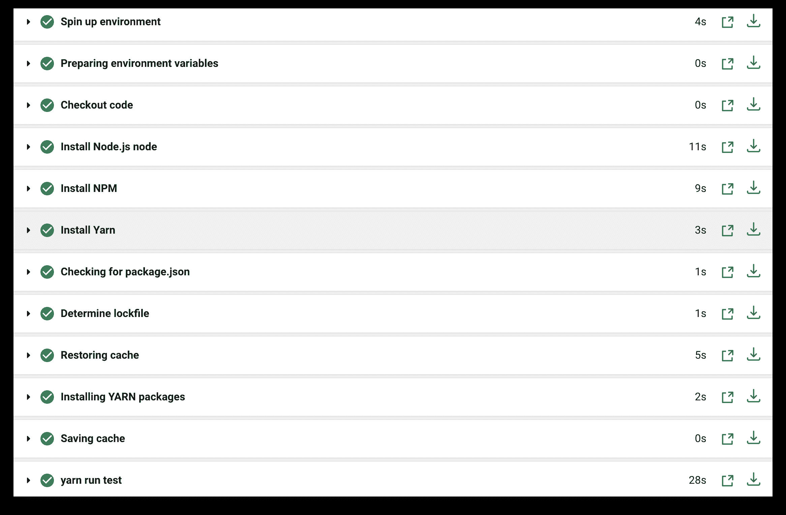

# 环回 API 的持续集成| CircleCI

> 原文：<https://circleci.com/blog/ci-for-loopback-apis/>

> 本教程涵盖:
> 
> 1.  环回入门
> 2.  创建问题模型和数据源
> 3.  环回 API 端点的自动化测试

远程工作人才的激增(以及远程首次就业的广泛接受)使得全球协作达到了前所未有的规模。

这并非没有风险——尤其是在软件行业。在同一个代码库上工作的多个开发人员面临着无意中引入破坏性变更和中断应用程序的风险。在相同代码基础上工作的团队必须确保遵循最佳实践，以便每个人总是在同一页面上。否则会导致意外停机和损失。[持续集成(CI)](https://circleci.com/continuous-integration/) 是高绩效开发团队采用的最佳实践之一。CI 是集成来自多个贡献者的变更以创建单个软件项目的可重复过程。

在本文中，我将使用 CircleCI 来展示如何将持续集成应用到一个[回送](https://loopback.io/)项目中。LoopBack 是一个高度可扩展的 Node.js 和 TypeScript 框架，用于构建 API 和微服务。

本教程是为环回应用建立 CI/CD 实践系列的第一篇。下一个教程将向您展示如何[自动化环回部署](https://circleci.com/blog/automate-deploy-loopback/)。

对于这个项目，我们将建立一个测验应用程序的 API。API 将有端点来处理这些操作:

1.  获取所有问题
2.  获取数据库中问题的总数
3.  获取具有指定 ID 的问题

为了增加效果，API 将*强烈地*拒绝删除问题的请求。

## 先决条件

1.  在安装 LoopBack 之前，请确保下载并安装[node . js](https://nodejs.org/en/download/)8.9 . x 或更高版本。一个 JavaScript 运行时。
2.  如果尚未安装 LoopBack 4 CLI，请安装它。

> 我们的教程是平台无关的，但是使用 CircleCI 作为例子。如果你没有 CircleCI 账号，请在 注册一个免费的 [**。**](https://circleci.com/signup/)

## 入门指南

LoopBack 4 CLI 是一个命令行界面，可以搭建项目或扩展。CLI 为遵循最佳实践的 LoopBack 4 项目提供了最快的入门方式。

```
npm install -g @loopback/cli 
```

使用以下命令创建一个新项目:

```
lb4 app 
```

```
? Project name: quiz_api
? Project description: A simple API for a quiz application
? Project root directory: quiz_api
? Application class name: QuizApplication
? Select features to enable in the project Enable eslint, Enable prettier, Enable mocha, Enable loopbackBuild, Enable vscode, Enable docker,
 Enable repositories, Enable services
? Yarn is available. Do you prefer to use it by default? Yes 
```

**注意** : *如果 LoopBack 崩溃，无法创建应用程序，请确保您使用的是 LTS 版本的 Node。Node 的一些较新版本存在兼容性问题。*

该项目附带了一个“ping”路由来测试项目。通过运行项目来尝试一下。导航到新创建的`quiz_api`目录，通过运行以下命令启动它:

```
cd quiz_api

yarn start 
```

在浏览器中，访问`http://127.0.0.1:3000/ping` 

## 配置 CircleCI

接下来，为 CircleCI 添加管道配置。在项目的根目录下，创建一个名为`.circleci`的文件夹，并在其中创建一个名为`config.yml`的文件。在新创建的文件中，添加以下配置:

```
version: "2.1"

orbs:
  node: circleci/node@4.7.0

jobs:
  build-and-test:
    docker:
      - image: "cimg/base:stable"
    steps:
      - checkout
      - node/install:
          node-version: 16.0.0
          install-yarn: true
      - node/install-packages:
          pkg-manager: yarn
          cache-path: ~/project/node_modules
          override-ci-command: yarn install
      - run: yarn run test

workflows:
  main:
    jobs:
      - build-and-test 
```

这个配置拉入 Node.js orb: `circleci/node`。除此之外，这允许您在默认情况下启用缓存的情况下安装包。

**注意** : *你应该安装了 16 的节点版本。在发布时，node 16 是与 LoopBack 兼容的最新版本。*

还指定了一个名为`build-and-test`的作业，它执行以下操作:

1.  签出最新代码
2.  安装节点
3.  安装在`package.json`中声明的软件包
4.  运行项目中的测试

最后，配置指定了运行`build-and-test`作业的工作流。

接下来，在 GitHub 上建立一个存储库，并将项目链接到 CircleCI。看到这个帖子帮助[把你的项目推到 GitHub](https://circleci.com/blog/pushing-a-project-to-github/) 。

登录您的 CircleCI 帐户。如果你注册了你的 GitHub 账户，你所有的库都会显示在你项目的仪表盘上。

在您的`quiz_api`项目旁边，点击**设置项目**。

CircleCI 将检测项目中的`config.yml`文件。点击**使用现有配置**，然后**开始建造**。您的第一个工作流将成功运行！



现在您已经有了一个管道，您可以添加 API 的问题特性了。

## 构建问题模型

对于本教程，问题将包含这些属性的字段:

*   困难
*   问题
*   回答正确

创建问题时，默认情况下会分配一个唯一的主键。

您可以使用`lb4 model`命令并回答提示来生成模型。按**键，输入属性名为空的**，生成模型。请遵循以下步骤:

```
lb4 model question 
```

```
? Please select the model base class Entity (A persisted model with an ID)
? Allow additional (free-form) properties? No
Model Question will be created in src/models/question.model.ts

Let's add a property to Question
Enter an empty property name when done

? Enter the property name: id
? Property type: number
? Is id the ID property? Yes
? Is id generated automatically? Yes

Let's add another property to Question
Enter an empty property name when done

? Enter the property name: difficulty
? Property type: string
? Is it required?: Yes

Let's add another property to Question
Enter an empty property name when done

? Enter the property name: question
? Property type: string
? Is it required?: Yes

Let's add another property to Question
Enter an empty property name when done

? Enter the property name: answer
? Property type: string
? Is it required?: Yes

Let's add another property to Question
Enter an empty property name when done

? Enter the property name: 
```

将在`src/models/question.model.ts`创建一个新模型。

## 构建数据源

接下来，创建一个数据源来保存 API 的问题。对于本教程，使用内存数据库。使用以下命令创建数据源:

```
lb4 datasource 
```

回应如下所示的提示:

```
? Datasource name: db
? Select the connector for db:  In-memory db (supported by StrongLoop)
? window.localStorage key to use for persistence (browser only):
? Full path to file for persistence (server only): ./data/db.json 
```

接下来，在项目的根目录下创建一个名为`data`的文件夹。在`data`目录中，创建一个名为`db.json`的文件，并将其添加到:

```
{
  "ids": {
    "Question": 9
  },
  "models": {
    "Question": {
      "1": "{\"difficulty\":\"medium\",\"question\":\"The HTML5 standard was published in 2014.\",\"answer\":\"True\",\"id\":1}",
      "2": "{\"difficulty\":\"medium\",\"question\":\"Which computer hardware device provides an interface for all other connected devices to communicate?\",\"answer\":\"Motherboard\",\"id\":2}",
      "3": "{\"difficulty\":\"medium\",\"question\":\"On which day did the World Wide Web go online?\",\"answer\":\"December 20, 1990\",\"id\":3}",
      "4": "{\"difficulty\":\"medium\",\"question\":\"Android versions are named in alphabetical order.\",\"answer\":\"True\",\"id\":4}",
      "5": "{\"difficulty\":\"medium\",\"question\":\"What was the first Android version specifically optimized for tablets?\",\"answer\":\"Honeycomb\",\"id\":5}",
      "6": "{\"difficulty\":\"medium\",\"question\":\"Which programming language shares its name with an island in Indonesia?\",\"answer\":\"Java\",\"id\":6}",
      "7": "{\"difficulty\":\"medium\",\"question\":\"What does RAID stand for?\",\"answer\":\"Redundant Array of Independent Disks\",\"id\":7}",
      "8": "{\"difficulty\":\"medium\",\"question\":\"Which of the following computer components can be built using only NAND gates?\",\"answer\":\"ALU\",\"id\":8}"
    }
  }
} 
```

JSON 文件的`ids`键让数据库知道分配新问题的下一个 ID。在`models`部分，我们提供了每个型号的数据。还指定了`Question`模型和数据库中的基本问题。

## 创建存储库

对于本教程，您将使用存储库在数据库和问题模型之间提供一个抽象层。使用以下命令创建新的存储库:

```
lb4 repository 
```

回应如下所示的提示:

```
? Please select the datasource DbDatasource
? Select the model(s) you want to generate a repository for Question
? Please select the repository base class DefaultCrudRepository (Juggler bridge) 
```

新创建的类(位于`src/repositories/question.repository.ts`)拥有为您的模型执行 CRUD 操作所需的连接。

## 创建控制器

使用以下命令创建新的控制器:

```
lb4 controller 
```

响应 CLI 提示，如下所示:

```
? Controller class name: question
Controller Question will be created in src/controllers/question.controller.ts

? What kind of controller would you like to generate? REST Controller with CRUD functions
? What is the name of the model to use with this CRUD repository? Question
? What is the name of your CRUD repository? QuestionRepository
? What is the name of ID property? id
? What is the type of your ID? number
? Is the id omitted when creating a new instance? Yes
? What is the base HTTP path name of the CRUD operations? /questions 
```

CLI 创建一个能够处理所有 CRUD 操作的控制器。但是，此时您只需要这些操作的一个子集。打开位于`src/controllers/question.controller.ts`的问题控制器，并对其进行编辑以匹配以下代码:

```
import {
  Count,
  CountSchema,
  Filter,
  FilterExcludingWhere,
  repository,
  Where,
} from '@loopback/repository';
import {
  del,
  get,
  getModelSchemaRef,
  HttpErrors,
  param,
  response,
} from '@loopback/rest';
import {Question} from '../models';
import {QuestionRepository} from '../repositories';

export class QuestionController {
  constructor(
    @repository(QuestionRepository)
    public questionRepository: QuestionRepository,
  ) {}

  @get('/questions/count')
  @response(200, {
    description: 'Question model count',
    content: {'application/json': {schema: CountSchema}},
  })
  async count(@param.where(Question) where?: Where<Question>): Promise<Count> {
    return this.questionRepository.count(where);
  }

  @get('/questions')
  @response(200, {
    description: 'Array of Question model instances',
    content: {
      'application/json': {
        schema: {
          type: 'array',
          items: getModelSchemaRef(Question, {includeRelations: true}),
        },
      },
    },
  })
  async find(
    @param.filter(Question) filter?: Filter<Question>,
  ): Promise<Question[]> {
    return this.questionRepository.find(filter);
  }

  @get('/questions/{id}')
  @response(200, {
    description: 'Question model instance',
    content: {
      'application/json': {
        schema: getModelSchemaRef(Question, {includeRelations: true}),
      },
    },
  })
  async findById(
    @param.path.number('id') id: number,
    @param.filter(Question, {exclude: 'where'})
    filter?: FilterExcludingWhere<Question>,
  ): Promise<Question> {
    return this.questionRepository.findById(id, filter);
  }

  @del('/questions/{id}')
  @response(403, {
    description: 'Question DELETE not permitted',
  })
  async deleteById(@param.path.number('id') id: number): Promise<void> {
    throw new HttpErrors.Forbidden('Question DELETE not permitted');
  }
} 
```

## 为端点添加测试

最后一步是添加验收测试套件，以确保您的问题控制器按预期工作。在`src/__**tests__**/acceptance`文件夹中，创建一个名为`question.controller.acceptance.ts`的新文件，并将以下代码添加到其中:

```
import { Client, expect } from "@loopback/testlab";
import { QuizApplication } from "../..";
import { setupApplication } from "./test-helper";

describe("QuestionController", () => {
  let app: QuizApplication;
  let client: Client;

  before("setupApplication", async () => {
    ({ app, client } = await setupApplication());
  });

  after(async () => {
    await app.stop();
  });

  it("successfully makes GET request to /questions", async () => {
    const res = await client.get("/questions").expect(200);
    expect(res.body).to.be.an.Array();
    expect(res.body).to.have.length(8);
  });

  it("successfully makes GET request to /questions/count", async () => {
    const res = await client.get("/questions/count").expect(200);
    expect(res.body).to.be.an.Object();
    expect(res.body.count).to.equal(8);
  });

  it("successfully makes GET request to /questions/{id}", async () => {
    const res = await client.get("/questions/2").expect(200);
    expect(res.body).containEql({ id: 2, difficulty: 'medium', answer: 'Motherboard', });
  });

  it("makes DELETE request to /questions which fails", async () => {
    await client.delete("/questions/5").expect(403);
  });
}); 
```

在运行测试之前，花一点时间做一些整理工作。使用以下命令 Lint 您的代码并修复任何问题:

```
yarn run lint:fix 
```

提交您的代码并在本地运行测试，以确保一切正常。使用此命令:

```
yarn test 
```

将最新的更改推送到您的 GitHub 库。这会触发 CircleCI `build-and-test`作业，该作业会像之前一样成功运行。干得好！

## 结论

在本文中，我们研究了如何使用 LoopBack 构建 API。我们还建立了一个 CircleCI 管道来管理项目的持续集成。

这种方法的好处是人为错误不会危及我们应用程序的安全性。通过自动化测试过程，您消除了人为错误对生产环境造成意外破坏的风险。它还为维护的软件增加了额外的质量控制和保证。尝试持续集成，让代码瓶颈成为团队的过去。

本教程的全部代码可以在 GitHub 上找到。

* * *

[Oluyemi](https://twitter.com/yemiwebby) 是一名拥有电信工程背景的技术爱好者。出于对解决用户日常遇到的问题的浓厚兴趣，他冒险进入编程领域，并从那时起将他解决问题的技能用于构建 web 和移动软件。Oluyemi 是一名热衷于分享知识的全栈软件工程师，他在世界各地的几个博客上发表了大量技术文章和博客文章。由于精通技术，他的爱好包括尝试新的编程语言和框架。

* * *

Oluyemi 是一名拥有电信工程背景的技术爱好者。出于对解决用户日常遇到的问题的浓厚兴趣，他冒险进入编程领域，并从那时起将他的问题解决技能用于构建 web 和移动软件。Oluyemi 是一名热衷于分享知识的全栈软件工程师，他在世界各地的几个博客上发表了大量技术文章和博客文章。作为技术专家，他的爱好包括尝试新的编程语言和框架。

[阅读更多 Olususi Oluyemi 的帖子](/blog/author/olususi-oluyemi/)