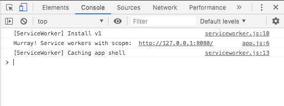

# 渐进式网络应用的持续集成| CircleCI

> 原文：<https://circleci.com/blog/ci-for-pwas/>

> 本教程涵盖:
> 
> 1.  设置示例渐进式 web 应用程序
> 2.  为示例应用程序创建测试
> 3.  构建持续集成管道

Web 和浏览器技术不断进步，缩小了 web 和本地应用程序之间的性能差距。曾经只属于本机应用程序的功能可以在 web 应用程序中实现。这部分是由于[渐进式网络应用(pwa)](https://web.dev/progressive-web-apps/)的出现。现在可以安装 Web 应用程序，接收推送通知，甚至脱机工作。在本文中，我们将构建一个简单的 PWA，为它编写测试，并通过构建一个[持续集成](https://circleci.com/continuous-integration/) (CI)管道来自动化测试过程。

## 先决条件

要跟进这篇文章，需要做一些事情:

1.  JavaScript 的基础知识
2.  系统上安装的 [Node.js](https://nodejs.org)
3.  [全球安装在您系统上的 HTTP 服务器模块](https://www.npmjs.com/package/http-server)(`npm install -g http-server`)
4.  一个[圆](https://circleci.com/signup/)的账户

> 我们的教程是平台无关的，但是使用 CircleCI 作为例子。如果你没有 CircleCI 账号，请在 注册一个免费的 [**。**](https://circleci.com/signup/)

## 设置演示应用程序

首先，通过运行以下命令创建一个应用程序文件夹:

```
mkdir my-pwa 
```

接下来，在应用程序的根目录中，创建一个名为`index.html`的文件。该文件将成为应用程序的主页。将此代码粘贴到文件中:

```
<!DOCTYPE html>
<html lang="en">
  <head>
    <meta charset="UTF-8" />
    <meta name="viewport" content="width=device-width, initial-scale=1.0" />
    <link rel="manifest" href="manifest.json" />
    <link rel="stylesheet" type="text/css" href="styles.css" media="all" />

    <title>My PWA Application</title>
  </head>
  <body>

    <h2>
      Welcome to my Progressive Web Application.
    </h2>

    <script src="app.js"></script>
  </body>
</html> 
```

该代码块显示了一个典型的 HTML 页面，标题为“我的 PWA 应用程序”和一条欢迎消息。这个文件还引用了一个`manifest.json`文件(为安装配置我们的 PWA)，一个用于一些基本样式的`styles.css`文件，以及一个将在我们的服务人员中加载的`app.js`文件。所有这些文件都将在本教程中创建。

要获得预览，请在应用程序的根目录下运行以下命令:

```
http-server 
```

这将调用`http-server`模块来启动一个专门的服务器为应用程序提供服务。运行该命令后，该地址将显示在控制台上。然后，您可以转到该应用程序的 URL。


**注意** : *我在谷歌 Chrome 浏览器上以匿名模式运行，开发者工具打开，移动视图激活。我更喜欢在开发过程中以匿名模式运行 PWAs，因为这样可以确保我的服务人员得到更新。*

接下来，通过在应用程序的根文件夹中创建一个`styles.css`文件来添加样式。将此粘贴到文件中:

```
/* ./styles.css */

h2 {
  color: blue;
  padding: 5px;
} 
```

这个文件只是给了`h2`头一些填充，并把它涂成蓝色。

## 添加服务人员

服务人员创建了一个为 PWA 功能提供动力的发动机室。我们将通过在应用程序的根文件夹中创建一个名为`serviceworker.js`的新文件来为这个项目添加一个服务人员。将以下代码粘贴到其中:

```
// ./serviceworker.js

var cacheName = "sw-v1";
var filesToCache = ["./", "./index.html", "./styles.css"];

self.addEventListener("install", function (e) {
  console.log("[ServiceWorker] Install v1");
  e.waitUntil(
    caches.open(cacheName).then(function (cache) {
      console.log("[ServiceWorker] Caching app shell");
      return cache.addAll(filesToCache);
    })
  );
});

self.addEventListener("activate", (event) => {
  event.waitUntil(self.clients.claim());
});

self.addEventListener("fetch", function (event) {
  event.respondWith(
    caches.match(event.request).then(function (response) {
      if (response) {
        return response;
      }
      return fetch(event.request);
    })
  );
}); 
```

如果您以前从事过 PWA 项目，那么这段代码会很熟悉。它首先为缓存设置一个名称，当文件更新时，它会设置您的服务工作器的版本。当浏览器安装更新的服务工作者文件时，您可以很容易地识别当前运行的版本。我用了名字`sw-v1`来标识它是我的第一个版本。这是您缓存应用程序根文件(`index.html`和`styles.css`)的地方。

接下来，创建一个要缓存的文件数组。这些文件将缓存在浏览器的内存中，供用户在脱机时访问。

接下来，`install`事件使用缓存名称创建一个存储文件的缓存。

下一个事件`activate`是在安装了新版本的服务工作程序后检测到它时触发的。此事件指定旧的服务工作线程停止为缓存文件提供服务。

最后一个事件`fetch`，拦截应用程序的请求，并检查所请求资源的新缓存版本。如果有新的资源可用，则提供缓存的资源。如果没有找到新的版本，则对资源进行新的请求。

然后，您需要将刚刚创建的服务工作者加载到您的应用程序中。在应用程序的根文件夹中创建一个`app.js`文件，并粘贴以下代码:

```
// ./app.js

if ("serviceWorker" in navigator) {
  window.addEventListener("load", function () {
    navigator.serviceWorker.register("./serviceworker.js").then(
      function (registration) {
        console.log("Hurray! Service workers with scope: ", registration.scope);
      },
      function (err) {
        console.log("Oops! ServiceWorker registration failed: ", err);
      }
    );
  });
} 
```

是时候带你的服务人员去试运行了。确保你的应用程序仍在运行，然后在它所在的浏览器标签上进行硬重新加载:`Ctrl + Shift + R`。检查浏览器控制台中您记录的日志消息，以确认服务人员的安装。



太好了！

您的服务人员已安装，文件已缓存以供脱机访问。要确认缓存，请转到 Chrome 开发者工具中的应用程序选项卡，并展开**缓存存储**部分。您将看到我们的服务人员刚刚创建的命名缓存。


为了确认您的服务人员已经提供了离线功能，请使用`Ctrl + C`关闭`http-server`服务。然后在浏览器中刷新应用程序。以前，脱机页面会在此时显示，因为应用程序不再运行。然而，有了服务人员的魔力，您的应用程序主页仍然是可用的，没有中断。

## 添加清单文件

要完成 PWA 的创建，您需要创建一个清单文件。该文件激活应用程序的**添加到主屏幕**功能。这定义了您的应用程序如何安装在使用它的设备上。

在项目的根目录下创建一个`manifest.json`文件。把这个粘贴进去:

```
{
  "name": "My PWA",
  "short_name": "My PWA",
  "background_color": "#ffffff",
  "display": "standalone",
  "orientation": "portrait",
  "scope": "/index.html",
  "start_url": "/index.html",
  "icons": [
    {
      "src": "icons/icon-128x128.png",
      "sizes": "128x128",
      "type": "image/png"
    },
    {
      "src": "icons/icon-144x144.png",
      "sizes": "144x144",
      "type": "image/png"
    },
    {
      "src": "icons/icon-152x152.png",
      "sizes": "152x152",
      "type": "image/png"
    },
    {
      "src": "icons/icon-192x192.png",
      "sizes": "192x192",
      "type": "image/png"
    },
    {
      "src": "icons/icon-512x512.png",
      "sizes": "512x512",
      "type": "image/png"
    }
  ]
} 
```

这个代码块定义了应用程序的`name`，首选的`orientation`，以及闪屏的`background_color`。添加`short_name`是一个最佳实践。此可选字段指定将在应用程序启动器或新选项卡页面中显示的名称。否则，将使用`name`，如果超过 12 个字符，它将被截断。

**注意** : *你可以在这里生成一个清单文件[。您还可以使用该站点为您的应用程序生成图标。](https://app-manifest.firebaseapp.com/)*

这是一个非常简单、精简的应用程序，所以我忽略了像`theme_color`、`splash_pages`、一些标准图标大小和 iOS 图标支持等功能。

应用主页设置在`/index.html`，不同设备的安装图标大小在`icons`属性中定义。我还把包含我所有图标的`icons`目录移到了项目的根目录下。这是您的应用程序发挥 PWA 功能所需的一切。

为了证实这一点，运行一个[灯塔](https://developers.google.com/web/tools/lighthouse)测试。进入 Chrome 开发者工具中的 Lighthouse 选项卡运行测试。


点击**生成报告**然后**分析页面负载**以获得您的 PWA 的审计报告。


单击最右侧的 PWA 图标，转到 PWA 兼容性测试的结果。

**注意** : *失败检查`Does not redirect HTTP traffic to HTTPS`将在您部署站点并启用 HTTPS 时通过。*

如果您想了解更多关于获得干净版本的信息，请查看以下链接:

## 添加测试

要开始向您的应用程序添加测试，为您将要安装的 [npm](https://www.npmjs.com/) 包创建一个`package.json`文件。要在项目根目录下创建一个基本文件并跳过 QA 过程，请运行以下命令:

```
npm init -y 
```

要在应用程序中设置测试，请安装以下软件包:

使用以下命令一次性安装这些软件包:

```
npm install --save-dev @testing-library/dom @testing-library/jest-dom jsdom jest 
```

安装好这些文件后，在根文件夹中创建一个名为`index.test.js`的测试文件。将以下代码粘贴到其中:

```
// ./index.test.js

const { getByText } = require("@testing-library/dom");
require("@testing-library/jest-dom/extend-expect");
const { JSDOM } = require("jsdom");
const fs = require("fs");
const path = require("path");

const html = fs.readFileSync(path.resolve(__dirname, "./index.html"), "utf8");

let dom;
let container;

describe("Test for elements on Home page", () => {
  beforeEach(() => {
    dom = new JSDOM(html, { runScripts: "dangerously" });
    container = dom.window.document.body;
  });

  it("Page renders a heading element", () => {
    expect(container.querySelector("h2")).not.toBeNull();
    expect(getByText(container, "Welcome to my Progressive Web Application.")
    ).toBeInTheDocument();
  });
}); 
```

这个代码块从获取所有必需的依赖项并加载 HTML 文件开始。`describe`块中的`beforeEach`方法用`JSDOM`创建 DOM。

在`it`块中运行一个测试，检查标题元素文本的出现:`Welcome to my progressive web application.`

现在，在`package.json`文件中设置您的`test`脚本。编辑现有的`test`键值对，如下所示:

```
...
"scripts": {
    "test": "jest"
},
... 
```

现在使用以下命令运行测试文件:

```
npm run test 
```

你的测试都会通过的。现在，您已经准备好开始构建您的 CI 渠道。


## 为 PWA 持续集成构建管道

为应用程序创建 CI 管道的步骤:

*   向应用程序添加管道配置脚本。
*   将项目推送到远程存储库:您可以使用 [GitHub](https://github.com/) 。
*   将存储库作为项目添加到 CircleCI 上。
*   使用项目中的配置文件运行管道。

在项目的根目录下，创建一个名为`.circleci`的文件夹。添加一个名为`config.yml`的文件。在`config.yml`文件中，输入以下代码:

```
version: 2.1
jobs:
  build:
    working_directory: ~/repo
    docker:
      - image: cimg/node:17.4.0
    steps:
      - checkout
      - run:
          name: Update NPM
          command: "sudo npm install -g npm"
      - restore_cache:
          key: dependency-cache-{{ checksum "package-lock.json" }}
      - run:
          name: Install Dependencies
          command: npm install
      - save_cache:
          key: dependency-cache-{{ checksum "package-lock.json" }}
          paths:
            - ./node_modules
      - run:
          name: Run tests
          command: npm run test 
```

这段代码块从存储库中签出应用程序，并为 Node.js 环境更新`npm`版本。然后它安装依赖项并缓存`node_modules`文件夹。最后一步是运行测试。

将您的项目[变更推送到 GitHub 库](https://circleci.com/blog/pushing-a-project-to-github/)。确保在`node_modules`文件夹中添加一个`.gitignore`文件。

现在，将应用程序的存储库设置为 CircleCI 项目。在 CircleCI 仪表盘上，找到您的项目并点击**设置项目**。


系统将提示您编写新的配置文件或使用现有的配置文件。选择现有的分支，并输入 GitHub 上存储您的代码的分支的名称。点击**设置项目**。


这将触发 CI 管道运行构建过程。您可以在 CircleCI 帐户的 Pipelines 页面查看该流程。您现在应该有一个成功的构建。


恭喜你！所有步骤都完美运行，您的测试成功通过。现在您已经为您的持续集成实践做好了一切准备。您所需要做的就是将您的代码更改推送到您的存储库，CI 管道将自动构建并测试您的应用程序。

## 结论

在本文中，您成功地构建了一个 PWA，并为测试自动化建立了一个 CI 管道。

编码快乐！

* * *

Fikayo Adepoju 是 LinkedIn Learning(Lynda.com)的作者、全栈开发人员、技术作者和技术内容创建者，精通 Web 和移动技术以及 DevOps，拥有 10 多年开发可扩展分布式应用程序的经验。他为 CircleCI、Twilio、Auth0 和 New Stack 博客撰写了 40 多篇文章，并且在他的个人媒体页面上，他喜欢与尽可能多的从中受益的开发人员分享他的知识。你也可以在 Udemy 上查看他的视频课程。

[阅读 Fikayo Adepoju 的更多帖子](/blog/author/fikayo-adepoju/)