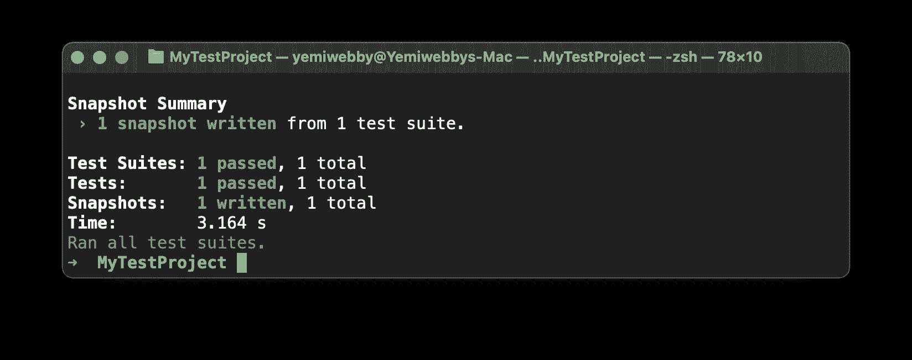

# React 本机应用的持续集成| CircleCI

> 原文：<https://circleci.com/blog/ci-for-react-apps/>

> 本教程涵盖:
> 
> 1.  创建和设置 React 本机应用程序
> 2.  为您的应用程序编写测试
> 3.  构建持续集成管道来运行测试

自从 2009 年发布以来， [Apache Cordova](https://cordova.apache.org/) 已经为[移动应用程序开发](https://circleci.com/mobile-continuous-integration/)创造了一个范式转变。在 Cordova 之前，只有那些了解特定类型移动操作系统的平台专用语言的开发者才能开发[本地移动应用](https://circleci.com/blog/native-vs-cross-platform-mobile-dev/)。有用于开发 iOS 应用程序的 Objective-C，或用于 Android 应用程序和平台(如黑莓)的 Java。Windows Phone 也有专门用于构建移动应用的语言。Apache Cordova(简称 Cordova)打破了平台语言的垄断。Cordova 使任何具有 HTML、CSS 和 Javascript 知识的开发人员能够用单一代码库构建移动应用程序，并为任何可用的移动平台编译它们。

由于 Cordova 应用程序中的 Webview 渲染引擎，一些开发人员认为这些应用程序不是真正的“原生”。[反应本土](https://reactnative.dev/)解决了争论。React 允许开发人员通过提供直接映射到平台原生 UI 构建块的 JavaScript 组件来创建真正的原生应用。

## 先决条件

要遵循本教程，需要做一些事情:

1.  Javascript 的基础知识
2.  您系统上安装的 [Node.js](https://nodejs.org) (版本> = 10.13)
3.  一个[圆](https://circleci.com/signup/)的账户
4.  GitHub 的一个账户
5.  为 React(iOS 的本地开发)设置的环境

> 我们的教程是平台无关的，但是使用 CircleCI 作为例子。如果你没有 CircleCI 账号，请在 注册一个免费的 [**。**](https://circleci.com/signup/)

注意:*React 环境是有条件可选的。没有它，您将无法在模拟器中运行示例应用程序。您仍然能够运行教程中描述的测试。*

安装并设置好所有这些之后，是时候开始本教程了。

## 创建一个示例 React 本地应用程序

首先，创建一个新的 React 本机应用程序。选择应用程序的位置，然后运行:

```
npx react-native init MyTestProject 
```

如果出现提示，按**键输入**继续。这个命令使用`npx`来调用`react-native init`命令，在`MyTestProject`文件夹中搭建新的应用程序项目。

要在模拟器上启动项目，请在新创建的项目中从终端运行以下命令:

```
npx react-native run-ios --simulator="iPhone 13" 
```

前面的命令将构建项目并在一个`iPhone 13`模拟器上运行，如下所示:


您让应用程序在它自己的终端窗口中运行。一旦您使用 [Metro](https://facebook.github.io/metro/docs/concepts/) 对代码进行更改，它将自动刷新。Metro 是一个 Javascript bundler，可以在文件发生变化时随时在模拟器中重新加载应用程序。

在本教程中，您将创建一个简单的 React 本地应用程序，该应用程序为用户提供一个单击按钮并显示一条消息。然后，您将编写一个测试套件来测试这种行为。

转到`App.js`文件(在根文件夹中),将其中的代码替换为:

```
import React from "react";
import {
  SafeAreaView,
  StatusBar,
  StyleSheet,
  Text,
  useColorScheme,
  Button,
  TextInput,
  View,
} from "react-native";

import { Colors } from "react-native/Libraries/NewAppScreen";

const App = () => {
  const [message, setMessage] = React.useState();

  const isDarkMode = useColorScheme() === "dark";
  const backgroundStyle = {
    backgroundColor: isDarkMode ? Colors.darker : Colors.lighter,
  };

  return (
    <SafeAreaView style={backgroundStyle}>
      <StatusBar
        barStyle={isDarkMode ? "light-content" : "dark-content"}
        backgroundColor={backgroundStyle.backgroundColor}
      />

      <Button
        title="Say Hello"
        onPress={() => {
          setTimeout(() => {
            setMessage("Hello Tester");
          }, Math.floor(Math.random() * 200));
        }}
      />
      {message && (
        <Text style={styles.messageText} testID="printed-message">
          {message}
        </Text>
      )}
    </SafeAreaView>
  );
};

const styles = StyleSheet.create({
  messageText: {
    fontFamily: "Arial",
    fontSize: 38,
    textAlign: "center",
    marginTop: 10,
  },
});

export default App; 
```

这段代码创建了我之前描述过的(非常简单的)UI:一个标记为`Say Hello`的按钮在被点击时显示消息`Hello Tester`。为了模拟异步操作，我们使用`setTimeout`在点击按钮后延迟几分之一秒的显示。React Native `Text`组件在按钮的底部显示消息。该代码通过使用`Stylesheet`组件为消息添加样式。


在模拟器出现的屏幕上，点击`Say Hello`按钮。


## 设置和添加测试

用 CLI 工具搭建一个新的 React 本机应用程序的一个很大的优势是，在 seed 项目中已经配置了一个基本的测试设置。测试设置使用 [Jest](https://jestjs.io/) ，并包含一个`__tests__`文件夹来存储测试套件。不过，对于本教程，我们需要使用 [React 本地测试库](https://testing-library.com/docs/react-native-testing-library/intro/)。

将 React 本机测试库作为开发依赖项安装:

```
npm i -D @testing-library/react-native@11.0.0 
```

安装完库之后，用下面的代码片段替换测试套件`__tests__/App-test.js`文件中的代码:

```
import "react-native";
import React from "react";
import App from "../App";

import { fireEvent, render, waitFor } from "@testing-library/react-native";

it("Renders Message", async () => {
  const { getByTestId, getByText, queryByTestId, toJSON } = render(<App />);

  const button = getByText("Say Hello");
  fireEvent.press(button);

  await waitFor(() => expect(queryByTestId("printed-message")).toBeTruthy());

  expect(getByTestId("printed-message").props.children).toBe("Hello Tester");
  expect(toJSON()).toMatchSnapshot();
}); 
```

这段代码包含一个对应用程序的消息显示行为的测试。React 本地测试库用于呈现包含应用逻辑的应用根组件`App`。然后引用这个按钮，并使用测试库中的`fireEvent`对象的`press`方法触发点击事件。

因为我们将异步行为添加到了对按钮点击的响应中，所以在测试其内容之前，我们需要等待测试 id 为`printed-message`的`Text`组件显示出来。

一旦加载完毕，`Text`组件将针对字符串`Hello Tester`进行测试。

要运行测试套件，请转到项目的根目录并运行:

```
npm run test 
```

此命令会在您的 CLI 中显示一个屏幕，指示测试已通过。



## 编写 CI 管道

持续集成管道确保每当更新被推送到 GitHub 存储库时测试都会运行。第一步是在项目的根目录下创建一个名为`.circleci`的文件夹。添加一个名为`config.yml`的配置文件。在该文件中，输入:

```
version: 2.1
jobs:
  build:
    working_directory: ~/repo
    docker:
      - image: cimg/node:18.10.0
    steps:
      - checkout
      - restore_cache:
          key: dependency-cache-{{ checksum "yarn.lock" }}
      - run:
          name: Install Dependencies
          command: npm install
      - run:
          name: Run tests
          command: npm run test 
```

在这个管道配置中，Docker 映像首先用所需的 Node.js 版本导入。然后，`npm`被更新，依赖项被安装，缓存它们以便后续的构建更快。

最后，`npm run test`命令运行项目中包含的所有测试。

保存这个文件，[将你的项目推送到 GitHub](https://circleci.com/blog/pushing-a-project-to-github/) 。确保您使用的 GitHub 帐户是与您的 CircleCI 帐户连接的帐户。

现在，进入 [CircleCI 仪表板](https://app.circleci.com/projects)上的**项目**页面。从项目列表中，搜索本教程创建的项目，点击**设置项目**


从模态输入配置文件所在的名称分支，点击**设置项目**

这将触发管道并成功运行。

太棒了。

## 结论

适当的测试对移动应用来说可能比网络应用更重要。每次你修复一个 bug，都要求用户安装更新，这很容易惹恼他们。通过应用您在这里学到的知识来彻底测试您的 React 本机应用程序，让用户满意。更重要的是，自动化您的测试过程，并确保那些错误不会在第一时间被推到您的产品代码中。

本教程的完整源代码可以在 GitHub 上找到[。](https://github.com/CIRCLECI-GWP/RN-MyTestProject)

编码快乐！

* * *

Fikayo Adepoju 是 LinkedIn Learning(Lynda.com)的作者、全栈开发人员、技术作者和技术内容创建者，精通 Web 和移动技术以及 DevOps，拥有 10 多年开发可扩展分布式应用程序的经验。他为 CircleCI、Twilio、Auth0 和 New Stack 博客撰写了 40 多篇文章，并且在他的个人媒体页面上，他喜欢与尽可能多的从中受益的开发人员分享他的知识。你也可以在 Udemy 上查看他的视频课程。

[阅读 Fikayo Adepoju 的更多帖子](/blog/author/fikayo-adepoju/)