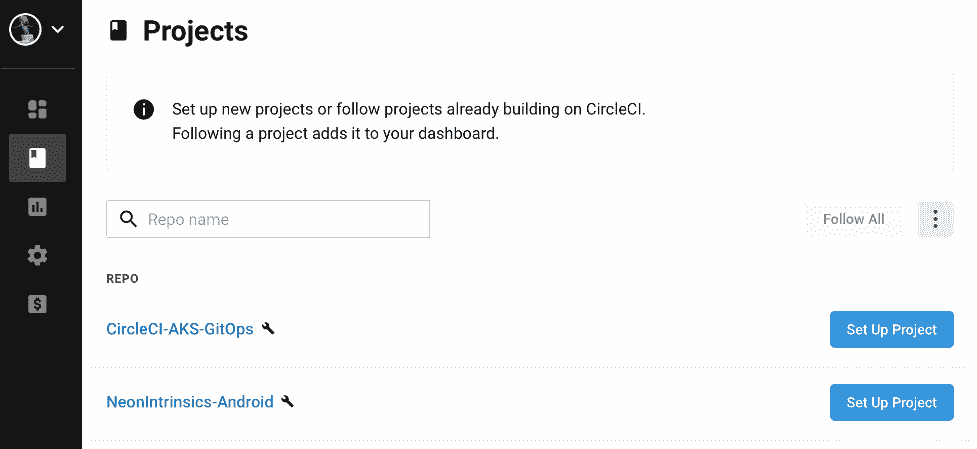
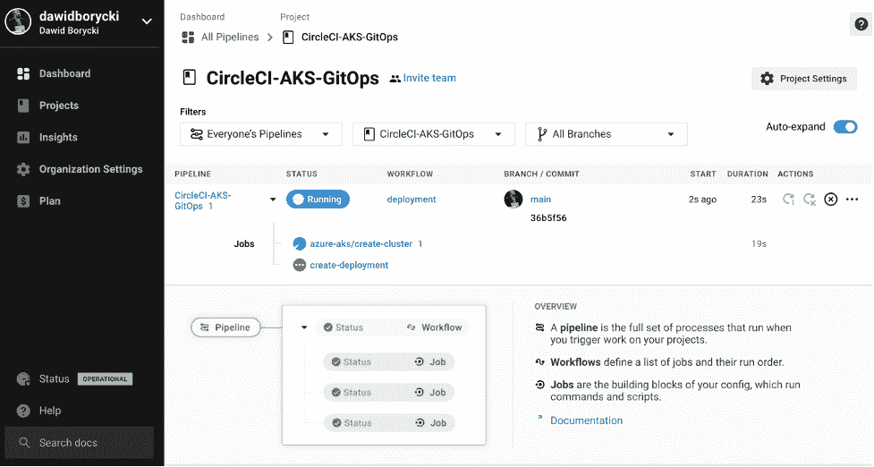
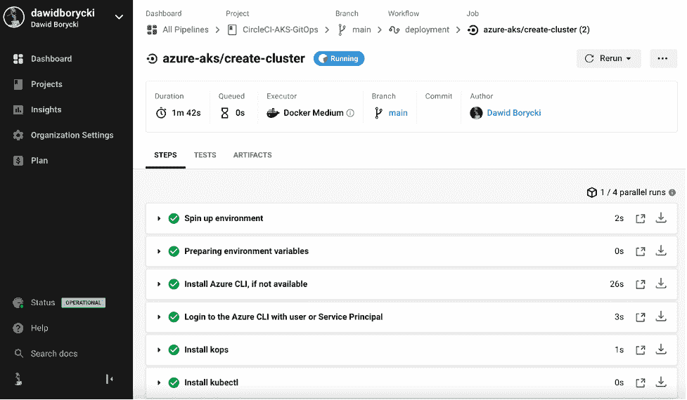
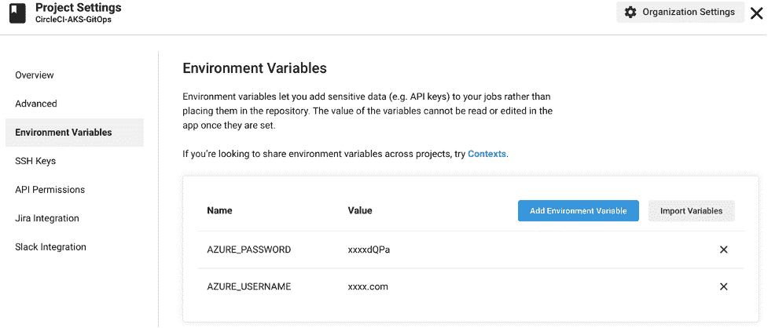
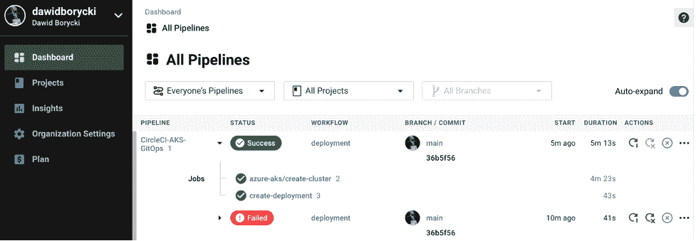
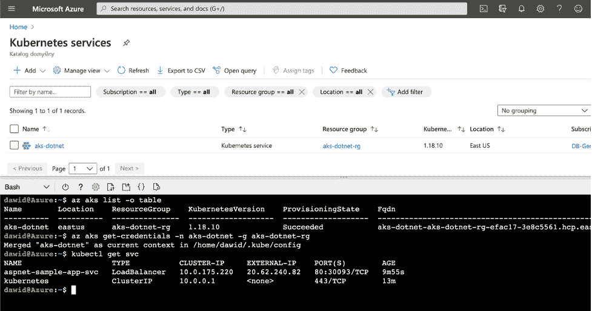

# 与 GitOps | CircleCI 的持续集成

> 原文：<https://circleci.com/blog/ci-with-gitops/>

软件开发日新月异。一方面，您必须快速适应不断发展的需求，而另一方面，您的应用程序需要连续运行而不停机。

DevOps 帮助你快速适应变化。在其他计划中，[持续集成](https://circleci.com/continuous-integration/) (CI)和[持续交付](https://martinfowler.com/bliki/ContinuousDelivery.html) (CD)对于任何 DevOps 实践都是不可或缺的。

使用 CI，开发人员可以通过自动化构建和测试将他们的代码与其他人的代码合并。开发人员将他们的代码提交给源代码控制系统，通常是 Git。代码提交触发了自动化构建操作，随后是单元测试。新代码然后合并到主分支中。在增量代码更改后，您可以在构建和测试时快速修复任何问题。这也有助于解决任何问题，包括合并冲突和棘手的 bug，因为您是在小步骤中集成代码库的。

如果测试套件已经通过，连续交付可以让您在构建之后立即部署应用程序。**您可以适应快速变化的需求，并确保应用程序在最短的停机时间内运行。**

虽然 DevOps 在开发和部署软件方面非常有用，但是结合使用 Git 和 CI/CD 在软件工程领域之外也非常有用。将这些原则应用于非软件工作的想法被称为 GitOps。

GitOps 最常见的用途之一是使用基础设施即代码(IaC)工具供应云基础设施。

## 将 GitOps 与 IaC 一起使用

如上所述，DevOps 工作流旨在构建和部署软件。但是在 DevOps 可以工作之前，我们需要一个部署软件的地方。**应用需要包含计算、存储和网络服务的环境。**在开发生命周期中，您会使用许多环境，例如开发、试运行和生产。传统上，每个环境都有其配置，通常会随着时间的推移而变化，从而导致所谓的环境漂移。此后，配置无法自动复制，导致难以跟踪的错误，并需要手动维护。

要解决这个问题，您可以使用基础结构作为代码(IaC)。通过 IaC，您可以使用 Terraform、CloudFormation 和 Azure Resource Manager 模板等工具创建您想要的基础设施的声明，然后将该声明保存在 Git 存储库中。通过这样做，您可以遵循开发人员对其代码使用的相同方法。更改基础结构声明后，您将更新的文件提交到存储库中。这将触发 CI/CD 管道来验证配置，然后运行自动化工具来配置或停用基础架构资源。

然后，您可以将 Git 工作流用于基础设施部署。例如，您可以创建一个新的 Git 分支，在那里您可以使用环境声明文件。完成后，您将创建一个拉取请求。然后，您的更改将被审核，审核通过后，分支将被合并到主分支中。如果 CI/CD 系统正在监视存储库，合并将触发自动化的基础架构部署。

您甚至可以扩展 GitOps IaC 方法来管理 Kubernetes 用于配置的 JSON 或 YAML 文件。通过修改和部署这些文件，您可以自动执行集群中容器的滚动更新，本质上是使用 GitOps 来部署应用程序。在这种情况下，您只需要更改配置文件并将其推送到 Git 存储库。然后，CI/CD 系统会自动将更改部署到集群中。更具体地说，CI/CD 系统使用适当的命令行界面(CLI ),如 kubectl，来应用您提交的更改。

在实践中，您设置了一个包含各种作业的构建和部署管道。每个作业由一个或多个步骤组成。第一个作业可以提供资源。例如，它可以自动为您创建或更新 Kubernetes 集群。同样，该作业使用 CLI 脚本来调配资源。假设环境已经准备好，第二个作业可以检查源代码，构建源代码，并将应用程序部署到环境中。

## 使用 GitOps 的持续集成——一个例子

下面是使用 CircleCI 设置管道的步骤。我们将创建包含两个作业的管道。第一项工作将在 Azure 中部署托管的 Kubernetes 集群。第二项工作是将容器化的 ASP.NET 5 应用程序部署到该集群。

## 添加存储库

我们首先创建 GitHub 存储库， [CircleCI-AKS-GitOps](https://github.com/dawidborycki/CircleCI-AKS-GitOps) 。为了简单起见，我们只有一个主分支，在 k8s 文件夹下有 all-in-one.yml 文件(见下图)。该文件包含部署和服务声明。部署将使用 Docker 映像和示例【ASP.NET 5】应用创建两个 pod。这两个 pod 都将使用负载平衡器服务向公众公开。我们将在部署后获得该服务的公共 IP。

```
apiVersion: apps/v1
kind: Deployment
metadata:
  name: aspnet-sample-app
spec:
  selector:
      matchLabels:
        app: aspnet-sample-app
  replicas: 2
  template:
      metadata:
        labels:
            app: aspnet-sample-app
      spec:
        containers:
        - name: aspnet-sample-app-pod
          image: mcr.microsoft.com/dotnet/samples:aspnetapp 
          ports:
          - containerPort: 80
---
apiVersion: v1
kind: Service
metadata:
  name: aspnet-sample-app-svc  
spec:
  selector:
    app: aspnet-sample-app
  type: LoadBalancer
  pxorts:
  - port: 80 
```

## 创建管道

要将这个存储库与 CI/CD 系统连接起来，您需要管道配置。这是一个包含作业和步骤声明的 YAML 文件。使用 CircleCI 时，可以在 config.yml 文件的。circleci 文件夹。

这里，我们使用 orb 为 Azure Kubernetes 服务和 Kubernetes 创建 config.yml:

```
jobs:
  create-deployment:
    executor: azure-aks/default
    parameters:
      cluster-name:
        description: |
          Name of the AKS cluster
        type: string
      resource-group: 
        description: |
          Resource group that the cluster is in
        type: string
    steps:
      - checkout
      - azure-aks/update-kubeconfig-with-credentials:
          cluster-name: << parameters.cluster-name >>
          install-kubectl: true
          perform-login: true
          resource-group: << parameters.resource-group >>
      - kubernetes/create-or-update-resource:
          resource-file-path: k8s/all-in-one.yml
          resource-name: deployment/dotnet-deployment
orbs:
  azure-aks: circleci/azure-aks@0.2.1
  kubernetes: circleci/kubernetes@0.4.0
version: 2.1
workflows:
  deployment:
    jobs:
      - azure-aks/create-cluster:
          cluster-name: aks-dotnet
          create-resource-group: true
          generate-ssh-keys: true
          location: eastus
          resource-group: aks-dotnet-rg         
      - create-deployment:
          cluster-name: aks-dotnet
          requires:
            - azure-aks/create-cluster
          resource-group: aks-dotnet-rg 
```

有两种工作:

*   azure-aks/create-cluster–使用 AKS 创建 Kubernetes 集群
*   创建-部署–将 all-in-one.yml Kubernetes 配置应用于 AKS 集群

作业具有附加参数，使您能够应用其他配置。在这里，我们使用它们来设置集群名称(aks-dotnet)、区域(eastus)和 Azure 资源组(aks-dotnet-rg)。

## CircleCI 的建筑

一旦我们配置了管道，我们就可以在 CircleCI 中查看项目。如果使用 GitHub 或 Bitbucket，可以使用现有账户在 CircleCI 注册。该服务将自动发现您的存储库。



然后，使用“设置项目”按钮创建新的配置文件或选择现有的管道配置。对于这个例子，我们使用 config.yml。之后，CircleCI 将开始构建项目。





要成功连接到 Azure，您必须使用项目环境变量提供用户凭据或服务主体。我们的用户凭据存储在我们在项目设置中键入的 AZURE_USERNAME 和 AZURE_PASSWORD 下。



设置完这些变量后，CircleCI 将为您创建 AKS 集群，然后部署应用程序。请注意，第一个管道由于缺少凭据而失败。



## 测试资源

我们现在可以测试部署了。为此，我们登录 Azure 门户，打开 Azure CloudShell，然后调用以下命令:

```
az aks list -o table 
```

这个命令将显示所有 AKS 集群的列表，包括我们通过 CircleCI 部署的那个(aks-dotnet)。现在，我们需要登录到该集群，并读取负载平衡器服务的公共 IP。为此，调用以下命令:

```
az aks get-credentials -n aks-dotnet -g aks-dotnet-rg
kubectl get svc 
```

我们的应用程序的 IP 出现在外部 IP 列中。使用此地址查看正在运行的应用。



### 清理资源

要清理资源，请键入:

```
az group delete -n aks-dotnet-rg --no-wait --yes 
```

这将删除 AKS 集群而无需确认。或者，您可以用另一个自动删除集群的作业来补充管道。

## 总结和后续步骤

我们刚刚学习了如何使用 CircleCI 和 GitHub 存储库将容器化的应用程序部署到托管的 Kubernetes 集群。在实践中，您将使用另一个 Git 分支来补充上述工作流，并创建 pull 请求，以便其他人可以查看您所做的更改。

如果您已经在使用 CI/CD 系统，有很好的[迁移文档]https://circleci . com/docs/migration-intro/# section = getting-started 帮助您将项目迁移到 circle CI。

在这些知识的推动下，您现在可以开始使用 CirlceCI 构建您的 GitOps 工作流，轻松管理应用程序并腾出时间专注于新功能。您可以马上开始，今天就注册您的 [CircleCI 免费试用](https://circleci.com/signup/)。