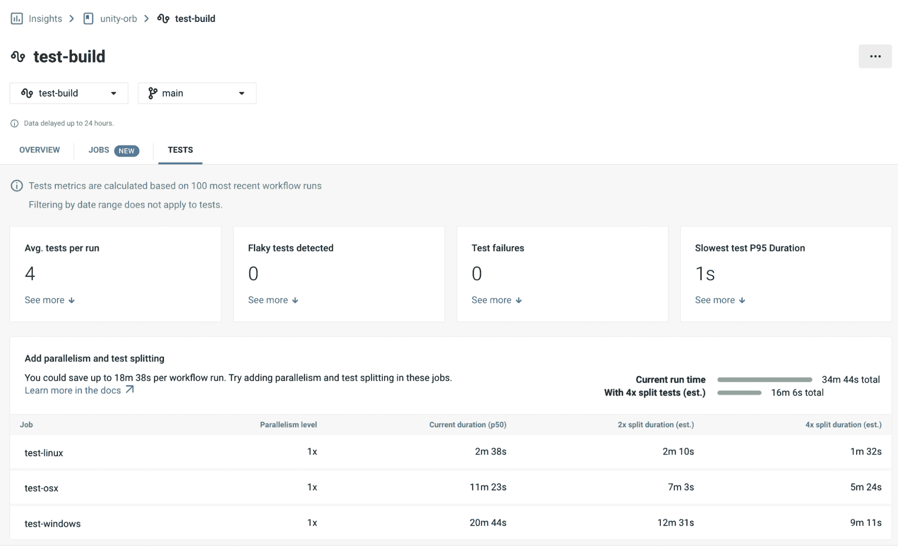
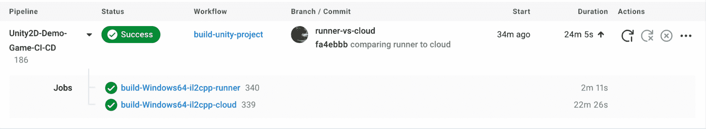

# 使用 GameCI 的 Unity orb | CircleCI 开发 Unity 游戏的 CI/CD

> 原文：<https://circleci.com/blog/cicd-for-unity-projects/>

我们最近与 GameCI 合作，在 CircleCI 和游戏开发领域之间架起了一座桥梁。这种合作带来了 [Unity orb](https://circleci.com/developer/orbs/orb/game-ci/unity) ，一个可重用的配置组件，你可以插入到你的 CircleCI 配置文件中来构建和测试你的 Unity 项目。

一段时间以来，[持续集成和交付](https://circleci.com/blog/what-is-a-ci-cd-pipeline/)已经成为一些软件公司和 IT 部门的软件开发食谱的一部分。然而在游戏开发中往往不是这样。虽然后者和软件开发在本质上是相同的，但由于游戏的大小和硬件要求，游戏在集成到管道中时会更复杂。

Unity orb 是我们为游戏开发者简化 CI/CD 的第一步。有了它，你可以用最少的配置为几个平台构建你的游戏，包括 macOS、Windows、Linux、Android 和 iOS。如果你有用 [Unity 测试框架](https://docs.unity3d.com/Packages/com.unity.test-framework@1.1/manual/index.html)编写的测试，orb 可以运行，解析结果到 JUnit，并为你存储它们以[在 CircleCI web 应用中可视化](https://circleci.com/docs/insights-tests/)。

在接下来的部分，你将了解我们与 GameCI 的合作关系，并了解 Unity orb 能做些什么。如果你迫不及待地想在你的项目中设置 orb，请前往[入门](https://game.ci/docs/circleci/getting-started)页面。

## gamecih

GameCI 是一个开发者社区，由 [Webber](https://takken.io/?utm_source=game-ci) 和 [GabLeRoux](https://gableroux.com/?utm_source=game-ci) 于 2019 年创立，专注于创建开源工具，以自动化 unity 项目的测试、构建和部署。在[大卫](https://davidmfinol.website/?utm_source=game-ci)、[费舍尔](https://game.ci/@site/src/components/pages/about-us/section/our-story-section/our-story)和几个贡献者的帮助下，它成长到支持 1000 多个寻求改进他们开发过程的团队。

最初，GameCI 专注于提供包含构建 Unity 项目所需一切的 Docker 图像。他们发展来创建和维护全面的 GitHub 操作，帮助开发人员测试、构建和部署。现在，他们的[路线图](https://github.com/orgs/game-ci/projects/4)包括与 GitHub 的大规模解耦，成为一个 CI 无关的 CLI 工具。

像 GameCI 一样，我们相信开源，并希望帮助游戏开发者将 CI/CD 纳入他们的开发流程，而不会将其变成业务的焦点。因此，我们联系了他们，建议他们合作实现一个 orb，遵循他们现有工具中包含的理念和功能。

我们为我们共同取得的成就感到非常自豪，并强烈鼓励您在他们的[网站](https://game.ci/)、 [GitHub](https://github.com/game-ci) 和 [Discord](https://game.ci/discord) 上了解更多关于他们的信息。

## 团结球

Unity orb 包含了许多分布在[构建](https://game.ci/docs/circleci/build)和[测试](https://game.ci/docs/circleci/test)任务之间的很酷的特性，我们将在这里介绍它们。如果你想知道真相，请访问 orb 的[注册表](https://circleci.com/developer/orbs/orb/game-ci/unity)和[源代码](https://github.com/game-ci/unity-orb)，

顾名思义，`build`获取 Unity 项目，构建它，并有选择地保存结果工件。我们通过[基于对`packages-lock.json`的更改缓存项目的依赖关系](https://circleci.com/blog/config-best-practices-dependency-caching/)来优化流程，这意味着您可以获得开箱即用的缓存！另一个很酷的特性是能够为多个平台构建你的游戏。由于 orb 运行在多个执行器上，你可以在 [Mono 和 IL2CPP](https://learn.unity.com/tutorial/memory-management-in-unity#5c7f8528edbc2a002053b59b) 之间选择。在我们的测试中，我们成功构建了:

*   WebGL
*   tvOS
*   马科斯
*   Linux 操作系统
*   Windows 操作系统
*   ios
*   机器人

你可以在的`test-build`工作流程[中下载并运行它们。你甚至可以直接从 CircleCI web 应用程序运行](https://app.circleci.com/pipelines/github/game-ci/unity-orb)[解压缩的 WebGL](https://docs.unity3d.com/Manual/webgl-deploying.html) 构建，在你的浏览器中进行游戏！

 </blog/media/2022-10-03-unity-build.mp4> 

这份`test`工作帮助你运行 Unity 测试，并从中获得[洞察力](https://circleci.com/docs/insights-tests/)。我们通过将 Unity 的 XML 解析为 JUnit 并存储结果来实现这一点。如果测试没有通过，你也可以使用 [requires](https://circleci.com/docs/configuration-reference/#requires) 键来阻止工作。



如果您需要对缓存进行更多的控制或者想要为您的作业定义自定义行为，您可以利用 orb 的命令。一名 GameCI 社区成员探索了这一概念，并在 [this gist](https://gist.github.com/nanodeath/903f2a63cb020c36073daedd9977c24b) 中分享了他们的发现。他们使用`persist_to_workspace`功能在后期构建工作中将构建工件部署到 itch.io。

## 执行环境及其对您的影响

Unity 很酷的一点是，你可以编写一次游戏，然后在任何地方运行。然而，像[脚本后端](https://docs.unity3d.com/Manual/scripting-backends.html)这样的细微差别需要你能够访问你游戏的目标平台来构建它。考虑到这一点，我们将 Unity orb 设计为灵活的执行环境。

可以在 [macOS](https://game.ci/docs/circleci/executors#macos) 、 [Windows](https://game.ci/docs/circleci/executors#windows) 、 [Linux](https://game.ci/docs/circleci/executors#ubuntu) executors 上运行 orb，执行环境不限于 CircleCI cloud。您可以在[自托管运行器](https://circleci.com/docs/runner-overview/)上构建项目，让您完全控制基础设施。在接下来的部分中，我们将讨论每个选项，并了解哪个选项最适合您。

## 在 CircleCI Cloud 上构建 Unity 项目

在我们的云上运行您的管道的最大优势是零基础设施开销和快速设置。你只需要担心[配置你的上下文](https://game.ci/docs/circleci/activation#configuring-your-context)和[工作流](https://game.ci/docs/circleci/getting-started#setting-up-a-workflow)。如果你有一个小项目，想要测试 orb，或者一般不关心[更长的构建时间](https://game.ci/docs/circleci/executors)，我们建议你遵循这条路线。做好一切准备后，您的配置将如下所示:

```
version: 2.1

orbs:
  unity: game-ci/unity@1.2

workflows:
  build-unity-project:
    jobs:
      - unity/build:
          name: 'build-Windows64-il2cpp'
          step-name: 'Build project for Windows using Cloud'
          unity-license-var-name: 'UNITY_ENCODED_LICENSE'
          unity-username-var-name: 'UNITY_USERNAME'
          unity-password-var-name: 'UNITY_PASSWORD'
          executor:
            name: 'unity/windows-2019'
            size: 'large'
            editor_version: '2021.3.2f1'
            target_platform: 'windows-il2cpp'
          project-path: 'Unity2D-Demo-Game-CI-CD/src'
          build-target: StandaloneWindows64
          context: unity 
```

这个代码片段使用 Windows executor 为 Windows 构建一个 IL2CPP 项目。你可以在我们的[演示项目](https://github.com/CircleCI-Public/Unity2D-Demo-Game-CI-CD)的[配置](https://github.com/CircleCI-Public/Unity2D-Demo-Game-CI-CD/blob/main/.circleci/config.yml)文件和[文档](https://game.ci/docs/circleci/build#examples)中找到更多针对不同平台的例子。

## 使用 CircleCI 自托管跑步者构建 Unity 项目

大型项目对带宽和硬件的要求可能会超出我们云产品的能力。在这些情况下，您需要将 Unity orb 用于自托管跑步者。由于它们的非短暂性，检出步骤不会在每次运行时都克隆您的整个存储库，您可以选择满足您需求的硬件。有了安装体验的最新更新，您可以[在 5 分钟或更短时间内让 runner 运行起来](https://circleci.com/blog/install-runner-in-five-minutes/)。

一旦你设置好了你的运行器，你所要做的就是改变你的配置文件来使用 [macOS](https://game.ci/docs/circleci/executors#macos-runner) 或 [Windows](https://game.ci/docs/circleci/executors#windows-runner) 运行器执行器，同时传递你的[资源类标签](https://circleci.com/docs/runner-concepts/#namespaces-and-resource-classes)作为参数:

```
version: 2.1

orbs:
  unity: game-ci/unity@1.2

workflows:
  build-unity-project:
    jobs:
      - unity/build:
          name: 'build-Windows64-il2cpp'
          step-name: 'Build project for Windows using Runner'
          unity-license-var-name: 'UNITY_ENCODED_LICENSE'
          unity-username-var-name: 'UNITY_USERNAME'
          unity-password-var-name: 'UNITY_PASSWORD'
          executor:
            name: 'unity/windows-runner'
            editor_version: '2021.3.2f1'
            resource_class: 'ericribeiro/unity-runner'
          project-path: 'Unity2D-Demo-Game-CI-CD/src'
          build-target: StandaloneWindows64
          context: unity 
```

请注意，只有执行器的参数发生了变化。您的其余配置保持不变，允许您尝试 CircleCI cloud，如果前者不适合您的需求，可以快速切换到 runner。下图展示了`windows-runner`相对于`windows-2019`云执行器的表现。



他们正在为相同的目标平台构建相同的项目，但是 runner 提前 20 分钟完成。构建时间的差距在于运行程序以前运行过一次任务。因此，所有环境依赖项都被缓存或已经安装。我们对 runner 使用了一个`m5.2xlarge` EC2 实例，对 cloud 使用了一个大的资源类。

## 最后的想法

我们很高兴能与游戏开发者和 GameCI 一起开始这一旅程。凭借从这项事业中获得的知识，我们希望开发更多适合游戏开发社区的工具，并改进 Unity orb。如果您有任何建议或反馈，请在 [Twitter](https://twitter.com/CircleCI) 上与我们联系，在我们的[论坛](https://discuss.circleci.com/)上问好，或者在 [Discord](https://discord.gg/B8YHESde) 上与我们聊天。