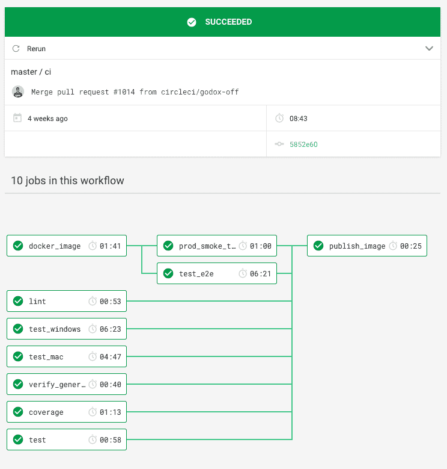
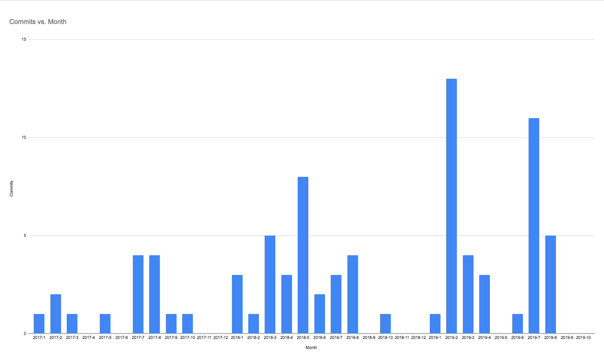

# CircleCI 配置拆卸

> 原文：<https://circleci.com/blog/circleci-config-teardown-how-we-write-our-circleci-config-at-circleci/>

虽然每个人都喜欢抱怨 YAML(相信我，我们也抱怨它！)，事实是这种简单的语言可以创建强大的管道来完成几乎任何你可以想象的事情。在这篇文章中，我将带您浏览我们自己的构建代理项目的配置文件，并使用它来突出我们的配置格式是如何形成的一些有趣的历史。

构建代理是我们注入到作业中运行它们的可执行文件。它是最终获取配置并执行作业中每一步的程序。CI 流程是 CircleCI 最复杂的流程之一，大多数服务都有一个更基本的 3 步构建、测试和部署流程。

我没有警告拥有这个代码库的团队我要这么做。他们有点害怕展示他们的配置缺点，但已经决定合作。

## 版本

配置文件中的第一个声明是版本字段。

```
version: 2.1 
```

我们当前的配置版本是 2.1，我们在 2018 年 11 月推出了一系列丰富的新配置功能，主要是[orb](https://circleci.com/orbs/)、命令和执行器。

## 工作流程

接下来我们有了`workflows`定义，我们有了一个单一的工作流。该工作流程的目标是将经过全面测试的 Docker 映像推送到 [Docker Hub](https://hub.docker.com) 。

```
workflows:
  ci:
    jobs:
      - test
      - coverage
      - lint
      - verify_generated
      - test_windows
      - test_mac
      # snip... 
```

列出的第一组任务没有依赖关系——我们在 CircleCI 支持的三个平台上运行`test` (Linux)、`test_windows`和`test_mac`进行测试。我们希望在`git push`之后尽快得到关于任何失败测试的反馈。

```
workflows:
  ci:
    jobs:
      # snip...
      - docker_image:
          context: org-global
      - test_e2e:
          requires: [docker_image]
      - prod_smoke_tests:
          requires: [docker_image]
      - publish_image:
          filters:
            branches:
              only: master
          context: org-global
          requires:
            - test
            - coverage
            - lint
            - verify_generated
            - test_windows
            - test_mac
            - test_e2e
            - prod_smoke_tests 
```



然后我们有一组具有依赖关系的作业——第一个作业是`docker_image`,构建将被测试的 Docker 映像，然后我们有两个下游作业:`test_e2e`和`prod_smoke_tests`,它们依赖于 Docker 映像，最后，如果所有其他作业都成功，则`publish_image`作业将发布映像。

其中两个任务使用[一个`context`T2，它可以访问访问 CircleCI Docker Hub 账户所需的秘密。上下文允许您在 CircleCI 上的项目之间共享凭证，我们的受限上下文允许您将访问权限限制在团队的特定成员。](https://circleci.com/docs/contexts/)

## 球

```
orbs:
  go: gotest/tools@0.0.10
  codecov: codecov/codecov@1.0.4
  win: circleci/windows@1.0.0 
```

接下来，我们引入对三个球体的引用。orb 是可共享的配置元素包，包括作业、命令和执行器。

我们从三个不同的名称空间引入三种类型的球体:

*   我们导入的第一个 orb 是一个社区 orb - [`gotest/tools`](https://circleci.com/developer/orbs/orb/gotest/tools) ，它有一些方便的命令用于测试用`golang`编写的项目。
*   我们导入 [CodeCov.io](https://www.codecov.io/) ,这是一个合作伙伴 orb，我们用它来报告我们项目的代码覆盖度量。
*   最后是`windows` orb，这是配置 Windows 作业所需的第一方 orb。

这里的导入语法是经过特别选择的，以确保依赖关系的变化不会破坏我们的构建。orb 的每个发布版本都是不可变的，所以如果您导入一个具有特定版本的 orb，它将永远不会改变(除非您正在使用[一个 dev orb](https://circleci.com/docs/using-orbs/#orb-versions-development-vs-production) )。

你可以选择放松这些保证——导入`codecov/codecov@1.0`将会导入最高版本的`1.0.x`,同样的，`codecov/codecov@1`将会导入最高版本的`1.x.y`。

我们还支持一个名为`volatile`的特殊版本，它将始终导入已经发布的最高版本号的 orb。我们特意选择了单词`volatile`而不是`latest`,以便在配置文件中清楚地表明这是危险的，并且导入的 orb 可能会随着构建的不同而变化。

我们还写了一篇关于我们为 orbs 所做的设计选择的博客，你可能想看看。

## 实施者

下一部分是我们声明`executors`的地方，这是在配置文件中的一个地方声明执行环境的方法，以便在作业之间共享它。在配置版本 2.1 中添加了执行器，以解决我们在检查配置文件中的常见模式时看到的一些问题——YAML 锚在作业之间共享配置。我们从用户和自己的项目中看到的 YAML 锚最常见的用途之一是确保所有工作使用完全相同的 Docker 图像。

```
executors:
  default:
    docker:
      - image: circleci/golang:1.11 
```

通过使用`executors`块而不是 YAML 锚，我们的用户获得了更好的体验。执行程序声明的语法是在文件中声明执行程序的地方检查的，而不是在使用它的地方，因此修复错误更加简单。执行者也可以打包成 orb，在项目间共享。

## 命令

像 executors 一样，命令也被设计用来取代 CircleCI 中 YAML 锚的一种常见用法——在作业之间共享步骤。在 2.0 配置中，使用锚在作业之间共享单个步骤已经足够好了。问题在于共享多个步骤——YAML 锚没有拼接操作，所以不可能将一系列步骤插入另一个步骤；通过命令，您可以。

我们使用命令的一个简单方法是建立远程 Docker 连接，并确保在所有使用该命令的作业中使用相同版本的 Docker (18.09.3 ):

```
commands:
  remote_docker:
    steps:
      - setup_remote_docker:
          version: 18.09.3
      - run: docker version 
```

更高级的命令`prep_for_docker_image_tests`用于减少`prod_smoke_tests`和`test_e2e`测试所需的一组步骤的重复；

```
 prep_for_docker_image_tests:
    steps:
      - run: mkdir /tmp/dockertag
      - attach_workspace:
          at: /tmp/dockertag
      - run:
          name: verify tag is present
          command: |
            if ! [ -f /tmp/dockertag/docker_image.tag ]; then
              echo "No docker tag found"
              echo "This is likely because the upstream job ran before the PR was created"
              echo ""
              echo "Re-run the workflow now that a PR exists to include the publish image step"
              exit 1
            fi
      - checkout
      - run: mv /tmp/dockertag/docker_image.tag . 
```

这个命令还有其他一些有趣的配置用法:

*   我们使用工作区来访问上游作业的数据。在本例中，我们附加了一个工作空间来加载在`docker_image`任务中创建的 Docker 图像的标签。
*   在`verify tag is present`步骤中，我们检测到一个问题(作业运行时没有 Docker 标签)，我们产生一个详细的错误消息告诉用户发生了什么，如何修复它，最后我们调用`exit 1`使作业失败。如果发生这种情况，错误消息将在 CircleCI UI 中可见，并以红色突出显示，以便用户容易发现。
*   我们既使用了`run:`的短格式，也使用了长格式。当命令比较简单时，我们使用简短的形式(例如`mkdir /tmp/dockertag`)，当命令比较长时，我们给它一个描述性的名称来记录更高级别的操作(“验证标签是否存在”)。

## 乔布斯

我不会一一列举我们所有的工作，而是将注意力放在它们更有趣的方面。

### 验证 _ 生成

我们有一项工作是验证生成的代码是最新的。我的同行对我们如何安装这些依赖项并不感到特别自豪，但我保证会有缺点。

```
 verify_generated:
    executor: default
    steps:
      - checkout
      - go/mod-download
      - go/mod-tidy-check
      - run:
          name: install protobuf binaries
          command: |
            mkdir -p /tmp/protoc
            cd /tmp/protoc

            wget https://github.com/protocolbuffers/protobuf/releases/download/v3.3.0/protoc-3.3.0-linux-x86_64.zip
            unzip protoc*.zip
            sudo mv bin/protoc /usr/local/bin/

            wget http://central.maven.org/maven2/io/grpc/protoc-gen-grpc-java/1.3.0/protoc-gen-grpc-java-1.3.0-linux-x86_64.exe
            sudo mv protoc-gen-grpc-java* /usr/local/bin/protoc-gen-grpc-java
            sudo chmod +x /usr/local/bin/protoc-gen-grpc-java

      - run: ./do generate-fakes
      - run: ./do generate-protos
      - run:
          name: Ensure that generated files are in sync
          command: git diff --exit-code 
```

项目中有一些生成的代码，这是为了生成 gRPC 互操作代码，并为测试生成一些模拟接口。我们生成代码，并将生成的代码提交给`git`。这里的作业在 CI 期间重新生成代码，如果在 CI 期间生成的代码与提交给 CI 的代码不同，那么构建将会失败。这允许我们在开发人员忘记提交生成的代码时中断构建。

### 测试窗口

```
 test_windows:
    executor:
      name: win/vs2019
      shell: bash --login -eo pipefail
    steps:
      - run: git config --global core.autocrlf false
      - checkout 
```

我们在 Windows 上构建和测试构建代理。为了使用我们现有代码库的 bash 架构，我们做了一系列小的配置调整，以确保我们的 Windows 构建能够顺利运行。Orbs 简化了新资源类的引入，因为它们允许我们在不需要大量开发工作的情况下提供配置调整。

### 球

首先，我们能够在八月份[添加 Windows 支持](https://circleci.com/blog/windows-general-availability-announcement/)，而无需在我们的 YAML 配置中添加任何新语法。我们能够使用 orb`circleci/windows`实现 Windows，orb 暴露了将在 Windows Server 2019 上运行作业的`executor`。在引擎盖下，`executor`被扩展为一个常规的`machine`执行器，具有特定的`image`和`resource_class`字段，它将 shell 设置为`powershell.exe`。

2017 年 11 月，我参与了 CircleCI 2.0 上 [macOS 的发布。当时我们没有 orb，所以我们必须在工作声明中添加一个新的`macos`字段，以允许人们选择 macOS。这种改变需要上下改变堆栈，以使一堆服务意识到 config 中的这个新键。能够在不对配置文件格式进行任何更改的情况下启动 Windows 对我们内部来说是一个重要的里程碑，因为它验证了我们在 2018 年所做的大量内部更改和重新分解，使我们能够在服务中更好地分离关注点。](https://circleci.com/blog/one-more-thing-apple-developers-can-now-build-for-macos-ios-tvos-and-watchos-on-circleci-2-0/)

### 行尾

工作的第一步是当我们第一次开始在 Windows 上构建时，我为了解决一个问题而添加的，从那以后我们再也没有删除过。

```
git config --global core.autocrlf false 
```

我们有一些测试运行一组作业`steps`，然后将这些步骤的输出与包含预期输出的文件进行比较。我们用来比较字符串和预期输出文件的库在 Windows 上运行时有一个错误。通过将`core.autocrlf`设置为 false，我们避免了`git`在结账时将`\n`转换为`\r\n`的默认行为，这解决了这个问题。这解决了眼前的问题，我再也没有回去找到错误是什么。

### 贝壳

我们的 Windows 映像的默认 shell 是`powershell.exe`。我们还提供了`cmd.exe`、`bash.exe`，事实上，还有任何其他可以安装在映像上的 shell。为了测试`build-agent`，我们将 shell 设置为`bash --login -eo pipefail`，这与我们在 Linux 和 macOS 作业上运行的 shell 相同。我们安装的`bash`是 Windows 自带 [`git`的`bash`版本。这允许我们像其他测试工作一样重用相同的脚本和命令。](https://gitforwindows.org/)

## 测试 _mac

我们的 macOS 测试在一个简洁的配置中使用了大量的 CircleCI 特性。

```
 test_mac:
    macos:
      xcode: '10.3.0'
    steps:
      - checkout
      - run:
          name: Setup host
          command: ./scripts/ci/mac-setup
      - go/mod-download:
          prefix: v1-mac
          path: /Users/distiller/go/pkg/mod
      - run:
          name: Install GoLang devtools
          command: ./do install-devtools
      - go/mod-tidy-check
      - run:
          name: Test
          environment:
            GOTESTFLAGS: -coverprofile=coverage.txt
            GOTESTSUM_JUNITFILE: /tmp/test-reports/junit.xml
          command: |
            mkdir -p /tmp/test-reports
            ./do test-all
      - codecov/upload:
          flags: macos
      - store_test_reports 
```

macos stanza 本身非常简单:我们花了两周多的时间来设计它，并精心设计细节。将 CircleCI 1.0 与 CircleCI 2.0 进行对比，circle ci 1.0 为所需 xcode 的单一版本提供了空间，circle ci 2.0 增加了额外的嵌套级别:

```
 macos:
   xcode: '10.3.0' 
```

我们这样做是为了确保在`macos`键下有空间放置`xcode`旁边的其他键。这允许我们在未来增加配置语法，而不必进行重大更改。

接下来，我们很好地混合了不同类型的命令:

```
- checkout 
```

`checkout`命令是一个内置的步骤，用于从`git`中签出项目。

```
- run:
    name: Setup host
    command: ./scripts/ci/mac-setup 
```

下一步是运行`./scripts/ci/mac-setup`的`run`步骤。我们更喜欢将这样的脚本作为文件签入`git`，而不是在`config.yml`中保存多行 shell 命令。将脚本取出并放入它们自己的文件中，可以更容易地处理这些文件:

*   语法突出显示在编辑器中工作正常
*   文件内容从第 1 列开始，而不是出现在`config.yml`的第 13 列
*   运行脚本很简单。我们大多数包含 shell 脚本的 repos 将使用[`shellcheck`orb](https://circleci.com/developer/orbs/orb/circleci/shellcheck)来自动检查 CI 中的错误。我强烈推荐你的项目。

```
- go/mod-download:
     prefix: v1-mac
     path: /Users/distiller/go/pkg/mod 
```

下一步，`go/mod-download`，是执行来自作为`go: gotest/tools@0.0.10`导入的`gotest/tools` orb 的命令。我们可以引用 orb 中带有前缀`go/`的任何命令。我们向命令传递两个参数，`prefix`和`path`。您可以使用我们的 CLI 工具来扩展命令，就像这样，使用`circleci config process`命令来查看它们编译成什么。在这种情况下，它扩展为以下内容:

```
 - run:
        name: Install git
        command: |
          command -v git && exit
          command -v apk && apk add --no-cache --no-progress git
    - restore_cache:
        name: Restore go module cache
        keys:
        - v1-mac-{{ arch }}-go-modules-
        - v1-mac-{{ arch }}-go-modules-{{ checksum "go.sum" }}
    - run:
        environment:
          GO111MODULE: 'on'
        command: go mod download
    - save_cache:
        name: Save go module cache
        key: v1-mac-{{ arch }}-go-modules-{{ checksum "go.sum" }}
        paths:
        - /Users/distiller/go/pkg/mod 
```

这里有趣的一点是，在我们的 macOS 构建上的用户是`distiller`，而在我们所有的 VMs 构建(Linux 和 Windows)、[和我们的便利 Docker 映像](https://circleci.com/docs/circleci-images/)中，用户总是`circleci`。原因是 CircleCI 上最初的 macOS(当时的 OS X)是由 2014 年加入 CircleCI 的 Distiller 团队[实现的。为了使 Distiller 用户平稳过渡到 CircleCI 1.0 平台，我们将用户名保留为`distiller`，以匹配 Distiller 产品。三年后，当我们发布 CircleCI 2.0 的 macOS 版本时，我们将用户名保留为`distiller`，以便为我们的客户实现从 1.0 到 2.0 的平稳过渡。5 年后，我们在这里，用户名仍然是*`distiller`。*](https://circleci.com/blog/announcing-ios-and-android-support/)

 *下一步在`run`步骤中很好地使用了[环境变量](https://circleci.com/docs/env-vars/)。在 config 中设置`job`级别的环境变量是很常见的，但是我发现也可以在特定的`run`步骤中设置它们，这种情况并不常见。在可能的情况下，我喜欢将选项提取到环境变量中，而不是将长参数列表提取到命令中。在我看来，它使配置更具声明性，更少程序性。

```
- run:
    name: Test
    environment:
      GOTESTFLAGS: -coverprofile=coverage.txt
      GOTESTSUM_JUNITFILE: /tmp/test-reports/junit.xml
    command: |
      mkdir -p /tmp/test-reports
      ./do test-all 
```

最后一步是呼叫我们的一个合作伙伴 orb:

```
- codecov/upload:
    flags: macos 
```

这个命令将把测试的代码覆盖结果上传到 [CodeCov.io](https://codecov.io/) 。这里的`flags`参数允许 [Codecode 合并多个测试报告](https://docs.codecov.io/docs/merging-reports)。在构建期间，我们在三个平台上运行代码覆盖:

然后，我们使用标志`macos`、`windows`和`linux`上传所有三个测试运行的覆盖率数据。Codecov 能够将这三个报告合并成一个报告，为我们提供构建的整体代码覆盖度量。

这张图片显示了我们每月改变`.circleci/config.yml`的频率:

## 产品 _ 烟雾 _ 测试

这项工作是我最喜欢的工作之一，我们在 CircleCI 的所有构建中都要做这项工作。

```
 prod_smoke_tests:
    docker:
      - image: circleci/python:3.6
    steps:
      - prep_for_docker_image_tests
      - run:
          name: install dependencies
          working_directory: e2e/canary
          command: |
            pipenv install --skip-lock
      - run:
          name: Trigger e2e smoke tests
          working_directory: e2e/canary
          command: |
            export CIRCLECI_BUILD_AGENT_IMAGE="$(< ../../docker_image.tag)"
            export CIRCLECI_API_TOKEN="${PICARD_DUMMY_API_TOKEN}"
            mkdir -p /tmp/test-reports
            time pipenv run pytest -n10 --junit-xml=/tmp/test-reports/results.xml ./tests.py
      - store_test_reports 
```

这里的 e2e(端到端)测试是使用`pytest`从 Python 中触发的，这允许我们[收集测试元数据(以“JUnit”XML 格式)](https://circleci.com/docs/collect-test-data/)并直接在作业页面上报告测试失败，而不必通读作业输出。

测试本身在[circleci.com](https://circleci.com)上运行了七个生产版本，但是使用了这个版本中新标记的 Docker 映像，而不是生产中通常使用的版本。我们在 Windows、macOS 上运行构建，使用 Docker，使用 Linux VM，以及一些特定的功能和故障模式测试。所有这些测试都必须通过，工作流才能成功。

我们的`test_e2e`工作是类似的——它在`build-agent`和一些与之通信的上游服务之间运行一系列集成测试。

这意味着，我们只有在证明所生产的工件(新的`build-agent`)能够在所有平台上运行生产中的构建之后，才会将拉请求报告为绿色。当我部署时，这样的测试给了我很多信心。

## 下一步是什么

我们一直在努力改进我们的配置格式。我们目前在预览版中有我们的[管道参数 API，它允许你用暴露给我们的配置处理系统的特定参数来触发项目执行。](https://github.com/CircleCI-Public/api-preview-docs/blob/master/docs/pipeline-parameters.md)

我们希望在我们的[想法页面](https://ideas.circleci.com/)上听到您关于配置 CircleCI 的想法和反馈。

感谢您的关注。要我以后再解释另一个配置文件吗？[@ Twitter 上的我](https://twitter.com/atmarc?lang=en)提名一个。*