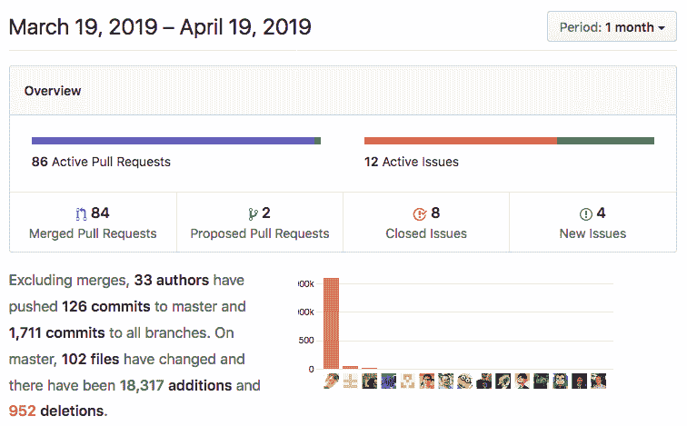
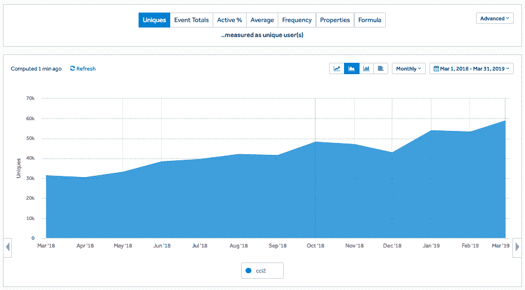
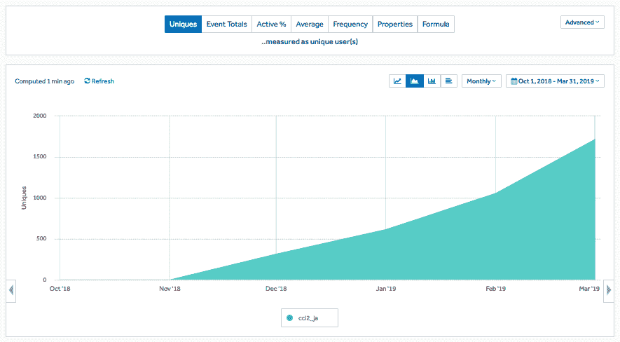
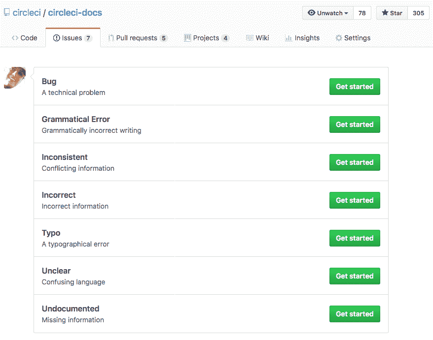

# CircleCI 文档由您创建:庆祝我们的开源贡献者

> 原文：<https://circleci.com/blog/circleci-docs-are-built-by-you-celebrating-our-open-source-contributors/>

在 CircleCI，我们已经注意到将文档开发作为一个开源项目的积极影响，因为每一个改进，无论大小，都会在同一天帮助成千上万的读者。CircleCI 文档是开源的，因为在开放环境中工作会产生更好的文档，并使更多的人能够有效地影响和更改文档。

## 感谢我们的贡献者

作为 CircleCI 的工程文档经理，我要感谢所有为 GitHub 上的 [circleci-docs](https://github.com/circleci/circleci-docs) 库做出贡献的人。在上个月，33 位作者合并了对我们的公共文档报告的改进！对社区成员 **stmcallister、smasuda、mikegee、skion、**和 **gfoidl** 的拉取请求进行了特别的大声呼喊。

*circle ci 2.0 docs 每月唯一访问量*

无论您是新开发人员还是经验丰富的开发人员，我们都非常感谢您对 docs 的贡献。投稿是给你的简历添加一些开源经验的好方法(对开发人员和技术作者很有用)，也是通过分享你的专长和知识参与 CircleCI 的好方法。我们的 2.0 文档集每月有近 60，000 名独立访问者，因此，即使是一个小小的贡献或错别字修复也能帮助大量读者使用 CircleCI 开发更好的代码。你也会有好的伙伴！我们的内部贡献来自 CircleCI 的各个角落，包括销售、支持、工程、营销和产品管理。

## 显著的贡献

### 将文档翻译成日语

2018 年 12 月，我们收到了来自社区成员 **Naturalclar** 的第一份完整翻译，他将使用 CircleCI 状态徽章的[的说明本地化为日语](https://github.com/circleci/circleci-docs/pull/3001)。我们热烈欢迎文档本地化人员加入我们的社区，并感谢为我们的日语开发人员提供优秀翻译的努力。我们的[日本文献收藏馆](https://circleci.com/docs/ja/)每月已经有超过 1700 名访客。

 *日文文档:每月唯一访问量*

### Orbs 发布流程更新

三月， **danielcompton** 贡献了[文档更新和反馈](https://github.com/circleci/circleci-docs/pull/3187)来澄清 orb 发布的 CircleCI 文档。分享他的观点并建议一种新的方法来描述这个过程使这个文档更加清晰，他的贡献将帮助每个读者在未来更容易地遵循这些说明。

## 目录修复和错别字

二月份 **jodastephen** 向[提出了一个 pull 请求，要求更新 Maven/Gradle](https://github.com/circleci/circleci-docs/pull/3155/files) 测试元数据的设置，并在文档中调出一些帮助我们更新文档的其他框架的信息。当月晚些时候， **friederbluemle** 在 [PR 中更新了 49 个文档文件，以提高商标术语和变量使用的一致性](https://github.com/circleci/circleci-docs/pull/3168)。

## 语言指南改进

4 月份， **stmcallister** [更新了](https://github.com/circleci/circleci-docs/pull/3271) [Go 语言指南](https://circleci.com/docs/language-go/)中的链接，使示例项目 repo 更容易在文档中找到，并且 **smasuda** [增加了一个选项](https://github.com/circleci/circleci-docs/pull/3295/files)，以防止在运行 [Haskell 语言指南](https://circleci.com/docs/language-haskell/)中的命令时耗尽内存。

## 归档详细问题

在上一个季度，我们还提交了几个详细的问题，帮助我们了解我们的文档中需要改进的地方。如果您不想提出拉动请求，这是一个很好的参与方式！只需进入[新问题页面](https://github.com/circleci/circleci-docs/issues/new/choose)，选择您想要归档的文件类型，然后点击“开始”按钮，将信息提交给 CircleCI docs 团队。

例如， **y-nk** 使用 CircleCI CLI 文档提交了关于[缺少卸载](https://github.com/circleci/circleci-docs/issues/3161)[中 CLI](https://circleci.com/docs/local-cli/) 的信息的问题， **Aghassi** [提出了一个问题](https://github.com/circleci/circleci-docs/issues/3080)，帮助我们澄清了关于如何管理回购组织变更和 [CircleCI 上下文](https://circleci.com/docs/contexts/)的信息。

我想分享我们对所有这些人和更多帮助我们不断使 CircleCI docs 变得伟大的人的感激之情！

那么，你愿意为 CircleCI Docs 做贡献吗？以下是一些帮助您入门的信息:

## 为 CircleCI 文档供稿

欢迎所有人加入我们的社区！CircleCI 每月将 20 到 30 名贡献者的 PRs 合并到 docs repo 中，15%是 CircleCI docs 团队的技术作者，60%是 CircleCI 的工程师或产品经理，25%是开源贡献者。我们将始终优先合并您添加到我们文档中的内容，以帮助您之后使用这些文档的每一位读者！如果我们不能立即合并它，我们将得到一个技术审查员来检查和修改您建议的变化，所以我们可以合并您的公关。

## 如何参与

如果您想通过编写新的文档来学习一些东西，或者如果您想通过改进现有的说明来分享您的知识，欢迎您参与 CircleCI docs。我们努力创建世界级的 CI/CD 文档，这是通过整个 CircleCI 开发人员社区的贡献来实现的。我们还希望成为一个我们的开发人员有影响力的地方，可以帮助创建产品的这一部分，支持所有 CircleCI 用户，并帮助他们发现如何充分利用 CircleCI。

考虑到这一点，如果您需要灵感，下面的部分概述了我们希望与您在文档方面合作的一些领域！

### 为质量做出贡献

每个人都可以通过以下方式提高 CircleCI 文档的整体质量:

*   向 YAML 示例添加注释，解释关键点并提供相关文档的 URL。
*   将每个文档的链接添加到词汇表中，在词汇表中我们会提到 CircleCI 特有的术语。
*   向术语表中添加新的术语和定义，使其更加完整。
*   在内联文本中添加相关文档之间的链接。例如，只要我们提到“缓存”或“缓存”这个词，我们就应该将这个词链接到缓存文档。

### 为示例做贡献

在公共项目中使用 CircleCI 的任何人都可以向 CircleCI 文档提供示例:

*   如果您有一个使用 CircleCI 的开源项目，可以考虑将它添加到我们的项目列表中，这样其他开发人员可以从您的配置中学习。
*   考虑将您的配置片段的注释示例添加到我们关于特定主题的现有文档中。
*   我们很喜欢你的配置中的示例工作流和 orb 的贡献，因为这些是相对较新的功能，但有这么多的排列，更多的例子将帮助用户创建他们自己的定制。

### 为 API 文档做贡献

如果您的应用程序有一个调用 CircleCI API 的用例，那么您可以用示例调用的细节来记录您的应用程序的用例。

### 为运营最佳实践做出贡献

如果您正在管理自己的 CircleCI 安装，您可以通过[提出您的建议、请求和反馈](https://github.com/circleci/circleci-docs/issues/new/choose)来对 v2.16 的新[安装](https://circleci.com/docs/circleci-install-doc-v2-17.pdf/#section=administration)和[操作](https://circleci.com/docs/circleci-ops-guide-v2-17.pdf/#section=administration)文档提供反馈。

关于为文档做贡献的更多基础知识:

*   我们在 Markdown 中创作并使用 Jekyll 来发布静态站点。参见 [circleci-docs。GitHub 上的 circleci/config.yml 文件](https://github.com/circleci/circleci-docs/blob/master/.circleci/config.yml)用于我们的配置。
*   我们最近添加了脚本来构建 Slate API 文档，因此您可以将 PR 贡献给 markdown 源文件，在合并时，它将生成并发布 Slate 文件。
*   我们有简单的[投稿指南](https://github.com/circleci/circleci-docs/blob/master/CONTRIBUTING.md)、[风格指南](https://github.com/circleci/circleci-docs/wiki/Style-Guide)和[模板](https://github.com/circleci/circleci-docs/wiki/New-Document-Template)来帮助你一路走来！

准备好扬名立万了吗？ [探索文档](https://circleci.com/docs/)。