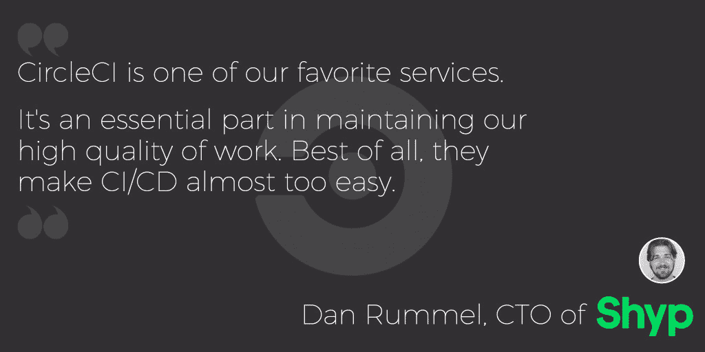

# CircleCI Enterprise“任意云”部署和 CircleCI for OS X - CircleCI

> 原文：<https://circleci.com/blog/circleci-enterprise-any-cloud-deployment-and-circleci-for-os-x/>

**来自出版商的说明:**您已经找到了我们的一些旧内容，这些内容可能已经过时和/或不正确。尝试在[我们的文档](https://circleci.com/docs/)或[博客](https://circleci.com/blog/)中搜索最新信息。

* * *

今天，我们很高兴地宣布推出两种新产品，而不是一种！

2015 年的大部分时间，我们都在打造一个更好的移动平台。我们知道软件团队不只是在真空中构建 iOS，它通常是更广泛堆栈的一部分。软件团队希望在一个平台上构建他们所有的软件。在收购 Distiller 以帮助实现我们的移动愿景，并经过一年多的公开测试和有限发布后，CircleCI for OS X 现已正式发布。

当我们[在 12 月](/blog/behind-your-firewall-circleci-enterprise-available-today/)宣布 CircleCI Enterprise 时，我们为大大小小的软件团队提供了一种安全、可扩展的方式来在防火墙后使用 CircleCI。今天，我们很自豪地宣布“任意云”部署的扩展产品，让团队能够灵活选择内部或基于云的配置。值得一提的是，CircleCI 企业用户也可以使用安全的 CircleCI OS X 舰队来运行他们的 I OS 版本。

## CircleCI 企业

[CircleCI Enterprise](https://circleci.com/enterprise/) 的核心是同一个持续集成和交付平台，受到全球成千上万开发人员的信赖。除了在防火墙后运行的固有安全性之外，CircleCI Enterprise 还为当今最具创新性和快节奏的软件团队树立了操作简便性和可扩展性的新标杆。

[Manheim](https://www.manheim.com/) 生产工程总监 Jason Riggins 表示:“我们的团队使用不同的技术，需要一个能够根据我们的规模和复杂性进行扩展的 CI 平台，同时还能让我们的工程师直接配置他们的产品。“有了 CircleCI Enterprise，我们的 devops 团队可以花更少的时间处理那些会阻碍我们的工程师的繁忙工作，而将更多的时间用于提高工作效率。”

CircleCI Enterprise 易于维护、易于更新，并且完全可脚本化，是为高吞吐量软件团队设计的。CircleCI Enterprise 将构建配置、提供构建容量和并行设置的能力直接推给开发人员，将开发运维团队从手动管理插件和服务器容量等复杂配置中解放出来。CircleCI Enterprise 自动与 GitHub 或 GitHub Enterprise 同步，即使是最复杂的团队也可以进行简单的设置。CircleCI Enterprise 集成了当今软件交付渠道中流行的开发工具和服务，包括 Docker，无需管理相互冲突的集中式插件。

立即开始:CircleCI Enterprise 提供 30 天免费试用。如果您想要一个更加定制化的实现，或者需要在您的防火墙后运行 CircleCI，请通过 [CircleCI Enterprise](https://circleci.com/enterprise/) 联系我们，或者发送电子邮件到【enterprise@circleci.com】T2，我们将迅速做出回应。

## OS X 的 CircleCI

[  ]

在当今的竞争格局中，应用程序开发速度至关重要，随着应用程序和系统变得越来越大、越来越复杂，保持这种速度非常困难。CircleCI for OS X 允许 iOS 开发人员为 iPhone、iPad、Mac、Apple TV 和 Apple Watch 应用程序构建和测试代码，大大缩短了开发周期。

CircleCI 提供了比当今市场上任何其他产品更多的并发性，因此任何规模的团队都可以更好地构建和快速扩展。移动团队对效率有不同的需求，一些团队排在 web 测试之后，另一些团队一次部署，有限的并发性会降低他们的速度。灵活的定价计划提供不同的分钟容量，以便个人或组织只为他们需要的分钟付费。

**开始**，作为当前客户进入账户设置- >计划定价- >更新计划- >基于 OS X 构建

借助 CircleCI for OS X，软件团队可以:

*   **快速移动:**无与伦比的并发选项、更智能的 Cocoapods 缓存和预装的关键依赖项带来了快速、实用和灵活的体验。

*   **放心部署:**无缝代码设计以及 Crashlytics beta、HockeyApp 和 TestFairy 的开箱即用部署功能，意味着配置移动 CI/CD 基础设施的时间更少，而创建软件的时间更多。

*   **清晰、实时地了解构建数据:** Insights 是一款交互式可视化仪表板，CircleCI for OS X 用户可以一目了然地实时了解所有构建。

*   **寻求一流支持:** CircleCI 致力于为所有时区的用户提供最佳支持。更新的文档和一个用户论坛，Discuss CircleCI 使个人和团队能够专注于正确的解决方案，并重新开始构建优秀的应用程序。

## 我们才刚刚开始

有这么大的新闻，我们已经全力以赴了。我们要感谢过去一年在测试版和限量版中与我们合作的所有团队和个人。没有您的反馈和支持，我们不可能完成最终产品。我们将继续欢迎并鼓励您的反馈，您可以相信我们会根据您的反馈进行改进。无论是功能请求、错误报告，还是您只是想给我们一个指示，表明您喜欢我们的发展方向，我们真诚地期待您的反馈。和往常一样，你可以通过应用程序或发邮件给 sayhi@circleci.com 联系我们。