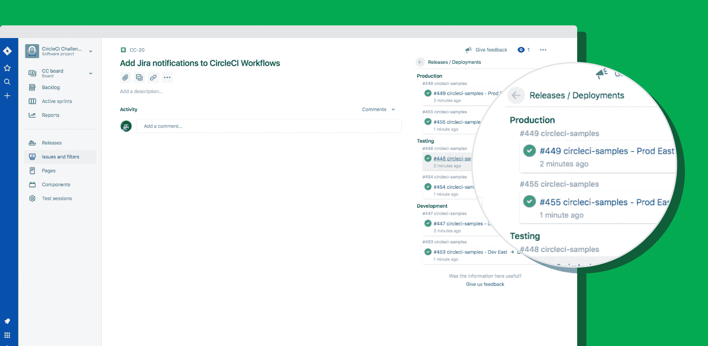
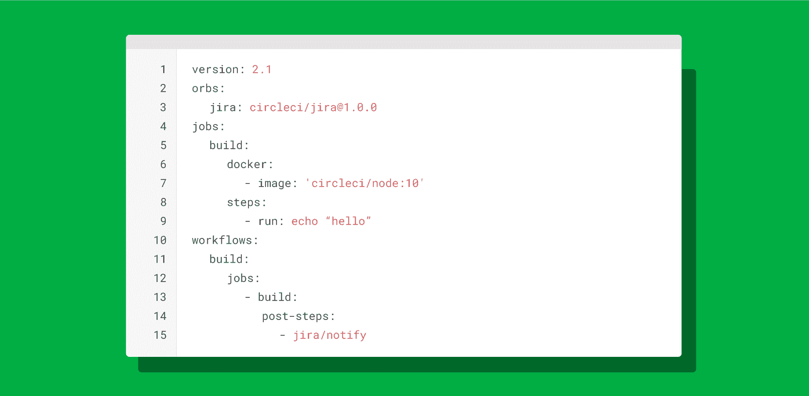
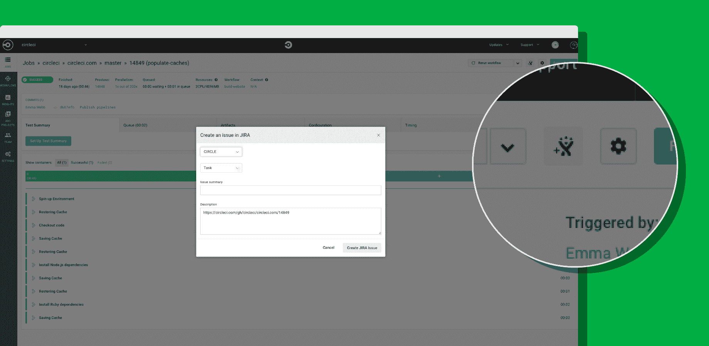

# 推出对吉拉软件的支持

> 原文：<https://circleci.com/blog/circleci-launches-support-for-jira-software/>

您如何确保团队中的每个人都知道正在构建什么、状态是什么以及下一步是什么？让产品、工程、设计、营销等部门的每个人都保持协调和最新可能是一项复杂但至关重要的任务。

Atlassian 的吉拉软件是敏捷团队用来解决这个问题的主要工具。吉拉软件通过允许用户将复杂的软件项目组织成可消化的、可操作的任务，使得管理这些项目变得更加透明和可理解。现在，吉拉软件通过直接在吉拉软件 UI 中报告 CircleCI 的工作和部署状态，为软件交付团队提供了更多的价值。



### 为吉拉软件启用 CircleCI

CircleCI for 吉拉使用 [CircleCI orbs](https://circleci.com/orbs/) 可以根据作业状态轻松分配新任务和修复。orb 是可重用的开放式配置包，允许您将外部工具(如吉拉)集成到您的工作流程中。首先，你需要将[吉拉 orb](https://circleci.com/developer/orbs/orb/circleci/jira) 添加到你的 config.yml 中，并在你的吉拉实例上安装 [CircleCI for 吉拉应用](https://marketplace.atlassian.com/apps/1215946/circleci-for-jira?hosting=cloud&tab=overview)。

以下是入门的详细说明:

1.  在此安装 CircleCI for 吉拉应用[。](https://marketplace.atlassian.com/apps/1215946/circleci-for-jira?hosting=cloud&tab=overview)
2.  在你的`.circleci/config.yml`文件的顶部使用 CircleCI 版。
3.  在您的版本下面添加 orbs 节，调用 orb:

    ```
     orbs:
         jira: circleci/jira@1.0.2 
    ```

4.  在现有作业中使用`jira/notify`命令向吉拉开发面板发送状态。

**注意:** *如果你还没有打开启用管道，你需要进入项目设置- >高级设置并打开它。*



### 从 CircleCI 创建吉拉问题

除了将您的作业状态报告给吉拉软件之外，您还可以直接从 CircleCI UI 中的作业页面创建新的吉拉问题。只需点击工作页面右上角的吉拉问题图标，编辑详细信息，然后点击“创建 Jira 问题”



### 工具之间更强的联系，形成更强的团队

您的 CI/CD 管道是关于代码如何从想法到交付的最新和最全面的真实来源。将 CircleCI 连接到吉拉软件会将这些见解带给您团队中的每个人。现在，产品经理将能够更好地估计新功能的构建速度，或者看到团队可能在哪里陷入困境。工程经理可以了解工作是否在不同的团队之间传递。设计可以更好地估计何时需要新的模拟或营销创意。将这些数据公之于众意味着每个人都可以做出更好的决策，更流畅地工作以实现您的目标。

在 CircleCI，我们相信一个互联的、可扩展的开发者生态系统是最能为我们的用户服务的。与 Atlassian 合作使这种吉拉软件集成成为可能，这只是您将看到的有助于整合您的工具的许多步骤之一，以帮助您的团队更快、更自信地前进。