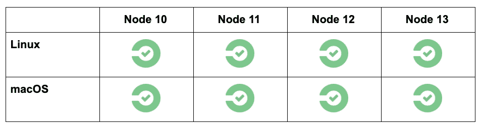
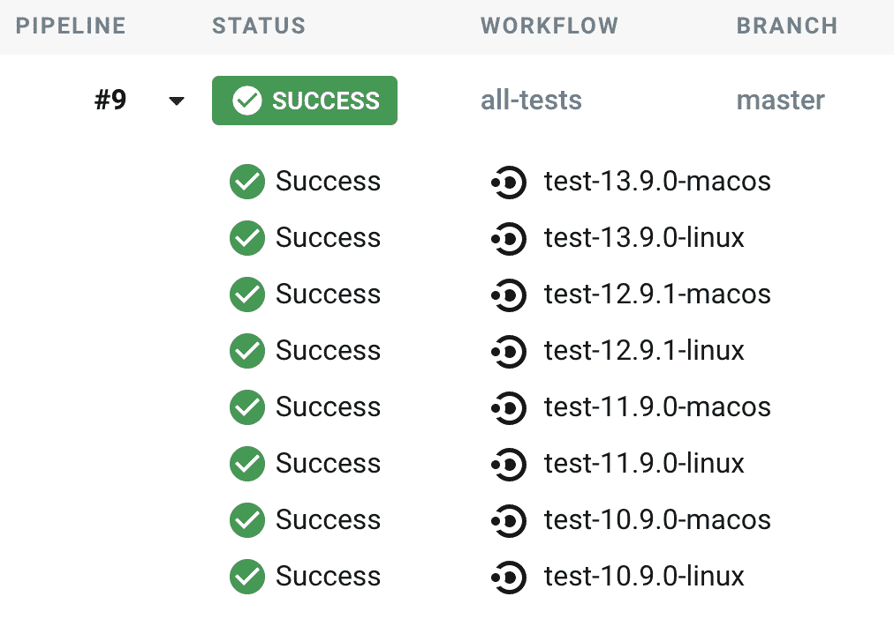

# 矩阵作业-复杂软件的简单配置| CircleCI

> 原文：<https://circleci.com/blog/circleci-matrix-jobs/>

CircleCI 具有多种特性，这些特性使其可配置、灵活且高效。其中一些是[球体](https://circleci.com/docs/orb-intro/)、[可重用配置](https://circleci.com/docs/reusing-config/)、[管道变量](https://circleci.com/docs/pipeline-variables/)，以及一个 [UI](https://circleci.com/blog/introducing-our-redesigned-UI-built-for-increased-user-productivity/) ，使查看状态和修复构建比以往任何时候都更有效。矩阵作业是效率工作台的另一个工具。

## 什么是矩阵作业？

矩阵作业是开发人员为复杂软件编写简单配置的秘密武器。只需几行配置，您就可以从单个测试进入更全面的测试套件，或者从一个任务进入并行化的相关工作。CircleCI 内置了对矩阵的支持，作为我们工作流语法的一部分。我们的矩阵实现与我们的参数化作业协同工作，以服务于许多用例。

假设我正在开发一个广泛使用的开源 JavaScript 库。在构建和发布新版本的库之前，我想在几个不同版本的 Node.js (10 到 13)上测试我的代码，并确认它在 Linux 和 macOS 上都可以工作。这意味着我有一个二维案例“矩阵”:



那么在 CircleCI 我们如何表达这个？首先，我们将定义两个执行器，代表我们想要测试的操作系统。然后，我们必须创建一个名为 test 的参数化作业，它的参数与矩阵的维数相匹配。

```
version: 2.1

executors:
  linux:
    docker:
      - image: cimg/base:2020.01
  macos:
    macos:
      xcode: 11.4

orbs:
  node: circleci/node@2.0.0

jobs:
  test:
    parameters:
      os:
        type: executor
      node-version:
        type: string
    executor: << parameters.os >>
    steps:
      - checkout
      - node/install:
          node-version: << parameters.node-version >>
          install-yarn: true
      - run: yarn test 
```

然后，我们将创建一个使用矩阵调用此作业的工作流:

```
workflows:
  all-tests:
    jobs:
      - test:
          matrix:
            parameters:
              os: [linux, macos]
              node-version: ["10.9.0", "11.9.0", "12.9.1", "13.9.0"] 
```

推送此配置并检查我的 pipeline 结果显示，我已经创建了一个包含 8 个作业的工作流，涵盖了所有基础:



如需了解设置和运行 matrix 作业的更多信息，请观看此视频。

[https://www.youtube.com/embed/K7VqfPTLwzQ](https://www.youtube.com/embed/K7VqfPTLwzQ)

视频

所有 CircleCI 用户均可使用矩阵作业。这个特性非常强大，因为它可以与任何作业参数组合一起工作，为每个单独的作业生成人类可读的名称。进行跨平台测试的方法并不局限于有限的几种，比如只使用 Node.js 版本和操作系统。它可以是任何可表示为作业参数的东西。这些文档包括更高级的功能，如排除特定的组合和使用模板依赖来创建复杂的工作流。

要了解这篇文章中提到的其他特性，请访问以下链接: