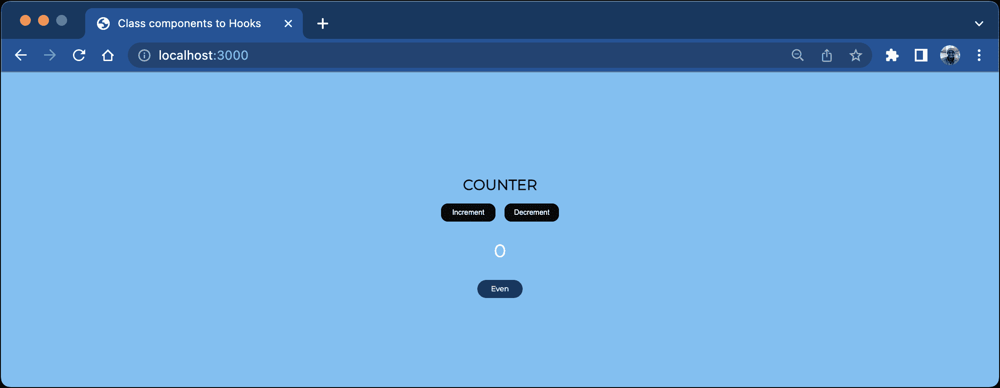
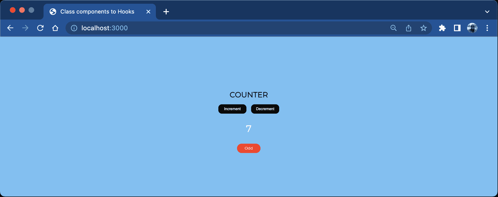
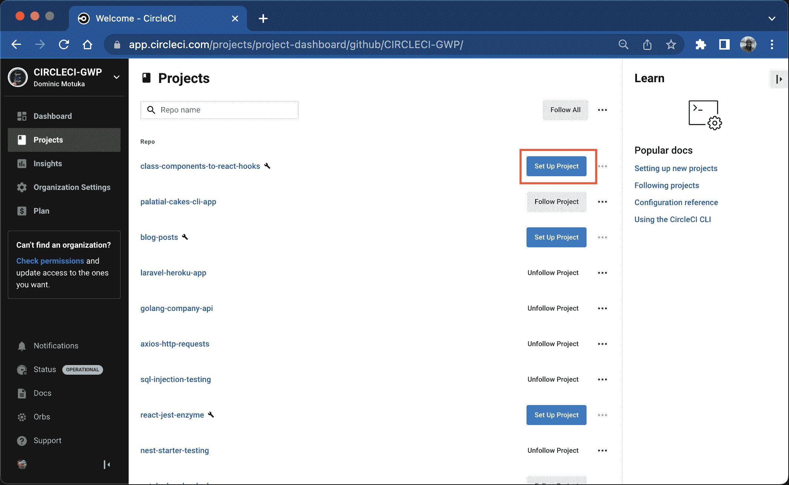
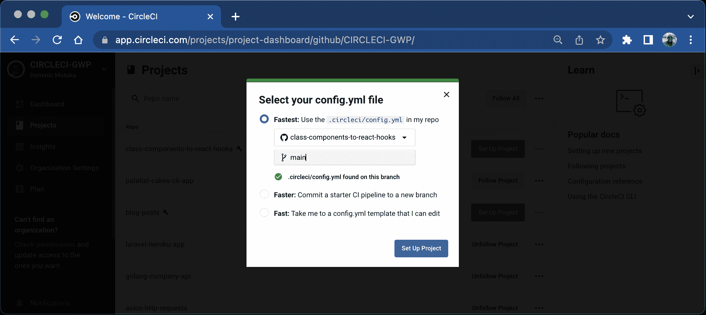
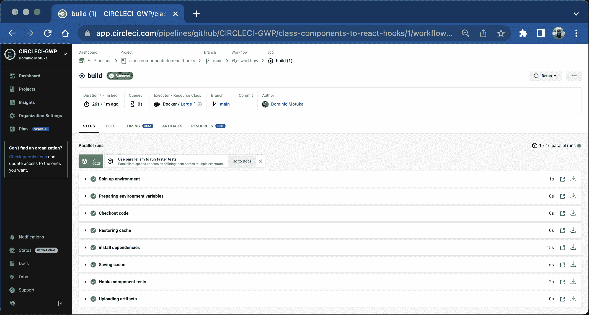
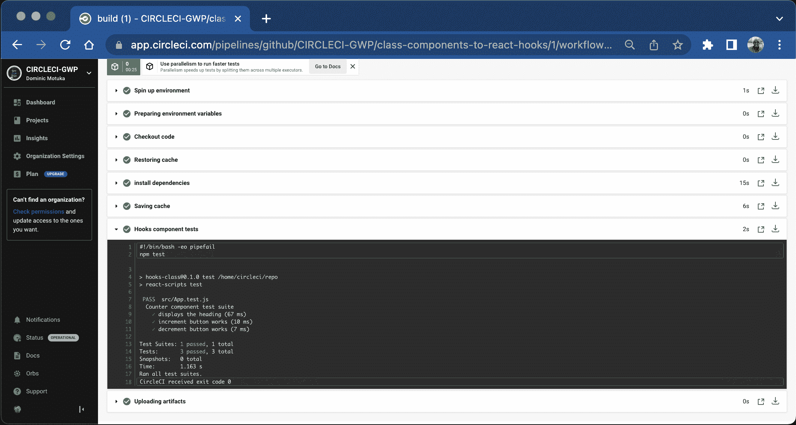

# 从类组件到反应钩子

> 原文：<https://circleci.com/blog/class-components-to-react-hooks/>

> 本教程涵盖:
> 
> 1.  如何处理钩子和类组件中的状态
> 2.  了解什么是定制挂钩
> 3.  React 挂钩的编写和自动化测试

从 16.8 版本开始， [React](https://reactjs.org/) 提供了一种使用组件和全局状态的方法，而不需要类组件。然而，这并不意味着钩子是类组件的替代品。使用类组件有一些好处，我将在本教程的后面描述。不过，首先，我将引导您了解如何处理钩子和类组件中的状态，理解什么是定制钩子，最后为钩子编写测试，并将您的应用程序集成到 CircleCI 中。

## 先决条件

要学习本教程，您需要:

> 我们的教程是平台无关的，但是使用 CircleCI 作为例子。如果你没有 CircleCI 账号，请在 注册一个免费的 [**。**](https://circleci.com/signup/)

## 钩子与基于类的组件

类组件基本上是 JavaScript 面向对象的类，带有可以用来呈现 React 组件的函数。在 React 中使用类的优点是它们包含生命周期方法，这些方法可以识别状态何时改变，并使用关键字`this.state`更新全局状态或组件状态。相比之下，钩子用于 react 功能组件，使您能够在功能组件中拥有组件状态和其他 React 特性，而不需要类。React 提供了一种无需类生命周期方法就能挂钩到全局状态的方法，用于更新应用程序的全局和局部状态。

在本节中，您将创建一个计数器组件，它利用 React 挂钩和一个类来递增和递减计数。然后，我将向您展示如何在这两者中初始化和更新状态。

您的第一步是克隆您将使用的存储库。

## 克隆存储库

在首选工作目录中的终端上，运行以下命令:

```
git clone https://github.com/mwaz/class-components-to-react-hooks.git # Clone repository

cd class-components-to-react-hooks # Change directory to the cloned repository 
```

克隆存储库之后，安装依赖项并启动应用程序。运行以下命令:

```
npm install # Install dependencies

npm start # Start the application 
```

一旦运行了`start`命令，您应该能够看到应用程序在浏览器上执行，如下所示。



这是一个简单的 React 类组件，由下面的代码片段创建:

```
// src/class.js
import React from "react";

class CounterClass extends React.Component {
  constructor(props) {
    super(props);
    this.state = { count: 0 };
  }

  increment = () => {
    this.setState({
      count: this.state.count + 1,
    });
  }
  decrement = () => {
    this.setState({
      count: Math.max(this.state.count - 1),
    });
  }
  render() {
    return (
      <div className="counter">
        <h1>COUNTER</h1>
        <div className="buttons">
          <button onClick={this.increment}>Increment</button>
          <button onClick={this.decrement}>Decrement</button>
        </div>
        <p>{this.state.count}</p>
      </div>
    );
  }
}

export default CounterClass; 
```

这个代码片段的构造函数方法将状态设置为`this.state`，并用`0`初始化计数。然后，它定义了单击按钮时调用的函数。这些函数使用`setState()`方法更新状态。这是用类更新计数器应用程序的类组件实现。接下来，我们将回顾如何使用功能组件和钩子实现相同的功能。克隆的存储库中的`src/hooks.js`包含钩子实现:

```
// src/hooks.js
import { useState } from 'react'

export default function CounterHooks() {
const [ value, setValue]= useState(0);

const handleIncrement = () => {
    setValue(value + 1)
  }
  const handleDecrement = () => {
    setValue(value - 1)
  }
  return (
    <div className="counter">
      <h1>COUNTER</h1>
      <div className="buttons">
        <button data-testid="increment" onClick={handleIncrement}>Increment</button>
        <button data-testid="decrement" onClick={handleDecrement}>Decrement</button>
      </div>
      <p data-testid="count">{value}</p>
    </div>
  );
} 
```

您可以使用`useState()`钩子来初始化状态，而不是像前面的代码片段那样使用`this.state`。`useState`钩子还能够与应用程序中的其他组件共享状态，就像使用`this.state`的类组件一样。

这些代码片段显示了代码可读性的提高。不仅消除了复杂性，而且使功能组件只做一件事——呈现计数器应用程序。既然你知道了什么是 React 钩子，为什么不探究一下 React 中最常见的钩子以及它们是如何使用的呢？

## 使用状态与使用效果挂钩

在 React 中，可以使用不同的钩子来执行操作。其中之一就是`useEffect()`钩。这个钩子帮助您处理 React 领域之外的事情，比如 API 调用、异步事件和其他副作用。一个简单的`useEffect`钩子的结构如下所示:

```
 useEffect(() => {
    //Your code here
  }, []) 
```

`useEffect`钩子所期望的第一个参数是一个回调函数，在这里编写要执行的代码。第二个是称为`dependency array`的数组`[]`。如果省略数组，回调函数将在每次代码更改时运行。如果数组为空，回调函数将运行一次。如果提供了值，回调函数将在每次值改变时运行。

**注意:** *依赖数组是一个接受依赖或变量的数组，如果值改变，回调函数会再次运行。*

接下来，尝试在简单逻辑中使用一个`useEffect()`钩子，将 count 的值记录到 Chrome 浏览器控制台。在这种情况下，您希望返回计数的值，因此您可以将该值添加到依赖数组中，如以下代码片段所示:

```
 useEffect(() => {
    console.log(value);
  }, [value]) 
```

当组件加载并且`useEffect`钩子被调用时，控制台将计数的值记录到 Chrome 浏览器控制台。每次计数值发生变化时，控制台都会记录新的计数值。

相反，`useState()`钩子是用来初始化应用程序状态的钩子。它将一个值作为参数，并返回一个包含两个值的数组。第一个值是当前状态，第二个值是可以用来更新状态的函数。

使用像`useState()`和`useEffect()`这样的 React 钩子，您可以消除像`componentDidMount()`和`componentDidUpdate()`这样的生命周期方法的使用。相反，您可以使用钩子来处理状态逻辑。

**注:***React 内置了生命周期方法。它们用于在特定操作发生时执行操作，例如渲染、挂载、更新和卸载。它们仅用于基于类的组件中。*

研究了一些钩子之后，您可以继续研究使用钩子的一些优点和缺点。

## 挂钩的优势

*   钩子不需要用`this`来绑定`click`事件的函数，也可以访问组件或全局状态中的`values`。
*   钩子使得代码更加整洁，易于阅读和测试。
*   钩子提供了更多的灵活性，它们可以被重用，尤其是在多个组件中的定制钩子。
*   有了钩子，你不需要使用生命周期方法。副作用可以用一个函数来处理。

## 挂钩的缺点

*   开始使用钩子可能是一个挑战，特别是对于一个新的开发者。
*   每次状态改变时，组件都会重新呈现，除非您使用其他挂钩来防止这种情况。

## 创建自定义挂钩

在上一节中，我描述了使用钩子的优点和缺点。在这一节中，我将引导您创建一个可以在计数器应用程序中的任何地方使用的定制钩子。将这段代码添加到`src/components/useCounter.js`文件中:

```
// src/components/useCounter.js
import { useState, useEffect } from "react";

export function useCounter() {
  const [value, setValue] = useState(0);
  const [isEven, setIsEven] = useState(false);

  useEffect(() => {
    if (value % 2 === 0) {
      setIsEven(true);
    } else {
      setIsEven(false);
    }
  }, [value]);

  const handleIncrement = () => {
    setValue(value + 1);
  };
  const handleDecrement = () => {
    setValue(value - 1);
  };

  return [value, isEven, handleIncrement, handleDecrement];
} 
```

这段代码添加了一个新的状态值`isEven`，它检查该值是否为偶数。该代码片段继续检查计数值，并确定它是偶数还是奇数。它根据值将`isEven`设置为真或假。

useEffect 钩子内部的回调函数使用一个`if - else`语句来设置`isEven`的值。它还使用依赖数组中的值来确保每次计数改变时，无论是递减还是递增，函数都会运行。

`useCounter`钩子返回状态值以及`increment`和`decrement`函数，这样您就可以在钩子组件中访问它们。

既然已经有了自定义钩子，就可以用它来设置和更新`custom-hook.js`文件中的状态:

```
// src/components/custom-hook.js
import { useCounter } from './useCounter'

export default function CounterHooks() {
const [ value, isEven, handleIncrement, handleDecrement ]= useCounter();

 return (
    <div className="counter">
      <h1>COUNTER</h1>
      <div className="buttons">
        <button data-testid="increment"  onClick={handleIncrement}>Increment</button>
        <button data-testid="decrement" onClick={handleDecrement}>Decrement</button>
      </div>
      <p data-testid="count">{value}</p>
      <div className={isEven ? "even" : "odd"}>{ isEven ? "Even" : "Odd"}</div>
    </div>
  );
} 
```

这段代码使用`useCounter()`钩子来设置状态值，并访问`increment`和`decrement`函数。它使用这些函数来更新状态。`isEven`状态值根据应用程序上显示的计数器数字显示计数器是偶数还是奇数。



既然您已经对钩子有了一些兴趣，那么是时候学习如何测试它们了。

## 测试挂钩

在这一节中，我将描述如何为 Hook 组件编写测试。您将使用 [Jest](https://jestjs.io/) 和 [react-testing-library](https://testing-library.com/docs/react-testing-library/intro/) ，它们都是在您设置克隆应用程序时安装的。

从测试按钮是否工作开始。将这段代码添加到`App.test.js`文件中:

```
// src/App.test.js
import { render, screen, fireEvent } from "@testing-library/react";
import App from "./App";

describe("Counter component test suite", () => {
  test("displays the heading", () => {
    render(<App />);
    expect(screen.getByRole("heading").textContent).toBe("COUNTER");
  });

  test("increment button works", () => {
    render(<App />);
    const count = screen.getByTestId("count");
    const incrementBtn = screen.getByTestId("increment");
    expect(count.textContent).toBe("0");
    fireEvent.click(incrementBtn);
    expect(count.textContent).toBe("1");
  });

  test("decrement button works", () => {
    render(<App />);
    const count = screen.getByTestId("count");
    const decrementBtn = screen.getByTestId("decrement");
    expect(count.textContent).toBe("0");
    fireEvent.click(decrementBtn);
    expect(count.textContent).toBe("-1");
  });
}); 
```

这个代码片段“点击”了`increment`和`decrement`按钮来检查计数值是递增还是递减。针对计数值断言的。通过在终端运行`npm test`来运行测试。

```
PASS  src/App.test.js (5.799 s)
  Counter component test suite
    √ displays the heading (432 ms)
    √ increment button works (77 ms)
    √ decrement button works (48 ms)

Test Suites: 1 passed, 1 total
Tests:       3 passed, 3 total
Snapshots:   0 total
Time:        12.097 s
Ran all test suites related to changed files. 
```

在这种情况下，测试通过了。万岁！该代码片段显示,`react-testing-library`模拟了用户在应用程序上的点击事件，并验证测试的 DOM 状态是否如这些断言中所预期的那样发生了变化。现在，您可以进入下一部分，学习如何将您的测试与持续集成管道相集成。在这种情况下，我们将使用 CircleCI。

## 积分电路

[CircleCI](https://circleci.com/docs/getting-started/) 是一个通过持续集成和持续部署(CI/CD)的原则，帮助软件团队自动构建、测试和部署的平台。

在项目的根文件夹中，创建一个`.circleci`目录，并向其中添加一个`config.yml`文件。将以下代码片段添加到配置文件中:

```
# .circleci/config.yml
version: 2.1
jobs:
  build:
    working_directory: ~/repo
    docker:
      - image: cimg/node:14.17.1
    steps:
      - checkout
      - restore_cache:
          key: dependency-cache-{{ checksum "package-lock.json" }}
      - run:
          name: install dependencies
          command: npm install
      - save_cache:
          key: dependency-cache-{{ checksum "package-lock.json" }}
          paths:
            - ./node_modules
      - run:
          name: Hooks component tests
          command: npm test
      - store_artifacts:
          path: ~/repo/class-components-to-react-hooks 
```

提交并[推送](https://docs.github.com/en/get-started/using-git/pushing-commits-to-a-remote-repository)对存储库的更改。然后进入 [CircleCI 仪表盘](https://app.circleci.com/dashboard)。

打开项目页面，该页面列出了与您的 GitHub 用户名或组织相关联的所有 GitHub 存储库。对于本教程，请点击`class-components-to-react-hooks`。选择**设置项目**。



选择使用分支`main`中现有配置的选项。



瞧啊。在 CircleCI 仪表板上，展开构建工作流详细信息，以验证所有步骤是否成功。



展开`Hooks component tests`构建步骤，验证钩子测试是否成功运行。



现在，当您对应用程序进行更改时，CircleCI 将自动运行这些测试。

## 结论

在本教程中，您已经了解了 React 挂钩及其在基于类的组件中的作用。我描述了使用钩子的利与弊，以及如何使用不同类型的钩子来获得与基于类的组件相同的结果。最后，您能够使用关于钩子的知识来编写一个定制的钩子组件。您在 counter 应用程序中使用了自定义钩子，并为它编写了测试。

我很高兴为你创建这个教程，我希望你觉得它很有价值。直到下一个，继续学习，继续建设！

* * *

Waweru Mwaura 是一名软件工程师，也是一名专门研究质量工程的终身学习者。他是 Packt 的作者，喜欢阅读工程、金融和技术方面的书籍。你可以在[他的网页简介](https://waweruh.github.io/)上了解更多关于他的信息。

[阅读更多 Waweru Mwaura 的帖子](/blog/author/waweru-mwaura/)