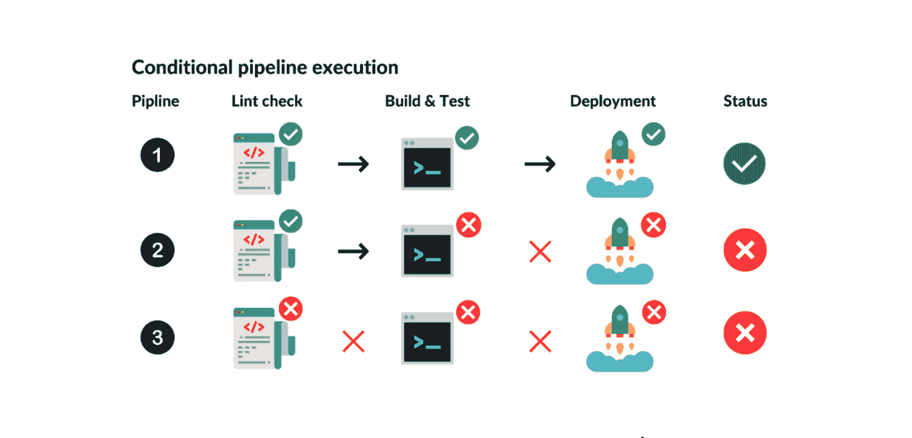
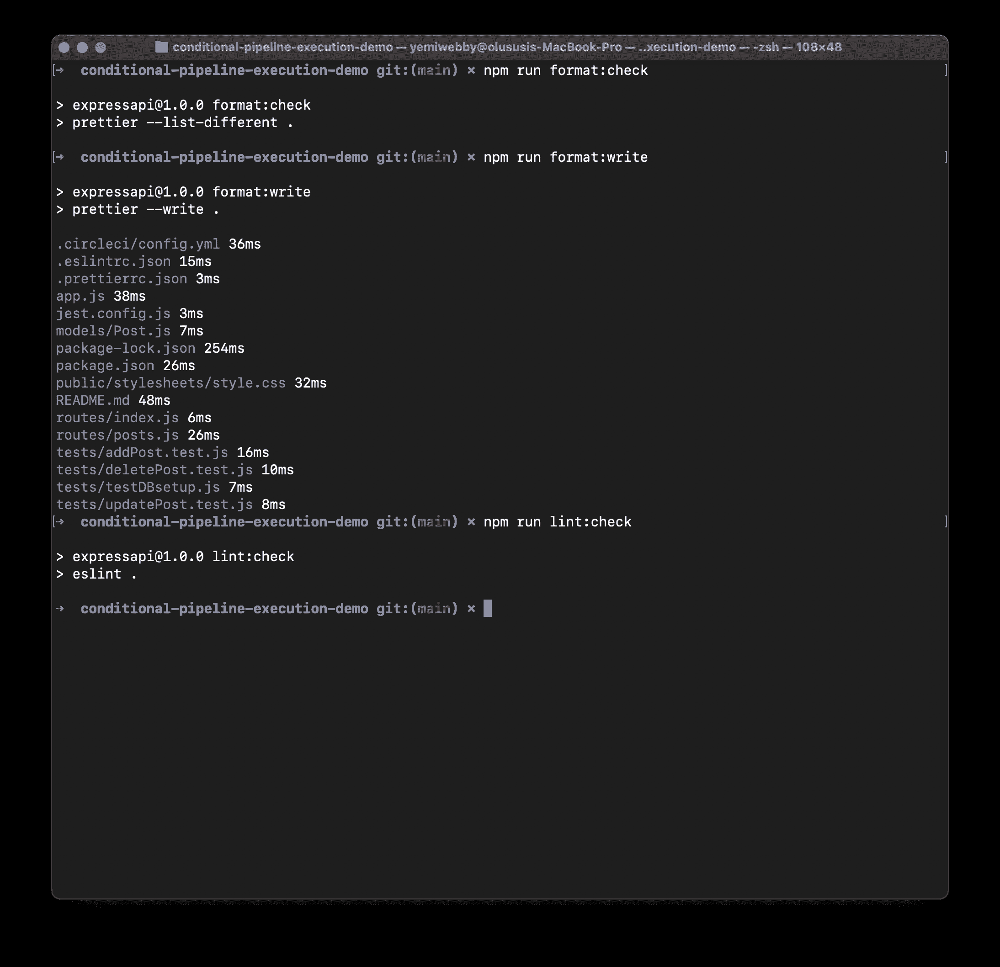
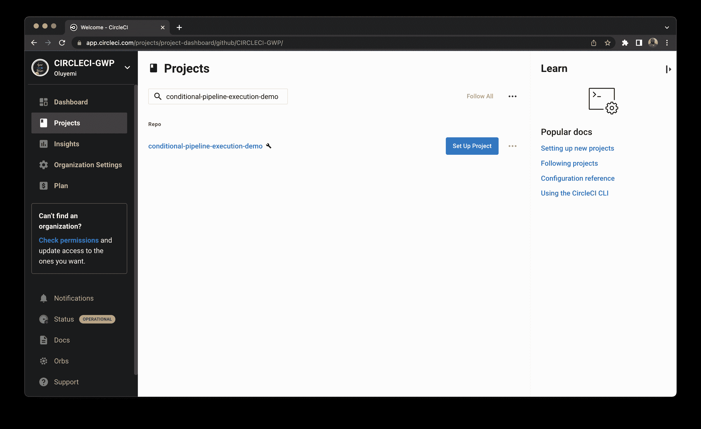
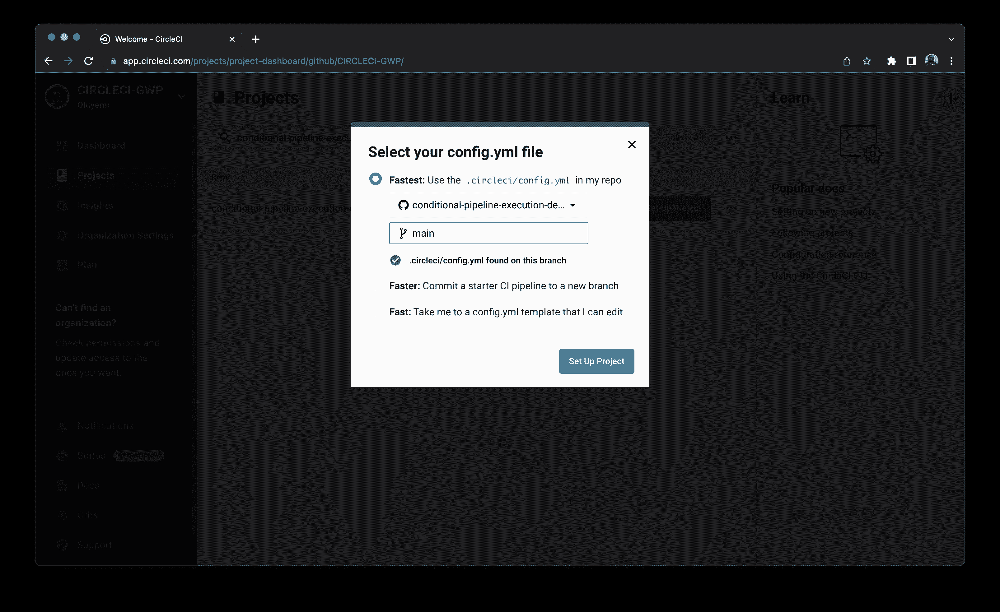
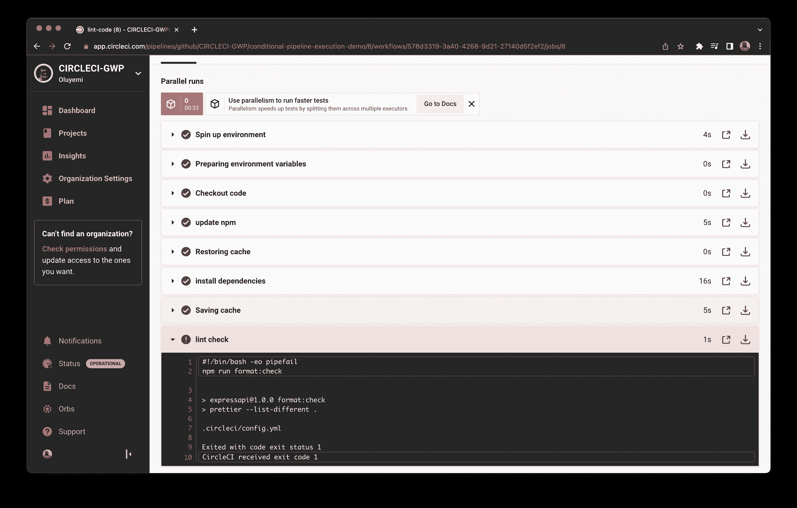
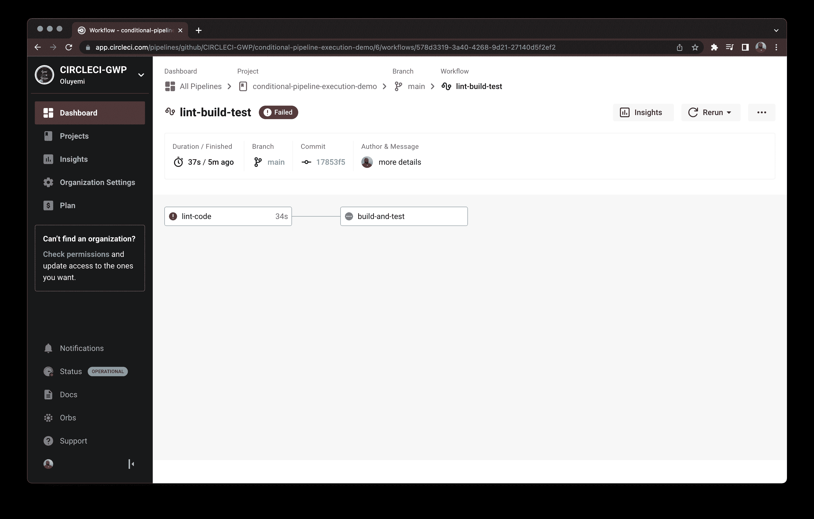
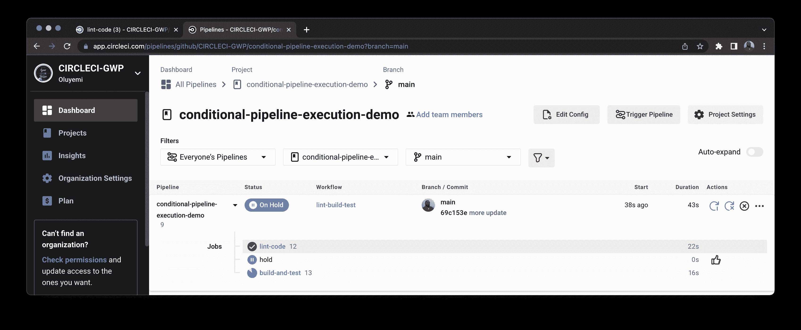
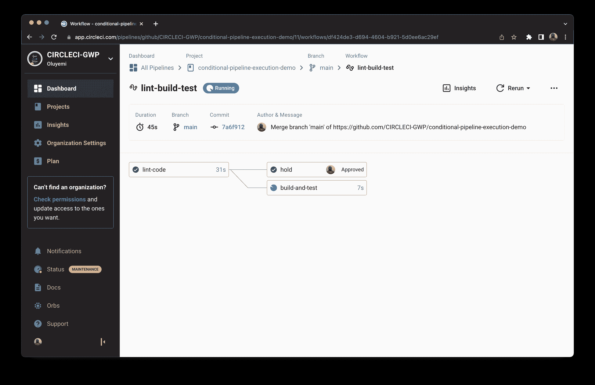
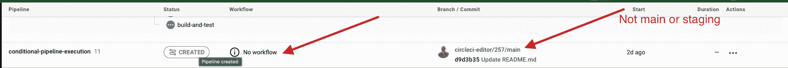
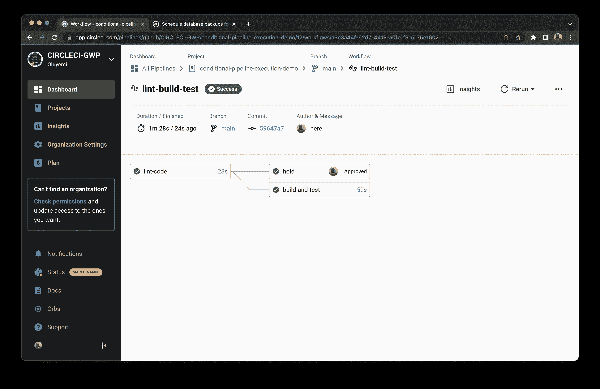

# CI/CD 管道中的条件工作流执行| CircleCI

> 原文：<https://circleci.com/blog/conditional-pipeline-execution/>

> 本教程涵盖:
> 
> 1.  什么是条件以及如何在 CI/CD 管道中使用它们
> 2.  为什么您可能希望在管道中使用条件
> 3.  如何使用条件执行设置管道配置

持续集成和持续部署(CI/CD)的 DevOps 实践改进了软件交付。CI/CD 平台监控并自动化应用程序开发流程，确保更快、更好地开发应用程序。CI/CD 管道构建代码、运行测试，并部署已通过所有自动化检查的应用程序的生产就绪版本。

由于不断需要确保流程的完整性，开发团队可能希望基于前一个作业的结果来执行管道作业。本教程将向您介绍条件管道，以及如何根据您指定的条件在 CI/CD 工作流中选择性地执行作业。我将解释如何设置管道，如何为它们的执行设置条件，以及`job A`的失败如何影响`job B`的执行并对管道的结果有所贡献。

## 先决条件

完成本教程需要以下内容:

*   系统上安装的 [Node.js](https://nodejs.org/)
*   一个[圆](https://circleci.com/signup/)的账户
*   GitHub 的一个账户
*   了解 CircleCI 管道的工作原理

具备这些先决条件后，您就可以开始学习本教程了。

## 了解条件管道执行

大多数管道由多个步骤组成，在软件的最终版本交付之前必须完成这些步骤。可以根据指定的一个或一组条件跳过一个或多个管道阶段。

为了有效，管道应该有明确定义的步骤，在进行下一步之前必须对这些步骤进行验证。下面是一个包含四个作业的管道示例:

*   `lint check`
*   `code build`
*   `testing`
*   `deployment`

每个作业都依赖于正在验证或正在成功运行的前一个作业。如果您想要部署一个已经通过所有测试的应用程序，那么您已经为您的 CI/CD 管道创建了一个**条件**。也就是说，在执行部署步骤之前，必须通过代码和构建步骤。

为了让您更好地理解条件管道执行，我创建了一个三步管道的图示。



有三条流水线，每条流水线有三个作业。在第一个管道中，验证了所有作业，管道成功。但是，在第二个管道中，第一个作业通过了，触发了构建和测试，但是第二个步骤中的失败会阻止部署作业。管道出现故障。

管道 3 与其他管道的不同之处在于，如果第一个作业失败，进程会立即停止。

## 设置 API 在测试执行前运行 lint

本节教程将演示 lint 故障如何导致管道故障。

确保您的代码具有适当的格式和林挺，为运行测试和构建提供了良好的基础。一个任务的失败(例如，如果您的代码没有正确地链接)应该阻止构建和测试阶段的触发。管道不会满足条件，会失败，这是意料之中的。

我已经为您构建了一个 API，供您在本教程中使用。您需要做的就是克隆存储库:

```
git clone https://github.com/CIRCLECI-GWP/conditional-pipeline-execution-demo.git 
```

这个命令将项目克隆到本地机器上一个名为`conditional-pipeline-execution-demo`的目录中。这应该在您克隆存储库的当前工作目录中。完成后，运行下面的命令。

**注意:** *要在 CircleCI 上运行管道，我建议您创建一个 Mongo Atlas 帐户，并根据克隆存储库的`README.md`中提供的说明进行设置。*

更改目录:

```
cd  conditional-pipeline-execution-demo 
```

安装必要的依赖项:

```
npm install 
```

安装完成后，使用以下命令启动服务器:

```
npm  start 
```

本教程的 API 现在正在您的本地机器上运行。可以通过访问`http://localhost:3000/`进行测试。

好消息:这个 API 已经正确配置了[漂亮的](https://prettier.io/)和 [ESLint](https://eslint.org/) 。lint 和更漂亮的配置在`package.json`文件中处理。还编写了一些测试。

接下来，确保存储库格式遵循配置的更漂亮的指导方针。运行以下命令启动 lint 和格式化检查:

```
npm run format:check # checks if formatting guidelines are followed 
```

用更漂亮的格式格式化所有文件:

```
npm run format:write # Writes onto formatted files applying the eslint and prettier rules 
```

Lint 代码:

```
npm run lint:check # checks if code is linted 
```



现在，您已经验证了格式和林挺按预期工作，您可以配置 CircleCI 管道，包括在满足条件时选择性地执行管道。

## CircleCI 配置文件设置

在 API 的根目录下创建一个`.circleci`目录。在其中，创建一个名为`config.yml`的空文件，并添加以下内容:

```
# CircleCI configuration file

version: 2.1
workflows:
   lint-build-test:
       jobs:
           - lint-code
           - build-and-test:
                 requires:
                     - lint-code
jobs:
   lint-code:
       docker:
           - image: cimg/node:16.13.2
       steps:
           - checkout
           - run:
                name: update npm
                command: 'sudo npm install -g npm'

           - restore_cache:
                key: dependency-cache-{{ checksum "package-lock.json" }}

           - run:
                name: install dependencies
                command: sudo npm install

           - save_cache:
                key: dependency-cache-{{ checksum "package-lock.json" }}
                paths:
                    - ./node_modules

           - run:
                 name: lint check
                 command: npm run format:check

    build-and-test:
        docker:
            - image: cimg/node:16.13.2
        steps:
            - checkout
            - run:
                    name: update npm
                    command: 'sudo npm install -g npm'

            - restore_cache:
                    key: dependency-cache-{{ checksum "package-lock.json" }}

            - run:
                    name: install dependencies
                    command: sudo npm install

            - save_cache:
                key: dependency-cache-{{ checksum "package-lock.json" }}
                paths:
                        - ./node_modules

            - run:
                    name: run tests
                    command: npm test 
```

这个`config.yml`文件有一个包含两个任务的工作流:`lint-code`和`build-and-test`。

注意在工作流定义中使用了`requires`键，它指定了`lint-code`是成功执行`build-and-test`任务所必需的。这意味着只有当第一个作业成功时，才会执行第二个作业。当第一个作业失败时，进程会自动停止，因此在这里设置一个条件。Lint 检查必须通过，我们的管道才能成功地构建和测试代码。

按照工作流程，我们将定义实际的作业。这两项工作的第一步都是指示 CircleCI 使用`node` docker 图像。然后，他们将更新节点包管理器，并使用`npm`来安装所需的依赖项。这两项工作的最后一步都是执行这三个动作:`lint`、`check`、`test`。该配置还使用`restore_cache`和`save_cache`步骤来缓存依赖项，然后恢复它们。这些步骤大大减少了执行管道所需的时间。

## 将代码推送到 GitHub

**注意:** *如果您克隆了存储库，那么变更已经存在于存储库中，因此这是一个可选的步骤。如果您正在使用不同的存储库和相同的配置，您将需要将更改推送到该存储库。*

保存您的工作，提交并推送更改到 GitHub 存储库。从 [CircleCI 仪表板](https://app.circleci.com/projects/project-dashboard/github/circleci/)项目部分，点击库名称旁边的**设置项目**。



当你被提示时，使用`main`，这是我们默认的分支。然后点击**设置项目**开始在 CircleCI 上运行项目。



CircleCI 仪表板将显示该构建失败，这是意料之中的。这完美地向我们介绍了本教程的下一节，关于管道的条件执行。

## 管道的条件执行

由于我们有意引入的 lint 问题，我们的构建失败了。为了使管道有效，您需要能够在一组条件不满足时停止它。如果测试失败，或者当项目的林挺失败时，您应该能够终止部署。

*   管道中的`lint check`步骤显示了一个步骤中的故障如何级联到管道的其余部分。CircleCI 跳过了运行我们的测试，因为它在执行来自我们的`package.json`文件中的命令`npm run format:check`时遇到了一个故障。成功完成那项工作是`the build-test`工作的要求。
*   `format:check`命令运行`prettier --list-different .`命令，验证所有文件是否使用了更漂亮的配置。如果发现与配置不匹配的文件，就会抛出异常。当遇到未打印的文件时，会在 CI 上抛出异常，并且管道会失败。



由于 lint 失败而导致的管道故意失败，意味着您现在可以验证，如果在运行不是并行运行时某个步骤失败，后续步骤将不会执行，并且管道将会失败。在这种情况下，我们已经在代码片段的配置中明确声明了这一点:

```
# congig.yml line 6, 7, and 8
- build-and-test:
    requires:
      - lint-code 
```



现在，您已经配置了一个管道，只在满足特定条件时运行特定的作业。您还可以编写并行管道，每个管道都有一组不同的条件。CircleCI 可以很容易地解释这一点，并正确地执行您的管道。

## 高级条件执行

在这一节中，我将提供更多关于根据条件设置运行或不运行管道的细节。本节涵盖:

*   为手动批准保留工作流
*   使用“when”和“or”逻辑语句

### 为手动批准保留工作流

我们可以配置工作流，要求在进入下一个作业之前进行手动作业批准。任何拥有回购推送权限的人都可以通过点击“批准”按钮来批准暂停的工作流程，从而恢复工作流程。

我们已经建立了一个工作流程。您可以通过将带有关键字`type: approval`的作业添加到作业列表来修改它。

```
workflows:
  lint-build-test:
    jobs:
      - lint-code
      - hold:
          type: approval
          requires:
            - lint-code

      - build-and-test:
          requires:
            - hold 
```

这段代码向名为`hold`的工作流添加了一个新任务。`type: approval`是将暂停工作流的键值对。在现实世界中，您可以出于获得 QA 或部署经理的批准或手动防止意外部署等目的而保留管道。使用`requires`键在`hold`任务中设置一个条件，当`lint-code`成功时运行它。在`hold`作业被批准后，任何需要它的后续作业将运行。然后，用户可以手动继续构建和测试作业。

将这些更改提交给 GitHub。在 CircleCI 仪表板上，第一个作业执行，然后挂起并等待批准。



点击仪表板上的**暂停**选项卡，进入下一步，其中包括工作流程的可视化表示。点击**保持**框，然后在弹出窗口中批准作业。



作业获得批准后，工作流恢复，后续作业可以运行。

### 使用逻辑语句控制管道执行

除了使用`requires`关键字定义工作流条件之外，还可以将`when`子句与逻辑语句结合使用。当逻辑语句用于`when`子句时，它们解析为`true`或`false`值。在此示例中，您将修改之前的工作流，并仅在修改临时分支或主分支时执行该工作流。进行如下代码块所示的更改:

```
workflows:
  lint-build-test:
    when:
      or:
        - equal: [main, << pipeline.git.branch >>]
        - equal: [staging, << pipeline.git.branch >>]
    jobs:
      - lint-code
      - hold:
          type: approval
          requires:
            - lint-code
      - build-and-test:
          requires:
            - hold 
```

`when`和`or`子句设置了一个条件，阻止工作流`lint_build_test`运行，除非工作流在分支`staging`或`main`上。

现在，如果您在任何其他分支上运行它，工作流将无法执行。



使用这些标志，您可以提供诸如“发布只能在发布分支上进行”或“部署只能在主分支上进行”之类的规则，以避免意外的生产前部署。

## 验证成功构建

现在，您已经知道如何编写条件管道以及条件如何影响管道结果，是时候解决林挺问题并将代码推送到 GitHub 了。进行更改后，您的管道会成功执行，并且`lint-code`和`build-and-test`作业也会成功执行。



瞧啊。您的管道现在是绿色的。它运行 lint-check 管道，然后继续构建和测试代码。在这种庆祝模式下，是时候结束本教程了。

## 结论

在本教程中，您了解了条件管道以及如何构建它们。您在 CircleCI 管道中执行了一个作业，条件是第一个作业必须在第二个作业执行之前通过。您甚至尝试了一些更高级的概念:持有工作流并使用`when`和`or`语句。您有第一手的经验，即一个作业的失败会导致连锁故障，从而关闭整个管道。您还学习了如何通过内置的 CircleCI 特性实施控制。并且您能够观察到您的条件管道成功执行。我希望你喜欢这个教程，并发现它很有用。直到下次，继续学习！

* * *

Waweru Mwaura 是一名软件工程师，也是一名专门研究质量工程的终身学习者。他是 Packt 的作者，喜欢阅读工程、金融和技术方面的书籍。你可以在[他的网页简介](https://waweruh.github.io/)上了解更多关于他的信息。

[阅读更多 Waweru Mwaura 的帖子](/blog/author/waweru-mwaura/)