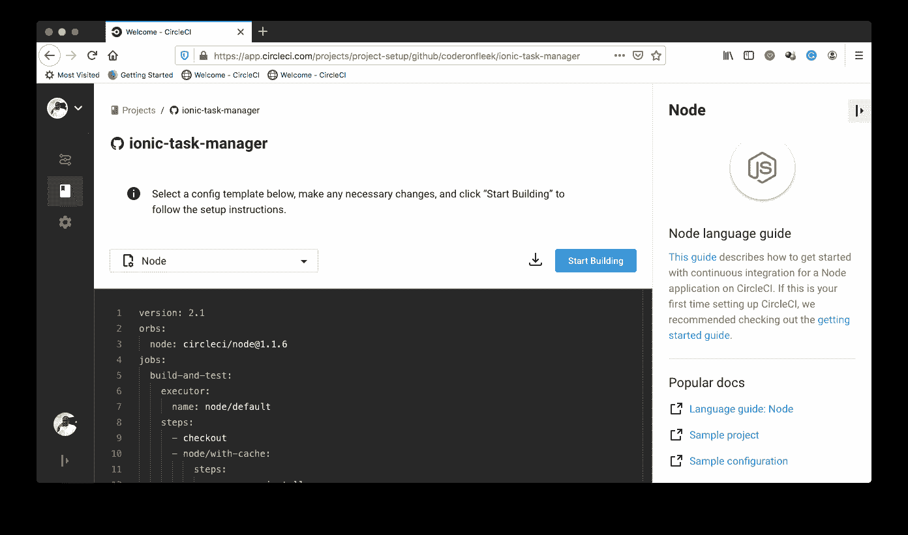
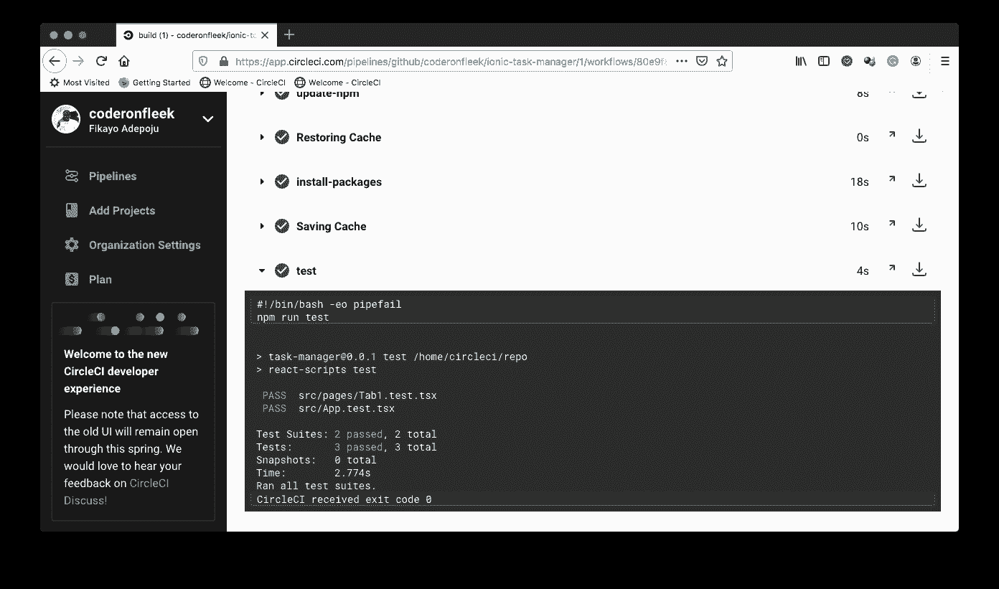

# 离子应用的| CircleCI

> 原文：<https://circleci.com/blog/continous-integration-for-ionic-apps/>

在混合移动开发的世界中，没有其他框架比 Ionic 框架对行业的贡献更大。Ionic 创建于 2013 年，最初建立在 [Angular.js](https://angularjs.org/) 和 [Apache Cordova](https://cordova.apache.org/) 的基础上，现已发展成为一个功能齐全的应用框架，用于开发移动、桌面和[渐进式网络应用](https://web.dev/progressive-web-apps/)。Ionic 也变得与框架无关，允许开发人员使用 [Angular.js](https://angular.io/) 、 [React.js](https://reactjs.org/) 或 [Vue.js](https://vuejs.org/) 进行开发。

在本教程中，我们将建立一个方便的任务管理器。我们将为应用程序中的特性编写测试，并建立一个[持续集成](https://circleci.com/continuous-integration/) (CI)管道来自动化我们的开发和测试。我们将使用 [Ionic React](https://ionicframework.com/react) 开发我们的应用程序，Ionic 版本支持使用 [React.js](https://reactjs.org/) 开发。

## 先决条件

要跟进这篇文章，需要做一些事情:

1.  React.js 的基础知识(不是一个交易破坏者，您只需要复制粘贴代码片段)
2.  系统上安装的 [Node.js](https://nodejs.org)
3.  安装在您系统上的 [Ionic CLI](https://ionicframework.com/docs/cli)
4.  一个[圆](https://circleci.com/)的账户

## 搭建离子应用平台

首先，让我们通过运行以下命令来构建一个新的 Ionic 应用程序:

```
ionic start task-manager tabs --type=react 
```

这将立即触发 Ionic CLI 使用名为`task-manager`的文件夹中的`tabs`模板为我们搭建一个新项目。

**注意:** *你可能会在某个时候被提示`Create free Ionic account?`。点击`n`拒绝。关于创建 Ionic 账户的更多信息，请参见[此处](https://ionicframework.com/appflow)。*

完成后，进入应用程序的根目录(`cd task-manager`)，运行以下命令在您的 web 浏览器中为应用程序提供服务:

```
ionic serve 
```

此命令完成后，您将在浏览器中看到一个类似于下图的应用程序视图。

**注:** *我用的是 Chrome 开发工具中激活的移动预览。*


如果你的字体是黑色背景和白色字体，不要惊讶。它使用您机器的默认模式。

## 构建任务管理器应用程序

接下来，让我们开始构建主应用程序。进入应用程序的`src/pages`文件夹，打开`Tab1.tsx`文件。这是新搭建的应用程序的默认主页。删除该文件中的所有内容，并替换为以下代码:

```
// src/pages/Tab1.tsx

import React, { useState } from "react";
import {
  IonContent,
  IonHeader,
  IonPage,
  IonTitle,
  IonToolbar,
  IonList,
  IonItemSliding,
  IonItem,
  IonLabel,
  IonItemOptions,
  IonItemOption,
  IonFab,
  IonFabButton,
  IonIcon,
  IonModal,
  IonButton,
  IonCard,
  IonCardContent,
  IonInput,
} from "@ionic/react";

import { add } from "ionicons/icons";

import "./Tab1.css";

interface Task {
  id: number;
  name: string;
}

const Tab1: React.FC = () => {
  const [tasks, setTasks] = useState<Task[]>([]);
  const [showModal, setShowModal] = useState(false);
  const [taskName = "", setTaskName] = useState<string>();

  function addNewTask() {
    const new_id = tasks.length + 1;

    const newTask = {
      id: new_id,
      name: taskName,
    };

    tasks.push(newTask);

    setTasks(tasks);

    setTaskName("");

    setShowModal(false);
  }

  return (
    <IonPage>
      <IonHeader>
        <IonToolbar>
          <IonTitle>Task Manager</IonTitle>
        </IonToolbar>
      </IonHeader>
      <IonContent>
        <IonList>
          {tasks.length > 0 ? (
            tasks.map((item: Task) => {
              return (
                <IonItemSliding key={item.id}>
                  <IonItem className="todo-item">
                    <IonLabel>{item.name}</IonLabel>
                  </IonItem>
                  <IonItemOptions side="end">
                    <IonItemOption onClick={() => {}}>Done</IonItemOption>
                  </IonItemOptions>
                </IonItemSliding>
              );
            })
          ) : (
            <IonItem>
              <IonLabel>You have yet to add tasks for today</IonLabel>
            </IonItem>
          )}
        </IonList>

        {/* Modal*/}
        <IonModal isOpen={showModal}>
          <IonCard>
            <IonItem>
              <IonLabel>Add New Task</IonLabel>
            </IonItem>

            <IonCardContent>
              <IonItem>
                <IonInput
                  value={taskName}
                  placeholder="Enter Task Name..."
                  onIonChange={(e) => setTaskName(e.detail.value!)}
                ></IonInput>
              </IonItem>

              <IonButton
                expand="full"
                color="primary"
                onClick={() => addNewTask()}
              >
                Add Task
              </IonButton>
            </IonCardContent>
          </IonCard>
          <IonButton onClick={() => setShowModal(false)}>Close Modal</IonButton>
        </IonModal>

        {/* Add Task Button */}
        <IonFab vertical="bottom" horizontal="end" slot="fixed">
          <IonFabButton onClick={() => setShowModal(true)}>
            <IonIcon icon={add} />
          </IonFabButton>
        </IonFab>
      </IonContent>
    </IonPage>
  );
};

export default Tab1; 
```

现在我们来看一下上面的代码片段。这是我们的任务管理器应用程序的全部代码。

我们首先导入必要的依赖项，包括页面的 css 文件。然后我们定义一个接口来定义我们的任务对象。

```
interface Task {
  id: number;
  name: string;
} 
```

接下来，我们将我们的组件创建为 React function 组件类型`React.FC`，并通过使用钩子定义我们想要在状态中保存的数据来开始该功能:一个由`Task`组成的`tasks`数组，一个用于控制任务创建表单的打开和关闭的`showModal`布尔值，以及一个在创建过程中保存新任务值的`taskName`。

```
const [tasks, setTasks] = useState<Task[]>([]);
const [showModal, setShowModal] = useState(false);
const [taskName = "", setTaskName] = useState<string>(); 
```

接下来是我们调用的添加新任务的函数。该函数通过根据数组的长度设置其`id`来创建一个新任务，并在将新任务添加到我们现有的任务列表后清除表单。

```
function addNewTask() {
  const new_id = tasks.length + 1;

  const newTask = {
    id: new_id,
    name: taskName,
  };

  tasks.push(newTask);

  setTasks(tasks);

  setTaskName("");

  setShowModal(false);
} 
```

接下来，我们呈现我们的模板以显示我们的任务列表，并且当任务列表为空时，还显示一条有帮助的消息，内容为`You have yet to add tasks for today`。

列表后面是一个模态组件，它包含用于添加新任务的任务表单。组件下面是一个浮动的操作按钮，用户单击它可以打开模式。

在预览之前，打开与`Tab1.tsx`位于同一文件夹中的`Tab1.css`，并用以下代码替换其内容:

```
/* src/pages/Tab1.css */

.todo-item {
  --min-height: 70px;
  font-size: 1.2em;
} 
```

这只是增加了列表项的高度和字体大小。

现在，进入你的浏览器，加载你的应用程序的主页(Tab1)。您将看到下面显示的页面。


因为我们还没有添加任何任务，所以会显示消息**您还没有添加今天**的任务。右下角还有我们的**添加任务**按钮，带有`plus`符号。

## 添加任务

要添加新任务，请单击右下角的蓝色按钮，弹出任务创建表单，然后键入一个任务，如下所示。


点击**添加任务**添加任务，并继续添加 2 到 3 个任务。现在我们应该在页面上有足够的任务来让我们的应用程序看起来正常。


太好了！

现在我们有了一个功能应用程序。不是生产就绪，但足够好，可以开始测试。

## 向任务管理器应用程序添加测试

我们测试 Ionic 应用程序的一个优势是，在搭建应用程序的同时，Ionic CLI 已经设置了应用程序测试所需的所有包和配置。

使用 [Jest](https://jestjs.io/) 测试框架以及 [React 测试库](https://testing-library.com/docs/react-testing-library/intro)和 [Ionic React 测试实用程序库](https://github.com/ionic-team/ionic-react-test-utils)来测试 Ionic React 应用程序，这是一个小的实用程序套件，用于模拟 Ionic 中的常见功能，如触发定制的 Ionic 事件。

该项目已经在`src`文件夹中为`App.tsx`文件提供了一个测试文件。正如您可能已经猜到的，测试文件被命名为`App.test.tsx`，它遵循 Jest 测试的惯例。

```
// src/App.test.tsx

import React from "react";
import { render } from "@testing-library/react";
import App from "./App";

test("renders without crashing", () => {
  const { baseElement } = render(<App />);
  expect(baseElement).toBeDefined();
}); 
```

该测试只是检查应用程序是否正确呈现并且没有崩溃。

若要运行此测试，请运行以下命令:

```
npm run test 
```

这将调用`jest`命令来运行文件中定义的测试。按照指示，按下`a`运行所有测试。上面的命令是我们将用来运行应用程序中所有测试的命令。

现在，让我们添加一些我们自己的测试。我们将创建一个测试文件来测试我们的应用程序所在的`Tab1.tsx`文件中的应用程序逻辑。

在`src/pages`文件夹中创建一个名为`Tab1.test.tsx`的文件。也是`Tab1.tsx`文件所在的地方。在新创建的文件中，放置以下代码:

```
// src/pages/Tab1.test.tsx

import React from "react";
import { render } from "@testing-library/react";
import Tab1 from "./Tab1";

test("Page title is Task Manager", async () => {
  const { findByText } = render(<Tab1 />);
  await findByText("Task Manager");
});

test("When there are no Tasks, inform the user that no tasks have been created", async () => {
  const { findByText } = render(<Tab1 />);
  await findByText("You have yet to add tasks for today");
}); 
```

在这个文件中，我们添加了两个测试。第一个测试检查我们的页面是否显示了正确的标题，即**任务管理器**。第二个测试检查我们的应用程序最初加载时是否没有任务，如果有，它显示消息**您还没有为今天添加任务**。

太好了！

现在，让我们通过在项目的根目录下运行以下命令来运行这些测试:

```
npm run test 
```

您将在命令行界面上看到一个类似于下图的屏幕。


太棒了。

现在，我们已经按照预期运行了我们的测试。

## 自动化我们的测试

我们的最终任务是自动化我们的持续集成过程。为此，我们将采取以下措施:

1.  向我们的项目添加一个配置脚本，以便在 CircleCI 上设置 CI 管道
2.  将我们的项目推到 GitHub 库
3.  为我们的应用程序创建 CircleCI 项目
4.  在 CircleCI 上运行 CI 管道

我们开始吧。

首先，让我们将 CI 管道的配置文件添加到项目中。

在项目的根目录下，在`.circleci`文件夹中创建一个`config.yml`文件。在`config.yml`文件中，输入以下代码:

```
version: 2.1
jobs:
  build:
    working_directory: ~/repo
    docker:
      - image: cimg/node:12.16
    steps:
      - checkout
      - run:
          name: update-npm
          command: "sudo npm install -g npm@5"
      - restore_cache:
          key: dependency-cache-{{ checksum "package-lock.json" }}
      - run:
          name: install-packages
          command: npm install
      - save_cache:
          key: dependency-cache-{{ checksum "package-lock.json" }}
          paths:
            - ./node_modules
      - run:
          name: test
          command: npm run test 
```

这个配置获取一个 Node.js 映像，并安装在`package.json`中定义的所有依赖项。一旦安装完成，就执行测试脚本`npm run test`来运行我们应用程序中的所有测试。

我们的管道配置文件准备就绪。

接下来，提交您的所有更改，并将项目推送到 GitHub 帐户上的 GitHub 存储库，该帐户连接到您的 CircleCI 帐户。

下一步是将我们的项目的存储库设置为 CircleCI 项目。

在 CircleCI 控制台上，转到**添加项目**页面添加项目:


点击**设置项目**。这将加载下一个屏幕。



在设置页面上，点击**开始构建**。在构建开始之前，您会得到一个提示，要么下载并使用所提供的 CircleCI 配置文件，并将它放在一个单独的分支上，要么手动设置一个。


选择**手动添加**继续。这将提示另一个对话框，检查确认您已经设置了配置文件，可以开始构建了。


点击**开始构建**完成设置。这将使用我们项目中的配置文件立即触发管道。

构建运行完成后，您将获得一个成功的构建。


点击**构建**查看幕后流程(我已经折叠了*测试*步骤)。



从上面的屏幕可以看出，我们的项目设置正确，所有的测试都运行良好。

现在，随着你的开发，你所要做的就是添加更多的功能，给它们添加测试，然后推送到 GitHub。一旦您推送，CI 管道将会运行，并且您的所有测试都将被执行。如果任何测试失败，您的构建将失败，这将表明您的应用程序中有一个需要修复的 bug。

这将确保您不会将任何错误推入您的应用程序。

## 结论

在本文中，我们为 Ionic 应用程序建立了一个自动化 CI 管道，通过自动化测试过程来改进我们的开发工作流程。拥有一个能够正确运行我们的测试的 CI 管道，可以通过确保我们不会以失败的应用程序而告终，或者在一起工作于一个项目时，我们不会将有问题的代码推送到我们团队的存储库中，来保护我们自己。

快乐编码:)

* * *

Fikayo Adepoju 是 LinkedIn Learning(Lynda.com)的作者、全栈开发人员、技术作者和技术内容创建者，精通 Web 和移动技术以及 DevOps，拥有 10 多年开发可扩展分布式应用程序的经验。他为 CircleCI、Twilio、Auth0 和 New Stack 博客撰写了 40 多篇文章，并且在他的个人媒体页面上，他喜欢与尽可能多的从中受益的开发人员分享他的知识。你也可以在 Udemy 上查看他的视频课程。

[阅读 Fikayo Adepoju 的更多帖子](/blog/author/fikayo-adepoju/)