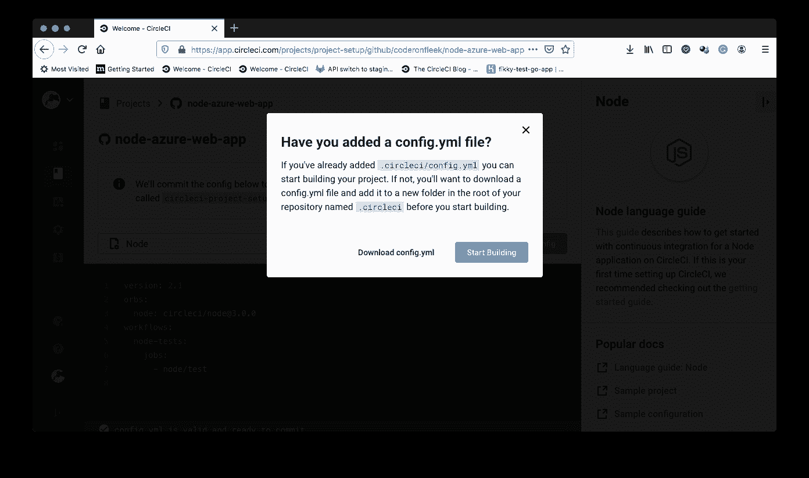

# Azure web apps | CircleCI 的持续部署

> 原文：<https://circleci.com/blog/continuous-deployment-for-azure-web-apps/>

在过去的十年里， [Azure](https://azure.microsoft.com/en-us/) 已经成为可用的最杰出的云计算平台之一，只有 [AWS](https://aws.amazon.com/) 可以与之匹敌。作为微软 Azure 服务套件的一部分，Azure web apps 为托管用多种语言构建的 web 应用程序提供了一个打包的环境。因为这个环境完全由 Azure 管理，所以开发人员的控制选项有限。其中一个限制涉及到将应用程序部署到托管环境的过程，它只允许连接远程存储库，而 Azure 接管整个部署过程。

在本教程中，您将学习如何在 Azure web 应用程序的部署工作流中构建一个自定义管道，重新获得对该过程的完全控制，以便您可以在部署之前运行测试。

## 先决条件

要跟进这篇文章，需要做一些事情:

1.  您系统上安装的 [Node.js](https://nodejs.org) (版本> = 10.3)
2.  一个蓝色的账户
3.  一个[圆](https://circleci.com/signup/)的账户
4.  GitHub 的一个账户

安装并设置好所有这些之后，是时候开始本教程了。

首先，我们将使用以下策略来创建自定义部署:

*   将我们的项目推到远程存储库
*   在 Azure 的存储库上创建一个特定的部署分支，用于触发部署
*   构建到主分支的管道以运行测试
*   如果测试通过，自动推送到 Azure 的部署分支，以获取更改并部署应用程序

简单吧？

## 创建 Azure web 应用程序

转到您的 Azure 门户仪表板，单击**创建资源**以创建新的服务实例。从**热门**列表中，点击**网页应用**。您也可以使用搜索框。


在**创建 Web 应用**页面上，选择 Azure 订阅和资源组。资源组是一种标记相关 Azure 服务的方式。您可以创建一个新组或从页面上的列表中选择一个组。

接下来，转到**实例细节**部分，输入您的 web 应用程序的名称。默认的. azurewebsites.net 地址在 Azure 中必须是唯一的。此外，确保名称遵循标准的 URL 命名规则。对于本教程，使用名称`node-api`。

填写下一组选项:

*   `Publish`:代码
*   `Runtime stack`:节点 12 LTS(因为我们将托管一个 [Node.js](https://nodejs.org) 应用程序)
*   `Operating System` : Linux
*   `Region`:选择离您最近的一个或任何首选选项(教程为`Central US`)


保留其余选项的默认值。

点击**审核+创建**。在**审核**页面，确认您选择的选项，然后点击**创建**。Azure 将开始设置我们的 web 应用环境。该过程完成后，您将被引导至您的 web 应用仪表板。如果没有，点击**转到资源**。

## 设置 Node.js 项目

接下来，我们需要克隆我们想要测试的项目，并将其部署到我们刚刚创建的 web 应用程序中。对于本教程，我们使用一个带有单个端点的基本 Node.js API，它返回一组`todo`对象。我们的项目还包含一个用于测试端点的测试套件。在系统上为项目选择一个位置，然后运行:

```
git clone --single-branch --branch base-project https://github.com/coderonfleek/node-azure-web-app.git 
```

将项目克隆到您的系统后，转到项目的根目录并安装依赖项:

```
cd node-azure-web-app
npm install 
```

您现在可以使用`npm start`命令运行应用程序。该命令在地址`http://localhost:1337`启动应用程序。一旦应用程序启动并运行，将您的浏览器指向`http://localhost:1337/todos`，您将找到`todos`的列表。


使用`Ctrl + C`在命令行停止应用程序。

运行应用程序测试:

```
npm run test 
```

CLI 中的输出将显示测试已经通过。


接下来，在项目的根目录下运行`rm -rf .git`命令来删除任何包含的`.git`历史。[将项目推至 GitHub](https://circleci.com/blog/pushing-a-project-to-github/) 。确保这是连接到您的 CircleCI 帐户的 GitHub 帐户。

转到您的远程存储库并创建一个`deploy`分支。


这个分支将致力于连接到 Azure web apps 的部署。

## 将部署分支连接到 Azure

我们需要做一些设置，以便当新的更改被推送到这个分支时，Azure 将触发部署。返回您的 web 应用程序页面，点击**部署中心**。

**注意:** *不要使用标有预览的菜单。*

在**部署中心**页面，选择 **GitHub** ，然后点击页面下方的**授权**。

接下来，从构建提供者部分选择**应用服务构建服务**，并点击**继续**。系统会提示您选择 GitHub 用户、组织和分支机构。


点击**继续**进入总结页面。点击**完成**完成该过程。然后，Azure 会将应用程序初步部署到 web 应用程序中。完成后，访问 web 应用程序 URL 上的`/todos`端点。从 Azure 网页上，当你点击**浏览**时，可以访问 URL。


## 在 CircleCI 建立项目

现在，转到 CircleCI 仪表板上的**项目**页面。


点击**设置项目**。


在设置页面上，点击 **Use Existing Config** 表示您正在手动添加一个配置文件，而不是使用样本。将提示您下载管道的配置文件或开始构建。



点击**开始建造**。此构建将失败，因为您尚未设置配置文件。

## 配置对 GitHub 的写访问

部署策略的最后一步是在测试通过后自动推进到`deploy`分支。要做到这一点，您需要对 GitHub 存储库进行经过验证的写访问。幸运的是，CircleCI 提供了添加一个`User API Key`来实现这一点的方法。在你的项目上，进入**项目设置- > SSH 密钥**。在**用户密钥**部分，点击**授权 GitHub** 进行连接。


一旦 CircleCI 和 GitHub 连接，一个**添加用户密钥**按钮被添加到用户 API 密钥部分。单击此按钮生成一个“指纹”，以后可以在部署管道中使用。复制并保存在安全的地方。

因为指纹将与您的 GitHub 电子邮件和用户名一起在管道脚本中使用，所以将它们放在环境变量中更安全。在项目设置的侧菜单上，点击**环境变量**并添加这三个环境变量:

*   `GITHUB_EMAIL`:您连接的 GitHub 账户的电子邮件
*   `GITHUB_USERNAME`:你的 GitHub 用户名
*   `GITHUB_FINGERPRINT`:之前生成的认证指纹

## 编写测试和部署脚本

最后，是时候编写部署脚本了。这个脚本有四个部分:

*   主分支机构的结帐代码
*   安装应用程序依赖项
*   运行测试
*   将更新推送到`deploy`分支

为了处理最后一步，我们将使用一个`npm` userland 模块在`package.json`中编写一个`deploy`脚本。使用该模块允许我们避免在管道脚本中执行原始的`git`操作。将使用 [gh-pages](https://www.npmjs.com/package/gh-pages) 包。通常这个包在通过将文件推送到一个专用的`gh-pages`分支来将静态站点部署到 [GitHub 页面](https://pages.github.com/)时使用。幸运的是，这个包很容易配置，可以将文件从一个分支推送到任何一个存储库中的另一个分支。

将此软件包安装在项目的根目录下:

```
npm install gh-pages --save-dev 
```

接下来，在`package.json`文件中添加`deploy`脚本:

```
"scripts" : {
  ...
  "deploy" : "npx gh-pages -b deploy --message '[skip ci] Updates' -d ./"
} 
```

这个脚本调用`gh-pages`，使用`npx`将文件从`main`分支推送到`deploy`分支。添加了`[skip ci] Updates`的`--message`参数，以便在将更改推送到该分支时，CircleCI 不会重新运行管道。

现在，您可以开始编写管道脚本了。在项目的根目录下，创建一个名为`.circleci`的文件夹，并在其中创建一个名为`config.yml`的文件。在`config.yml`文件中，输入:

```
version: 2.1
jobs:
  build:
    working_directory: ~/repo
    docker:
      - image: circleci/node:10.16.3
    steps:
      - checkout
      - run:
          name: update-npm
          command: "sudo npm install -g npm@5"
      - restore_cache:
          key: dependency-cache-{{ checksum "package-lock.json" }}
      - run:
          name: install-packages
          command: npm install
      - save_cache:
          key: dependency-cache-{{ checksum "package-lock.json" }}
          paths:
            - ./node_modules
      - run:
          name: Run tests
          command: npm run test
      - run:
          name: Configure Github credentials
          command: |
            git config user.email $GITHUB_EMAIL
            git config user.name $GITHUB_USERNAME
      - add_ssh_keys:
          fingerprints:
            - $GITHUB_FINGERPRINT
      - run:
          name: Deploy to Azure Web App
          command: npm run deploy 
```

以下是该文件中发生的情况:

*   首先提取一个合适的映像，并将代码签出到工作目录中
*   安装依赖项并缓存`node_modules`文件夹。
*   `npm run test`被调用来运行项目测试。如果测试通过，使用适当的环境变量配置 GitHub 凭证，并通过 fingerprint 环境变量添加`ssh`键
*   最后，运行`npm run deploy`调用`deploy`脚本将更改推送到`deploy`分支，以便 Azure 获取应用程序并将其部署到 web 应用程序。

为了显示我们的应用程序的变化，向`todos.js`中的数组再添加一个`todo`对象:

```
module.exports = [
  ......,
  {
    id: 4,
    task: "Make Dinner"
  }
]; 
```

接下来，更新`__tests__/apiTest.js`中的测试套件，检查四个`todo`对象是否从集合中返回:

```
expect(res.body.length).toBe(4); 
```

保存对项目的更改，并提交到远程存储库中的主分支。你成功部署了！


单击工作流以查看详细信息。


现在，前往 Azure web 应用程序的部署中心。正在触发一个部署流程。它开始时是待定的。


然后它运行。


完成后，它会显示“Success (Active)”，以表明您已经对应用程序进行了最新的更改，并且正在运行。


现在，如果您在已部署的 web 应用程序上再次访问`/todos`端点(如果需要，可以刷新)，您应该会看到新添加的`todo`对象:


## 结论

DevOps 是关于提供、设计和集成解决方案的。在本教程中，我们已经能够将 CircleCI 在构建高度可定制的 CI/CD 管道方面的能力与 Azure web apps 托管平台的部署相结合。想要在 Azure 上托管应用程序的架构师和工程师可以充分利用 CircleCI 强大的管道。

编码快乐！

* * *

Fikayo Adepoju 是 LinkedIn Learning(Lynda.com)的作者、全栈开发人员、技术作者和技术内容创建者，精通 Web 和移动技术以及 DevOps，拥有 10 多年开发可扩展分布式应用程序的经验。他为 CircleCI、Twilio、Auth0 和 New Stack 博客撰写了 40 多篇文章，并且在他的个人媒体页面上，他喜欢与尽可能多的从中受益的开发人员分享他的知识。你也可以在 Udemy 上查看他的视频课程。

[阅读 Fikayo Adepoju 的更多帖子](/blog/author/fikayo-adepoju/)