# Go 应用程序的持续部署| CircleCI

> 原文：<https://circleci.com/blog/continuous-deployment-for-go-applications/>

Go 是一种开源编程语言，由 Google 支持，可以轻松构建简单、可靠、高效的软件。Go 越来越受欢迎，因为它是为开发 C 和 Java 有局限性的分布式系统而构建的。Go 使用网络服务器的效率和友好的语法使它成为开发网络应用程序的最佳选择。

在本教程中，我将演示如何将一个演示 Go 应用程序部署到 Heroku。准备好了吗？让我们开始吃吧。

## 先决条件

要遵循本教程，需要做一些事情:

1.  编程基础知识
2.  安装到您的系统上(您可以在这里找到安装指南
3.  关于 Heroku 的报道
4.  一个[圆](https://circleci.com/signup/)的账户
5.  GitHub 的一个账户

所有这些安装和设置，让我们开始教程。

## 用 Go 构建一个简单的 API

让我们从创建一个非常简单的具有两个端点的模拟 API 开始。API 根的一个端点`/`和另一个端点`/register`，后者接收一些用户数据，并以`json`格式的成功响应将其回显。

我们将使用 Go 和 [Gin](https://github.com/gin-gonic/gin) 创建这个 API。Gin 是一个用于 Go 的标准 web 框架，类似于用于 [Node.js](https://nodejs.org/) 的 [Express.js](https://expressjs.com/) 或者用于 Python 的 [Django](https://www.djangoproject.com/) 。

在系统上的首选位置，创建一个名为`go-registration-api`的文件夹，并导航到该文件夹的根目录:

```
mkdir go-registration-api
cd go-registration-api 
```

接下来，通过运行以下命令初始化 Go 项目:

```
go mod init go-registration-api 
```

`go mode init`命令类似于 Node.js 中的`npm init`，它将文件夹初始化为一个名为`go-registration-api`的 Go 项目。该命令还会在项目的根目录下创建一个`go.mod`文件。这个文件类似于 Node.js 中的`package.json`文件，它管理依赖关系和更多的项目级配置。

让我们创建我们的项目入口文件。在项目的根目录下，创建名为`main.go`的条目文件，并粘贴以下代码:

```
package main

import "fmt"

func main (){
    fmt.Println("It's Aliveeee!!!")
} 
```

这是一个简单的“Hello World”Go 应用程序，我们在其中大喊“这是 Aliveeee！！!"到屏幕上，唤醒弗兰肯斯坦的怪物。

要运行我们的代码，请到您的终端。在项目的根目录下，运行以下命令:

```
go run main.go 
```

在上面的代码中，我们调用 Go 的`run`命令，并向它提供我们想要运行的文件。这将编译并运行代码。`It's Aliveeee!!!`打印在 CLI 上。

为了方便起见，我们不想每次选择运行我们的应用程序时都必须运行`go run main.go`，所以我们需要创建一个`makefile`文件。在项目的根目录下创建一个名为`makefile`的文件(没有文件扩展名)。这个文件将帮助我们用更简单的命令代理一些常用的`Go` CLI 命令。将以下内容输入`makefile`:

```
dev:
	go run main.go 
```

**注意**:*makefile 只对标签有效。上面的第二行是制表符一次。*

这里，我们为`go run main.go`创建了一个代理`dev`命令。现在，我们可以运行以下内容:

```
make dev 
```

这将给出与运行`go run main.go`相同的结果。它作为我们在开发模式下运行 Go 项目的命令。

## 构建 API

现在我们可以开始构建我们的模拟 API 了。首先，通过运行以下命令安装 Gin 框架:

```
go get -u github.com/gin-gonic/gin 
```

这将下载运行 Gin 所需的所有包。在项目的根目录下创建一个`go.sum`文件。这个文件的工作方式类似于 Node.js 中的`package-lock.json`,它跟踪项目中安装的所有包的确切版本。

一旦 Gin 安装完毕，替换`main.go`中的所有代码:

```
package main

import "github.com/gin-gonic/gin"

func main() {
	r := gin.Default()
	r.GET("/", func(c *gin.Context) {
		c.JSON(200, gin.H{
			"message": "Welcome to the Go Registration API",
		})
	})

	r.POST("/register", func(c *gin.Context) {
		fullname := c.PostForm("fullname")
		phone := c.PostForm("phone")
		email := c.PostForm("email")

		c.JSON(200, gin.H{
			"status":   "success",
			"message":  "User details successfully posted",
			"fullname": fullname,
			"phone":    phone,
			"email":    email,
		})
	})
	r.Run()
} 
```

在上面的代码中，我们从导入`gin`包开始。然后，在我们的`main`函数中，我们用下面的代码行创建了一个新的`gin`。

```
r := gin.Default() 
```

该命令返回一个路由器，其中包含用于日志记录和恢复等任务的有用中间件。接下来，我们创建了两个端点:

*   `/`:一个`GET`端点，返回一个`json`对象，并带有一条欢迎用户使用 API 的消息
*   `/register`:接收用户表单数据的`POST`端点，并在`json`成功响应中回显

最后，我们调用`r.Run()`来确保应用程序不会退出，而是继续运行。

## 运行 API 端点

是时候让我们的模拟 API 兜一圈了。通过键入以下命令运行应用程序:

```
make dev 
```

这将启动一个本地服务器，在`http://localhost:8080`为应用程序提供服务。

**注意** : *如果在您进行更改时应用程序正在运行，使用`Ctrl + C`关闭应用程序并重启。*

使用 [Postman](https://www.postman.com/) 调用端点会产生下面的两个截图。

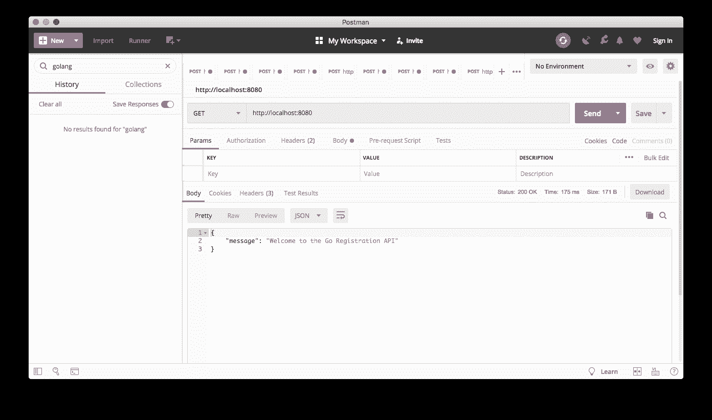

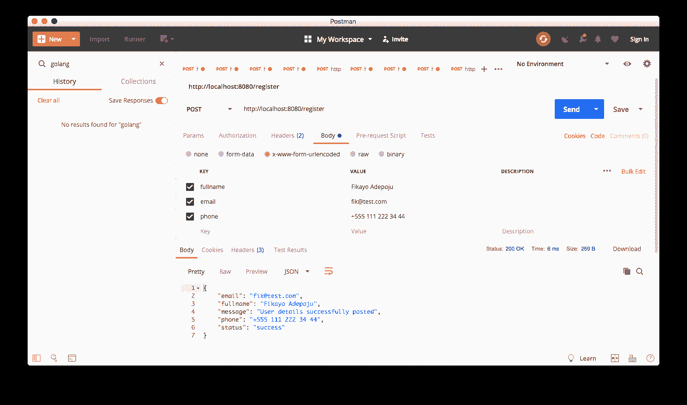

## 为部署设置 Heroku 应用程序

我们需要一个托管服务来部署我们的 Go 应用程序；本教程我选择了 Heroku。通过导航到 [Heroku 仪表板](https://dashboard.heroku.com/apps)并点击**新建**来设置 Heroku 应用程序。选择**新建应用**，填写应用名称。

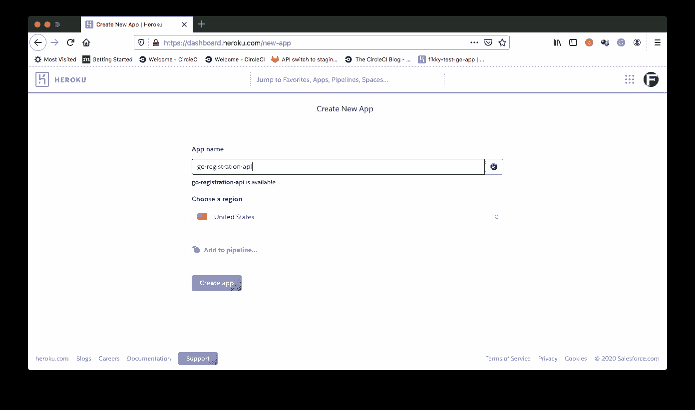

成功创建应用程序后，您将被重定向到应用程序页面。记住您的应用程序名，在本例中是`go-registration-api`，因为您稍后会用到它。

在您的`Account Settings`页面上找到您的 Heroku API 密钥。当你点击网页右上角的头像时，你可以从下拉菜单中进入**账户设置**。

## 将项目连接到 CircleCI

既然我们已经设置了 Heroku，我们需要自动部署我们的 Go 应用程序。从[将你的项目推送到 GitHub](https://circleci.com/blog/pushing-a-project-to-github/) 开始。

接下来，转到 CircleCI 仪表板上的**添加项目**页面。

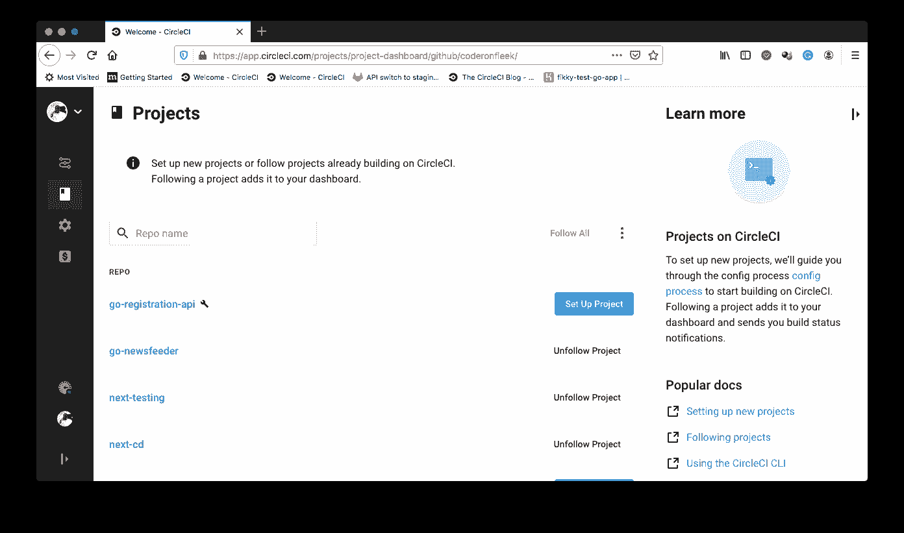

点击**设置项目**。

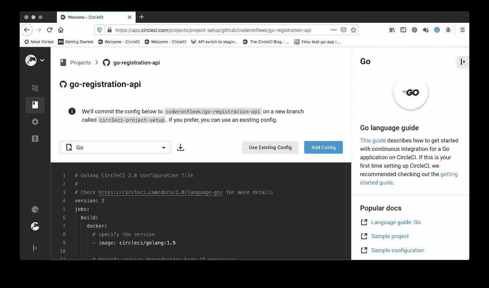

在设置页面上，单击**使用现有配置**以指示 CircleCI 我们正在手动添加配置文件，而不是使用显示的示例。接下来，您会得到提示，要么下载管道的配置文件，要么开始构建。

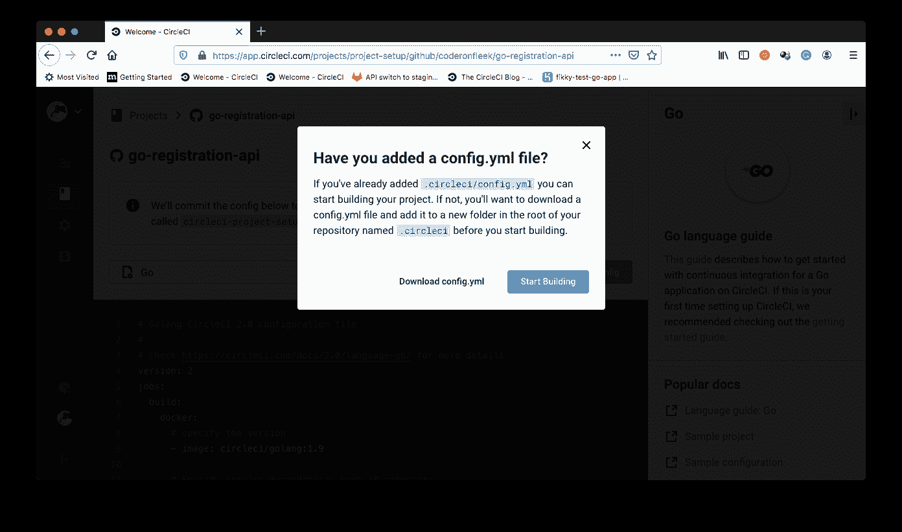

点击**开始建造**。这个构建将会失败，因为我们还没有设置配置文件。

接下来，我们需要为刚刚添加的项目设置环境变量。这为我们的项目提供了对 Heroku 进行部署的认证访问。

在**管道**页面点击**项目设置**。确保您的项目当前已被选中。

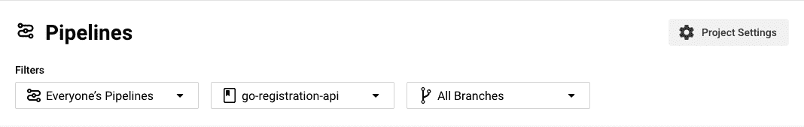

在**项目设置**页面，点击侧边菜单上的**环境变量**。

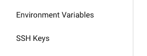

在**环境变量**页面中，点击**添加环境变量**。添加这些变量:

*   `HEROKU_APP_NAME`:在这种情况下，`go-registration-api`是您的 Heroku 应用程序的名称
*   `HEROKU_API_KEY`:在**账号**标签中找到你的 Heroku 账号 API 密匙

成功！您已经在 CircleCI 控制台上完成了部署到 Heroku 的设置。

## 使用 CircleCI orbs 配置自动部署

现在是时候部署我们的 Go 应用程序了，让它真正成为“Aliveeee！！!"。首先，我们需要在项目的根目录下创建一个`Procfile`文件。

创建`Procfile`文件(没有文件扩展名)，并将以下命令添加到该文件中:

```
web: bin/go-registration-api 
```

Heroku 运行我们的 Go 应用程序的构建版本，位于`bin`目录中。

接下来，创建一个部署管道配置文件来包含我们的配置脚本。在项目的根目录下，创建一个名为`.circleci`的文件夹。在该文件夹中创建一个`config.yml`文件。在`config.yml`文件中，输入以下配置:

```
version: 2.1
orbs:
  heroku: circleci/heroku@0.0.10
workflows:
  heroku_deploy:
    jobs:
      - heroku/deploy-via-git 
```

我们可以只用 7 行代码部署我们的应用程序，因为我们使用了 CircleCI orbs 的强大功能。这个配置吸引了切尔莱西的赫罗库之球。这个 orb 抽象了许多样板 Heroku CLI 命令，并为部署应用程序提供了一个易于使用的 API。

接下来，我们称之为`heroku/deploy-via-git`作业。这项工作从远程存储库中检出我们的代码，并将其部署到 Heroku。它使用我们之前定义的环境变量向 Heroku 认证。

将更改提交到您的项目，并推送到远程存储库来运行部署脚本。

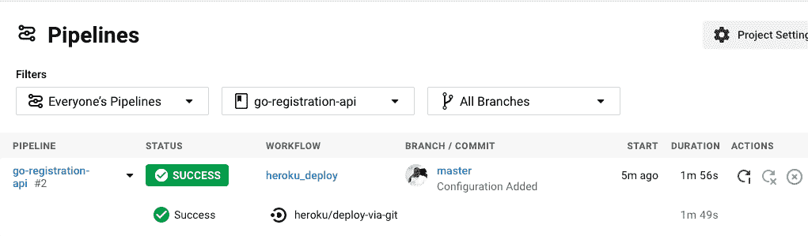

点击**成功**标签查看部署详情。

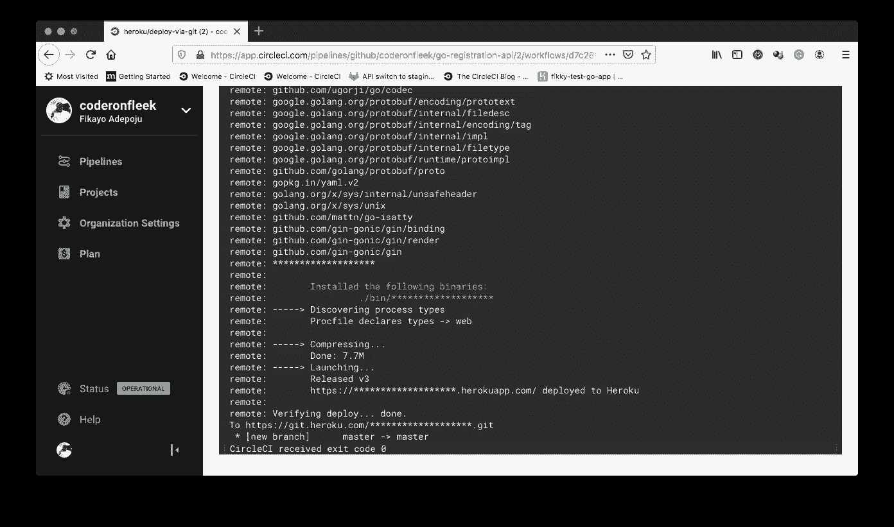

记录状态细节以显示 Heroku 如何将应用程序检测为 Go 应用程序，安装依赖项，构建项目，并运行我们的`Procfile`文件中的命令。

在`https://go-registration-api.herokuapp.com`访问我们的应用程序。

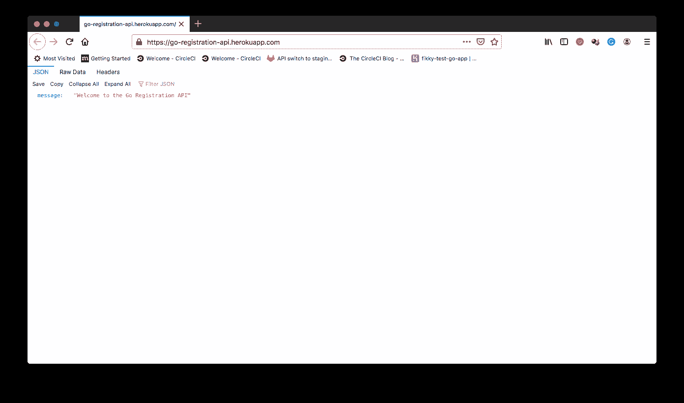

我们还可以使用 Postman 在实时应用程序上测试我们的`/register`端点。

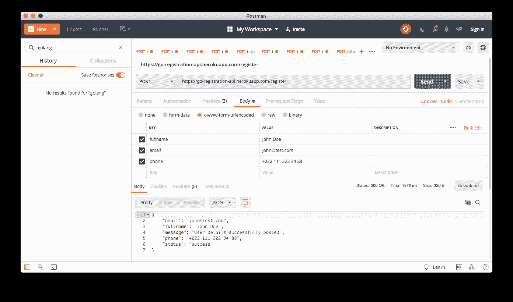

## 结论

Go 是开发人员的一个选择，他们喜欢新语言和框架的花哨功能，但又想要 C、Java 和 C++的强大功能和企业级功能。如果你对 Node.js、Python 和 Ruby 感到厌烦或沮丧，为什么不试试呢？

编码快乐！

* * *

Fikayo Adepoju 是 LinkedIn Learning(Lynda.com)的作者、全栈开发人员、技术作者和技术内容创建者，精通 Web 和移动技术以及 DevOps，拥有 10 多年开发可扩展分布式应用程序的经验。他为 CircleCI、Twilio、Auth0 和 New Stack 博客撰写了 40 多篇文章，并且在他的个人媒体页面上，他喜欢与尽可能多的从中受益的开发人员分享他的知识。你也可以在 Udemy 上查看他的视频课程。

[阅读 Fikayo Adepoju 的更多帖子](/blog/author/fikayo-adepoju/)