# Next.js 应用程序的持续部署| CircleCI

> 原文：<https://circleci.com/blog/continuous-deployment-for-next-js-apps/>

React.js 是一个非常强大的前端框架，多年来它的流行和采用已经证明了这一点。然而，构建一个完整的生产级应用程序涉及到 React 框架本身不包含的特性集。生产级应用程序开发需要路由、代码分割、捆绑、CSS 模块等特性。这些都不是 React.js 提供的现成功能。这就是 [Next.js](https://nextjs.org/) 的用武之地。

Next.js 就是 Next.js 官网上宣传的生产的 **React 框架。它为 React.js 开发人员提供了生产级功能，可以轻松构建生产就绪的应用程序。**

在本教程中，您将学习如何将 Next.js 应用程序自动部署到 Heroku。

## 先决条件

要遵循本教程，需要做一些事情:

1.  Javascript 的基础知识
2.  您系统上安装的 [Node.js](https://nodejs.org) (版本> = 10.3)
3.  一个英雄的账户
4.  一个[圆](https://circleci.com/signup/)的账户
5.  GitHub 的一个账户

所有这些安装和设置，让我们开始教程。

## 创建 Next.js 项目

首先，通过运行以下命令创建一个新的 Next.js 项目:

```
npx create-next-app next-cd 
```

这将在`next-cd`文件夹中自动创建一个 Next.js 应用程序(你可以给这个文件夹取任何你选择的名字)。一旦搭建过程完成，进入项目的根目录，使用以下命令运行应用程序:

```
cd next-cd
npm run dev 
```

这将启动一个开发服务器，该服务器在其默认的`3000`端口(`http://localhost:3000`)为应用程序提供服务。在你的浏览器中加载这个 URL，你会看到默认的主页。

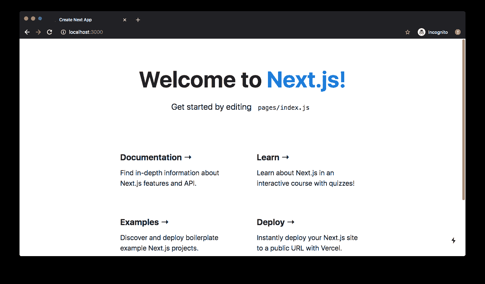

## 创建 Heroku 应用程序

下一步是设置一个 Heroku 应用程序来托管我们的应用程序。导航到您的 [Heroku 账户管理控制台](https://dashboard.heroku.com/apps)，进入**新建**->-**新建 app** ，用您喜欢的名字新建一个 app。

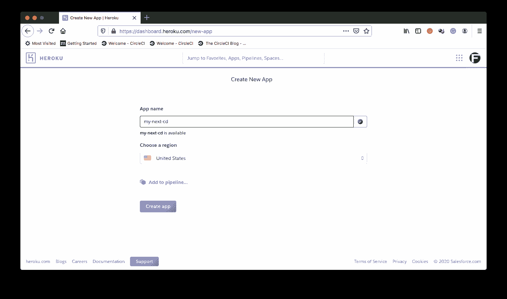

记下您刚刚输入的应用程序名称。你以后会需要这个的。

接下来，在仪表盘的**账户设置**部分找到你的 Heroku API 密钥。在教程的后面部分，您也将需要它。点击网页右上角的头像，你可以从下拉菜单中进入**账户设置**。

## 为部署设置 CircleCI 项目

要在 CircleCI 上设置您的项目，您需要[将您的项目推送到 GitHub](https://circleci.com/blog/pushing-a-project-to-github/) 。

接下来，转到 CircleCI 仪表板上的`Add Projects`页面添加项目。

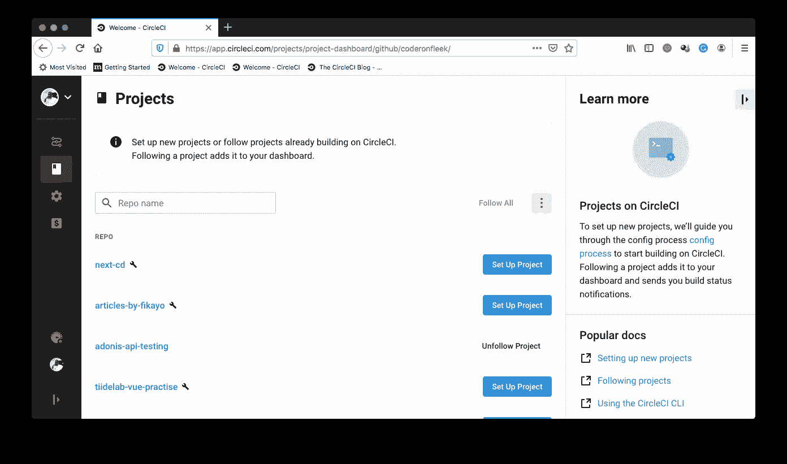

点击**设置项目**。

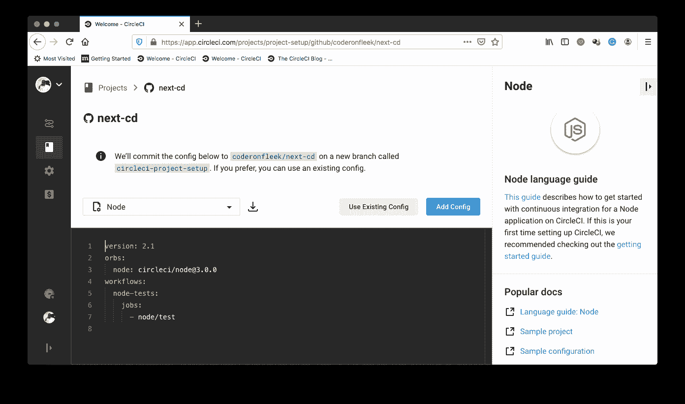

在设置页面上，单击 **Use Existing Config** 以指示 CircleCI 我们将手动添加一个配置文件，而不使用显示的示例配置。接下来，您会得到提示，要么下载管道的配置文件，要么开始构建。

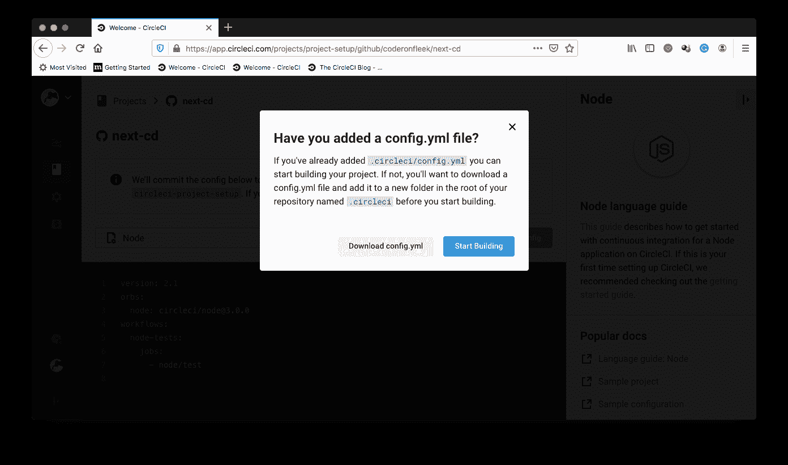

点击**开始建造**。这个构建将会失败，因为我们还没有添加配置文件。我们以后再做。

我们需要在 CircleCI 控制台上做的最后一件事是为我们刚刚添加的项目设置环境变量。这将使我们的项目能够对我们的 Heroku 应用程序进行身份验证访问以进行部署。

点击`Pipelines`页面上的**项目设置**进入您的项目设置(确保您的项目是当前选择的项目)。

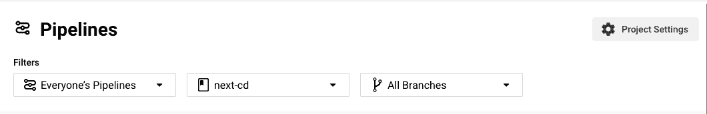

在这个页面上，点击侧面菜单上的**环境变量**。然后点击**添加环境变量**。

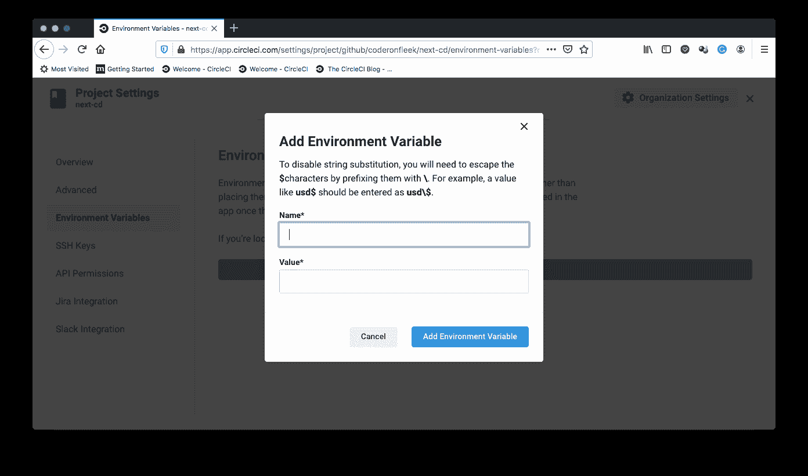

添加以下环境变量:

*   `HEROKU_APP_NAME`:这是您的 Heroku 应用程序的名称(在我的例子中是`next-cd`)。
*   您的 Heroku 帐户 API 密钥。这可以在 Heroku 上的**账号**标签下的**账号设置**下找到。

添加完成后，您现在已经在 CircleCI 控制台上为部署到 Heroku 做好了一切准备。

## 自动化 Next.js 应用程序的部署

现在我们可以开始为将 Next.js 应用程序部署到 Heroku 构建自动化脚本了。

您需要创建一个包含 Heroku 构建和启动应用程序的指令的`Procfile`文件。在项目的根目录下创建一个名为`Procfile`(没有文件扩展名)的文件，并输入以下内容:

```
npm run build
NODE_ENV=production npm run start 
```

该文件中的第一个命令创建了 Next.js 应用程序的生产优化版本。下一个命令在生产模式下启动应用程序。

现在我们需要确保 Heroku 在生产中使用动态端口。对`package.json`中的`start`脚本做如下小小的修改:

```
...
"start": "next start -p $PORT"
... 
```

这样，我们的 Next.js 应用程序现在将在生产中使用 Heroku 设置的动态`$PORT`变量。

最后，我们为 CircleCI 创建部署脚本，以构建我们的部署自动化管道。在这个脚本中，我们使用 CircleCI 的 [Heroku orb](https://circleci.com/developer/orbs/orb/circleci/heroku) 将我们的应用程序从 GitHub 仓库直接部署到 Heroku。[orb](https://circleci.com/orbs/)是易于使用的包，它抽象了许多样板文件，有时是复杂的命令/工作流，提供了一个开发人员友好的 API 供我们在配置文件中使用。

在项目的根目录下，创建一个名为`.circleci`的文件夹，并在其中创建一个名为`config.yml`的文件。在`config.yml`里面，输入以下代码:

```
version: 2.1
orbs:
  heroku: circleci/heroku@0.0.10
workflows:
  heroku_deploy:
    jobs:
      - heroku/deploy-via-git 
```

在上面的配置中，我们引入了 Heroku orb ( `circleci/heroku@0.0.10`)，它自动为我们提供了一组强大的 Heroku 任务和命令。其中一个任务是`heroku/deploy-via-git`任务，它将应用程序直接从 GitHub repo 部署到 Heroku 帐户。这项工作已经负责安装 Heroku CLI、安装项目依赖项、运行构建脚本和部署应用程序。它还获取我们的环境变量，以便顺利部署到我们的 Heroku 应用程序。

现在是检验我们迄今为止的工作的时候了。提交对项目的所有更改，并推送到您的远程 GitHub 存储库。这将自动触发部署管道。

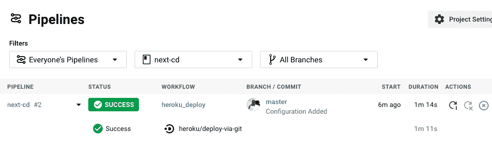

通过点击 build，您可以看到部署细节。

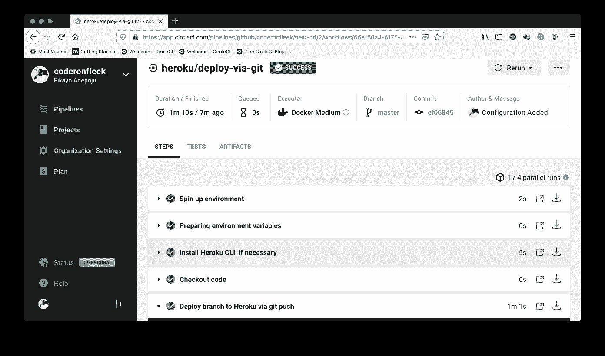

不要开始炫耀，有时成功的构建并不完全等同于成功的部署。Heroku 平台本身还有很多可以出错的地方。为了确认我们已经成功部署，请转到您的 Heroku 应用程序仪表板并单击`Open app`。这将在 Heroku 指定的 URL ( `https://[APP_NAME].herokuapp.com`)打开应用程序。下面的默认主页确认部署成功。耶！

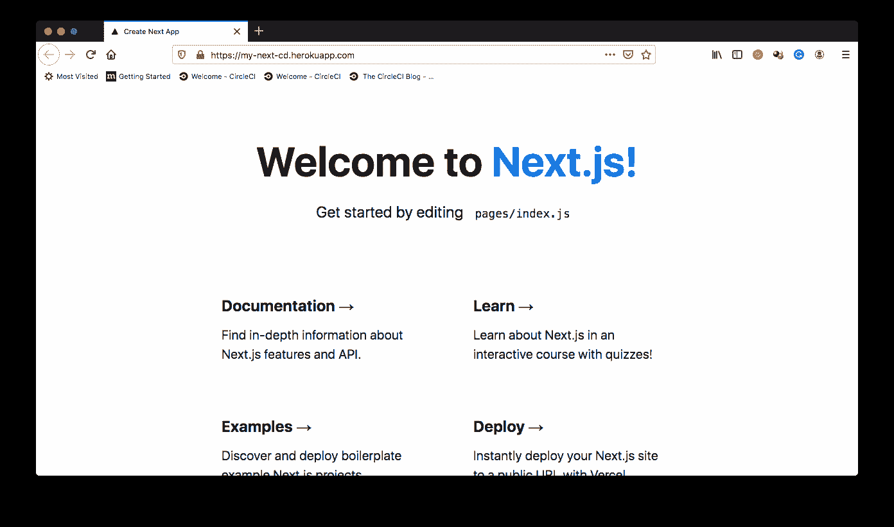

现在，让我们确认，当我们将更改推送到我们的远程存储库时，它们是自动部署的。将`./pages/index.js`中的`h1`标签从:

```
<h1 className={styles.title}>
    Welcome to <a href="https://nextjs.org">Next.js!</a>
</h1> 
```

收件人:

```
<h1 className={styles.title}>
    Welcome to <a href="https://nextjs.org">My Next.js! Site</a>
</h1> 
```

然后提交并推送更改以触发另一个部署。一旦构建成功，刷新您的实时站点，您将看到下面的屏幕。

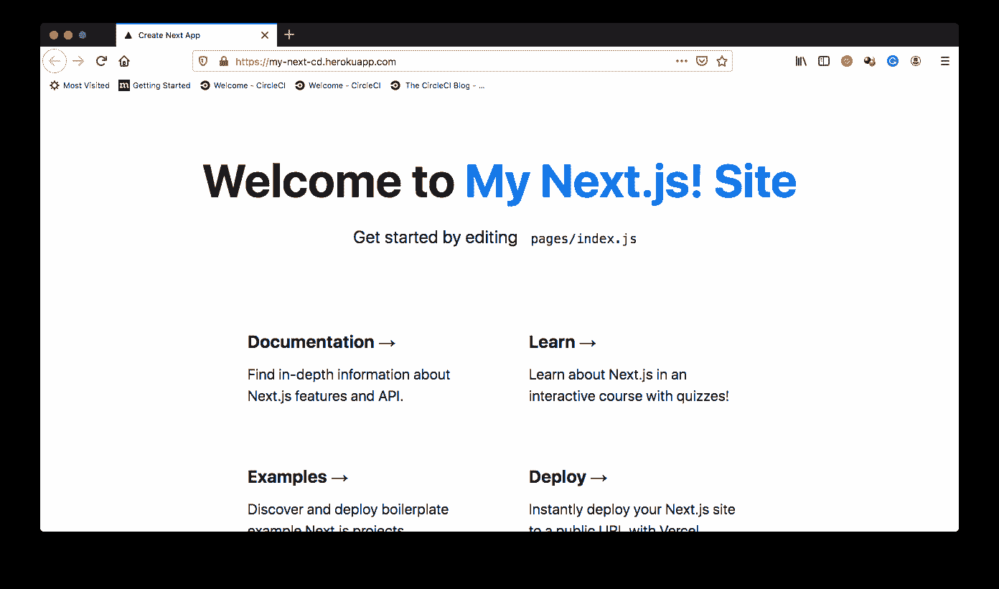

## 结论

通过手动部署过程对应用程序进行从很小到很大的更改很快就会变成一个令人沮丧和费力的过程。有了 CircleCI，您可以实现流程自动化，消除任何由手动流程引入的常规或人为错误。在本教程中，我们已经能够成功地创建一个自动化部署管道，以实现对我们的应用程序的任何更改的无缝部署，使他们少了一件担心的事情。

编码快乐！

* * *

Fikayo Adepoju 是 LinkedIn Learning(Lynda.com)的作者、全栈开发人员、技术作者和技术内容创建者，精通 Web 和移动技术以及 DevOps，拥有 10 多年开发可扩展分布式应用程序的经验。他为 CircleCI、Twilio、Auth0 和 New Stack 博客撰写了 40 多篇文章，并且在他的个人媒体页面上，他喜欢与尽可能多的从中受益的开发人员分享他的知识。你也可以在 Udemy 上查看他的视频课程。

[阅读 Fikayo Adepoju 的更多帖子](/blog/author/fikayo-adepoju/)