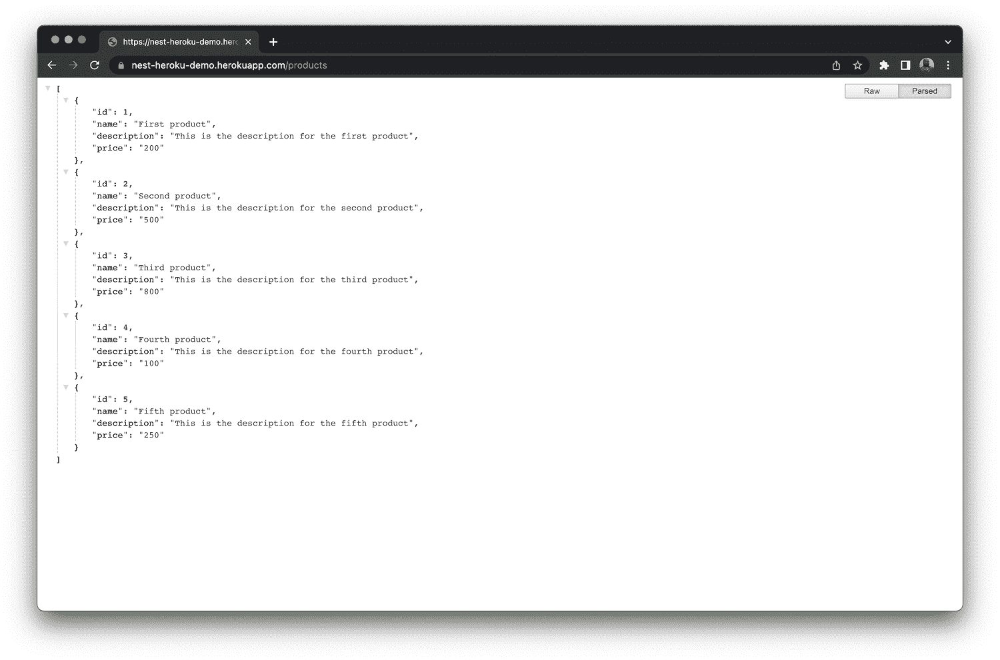

# 将 Nest.js 应用程序持续部署到 Heroku | CircleCI

> 原文：<https://circleci.com/blog/continuous-deployment-nestjs/>

如果你已经在软件开发领域，尤其是 web 开发领域工作了一段时间，那么你就会知道将你的源代码部署到 web 服务器上是多么的乏味和有压力。大多数时候，这是通过使用文件传输协议(FTP)上传来完成的。但是现在我们有许多方法来自动化部署过程。在本教程中，我们将学习如何使用 CircleCI 设置 Nest.js 应用程序到 Heroku 的持续部署。

## 先决条件

要想从本教程中获得最大收益，以下内容是必需的，也是至关重要的:

*   安装在电脑上的 [Node.js](https://nodejs.org/)
*   安装在您电脑上的 Nest CLI
*   GitHub 的一个账户
*   一个[圆](https://circleci.com/signup/)的账户
*   英雄的叙述
*   虽然不是强制性的，但是您应该知道一些关于 TypeScript 的事情。

## 搭建新的 Nest.js 应用程序

要创建新的 Nest.js 应用程序，请从终端导航到开发文件夹的根目录，并运行以下命令:

```
nest new nest-heroku-demo 
```

系统会提示您选择首选的软件包管理器。选择`npm`并点击键盘上的`ENTER`继续。一个新的 Nest.js 应用程序将被创建在一个名为`nest-heroku-demo`的文件夹中，它的所有依赖项都将被安装。

安装过程完成后，进入新创建的项目文件夹，使用以下命令运行应用程序:

```
// move into the project
cd nest-heroku-demo

// start the server
npm run start:dev 
```

您可以在默认端口`3000`上查看欢迎页面。


## 创建演示应用程序

我们将快速创建一个基本的 Nest.js 应用程序，它具有一个端点，用于呈现产品列表。为了简单起见，我们将创建一个模拟产品列表，并将其作为响应返回。首先，用`CTRL + C`停止应用程序在终端上运行，并在您选择的代码编辑器中打开项目。接下来，在`src`文件夹中创建一个名为`mock`的文件夹。在其中，创建一个名为`products.mock.ts`的文件。将以下内容粘贴到该文件中(`src/mock/products.mock.ts`):

```
export const PRODUCTS = [
  {
    id: 1,
    name: "First product",
    description: "This is the description for the first product",
    price: "200",
  },
  {
    id: 2,
    name: "Second product",
    description: "This is the description for the second product",
    price: "500",
  },
  {
    id: 3,
    name: "Third product",
    description: "This is the description for the third product",
    price: "800",
  },
  {
    id: 4,
    name: "Fourth product",
    description: "This is the description for the fourth product",
    price: "100",
  },
  {
    id: 5,
    name: "Fifth product",
    description: "This is the description for the fifth product",
    price: "250",
  },
]; 
```

一旦 HTTP GET 请求被发送到`/products`端点，这里导出的产品列表将作为响应返回。我们稍后将讨论关于这个端点的更多细节。

## 设置服务

我们将使用默认的`AppService`来返回产品列表。用以下代码替换`src/app.service.ts`的内容:

```
import { Injectable } from "@nestjs/common";
import { PRODUCTS } from "./mock/products.mock";

@Injectable()
export class AppService {
  products = PRODUCTS;

  async getProducts() {
    return await this.products;
  }
} 
```

在上面的文件中，我们从模拟文件导入了`PRODUCTS`，并在`getProducts()`方法中返回了列表。

## 创建产品端点

接下来，我们将在默认的`AppController`中创建`/products`端点。为此，导航到`src/app.controller.ts`文件并用以下内容替换其内容:

```
import { Controller, Get } from "@nestjs/common";
import { AppService } from "./app.service";

@Controller()
export class AppController {
  constructor(private readonly appService: AppService) {}

  @Get("/products")
  getProducts() {
    return this.appService.getProducts();
  }
} 
```

默认情况下,`AppService`已经被注入该控制器。这里，我们创建了一个名为`getProducts`的新方法，前缀为`/products`，并在 AppService 中调用了`getProducts()`方法。

## 运行应用程序

从项目的根目录中，使用`npm run start:dev`再次启动应用程序，并导航到`http://localhost:3000/products`。您将看到一个页面，显示我们在 JSON 中被模仿的产品列表。


**注意** : *我安装了一个扩展来美化 JSON。*

## 推送至 GitHub

参见本指南，了解如何[将项目推送到 GitHub](https://circleci.com/blog/pushing-a-project-to-github/) 。

## 创建 Heroku 应用程序

部署需要设置 Heroku 应用程序。这有助于 Heroku 准备接收您的源代码。首先:

您将被重定向到一个页面，在该页面上您将输入应用程序的基本详细信息。输入首选名称。


我将这个应用程序命名为`nest-heroku-demo`。Heroku 应用程序的名称需要是唯一的，所以你可以随意使用任何你认为合适的名称，然后点击**创建应用程序**。为了让 CircleCI 惟一地标识我们的 Heroku 应用程序并自动对其进行部署，我们需要创建环境变量。这将是我们刚刚创建的应用程序的名称和我们的 Heroku 帐户的 API 密钥。要查看您的 Heroku API 密钥，请点击您的个人资料图片，并从下拉列表中选择**帐户设置**。


这将带您到一个页面来管理您的帐户。确保选择了**账户**选项卡，并向下滚动到 **API 键**部分。


点击**显示**查看 API 密钥，然后复制。保管好它，因为我们以后会用到它。

## 为连续部署添加 CircleCI 配置

在本节中，我们将创建一个 CircleCI 配置文件，我们将在其中为我们的应用程序编写部署脚本。为此，在应用程序的根目录下创建一个名为`.circleci`的文件夹。然后在其中创建一个文件，并将其命名为`config.yml`。将以下代码粘贴到这个新文件中:

```
version: 2.1
orbs:
  heroku: circleci/heroku@1.0.1
workflows:
  heroku_deploy:
    jobs:
      - heroku/deploy-via-git 
```

上面的配置文件指定了该项目的 CircleCI 配置版本。在`orbs`键中，我们调用了撰写本文时可用的最新版本的 [Heroku orb](https://circleci.com/developer/orbs/orb/circleci/heroku) 。这个 [orb](https://circleci.com/orbs/) 抽象了设置 Heroku CLI 所涉及的复杂性，因为它将自动安装并用于将应用程序部署到 Heroku。

## 在 CircleCI 建立项目

现在我们已经创建了一个 Heroku 应用程序，并设置了配置以方便 CircleCI 将我们的 Nest.js 应用程序部署到 Heroku，我们需要在 CircleCI 上配置我们的项目。使用包含 Nest.js 应用程序存储库的链接 GitHub 帐户登录到您的 CircleCI 帐户。在项目页面上，找到您的项目名称，然后单击**设置项目**。


将提示您几个关于配置文件的选项。选择在我的回购中使用`.circleci/config.yml`选项。在 GitHub 上输入你的代码所在的分支名称，然后点击**设置项目**按钮。


您的第一个工作流将开始运行，但会失败。


现在，如果您点击上面页面中的 job heroku/deploy-via-git，您将看到部署失败的详细原因。


别担心，我们只需要做以下事情:

*   添加 Heroku 应用程序的细节作为环境变量
*   更新我们项目中`src/main.ts`的端口
*   创建一个`Procfile`

我们将在下一节中完成所有这些工作。

### 向 CircleCI 添加环境变量

为了让 CircleCI 在部署过程中对 Heroku 应用程序进行身份验证访问，我们需要从 Heroku 帐户向 CircleCI 管道添加两个[环境变量](https://circleci.com/docs/env-vars/)。

点击**管道**页面上的**项目设置**进入您的项目设置(确保您的项目是当前选择的项目)。


在设置页面的侧边栏菜单上，点击**环境变量**。

点击**添加环境变量**。这将显示一个提示，您可以在其中输入变量名和值。所需的变量有:

*   `HEROKU_APP_NAME`:之前创建的 Heroku 应用程序的名称
*   从你在 Heroku 上的账户面板获得的 Heroku API 密钥


我们几乎完成了设置自动化应用程序部署所需的所有配置。

### 更新应用程序中的端口

在代码库中，我们需要用一个选项来更新`main.ts`,以使用固定端口或动态分配的值。这是因为 Heroku 经常为每个新应用程序动态分配一个端口，所以设置一个固定值(Nest.js 应用程序的默认值)会导致错误。打开`src/main.ts`并更新其内容，如下所示:

```
import { NestFactory } from "@nestjs/core";
import { AppModule } from "./app.module";
async function bootstrap() {
  const app = await NestFactory.create(AppModule);
  await app.listen(process.env.PORT || 3000); // update this line
}
bootstrap(); 
```

有了这个选项，应用程序既可以在`3000`的固定端口上运行，也可以在`.env`文件中指定的任何动态端口上运行。

### 创建 Procfile

最后，您需要在应用程序的根目录下创建一个名为`Procfile`的新文件，并将以下内容粘贴到其中:

```
web: npm run start:prod 
```

这个文件告诉 Heroku 在启动时将用于执行应用程序的命令。

保存这个文件，并将您的更改推送到 GitHub 存储库。现在，请查看您的 CircleCI 仪表板，以了解部署进度。


我们项目的 CircleCI 管道的状态表明构建是成功的，我们的应用程序已经部署。您可以通过导航到 Heroku 为该应用程序生成的链接来确认这一点。URL 的格式总是相同的:`https://YOUR_HEROKU_APP_NAME.herokuapp.com/`。您还可以查看我的运行实例的[端点。](https://cci-gwp-nest-heroku-demo.herokuapp.com/products)



恭喜你！您刚刚向 Heroku 部署了一个 Nest.js 应用程序。

## 结论

在本教程中，我们能够构建一个简单的 Nest.js 应用程序，设置一个 Heroku 应用程序，并自动将 Nest.js 应用程序部署到 Heroku。这个项目的完整源代码可以在 GitHub 上找到[。](https://github.com/CIRCLECI-GWP/nest-heroku-demo)

* * *

[Oluyemi](https://twitter.com/yemiwebby) 是一名拥有电信工程背景的技术爱好者。出于对解决用户日常遇到的问题的浓厚兴趣，他冒险进入编程领域，并从那时起将他解决问题的技能用于构建 web 和移动软件。Oluyemi 是一名热衷于分享知识的全栈软件工程师，他在世界各地的几个博客上发表了大量技术文章和博客文章。由于精通技术，他的爱好包括尝试新的编程语言和框架。

* * *

Oluyemi 是一名拥有电信工程背景的技术爱好者。出于对解决用户日常遇到的问题的浓厚兴趣，他冒险进入编程领域，并从那时起将他的问题解决技能用于构建 web 和移动软件。Oluyemi 是一名热衷于分享知识的全栈软件工程师，他在世界各地的几个博客上发表了大量技术文章和博客文章。作为技术专家，他的爱好包括尝试新的编程语言和框架。

[阅读更多 Olususi Oluyemi 的帖子](/blog/author/olususi-oluyemi/)