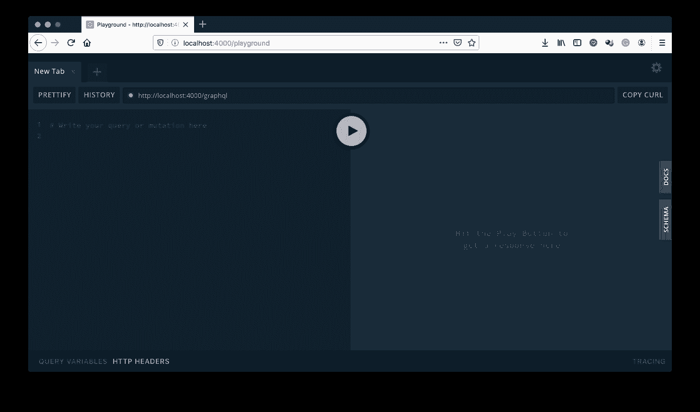

# 将 Express GraphQL 服务器持续部署到 Heroku | CircleCI

> 原文：<https://circleci.com/blog/continuous-deployment-of-an-express-graphql-server-to-heroku/>

自从 2015 年由脸书在[公开发布以来，GraphQL](https://engineering.fb.com/core-data/graphql-a-data-query-language/) 的受欢迎程度与日俱增。该技术使前端客户能够从后端查询他们到底需要什么，并获得了 Pinterest、Coursera、Airbnb 和脸书等知名公司的广泛认可和采用。

在这篇文章中，我们将学习如何使用 CircleCI 通过[持续集成](https://circleci.com/continuous-integration/) (CI)管道将 Node.js 编写的简单 GraphQL 服务器部署到 Heroku。

## 先决条件

要跟进这篇文章，您需要设置以下内容:

*   安装在您的系统上的 [Node.js](https://nodejs.org/) (您可以通过在您的终端上运行命令`node -v`来打印您安装的 Node.js 版本来确认这一点)
*   安装在您的系统上的 [Git](https://git-scm.com/) (您可以通过在您的终端上运行命令`git`来确认这一点；这应该会打印出可用的 git 命令)
*   英雄的叙述
*   GitHub 的一个账户
*   一个[圆](https://circleci.com/signup/)的账户

# #搭建 GraphQL 服务器项目要开始设置 GraphQL 服务器，请通过运行以下命令为项目创建一个新文件夹:

```
mkdir graphql-test-server 
```

现在进入文件夹的根目录，运行以下命令来构建一个新的 Node.js 项目:

```
npm init -y 
```

`-y`可选标志允许您跳过确认创建`package.json`文件问题的默认答案，直接接受它们。

我们将创建一个 [ExpressJS](https://expressjs.com/) Node.js 应用程序，并构建 GraphQL 服务器。为此，我们需要安装以下软件包:

*   `express`:创建我们的 ExpressJS Node.js 应用程序
*   `graphql`:node . js 的 GraphQL npm 包
*   `express-graphql`:graph QL 的 ExpressJS 中间件

通过运行以下命令安装这些软件包:

```
npm install --save express graphql express-graphql 
```

太好了！

我们现在有了开始组装 GraphQL 服务器所需的包。

## 定义 GraphQL 模式

通过运行以下命令，在项目的根目录下创建一个名为`src`的文件夹:

```
mkdir src 
```

在这个文件夹中，创建一个名为`schema.js`的新文件，并粘贴下面的代码。

```
 const { buildSchema } = require("graphql");

const schema = buildSchema(`
    type Query {
        users: [User!]!,
        user(id: Int!): User!
    }

    type Mutation {
        editUser(id: Int!, name: String!, email: String!): User!
    }

    type User {
        id: ID!
        name: String!
        email: String
        posts: [Post!]
    }

    type Post {
        id: ID!
        title: String!
        published: Boolean!
        link: String
    }
`);

module.exports = schema; 
```

在上面的代码中，我们创建了四个类型，包括两个内置类型(`Query`和`Mutation`)和两个自定义类型(`User`和`Post`)。

从自定义类型开始，我们定义了以下内容:

*   `User`:一种类型，表示应用程序中的用户及其相应的字段和一个相关的`posts`字段，该字段返回用户创建的帖子数组
*   `Post`:表示由用户在应用程序中创建的出版物的类型及其相应的字段
*   `Query`:在`Query`类型中，我们定义了两条可以从 GraphQL 服务器查询的信息，如下所示:
    *   `users`:一个`Users`的数组
    *   `user`:参数列表中带有指定`id`的单个`User`
*   `Mutation`:在`Mutation`类型中，我们定义了`editUser`变异，给定用户的`id`，可以调用它来编辑用户，然后更新信息(`name`和`email`)

模式是使用`graphql`包的`buildSchema`创建的，并在文件末尾导出。

## 模拟数据

为了获得查询结果，我们需要数据。在这个练习中，我们将使用 MongoDB。

然而，由于这篇文章的目标是演示如何部署一个简单的 GraphQL 服务器，所以我们不会费心设置一个 MongoDB 服务器。相反，我们将使用一个使用`mongodb-memory-server`的模拟版本。这个包允许我们创建和使用内存中的 MongoDB 数据库服务器。

要进行设置，请在项目的根目录下运行以下命令来安装所需的软件包:

```
npm install --save mongodb mongodb-memory-server 
```

根据您的下载速度，此安装可能需要一段时间。在撰写本文时，MongoDB 的大小至少为 66 兆字节。

安装完成后，在`src`文件夹中创建一个名为`data.js`的新文件。该文件将导出一组硬编码的用户数据。将以下代码粘贴到文件中。

```
const Users = [
  {
    id: 1,
    name: "Fikayo Adepoju",
    email: "fik4christ@yahoo.com",
    posts: [
      {
        id: 1,
        title: "Creating an Emoji Game with Vue, Auth0, and Google Vision API",
        published: true,
        link:
          "https://auth0.com/blog/creating-an-emoji-game-with-vue-auth0-and-google-vision-api/",
        author: 1
      },
      {
        id: 2,
        title: "Electron Tutorial: Building Modern Desktop Apps with Vue.js",
        published: true,
        link:
          "https://auth0.com/blog/electron-tutorial-building-modern-desktop-apps-with-vue-js/",
        author: 1
      },
      {
        id: 3,
        title: "State Management with Vuex: a Practical Tutorial",
        published: true,
        link:
          "https://auth0.com/blog/state-management-with-vuex-a-practical-tutorial/",
        author: 1
      }
    ]
  },
  {
    id: 2,
    name: "John Doe",
    email: "john@company.com",
    posts: [
      {
        id: 4,
        title: "Build a CI powered RESTful API with Laravel",
        published: true,
        link:
          "https://circleci.com/blog/build-a-ci-powered-restful-api-with-laravel/",
        author: 2
      },
      {
        id: 5,
        title: "Automate your Nuxt.js app deployment",
        published: true,
        link: "https://circleci.com/blog/automate-your-nuxt-js-app-deployment/",
        author: 2
      }
    ]
  },
  {
    id: 3,
    name: "Jane Paul",
    email: "jane@company.com",
    posts: []
  }
];

module.exports = {
  Users
}; 
```

在上面的代码中，我们有一个用户对象及其相应的帖子的数组。一旦我们的内存数据库被实例化，这些信息将被用来播种它。

下一个任务是设置我们的模拟 MongoDB 数据库服务器。在`src`文件夹中，创建一个名为`database.js`的新文件，并将以下代码插入该文件。

```
const { MongoMemoryServer } = require("mongodb-memory-server");
const { MongoClient } = require("mongodb");
const data = require("./data");

let database = null;

async function startDatabase() {
  const mongo = new MongoMemoryServer();
  const mongoDBURL = await mongo.getConnectionString();
  const connection = await MongoClient.connect(mongoDBURL, {
    useNewUrlParser: true
  });

  //Seed Database
  if (!database) {
    database = connection.db();
    await database.collection("users").insertMany(data.Users);
  }

  return database;
}

module.exports = startDatabase; 
```

在上面的代码中，我们导出了一个`startDatabase`函数。这个函数只是启动一个新的(模拟的)MongoDB 服务器实例，并获取数据库实例的连接字符串。然后，它使用连接字符串创建一个新的 MongoDB 客户端连接。

连接到数据库后，我们用从我们的`data.js`文件导出的用户数据作为种子。在用数据播种数据库之前，检查数据库引用是否为`null`,以防止应用程序每次启动时都将数据输入数据库。

最后，该函数返回数据库引用。

## 定义我们的解决方案

接下来，我们需要为 GraphQL 查询定义解析器，以便为每个查询操作返回适当的数据。我们将为`users`和`user`查询以及`editUser`变异定义解析器。

在`src`文件夹中创建一个名为`resolvers.js`的新文件，并粘贴以下代码。

```
const resolvers = {
  users: async (_, context) => {
    const { db } = await context();
    return db
      .collection("users")
      .find()
      .toArray();
  },
  user: async ({ id }, context) => {
    const { db } = await context();
    return db.collection("users").findOne({ id });
  },
  //Mutation resolvers
  editUser: async ({ id, name, email }, context) => {
    const { db } = await context();

    return db
      .collection("users")
      .findOneAndUpdate(
        { id },
        { $set: { name, email } },
        { returnOriginal: false }
      )
      .then(resp => resp.value);
  } 
};

module.exports = resolvers; 
```

如上所述，现在我们的服务器上有了三个 GraphQL 请求的解析器。这些解析器使用我们之前通过从 GraphQL 服务器的`context`对象引用而创建的数据库引用来获取和更新数据。

在下一节中，当我们把所有东西放在一起时，这个引用将被添加到 GraphQL 服务器设置的`context`对象中。

## 设置 GraphQL 服务器

是时候将我们构建的每个组件放在一起，以设置我们的 GraphQL 服务器了。

在我们开始之前，我们需要再安装一个包。`graphql`包附带了`GraphiQL`应用程序，它允许您查询 GraphQL 端点，但是让我们添加一个更健壮的工具。我们将安装`graphql-playground-middleware-express`包，为我们查询 GraphQL 端点提供一个更好的界面。

运行以下代码来安装该软件包:

```
npm install --save graphql-playground-middleware-express 
```

我们将使用这个中间件来建立查询我们的服务器的 GraphQL 平台。

让我们通过在项目的根目录下创建一个名为`index.js`的文件并在其中放置以下代码来设置我们的服务器。

```
const express = require("express");
const graphqlHTTP = require("express-graphql");
const schema = require("./src/schema");
const resolvers = require("./src/resolvers");
const startDatabase = require("./src/database");
const expressPlayground = require("graphql-playground-middleware-express").default;

// Create a context for holding contextual data 
const context = async () => {
  const db = await startDatabase();

  return { db };
};

const app = express();

app.use(
  "/graphql",
  graphqlHTTP({
    schema,
    rootValue: resolvers,
    context
  })
);

//Graphql Playground route
app.get("/playground", expressPlayground({ endpoint: "/graphql" }));

const port = process.env.PORT || "4000";

app.listen(port);

console.log(`🚀 Server ready at http://localhost:4000/graphql`); 
```

在上面的文件中，我们从导入所有必需的模块开始。然后，我们创建 GraphQL 上下文，并从中返回一个包含对 MongoDB 实例的引用的对象。接下来，我们创建 ExpressJS 应用程序，并用 GraphQL `schema`、`resolvers`和`context`设置`express-graphql`中间件。然后，我们在路线`/playground`处设置 GraphQL 操场来加载我们的 GraphQL 端点。最后，我们启动 ExpressJS 服务器监听端口 4000，并向控制台打印一条消息。

## 查询 GraphQL 服务器

现在我们已经设置好了服务器，让我们试一试。首先，让我们在`package.json`中创建一个`start`脚本来启动我们的服务器。

将以下脚本添加到`package.json`文件的`scripts`部分。

```
...

“scripts” : {
	...,
	“start” : “node index.js”
} 
```

运行`npm start`启动服务器。

一旦服务器启动并运行，打开你的浏览器并访问`http://localhost:4000/playground`打开游戏场。您将看到一个类似于下图的屏幕。



操场自动指向我们的 GraphQL 端点。从这里，我们可以针对我们的端点编写查询并获得结果。将下面的查询粘贴到操场的查询部分，然后点击播放来运行它:

```
{
  users {
    name
    email
    posts {
      title
      published
    }
  }
} 
```

运行上面的查询将产生下面屏幕上显示的结果。


如上所示，我们的 GraphQL 服务器工作正常，并返回预期的数据。

## 和 CircleCI 一起部署到 Heroku

我们最后的任务是在 Heroku 主机平台上通过 CI 管道和 CircleCI 部署我们的 GraphQL 服务器。

我们将采取以下步骤来部署我们的 GraphQL 服务器:

*   将项目推送到 GitHub 存储库
*   创建一个新的 Heroku 应用程序并获取 Heroku API 密钥
*   向我们的 CircleCI 帐户添加一个新项目，并将其连接到 GitHub repo
*   将我们的 Heroku 应用程序名称和 API 键作为环境变量添加到我们的新项目中
*   编写部署到 Heroku 的 CircleCI 配置文件
*   将配置推送到我们的 GitHub repo 以部署到 Heroku

我们开始吧。首先，把项目推给一个 GitHub 回购。

接下来，创建一个 Heroku 应用程序，如下所示。您输入的名称是您将在 CircleCI 上保存为 Heroku 应用程序名称的名称。


你可以通过进入**账户设置**并向下滚动到 **API 密钥**部分来获得你的 Heroku API 密钥。

将我们的应用程序部署到 Heroku 的下一步是将 GitHub 存储库中的应用程序连接到 CircleCI。

转到您的 [CircleCI 仪表板](https://app.circleci.com/dashboard)，在**添加项目**部分添加项目。


接下来设置你的项目(在这里是`simple-graphql-node-server`，点击**设置项目**。这将把你带到一个类似下面的页面。


点击**开始构建**开始设置项目。这将立即给出一个错误，表明在项目中找不到 CircleCI 配置文件。这是可以理解的，因为我们还没有包括我们的管道配置文件。我们稍后将会这样做。

下一步是将我们的 Heroku 细节作为环境变量添加到新建立的项目中。为了将我们的项目从 CircleCI 推送到 Heroku，我们需要在 CircleCI 和 Heroku 之间配置一个经过认证的握手。这是通过在 CircleCI 项目的设置中创建两个环境变量来实现的。这两个环境变量是:

*   `HEROKU_APP_NAME`:这是您的 Heroku 应用程序的名称(在本例中为`simple-graphql-node-server`)
*   您的 Heroku 帐户 API 密钥。这可以在**账号设置**下你的 Heroku 账号的**账号**标签中找到。

要添加这些细节，请前往您的 CircleCI 仪表板，并为您的项目单击**设置**。在设置页面的工具条菜单上，点击**构建设置**下的**环境变量**。


在环境变量页面上，创建两个名为`HEROKU_APP_NAME`和`HEROKU_API_KEY`的变量，并添加各自的值。

有了这些，我们的 CircleCI 配置可以使用它们对 Heroku 平台进行认证部署。现在，让我们编写 CircleCI 配置，将 GraphQL 服务器部署到 Heroku。

在项目的根目录下创建一个名为`.circleci`的文件夹，并在其中创建一个`config.yml`文件。添加以下配置。

```
version: 2.1
orbs:
  heroku: circleci/heroku@0.0.10
workflows:
  heroku_deploy:
    jobs:
      - heroku/deploy-via-git 
```

上面的代码使用 CircleCI 的 [Heroku orb](https://circleci.com/developer/orbs/orb/circleci/heroku) 来执行到 Heroku 的无缝部署。一个 [orb](https://circleci.com/orbs/) 是一个可重用的 YAML 配置包，它将重复的配置压缩成一行代码。这使得部署到 Heroku 变得非常容易，而不需要自己编写复杂的配置。

保存这个文件，并将您的更改推送到 GitHub 存储库。然后观察您的 CircleCI 仪表板在成功推送后触发部署。您将在仪表板上看到一个成功的部署，类似于下面的屏幕。


厉害！

现在让我们在 live 应用程序上访问我们的操场，以确认我们的部署是好的。访问链接`https://YOUR_HEROKU_APP_NAME.herokuapp.com/playground`。在我们的练习中，这将是如下所示的`https://simple-graphql-node-server.herokuapp.com/playground`。


## 结论

在本文中，我们已经成功地组装了一个简单的 GraphQL 服务器，并使用 CircleCI 自动化了它的部署。GraphQL 将继续存在，并有望获得更多的采用，因为它的许多优点使它值得更多的使用。

编码快乐！

* * *

Fikayo Adepoju 是 LinkedIn Learning(Lynda.com)的作者、全栈开发人员、技术作者和技术内容创建者，精通 Web 和移动技术以及 DevOps，拥有 10 多年开发可扩展分布式应用程序的经验。他为 CircleCI、Twilio、Auth0 和 New Stack 博客撰写了 40 多篇文章，并且在他的个人媒体页面上，他喜欢与尽可能多的从中受益的开发人员分享他的知识。你也可以在 Udemy 上查看他的视频课程。

[阅读 Fikayo Adepoju 的更多帖子](/blog/author/fikayo-adepoju/)