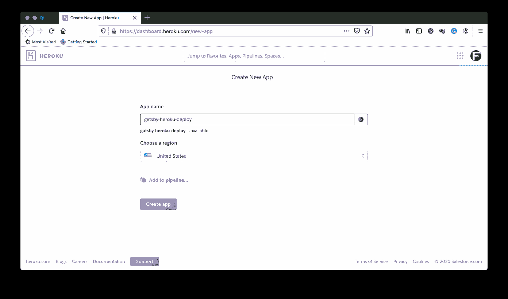

# 将 Gatsby 应用程序持续部署到 Heroku | CircleCI

> 原文：<https://circleci.com/blog/continuous-deployment-of-gatsby-apps-to-heroku/>

JAMStack 正在迅速成为 web 开发领域的一件大事。JAMStack 代表 Javascript、API 和 HTML 标记，是一种用于构建 web 应用程序的现代架构，它的一个主要特点是不需要数据库，web 服务器是可选的。JAMStack 架构旨在通过生成一个由 HTML、CSS 和 Javascript 组成的前端和一个只是返回 JSON 或 XML 的内容 API 的后端来分离前端和后端。

当今领先的 JAMStack 平台之一是 [Gatsby.js](https://www.gatsbyjs.org/) 。Gatsby.js 是一个基于 [React.js](https://reactjs.org/) 的免费开源框架，帮助开发者构建高速网络应用。

在本教程中，我们将演示如何通过使用 CircleCI 构建一个[持续集成](https://circleci.com/continuous-integration/)管道来将 Gatsby.js 站点部署到流行的 Heroku 平台。

## 先决条件

为了跟进这篇文章，你需要准备一些东西:

*   [Node.js](https://circleci.com/orbs/) > = 10.16 安装在您的系统上(您可以通过在您的终端上运行命令`node -v`打印出您安装的 NodeJS 版本来确认这一点)
*   [Git](https://circleci.com/developer/orbs/orb/circleci/heroku) 安装在您的系统上(您可以通过在您的终端上运行命令`git`来确认这一点。这应该会打印出可用的 git 命令)
*   英雄的叙述
*   GitHub 的一个账户
*   一个[圆](https://circleci.com/developer/orbs/orb/circleci/heroku)的账户

有了这些，你就准备好跟随了。

## 创建 Gatsby.js 项目

首先，我们需要创建我们的 Gatsby.js 项目。在系统中的适当位置，运行以下命令创建一个新项目:

```
npm gatsby new gatsby-heroku-deploy 
```

这个命令的`gatsby-heroku-deploy`部分是我要搭建的项目的文件夹名。您可以使用任何喜欢的名称。

这个命令将立即开始搭建一个新的 Gatsby.js 项目。你可能会被提示选择`yarn`或`npm`作为你的包管理器，在本教程中，选择`npm`。

一旦搭建过程完成，进入您的项目的根目录(`cd gatsby-heroku-deploy`)并运行以下命令来启动一个服务器，以便在开发模式下为应用程序提供服务:

```
npm run develop 
```

这将为地址为`http://localhost:8000/`的应用程序提供服务，并显示下面的页面。


太好了！

我们现在已经有了一个功能正常的 Gatsby.js 站点。

## 为盖茨比设置 Heroku 应用程序

要为我们的 Gatsby 应用程序设置一个 Heroku 应用程序，我们需要登录 Heroku 并创建一个新的应用程序。



接下来，我们需要获得应用程序的名称(对于上面创建的应用程序，这将是`gatsby-heroku-deploy`)和 Heroku 帐户的 API 密钥。API 密匙可以在 Heroku **账户设置**部分找到。

稍后，我们将需要这两个值(app name 和 API key)来为部署到 Heroku 的 CircleCI 项目创建环境变量。

我们需要在 Heroku 帐户上做的最后一件事是安装一些必要的构建包。构建包是在部署应用程序时运行的脚本。在这个练习中，我们需要两个构建包:

*   heroku/nodejs:所有 Node.js 应用程序都需要
*   heroku/Heroku-build pack-Static:Heroku build pack 静态包(因为 Gatsby.js 的构建是由静态文件组成的，这将帮助我们在 Heroku 平台上提供静态文件)

转到 Heroku 应用程序的**设置**页面，向下滚动到**构建包**(你可能已经看到`heroku/nodejs`构建包已经被添加)。点击 **Add buildpack** ，你会看到弹出一个类似下图的对话框。


对于每个构建包(`heroku/nodejs`和`heroku/heroku-buildpack-static`)，在文本字段中输入标识符，并点击**保存更改**。

**注意:** *如果已经添加了`heroku/nodejs`，只需添加`heroku/heroku-buildpack-static`构建包即可。*

在对两个构建包都做了这些之后，您将会看到现在在**构建包**中列出的两个构建包。

这就完成了 Heroku 所需的设置。

## 在 CircleCI 上设置 Gatsby.js 项目

我们的下一个任务是在 CircleCI 上建立我们的 Gatsby.js 项目。我们需要将我们的代码推送到您链接到 CircleCI 帐户的 GitHub 存储库。

接下来，转到**添加项目**页面来添加项目。


点击**设置项目**开始设置项目。这将加载下一个屏幕。


在设置页面上，点击**开始构建**。在构建开始之前，您将得到一个提示，要么下载并使用所提供的 CircleCI 配置文件，并将其添加到一个单独的分支中，要么手动设置一个。


选择**手动添加**继续。这将提示另一个对话框，检查确认您已经设置了配置文件，可以开始构建了。


点击**开始构建**完成设置。构建肯定会失败，因为我们还没有设置配置文件，这将在以后进行。

我们需要在 CircleCI 控制台上做的最后一件事是为我们刚刚添加的项目设置[环境变量](https://circleci.com/docs/env-vars/)。这将使它能够对我们的 Heroku 应用程序进行身份验证访问，以进行部署。

点击**管道**页面上的**项目设置**进入您的项目设置(确保您的项目是当前选择的项目)。


这将导航到项目设置页面。在这个页面上，点击侧面菜单上的**环境变量**。


在这个环境变量页面上，点击**添加环境变量按钮**。


添加以下环境变量:

*   `HEROKU_APP_NAME`:这是您的 Heroku 应用程序的名称(在本例中为`gatsby-heroku-deploy`)
*   `HEROKU_API_KEY`:在**账户设置**中您的 Heroku 账户的**账户**标签下找到您的 Heroku 账户 API key

添加后，您将在 CircleCI 控制台上为部署到 Heroku 做好一切准备。

## 使用 orbs 部署 Gatbsy.js 站点

orb 是 YAML 配置的可重用包，它将重复的配置压缩成一行代码。它们使开发人员能够轻松地使用强大的管道功能，并抽象出所有的样板文件。

在本练习中，我们将使用 CircleCI 的 [orb for Heroku](https://circleci.com/developer/orbs/orb/circleci/heroku) 来配置我们的管道，以将我们的 Gatsby.js 站点部署到 Heroku。

但在此之前，我们需要创建一个文件来指导我们的 Heroku Buildpack 静态包如何部署和服务我们的应用程序。

在项目的根目录下，创建一个名为`static.json`的新文件，并在其中输入以下代码:

```
{
  "root": "public/",
  "headers": {
    "/**": {
      "Cache-Control": "public, max-age=0, must-revalidate"
    },
    "/**.css": {
      "Cache-Control": "public, max-age=31536000, immutable"
    },
    "/**.js": {
      "Cache-Control": "public, max-age=31536000, immutable"
    },
    "/static/**": {
      "Cache-Control": "public, max-age=31536000, immutable"
    },
    "/icons/*.png": {
      "Cache-Control": "public, max-age=31536000, immutable"
    }
  },
  "https_only": true,
  "error_page": "404.html"
} 
```

这里最重要的配置参数是`root`属性。当 Gatsby.js 运行它的`build`脚本(这也是 Heroku 用来在部署前运行构建的脚本)时，在包含应用程序生产版本的项目根目录下会生成一个`public`文件夹。这个生产版本是主机提供给用户的。

因此，`root`属性用于指向该文件夹，以便主机提供适当的代码。该配置中的其他参数只是 Gatsby.js 站点的最佳实践配置。例如，缓存指南可以在[这里](https://www.gatsbyjs.org/docs/caching/)找到。

很好！现在我们可以编写部署脚本了。

在 Gatsby.js 项目的根目录下，创建一个名为`.circleci`的文件夹，并在其中创建一个名为`config.yml`的文件。在`config.yml`文件中，输入以下代码:

```
version: 2.1
orbs:
  heroku: circleci/heroku@0.0.10
workflows:
  heroku_deploy:
    jobs:
      - heroku/deploy-via-git 
```

就是这样！

在上面的配置中，我们拉进了 Heroku orb `circleci/heroku@0.0.10`,它自动让我们访问一组强大的 Heroku 作业和命令。其中一个任务是`heroku/deploy-via-git`,它将你的应用程序直接从 GitHub repo 部署到你的 Heroku 账户。

这项工作已经负责安装 Heroku CLI、安装项目依赖项、运行构建脚本和部署应用程序。它还获取我们的环境变量，以便顺利部署到我们的 Heroku 应用程序。

现在，真相大白的时刻到了。让我们提交对 Gatsby.js 项目所做的所有更改，并推送到 repo 来触发部署。


太好了！

要查看部署的幕后操作，您可以点击进入构建。


现在，为了最终确认我们的 Gatsby.js 站点已经成功部署，请访问站点的默认 Heroku 地址`https://[APP_NAME].herokuapp.com`。如果你用了和我在这个练习中一样的名字，那就是`https://gatsby-heroku-deploy.herokuapp.com/`。您将看到一个类似于下图的屏幕(如果您使用的是不同的 Gatsby.js starter 模板，这可能会有所不同，在这里[了解更多关于 starters 的信息](https://www.gatsbyjs.org/docs/plugins-themes-and-starters/))。


## 结论

在本教程中，我们使用 CircleCI orbs 将 Gatsby.js 站点部署到 Heroku。现在，当我们推送代码时，所有的更改都将自动部署。本教程还演示了 CircleCI orbs 如何简化部署。orbs 没有编写许多需要部署到 Heroku 的配置行，而是将所有这些抽象成方便我们使用的命令。

检查 [CircleCI orbs 注册表](https://circleci.com/developer/orbs)中适合您的编程语言和部署目的地的 orbs。

编码快乐！

* * *

Fikayo Adepoju 是 LinkedIn Learning(Lynda.com)的作者、全栈开发人员、技术作者和技术内容创建者，精通 Web 和移动技术以及 DevOps，拥有 10 多年开发可扩展分布式应用程序的经验。他为 CircleCI、Twilio、Auth0 和 New Stack 博客撰写了 40 多篇文章，并且在他的个人媒体页面上，他喜欢与尽可能多的从中受益的开发人员分享他的知识。你也可以在 Udemy 上查看他的视频课程。

[阅读 Fikayo Adepoju 的更多帖子](/blog/author/fikayo-adepoju/)