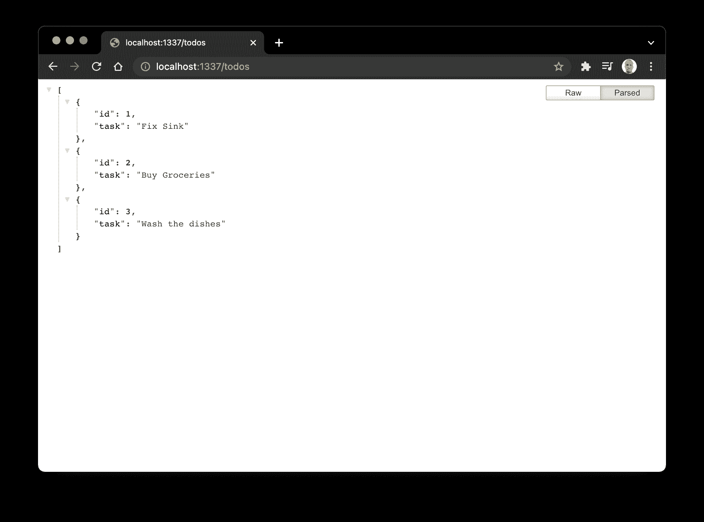
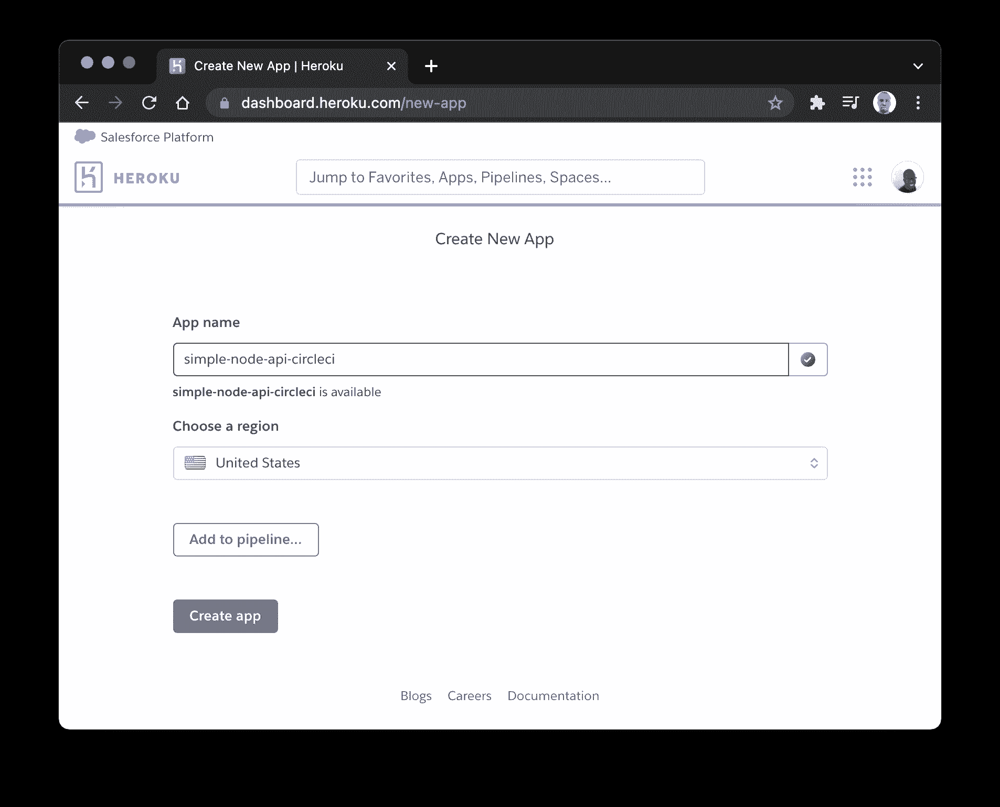
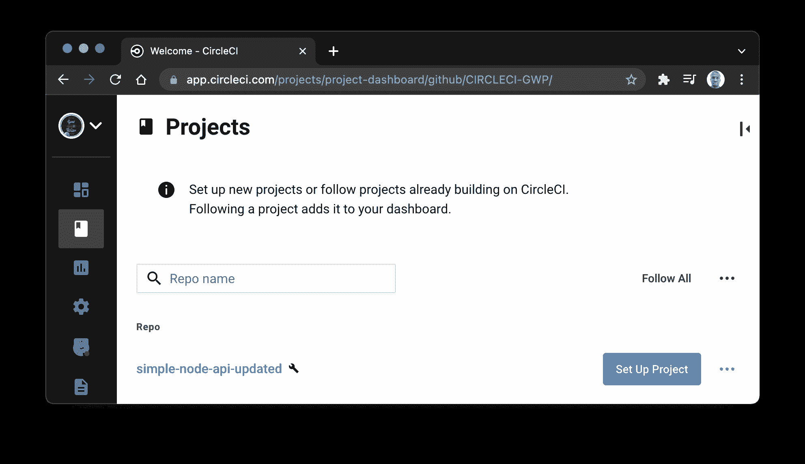
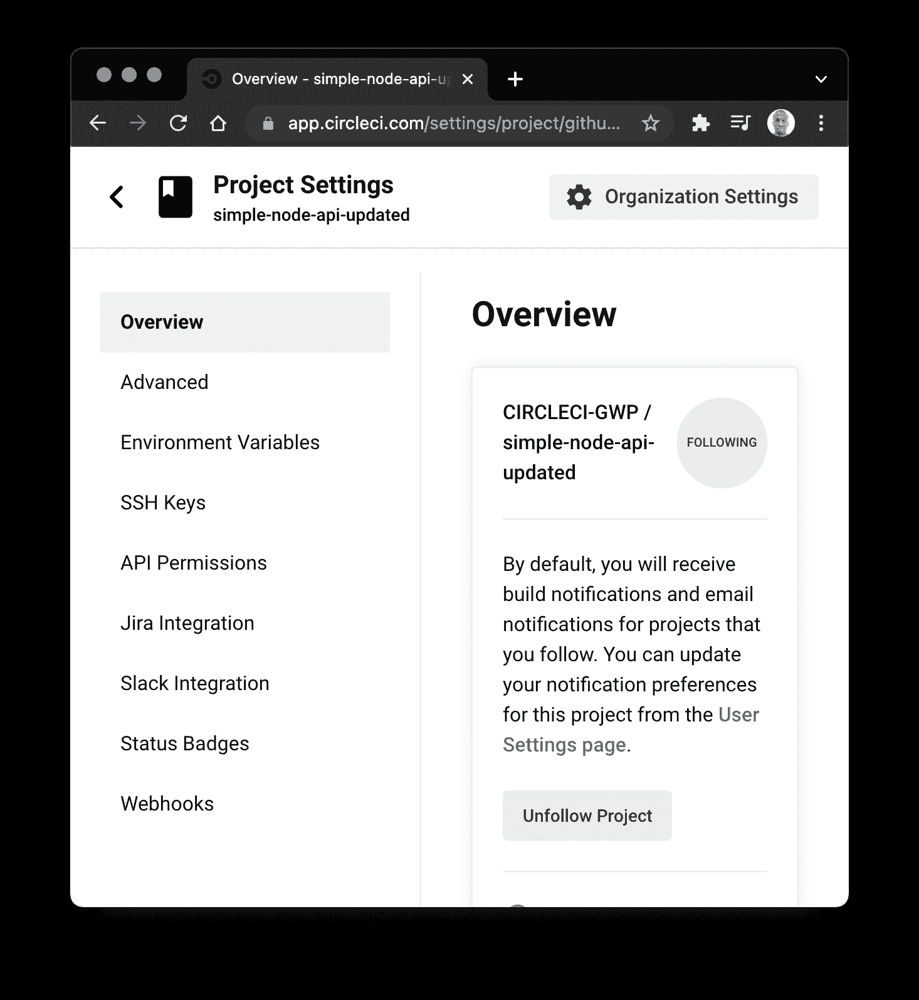
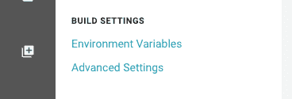
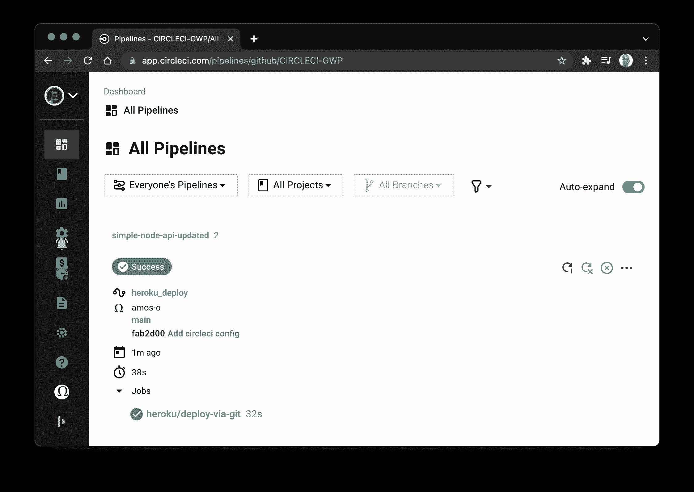
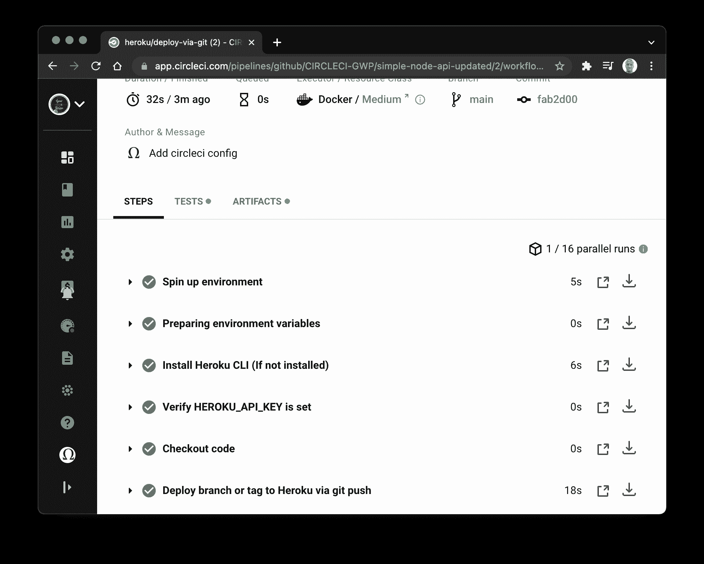
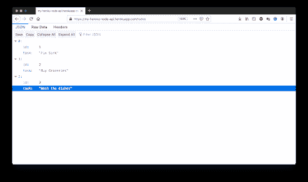

# 将节点应用持续部署到 Heroku | CircleCI

> 原文：<https://circleci.com/blog/continuous-deployment-to-heroku/>

CircleCI orbs 是 YAML 配置的可重用包，它将重复的配置压缩成一行代码。自 2018 年推出以来， [CircleCI orbs registry](https://circleci.com/developer/orbs) 已经被开发者、开发团队以及希望帮助开发者将其服务无缝集成到[持续集成](https://circleci.com/continuous-integration/)管道中的公司所使用。

在本教程中，我们将展示如何使用 CircleCI orbs 将一个 [Node.js](https://nodejs.org/) 应用程序持续部署到 [Heroku](https://www.heroku.com/) ，这是最流行的托管平台之一。

## 先决条件

要跟随本教程，您首先需要一些东西:

有了这些，你就准备好跟随了。

## 克隆 Node.js API 项目

我们希望在 Heroku 上托管的应用程序是一个简单的 Node.js API 项目，它由一个返回“todos”列表的单一路由组成。

由于本练习的重点是将应用程序部署到 Heroku 平台，因此不需要考虑创建新 Node.js 应用程序的细节。从[这个回购](https://github.com/coderonfleek/simple-node-api)里克隆一个现成的就行了。

要克隆项目，请运行:

```
git clone https://github.com/coderonfleek/simple-node-api.git 
```

这将把 [Express.js](https://expressjs.com/) API 项目克隆到您的系统上。这个应用程序的入口点是`server.js`文件，它包含以下代码:

```
const express = require("express");
const routes = require("./routes");

const app = express();
const port = process.env.PORT || "1337";
app.set("port", port);

app.use('/', routes);

app.listen(port, () => console.log(`Server running on localhost:${port}`)); 
```

这段代码在端口 1337 创建并公开了一个新的 Express.js 应用程序。然后应用程序被设置为使用在`routes.js`文件中定义的路线。

`routes.js`文件创建了一个新的 Express.js 路由器，并公开了一个单独的`/todos` route，它返回了一个在`todo.js`文件中定义的待办事项数组。然后，它导出路由器对象。代码如下:

```
const express = require('express');
const todos = require("./todos");

const router = express.Router();

router.get("/todos", function(req, res) {
  res.json(todos);
});

module.exports = router; 
```

通过首先安装依赖项来尝试这个项目。在项目的根目录中，键入:

```
npm install 
```

然后使用以下命令运行应用程序:

```
node server.js 
```

应用程序应该在地址`http://localhost:1337`启动并运行。打开您喜欢的浏览器，访问位于`http://localhost:1337/todos`的`/todos`路线。



如上所示，该路径返回一个 todo 对象数组，每个对象都有一个`id`和`task`名称。

现在，在你的 GitHub 帐户上为这个项目创建一个新的存储库，并将项目推送到你刚刚创建的存储库中。

## 为部署准备 Node.js 项目

当没有指定 Heroku Procfile 时，Heroku 使用`npm start`命令启动 Node.js 项目。这个命令表明 Heroku 需要我们的`package.json`文件中的一个`start`脚本来启动我们的应用程序。

这意味着我们需要在我们的`package.json`文件中创建一个`start`脚本来指导 Heroku 如何启动应用程序。如果您正在使用克隆的项目，您可以跳过这一步。否则，转到`package.json`的`scripts`部分(目前只包含一个`test`脚本)并添加`start`脚本:

```
….
“scripts” : {
  ……,
  “start”: “node server.js”

} 
```

有了这个脚本，Heroku 现在可以成功地启动我们的应用程序了。

## 在 Heroku 上创建应用程序

下一步是创建 Heroku 应用程序。该应用程序将映射到我们的部署，并帮助我们管理我们部署的应用程序。它将提供度量、扩展能力和访问应用程序日志等功能。

转到 Heroku 仪表盘，点击**新建**并选择**创建新应用**，创建一个新应用。

这将打开应用程序创建表单。



我们已将该应用程序命名为`simple-node-api-circleci`，但您可以随意给它取任何您喜欢的名称。只要确保该名称不包含空格或对 URL 不友好的字符。

点击**创建应用**设置您的新应用。

## 在 CircleCI 建立项目

将应用程序部署到 Heroku 的下一步是将 GitHub 存储库中的应用程序连接到 CircleCI。

转到您的 [CircleCI 仪表板](https://app.circleci.com/dashboard)并在**添加项目**部分添加项目。



在你的项目旁边(这里是`simple-node-api-updated`，点击**设置项目**按钮。

在这个屏幕上，你会立即看到一个错误，说明在项目中找不到 CircleCI [配置文件](https://circleci.com/docs/configuration-reference/)。

这是可以理解的，因为我们还没有包含管道配置文件。我们将在本教程的后面部分进行介绍。

现在，选择`Write your own using our starter config.yml template`。在该页面上，选择`skip this step`，然后选择`Use existing config`。构建将运行并失败。

## 在 CircleCI 上配置 Heroku 访问

为了将我们的项目从 CircleCI 推送到 Heroku，我们需要在 CircleCI 和 Heroku 之间配置一个经过认证的握手。通过在 CircleCI 项目的设置中创建两个[环境变量](https://circleci.com/docs/env-vars/)来配置握手:

*   **`HEROKU_APP_NAME`** 是您的 Heroku 应用程序的名称(在本例中是`simple-node-api-circleci`
*   **`HEROKU_API_KEY`** 是你的 Heroku 账号 API 密匙。这可以在你的 Heroku 账户的账户标签下的账户设置下找到。滚动到 API 密匙部分，点击**显示**复制你的 API 密匙。

进入你的 CircleCI 仪表盘，点击项目的**设置**。



在设置页面的工具条菜单上，点击构建设置下的**环境变量**。



在环境变量页面上，创建两个名为`HEROKU_APP_NAME`和`HEROKU_API_KEY`的变量，并输入它们的值。

有了这些，我们的 CircleCI 配置将能够对 Heroku 平台进行认证部署。

## 使用 Heroku orb 部署应用程序

现在来看主要的行动领域:我们的部署管道。这里有一个提示:这将是最容易的一步。你刚才笑了吗？我愿意这样相信！

这一步对于每一个 CI 工具来说都不容易，但是使用 CircleCI orbs，我们可以创造奇迹。这是因为 CircleCI orbs registry 有一个现成的 orb 用于将应用程序部署到 Heroku。我们将在 CircleCI 配置中使用 Heroku orb 来部署我们的应用程序。

在项目的根目录下，创建一个名为`.circleci`的文件夹，并在其中创建一个名为`config.yml`的文件。添加此配置:

```
version: 2.1
orbs:
  heroku: circleci/heroku@1.2.6
workflows:
  heroku_deploy:
    jobs:
      - heroku/deploy-via-git 
```

就这些吗？当然是了！记得吗，我告诉过你我们会变魔术的。

在上面的配置中，我们引入了 Heroku orb `circleci/heroku@1.2.6`，它自动让我们访问一组强大的 Heroku 作业和命令。

其中一项工作是`heroku/deploy-via-git`,它将你的应用程序直接从你的 GitHub repo 部署到你的 Heroku 账户。

现在，你可能有几个问题。Heroku CLI 是如何安装的？代码是什么时候从回购中签出的？身份验证凭据是如何访问的？Heroku 的部署命令是什么时候运行的？

这是球体真正力量的闪耀之处。前面问题中的所有进程都已经被 Heroku orb 抽象了。拉入 orb 确保我们有一个为部署到 Heroku 而设置的环境，同时作业检查我们的代码，将其部署到 Heroku，并启动应用程序。它抽象了过程的本质细节。

保存配置并将您的更改推送到 GitHub 存储库。这将立即触发通过 CircleCI 向 Heroku 的部署过程。



成功！要查看 Heroku orb 在幕后做了什么，请点击构建过程。



您不必定义这些步骤，因为 orb 会为您处理一切。

要确认应用已经成功部署并且正在运行，请访问链接`https://YOUR_HEROKU_APP_NAME.herokuapp.com`。对于本教程，这个 URL 将是`https://simple-node-api-circleci.herokuapp.com/todos`。这将按预期返回我们的待办事项列表。为了更好的可视性，我使用了 Chrome 的 JSON 格式器插件。



现在你知道了。通过 CircleCI orbs 的强大功能，Node.js API 项目只需几个步骤就已成功部署到 Heroku。

## 结论

CircleCI orbs 是 CI/CD 世界的游戏规则改变者。抽象大量乏味、容易出错的样板配置代码，以提供简单、稳定和强大的抽象，这有助于开发人员专注于他们最擅长的事情:成功部署应用程序。

一定要检查 [CircleCI orbs 注册表](https://circleci.com/developer/orbs)中适合您的编程语言和部署偏好的 orbs。与你的同事分享这个教程。让他们知道，有了 CircleCI 球，你不需要重新发明轮子。

编码快乐！

* * *

Fikayo Adepoju 是 LinkedIn Learning(Lynda.com)的作者、全栈开发人员、技术作者和技术内容创建者，精通 Web 和移动技术以及 DevOps，拥有 10 多年开发可扩展分布式应用程序的经验。他为 CircleCI、Twilio、Auth0 和 New Stack 博客撰写了 40 多篇文章，并且在他的个人媒体页面上，他喜欢与尽可能多的从中受益的开发人员分享他的知识。你也可以在 Udemy 上查看他的视频课程。

[阅读 Fikayo Adepoju 的更多帖子](/blog/author/fikayo-adepoju/)