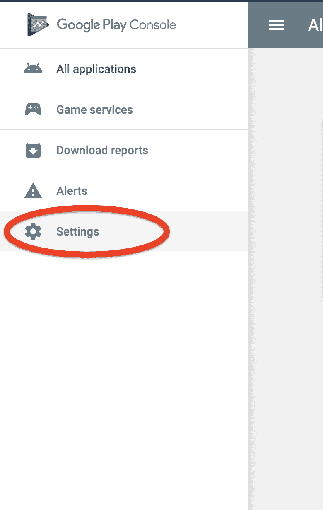
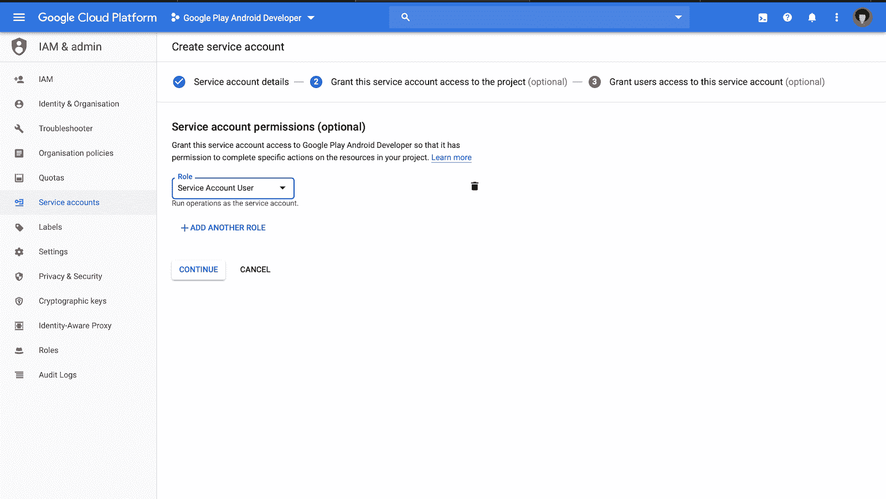

# 通过 fastlane | CircleCI 持续集成和部署 Android 应用

> 原文：<https://circleci.com/blog/continuous-integration-and-deployment-for-android-apps-with-fastlane/>

[持续集成](https://circleci.com/continuous-integration/) (CI)是软件开发中与 DevOps 相关的一个流行术语。CI 是对推送到项目中的新代码进行自动验证，以确保其正确性。CI 根据为项目编写的测试来验证代码。这意味着几乎每一个更新都必须伴随着测试。

因此，典型的 CI 流程是这样的:

*   代码被签入到存储库中
*   CI 服务器被通知新代码已被推送
*   CI 服务器从存储库中获取代码，执行代码附带的测试，并执行您必须指定的任何其他命令
*   CI 服务器会通知您所执行命令的结果

通常情况下，软件项目往往有不止一个开发人员，因此 CI 可以方便地确保项目在每次提交到存储库之后都是稳定的。

另一方面，连续部署(CD)比 CI 更进一步。在执行测试和生成构建之后，CD 继续在生产中部署构建。这与 CI 的区别在于，对于 CD，您将在脚本中指定一个部署命令来将您的应用程序推向生产。

这些操作利用了两个重要的工具:CI 服务器和存储库。存储库是代码驻留的地方，CI 服务器是集成和部署触发的地方。在本文中，您将把代码检查到 GitHub，并将 CircleCI 用作 CI 服务器。

阅读更多关于[移动应用开发持续集成](https://circleci.com/blog/ci-for-mobile-app-development/)的信息。

## 你将建造什么

在本文中，您将构建一个简单的 Android 应用程序来显示流行电影。该应用程序将从一个 API 获取数据，并显示它。在您构建这个应用程序之后，您将为这个应用程序编写测试并为它设置 CI/CD。

## 先决条件

这篇文章假设你已经对使用 Kotlin 进行 Android 开发有了基本的了解。如果你仍然需要补上，这里有一个很好的课程让你开始。除此之外，您还需要确保具备以下条件:

*   最近安装了一个稳定版本的 Android Studio
*   GitHub 的一个账户
*   一台装有 [macOS 的机器](https://docs.fastlane.tools/#system-requirements)。我们将在这个项目中使用 fastlane，它被官方支持在 macOS 上运行。你可以关注[这一期](https://github.com/fastlane/fastlane/issues/11687#issue-291362572)来了解它什么时候可以用于其他平台。

检查完所有内容后，请放心继续。

## 构建应用程序

为了简洁起见，您不会从头开始构建应用程序。相反，您将在一个初始项目的基础上进行构建。点击下载启动项目[。在继续之前，理解 starter 项目中的类和文件是很重要的。](https://github.com/KingIdee/ci-cd-android/tree/starter)

在项目中，您有以下类/文件:

*   这是一个用来访问翻新实例的对象。翻新是由 [Square](https://square.github.io) 开发和维护的用于 Android 和 Java 的类型安全 HTTP 客户端。您将使用它为您的应用程序发出网络请求。
*   这个接口包含了你在构建应用程序的过程中将要访问的端点。该接口用于改造。
*   这是一个适配器类，可以帮助你管理列表中的数据。这个类控制列表的大小、每行的外观以及数据如何绑定到列表。这个类使用 DiffUtilCallback 类来检查要在列表中填充的内容的唯一性。
*   `MovieModel.kt`:这个类包含与您将从服务器收到的响应相匹配的数据类。
*   `MainActivityViewModel.kt`:这是 MainActivity 用来发出网络请求并返回结果的 ViewModel。
*   这是一个你可以连接其他班级的班级。这是您的应用程序开始的地方。

现在您已经了解了 starter 项目是如何工作的，您将添加收尾工作来使应用程序正常工作。

你需要做的第一件事是从电影数据库获取一个 API 密匙。如果您没有帐户，您需要创建一个帐户。完成帐户设置后，进入[设置](https://www.themoviedb.org/settings/api)(点击右上方用户图像出现的下拉菜单中的设置)，然后点击垂直菜单中的 API 选项卡。请求 API 密钥(如果您还没有这样做)。


之后，复制出 API KEY(v3 auth)值。


复制密钥后，打开 gradle.properties 文件并添加以下代码片段:

```
API_KEY = "MOVIE_DB_API_KEY" 
```

**注意:** *用刚才复制的密钥替换 MOVIE_DB_API_KEY。*

现在你会看到一个通知，建议你应该同步你的 Gradle 文件。继续并同步它们。

下一步是添加从 API 获取流行电影的逻辑。您将在视图模式下执行此操作。打开`MainActivityViewModel`类并添加这些导入:

```
// app/src/main/java/dev/idee/cicdandroid/MainActivityViewModel.kt

import android.util.Log
import androidx.lifecycle.MutableLiveData
import retrofit2.Call
import retrofit2.Callback
import retrofit2.Response

Then, add this snippet to the body of your class:

// app/src/main/java/dev/idee/cicdandroid/MainActivityViewModel.kt

private val movieListLiveData = MutableLiveData<List<MovieModel>>()

open fun getMovieLiveData(): MutableLiveData<List<MovieModel>> {
    return movieListLiveData
}

fun setMovieLiveData(movieModelList: List<MovieModel>) {
    movieListLiveData.value = movieModelList
}

init {
    fetchMovies()
}

private fun fetchMovies() {

    APIClient.client.create(ApiInterface::class.java).getPopularMovies(BuildConfig.API_KEY)
        .enqueue(object : Callback<MovieResponse> {
            override fun onFailure(call: Call<MovieResponse>, t: Throwable) {
                Log.e("MainActivityViewModel", t.toString())
            }

            override fun onResponse(call: Call<MovieResponse>, response: Response<MovieResponse>) {
                response.body()?.let {
                    setMovieLiveData(it.movieModelList)
                }

            }

        })

} 
```

初始化类时调用`init`块。在这个块中，您调用了`fetchMovies`方法。这个方法获取电影并用响应更新`movieListLiveData`对象。这个对象是可观察的，并将被`MainActivity`用来监听结果。

接下来，您将在`MainActivity`中设置视图模型，以查找`movieListLiveData`对象中的更新。您还将设置一个回收器视图来显示您获取的电影。

打开您的`MainActivity.kt`，并将这些导入添加到导入部分:

```
// app/src/main/java/dev/idee/cicdandroid/MainActivity.kt

import android.view.View
import androidx.lifecycle.Observer
import androidx.lifecycle.ViewModelProviders
import androidx.recyclerview.widget.LinearLayoutManager
import kotlinx.android.synthetic.main.activity_main.*

Then add these objects just before the onCreate method:

// app/src/main/java/dev/idee/cicdandroid/MainActivity.kt

private lateinit var viewModel: MainActivityViewModel
private val movieAdapter = MovieListAdapter(DiffUtilCallback()) 
```

这里，您声明了一个`MainActivityViewModel`的实例，并且初始化了将被回收器视图使用的适配器。

接下来，继续将这两个方法添加到`MainActivity`类中:

```
// app/src/main/java/dev/idee/cicdandroid/MainActivity.kt

private fun setupRecyclerView() {
    with(movieRecyclerView) {
        layoutManager = LinearLayoutManager(this@MainActivity)
        adapter = movieAdapter
    }
}

private fun setupViewModel() {
    viewModel = ViewModelProviders.of(this)[MainActivityViewModel::class.java]
    viewModel.movieListLiveData.observe(this, Observer {
        progressBar.visibility = View.GONE
        movieAdapter.submitList(it)
    })
} 
```

*   这用一个布局管理器和一个适配器初始化你的 RecyclerView。
*   `setupViewModel`:这将初始化视图模型，并开始观察 movieListLiveData 对象以监听响应。

现在，这些方法没有被引用。将它们添加到该类的 onCreate 方法中，以便在活动启动时触发它们:

```
// app/src/main/java/dev/idee/cicdandroid/MainActivity.kt

override fun onCreate(savedInstanceState: Bundle?) {
    // ...
    setupRecyclerView()
    setupViewModel()
} 
```

这样，你的应用就准备好了。点击 Android Studio 上的运行按钮，您应该会看到如下内容:

 </blog/media/2020-03-27-fastlane3.mp4> 

## 写作测试

为了使持续集成有效，测试是必要的。这就是在项目中保持制衡的方式。在本节中，您将为您的应用程序添加一些测试。您不必担心测试依赖项，它们已经被添加到您下载的 starter 项目中了。

打开`androidTest`目录。大概是这样:`/android-projects/ci-cd-android/app/src/androidTest/java/{package-name}`。为了确认您是否在正确的目录中，您会看到一个`ExampleInstrumentedTest`测试文件。

创建一个名为`MainActivityTest`的新文件，并将下面的代码片段添加到其中:

```
// /app/src/androidTest/java/dev/idee/cicdandroid/MainActivityTest.kt

import androidx.test.core.app.ActivityScenario
import androidx.test.ext.junit.runners.AndroidJUnit4
import androidx.test.rule.ActivityTestRule
import org.junit.Rule
import org.junit.Test
import org.junit.runner.RunWith

@RunWith(AndroidJUnit4::class)
class MainActivityTest {

    @get:Rule
    val activityRule = ActivityTestRule(MainActivity::class.java, false, false)

    @Test
    fun appLaunchesSuccessfully() {
        ActivityScenario.launch(MainActivity::class.java)
    }

} 
```

这个测试只是检查应用程序是否成功启动，没有错误。之后，在同一目录下创建另一个文件`MainActivityViewModelTest`,并添加以下代码片段:

```
// /app/src/androidTest/java/dev/idee/cicdandroid/MainActivityViewModelTest.kt

import androidx.arch.core.executor.testing.InstantTaskExecutorRule
import androidx.test.ext.junit.runners.AndroidJUnit4
import org.junit.Assert
import org.junit.Before
import org.junit.Rule
import org.junit.Test
import org.junit.runner.RunWith

@RunWith(AndroidJUnit4::class)
class MainActivityViewModelTest {

    private lateinit var viewModel: MainActivityViewModel
    private val list = ArrayList<MovieModel>()
    @get:Rule val instantTaskExecutorRule = InstantTaskExecutorRule()

    @Before
    fun setUp() {
        viewModel = MainActivityViewModel()
    }

    @Test
    fun testWhenLiveDataIsUpdated_NewValueTakesEffect() {
        list.add(MovieModel("","",""))
        viewModel.setMovieLiveData(list)
        Assert.assertEquals(viewModel.getMovieLiveData().value!!.size,1)
    }

} 
```

该测试检查从 LiveData 对象更新和获取结果的方法是否以最佳方式运行。你可以运行你的测试，你应该看到他们通过。

既然您已经构建了您的 Android 应用程序并编写了测试，那么您需要将它签入远程存储库。打开您的 GitHub 概要文件并[创建一个新项目](https://github.com/new)(存储库)。


为您的项目输入合适的名称和描述。可以使用`ci-cd-android`作为项目名称。创建项目后，您将看到关于如何将本地项目推送到存储库的说明:


您现在可以跳过这些说明，转到下一部分。

## 使用 CircleCI 设置配置项

在本节中，您将使用 CircleCI 为您的 Android 项目设置 CI。在 Android 项目的根目录下，创建一个名为`.circleci`的新文件夹，并在其中添加一个名为`config.yml`的文件。

在`config.yml`文件中，粘贴以下代码片段:

```
version: 2.1

orbs:
 android: circleci/android@0.2.0

jobs:
 build:
   executor: android/android

   steps:
     - checkout
     - run:
         command: ./gradlew build 
```

这是一个脚本，它包含代码被签入存储库时要对其执行的命令。这个文件可以被称为管道。

在这个代码片段中，有不同的部分。你有一个`version`部分，它告诉你正在使用的 CircleCI 版本。在这种情况下，它是版本 2.1，然后您有`jobs`部分。作业是运行构建过程的东西。定义配置文件时，您至少需要一个作业。

总之，您定义的作业检查您的代码，下载必要的依赖项，运行您的测试，并上传结果。

在这之后，接下来要做的事情是将项目的更新推送到存储库中。您可以通过依次运行以下命令来实现这一点:

```
# adds all the changes in the working directory to the staging area
git add .

# Save changes to the local repository
git commit -m "added tests and Circle CI config file"

# Push changes on the local repository to the remote repository
git push origin master 
```

接下来，您必须在 CircleCI 仪表板上设置 GitHub 项目。如果您没有 CircleCI 帐户，您可以在此轻松创建一个。


幸运的是，既然你已经有了一个 GitHub 帐户，这应该不会花很长时间。如果你已经有一个 CircleCI 账户，你应该用[登录](https://circleci.com/vcs-authorize/)。无论哪种情况，你都会出现在仪表盘上。在您的仪表板上，选择**添加项目**选项卡:


搜索您之前创建的存储库，然后单击**设置项目**。单击该按钮后，您应该会看到如下页面:


点击**开始建造**。当询问您是否希望 CircleCI 为您将配置文件添加到 repo 时，选择**手动添加**。这是因为我们已经添加了配置文件。

## 为部署设置快速通道

现在，您将进一步为您的 Android 项目设置连续部署。您将使用 [fastlane](https://fastlane.tools) ，这将有助于自动将您的 Android 应用程序发布到 Google Playstore。

您应该做的第一件事是使用以下命令安装最新的 Xcode 命令行工具:

```
xcode-select --install 
```

这将打开一个许可请求，接受它并接受后面显示的条款。然后将获取并安装最新的工具:


完成后，通过运行以下命令安装 fastlane:

```
brew cask install fastlane 
```

安装 fastlane 后，您需要将它添加到您的路径中。用以下命令打开 bash 概要文件:

```
open -e .bash_profile 
```

**注意:** *如果文件之前不存在，可以使用命令:touch。bash_profile 创建它。*

然后，将此代码片段添加到文件中:

```
PATH=$PATH:$HOME/.fastlane/bin 
```

之后，运行这个命令来刷新 bash 概要文件:

```
. .bash_profile 
```

接下来，转到您的 Android 项目终端，用以下命令初始化项目中的 fastlane:

```
fastlane init 
```

首先在目录中创建一个`fastlane`文件夹。然后，它继续请求您的应用程序的包名。输入应用程序的包名，然后按回车键。您可以在 app-module `build.gradle`文件中找到您的应用包名称。在文件中，包名被称为`applicationId`。

之后，您将被要求提供 JSON 秘密文件的路径。输入`fastlane/api.json`并选择**进入**。最后，当被问及是否计划通过 fastlane 将信息上传到 Google Play 时，回答 **n** 。

**注意:** *使用 fastlane，你可以上传你的应用程序的截图和发布说明，但我们不会在本教程中考虑这一点。*

下面是终端上的流程截图:


在您的项目上初始化 fastlane 之后，您现在需要从您的 Google Developers 服务帐户获得一个凭证文件。这个文件可以让你将二进制文件上传到 PlayStore。

打开 [Google Play 控制台](https://play.google.com/apps/publish/)。然后，选择**设置**:



然后选择开发人员帐户下的 API 访问选项:


要为您的 Google Play 帐户启用 API 访问，请点击**创建新项目**。它将向您显示如下屏幕:


点击**创建服务账户**。您将看到这样一个对话框:


单击**谷歌应用编程接口控制台**链接。这将引导您进入谷歌云控制台上的项目:


当你到达这里时，点击**创建服务账户**。


然后填写您的详细信息，并点击**创建**。当询问角色时，选择**服务账户>服务账户用户**，然后点击**继续**:



之后，您将看到以下屏幕:


点击**创建密钥**。确保按键类型为`JSON`。一旦您的密钥被创建，它将被下载到您的机器。

返回打开 Google Play 控制台的选项卡。点击对话框上的`DONE`。您现在将看到一个新的服务帐户。点击`GRANT ACCESS`，选择`Release manager`角色，点击`ADD USER`。

**注:** *或者，您可以从角色下拉列表中选择**项目负责人**。请注意，选择**发布管理器**可以访问生产跟踪和所有其他跟踪。选择**项目负责人**将授权更新除生产跟踪之外的所有跟踪。*

现在您已经获得了您的密钥，将密钥复制到项目的`fastlane`文件夹中。这次改名为`api.json`。这是为了使文件名和目录与设置 fastlane 时的配置相匹配。

**注意:** *该文件包含您 Playstore 账户的秘密，因此只能在私人存储库中使用。*

浪子的文件夹里有一个名为`Fastfile`的文件。该文件用于配置您可以使用 fastlane 执行的任务。如果打开默认文件，您将看到三个不同的块:

*   `before_all`:这是在执行车道前插入要执行的指令的地方。
*   `lane`:这是您定义想要执行的实际任务的地方，比如部署到 PlayStore。您可以定义任意多的车道。
*   `after_all`:该程序块在执行通道成功时被调用。
*   `error`:如果任何其他程序块发生错误，将调用该程序块。

`Fastfile`已经有了一个生成发布版本并将其部署到 PlayStore 的通道，即`playstore`通道。您将稍微修改这条车道。打开你的`Fastfile`，像这样更新`playstore`车道:

```
lane :playstore do
 gradle(
   task: 'bundle',
   build_type: 'Release'
 )
 upload_to_play_store skip_upload_apk:true 
end 
```

**注意:** *如果您没有 playstore lane，请创建一个并添加上面的代码片段。*

在这里，您将任务更新为`bundle`。这使得 fastlane 将构建一个 aab (Android 应用捆绑包)而不是 apk。Aab 是将工件上传到 Playstore 的推荐格式。您还在`upload_to_play_store`命令中添加了一个`skip_upload_apk:true`参数，这样只有生成的 aab 才会被使用，如果有 apk 存在，它将被丢弃。

## 准备部署您的应用程序

接下来，您必须对您的应用程序进行一些更新，以便为部署做准备。您必须将发布签名配置添加到您的应用程序模块`build.gradle`文件中。这样，fastlane 将使用您用来生成应用程序早期版本的相同密钥库来生成后续版本。

将`signingConfigs`片段添加到您的应用程序模块`build.gradle`:

```
android {
    signingConfigs {
        release {
            keyAlias 'key0'
            keyPassword 'keyPassword'
            storeFile file('../KeyStore')
            storePassword 'storePassword'
        }
    }
    // Leave the rest untouched...
} 
```

**注意:** *用您的实际密码替换钥匙密码和存储密码。也替换密钥别名和密钥库的名称。在这个片段中，密钥库存储在项目根目录中。如果您需要为您的应用程序生成密钥库的帮助，您可以访问这个[资源](https://developer.android.com/studio/publish/app-signing#generate-key)。*

之后，更新 build.gradle 文件的 buildTypes 部分，如下所示:

```
buildTypes {
    release {
        signingConfig signingConfigs.release
        // Leave other parts untouched...
    }
} 
```

至此，我们已经将应用程序配置为使用特定的密钥库。接下来，您将在您的`build.gradle`文件中创建函数来帮助您为您的应用程序版本生成构建号。将这段代码添加到您的应用程序模块`build.gradle`文件的`android`部分之前:

```
ext.versionMajor = 1
ext.versionMinor = 0
ext.versionPatch = 1
ext.versionClassifier = null
ext.isSnapShot = false
ext.minSdkVersion = 21

private Integer generateVersionCode() {
    return ext.minSdkVersion * 10000000 + ext.versionMajor * 10000 +
            ext.versionMinor * 100 + ext.versionPatch
}

private String generateVersionName() {
    String versionName = "${ext.versionMajor}.${ext.versionMinor}.${ext.versionPatch}"

    if (ext.versionClassifier == null) {
        if (ext.isSnapShot) {
            ext.versionClassifier = "SNAPSHOT"
        }
    }

    if (ext.versionClassifier != null) {
        versionName += "-" + ext.versionClassifer
    }

    return versionName
} 
```

在这个代码片段中，您添加了保存应用程序版本值的变量。然后，您添加了两个方法`generateVersionCode`和`generateVersionName`来根据应用程序版本值的变化生成版本代码和版本名称。

这有助于在您修改应用程序版本时，为您的应用程序提供一种独特、渐进的方式来生成版本代码。现在，在`build.gradle`文件的`defaultConfig`部分更新这些属性，如下所示:

```
defaultConfig {
    versionName generateVersionName()
    versionCode generateVersionCode()
    // ... Leave others untouched

} 
```

现在，您将更新 CircleCI 配置文件，告诉它要执行哪个 fastlane 命令。打开`config.yaml`文件，并将这些步骤添加到您的文件中:

```
# .circleci/config.yaml
- run:
    name: Install fastlane
    command: bundle install
- run:
    name: Execute fastlane
    command: bundle exec fastlane playstore 
```

这里，您有两个命令，第一个安装 fastlane，第二个生成一个构建并发送到 Google PlayStore。为了让您的应用程序成功上传，您的 PlayStore 帐户上应该已经有一个包名为(`dev.idee.cicdandroid`)的应用程序。如果你以前没有上传你的应用程序，你可以使用这个[教程](https://medium.com/mindorks/upload-your-first-android-app-on-play-store-step-by-step-ee0de9123ac0)作为指南。

现在，当您将新代码推送到您的存储库时，您应该会看到您的应用程序上线了！

## 结论

在本文中，我们讨论了持续集成和部署的基础。我们构建了一个简单的应用程序来演示这一点，并进一步了解 fastlane 的部署。现在，您可以设置您的应用程序来自动测试并直接部署到 Playstore。这只是开始。使用 CircleCI 和 fastlane，您可以做更多的事情。

黑客快乐！

* * *

Idorenyin Obong 是一名专门从事移动开发的软件工程师。他喜欢写一切关于软件的东西。

[阅读 Idorenyin Obong 的更多帖子](/blog/author/idorenyin-obong/)