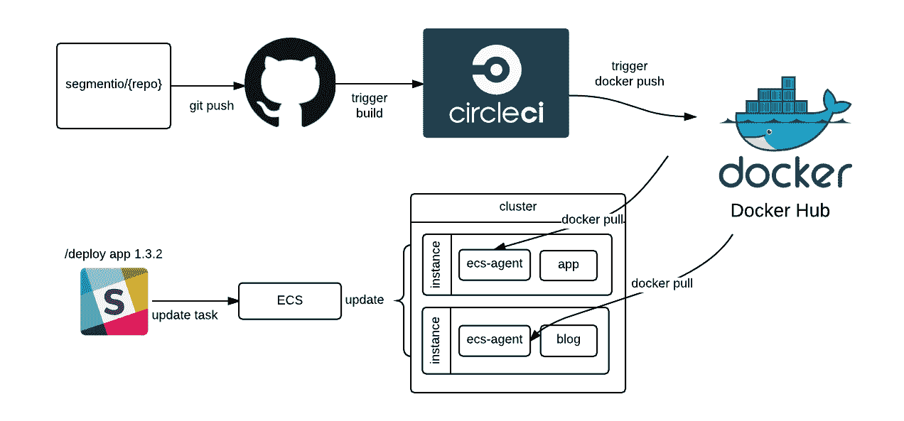
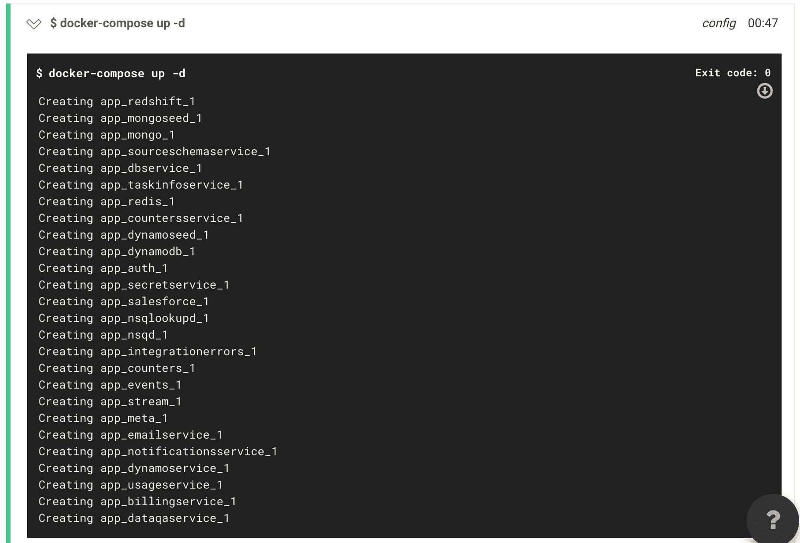

# 线段-圆上的连续积分

> 原文：<https://circleci.com/blog/continuous-integration-at-segment/>

**来自出版商的说明:**您已经找到了我们的一些旧内容，这些内容可能已经过时和/或不正确。尝试在[我们的文档](https://circleci.com/docs/)或[博客](https://circleci.com/blog/)中搜索最新信息。

* * *

*这是联合创始人 Calvin French-Owen 撰写的 Segment 博客的转贴。Calvin 和 Segment 的团队将于本周四(6 月 30 日)在 T2 circle ci 的办公时间发表演讲。请加入我们关于[谷歌的 AMP 项目](https://www.ampproject.org/)的特别报告！*

作为我们推动公开细分市场内部进展的一部分，我们希望分享我们如何运行我们的[持续集成](https://circleci.com/continuous-integration/) (CI)构建。我们的大多数方法遵循标准实践，但是我们想要分享一些我们用来加速我们的构建管道的技巧和诀窍。

驱动我们所有构建的是 [CircleCI](https://circleci.com/) 、 [Github](https://github.com/) 和 [Docker Hub](https://hub.docker.com/) 。每当有推送到 Github 时，存储库就会触发 CircleCI 上的构建。如果这个构建是一个带标签的发布，并且通过了测试，我们为这个容器构建一个映像。

然后，该映像被推送到 Docker Hub，并准备好部署到我们的生产基础架构中。



## CircleCI 和 Travis CI

在继续讲下去之前，我想先谈谈房间里的大象:特拉维斯·CI。几乎所有关于 CI 工具的讨论都围绕着使用 Travis CI 还是 CircleCI 展开。两者都是圆滑的，托管的，和响应的。两者都非常容易使用。

老实说，我们喜欢这两种工具。我们将 Travis CI 用于我们的许多开源库，而 CircleCI 则用于我们的许多私有回购。这两种产品都非常好用，非常好地满足了我们的需求。

然而，CircleCI 有一个我们非常喜欢的特性:SSH 访问。

大多数时候，我们在配置测试环境时没有任何问题。但是当我们这样做时，SSH 到运行代码的容器的能力是非常宝贵的。

客观地说， [Segment 通过数百种不同的微服务运行我们的整个基础设施](https://segment.com/blog/why-microservices/)。每一个都来自不同的 repo，并通过 [docker-compose](https://docs.docker.com/compose/) 以一些不同的依赖关系运行。

我们的 CI 大部分都是相对标准的，但是偶尔设置一个新环境的服务需要一些定制工作。它在一个新的回购中，将需要它自己的依赖集和构建步骤。这就是能够在测试环境中运行命令*的地方——你可以在机器上调整配置。不再有数百个“修复配置项”提交！*

## Dotfiles

为了处理所有这些不同的回购，我们想让设置回购变得非常简单，以便它支持 CI。我们有三个经常使用的不同的圆形命令，它们在我们的公共点文件中共享。首先，circle()设置了所有正确的环境变量，并自动启用了我们的 slack 通知。

```
org=$(basename $(dirname $(pwd)))
repo=$(basename $(pwd))

echo enabling project
curl "https://circleci.com/api/v1/project/${org}/${repo}/follow?circle-token=${circletoken}" \
  -X POST \
  -H "Accept: application/json" \
  --silent > /dev/null

echo enabling notifications
curl "https://circleci.com/api/v1/project/${org}/${repo}/settings?circle-token=${circletoken}" \
  -X PUT \
  -H "Content-Type: application/json" \
  -H "Accept: application/json" \
  -d '{"slack_webhook_url": "xxxxxxxxx"}' \
  --silent > /dev/null 
```

此外，我们有一个 circle.open()命令，可以直接从您的浏览器中的 CLI 自动打开测试结果。

```
repo=$(git remote -v)
re="github.com/([^/]+/[^[:space:]]+)(.git)"
if [[ $repo =~ $re ]]; then open "https://circleci.com/gh/${BASH_REMATCH[1]}"; fi 
```

最后是 circle.badge()命令，用于自动将标记添加到 repo 中

```
org=$(basename $(dirname $(pwd)))
repo=`basename $(pwd)`

echo creating status token
response=`curl "https://circleci.com/api/v1/project/$org/$repo/token?circle-token=$circletoken" \
  -X POST \
  -H "Content-Type: application/json" \
  -H "Accept: application/json" \
  -d '{"label":"badge","scope":"status"}' \
  --silent`
statustoken=`node -pe 'JSON.parse(process.argv[1]).token' "$response"`

badge="[](https://circleci.com/gh/segmentio/$repo)"

echo adding badge to Readme.md
echo $badge > temp-readme.md
cat Readme.md >> temp-readme.md
cp temp-readme.md Readme.md
rm temp-readme.md 
```

## 共享脚本

现在，考虑到我们有数百个 repos，当我们对 circle.yml 文件进行更改时，我们的任务是保持所有测试脚本和存储库同步。在几百个回购中保持相同的行为是很烦人的，但是我们决定宁愿用抽象问题(很难解决)来换取在工具上更大的投资(通常更容易)。为此，我们在一个共享的 git repo 中使用一组通用的脚本。每次测试运行时，脚本都会被拉下来，并处理共享的打包和部署。每个服务的 circle.yml 文件如下所示:

```
machine:
  node:
    version: 4
  services:
    - docker

deployment:
  deploy:
    tag: /[0-9]+(\.[0-9]+)*/
    commands:
      - git clone github.com/segmentio/circle-scripts.git
      - sh ./circle-scripts/node-deploy.js 
```

这意味着如果我们改变我们的部署方案，我们只需更新一个位置中的代码，而不是更新每个单独的 repo 的 circle.yml。然后，我们可以根据我们在单独的服务 repo 中需要的构建类型引用不同的脚本。

## 码头集装箱

最后，没有 Docker 容器，整个构建过程是不可能的。容器极大地简化了我们将代码推向生产、根据我们的内部服务进行测试以及本地开发的方式。

在测试我们的服务时，我们利用 docker-compose.yml 文件来运行我们的测试。这样，一个给定的服务实际上可以针对 CI 中运行的*完全相同的映像*进行测试。它减少了对模拟或存根的需求。



此外，当映像由 CI 构建时，我们可以将这些相同的映像下载下来，并在本地运行它们。

为了实际构建代码并将其推向生产，CircleCI 将首先运行测试，然后检查该构建是否是一个带标签的发布。对于任何带标签的版本，我们都让 CircleCI 通过 Docker 文件构建容器，然后对其进行标记并将其部署到 Docker Hub。

我们没有使用 latest everywhere，而是将标记的映像与主版本(1.x)和次版本(1.2.x)一起显式部署到 Docker Hub。

这样，我们能够在需要时指定回滚到特定版本——或者在不需要特定版本时部署某个发布分支的最新版本(对于本地开发和 docker-compose 文件非常有用)。

这样做的代码相对简单，首先我们检测版本:

```
tag="$(git describe --tags --always)"

# Find our individual versions from the tags
if [ -n "$(echo $tag | grep -E '.*\..*\..*')" ]
then
    major=$(echo $tag | cut -d. -f1)
    minor=$(echo $tag | cut -d. -f2)
    patch=$(echo $tag | cut -d. -f3)

    major_version_tag=$major.x
    minor_version_tag=$major.$minor.x
    patch_version_tag=$major.$minor.$patch

    tag_list="$major_version_tag $minor_version_tag $patch_version_tag"
else
    tag_list=$tag
    fi 
```

然后，我们构建、标记并推送我们的 docker 图像:

```
docker build -t segment/$CIRCLE_PROJECT_REPONAME .

# Tag the new image with major, minor and patch version tags.
for version in $tag_list
do
    echo "==> tagging $version"
    docker tag segment/$CIRCLE_PROJECT_REPONAME:latest segment/$CIRCLE_PROJECT_REPONAME:$version
done

# Push each of the tags to docker hub, including latest
for version in $tag_list latest
do
    echo "==> pushing $version"
    docker push segment/$CIRCLE_PROJECT_REPONAME:$version
done 
```

一旦我们的映像被推送到 Docker Hub，我们就能保证构建出正确版本的代码，这样我们就可以将其部署到生产环境中，并在 ECS 中运行。

多亏了容器，我们的 CI 渠道让我们在将微服务部署到生产中时更有信心。

## 兜了一圈

这就是我们的 CI 构建管道，主要由 Github、CircleCI 和 Docker 提供支持。

虽然我们一直在努力寻找使整个管道更加无缝的方法，但我们对使用第三方工具提供的低维护、并行化和隔离感到满意。