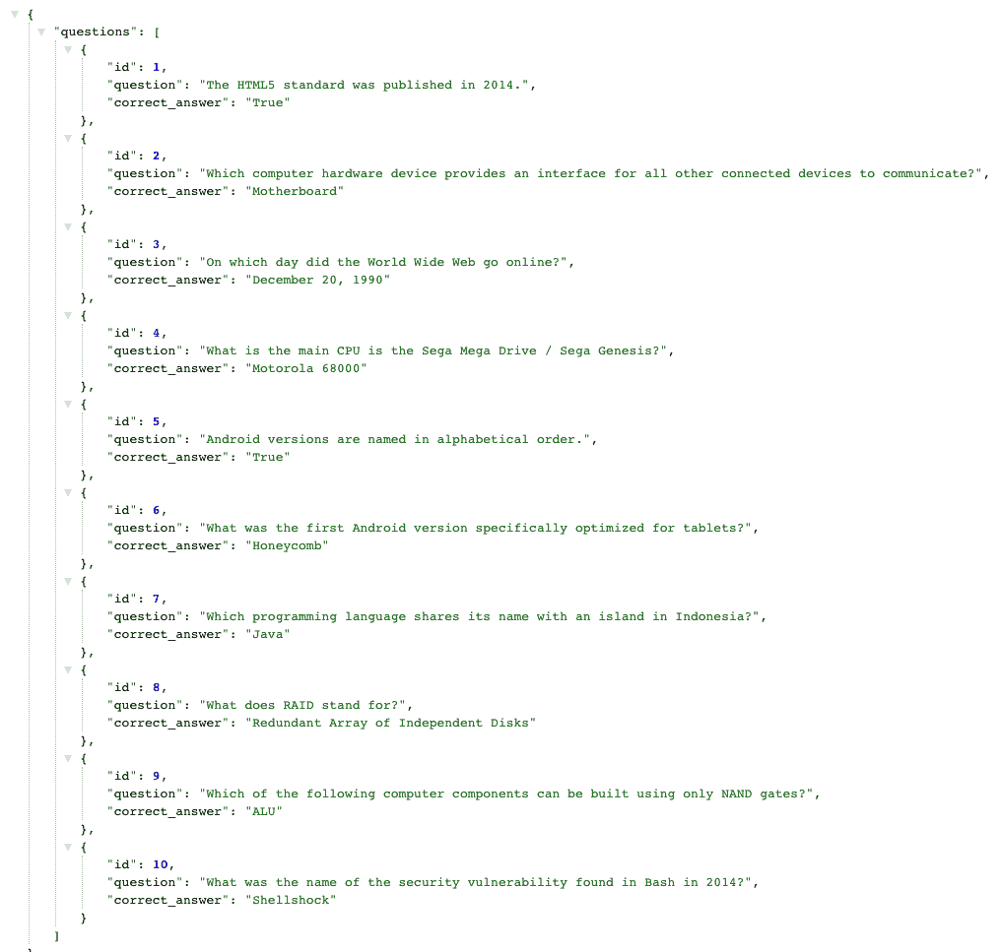
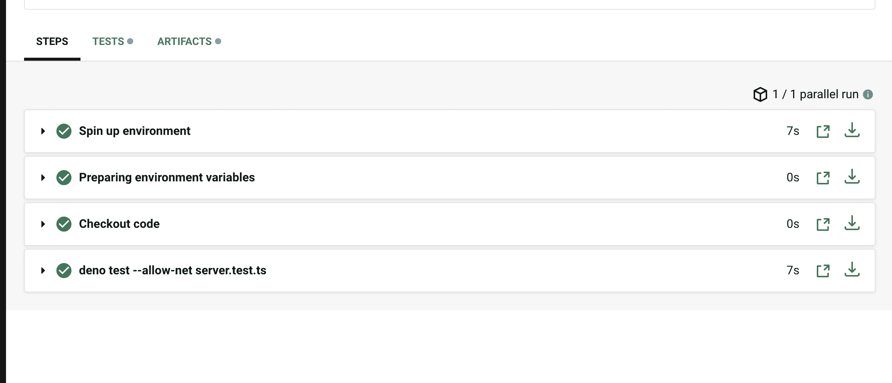

# Deno APIs | CircleCI 的持续集成

> 原文：<https://circleci.com/blog/continuous-integration-deno/>

提供软件服务的开发团队面临着速度和准确性之间的不断权衡。新特性应该在尽可能短的时间内以很高的准确性提供，这意味着没有停机时间。对于您的团队用来管理代码库的任何手动集成过程来说，由于人为错误而导致的不可预见的停机时间是很常见的。这种意外的中断可能是团队接受自动化集成过程的挑战的主要驱动力之一。

持续集成(CI)在速度和精度之间找到了一个最佳平衡点，可以尽可能快地提供各种功能。如果新代码的问题导致构建失败，那么被污染的构建就不会提供给客户。结果是客户不会经历停机时间。

在本文中，我将使用 CircleCI 来演示如何将 CI 应用到一个 [Deno](https://deno.land/) 项目中。在配套教程中，你可以[学习如何将你的 Deno 项目部署到 Heroku](https://circleci.com/blog/continuous-deployment-deno/) 。

Deno 是一个简单、现代、安全的 JavaScript 和 TypeScript 运行时。当您创建项目时，使用 Deno 具有以下优势:

1.  Deno 在默认情况下是安全的。除非明确启用，否则没有文件、网络或环境访问权限。
2.  它支持现成的 TypeScript。
3.  它作为单个可执行文件提供。

本教程的示例项目将是一个用 [Oak](https://deno.land/x/oak@v7.5.0/README.md) 构建的 API。这个 API 有一个返回测验问题列表的端点。将使用 [SuperOak](https://deno.land/x/superoak@2.2.0/README.md) 为端点编写一个测试用例。

## 先决条件

开始之前，请确保您的系统上安装了以下项目:

*   最新安装的 [Deno](https://deno.land/#installation)

对于存储库管理和持续集成，您需要:

*   一个 [GitHub](https://github.com/) 账户。你可以在这里创建一个[。](https://github.com/join)
*   一个 [CircleCI](https://circleci.com/) 账户。你可以在这里创建一个[。要轻松连接您的 GitHub 项目，您可以注册您的 GitHub 帐户。](https://circleci.com/signup/)

## 入门指南

创建一个新目录来保存所有项目文件:

```
mkdir deno_circleci

cd deno_circleci 
```

为了简单起见，您可以在我们的项目中导入一组硬编码的问题。创建一个名为`questions.ts`的文件并添加如下内容:

```
export default [
  {
    id: 1,
    question: "The HTML5 standard was published in 2014.",
    correct_answer: "True",
  },
  {
    id: 2,
    question:
      "Which computer hardware device provides an interface for all other connected devices to communicate?",
    correct_answer: "Motherboard",
  },
  {
    id: 3,
    question: "On which day did the World Wide Web go online?",
    correct_answer: "December 20, 1990",
  },
  {
    id: 4,
    question: "What is the main CPU in the Sega Mega Drive / Sega Genesis?",
    correct_answer: "Motorola 68000",
  },
  {
    id: 5,
    question: "Android versions are named in alphabetical order.",
    correct_answer: "True",
  },
  {
    id: 6,
    question:
      "What was the first Android version specifically optimized for tablets?",
    correct_answer: "Honeycomb",
  },
  {
    id: 7,
    question:
      "Which programming language shares its name with an island in Indonesia?",
    correct_answer: "Java",
  },
  {
    id: 8,
    question: "What does RAID stand for?",
    correct_answer: "Redundant Array of Independent Disks",
  },
  {
    id: 9,
    question:
      "Which of the following computer components can be built using only NAND gates?",
    correct_answer: "ALU",
  },
  {
    id: 10,
    question:
      "What was the name of the security vulnerability found in Bash in 2014?",
    correct_answer: "Shellshock",
  },
]; 
```

## 设置 Deno 服务器

在这一节中，我们将使用 [Oak](https://deno.land/x/oak@v7.3.0) 中间件框架来设置我们的 Deno 服务器。它是 Deno 的 [HTTP 服务器](https://doc.deno.land/https/deno.land/std/http/mod.ts)的框架。堪比 [Koa](https://koajs.com/) 和 [Express](https://expressjs.com/) 。首先，创建一个名为`server.ts`的文件，并向其中添加以下代码:

```
import { Application, Router } from "https://deno.land/x/oak@v7.5.0/mod.ts";
import questions from "./questions.ts";

const app = new Application();
const port = 8000;

const router = new Router();

router.get("/", (context) => {
  context.response.type = "application/json";
  context.response.body = { questions };
});

app.addEventListener("error", (event) => {
  console.error(event.error);
});

app.use(router.routes());
app.use(router.allowedMethods());

app.listen({ port });
console.log(`Server is running on port ${port}`);

export default app; 
```

在这个例子中，我们使用从 Oak 框架导入的`Application`和`Router`模块来创建一个新的应用程序，该应用程序监听端口`8000`上的请求。然后我们声明一个路由，该路由返回一个 JSON 响应，其中包含存储在`questions.ts`中的问题。我们还添加了一个事件监听器，每次发生错误时都会触发它。如果您需要在出现错误时进行调试，这将很有帮助。

## 运行应用程序

我们可以使用以下命令运行应用程序，看看到目前为止已经完成了什么:

```
deno run --allow-net server.ts 
```

导航至`http://localhost:8000/`查看响应。



## 为应用程序编写测试

现在我们已经设置了服务器并运行了应用程序，我们可以为我们的 API 端点编写一个测试用例了。创建一个名为`server.test.ts`的新文件，并将以下代码添加到其中:

```
import { superoak } from "https://deno.land/x/superoak@4.2.0/mod.ts";
import { delay } from "https://deno.land/x/delay@v0.2.0/mod.ts";
import app from "./server.ts";

Deno.test(
  "it should return a JSON response containing questions with status code 200",
  async () => {
    const request = await superoak(app);
    await request
      .get("/")
      .expect(200)
      .expect("Content-Type", /json/)
      .expect(/"questions":/);
  }
);

// Forcefully exit the Deno process once all tests are done.
Deno.test({
  name: "exit the process forcefully after all the tests are done\n",
  async fn() {
    await delay(3000);
    Deno.exit(0);
  },
  sanitizeExit: false,
}); 
```

在这个例子中，我们导入了在`server.ts`中创建的`superoak`模块和应用程序。然后我们声明一个测试用例，其中我们使用 SuperOak 和我们的应用程序创建一个请求。然后，我们向应用程序索引路由发出一个`GET`请求，并做出如下断言:

1.  返回一个`HTTP:OK`响应(`200`)
2.  收到的响应是一个 JSON 响应
3.  收到的 JSON 响应有一个名为`questions`的节点

## 在本地运行测试

导航到终端。从应用程序的根目录，使用 **CTRL + C** 停止服务器运行。然后发出以下命令来运行测试:

```
deno test --allow-net server.test.ts 
```

这应该是回应:

```
test it should return a JSON response containing questions with status code 200 ... ok (30ms)
test exit the process forcefully after all the tests are done
 ...% 
```

有了您的测试用例，您可以添加 CircleCI 配置。

## 添加 CircleCI 配置

在您的项目根目录中，创建一个名为`.circleci`的文件夹。将名为`config.yml`的文件添加到该目录中。

```
mkdir .circleci

touch .circleci/config.yml 
```

在`.circleci/config.yml`中添加:

```
# Use the latest 2.1 version of CircleCI pipeline process engine.
version: 2.1

jobs:
  build-and-test:
    docker:
      - image: denoland/deno:1.10.3
    steps:
      - checkout
      - run: |
          deno test --allow-net server.test.ts

workflows:
  sample:
    jobs:
      - build-and-test 
```

在本例中，我们做的第一件事是指定 CircleCI 管道流程引擎的版本。始终指定最新的版本(撰写本文时是 2.1)。

指定 CircleCI 版本后，我们指定一个名为`build-and-test`的[作业](https://circleci.com/docs/concepts/#jobs)。这项工作有两个关键环节:`docker`和`steps`。`docker`块指定了我们构建过程成功运行所需的映像。在这种情况下，我们使用官方的 [Deno](https://registry.hub.docker.com/r/denoland/deno) Docker 图像。

`steps`模块执行以下操作:

1.  从我们的 GitHub 库签出最新的代码
2.  运行`server.test.ts`中的测试

按照`workflows`块中的规定执行`build-and-test`任务。

接下来，我们需要在 GitHub 上建立一个存储库，并将项目链接到 CircleCI。如需帮助，请查看这篇文章:[将您的项目推送到 GitHub](https://circleci.com/blog/pushing-a-project-to-github/) 。

## 将项目添加到 CircleCI

登录您的 CircleCI 帐户。如果你注册了你的 GitHub 账户，你所有的库都会显示在你项目的仪表盘上。

在您的`deno_circleci`项目旁边，点击**设置项目**。

CircleCI 将检测项目中的`config.yml`文件。点击**使用现有配置**，然后**开始建造**。您的第一个构建过程将开始运行并成功完成。

点击**构建和测试**查看工作步骤和每个工作的状态。



## 结论

在本教程中，我向您展示了如何使用 GitHub 和 CircleCI 为 Deno 应用程序建立持续集成管道。虽然我们的应用程序很简单，只有一个端点和一个测试用例，但是我们涵盖了管道配置和特性测试的关键领域。

CI 建立在测试和版本控制的软件开发最佳实践的基础上，使向软件添加新功能的过程自动化。这消除了人为错误导致生产环境停机的风险。它还为维护的软件增加了额外的质量控制和保证。尝试持续集成，让代码库瓶颈成为团队的过去！

本教程的完整代码库可从 GitHub 上的[获得。](https://github.com/CIRCLECI-GWP/deno_circleci)

* * *

[Oluyemi](https://twitter.com/yemiwebby) 是一名拥有电信工程背景的技术爱好者。出于对解决用户日常遇到的问题的浓厚兴趣，他冒险进入编程领域，并从那时起将他的问题解决技能用于构建 web 和移动软件。Oluyemi 是一名热衷于分享知识的全栈软件工程师，他在世界各地的几个博客上发表了大量技术文章和博客文章。作为技术专家，他的爱好包括尝试新的编程语言和框架。

* * *

Oluyemi 是一名拥有电信工程背景的技术爱好者。出于对解决用户日常遇到的问题的浓厚兴趣，他冒险进入编程领域，并从那时起将他的问题解决技能用于构建 web 和移动软件。Oluyemi 是一名热衷于分享知识的全栈软件工程师，他在世界各地的几个博客上发表了大量技术文章和博客文章。作为技术专家，他的爱好包括尝试新的编程语言和框架。

[阅读更多 Olususi Oluyemi 的帖子](/blog/author/olususi-oluyemi/)