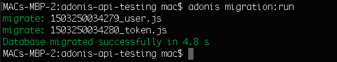
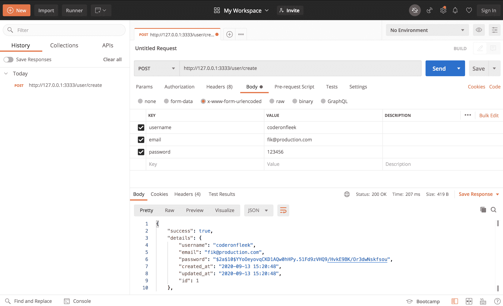
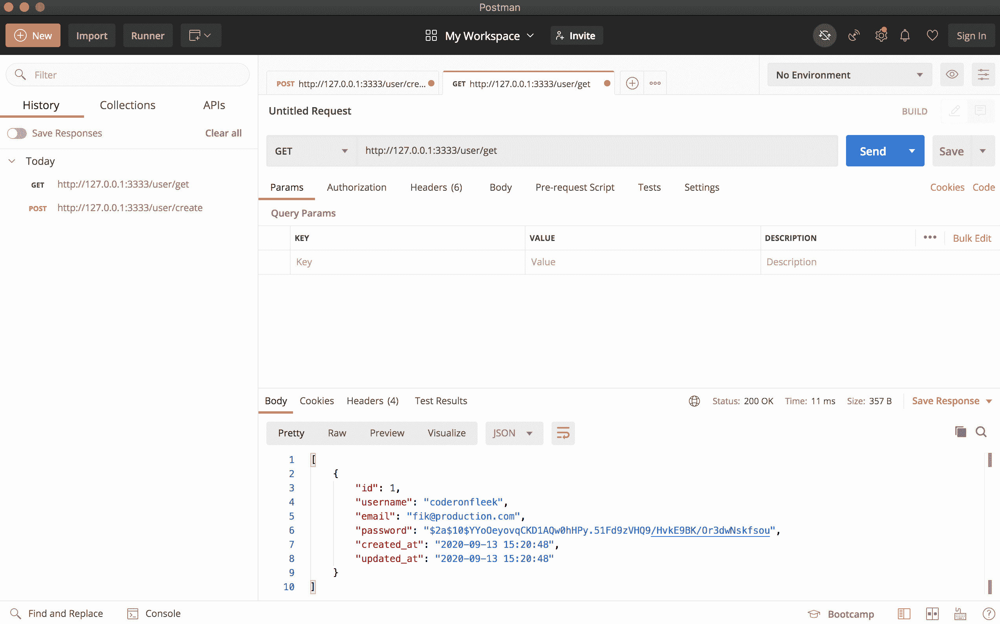
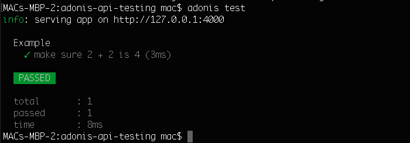
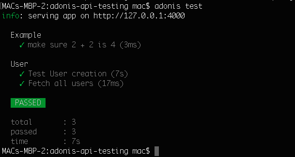
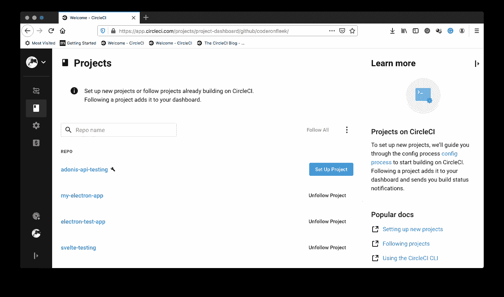
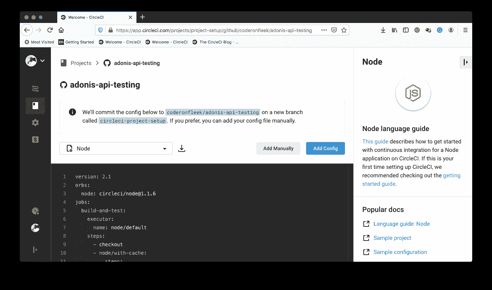
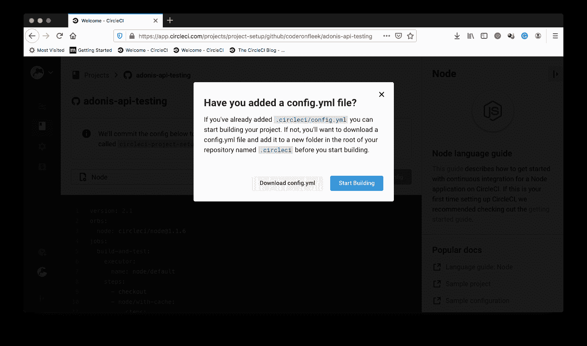
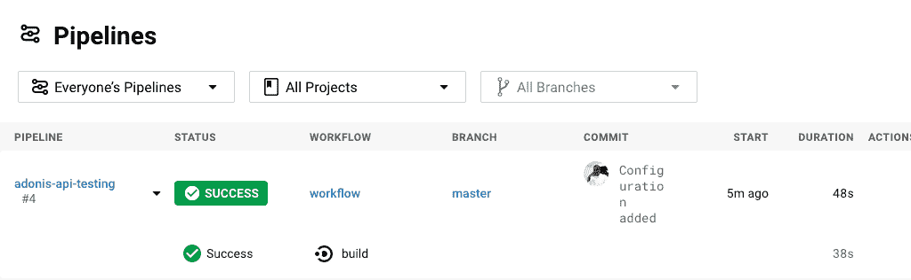
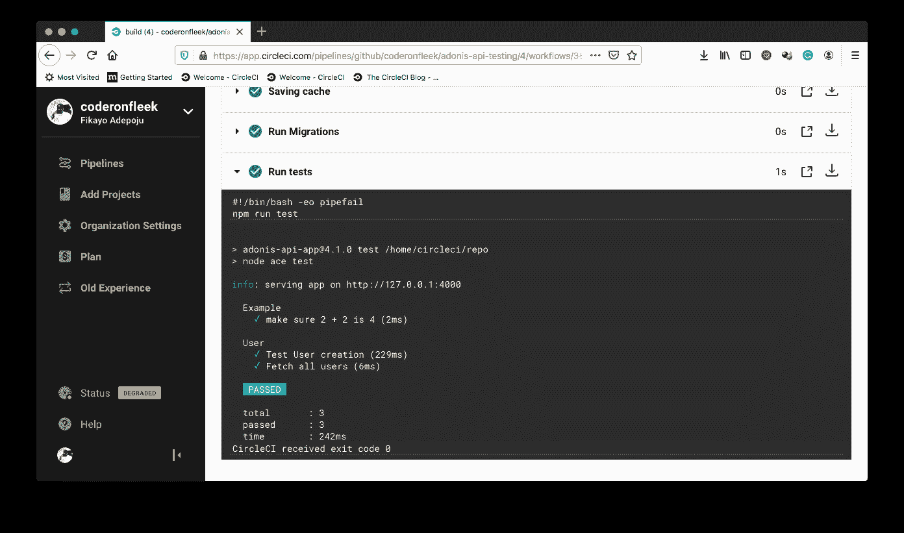

# Adonis APIs | CircleCI 的持续集成

> 原文：<https://circleci.com/blog/continuous-integration-for-adonis-apis/>

[Adonis.js](https://adonisjs.com/) 是发展最快的 [Node.js](https://nodejs.org) 框架之一。正如其主页上所说，该框架是为[测试驱动开发(TDD)](https://circleci.com/blog/how-to-test-software-part-ii-tdd-and-bdd/) 的粉丝设计的。作为这种设计的一个特性，它与一个专门的测试框架捆绑在一起。

在本教程中，您将学习如何自动测试 Adonis.js API，以便您的测试将在代码库的每次更改时运行。

## 先决条件

要遵循本教程，需要做一些事情:

1.  Javascript 的基础知识
2.  安装在您系统上的[node . js](https://nodejs.org)(>= 8.0)
3.  全球安装的 Adonis.js CLI
4.  一个[圆](https://circleci.com/signup/)的账户
5.  GitHub 的一个账户

所有这些安装和设置，让我们开始教程。

## 克隆 Adonis.js API 项目

首先，您需要克隆我们将要测试的 API 项目。在您的终端中，运行以下命令来克隆基础项目:

```
git clone --single-branch --branch base-project https://github.com/CIRCLECI-GWP/adonis-api-testing.git 
```

这将立即将存储库的`base-project`分支克隆到您运行上述命令的位置。这是 API 项目的起点。它没有测试设置。

接下来，进入项目的根目录并安装所需的依赖项:

```
cd adonis-api-testing
npm install 
```

然后，在项目的根目录下创建一个名为`.env`(注意点`.`)的新文件，并粘贴如下配置:

```
HOST=127.0.0.1
PORT=3333
NODE_ENV=development
APP_NAME=AdonisJs
APP_URL=http://${HOST}:${PORT}
CACHE_VIEWS=false
APP_KEY=pfi5N2ACN4tMJ5d8d8BPHfh3FEuvleej
DB_CONNECTION=sqlite
DB_HOST=127.0.0.1
DB_PORT=3306
DB_USER=root
DB_PASSWORD=
DB_DATABASE=adonis
HASH_DRIVER=bcrypt 
```

上面的配置指定我们处于开发环境中，并且我们将使用名为`adonis`的`SQlite`数据库进行持久存储。要获得我们的数据库和数据库模式设置，请使用以下命令运行 Adonis.js 项目迁移:

```
adonis migration:run 
```



我们现在已经完全设置好了我们的应用程序，可以开始试用了。通过运行以下命令启动应用程序:

```
adonis serve --dev 
```

该命令将启动在`http://127.0.0.1:3333`运行的 API。如果`3333`已经在您的系统上使用，端口可能会不同。

我们的 API 是一个简单的`User`账户 API。正如在`./start/routes.js`文件中看到的，它包含两个主要端点。

```
// start/routes.js

"use strict";

const Route = use("Route");

Route.get("/", () => {
  return { greeting: "Welcome to the Adonis API tutorial" };
});

//User api routes
Route.group(() => {
  Route.post("create", "UserController.create");

  Route.route("get", "UserController.fetch", ["GET", "POST"]);
}).prefix("user"); 
```

`create`路由调用`UserController`的`create`方法，通过提供一个`username`、`email`和`password`来创建一个新用户。我们还有一个`get`端点，它简单地调用`UserController`的`fetch`函数来返回数据库中的用户数组。这些控制器功能的实现可以在下面显示的`app/Controllers/Http/UserController.js`文件中找到。

```
// app/Controllers/Http/UserController.js

async create({ request, response }) {
    const data = request.post();

    const rules = {
        username: `required|unique:${User.table}`,
        email: `required|unique:${User.table}`,
        password: `required`
    };

    const messages = {
        "username.required": "A username is required",
        "username.unique": "This username is taken. Try another.",
        "email.required": "An Email is required",
        "email.unique": "Email already exists",
        "password.required": "A password for the user"
    };

    const validation = await validate(data, rules, messages);

    if (validation.fails()) {
        const validation_messages = validation.messages().map((msgObject) => {
            return msgObject.message;
        });

        return response.status(400).send({
            success: false,
            message: validation_messages
        });
    }

    try {
        let create_user = await User.createUser(data);

        let return_body = {
            success: true,
            details: create_user,
            message: "User Successully created"
        };

        response.send(return_body);
    } catch (error) {
        Logger.error("Error : ", error);
        return response.status(500).send({
            success: false,
            message: error.toString()
        });
    }
} //create

async fetch({ request, response }) {
    const data = request.all();

    try {
      const users = await User.getUsers(data);

      response.send(users);
    } catch (error) {
      Logger.error("Error : ", error);
      return response.status(500).send({
        success: false,
        message: error.toString(),
      });
    }
} //fetch 
```

## 用 Postman 测试 API

现在让我们通过调用我们的端点来测试我们的 API。我们将使用[邮递员](https://www.postman.com/)来测试我们的端点。确保您的应用程序正在运行。如果没有，再次运行`adonis serve --dev`。

### 测试用户创建



### 测试用户提取



## 设置测试框架

下一步是为测试 Adonis.js 应用程序建立测试框架。幸运的是，Adonis.js 有自己的专门测试包，名为 [Vow](https://www.npmjs.com/package/@adonisjs/vow) 。使用以下命令安装`Vow`:

```
adonis install @adonisjs/vow 
```

此软件包的安装将导致您的项目发生以下变化:

*   一个`vowfile.js`文件将被创建在你的项目的根目录下。
*   将在项目的根目录下创建一个`test`文件夹。这是包含所有测试的地方。为了组织测试，所有的单元测试都被放在这个文件夹中的一个`unit`文件夹中。功能测试放在一个`functional`文件夹中。默认情况下，在`test/unit/example.spec.js`中创建一个样本单元测试套件。
*   在项目的根目录下创建一个`.env.testing`文件，包含特定于测试目的的环境变量。这个文件与`.env`合并，所以你只需要从`.env`文件中定义你想要覆盖的值。

用以下配置替换`.env.testing`的内容:

```
HOST=127.0.0.1
PORT=4000
NODE_ENV=testing
APP_NAME=AdonisJs
APP_URL=http://${HOST}:${PORT}
CACHE_VIEWS=false
APP_KEY=pfi5N2ACN4tMJ5d8d8BPHfh3FEuvleej
DB_CONNECTION=sqlite
DB_HOST=127.0.0.1
DB_PORT=3306
DB_USER=root
DB_PASSWORD=
DB_DATABASE=adonis
HASH_DRIVER=bcrypt 
```

完成测试设置的最后一步是将`Vow`提供者添加到我们的项目中。在`./start/app.js`文件中，将以下项目添加到`aceProviders`数组中:

```
...

const aceProviders = [
  ....,
  "@adonisjs/vow/providers/VowProvider"
];

... 
```

通过运行以下命令运行`Vow`安装附带的示例测试:

```
adonis test 
```

示例测试将成功运行。



## 添加测试

现在是时候开始向我们的 API 项目添加一些适当的测试了。我们将添加测试来测试我们的`create`和`get`端点。运行以下命令来创建一个测试套件，我们将在其中放置我们的测试:

```
adonis make:test User 
```

在运行该命令后显示的选项中，选择`Functional test`(使用箭头键)并按下`Enter`。

测试套件的新文件将在`test/functional/user.spec.js`自动创建。在该文件中，用以下代码替换内容:

```
// test/functional/user.spec.js

"use strict";

const { test, trait, after } = use("Test/Suite")("User");

const User = use("App/Models/User");

trait("Test/ApiClient");

const randomString = generateRandomString();

test("Test User creation", async ({ client }) => {
  const userData = {
    username: randomString,
    email: `${randomString}@test.com`,
    password: "123456"
  };

  const response = await client.post("/user/create").send(userData).end();

  response.assertStatus(200);
}).timeout(0);

test("Fetch all users", async ({ client }) => {
  const response = await client.get("/user/get").end();

  response.assertStatus(200);
  response.assertJSONSubset([
    {
      username: randomString,
      email: `${randomString}@test.com`
    }
  ]);
}).timeout(0);

//Delete the created user
after(async () => {
  await (await User.findBy("username", randomString)).delete();
});

function generateRandomString(length = 7) {
  var result = "";
  var characters =
    "ABCDEFGHIJKLMNOPQRSTUVWXYZabcdefghijklmnopqrstuvwxyz0123456789";
  var charactersLength = characters.length;
  for (var i = 0; i < length; i++) {
    result += characters.charAt(Math.floor(Math.random() * charactersLength));
  }
  return result;
} 
```

在上面的测试套件中，Adonis.js `Test/ApiClient`特征用于访问`client`对象，该对象用于调用我们的端点。`generateRandomString`随机数生成器功能用于为测试用户创建一个假的用户名和电子邮件。

在`Test User creation`测试中，我们通过用适当的数据调用`create`端点来创建一个新用户，并检查我们是否得到了一个表明操作成功的`200`响应代码。

在`Fetch all users`测试中，`client`对象用于调用我们的`get`端点。然后测试响应以确保它返回一个`200`状态代码。我们还检查它是否返回一个包含我们在之前的测试中创建的用户的数组。

我们将`.timeout(0)`附加到每个测试，以覆盖测试运行程序的超时限制，因为功能和浏览器测试可能需要一段时间才能运行。

最后，我们通过删除我们创建的测试用户来做一些清理工作。这是在两个测试都完成后进行的。

运行包含在`tests`文件夹中的所有测试的时间。为此，再次运行测试命令:

```
adonis test 
```



## 将 API 项目连接到 CircleCI

我们的下一个任务是在 CircleCI 建立我们的项目。从[将你的项目推送到 GitHub](https://circleci.com/blog/pushing-a-project-to-github/) 开始。

接下来，转到 CircleCI 仪表板上的**添加项目**页面来添加项目。



点击**设置项目**。



在设置页面上，单击**手动添加**以指示 CircleCI 我们将手动添加配置文件，而不使用显示的示例。接下来，您会得到提示，要么下载管道的配置文件，要么开始构建。



点击**开始构建**开始构建。这个构建将会失败，因为我们还没有设置我们的配置文件，稍后我们将会这样做。

## 自动化我们的测试

现在我们已经将项目连接到 CircleCI，我们可以为我们的[持续集成(CI)](https://circleci.com/continuous-integration/) 管道编写一个配置，这将使我们的测试过程自动化。

在项目的根目录下，创建一个名为`.circleci`的文件夹，并在其中创建一个名为`config.yml`的文件。在`config.yml`文件中，输入以下代码:

```
version: 2.1
jobs:
  build:
    working_directory: ~/repo
    docker:
      - image: circleci/node:11-browsers
    steps:
      - checkout
      - run:
          name: Update NPM
          command: "sudo npm install -g npm"
      - restore_cache:
          key: dependency-cache-{{ checksum "package-lock.json" }}
      - run:
          name: Install Dependencies
          command: npm install
      - save_cache:
          key: dependency-cache-{{ checksum "package-lock.json" }}
          paths:
            - ./node_modules
      - run:
          name: Run Migrations
          command: |
            mv .env.testing .env
            node ace migration:run
      - run:
          name: Run tests
          command: npm run test 
```

在上面的配置文件中，我们从更新`npm`开始，以确保我们使用的是最新版本。接下来，我们安装所需的依赖项并缓存它们。然后我们创建我们的环境配置文件(`.env`)并运行我们的迁移。随着所有依赖项和数据库的建立，我们运行我们的测试。

保存该文件，提交并将您的更改推送到您的存储库，以触发 CI 管道运行。



让我们通过点击构建来查看我们的测试结果。



当我们将新代码推送到我们的库时，我们的测试现在会自动运行。

## 结论

测试驱动开发(TDD)是一种最佳实践，许多开发人员仍在努力将其集成到他们的开发流程中。拥有一个将 TDD 内置于其核心的框架确实使采用它变得不那么麻烦。在本教程中，我们学习了如何设置 Adonis.js API 的测试，以及如何使用 CircleCI 自动完成这个过程。

编码快乐！

* * *

Fikayo Adepoju 是 LinkedIn Learning(Lynda.com)的作者、全栈开发人员、技术作者和技术内容创建者，精通 Web 和移动技术以及 DevOps，拥有 10 多年开发可扩展分布式应用程序的经验。他为 CircleCI、Twilio、Auth0 和 New Stack 博客撰写了 40 多篇文章，并且在他的个人媒体页面上，他喜欢与尽可能多的从中受益的开发人员分享他的知识。你也可以在 Udemy 上查看他的视频课程。

[阅读 Fikayo Adepoju 的更多帖子](/blog/author/fikayo-adepoju/)