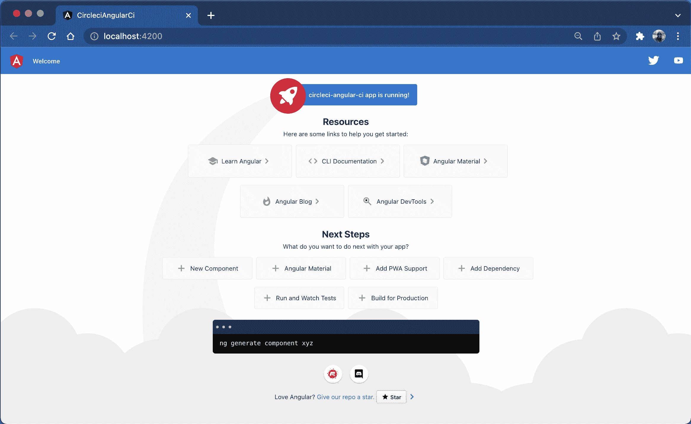
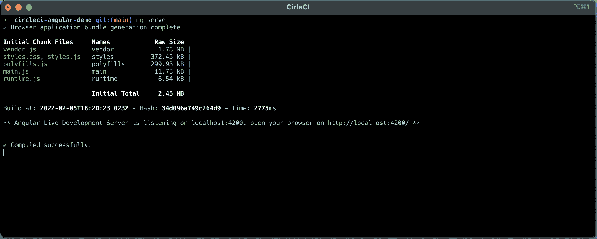
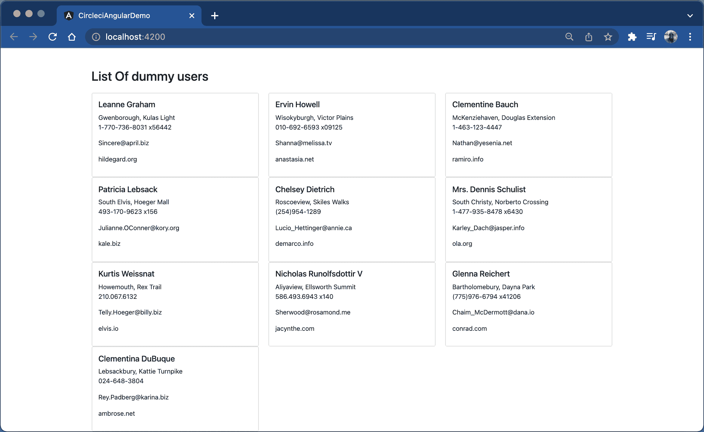
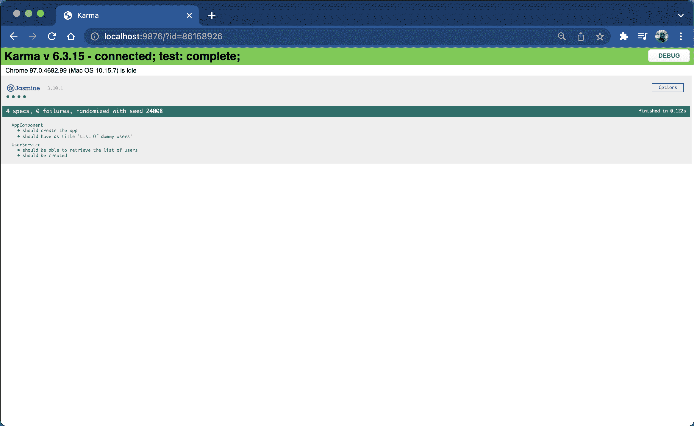
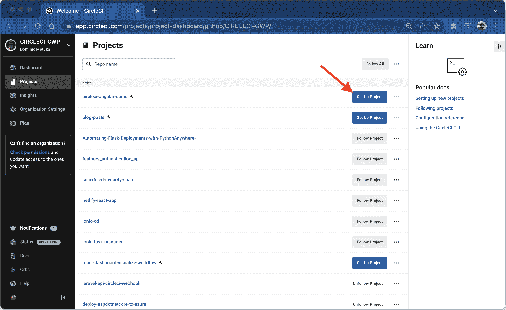
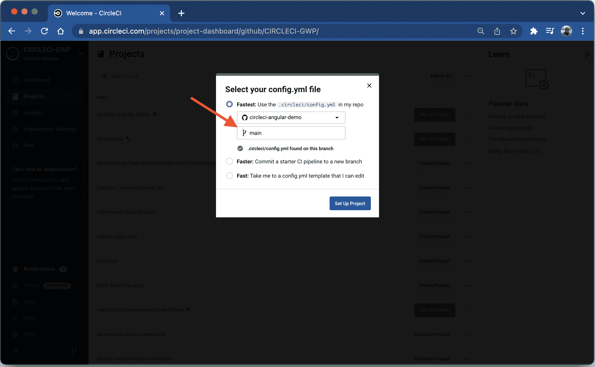
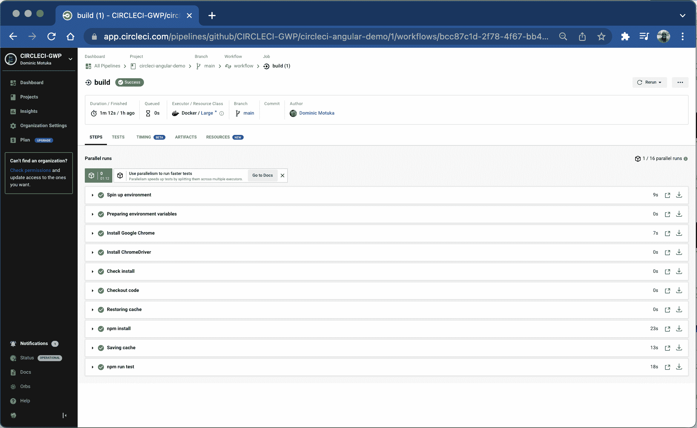

# 角度应用的持续集成| CircleCI

> 原文：<https://circleci.com/blog/continuous-integration-for-angular-applications/>

> 本教程涵盖:
> 
> 1.  设置示例角度应用
> 2.  为您的 Angular 应用程序创建和运行测试
> 3.  通过持续集成实现自动化角度测试

自动化测试是您持续集成实践的基础。自动化测试澄清了您团队的应用程序的构建过程的状态，确保测试在每个提交或拉请求时运行，并保证您可以在部署到生产环境之前快速修复错误。

在本教程中，我将向你展示如何自动化测试一个角度应用程序。Angular 是一个完全用 TypeScript 编写的框架，流行于构建任何规模或复杂度的 T2 单页应用程序。Angular 由 Google 创建并开源，为构建 web 应用程序提供了一个标准结构。

我将引导您构建一个简单的 Angular 应用程序来检索虚拟用户列表。该列表来自一个名为 [JSONPlaceholder](https://jsonplaceholder.typicode.com/) 的免费、假冒的 RESTful API，它通常用于测试和原型开发。

## 先决条件

对于本教程，您需要:

本教程已在以下版本中进行了测试:

*   角度 CLI: 13.2.2
*   节点:16.13.2
*   软件包管理器:npm 8.1.2
*   操作系统:达尔文 x64

> 我们的教程是平台无关的，但是使用 CircleCI 作为例子。如果你没有 CircleCI 账号，请在 注册一个免费的 [**。**](https://circleci.com/signup/)

## 入门指南

首先，通过运行以下命令搭建一个新的 Angular 应用程序:

```
ng new circleci-angular-ci 
```

系统会提示您回答一些问题:

*   键入 **No** 忽略角度路由。本教程不需要它。
*   选择 **CSS** 选项作为样式表格式。
*   按**进入**，等待 Angular CLI 搭建新应用。

安装完成后，将在您的开发文件夹中创建一个名为`circleci-angular-ci`的新文件夹(或者当您从运行上一个命令时)。转到新创建的 Angular 应用程序，使用以下命令运行它:

```
// navigate into the folder
cd circleci-angular-ci

// run the application
ng serve 
```

使用浏览器转到默认 URL: `http://localhost:4200`上的应用程序。



## 创建用户服务

正如我前面提到的，这个演示应用程序从第三方 API 中检索一个虚拟用户列表。对于 Angular 应用程序，标准做法是将业务逻辑和与第三方 API 的通信抽象为服务。这种实践促进了代码的可重用性。

要使用 Angular CLI 创建服务，请运行以下命令:

```
ng g service service/user 
```

这个命令在`user.service.ts`中生成一个名为`UserService`的新服务。它还在`src/app/service`文件夹中创建一个名为`user.service.spec.ts`的测试文件。

首先修改`src/app/service/user.service.ts`文件的内容。替换为以下内容:

```
import { HttpClient } from "@angular/common/http";
import { Injectable } from "@angular/core";
import { User } from "../user";

@Injectable({
  providedIn: "root",
})
export class UserService {
  apiURL: string = "https://jsonplaceholder.typicode.com/users";

  constructor(private httpClient: HttpClient) {}

  public getUsers() {
    return this.httpClient.get<User[]>(`${this.apiURL}`);
  }
} 
```

这些必需的包已导入:

*   `HttpClient`在 Angular 中使用，提供客户端 HTTP 协议，增强客户端和服务器之间的通信。
*   是一个装饰器，它使得一个类可以作为依赖项被提供和注入。

定义了从中检索用户列表的端点，并创建了一个名为`getUser()`的方法。这个方法将从 API 返回包含用户列表的 JSON 结果。

在您可以使用`HttpClient`与项目中的 API 通信之前，您需要在根`AppModule`中导入`HttpClientModule`。打开`src/app/app.module.ts`，如下图所示进行修改:

```
import { NgModule } from "@angular/core";
import { BrowserModule } from "@angular/platform-browser";
import { HttpClientModule } from "@angular/common/http";
import { AppComponent } from "./app.component";

@NgModule({
  declarations: [AppComponent],
  imports: [BrowserModule, HttpClientModule],
  providers: [],
  bootstrap: [AppComponent],
})
export class AppModule {} 
```

### 创建用户界面

在上一节中，我们在`UserService`中引用了一个名为`user.ts`的文件。这是一个有助于识别 API 预期返回的每个属性的数据类型的接口。在`src/app`文件夹中创建一个名为`user.ts`的新文件，并用以下内容填充它:

```
export interface User {
  id: number;
  name: string;
  email: string;
  phone: string;
  website: string;
  address: {
    street: string;
    suite: string;
    city: string;
    zipcode: string;
  };
} 
```

## 修改应用程序组件

通过依赖注入将`UserService`注入到 app 组件中来修改 app 组件。然后，使用它来检索用户列表。

```
import { Component } from "@angular/core";
import { User } from "./user";
import { UserService } from "./service/user.service";

@Component({
  selector: "app-root",
  templateUrl: "./app.component.html",
  styleUrls: ["./app.component.css"],
})
export class AppComponent {
  title = "List Of dummy users";

  constructor(private userService: UserService) {}

  users: User[] = [];

  ngOnInit(): void {
    this.userService.getUsers().subscribe((res) => {
      this.users = res;
      return this.users;
    });
  }
} 
```

## 显示用户列表

接下来，打开`src/app/app.component.html`文件，将其内容替换为:

```
<div class="page-content">
  <div class="container content-wrapper">
    <div class="page-title">
      <h2>{{ title }}</h2>
    </div>
    <div class="row">
      <div *ngFor="let user of users" class="col-md-4">
        <div class="card">
          <div class="card-body">
            <h5 class="card-title">{{ user.name }}</h5>
            <div class="card-text">
              <span>{{ user.address.city }}, {{ user.address.street }}</span>
            </div>
            <div>
              <p>{{ user.phone }}</p>
              <p>{{ user.email }}</p>
              <p>{{ user.website }}</p>
            </div>
          </div>
        </div>
      </div>
    </div>
  </div>
</div> 
```

在这个代码片段中，我们遍历了列表`users`并将其呈现在 HTML 中。

## 向应用程序添加样式

为了设计本教程的应用程序，我们将使用 Bootstrap。发出以下命令通过 NPM 安装引导程序:

```
npm install bootstrap 
```

安装完成后，打开`angular.json`文件。将`bootstrap.css`文件包含在其中，如下所示:

```
"styles": [
      "./node_modules/bootstrap/dist/css/bootstrap.css",
      "src/styles.css"
], 
```

通过打开`style.css`包含额外的自定义样式。添加此内容:

```
.page-content {
  margin-top: 100px;
}
.content-wrapper {
  display: grid;
  grid-template-columns: repeat(auto-fill, minimax(305px, 1fr));
  grid-gap: 15px;
} 
```

从终端按下 **CTRL + C** 停止应用程序。用`ng serve`重新开始，这样新的样式表就会生效。



您已经有了用户列表，并完成了样式表更改。



您的角度应用程序已经启动并运行。现在是时候开始编写测试`UserService`和`AppComponent`的脚本了

## 测试用户服务和应用组件

在`AppComponent`中，必须创建应用程序并显示适当的标题。为了确保这一点，打开`src/app/app.component.spec.ts`,将其内容替换为:

```
import { TestBed } from "@angular/core/testing";
import { AppComponent } from "./app.component";
import { HttpClientModule } from "@angular/common/http";
import { UserService } from "./service/user.service";

describe("AppComponent", () => {
  beforeEach(async () => {
    await TestBed.configureTestingModule({
      declarations: [AppComponent],
      providers: [UserService],
      imports: [HttpClientModule],
    }).compileComponents();
  });

  it("should create the app", () => {
    const fixture = TestBed.createComponent(AppComponent);
    const app = fixture.componentInstance;
    expect(app).toBeTruthy();
  });

  it(`should have as title 'List Of dummy users'`, () => {
    const fixture = TestBed.createComponent(AppComponent);
    const app = fixture.componentInstance;
    expect(app.title).toEqual("List Of dummy users");
  });
}); 
```

接下来，`UserService`将测试`*getUsers()*`方法是否按照预期返回用户列表。为了演示这一点，您将创建一个用户对象数组，它具有我们期望从 API 获得的结构。

将`src/app/service/user.service.spec.ts`的内容替换为:

```
import { TestBed } from "@angular/core/testing";
import { UserService } from "./user.service";
import { HttpClientModule } from "@angular/common/http";
import { User } from "../user";

describe("UserService", () => {
  let service: UserService;

  beforeEach(() => {
    TestBed.configureTestingModule({
      imports: [HttpClientModule],
      providers: [UserService],
    });
    service = TestBed.inject(UserService);
  });

  it("should be created", () => {
    expect(service).toBeTruthy();
  });

  it("should be able to retrieve the list of users", () => {
    const dummyUsers: User[] = [
      {
        id: 1,
        name: "Oluyemi",
        email: "yem@me.com",
        phone: "43434343",
        website: "me.com",
        address: {
          street: "sample street",
          suite: "29",
          city: "Abuja",
          zipcode: "23401",
        },
      },
      {
        id: 1,
        name: "Temi",
        email: "tem@me.com",
        phone: "55242",
        website: "tems.com",
        address: {
          street: "Tems street",
          suite: "45",
          city: "LAgos",
          zipcode: "23401",
        },
      },
    ];

    service.getUsers().subscribe((users) => {
      expect(users.length).toBe(10);
      expect(users).toEqual(dummyUsers);
    });

    expect(dummyUsers).toHaveSize(2);
  });
}); 
```

这段代码导入了运行所有测试所需的所有包。它还在“beforeEach”方法中初始化了被测组件及其依赖项。对于`getUsers()`方法，我们期望长度为`10`并且`users`列表中每个对象的结构等于`*dummyUsers*`数组的结构。

## 在本地运行测试

接下来，确认您定义的测试正在按预期运行。从终端发出以下命令:

```
npm run test 
```

这将在观察模式下构建应用程序，并启动 Karma 测试运行程序。它还会打开一个 Chrome 浏览器来显示测试输出。



虽然这在本地可能是可以接受的，但是您可能不希望在使用 CircleCI 进行自动化测试时启动浏览器。为了调整这一点，你可以使用[无头 Chrome](https://circleci.com/blog/headless-chrome-more-reliable-efficient-browser-testing/) ，这是一种在没有完整浏览器 UI 的环境下运行 Chrome 浏览器的方法。像这样更新`package.json`文件中的脚本对象:

```
 "scripts": {
    "ng": "ng",
    "start": "ng serve",
    "build": "ng build",
    "watch": "ng build --watch --configuration development",
    "test": "ng test --no-watch --no-progress --browsers=ChromeHeadless"
  }, 
```

您可以通过按下 **CTRL + C** 来停止测试运行。使用`npm run test`命令再次运行。

这是终端输出:

```
> circleci-angular-demo@0.0.0 test
> ng test --no-watch --no-progress --browsers=ChromeHeadless

03 01 2022 06:35:55.412:INFO [karma-server]: Karma v6.3.9 server started at http://localhost:9876/
03 01 2022 06:35:55.414:INFO [launcher]: Launching browsers ChromeHeadless with concurrency unlimited
03 01 2022 06:35:57.432:INFO [launcher]: Starting browser ChromeHeadless
03 01 2022 06:36:00.426:INFO [Chrome Headless 96.0.4664.110 (Mac OS 10.15.7)]: Connected on socket wXEU2YE-5tONdo2JAAAB with id 10965930
Chrome Headless 96.0.4664.110 (Mac OS 10.15.7): Executed 4 of 4 SUCCESS (0.026 secs / 0.059 secs)
TOTAL: 4 SUCCESS 
```

测试成功了。

## 自动化测试

既然您的应用程序已经准备好并且测试成功，那么您需要在 CircleCI 中创建自动化测试的过程。首先，创建一个名为`.circleci`的新文件夹，并在其中创建一个`config.yml`文件。将此内容添加到新文件:

```
version: 2.1
orbs:
  browser-tools: circleci/browser-tools@1.2.3
jobs:
  build:
    working_directory: ~/ng-project
    docker:
      - image: cimg/node:16.13.1-browsers
    steps:
      - browser-tools/install-chrome
      - browser-tools/install-chromedriver
      - run:
          command: |
            google-chrome --version
            chromedriver --version
          name: Check install
      - checkout
      - restore_cache:
          key: ng-project-{{ .Branch }}-{{ checksum "package-lock.json" }}
      - run: npm install
      - save_cache:
          key: ng-project-{{ .Branch }}-{{ checksum "package-lock.json" }}
          paths:
            - "node_modules"
      - run: npm run test 
```

orb 有用于浏览器测试的工具，比如 Chrome 和 ChromeDriver。`cimg/node:16.13.1-browsers` Docker 映像来自 CircleCI 映像注册表，并安装了运行测试的项目的所有依赖项。

接下来，在 GitHub 上建立一个存储库，并将项目链接到 CircleCI。查看[将您的项目推送到 GitHub](https://circleci.com/blog/pushing-a-project-to-github/) 以获取指导。

现在，登录你的 CircleCI 账户。如果你注册了你的 GitHub 账户，你所有的库都可以在你项目的仪表盘上看到。



点击**设置项目**按钮。将提示您是否已经在项目中定义了 CircleCI 的配置文件。



输入分支名称(对于本教程，我们使用`main`)。点击**设置项目**按钮完成该过程。您可以从仪表板查看构建。



你有它！

## 结论

在本教程中，您从头开始构建了一个 Angular 应用程序。您编写了主要应用程序组件和服务的基本测试，创建该服务是为了从第三方 API 检索用户列表。最后，您使用 CircleCI 自动化了测试。

Angular 是目前最流行的构建单页面应用程序的框架之一，它很可能还会存在一段时间。很有可能，你和你的团队将会承担一个自动化测试 Angular 应用的任务。

我希望这篇教程对你有所帮助。完整的源代码可以在[circle ci-GWP/circle ci-angular-demo](https://github.com/CIRCLECI-GWP/circleci-angular-demo.git)上找到。

* * *

[Oluyemi](https://twitter.com/yemiwebby) 是一名拥有电信工程背景的技术爱好者。出于对解决用户日常遇到的问题的浓厚兴趣，他冒险进入编程领域，并从那时起将他解决问题的技能用于构建 web 和移动软件。Oluyemi 是一名热衷于分享知识的全栈软件工程师，他在世界各地的几个博客上发表了大量技术文章和博客文章。由于精通技术，他的爱好包括尝试新的编程语言和框架。

* * *

Oluyemi 是一名拥有电信工程背景的技术爱好者。出于对解决用户日常遇到的问题的浓厚兴趣，他冒险进入编程领域，并从那时起将他的问题解决技能用于构建 web 和移动软件。Oluyemi 是一名热衷于分享知识的全栈软件工程师，他在世界各地的几个博客上发表了大量技术文章和博客文章。作为技术专家，他的爱好包括尝试新的编程语言和框架。

[阅读更多 Olususi Oluyemi 的帖子](/blog/author/olususi-oluyemi/)