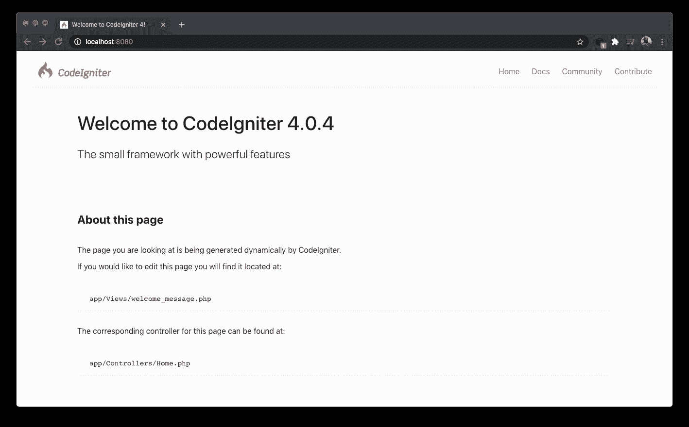
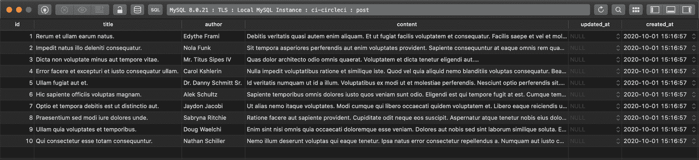
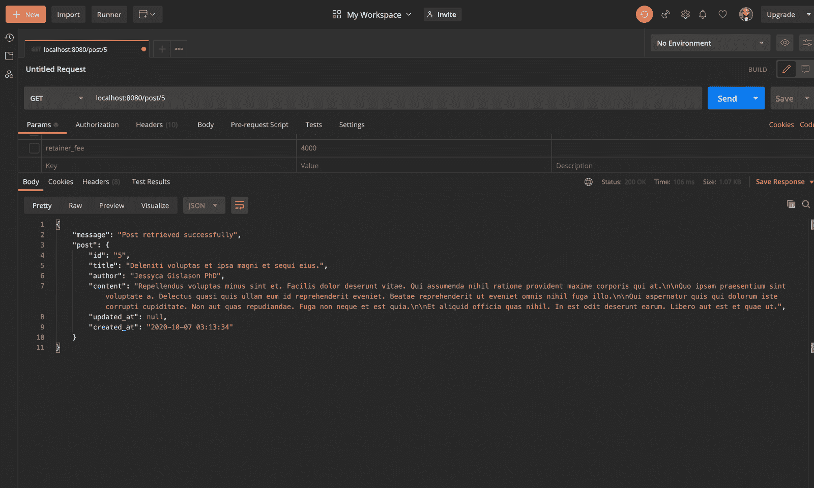
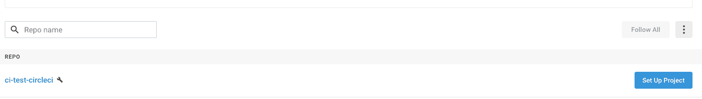
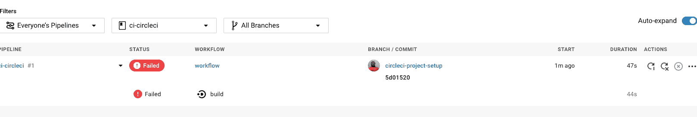
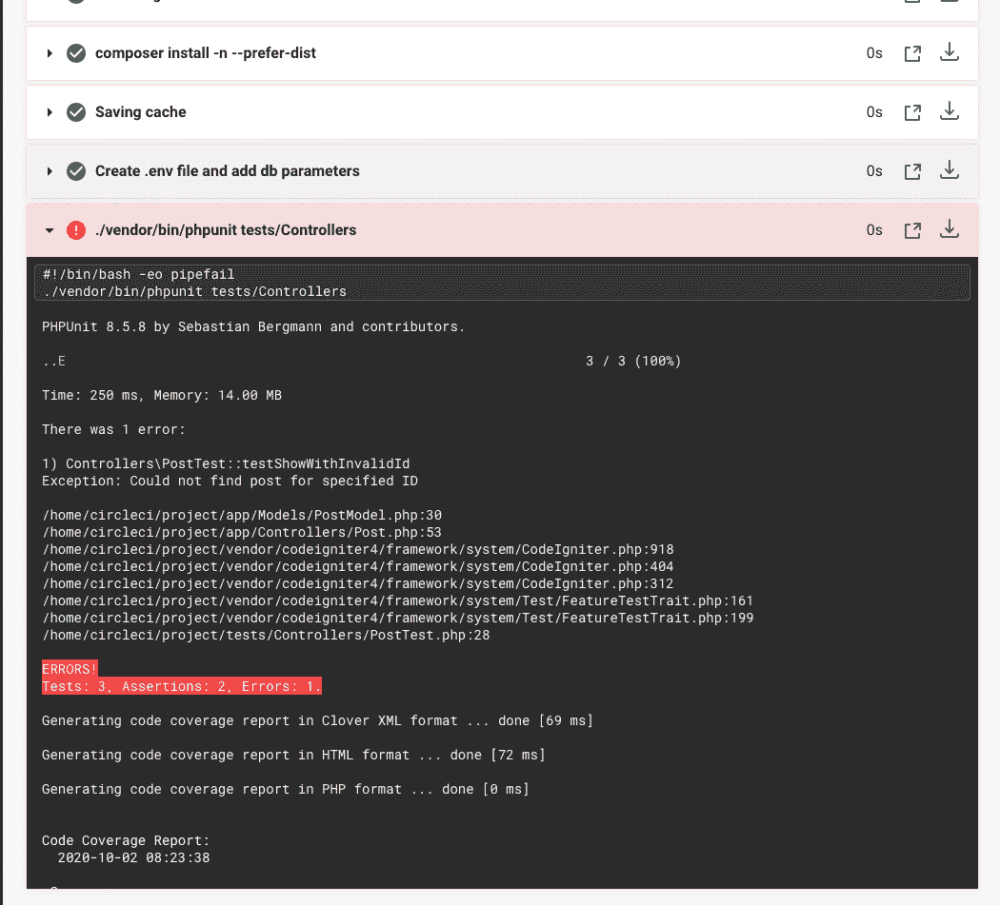
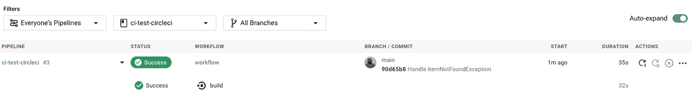

# CodeIgniter APIs 的持续集成| CircleCI

> 原文：<https://circleci.com/blog/continuous-integration-for-codeigniter-apis/>

管理代码库是软件开发团队的一个主要瓶颈。让团队按照他们自己的节奏工作必须与确保代码库在任何时候都是有效的相平衡。许多团队使用代码库中的分支来试图保持这种平衡。一些团队为每个新特性创建一个分支，而其他团队为每个环境使用不同的分支(例如，开发、试运行、生产)。无论您使用什么方法，您都需要在某个时候合并分支，通常是在变更被批准的时候。随着应用程序复杂性的增加或团队规模的扩大，瓶颈会变得更加严重。您的团队在合并到生产分支时遇到的问题可能会延迟新功能的部署或导致意外停机，这会对客户的士气产生负面影响，并对销售产生负面影响。

[持续集成(CI)](https://circleci.com/continuous-integration/) 旨在解决这些问题。使用 CI，您可以通过简单地将新特性的相关代码推送到存储库的主分支来触发集成。CI 渠道让您可以维护一个每个人都可以推进的主要分支。只有在成功构建的情况下，新添加的代码才被允许进入主分支。这不仅节省了时间，而且有助于减少人为错误带来的复杂性。CI 确保软件更新能够以快速可靠的方式执行。

在本教程中，我将向您展示如何使用 CircleCI 持续集成 CodeIgniter API。

## 先决条件

对 CodeIgniter 的基本理解可能会有所帮助，但我将在整个教程中提供解释和官方文档的链接。如果您对任何概念不清楚，您可以在继续之前查看链接的材料。

开始之前，请确保您的系统上安装了以下项目:

*   Composer : Composer 将用于您的 CodeIgniter 项目中的依赖管理。
*   本地数据库实例。虽然本教程将使用 MySQL，但是您可以自由选择您喜欢的数据库服务。

对于存储库管理和持续集成，您需要:

*   一个 [GitHub](https://github.com) 账户。你可以在这里创建一个[。](https://github.com/join)
*   一个 [CircleCI](https://circleci.com/) 账户。你可以在这里创建一个[。要轻松连接您的 GitHub 项目，您可以注册您的 GitHub 帐户。](https://circleci.com/signup/)

## 入门指南

首先，创建一个新的 CodeIgniter 项目:

```
$ composer create-project codeigniter4/appstarter ci-test-circleci 
```

这将启动一个新的 CodeIgniter 项目及其所有依赖项，安装在一个名为`ci-test-circleci`的文件夹中。

## 运行应用程序

移动到项目文件夹并运行应用程序:

```
$ php spark serve 
```

从浏览器导航到 [http://localhost:8080/](http://localhost:8080/) 打开欢迎页面。



在您的终端中，按`CTRL + C`停止应用程序，同时我们继续其余的设置。

对于本教程，我们将构建一个 API 来管理博客文章。该 API 将拥有创建、阅读、更新和删除博客文章的端点。为了简单起见，一篇博客文章将有三个字段:

我们的 API 将添加一个主键(`id`)、一个`created_at`字段和一个`updated_at`字段。

首先，设置您的本地 env 文件和数据库。

## 设置本地环境

使用以下命令将`env`文件复制到`.env`文件中:

```
$ cp env .env 
```

默认情况下，CodeIgniter 在生产模式下启动。在本教程中，我们将把它改为开发模式。在`.env`文件中，取消对`CI_ENVIRONMENT`变量的注释，并将其设置为 development:

```
CI_ENVIRONMENT = development 
```

接下来，在您的本地环境中创建一个数据库。取消对以下变量的注释，以更新每个值并建立到数据库的成功连接:

```
database.default.hostname = localhost
database.default.database = YOUR_DATABASE_NAME
database.default.username = YOUR_DATABASE_USERNAME
database.default.password = YOUR_DATABASE_PASSWORD
database.default.DBDriver = MySQLi # this is the driver for a mysql connection. There are also drivers available for postgres & sqlite3. 
```

用项目特定的值替换`YOUR_DATABASE`、`YOUR_DATABASE_USERNAME`和`YOUR_DATABASE_PASSWORD`占位符。

接下来，我们需要创建一个迁移文件，并在数据库中植入一些帖子。

## 迁徙和播种

现在您已经创建了一个数据库并建立了到它的连接，为`post`表创建迁移。

从终端，使用 [CodeIgniter CLI](https://codeigniter.com/user_guide/cli/index.html) 工具创建一个迁移文件:

```
$ php spark migrate:create 
```

CLI 将要求您命名迁移文件。然后，它将在`app/Database/Migrations`目录中创建迁移文件。我们正在创建的迁移的名称是`add_post`。

迁移文件名将以数字序列为前缀，格式为 **YYYY-MM-DD-HHIISS** 。前往 [CodeIgniter 文档](https://codeigniter.com/user_guide/dbmgmt/migration.html#id1)获取更详细的解释。

接下来，打开位于`app/Database/Migrations/YYYY-MM-DDHHIISS_add_post.php`的迁移文件并更新其内容:

```
<?php

namespace app\Database\Migrations;

use CodeIgniter\Database\Migration;

class AddPost extends Migration
{
    public function up()
    {
        $this->forge->addField([
            'id' => [
                'type' => 'INT',
                'constraint' => 5,
                'unsigned' => true,
                'auto_increment' => true,
            ],
            'title' => [
                'type' => 'VARCHAR',
                'constraint' => '100',
                'null' => false
            ],
            'author' => [
                'type' => 'VARCHAR',
                'constraint' => '100',
                'null' => false,
            ],
            'content' => [
                'type' => 'VARCHAR',
                'constraint' => '1000',
                'null' => false,
            ],
            'updated_at' => [
                'type' => 'datetime',
                'null' => true,
            ],
            'created_at datetime default current_timestamp',
        ]);
        $this->forge->addPrimaryKey('id');
        $this->forge->createTable('post');
    }

    public function down()
    {
        $this->forge->dropTable('post');
    }
} 
```

现在，运行您的迁移:

```
 $ php spark migrate 
```

该命令在数据库中创建一个`post`表，并添加迁移中列出的列。

为了使开发更容易，在数据库中植入一些虚拟客户机数据。fzaninotto faker 包是 CodeIgniter 框架中默认的`dev`依赖项。您可以使用它向数据库中添加随机帖子。正如您为迁移所做的那样，使用 CodeIgniter CLI 工具为 posts 创建一个种子。运行:

```
$ php spark make:seeder 
```

当 CLI 提示您输入名称时，输入`PostSeeder`。在`app/Database/Seeds`目录下会创建一个`PostSeeder.php`文件。打开文件并将其内容替换为:

```
<?php
namespace app\Database\Seeds;

use CodeIgniter\Database\Seeder;
use Faker\Factory;

class PostSeeder extends Seeder
{
    public function run()
    {
        for ($i = 0; $i < 10; $i++) { //to add 10 posts. Change limit as desired
            $this->db->table('post')->insert($this->generatePost());
        }
    }

    private function generatePost(): array
    {
        $faker = Factory::create();
        return [
            'title' => $faker->sentence,
            'author' => $faker->name,
            'content' => $faker->paragraphs(4, true),
        ];
    }
} 
```

接下来，用虚拟客户机播种数据库。运行:

```
$ php spark db:seed PostSeeder 
```



## 实体模型

我们将使用 [CodeIgniter 的模型](https://codeigniter4.github.io/userguide/models/model.html#using-codeigniter-s-model)用于 API 与数据库的交互。首先，通过打开`app/Models`目录并创建一个名为`PostModel.php`的文件，为 blog 表创建一个模型。添加:

```
<?php

use CodeIgniter\Model;

class PostModel extends Model
{
    protected $table = 'post';

    protected $allowedFields = [
        'title',
        'author',
        'content',
    ];

    protected $updatedField = 'updated_at';

    public function getAllPosts(): array
    {
        return $this->findAll();
    }

    public function findPost($id): array
    {
        $post = $this
            ->asArray()
            ->where(['id' => $id])
            ->first();

        if (!$post) throw new Exception('Could not find post for specified ID');

        return $post;
    }

    public function savePost(array $postDetails): array
    {
        $postId = (int)$this->insert($postDetails);
        $postDetails['id'] = $postId;
        return $postDetails;
    }

    public function updatePost(int $postId, array $newPostDetails): array
    {
        $this->update($postId, $newPostDetails);
        return $this->findPost($postId);
    }

    public function deletePost($id){
        $post = $this->findPost($id);
        $this->delete($post);
    }
} 
```

在这个类中，我们定义了允许 API 与数据库交互的模型函数。首先指定表名和可以在数据库中更新的列。

函数`getAllPosts`、`getPost`、`savePost`、`updatePost`和`deletePost`让 API 根据控制器的需要执行读或写操作。

## 创建控制器

接下来，在`app/Controllers`目录中创建一个文件名`Post.php`。添加:

```
<?php

namespace app\Controllers;

use CodeIgniter\HTTP\ResponseInterface;
use PostModel;

class Post extends BaseController
{
    public function create()
    {
        $rules = [
            'title' => 'required|min_length[6]|max_length[100]',
            'author' => 'required|min_length[6]|max_length[100]',
            'content' => 'required|min_length[6]|max_length[1000]',
        ];

        $input = $this->getRequestInput($this->request);

        if (!$this->validateRequest($input, $rules)) {
            return $this
                ->getResponse(
                    $this->validator->getErrors(),
                    ResponseInterface::HTTP_BAD_REQUEST
                );
        }

        $model = new PostModel();
        $savePostResponse = $model->savePost($input);
        return $this->getResponse(
            [
                'message' => 'Post added successfully',
                'post' => $savePostResponse
            ],
            ResponseInterface::HTTP_CREATED
        );
    }

    public function index()
    {
        $model = new PostModel();
        return $this->getResponse([
            'message' => 'Posts retrieved successfully',
            'posts' => $model->getAllPosts()
        ]);
    }

    public function show($id)
    {
        $model = new PostModel();
        return $this->getResponse([
            'message' => 'Post retrieved successfully',
            'post' => $model->findPost($id)
        ]);
    }

    public function update($id)
    {
        $input = $this->getRequestInput($this->request);
        $model = new PostModel();
        $updatePostResponse = $model->updatePost($id, $input);

        return $this->getResponse(
            [
                'message' => 'Post updated successfully',
                'post' => $updatePostResponse
            ]
        );
    }

    public function delete($id){
        $model = new PostModel();
        $model->deletePost($id);

        return $this->getResponse(
            [
                'message' => 'Post deleted successfully',
            ]
        );
    }
} 
```

该控制器类包含五个功能，对应于用户的路线:

*   创建:`index`功能
*   读取:`index`和`show`功能
*   更新:`update`功能
*   删除:`delete`功能

对于这些函数中的每一个，我们使用在`PostModel.php`中声明的相关函数与数据库进行交互。

我们的控制器使用了一些需要在`BaseController`中声明的助手函数。打开`app/Controllers/BaseController.php`文件。在`BaseController`类内，添加:

```
public function getResponse(array $responseBody,
                            int $code = ResponseInterface::HTTP_OK)
{
    return $this
        ->response
        ->setStatusCode($code)
        ->setJSON($responseBody);
}

public function getRequestInput(IncomingRequest $request)
{
    $input = $request->getPost();
    if (empty($input)) {
        $input = json_decode($request->getBody(), true);
    }
    return $input;
}

public function validateRequest($input, array $rules, array $messages = [])
{
    $this->validator = Services::Validation()->setRules($rules);
    // If you replace the $rules array with the name of the group
    if (is_string($rules)) {
        $validation = config('Validation');

        // If the rule wasn't found in the \Config\Validation, we
        // should throw an exception so the developer can find it.
        if (!isset($validation->$rules)) {
            throw ValidationException::forRuleNotFound($rules);
        }

        // If no error message is defined, use the error message in the Config\Validation file
        if (!$messages) {
            $errorName = $rules . '_errors';
            $messages = $validation->$errorName ?? [];
        }

        $rules = $validation->$rules;
    }
    return $this->validator->setRules($rules, $messages)->run($input);
} 
```

**注意** : *不要忘记为 CodeIgniter 添加这些导入语句:*

```
use CodeIgniter\HTTP\ResponseInterface;
use CodeIgniter\HTTP\IncomingRequest;
use CodeIgniter\Validation\Exceptions\ValidationException;
use Config\Services; 
```

## 控制器路由

打开`app/Config/Routes.php`文件并添加:

```
$routes->get('posts', 'Post::index');
$routes->post('post', 'Post::create');
$routes->get('post/(:num)', 'Post::show/$1');
$routes->post('post/(:num)', 'Post::update/$1');
$routes->delete('post/(:num)', 'Post::delete/$1'); 
```

这些行将把在`Post`控制器中声明的每个函数分配给一个用户可以向其发送 HTTP 请求的端点。

## 运行应用程序并测试端点

运行应用程序:

```
$ php spark serve 
```

使用 Postman(或类似的应用程序)我们可以验证我们的应用程序工作正常。

### 获取博客文章列表



### 检索博客文章的详细信息


### 写作测试

看起来我们的端点工作正常，但我们不能绝对肯定，直到我们测试了所有的可能性。为了确保我们的应用程序处理意外情况，我们应该编写模拟边缘场景的测试。

在`tests`目录中，创建一个名为`Controllers`的文件夹。在`tests/Controllers`目录中，创建一个名为`PostTest.php`的类，并添加:

```
<?php

namespace Controllers;

use CodeIgniter\HTTP\ResponseInterface;
use CodeIgniter\Test\FeatureTestCase;

class PostTest extends FeatureTestCase
{
    public function testCreateWithValidRequest()
    {
        $result = $this->post('post', [
            'title' => 'THis is a dummy post',
            'author' => 'Janet Doe',
            'content' => 'This is a test to show that the create endpoint works'
        ]);
        $result->assertStatus(ResponseInterface::HTTP_CREATED);
    }

    public function testIndex()
    {
        $result = $this->get('posts');
        $result->assertStatus(ResponseInterface::HTTP_OK);
    }

    public function testShowWithInvalidId()
    {
        $result = $this->get('post/0'); //no item in the database should have an id of -1
        $result->assertStatus(ResponseInterface::HTTP_NOT_FOUND);
    }
} 
```

为了节省时间，我们在本教程中只测试 3 个场景。首先，我们尝试创建一个 post，并断言 API 成功地处理了它，并返回一个`201` HTTP 响应代码。第二个测试检查当请求获取所有帖子时，API 是否返回一个`200`响应代码。最后一个测试是边缘情况；这是对数据库中不存在的职位的请求。我们期望系统返回一个`404`响应，因为我们的数据库中没有这样的帖子。

接下来，我们需要对`app/Config/Database.php`文件进行一些修改。修改`$tests`数组:

```
public $tests = [
   'hostname' => '',
   'username' => '',
   'password' => '',
   'database' => '',
   'DBDriver' => '',
]; 
```

有了您的测试用例，您可以添加 CircleCI 配置。

## 添加 CircleCI 配置

在您的项目根目录中，创建一个名为`.circleci`的文件夹。将名为`config.yml`的文件添加到该目录中。

```
$ mkdir .circleci

$ touch .circleci/config.yml 
```

在`.circleci/config.yml`中添加:

```
version: 2
jobs:
  build:
    docker:
      - image: circleci/php:7.4-node-browsers

      - image: circleci/mysql:8.0.4

        auth:
          username: mydockerhub-user
          password: $DOCKERHUB_PASSWORD

        environment:
          MYSQL_ROOT_PASSWORD: rootpw
          MYSQL_DATABASE: test_db
          MYSQL_USER: user
          MYSQL_PASSWORD: passw0rd

    steps:
      - checkout

      - run: sudo apt update
      - run: sudo docker-php-ext-install zip

      - run:
          # Our primary container isn't MYSQL so run a sleep command until it is ready.
          name: Waiting for MySQL to be ready
          command: |
            for i in `seq 1 10`;
            do
              nc -z 127.0.0.1 3306 && echo Success && exit 0
              echo -n .
              sleep 1
            done
            echo Failed waiting for MySQL && exit 1

      - run:
          name: Install MySQL CLI
          command: |
            sudo apt-get install default-mysql-client

      # Download and cache dependencies
      - restore_cache:
          keys:
            # "composer.lock" can be used if it is committed to the repo
            - v1-dependencies-{{ checksum "composer.json" }}
            # fallback to using the latest cache if no exact match is found
            - v1-dependencies-

      - run: composer install -n --prefer-dist

      - save_cache:
          key: v1-dependencies-{{ checksum "composer.json" }}
          paths:
            - ./vendor

      - run:
          name: Create .env file and add db parameters
          command: |
            sudo cp env .env
            sudo chmod 777 .env
            sudo echo "" >> .env
            sudo echo "CI_ENVIRONMENT = development" >> .env
            sudo echo "" >> .env
            sudo echo "database.default.hostname = 127.0.0.1" >> .env
            sudo echo "database.default.database = test_db" >> .env
            sudo echo "database.default.username = user" >> .env
            sudo echo "database.default.password = rootpw" >> .env
            sudo echo "database.default.DBDriver = MySQLi" >> .env

      - run: phpdbg -qrr ./vendor/bin/phpunit tests/Controllers 
```

这里发生了几件事。指定 CircleCI 版本后，我们指定[构建任务](https://circleci.com/docs/concepts/#jobs)。这项工作有两个关键环节。`docker`构建指定了我们构建过程成功运行所需的映像。其中，我们加载了两个 Docker 映像，一个用于 PHP (7.4)，另一个用于 MySQL。`auth`和`environment`块定义了允许我们的 CodeIgniter 应用程序连接到数据库的认证参数。

**注意** : *CodeIgniter 对 PHP 版本的最低要求是 7.2。默认情况下，CircleCI 将 Docker 映像的 PHP 版本设置为 7.1。请务必更改这一点，否则您的构建将会失败。*

[步骤](https://circleci.com/docs/concepts/#steps)块做几件重要的事情:

1.  从存储库中签出代码
2.  设置 Docker 图像
3.  安装 MySQL
4.  安装编写器依赖项
5.  创建一个`.env`文件，并相应地更新数据库参数
6.  运行`tests/Controllers`文件夹中的测试用例。参考[文档](https://circleci.com/docs/code-coverage/#php)，了解我们为什么使用`phpdbg`。

接下来，我们需要在 GitHub 上建立一个存储库，并将项目链接到 CircleCI。看到这个帖子帮助[把你的项目推到 GitHub](https://circleci.com/blog/pushing-a-project-to-github/) 。

## 将项目添加到 CircleCI

登录您的 CircleCI 帐户。如果你注册了你的 GitHub 账户，你所有的库都会显示在你项目的仪表盘上。

在您的`ci-test-circleci`项目旁边，点击**设置项目**。



CircleCI 会检测您的配置文件，并为您提供使用默认 PHP 配置的选项。

点击**使用现有配置**然后**开始建造**。您的第一个构建过程将开始运行。此构建将失败。你以后会明白为什么的。



点击**构建**。您将看到作业步骤和每个作业的状态。为什么最后一步构建失败了？这是因为我们的应用程序没有通过所有的测试。



这是持续集成之美的一个例子；你可以在 i >它们投入生产之前*捕捉错误和问题。这种情况下的问题是微不足道的，但是使用更复杂的数据库可以获得同样的好处*

是时候通过让我们的应用程序通过最后的测试来让我们的管道构建成功了。

我们的测试失败了，因为我们的应用程序在找不到提供的 ID 的帖子时抛出了一个异常。当这种情况发生时，我们的应用程序应该捕获异常并在响应中返回一条错误消息。

为此，我们需要做一些改变。首先，在`app`目录中创建一个名为`Exception`的目录。在`app/Exception`目录中，创建一个名为`ItemNotFoundException.php`的类，并添加:

```
<?php

namespace app\Exception;

use Exception;

class ItemNotFoundException extends Exception
{

} 
```

这个类允许我们只处理在数据库中找不到的项目的异常。如果需要，我们可以为另一个异常应用不同的逻辑(例如，一个`AccessDeniedException`)。

接下来，在位于`app/Models/PostModel.php`类中的`findPost`函数中使用这个异常。添加:

```
public function findPost($id): array
{
    $post = $this
        ->asArray()
        ->where(['id' => $id])
        ->first();

    if (!$post) throw new ItemNotFoundException('Could not find post for specified ID');

    return $post;
} 
```

**注意** : *不要忘记在文件*的顶部添加这个导入语句。

```
use App\Exception\ItemNotFoundException; 
```

更改`app/Controllers/Post.php`类中的`show`函数:

```
public function show($id)
{
    $model = new PostModel();
    try {
        return $this->getResponse([
            'message' => 'Post retrieved successfully',
            'post' => $model->findPost($id)
        ]);
    } catch (ItemNotFoundException $e) {
        return $this->getResponse([
            'message' => $e->getMessage(),
        ],
            ResponseInterface::HTTP_NOT_FOUND);
    }
} 
```

**注意** : *别忘了加上进口声明。*。

```
use App\Exception\ItemNotFoundException; 
```

提交并推动您的更改。

```
$ git add .
$ git commit -m "Handle ItemNotFoundException"
$ git push origin main 
```

一旦成功推送了更改，请返回到您的 CircleCI 仪表板。有一个新的生成进程正在运行。完成后，状态变为`Success`。



## 结论

在本教程中，我向您展示了如何使用 GitHub 和 CircleCI 为 CodeIgniter 应用程序建立持续集成管道。虽然我们的应用程序很简单，测试覆盖面很小，但我们涵盖了 CodeIgniter 中管道配置和特性测试的关键领域。

当代码库中反映出强大的测试文化时，持续集成确实会大放异彩。通过使用确定应用程序应该如何响应预期和意外场景的测试用例，持续集成使得添加(和部署)新功能的过程更加简单。如果所有测试都通过，更新将被部署到生产服务器上。如果没有，团队会收到警报，他们可以在问题造成任何停机之前解决问题。尝试持续集成，让代码库瓶颈成为团队的过去！

本教程的完整代码库可从 GitHub 上的[获得。](https://github.com/CIRCLECI-GWP/ci-test-circleci)

编码快乐！

* * *

Oluyemi 是一个技术爱好者、编程狂和热爱新技术的网络开发迷。

* * *

Oluyemi 是一名拥有电信工程背景的技术爱好者。出于对解决用户日常遇到的问题的浓厚兴趣，他冒险进入编程领域，并从那时起将他的问题解决技能用于构建 web 和移动软件。Oluyemi 是一名热衷于分享知识的全栈软件工程师，他在世界各地的几个博客上发表了大量技术文章和博客文章。作为技术专家，他的爱好包括尝试新的编程语言和框架。

[阅读更多 Olususi Oluyemi 的帖子](/blog/author/olususi-oluyemi/)