# Django 项目的持续集成| CircleCI

> 原文：<https://circleci.com/blog/continuous-integration-for-django-projects/>

本文主要关注为 Django 项目设置一个[持续集成](https://circleci.com/continuous-integration/)管道，但是这里的信息也可以扩展到其他 Python 项目。 [Django](https://www.djangoproject.com/) 是一个 Python 框架，被描述为“有期限的完美主义者的 web 框架”它被认为是创建最小可行产品(MVP)的一个很好的工具，因为它很容易建立一个带有数据库的应用程序并运行测试。它交付了高质量的代码，并且拥有优秀的文档。这些功能也有利于你的用户，因为它承诺快速推出新功能。

以下是我们将采取的步骤:

1.  创建 Django 应用程序
2.  为应用程序创建测试
3.  将应用程序归档
4.  配置 CircleCI
5.  本地运行
6.  推送至 GitHub
7.  添加徽章
8.  探索缓存优化

## 先决条件

为了完成本教程，您需要安装以下软件:

## 创建 Django 应用程序

[Django Girls](https://djangogirls.org/) 提供了一个关于 Django 框架的很棒的[教程](https://tutorial.djangogirls.org/)。我们将从一个博客应用程序开始，这是完成 Django Girls 教程并为其设置 CircleCI 的结果。对于数据库，我们将使用一个平面文件:`.sqlite`。

要获得博客应用程序，请在您的终端中键入以下代码来克隆这个回购:

```
git clone https://github.com/NdagiStanley/django_girls_complete.git 
```

然后，通过运行以下命令进入目录:

```
cd django_girls_complete 
```

在我完成 Django Girls 的教程后，我对应用程序的代码库做了额外的修改。由于这些更改与为项目设置 CI 没有直接关系，我将只在 GitHub 中添加文件更改的链接。这些变化包括:

*   [更新`blog/templates/blog`目录和`settings.py`中的](https://github.com/NdagiStanley/django_girls_complete/commit/83cb95cb9570786933a90a228fd4aecf9309337f)模板。
*   [添加](https://github.com/NdagiStanley/django_girls_complete/pull/3/files#diff-a084b794bc0759e7a6b77810e01874f2)一个`.gitignore`文件。
*   [添加](https://github.com/NdagiStanley/django_girls_complete/pull/3/files#diff-1e70daafb475c0ce3fef7d2728279182)一个`.editorconfig`文件。
*   [添加](https://github.com/NdagiStanley/django_girls_complete/pull/3/commits/d6e2aae1867aec1f12aadc5e41f59a6c0c2c2d94)文件对 app 进行 Dockerize。稍后将详细介绍。

要查看原始版本，请运行:

```
git checkout original 
```

要获得我的更改后的代码库，请运行:

```
git checkout 1.1.0 
```

从现在开始，我将带我们一步一步地建立我们的持续集成管道。我们的应用程序的文件夹结构看起来像这样(我简单地从我的终端运行`tree`来得到这个):

```
.
├── Dockerfile
├── LICENSE
├── README.md
├── blog
│   ├── __init__.py
│   ├── admin.py
│   ├── apps.py
│   ├── forms.py
│   ├── migrations
│   │   ├── 0001_initial.py
│   │   └── __init__.py
│   ├── models.py
│   ├── static
│   │   └── css
│   │       └── blog.css
│   ├── templates
│   │   └── blog
│   │       ├── base.html
│   │       ├── post_detail.html
│   │       ├── post_edit.html
│   │       └── post_list.html
│   ├── tests.py
│   ├── urls.py
│   └── views.py
├── docker-compose.yml
├── init.sh
├── manage.py
├── mysite
│   ├── __init__.py
│   ├── settings.py
│   ├── urls.py
│   └── wsgi.py
└── requirements.txt

7 directories, 26 files 
```

## 为应用程序创建测试

我们的 CI 管道需要进行测试，这样我们可以确保在合并任何新的提交之前，我们的自动化构建是可以的。用 Django 编写测试在这里有大量的文档[。](https://docs.djangoproject.com/en/2.1/topics/testing/overview/)

首先，将`blog/tests.py`中的代码替换为:

```
from django.contrib.auth.models import User
from django.test import TestCase
from django.utils import timezone

from .models import Post
from .forms import PostForm

class PostTestCase(TestCase):
    def setUp(self):
        self.user1 = User.objects.create_user(username="admin")
        Post.objects.create(author=self.user1,
                            title="Test",
                            text="We are testing this",
                            created_date=timezone.now(),
                            published_date=timezone.now())

    def test_post_is_posted(self):
        """Posts are created"""
        post1 = Post.objects.get(title="Test")
        self.assertEqual(post1.text, "We are testing this")

    def test_valid_form_data(self):
        form = PostForm({
            'title': "Just testing",
            'text': "Repeated tests make the app foul-proof",
        })
        self.assertTrue(form.is_valid())
        post1 = form.save(commit=False)
        post1.author = self.user1
        post1.save()
        self.assertEqual(post1.title, "Just testing")
        self.assertEqual(post1.text, "Repeated tests make the app foul-proof")

    def test_blank_form_data(self):
        form = PostForm({})
        self.assertFalse(form.is_valid())
        self.assertEqual(form.errors, {
            'title': ['This field is required.'],
            'text': ['This field is required.'],
        }) 
```

我们添加的是一个从`django.test.TestCase`扩展而来的`PostTestCase`类，它有四个方法:

*   在定义为`def setUp(self)`的`setUp`方法中，我们创建了一个用户`self.user`，以及该用户的一篇文章。
*   `test_post_is_posted`方法确认标题为*测试*的帖子正文是*我们正在测试这个*。
*   `test_valid_form_data`方法确认表单保存正确:在表单上填写一个标题和文本以创建一篇文章，文章被保存，其标题和文本被确认是正确的。
*   `test_blank_form_data`方法确认当既没有填写标题也没有填写文本时，表单将抛出一个错误。

其次，运行以下命令:

```
python manage.py test 
```

**注意:** *这个命令从所有的测试用例中构建一个测试套件，在任何文件名以`test`开头的文件中扩展`TestCase`，然后运行那个测试套件。*

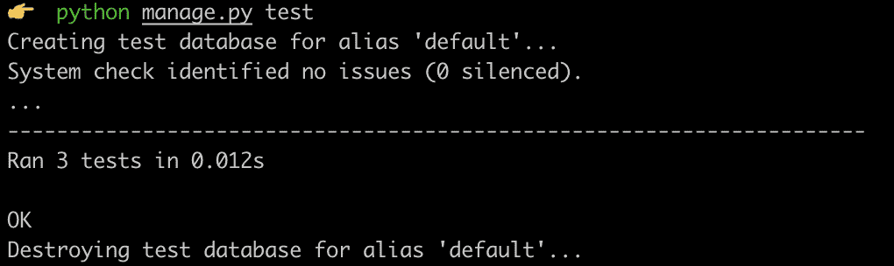

测试通过了！呼吸新鲜空气。

要在添加测试后从代码库开始，运行:

```
git checkout tests 
```

## 将应用程序归档

接下来是对应用程序进行分类。这到底是什么意思？

Docker 化一个应用意味着使用 Docker 在一个容器中开发、部署和运行一个应用。这涉及三个关键文件:

*   文件:一个文件对于 Docker 就像一个 T2 文件对于 Git 一样。其中列出的文件和/或文件夹将在 Docker 上下文中被忽略，并且不会在 [Docker 图像](https://circleci.com/docs/building-docker-images/)中找到。看我们的`.dockerignore`文件[这里](https://github.com/NdagiStanley/django_girls_complete/pull/3/files#diff-f7c5b4068637e2def526f9bbc7200c4e)。

*   `Dockerfile` file:定义创建 Docker 图像的步骤。请看我们这里的`Dockerfile`。

*   `docker-compose.yml`文件:无论你是运行一个服务还是多个服务， [Docker compose](https://circleci.com/docs/docker-compose/) 消除了键入一个长的`docker run`命令的需要，并允许你运行一行`docker-compose up`，在文件的上下文中旋转容器。看我们的`docker-compose.yml`文件[这里](https://github.com/NdagiStanley/django_girls_complete/pull/3/files#diff-4e5e90c6228fd48698d074241c2ba760)。

我还添加了一个在运行`Dockerfile`时使用的初始化脚本。看我们的`init.sh`文件[这里](https://github.com/NdagiStanley/django_girls_complete/pull/3/files#diff-c15c3b6492080efd90b52266848ca621)。

## 圆形构型

为了将 CircelCI 集成到我们的项目中，我们需要为一个 [Python 应用](https://circleci.com/docs/language-python/)添加一个[配置文件](https://circleci.com/docs/configuration-reference/)。在项目的根目录下创建一个`.circleci`文件夹，并添加一个`config.yml`文件。把这几行复制进去:

```
version: 2
jobs:
  build:
    docker:
      - image: circleci/python:3.6
    steps:
      - checkout
      - restore_cache:
          key: deps1-{{ .Branch }}-{{ checksum "requirements.txt" }}
      - run:
          command: |
            python3 -m venv venv
            . venv/bin/activate
            pip install -r requirements.txt
      - save_cache:
          key: deps1-{{ .Branch }}-{{ checksum "requirements.txt" }}
          paths:
            - "venv"
      - run:
          name: Running tests
          command: |
            . venv/bin/activate
            python3 manage.py test
      - store_artifacts:
          path: test-reports/
          destination: python_app 
```

如果这是你第一次这样做，你会注意到四个可能不明显的步骤:

*   `checkout`:这个命令通过 SSH 将您的源代码提取到配置的路径(默认情况下是工作目录)。
*   `restore_cache`:该命令恢复之前保存的缓存。
*   `save_cache`:该命令生成并保存一个文件、多个文件或文件夹的缓存。在我们的例子中，我们保存了运行`pip install …`后获得的已安装 Python 包的缓存。
*   这个命令存储日志、二进制文件等。以便应用程序在以后的运行中可以访问它们。

## 在本地运行 CircleCI 构建

我主张在将构建推送到 GitHub 并在 CircleCI 上运行之前，安装 [CircleCI CLI 工具](https://circleci.com/docs/local-cli/)在本地运行构建。在本地运行构建使您不必向在线存储库提交代码来确认构建通过。它加快了开发周期。

您可以使用 [Homebrew](https://brew.sh/) 通过运行以下命令来安装 CLI:

```
brew install circleci 
```

然后，开始运行`circleci switch`命令: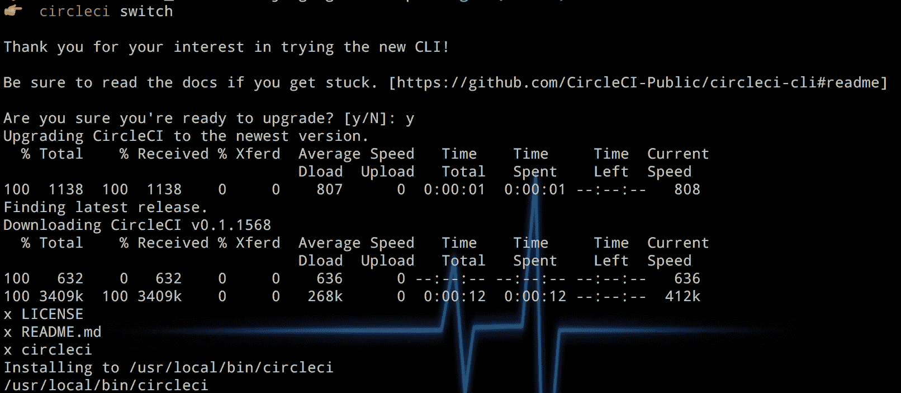

然后运行`circleci config validate`来验证您的配置文件写得是否正确，并运行`circleci build`来构建应用程序: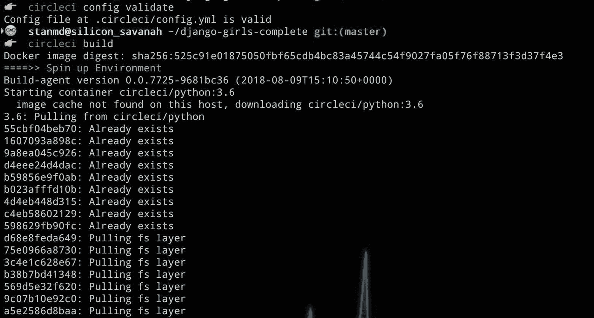 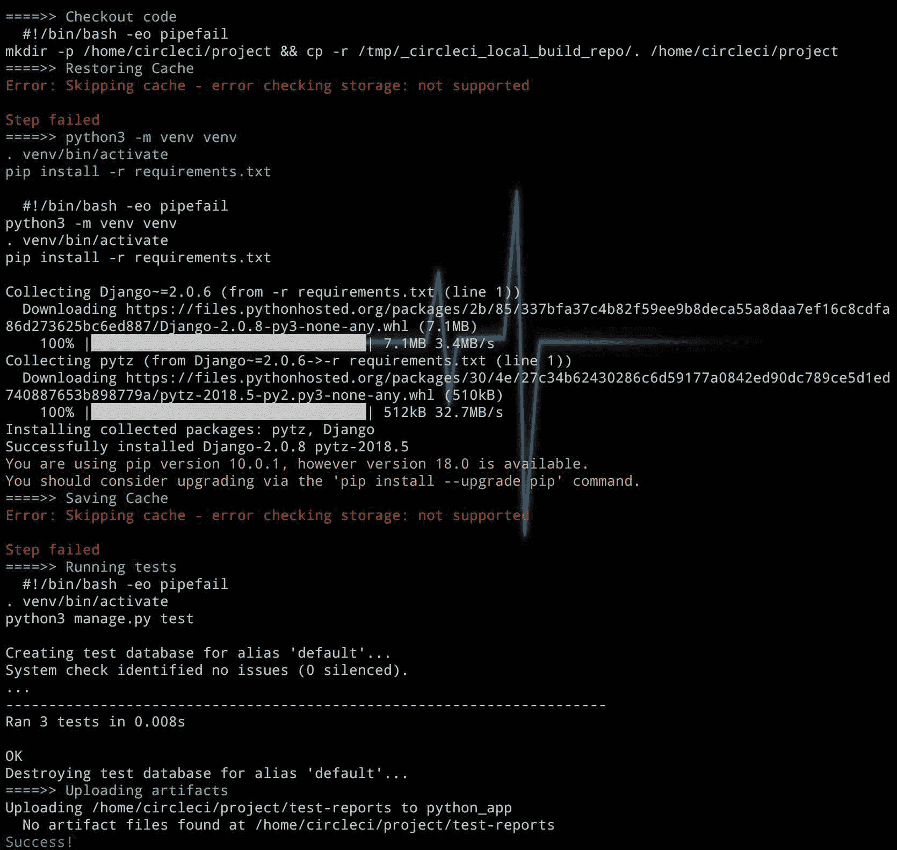

命令的输出以**成功结束！**本地构建成功运行。有了这个检查，我们现在可以将代码推送到 GitHub。

要在添加测试后从代码库开始，运行:

```
git checkout circleci 
```

## 将项目连接到 CircleCI

我们现在需要做的就是将 CircleCI 连接到我们在 GitHub 上的代码，这样我们就可以让 CI 管道像魔咒一样工作:推送代码更改，运行测试，如果通过就合并。在浏览器中打开 GitHub 并创建一个新的资源库。如果你没有 [GitHub 账号](https://circleci.com/docs/gh-bb-integration/)，你可以在这里创建一个[。创建你的回购协议后，](https://github.com/)[将你的项目推送到 GitHub](https://circleci.com/blog/pushing-a-project-to-github/) 。

然后登录 CircleCI 查看[仪表盘](https://circleci.com/dashboard)。如果你没有帐号，你可以在这里注册一个免费的[。在您的仪表板页面上，点击**添加项目**，然后点击您正在使用的项目名称。我的情况是名字叫`django_girls_complete`。](https://circleci.com/signup/)

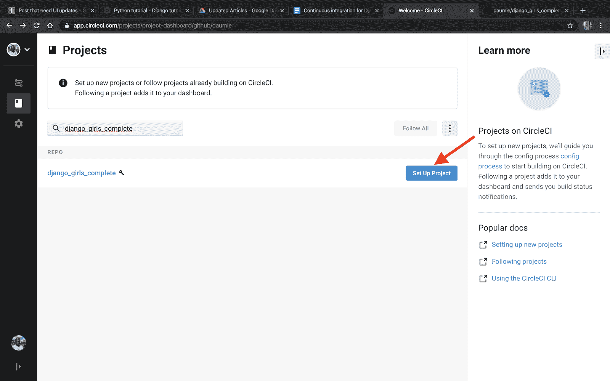

接下来，点击`Start Building`选择要使用的配置文件。

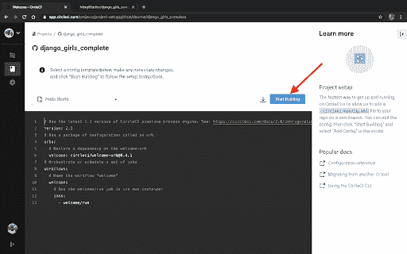

因为我们已经有了一个配置文件，单击`Add Manually`运行作业。

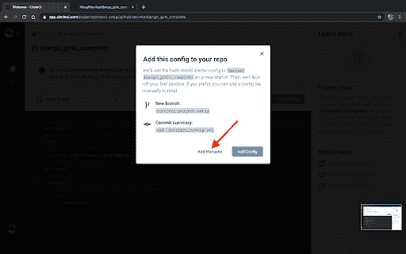

成功的运行将如下所示:

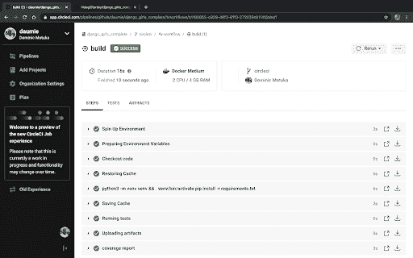

你有它！Django 项目的 CI 就是这么设置的。在您的终端中键入以下内容以运行应用程序:

```
docker compose up 
```

该应用将于<0.0.0.0:8000>上线。

## 添加徽章

您的代码库中可以有许多集成。在您的自述文件中包含徽章是一种最佳实践，它允许您向他人展示这些集成服务的状态。它通过让其他人知道这些服务的状态来帮助他们。要获取徽章，请导航至:`https://circleci.com/gh/<Username>/<Project>/edit#badges`。我的情况是:https://circle ci . com/GH/NdagiStanley/django _ girls _ complete/edit # badges。

点击项目名称旁边的 cog 图标: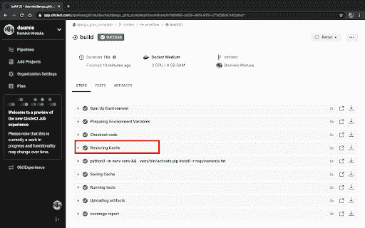

然后，在侧边菜单中，点击**状态徽章** : 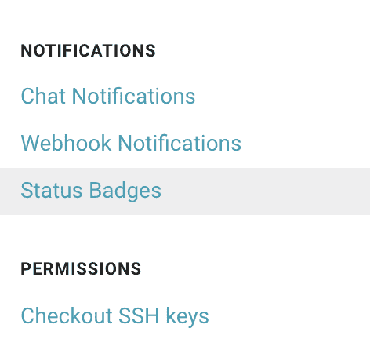

复制嵌入代码: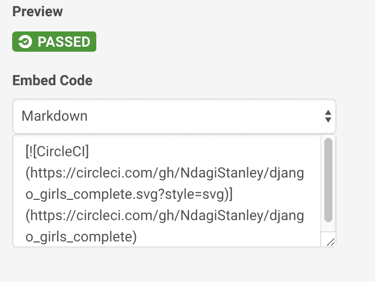

最后，将它粘贴到您的自述文件中，最好是在库的简要介绍之后，靠近顶部。从自述文件中，您将能够看到默认分支中最近作业的[构建状态](https://circleci.com/docs/status-badges/)。

## 探索缓存

在显示本地 CircleCI CLI 运行的屏幕截图中，您可能已经注意到红色的文本:`Error: Skipping cache - error checking storage: not supported`。在本地运行 CircleCI 生成时不支持缓存。

为了使 CircleI 作业(配置文件中命令的单次运行)更快，实现了缓存。更多信息请点击。在我们的设置中，我们包括了缓存步骤。为了便于学习，我运行了有缓存和没有缓存的 CircleCI 作业，向我们展示了它的优势。观察:


从最低的构建开始，最右边告诉我们运行作业所用的时间:00:11 (11 秒)，7 秒，等等。

如果没有修改`requirements.txt`文件，缓存有利于我们忽略`pip install -r requirements.txt`命令。当然，第一个作业只是设置缓存。难怪用了 11 秒。我们可以假设，在不改变`requirements.txt`文件的情况下，对 GitHub 的连续提交将在 7 秒的范围内运行。在第三个任务中，我删除了缓存，时间返回到第一个任务的范围:11 秒。在第四次运行时，我恢复了缓存，运行了 20 秒。最后，同一作业的重新运行持续了 7 秒钟，再次利用了缓存。

这里的秒钟可能看起来很少，无足轻重，但是随着时间的推移，失去的秒钟可以变成几分钟，甚至几小时。

## 结论

如果您遵循了上面的说明，那么您就已经很好地掌握了 Django 项目的持续集成。我们从创建一个 Django 应用程序并为其编写测试开始。然后我们对应用程序进行了 Dockerized，这样我们就可以在一个隔离的容器中构建它。这样做是有益的，因为它导致在任何机器上运行应用程序只需要一个依赖项:Docker。该应用程序的其他依赖项都安装在 Docker 容器中。然后，我们介绍了使用 CircleCI 的一些最佳实践:

*   使用 CircleCI CLI 在本地运行 CI 构建
*   添加徽章和
*   利用缓存实现更快的构建。

* * *

关于斯坦利:从年轻的时候起，斯坦利就摆弄电子产品，用科技制造东西。现在，他是安德拉的一名工程师，他的工作涉及数据、ML 和物联网。源于他一生对 DIY 的热爱，他踏上了一段召唤内心的建造者并一路教导他人的个人旅程。他关心技术如何影响社会，并寻求与致力于创造积极影响的其他人合作。

* * *

Stanley 是一名软件工程师和技术文案，他身兼数职，包括技术团队领导和社区参与。他把自己描述成一个数字人(在数字空间中有文化)。

[阅读 Stanley Ndagi 的更多帖子](/blog/author/stanley-ndagi/)