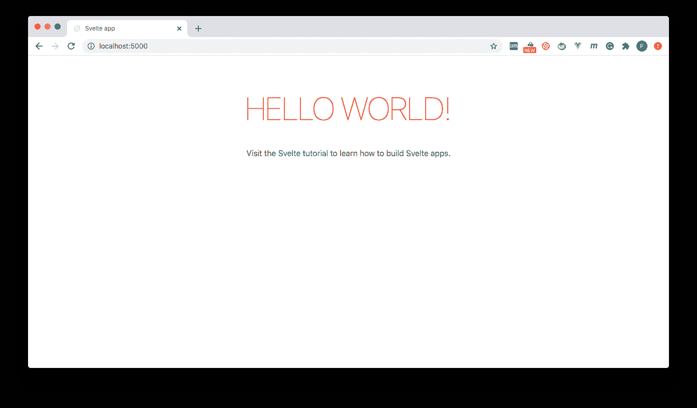

# 针对超薄应用的持续集成| CircleCI

> 原文：<https://circleci.com/blog/continuous-integration-for-svelte/>

在撰写本文的时候，苗条的框架是最流行的 Javascript 框架之一。去年，根据 JS 2019 的[状态，它在人气上超过了](https://2019.stateofjs.com/front-end-frameworks/) [Vue.js](https://vuejs.org) 。与其他框架不同，Svelte 不使用虚拟 DOM 在浏览器中进行 DOM 更新工作，而是在其构建步骤中编译 Javascript 代码，以便在状态发生变化时有效地更新 DOM。这种策略导致了它的迅速流行和采用。在本教程中，我们将创建一个自动化的[持续集成(CI)](https://circleci.com/continuous-integration/) 管道，自动运行为苗条应用编写的测试过程。

## 先决条件

要遵循本教程，需要做一些事情:

1.  Javascript 的基础知识
2.  系统上安装的 [Node.js](https://nodejs.org)
3.  一个[圆](https://circleci.com/signup/)的账户
4.  GitHub 的一个账户

所有这些安装和设置，让我们开始教程。

## 搭建一个新的苗条项目

首先，我们需要创建我们的苗条项目。在系统的适当位置，运行以下命令:

```
npx degit sveltejs/template svelte-testing 
```

这个命令将立即开始搭建一个新的苗条项目。`svelte-testing`部分定义了项目文件夹的名称。您可以使用任何喜欢的名称。

一旦搭建过程完成，进入项目的根目录并安装所需的包:

```
cd svelte-testing
npm install 
```

安装完成后，运行以下命令启动服务器，为开发模式下的应用程序提供服务:

```
npm run dev 
```

这将在`http://localhost:5000/` ( `5000`是默认端口)为应用程序提供服务。当它在使用中时，将改为分配另一个端口)。



我们现在有了一个实用的苗条应用程序。

## 用 Jest 和 Svelte 测试库设置测试

为了编写和运行我们的苗条项目的测试，我们需要建立 [Jest](https://jestjs.io/) 和[苗条测试库](https://testing-library.com/docs/svelte-testing-library/intro)。为了实现这一点，我们需要在我们的项目中安装一些包。此设置需要以下库:

*   用 Jest 作为我们的测试者
*   `@babel/core`、`@babel/preset-env`、`babel-jest`:在我们的测试文件中启用 ES6 JavaScript 的使用
*   `@testing-library/svelte`:苗条测试库
*   这个软件包可以帮助你在开玩笑之前编译这些苗条的组件
*   在给笑话添加方便的断言时很有用

所有这些包都需要作为开发依赖项安装。使用以下命令一次性安装它们:

```
npm install --save-dev jest svelte-jester @testing-library/jest-dom @testing-library/svelte @babel/core @babel/preset-env babel-jest 
```

一旦所有这些都安装完毕，下一步就是向我们的项目添加配置，以指定这些包如何运行。

将下面的`jest`配置部分添加到您的`package.json`文件中。(参考我们的`package.json`文件[这里](https://github.com/CIRCLECI-GWP/svelte-testing/blob/master/package.json)。

```
"jest": {
    "transform": {
        "^.+\\.svelte$": "svelte-jester",
        "^.+\\.js$": "babel-jest"
    },
    "moduleFileExtensions": [
        "js",
        "svelte"
    ],
    "setupFilesAfterEnv": [
        "@testing-library/jest-dom/extend-expect"
    ]
} 
```

接下来，在项目的根目录下，创建一个名为`.babelrc`的 [Babel](https://babeljs.io/) 配置文件，并将以下配置放入其中:

```
{
  "presets": [["@babel/preset-env", { "targets": { "node": "current" } }]]
} 
```

最后，在`package.json`文件的`scripts`部分添加一个`test`脚本:

```
...

"scripts": {
    ...
    "test": "jest src"
} 
```

现在，您已经拥有了用 Jest 测试您的细长组件所需的一切。

## 向我们的苗条项目添加测试

要开始编写测试，首先创建一个简单的组件，稍后将对其进行测试。在`src/components`文件夹中，创建一个名为`ButtonComp.svelte`的新文件，并输入以下代码:

```
<script>
  export let name

  let buttonText = 'Button'

  function handleClick() {
    buttonText = 'Button Clicked'
  }
</script>

<h1>Hello {name}!</h1>

<button on:click="{handleClick}">{buttonText}</button> 
```

在上面的代码中，我们创建了一个组件，该组件显示一个包含字符串和动态`name`变量的头，该变量可以由父组件传递给该组件。我们还显示了一个按钮，通过用一个`handleClick`方法处理它的`click`事件，在点击时改变它的标签。

让我们在应用程序中使用这个组件，把它放在应用程序的主页中。打开`src/App.svelte`文件，用下面的代码片段替换全部内容:

```
 <script>
	export let name;

	import ButtonComp from "./components/ButtonComp.svelte";
</script>

<main>
	<h1>Hello {name}!</h1>
	<p>Visit the <a href="https://svelte.dev/tutorial">Svelte tutorial</a> to learn how to build Svelte apps.</p>

	<ButtonComp name="Svelte" />
</main>

<style>
	main {
		text-align: center;
		padding: 1em;
		max-width: 240px;
		margin: 0 auto;
	}

	h1 {
		color: #ff3e00;
		text-transform: uppercase;
		font-size: 4em;
		font-weight: 100;
	}

	@media (min-width: 640px) {
		main {
			max-width: none;
		}
	}
</style> 
```

在上面的代码中，我们导入了我们的`ButtonComp`组件，并在我们的主页中创建了它的一个实例，将`Svelte`值传递给了`name`属性。

让我们看看更新后的主页是什么样子。


我们的头显示`Hello Svelte`，因为我们将字符串`Svelte`传递给了`name`属性。点击按钮，观察标签从`Button`变为`Button Clicked`。我们将编写测试来断言我们的组件所展示的这些行为。

在`src`文件夹中，创建一个新的`__tests__`文件夹(两边加双下划线)。这是 Jest 搜索测试套件/脚本的标准文件夹。

在`__tests__`中，让我们通过创建一个`ButtonCompTest.js`文件并添加以下代码来编写我们的第一个测试套件:

```
import "@testing-library/jest-dom/extend-expect";

import { render, fireEvent } from "@testing-library/svelte";

import ButtonComp from "../components/ButtonComp";

test("'Hello Svelte' is rendered on the header", () => {
  const { getByText } = render(ButtonComp, { name: "Svelte" });

  expect(getByText("Hello Svelte!")).toBeInTheDocument();
});

test("Button text changes when button is clicked", async () => {
  const { getByText } = render(ButtonComp, { name: "Svelte" });
  const button = getByText("Button");

  await fireEvent.click(button);

  expect(button).toHaveTextContent("Button Clicked");
}); 
```

在上面的文件中，我们导入了`ButtonComp`组件并对其进行了测试。第一个测试通过传递字符串`Svelte`作为`name`属性的值，确认标签`Hello Svelte!`在我们的组件中找到。

第二个测试检查组件中按钮的行为。我们再次呈现它，并获取对其中按钮的引用。然后，我们触发按钮上的`click`事件，并检查其当前状态，以确认按钮的标签确实更改为预期的`Button Clicked`字符串。

让我们保存文件，并在终端上使用 test 命令来运行我们的测试:

```
npm run test 
```


我们现在已经成功地运行了我们的测试，它们都通过了。

## 创建 CircleCI 项目

我们的下一个任务是在 CircleCI 建立我们的苗条项目。从[将你的项目推送到 GitHub](https://circleci.com/blog/pushing-a-project-to-github/) 开始。

然后转到 CircleCI 仪表板上的**添加项目**页面来添加项目。


点击**设置项目**开始。


接下来，点击**手动添加**。您会得到提示，要么下载管道的配置文件，要么开始构建。


点击**开始建造**。这个构建将会失败，因为我们还没有设置配置文件。我们以后再做那件事。

## 自动化我们的测试

本教程的下一步是编写我们的 [CI 管道](https://circleci.com/blog/what-is-a-ci-cd-pipeline/)脚本来自动化测试过程。

在项目的根目录下，创建一个名为`.circle`的新文件夹。在该文件夹中，创建一个`config.yml`文件，并将以下代码添加到其中:

```
version: 2.1
jobs:
  build:
    working_directory: ~/repo
    docker:
      - image: circleci/node:10.16.3
    steps:
      - checkout
      - run:
          name: Update NPM
          command: "sudo npm install -g npm@5"
      - restore_cache:
          key: dependency-cache-{{ checksum "package-lock.json" }}
      - run:
          name: Install Dependencies
          command: npm install
      - save_cache:
          key: dependency-cache-{{ checksum "package-lock.json" }}
          paths:
            - ./node_modules
      - run:
          name: Run tests
          command: npm run test 
```

在上面的文件中，我们首先引入一个`Node.js` Docker 图像。然后我们更新`npm`以确保我们运行的是最新版本。接下来，我们安装依赖项并缓存它们。有了所有的依赖项，我们运行我们的测试。

将这些更改提交并推送到您的 GitHub 存储库中。这将触发管道动作并运行。这可以在 CircleCI 控制台的`Pipelines`页面上查看。


让我们通过点击 **build** 查看测试结果来查看详细的过程。


我们的测试运行完美！

让我们通过在`__tests__`文件夹中创建另一个测试套件`AppTest.js`，并将下面的代码放入(`src/__tests__/AppTest.js`)中，来持续集成更多的测试:

```
import "@testing-library/jest-dom/extend-expect";

import { render } from "@testing-library/svelte";

import App from "../App";

test("'Hello World' is rendered on the header", () => {
  const { getByText } = render(App, { name: "World" });

  expect(getByText("Hello World!")).toBeInTheDocument();
}); 
```

现在，提交您的更改，并再次将它们推送到 GitHub 存储库来运行管道。


## 结论

完整的项目可以在 GitHub 上的这里[看到。](https://github.com/CIRCLECI-GWP/svelte-testing)

在本教程中，我们构建了一个持续集成(CI)管道来自动测试我们的苗条应用程序。随着我们继续向项目中添加更多的特性和测试，只需要简单地推送到存储库就可以确保我们的测试运行。获得通过或失败的结果有助于指导开发，并防止我们将糟糕的代码提交给我们的 repo。

编码快乐！

* * *

Fikayo Adepoju 是 LinkedIn Learning(Lynda.com)的作者、全栈开发人员、技术作者和技术内容创建者，精通 Web 和移动技术以及 DevOps，拥有 10 多年开发可扩展分布式应用程序的经验。他为 CircleCI、Twilio、Auth0 和 New Stack 博客撰写了 40 多篇文章，并且在他的个人媒体页面上，他喜欢与尽可能多的从中受益的开发人员分享他的知识。你也可以在 Udemy 上查看他的视频课程。

[阅读 Fikayo Adepoju 的更多帖子](/blog/author/fikayo-adepoju/)