# 使用 Slack 和 Twilio | CircleCI 为您的 CI 构建配置通知

> 原文：<https://circleci.com/blog/continuous-integration-slack-twilio/>

> 本教程涵盖:
> 
> 1.  设置示例 Node.js 应用程序
> 2.  将 CircleCI 与 Slack 和 Twilio 集成
> 3.  CircleCI 版本的测试通知

circle ci notification[orbs](https://circleci.com/orbs/)的构建是为了在构建成功或失败时将消息传递到适当的通道。这有助于参与项目的每个人了解最新版本的最新状态。

在本教程中，您将探索和实现发送到 Slack 信道的通知，以及通过 SMS 发送的通知。为了完成这项任务，您将使用来自 [CircleCI orb 注册表](https://circleci.com/developer/orbs)的 Slack 和 Twilio orbs。从头开始实现这个特性会很麻烦，但是使用 orbs，只需几行代码就可以完成。

## 先决条件

您需要这些物品来从本教程中获得最大收益:

## 创建 Nest.js 应用程序

第一步是构建一个返回简单消息的 Nest.js 应用程序。然后，您将编写一个测试来断言应用程序返回正确的消息。您将把代码推送到 GitHub，这将触发 CircleCI 上的构建。一旦构建成功，定制消息将作为 SMS 发送到首选电话号码和指定的 Slack 信道。如果构建失败，将重复相同的过程。

首先，运行以下命令:

```
nest new nest-slack-notifications 
```

转到新创建的项目并运行应用程序:

```
// change directory
cd nest-build-notifications

// run the application
npm run start:dev 
```

前往`http://localhost:3000`查看默认主页。

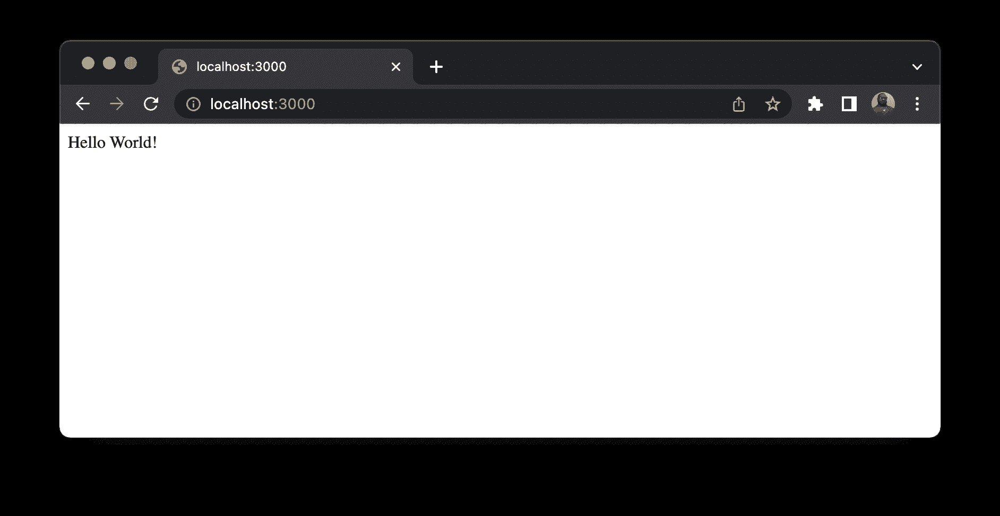

这个过程返回一条`Hello World!`消息，这将适用于本教程中的用例。

## 在本地运行测试

默认情况下，Nest.js 应用程序带有一个内置的测试框架( [Jest](https://jestjs.io/) )来提供断言功能。此外，位于`src/app.controller.spec.ts`的测试脚本文件已被提供，以确认`Hello World!`已从应用程序返回。使用以下命令运行测试:

```
npm run test 
```

您将看到类似下面的输出。

```
> nest-slack-notifications@0.0.1 test
> jest

 PASS  src/app.controller.spec.ts
  AppController
    root
      ✓ should return "Hello World!" (6 ms)

Test Suites: 1 passed, 1 total
Tests:       1 passed, 1 total
Snapshots:   0 total
Time:        1.183 s
Ran all test suites. 
```

测试通过，这意味着您可以继续学习教程。

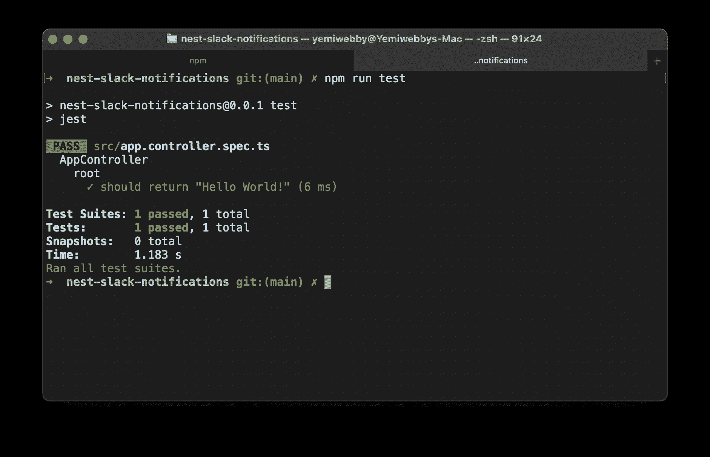

## 添加 CircleCI 配置以自动化测试

现在您可以添加配置文件来设置[与 CircleCI 的持续集成](https://circleci.com/continuous-integration/)。在应用程序的根目录创建一个名为`.circleci`的文件夹，并在其中创建一个名为`config.yml`的新文件。将此代码粘贴到新文件中(`.circleci/config.yml`):

```
version: 2.1
orbs:
  node: circleci/node@5.0.3
jobs:
  build-test-and-notify:
    executor:
      name: node/default
    steps:
      - checkout
      - run: sudo npm install -g npm@latest
      - run:
          name: Install dependencies
          command: npm install
      - run: npm test
workflows:
  build-and-notify:
    jobs:
      - build-test-and-notify 
```

在这个配置文件中，您已经从 CircleCI orbs 注册表中指定了要使用的 Node.js orb 版本，并安装了项目的所有依赖项。然后，您设置命令来运行应用程序的测试。

## 在 CircleCI 建立项目

从[将项目推给 GitHub](https://circleci.com/blog/pushing-a-project-to-github/) 开始。

干得好！您已经成功地创建了项目，安装了它的所有依赖项，并设置了配置，以便在将新代码推送到 GitHub 时自动运行测试。现在您需要将项目连接到 CircleCI。为此，请使用您的帐户详细信息登录 CircleCI，并在 GitHub 上选择您的项目所在的组织。

在这种情况下，项目的名称是`nest-slack-notifications`。使用您在 GitHub 上定义的项目名称找到它，然后单击**设置项目**。

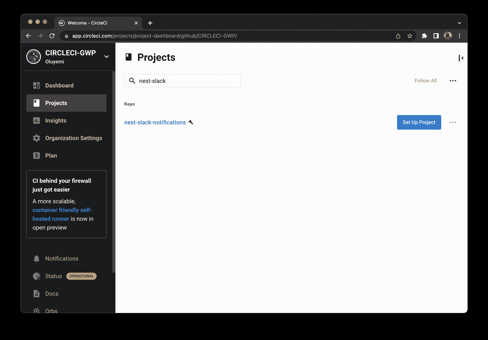

在**选择你的 config.yml 文件**屏幕上，选择**最快**选项。键入`main`作为分支名称。CircleCI 会自动定位`config.yml`文件。点击**设置项目**启动工作流程。

这将使用项目中的配置立即触发管道。并且，您将获得一条成功构建的消息。


成功！它像预期的那样工作。现在您可以开始处理指示构建过程状态的通知了。

## 添加松弛集成

在本节中，您将把 Slack 集成到 CircleCI 中，这样您就可以在构建过程之后轻松地设置通知。

为了实现这个集成，我在 Slack 上创建了一个名为`CircleCI-Notify`的工作区。

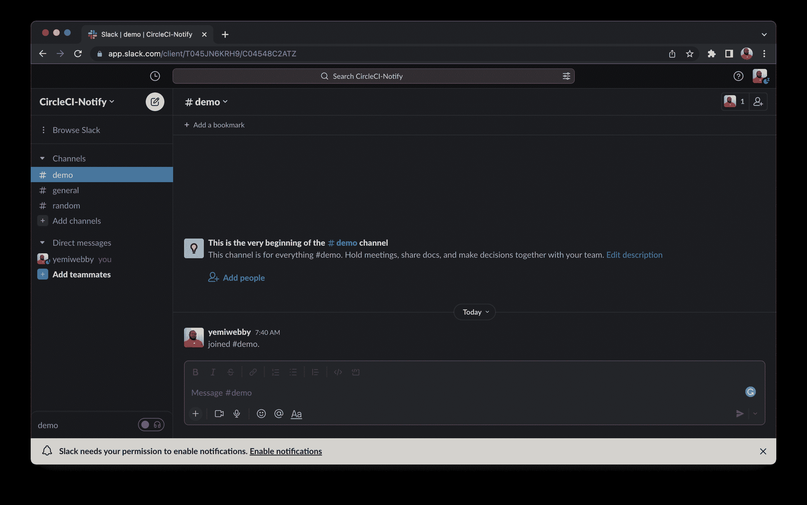

### 添加 CircleCI 应用程序

准备好工作空间后，设置 Slack OAuth 令牌进行身份验证。[使用浏览器登录](https://slack.com/signin)你空闲的工作空间。接下来，[在 Slack API 网站上访问你的应用](https://api.slack.com/apps)。点击**从头开始创建新应用**。系统将提示您添加应用程序名称，并选择您刚刚登录的工作空间。请注意，如果您使用`CircleCI`或`CircleCi-<modifier>`来命名您的应用程序，这将非常有用。

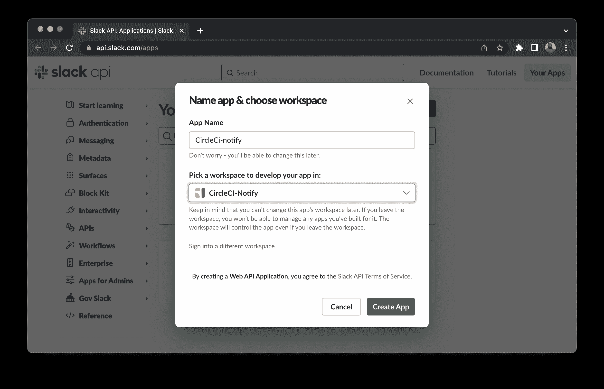

在下一页，您可以选择要添加到应用程序的功能。对于本教程，选择“Permissions”区域，在这里您将添加`scopes`，它将提供适当的权限。

Slack orb 只需要发布聊天消息和上传文件的能力。你可以用`Oauth Scope`提供这三个。点击**添加 OAuth 范围**选择范围。

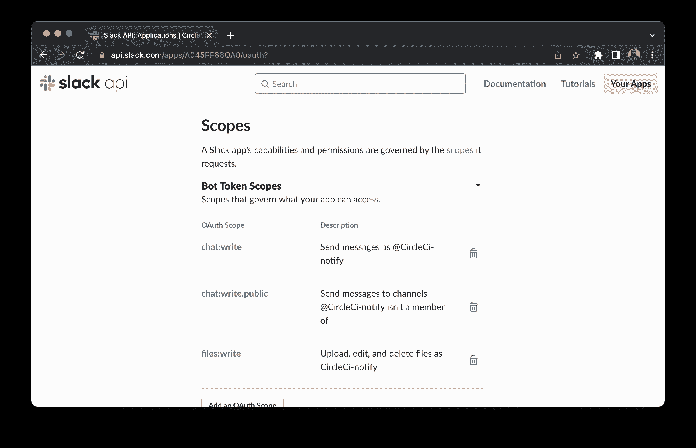

接下来，滚动浏览您的工作区的 **OAuth 令牌，并点击**安装到工作区**。**

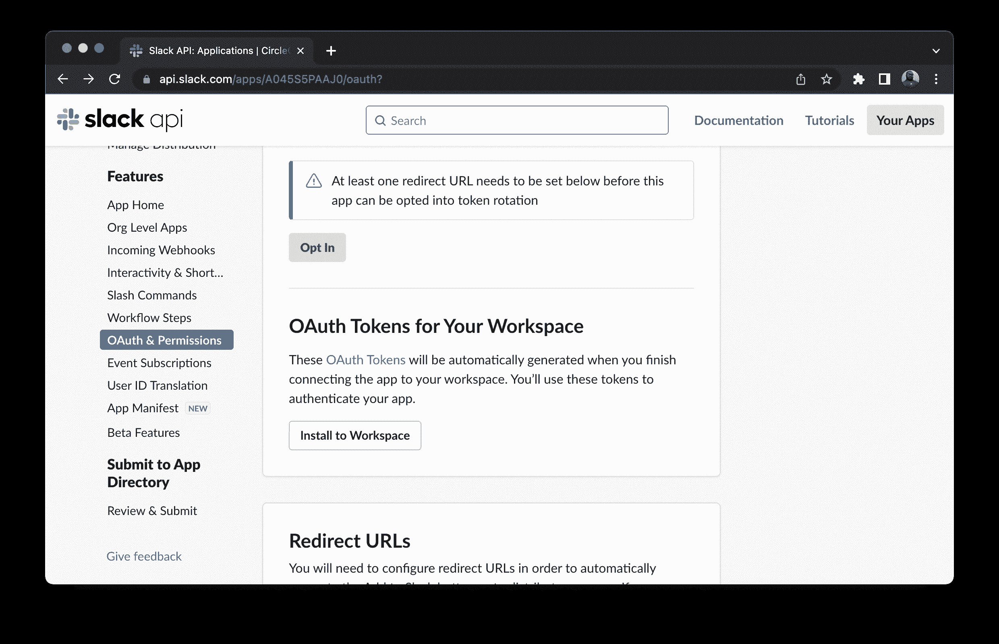

这将为您的工作区生成一个令牌。复制这个新生成的令牌并保存在手边，以便在本教程的后面使用。

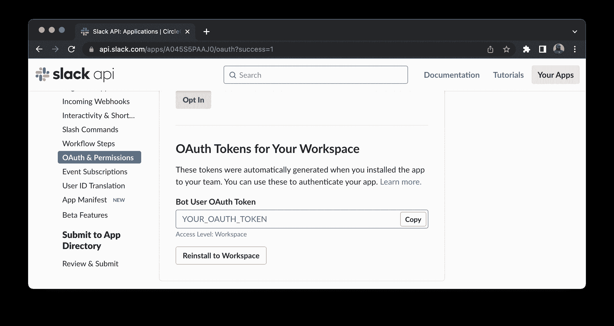

### 更新 CircleCI 配置

为了完成 Slack 集成，您需要更新 CircleCI 配置文件，以包含 Slack 的[circle ci orb](https://circleci.com/developer/orbs/orb/circleci/slack)。打开`.circleci/config.yml`并更新其内容:

```
version: 2.1
orbs:
  node: circleci/node@5.0.3
  slack: circleci/slack@4.10.1
jobs:
  build-test-and-notify:
    executor:
      name: node/default
    steps:
      - checkout
      - run:
          name: Install dependencies
          command: npm install
      - run: npm test
      - slack/notify:
          event: pass
          template: success_tagged_deploy_1
      - slack/notify:
          event: fail
          mentions: "@yemiwebby"
          template: basic_fail_1
workflows:
  build-and-notify:
    jobs:
      - build-test-and-notify 
```

您在这个文件中所做的更改，包括了 Slack 集成管道中的另一个 orb。一旦构建失败或成功，一个名为`slack/notify`的新命令会向 Slack 通道发送一条消息。

这些是您将定制消息发送到 Slack 工作区以跟踪 CircleCI 上的构建状态所需的所有更新。不过，在用最新的代码更新存储库之前，您需要与 Twilio 集成 SMS 通知。

## 与 Twilio 集成用于通知

在本节中，您将通过将 CircleCI 与 Twilio 集成，进一步构建通知。如前所述，CircleCI orbs registry 已经有一个 Twilio orb，用于为 CircleCI 作业发送自定义 SMS 通知。

要与 Twilio 集成，您需要:

*   `TWILIO_FROM`是您拥有的 Twilio 电话号码，格式为`+`和国家代码，例如+16175551212 (E.164 格式)
*   `TWILIO_TO`是一个参数，用于确定 SMS 消息的目的电话号码，其格式与`TWILIO_FROM`相同
*   `TWILIO_ACCOUNT_SID`您的 Twilio `Account SID`可以在您的 Twilio 帐户仪表板上找到吗
*   `TWILIO_AUTH_TOKEN`是你的 Twilio `AUTH TOKEN`
*   `body`是将显示的自定义消息，而不是默认的通知消息

### 在 CircleCI 上添加环境变量

从您的 [Twilio 帐户仪表板](https://www.twilio.com/console)收集上一节提到的所有凭证。回到 CircleCI 上的项目设置页面。点击侧面菜单上的**环境变量**。然后点击**添加变量**，输入你的 Twilio 凭证。

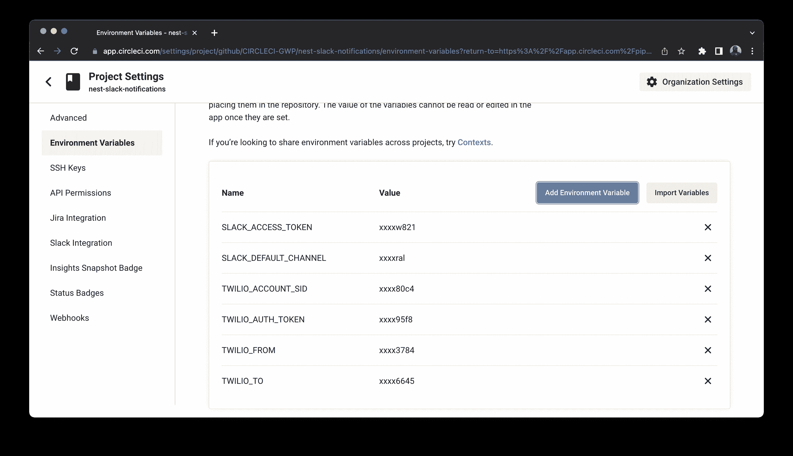

完成后，返回到项目设置页面。

### 更新 CircleCI 配置文件

现在您需要用 CircleCI Twilio orb 细节和所需的命令更新 CircleCI 配置文件。打开`.circleci/config.yml`文件，用以下内容更新其内容:

```
version: 2.1
orbs:
  node: circleci/node@5.0.3
  slack: circleci/slack@4.10.1
  twilio: circleci/twilio@1.0.0
jobs:
  build-test-and-notify:
    executor:
      name: node/default
    steps:
      - checkout
      - run:
          name: Install dependencies
          command: npm install
      - run: npm test
      - slack/notify:
          event: pass
          template: success_tagged_deploy_1
      - slack/notify:
          event: fail
          mentions: "@yemiwebby"
          template: basic_fail_1
      - twilio/sendsms:
          body: Successful message from Twilio
      - twilio/alert:
          body: Send error message
workflows:
  build-and-notify:
    jobs:
      - build-test-and-notify 
```

您通过包含 Twilio orb 和以下命令对此文件进行了更改:

*   `twilio/sendsms`是用于在构建成功后发送短信的命令
*   `twilio/alert`是一个命令，只有在构建过程中出现错误时才会触发该命令来发送 SMS

**注意** : *在您的 Twilio 帐户的[消息地理权限](https://www.twilio.com/console/sms/settings/geo-permissions)设置中启用您所在的地区，以接收此处[记录的短信](https://www.twilio.com/docs/api/errors/21408)。此外，确保您的电话号码已经过[验证](https://twilio.com/user/account/phone-numbers/verified)，尤其是如果您使用的是试用账户。*

## 成功构建的测试

提交所有代码更改，并将其推送到 GitHub。这将自动触发 CircleCI 控制台上的构建。一旦流程完成并成功构建，您将通过您为松弛工作区选择的渠道和 SMS 接收自定义消息。

## 测试失败的构建

要使 CircleCI 上的构建失败，以便您可以看到它工作，请打开`src/app.service.ts`文件并更新返回消息:

```
import { Injectable } from "@nestjs/common";

@Injectable()
export class AppService {
  getHello(): string {
    return "Hello World";
  }
} 
```

这将更改消息，从而导致测试失败。现在，添加所有新的更改，提交它们，并将其推送到 GitHub。这将再次触发构建，但这次会失败。你将会在 Slack 和 Twilio 上收到一条消息，和预期的一样。

以下是我设置的出现在`CircleCI-Notify`工作区的`#general`通道中的消息。

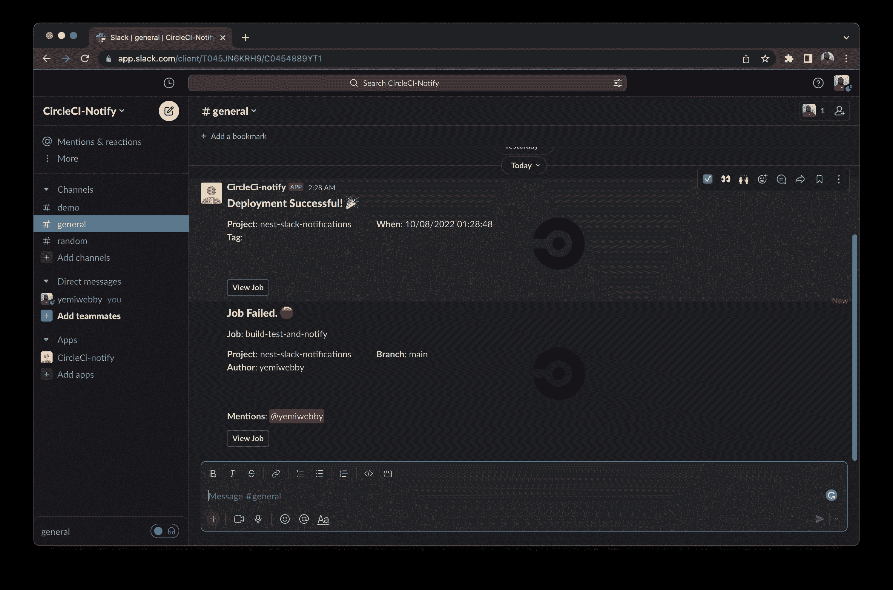

这是 Twilio 发来的短信。

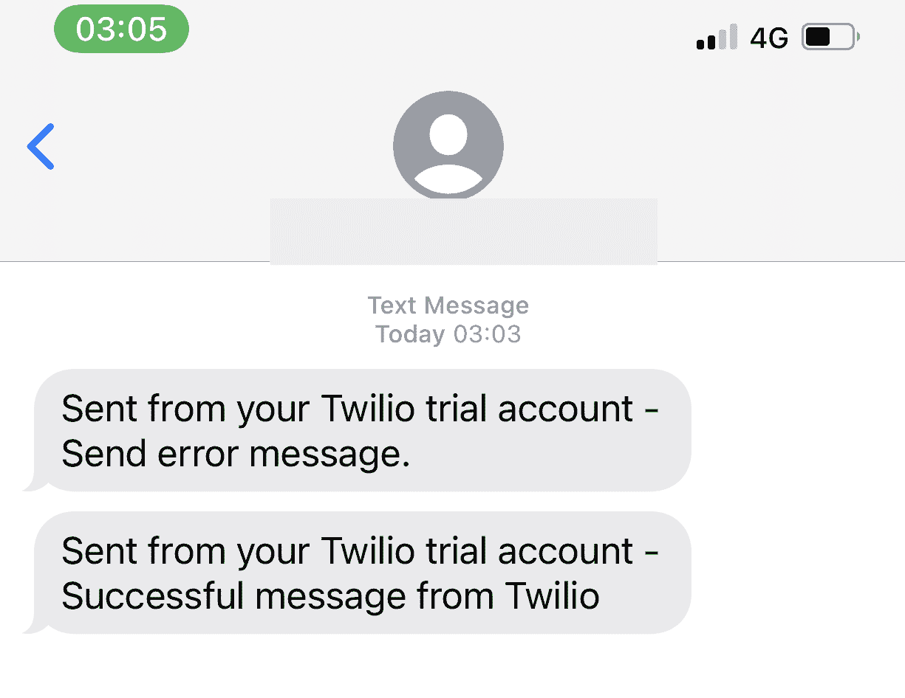

## 结论

您在本教程中学到的最好的一点是，实现这些通知功能是如此简单和无缝。这些通知可以很容易地集成到您现有的任何项目中。

此外，这个过程并不局限于 Node.js 应用程序。无论您使用的是哪种框架或编程语言，您都可以轻松地将在此获得的知识转移并用于其他项目。查看 [CircleCI orbs 注册表](https://circleci.com/developer/orbs)以了解更多关于其他可用软件包的信息。

完整的源代码可以在 GitHub 的[这里找到。](https://github.com/CIRCLECI-GWP/nest-slack-notifications)

* * *

Oluyemi 是一名拥有电信工程背景的技术爱好者。出于对解决用户日常遇到的问题的浓厚兴趣，他冒险进入编程领域，并从那时起将他的问题解决技能用于构建 web 和移动软件。Oluyemi 是一名热衷于分享知识的全栈软件工程师，他在世界各地的几个博客上发表了大量技术文章和博客文章。作为技术专家，他的爱好包括尝试新的编程语言和框架。

[阅读更多 Olususi Oluyemi 的帖子](/blog/author/olususi-oluyemi/)