# 持续集成 Code Climate 的自动化代码评审| CircleCI

> 原文：<https://circleci.com/blog/continuous-integration-with-code-climates-automated-code-review/>

在本教程中，我们将学习如何将 CircleCI 与 Code Climate 的[质量](https://codeclimate.com/quality/)工具集成。将质量集成作为[持续集成](https://circleci.com/continuous-integration/) (CI)管道的一部分有很多好处。这些优势包括能够:

*   根据设定的参数监控代码质量和语法，以易于理解和透明的格式呈现问题
*   以公开、透明的方式显示测试覆盖报告
*   设置测试覆盖阈值，当超过阈值时，确定我们的管道中的问题是否被触发，如果是，暂停我们的部署过程
*   设置 GitHub 状态检查，检查开放拉取请求(PRs)的覆盖范围和代码语法，保护我们的部署不会失败

## 先决条件

出于本教程的目的，在我们开始之前，您需要了解一些事情。这些是:

1.  基本了解安装了 Node 的 [Node.js](https://nodejs.org/en/) 和 [npm](https://www.npmjs.com/)
2.  已安装 ESLint
3.  一个 [CircleCI 账户](https://circleci.com/signup/)
4.  一个 [GitHub 账户](https://github.com/join)
5.  一个[代码气候账户](https://codeclimate.com/quality/)

我正在用 JavaScript 语言开发用作演示的应用程序，但可以随意使用任何其他代码环境和 CircleCI 支持的语言，如这里的[和这里的](https://codeclimate.com/quality/)[所示。](https://circleci.com/docs/demo-apps/)

## 在本地构建应用程序

这是我们的文件夹结构最终的样子。为了跟进，您可以从这里的[派生或克隆整个项目。](https://github.com/emabishi/circleci-codeclimate/)

```
.
├── .circleci
│   └── config.yml
├── src
│   └── index.js
├── test
│   └── string.js
├── .codeclimate.yml
├── .eslintrc.json
├── .gitignore
├── License
├── README.md
├── initialconfig.yml
├── package-lock.json
└── .package.json 
```

### 属国

我们唯一需要的全局安装是 Node.js，所以确保您已经安装了它。我运行的是 12.13.0 版本。如果您安装了 [nvm](https://github.com/nvm-sh/nvm/blob/master/README.md) ，您可以使用以下命令下载并切换到 12.13.0:

```
nvm install 12.13.0 
```

之后，让我们安装本地项目依赖项。运行以下命令来初始化我们的`package.json`文件:

```
npm init --yes 
```

通过运行以下命令安装我们所有的依赖项:

```
npm install chai mocha nyc eslint --save-dev 
```

我们将使用:

*   [ESLint](https://eslint.org/docs/user-guide/getting-started) 作为我们的林挺工具
*   作为我们的测试框架
*   [柴](https://www.chaijs.com/)作为我们的断言库为摩卡
*   [伊斯坦布尔](https://istanbul.js.org/)用于报道

```
 "devDependencies": {
    "chai": "^4.2.0",
    "eslint": "^6.6.0",
    "mocha": "^6.2.2",
    "nyc": "^14.1.1"
  } 
```

要设置林挺，请在您的终端中我们应用程序的根文件夹下运行以下命令:

```
eslint --init 
```

按照步骤创建您的`.eslintrc.json`文件。

### 项目代码

既然设置已经完成，让我们开始开发我们的应用程序。我们将通过写出额外的原型方法来扩展 JavaScript 的[字符串](https://developer.mozilla.org/en-US/docs/Web/JavaScript/Reference/Global_Objects/String)功能。在我们的`src/index.js`文件中，添加:

```
String.prototype.isQuestion = function isQuestion() {
  /* Returns true if the last letter of the input string a question mark. 
   false otherwise
  */
  const questionable = new RegExp(/\?$/);
  return questionable.test(this);
};
String.prototype.hasVowels = function hasVowels() {
  // Returns true if a vowel exists in the input string. Returns false otherwise.
  const vowels = new RegExp('[aeiou]', 'i');
  return vowels.test(this);
};
String.prototype.toUpper = function toUpper() {
  /* Replace all lowercase letters in the input string with their uppercase
  * analogs by converting each letter's ASCII value to decimal then back to
  * ASCII
  */
  const upper = new RegExp('[a-z]', 'g');
  return this.replace(upper, function transform(letter) {
    return String.fromCharCode(letter.charCodeAt(0) - 32);
  });
};
String.prototype.toLower = function toLower() {
  const lower = new RegExp('[A-Z]', 'g');
  return this.replace(lower, function transform(letter) {
    return String.fromCharCode(letter.charCodeAt(0) + 32);
  });
}; 
```

接下来，让我们编写一些测试来确保我们的方法按预期工作。在我们的`test/string.js`文件中，添加以下几行:

```
const expect = require('chai').expect;
require('../src/index');
describe('String extension tests', function () {
  describe('isQuestion', function () {
    it('Should return true if given a question', function () {
      expect('To be or not to be, that is the question'.isQuestion()).to.equal(false);
      expect('Quis custodiet ipsos custodes?'.isQuestion()).to.equal(true);
    });
  });
  describe('hasVowels', () => {
    it('should return false if the string has no vowels', () => {
      expect('N VWLS'.hasVowels()).to.equal(false);
      expect('n vwls'.hasVowels()).to.equal(false);
      expect('@#$^&*%12345'.hasVowels()).to.equal(false);
      expect(' '.hasVowels()).to.equal(false);
    });
    it('should return true if the string has vowels', () => {
      expect('Has vowels'.hasVowels()).to.equal(true);
      expect('HAS VOWELS'.hasVowels()).to.equal(true);
      expect('H@s v0wels'.hasVowels()).to.equal(true);
      expect('@#$^&*% 12345 e'.hasVowels()).to.equal(true);
    });
    it('should return a boolean value', () => {
      expect(typeof ('1234'.hasVowels())).to.equal('boolean');
    });
  });
  describe('toUpper', () => {
    it('should return a string', () => {
      expect(typeof 'Lowercase'.toUpper()).to.equal('string');
    });
    it('should return the string passed in uppercase', () => {
      expect('lowercase'.toUpper()).to.equal('LOWERCASE');
      expect('LowerCase'.toUpper()).to.equal('LOWERCASE');
      expect('L0werCAs3& letters'.toUpper()).to.equal('L0WERCAS3& LETTERS');
      expect(''.toUpper()).to.equal('');
    });
  });
  describe('toLower', () => {
    it('should return a string', () => {
      expect(typeof 'Lowercase'.toLower()).to.equal('string');
    });
    it('should return the string passed in lowercase', () => {
      expect('LOWERCASE'.toLower()).to.equal('lowercase');
      expect('LowerCase'.toLower()).to.equal('lowercase');
      expect('L0werCAs3& letters'.toLower()).to.equal('l0wercas3& letters');
      expect(''.toLower()).to.equal('');
    });
  });
}); 
```

要运行我们的测试，将以下内容添加到我们的`package.json`文件的`scripts`部分:

```
 "scripts": {
    "test": "mocha"
  }, 
```

从现在开始，我们可以通过执行以下命令来运行我们的测试:

```
npm test 
```

如你所见，我们所有的测试现在都通过了。

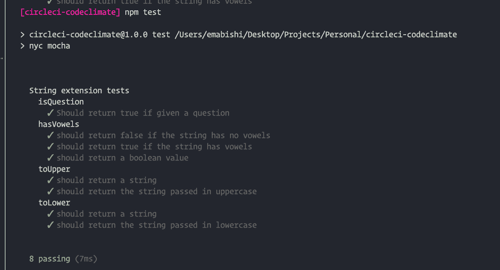

### 新闻报道

现在，让我们通过伊斯坦布尔设置覆盖报告。这很简单。我们需要做的就是向我们的`package.json`文件添加另一个脚本命令:

```
"scripts": {
    "test": "mocha",
    "cover": "nyc --reporter=lcov --reporter=text mocha"
  }, 
```

现在，运行命令:

```
npm run cover 
```

将运行我们的测试并生成测试覆盖报告，该报告将显示在我们的终端上。

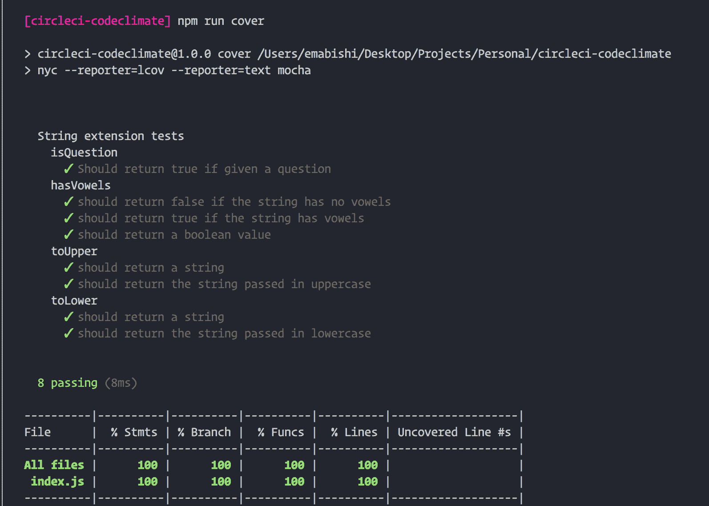

执行该命令后，您会注意到两个新文件夹，`./.nyc_output`和`./coverage`被添加到我们的文件夹结构中。

我们的覆盖报告的 HTML 版本可以通过打开文件`./.coverage/lcov-report/index.html`找到。如果你不喜欢赌桌，不用担心😀，coverage reporter 的输出格式可以通过几种方式[修改](https://istanbul.js.org/docs/advanced/alternative-reporters/)。

## 与 CircleCI 的持续集成

### 在 CircleCI 建立

CircleCI 使用我们的应用程序根目录下的`./.circleci`文件夹中的`config.yml`文件作为蓝本来设置和运行任何构建。让我们用一些初始语句填充文件，以确保运行测试的构建将被正确配置。

```
version: 2
jobs: 
  build: 
    working_directory: ~/repo
    docker:
      - image: circleci/node:12.13.0
    steps:
      - checkout
      # Download and cache dependencies
      - restore_cache:
          keys:
            - v1-dependencies-{{ checksum "package.json" }}
            # fallback to using the latest cache if no exact match is found
            - v1-dependencies-
      - run:
          name: Install dependencies
          command: npm install

      - save_cache:
          paths:
            - node_modules
          key: v1-dependencies-{{ checksum "package.json" }}
      - run:    
          name: Run tests
          command: npm test
      - run:
          name: Generate coverage report
          command: npm run cover
      - store_artifacts: # Save tests results as artifacts
          path: test-results.xml
          prefix: tests
      - store_artifacts: # Save coverage reports as artifacts
          path: coverage
          prefix: coverage 
```

我们在这里所做的就是指导 CircleCI 安装我们项目的依赖项，运行我们的测试，然后生成我们的覆盖报告。

### 推送至 GitHub

为了让 CircleCI 上的东西运行起来，我们将不得不把我们的工作提交给 GitHub。首先，让我们将项目初始化为一个 git 存储库，并提交我们到目前为止所做的所有工作。

在我们项目的根目录下，在您的终端中执行以下命令。

```
git init 
```

在我们的`.gitignore`文件中，让我们添加，

```
# Coverage directory used by tools like istanbul
coverage
# nyc test coverage
.nyc_output
# Dependency directories
node_modules/ 
```

然后，运行以下命令:

```
git add .
git commit -m "Add code, tests, coverage" 
```

在 GitHub 上为项目创建一个存储库，然后使用以下命令将我们的本地副本推送到 GitHub:

```
git remote add origin <add-repo-url>
git push -u origin master 
```

如果你是新手，我的朋友斯坦的这个教程应该会有所帮助。跳到 GitHub 推送部分，快速了解如何操作。

### 触发构建

[如果你还没有注册 CircleCI](https://circleci.com/signup/) 的话。

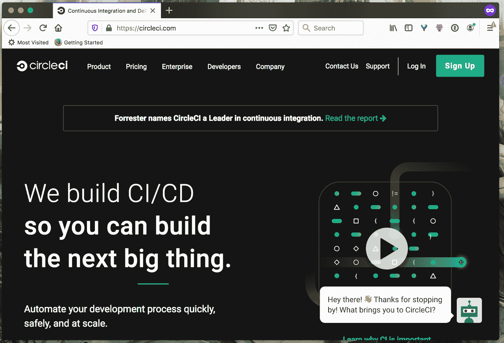

通过 GitHub 登录，或者如果您已经有帐户，请转到您的仪表板。从那里，导航到仪表板中的相关组织，然后导航到窗口左侧的 ADD PROJECTS 选项卡，如下所示。

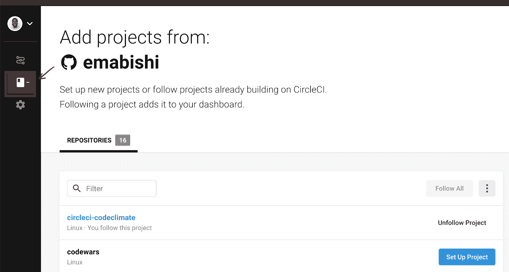

点击**建立项目**，然后**开始建立下一页的**。这将使用我们之前推送到 GitHub 的`config.yml`文件触发我们项目的构建。让我们确认我们初出茅庐的构建通过。

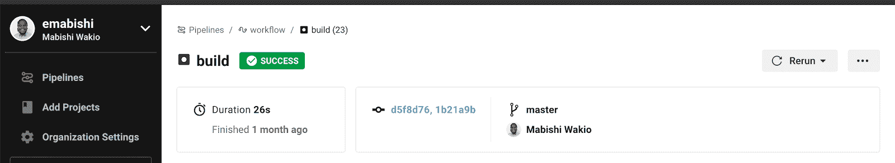

的确如此。接下来，让我们看看如何利用 Code Climate 提供的独特功能来优化我们的构建管道，以实现持续集成。

## 将代码气候与 CircleCI 联系起来

点击[这里](https://codeclimate.com/quality/)获得一个帐户并通过 GitHub 登录。

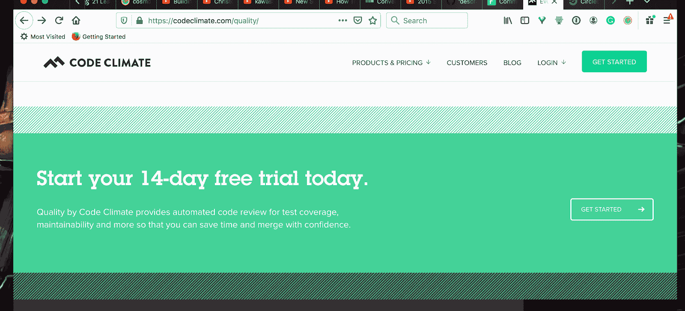

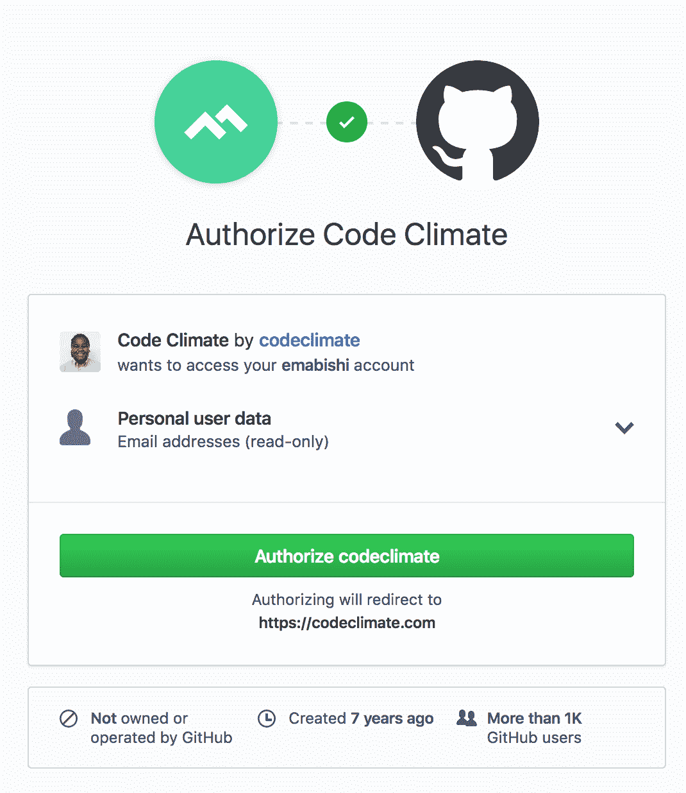

一旦我们通过认证，我们将被重定向到我们的代码气候仪表板，如下所示。

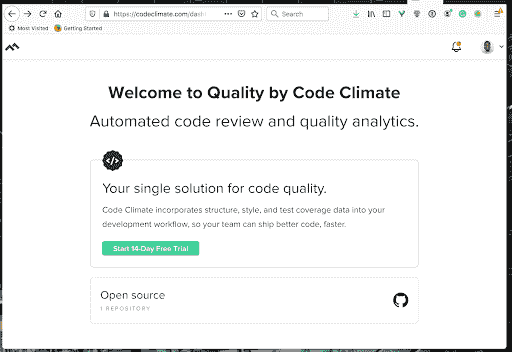

幸运的是，Code Climate 对开源项目是免费的，所以只要你的项目是免费的，点击**在开源选项下添加一个库**。如果您希望整合一个私人回购，请使用另一个选项开始试用该产品。

继续将 GitHub 组织和存储库添加到 Code Climate 中。

### 设置测试覆盖率报告

我们已经在本地生成了测试的覆盖报告，所以我们现在需要做的是指示 CircleCI 将报告发送给 Code Climate。我们将通过我们的`.circleci/config.yml`文件做到这一点。进行以下修改:

```
# https://circleci.com/docs/collect-test-data/#mochajs
# https://github.com/codeclimate/test-reporter/issues/342
version: 2
jobs:
    build:
        docker:
            - image: circleci/node:12.13.0
        working_directory: ~/repo
        steps:
            - checkout
            # Update npm
            - run:
                name: update-npm
                command: 'sudo npm install -g npm@latest'
            # Download and cache dependencies
            - restore_cache:
                keys:
                    - v1-dependencies-{{ checksum "package-lock.json" }}
                    # fallback to using the latest cache if no exact match is found
                    - v1-dependencies-
            - run: 
                name: Install dependencies
                command: npm install
            - save_cache:
                paths:
                    - node_modules
                key: v1-dependencies-{{ checksum "package-lock.json" }}
            # - run: mkdir reports
            # Run mocha tests
            - run:
                name: Run tests
                command: npm test
                when: always
            # Run coverage
            - run:
                name: Run coverage
                command: npm run cover
                when: always
            # Run coverage report for Code Climate
            - run:
                name: Setup Code Climate test-reporter
                command: |
                    # download test reporter as a static binary
                    curl -L https://codeclimate.com/downloads/test-reporter/test-reporter-latest-linux-amd64 > ./cc-test-reporter
                    chmod +x ./cc-test-reporter
                    ./cc-test-reporter before-build
                when: always
            - run:
                name: Send coverage report to Code Climate
                command:
                    # nyc report requires that nyc has already been run,
                    # which creates the .nyc_output folder containing necessary data
                    ./cc-test-reporter after-build -t lcov
                when: always
            # Upload results
            - store_artifacts: # upload test coverage as artifact
                path: ./coverage/lcov.info
                prefix: tests 
```

现在，在测试运行之后，我们指示 CircleCI 执行命令

```
npm run cover 
```

当前在我们的`package.json`文件中，该文件在`/.nyc_output`文件夹中生成一个到我们的覆盖报告的链接。然后，我们下载 Code Climate test reporter 包，并使用它通过 Code Climate API 发送我们的覆盖报告。

在我们将更改推送到 GitHub 之前，这将自动触发在 CircleCI 上运行测试，我们需要允许 CircleCI 将我们的覆盖报告发送给 Code Climate。我们通过在 CircleCI 中添加我们的代码 Climate Test Reporter 键作为[环境变量](https://circleci.com/docs/env-vars/)来实现这一点。

我们会在这里找到钥匙。

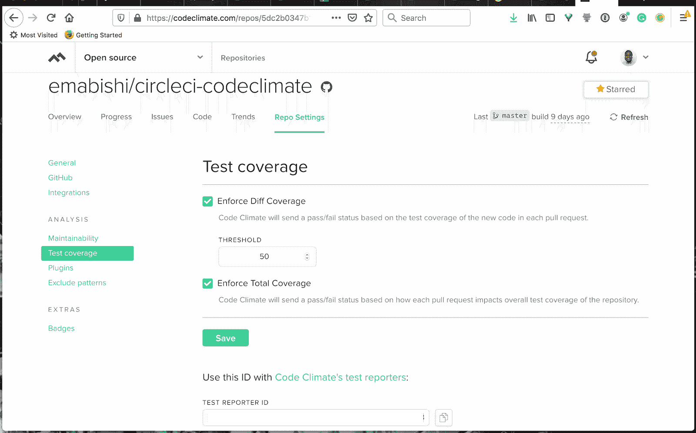

我们需要将它添加到 CircleCI 上，作为一个名为`CC_TEST_REPORTER_ID`的环境变量。

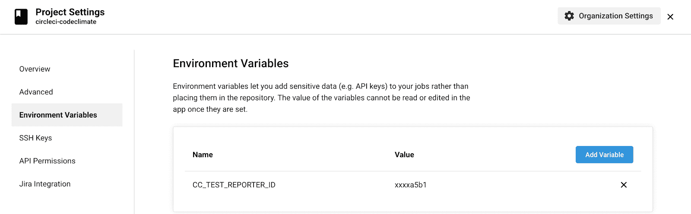

我们现在要做的就是推进 GitHub，确保我们的构建通过，并关注我们的代码气候覆盖报告。这是我的代码气候破折号目前的样子。

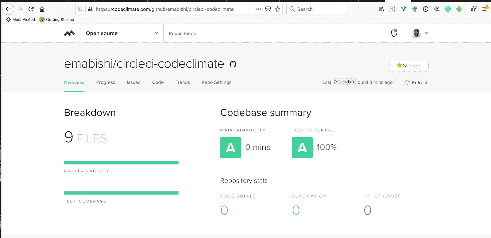

## 设置过磅报告

您会很高兴地知道，我们还可以建立代码风格的代码氛围报告。我们可以通过我们自己的`.eslintrc`文件或者通过我们的 Code Climate dashboard 进行配置。

让我们看看这两种方法。

### 通过 Code Climate 仪表板进行报告

导航到**回购设置**，然后导航到仪表板上的**可维护性**选项卡，如下所示。

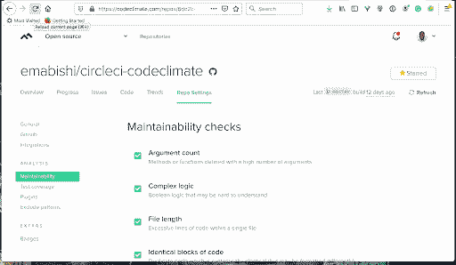

在这里，您可以根据需要打开或关闭不同的设置。

### 报告通过。eslintrc 文件

更详细的风格分析，让我们使用 Code Climate 的 ESLint 插件。我们使用 ESLint 主要是因为我们的代码是用 JavaScript 编写的，但是你可以随意使用任何适合你项目的插件。

如图所示，导航到仪表板上的**插件**选项卡。

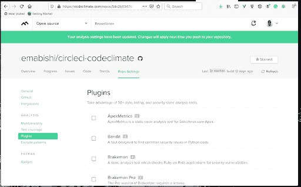

选中 ESLint 框，然后点击页面底部的 Save 按钮，打开插件。为了配置 [ESLint 插件](https://docs.codeclimate.com/docs/eslint)，我们需要在我们的根项目文件夹中创建一个`.codeclimate.yml`文件。

```
version: "2"         # required to adjust maintainability checks
plugins: 
  eslint:
    enabled: true
    channel: "eslint-5"
    config:
      extensions:
      - .js 
```

我们正在使用`ESLint v5.7.0`，并指示代码气候只审查`.js`文件。默认情况下，它会这样做，但我已经明确地添加了这一点，以向您展示我们如何对其他文件扩展名也这样做。

您可以通过安装代码气候 CLI，然后运行以下命令来验证您的代码气候`.yml`文件:

```
codeclimate validate-config 
```

这是我的`.eslintrc.json`文件:

```
{
    "env": {
        "browser": true,
        "node": true,
        "commonjs": true,
        "es6": true,
        "mocha": true
    },
    "extends": "eslint:recommended",
    "parserOptions": {
        "sourceType": "module"
    },
    "rules": {
        "eqeqeq": [
            0
        ],
        "indent": [
            2,
            2
        ],
        "linebreak-style": [
            2,
            "unix"
        ],
        "prefer-arrow-callback": [
            0
        ],
        "quotes": [
            2,
            "single"
        ],
        "semi": [
            2,
            "always"
        ]
    }
} 
```

我们通过使用`0`禁用规则或使用`2`启用规则来启用和禁用`.eslintrc`文件中的规则。我们需要这样做，以便代码环境将启用的规则视为问题。我们现在需要做的就是将我们的更改推送到 GitHub，以便在 CircleCI 上触发新的构建。

关于可以用来扩展 ESLint 配置的插件列表，请查看 Code Climate ESLint [文档](https://docs.codeclimate.com/docs/eslint)。如果你想实验，也有很多[其他插件](https://docs.codeclimate.com/docs/list-of-engines)。

## 使用 GitHub 构建监控

我们可以利用 Code Climate GitHub 集成做更多的事情，使我们的工作流程更好，代码更有弹性。让我们把 Code Climate 的 PR 评审意见加入到 GitHub 中。Code Climate 将分析每一个公开的 PR，并对它发现的任何风格问题留下内联评论，以及它发现的问题的一般摘要，包含总覆盖率%和 PR 将引入的覆盖率变化。要启用这些功能，请导航到 Code Climate 仪表板上**回购设置**下的 **GitHub** 选项卡。接下来，启用 [**拉式请求备注**](https://docs.codeclimate.com/docs/github-pull-requests#section-pull-request-review-comments) 功能、**汇总备注**和**行内问题备注**功能，如下图所示。

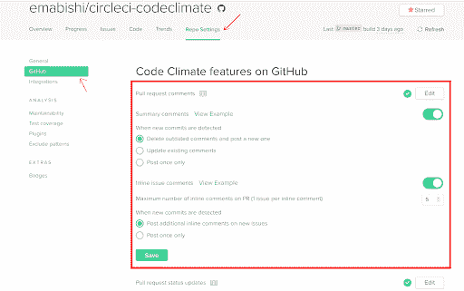

最后，在页面的 **Connections** 部分下，安装 GitHub webhook，它会在任何 PRs 打开时通知代码气候。

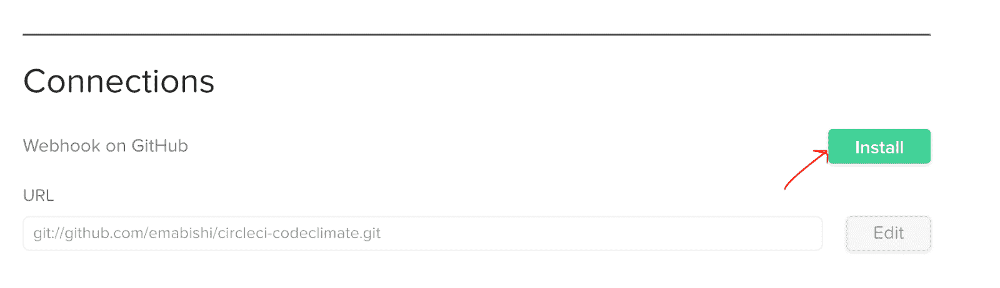

现在，我们来自 Code Climate 的公关分析被发布到我们的公开 GitHub PR 上。


让我们也加入公关状态检查。通过状态检查，我们可以确保在将任何打开的 PR 合并到所需分支之前满足某些标准。在这种情况下，我们希望:

*   在我们允许合并之前通过我们的测试
*   我们的测试覆盖率保持在 50%以上
*   公关没有风格问题

幸运的是，我们可以通过 GitHub 和 Code Climate 的一个简单过程来执行所有这些规则。

### 测试必须通过检查

我们将展示如何保护主分支。然而，这可以在任何分支上实现。在您的 GitHub 存储库中，导航到**设置**水平选项卡下的**分支**垂直选项卡，如下所示。

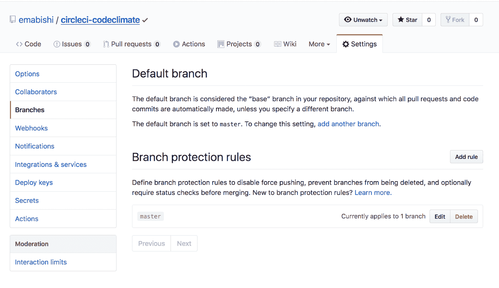

编辑**分支保护规则**，在**规则设置**下，启用**要求状态检查通过后再合并**，然后启用 **ci/circleci: Build Error** 和 **ci/circleci: build checks** 。最后，保存我们到目前为止所做的更改。

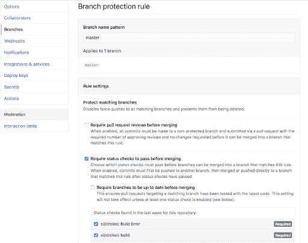

现在，每次打开新的 PR，GitHub 都会阻止我们合并到受保护的分支，直到我们的测试在 CircleCI 构建中通过。为了复制我们的测试如何在本地运行，在 CircleCI 上配置我们的环境以匹配我们的本地构建过程是非常重要的。

### 覆盖率阈值和样式检查

设置这些将确保所有开放的 pr 满足我们预定义的林挺规则和测试覆盖标准。导航到仪表板上**回购设置**选项卡下的 **GitHub** 选项卡。接下来，启用 [**拉动请求状态更新**](https://docs.codeclimate.com/docs/github-pull-requests#section-pull-request-statuses) 选项，如图所示。

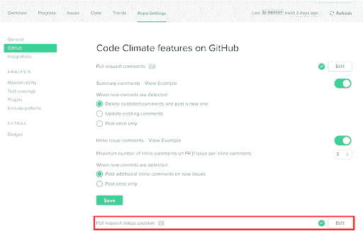

最后，我们遵循与上一节相同的过程，这一次也启用了所有的代码环境检查。

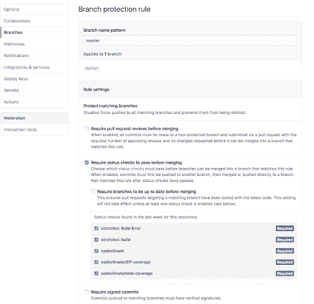

这是支票在公开的 PR 上的外观。

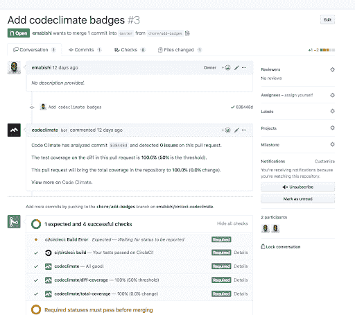

一旦他们通过，我们就可以自由合并我们的公关了。当 Code Climate 发现任何值得研究的问题时，我们可以通过 Code Climate 上的特定公关问题页面进行跟进。

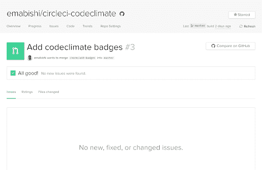

为了设置我们的覆盖率阈值，在该阈值下代码环境将触发一个问题，我们导航到仪表板上 **Repo Settings** 选项卡下的 **Test Coverage** 选项卡。我们可以编辑我们的**差异覆盖率**阈值，并强制执行**总覆盖率**规则，该规则将在我们的总覆盖率下降时触发一个问题。

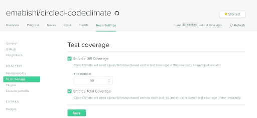

## 结论

在本指南中，我们看到了如何轻松地将 Code Climate 的质量工具与 CircleCI 和 GitHub 集成，利用它们来优化我们的 CI 渠道。使用这些工具，我们已经使我们的代码具有弹性，我们的构建过程透明，允许我们专注于编写更好的、准备好发布的代码。

如果你有兴趣看一看，可以在[这里](https://github.com/emabishi/circleci-codeclimate/)找到本指南的所有代码。如果你有什么建议，请留下你的简历。😀

* * *

Mabishi Wakio 是一名软件开发人员，不幸的是，他发现产品管理的诱惑太难以抗拒。当他们不听用户的话、不创建线框或不写代码时，可以发现他们在看书、举重或与拳击教练对打，很少获胜。

[阅读 Mabishi Wakio 的更多帖子](/blog/author/mabishi-wakio/)