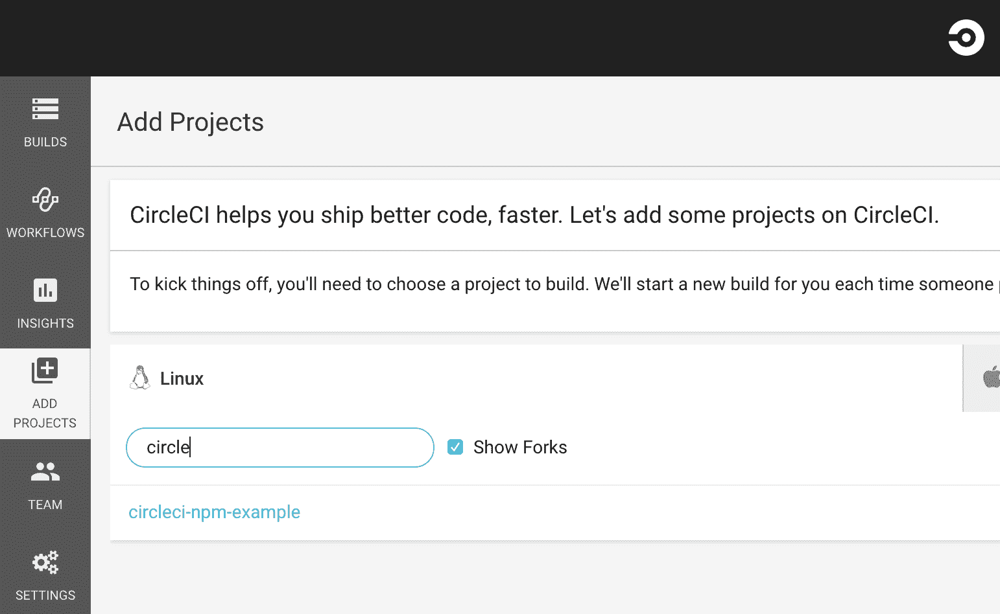
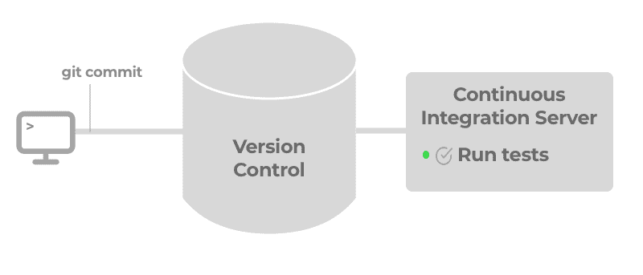
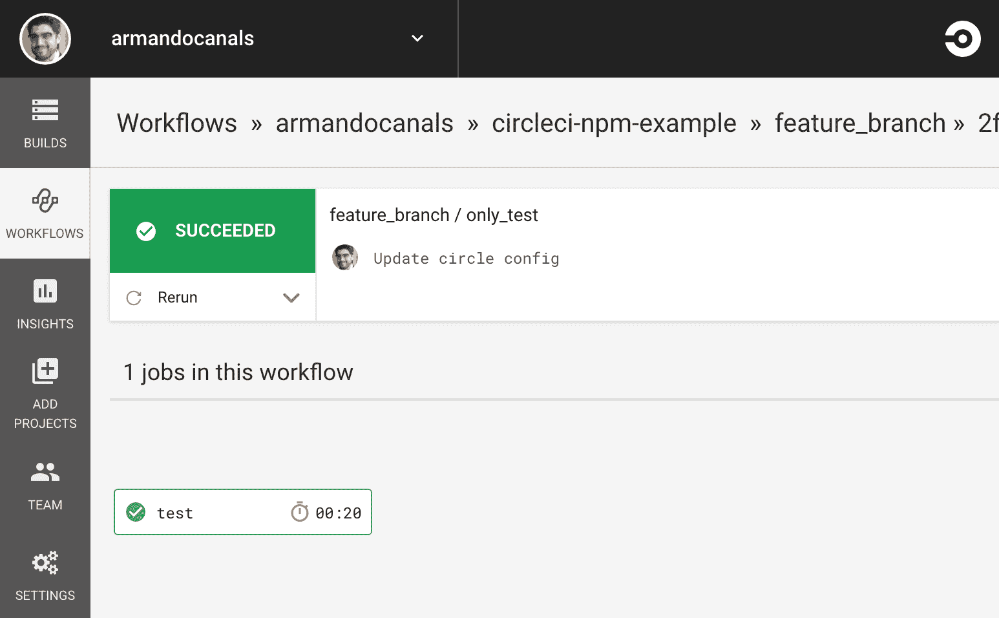
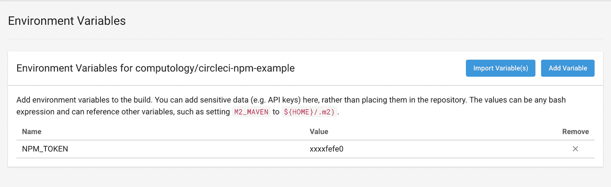
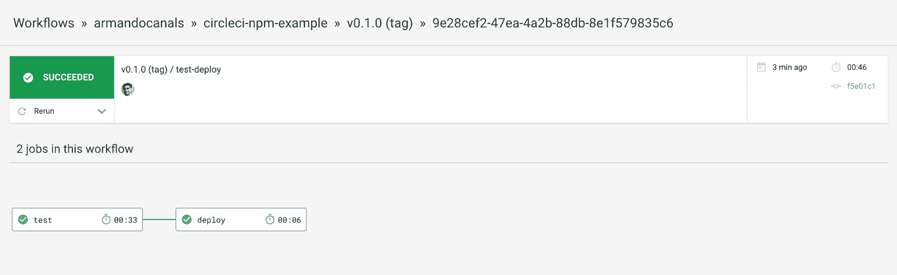
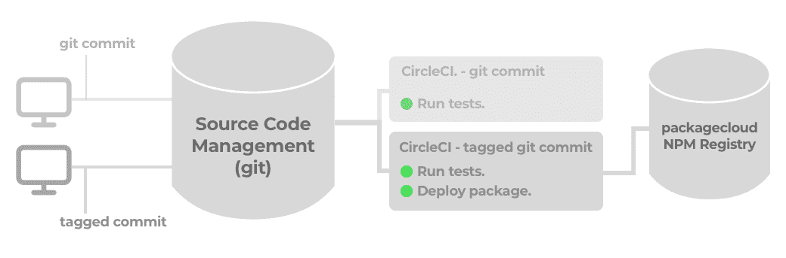

# 连续包发布，第二部分:使用 CircleCI 和 packagecloud - CircleCI 的自动 npm 发布

> 原文：<https://circleci.com/blog/continuous-package-publishing-part-ii-automated-npm-publishing-with-circleci-and-packagecloud/>

### 概观

在本帖中，我们将回顾构建基本软件交付管道的每个步骤。为了做到这一点，我们将提供一些例子来演示使用 CircleCI 作为[持续集成](https://circleci.com/continuous-integration/)服务器和 packagecloud 上的包存储库进行持续交付的自动化软件交付过程。

要了解更多关于软件包和包管理的基本概念，以及如何将它们与 CI/CD 结合起来构建软件交付管道，请阅读上一篇文章[连续包发布，第一部分:CI/CD 中的包管理简介](https://circleci.com/blog/continuous-package-publishing/)。

### 构建软件交付管道

作为一个例子，我们将构建一个 NodeJS 包，它提供一个打印“Hello World”和相应测试的函数。我们将把代码签入到一个`git`存储库中，使用 CircleCI 作为一个持续集成服务器，并将包发布到 packagecloud.io 上的一个存储库中。

**开始前**

如果你想按照这篇文章中的例子来创建一个软件交付管道的例子，请阅读下面的内容:

1.  用示例代码克隆 GitHub repo
2.  在 [CircleCI](https://circleci.com) 上创建或登录帐户。
3.  在 [packagecloud](https://packagecloud.io) 上创建或登录一个帐户，并按照说明创建一个存储库。示例中将使用 packagecloud 凭据。
4.  在 CircleCI 中设置一个名为`NPM_TOKEN`的环境变量，其值为 packagecloud 用户 API 令牌。

首先，让我们用我们正在构建的包的元数据创建`package.json`文件。

```
 package.json
{
  "name": "hello-world",
  "version": "0.1.0",
  "description": "Print 'Hello world!'",
  "main": "hello.js",
  "scripts": {
    "test": "jest"
  },
  "devDependencies": {
    "jest": "^22.2.1"
  },
  "author": "Armando Canals",
  "license": "MIT"
} 
```

*`main`字段指向 NodeJS 程序的主入口点。这种情况下，`hello.js`。*以及我们的软件包将包含的相应程序:

```
hello.js
function hi() {
  return "Hello world!";
}

module.exports = hi; 
```

如您所见，该程序定义了一个命名函数，该函数返回一个字符串，然后将该函数导出为 NodeJS 应用程序中的一个模块。

`module.exports`代码是需要这个包所必需的，这将在后面演示。让我们添加一个测试来涵盖这个功能。我们将使用 [Jest](https://facebook.github.io/jest/) 测试库(在`package.json`的`devDependencies`中列出)，因为它很简单，不需要配置。

```
hello.test.js
const hi = require('./hello.js');

describe('hi', () => {
  it('should return Hello world!', () => {
    expect(hi()).toBe("Hello world!");
  });
}); 
```

有了测试，我们就可以确保我们的代码准备好被打包分发了。

### 配置 CircleCI 以运行测试

在下一步中，我们将使用 CircleCI 2.0 配置在 CircleCI 中配置运行测试和分发 npm 包的工作流。

首先，在 CircleCI UI 中，找到并点击`Add Projects`按钮，从可用项目列表中选择一个项目，然后点击`Start building`按钮。



接下来，在项目根目录中，创建一个名为`.circleci,`的文件夹，并在该文件夹中创建一个名为`config.yml`的文件。

```
 .circleci/.config.yml
# Javascript Node CircleCI 2.0 configuration file
#
# Check {{ '/language-javascript' | docs_url }} for more details
#
version: 2

defaults: &defaults
  working_directory: ~/repo
  docker:
    - image: circleci/node:8.9.1

jobs:
  test:
    <<: *defaults  
    steps:
      - checkout

      - restore_cache:
          keys:
          - v1-dependencies-{{ checksum "package.json" }}
          - v1-dependencies-

      - run: npm install
      - run:
          name: Run tests
          command: npm test

      - save_cache:
          paths:
            - node_modules
          key: v1-dependencies-{{ checksum "package.json" }}

      - persist_to_workspace:
          root: ~/repo
          paths: .

workflows:
  version: 2
  only_test:
    jobs:
      - test 
```

该工作流配置将在每次提交时运行`jobs`下的`test`作业。

要查看关于此配置的更多细节，请查看使用 CircleCI 2.0 发布 npm 包的[。](https://circleci.com/blog/publishing-npm-packages-using-circleci-2-0/)

此时，我们可以使用`git`签入我们的源代码。

```
$ git add .
$ git commit -m 'Update circle config'
$ git push origin feature_branch 
```





我们软件交付管道的测试部分已经完成！现在，每次提交源代码库时，都会运行测试套件，以确保最近的更改没有破坏任何东西。

### 使用 CircleCI 2.0 发布 NodeJS 应用程序

既然我们已经有了一个为 NodeJS 包运行测试的自动化方法，我们需要在发布版本准备好发布时将包部署到 npm 注册中心。

首先，让我们在 packagecloud 上创建一个 [npm 注册表:](https://packagecloud.io/l/npm-registry)

*登录 packagecloud 后，点击“创建存储库”按钮创建一个 npm 注册表。下面的 CircleCI 配置中将使用该存储库的名称以及帐户的用户名。*

接下来，我们来修改一下前面的。circleci/config.yml 文件，以在配置中的作业下包含部署作业:

```
 # Javascript Node CircleCI 2.0 configuration file
#
# Check {{ '/language-javascript' | docs_url }} for more details
#
version: 2

defaults: &defaults
  working_directory: ~/repo
  docker:
    - image: circleci/node:8.9.1

jobs:
  test:
    <<: *defaults  
    steps:
      - checkout

      - restore_cache:
          keys:
          - v1-dependencies-{{ checksum "package.json" }}
          - v1-dependencies-

      - run: npm install
      - run:
          name: Run tests
          command: npm test

      - save_cache:
          paths:
            - node_modules
          key: v1-dependencies-{{ checksum "package.json" }}

      - persist_to_workspace:
          root: ~/repo
          paths: .

  deploy:
    <<: *defaults
    steps:
      - attach_workspace:
          at: ~/repo
      - run:
          name: Set registry URL
          command: npm set registry https://packagecloud.io/armando/node-test-package/npm/
      - run:
          name: Authenticate with registry
          command: echo "//packagecloud.io/armando/node-test-package/npm/:_authToken=$NPM_TOKEN" > ~/repo/.npmrc
      - run:
          name: Publish package
          command: npm publish

workflows:
  version: 2
  test-deploy:
    jobs:
      - test
      - deploy:
          requires:
            - test
          filters:
            tags:
              only: /^v.*/
            branches:
              ignore: /.*/ 
```

此工作流配置将运行我们的测试，并将我们的包部署到已配置的 npm 注册表。将 packagecloud 用户和 repo 替换为您在 packagecloud 上的用户/repo。

*   每次提交分支时，`test`作业将运行`npm test`
*   当包含`v`前缀的标记提交被推送到`git`(即`v0.1.0`)时，`deploy`作业将向已配置的 npm 注册表发布一个版本。

在我们继续之前，让我们从 packagecloud 获取配置中使用的`NPM_TOKEN`。所需的令牌是 packagecloud API 令牌，可以通过以下方式找到:

1.  登录 packagecloud 并点击侧边栏上的“API Token”按钮。

2.  或者，通过在运行`npm login`命令的机器上配置 packagecloud npm 注册表之后使用`npm login`，这可能是用于获取凭证的本地开发机器。在[包云文档](https://packagecloud.io/docs#npm_login)中阅读更多关于`npm login`的信息。

接下来，使用 packagecloud 中的令牌，让我们在 CircleCI 中设置一个名为`NPM_TOKEN`的环境变量。发布包时，此令牌将用于在 [packagecloud npm 注册表](https://packagecloud.io/l/npm-registry)中进行身份验证。



或者，如果您喜欢将您的敏感环境变量签入 git，但是加密，您可以遵循在 [circleci/encrypted-files](https://github.com/circleci/encrypted-files) 中概述的过程。触发包发布

使用上面的 CircleCI 配置，当包含`v`前缀(即`v0.1.0`)的标记提交被推送到`git`库时，可以触发发布。

```
$ git tag v0.1.0
$ git push origin v0.1.0 
```



现在，我们在每次提交时都运行测试套件，并且在将标签推送到 git 时部署软件版本。



### 使用部署的 NodeJS 包

现在我们已经在一个存储库中有了我们的包，用户将需要安装包所在的存储库。让我们安装我们在 CircleCI 工作流中部署`v0.1.0`包的包存储库。

我们可以通过在主目录或项目根目录中创建一个`.npmrc`文件来实现这一点，这取决于您是需要`npm`在系统范围内使用这个存储库，还是特定于一个项目。

```
~/.npmrc
registry=https://packagecloud.io/armando/node-test-package/npm/ 
```

这个存储库包含我们之前创建的 hello-world 应用程序。因此，在其系统上将此配置为 npm 注册表的用户现在可以运行以下命令:

```
$ npm install hello-world 
```

这个命令将安装我们在上一节中创建并发布的 hello-world 包。

```
$ node
> hello = require('hello-world');
[Function: hi]
> hello()
'Hello world!' 
```

### 结论

手工软件交付过程的自动化可以显著减少软件开发周期时间。通过创建部署管道，团队可以以快速、可重复和可靠的方式发布软件。

<this is="" a="" guest="" post="" written="" by="" armando="" canals="" co-founder="" at="" href="https://packagecloud.io">packagecloud</this>