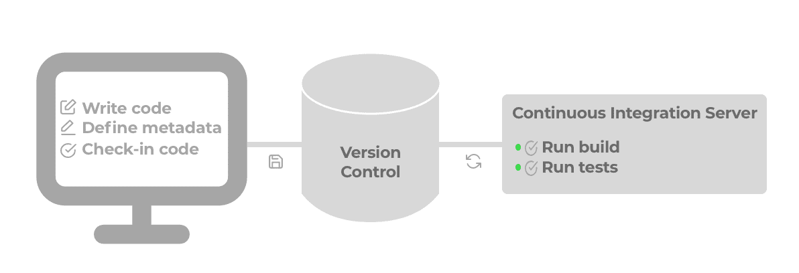
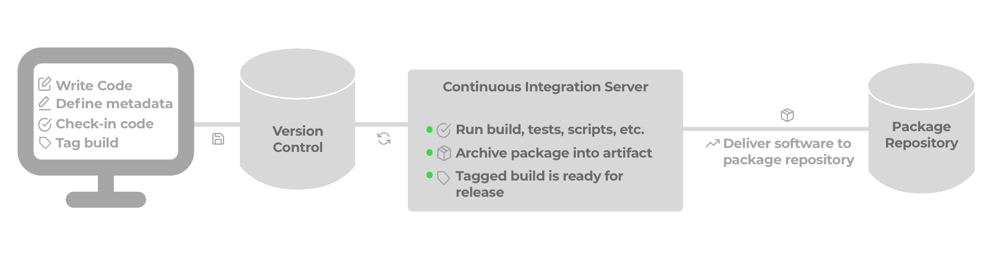
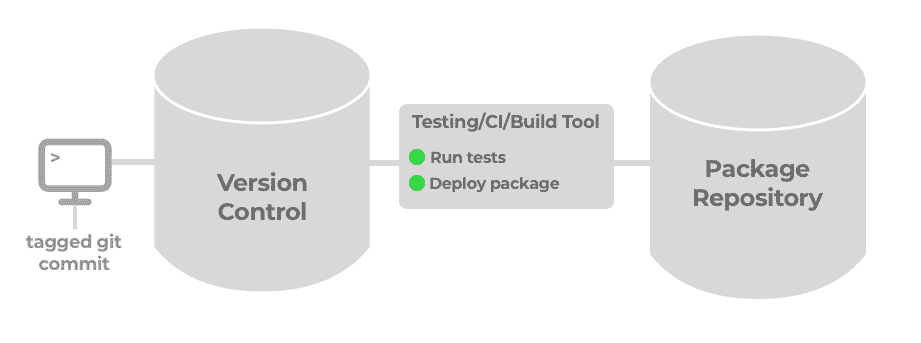
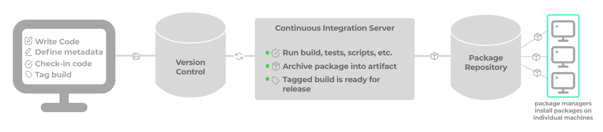

# 连续包发布，第一部分:CI/CD - CircleCI 中的包管理介绍

> 原文：<https://circleci.com/blog/continuous-package-publishing/>

*这是关于 CI/CD 中的包管理的两部分系列的第一部分，由 [packagecloud](https://packagecloud.io/) 的联合创始人 Armando Canals 撰写。*

## 概观

在本帖中，我们将解释一些关于软件包和包管理的基本概念，以及如何将它们与 CI/CD 结合起来构建软件交付管道。

我们将讨论软件包和存储库，持续交付，以及软件开发过程的构建、测试和发布阶段的自动化。

## 什么是软件包？

软件包是安装在服务器、计算机和个人设备上的可分发文件。

想到。Windows 上的 EXE 文件。Mac 上的 dmg 文件，或者。转速和。Linux/Debian 系统上的 deb 文件——这些都是不同平台使用的软件包。

这些软件包有一系列不同的格式，并且有许多不同的方式来描述它们的元数据。尽管如此，我们还是可以为大多数软件包定义一些通用的步骤:

```
* Write code
* Define metadata (name, version, dependencies, etc.)
* Archive code and metadata for distribution 
```

上面提到的最后一个步骤，归档代码，创建一个发布的软件包。这个档案，或者工件，在发布阶段被分发到存储库，我们将在后面的文章中回顾。

## 自动化软件包的构建、测试和发布

为了创建交付管道，我们希望尽可能多地自动化手动流程。在我们的项目中实现自动化发布将有助于减少软件开发过程中的摩擦和人为错误。

让我们回顾一下在创建软件交付管道时将要接触到的一些概念、过程和工具。

### 连续累计

[持续集成](https://circleci.com/continuous-integration/)是软件开发人员团队同意经常集成到共享代码库中的实践。通常，会使用一个版本控制系统，比如 git 或 Subversion，并在每次代码库集成时运行自动化单元测试。



我们将使用`git`版本控制系统和 CircleCI 作为我们的持续集成服务器。

我们希望每个人都能:

```
1\. run any build tasks necessary to run tests.
2\. run automated tests to ensure code quality. 
```

通过在每个集成中运行这些步骤，我们可以尽快检测到这些阶段中的任何错误并修复它们。

### 连续交货

持续交付是持续集成合乎逻辑的下一步。它描述了一种通过使软件部署成为简单的、可重复的任务来快速将软件从开发发布的方法。

### 构建软件包

实际的包构建过程因包类型而异。包的类型从操作系统级别的包到在浏览器中运行前端代码的包，每种包的构建方式都不同。

每种包类型都有一个工具或者一个特定的过程，来将包从源代码构建到一个归档中以供分发。例如，`npm`带有`npm pack`命令，该命令将代码库归档到一个 tarball 中，以便在 [npm 注册表](http://wiki.commonjs.org/wiki/Packages/Registry)上使用。

对于我们的示例，我们希望处理必要的任务，以便从 CI 服务器内部构建包。这个过程将允许我们在发布阶段将包发布到存储库中。

### 自动化发布

为了触发生成新版本的构建，我们需要告诉 CI 服务器一个版本已经准备好了。为了做到这一点，我们使用`git tag`特性作为触发器，告诉 CI 服务器一个构建已经准备好发布了。

例如，下面的第一个命令将标记最近的提交，第二个命令将新创建的标记推送到远程 git 存储库，触发我们在 CI 中的构建:

```
git tag v0.1.0
git push origin v0.1.0 
```

将标签推送到远程 repo 会触发 CircleCI 配置的部署工作流，我们将在后面的章节中对此进行介绍。



如上所述，一个带版本号的被推送到远程存储库的带标签的提交将触发我们的持续集成系统中的一个构建。这个过程会将代码归档成一个包格式(Deb、RPM、JAR 等)。)然后将它分发到工件/包存储库中。

### 构建一次软件包

当在不同的环境中测试代码时(开发、试运行、生产)，包应该是相同的。为 CI 系统中的每个环境构建包可能会引入难以发现的错误，并产生额外的工作，因此理想的做法是在测试过程的早期构建一次包，并将它们上传到存储库中，以便在测试的后期使用，并一直到生产。

### 分发软件包

一旦发布就绪，就需要以一种安全、可靠的方式提供给计算机。对我们来说，这意味着将软件包发布到一个包存储库中。

CircleCI 允许我们通过支持使用命令行工具和安全配置存储库凭证的能力来发布我们的包。

## 仓库

软件包资料库是元数据和包对象的混合体，与软件包管理器一起用于向计算机提供最新的软件。这些存储库是包及其元数据的仓库，可以是公共的，也可以是私有的。

公共软件库的一些例子是用于`npm`和 NodeJS 包[npmjs.org](https://npmjs.org/)的注册表，或者用于 Java/Maven 工件类型的 [Maven Central](https://search.maven.org/) 库。

对于我们的例子，我们将使用 [packagecloud，它为许多不同的包类型托管私有和公共包存储库](https://packagecloud.io/)，并与不同的包管理器无缝协作。

Packagecloud 生成各种包管理器使用的存储库元数据，从操作系统级包到浏览器中使用的 JavaScript 包。



## 包管理器

软件包管理器是与包含软件的软件包仓库进行交互的工具。开发人员使用它们来搜索、安装和管理存储库中的包。

例如，如果你使用基于 Debian 的操作系统，你可能熟悉[高级打包工具- APT](https://en.wikipedia.org/wiki/APT) ，或者如果你使用基于 RedHat 的系统，你可能习惯于使用 [yum/dnf](https://en.wikipedia.org/wiki/Yum_(software)) 工具。

另一个例子是，如果你是一名 JavaScript 开发人员，使用`npm`开发 NodeJS 包，或者是一名 Python 程序员，使用`pip`开发 Python 编程语言——包管理器的列表非常广泛，从操作系统级别的包到浏览器中运行的 JavaScript 代码。



## 结论

将软件开发过程的活动部分集成到 CI/CD 系统中，可以显著减少开发软件时的周期时间和人为错误。通过理解软件管道的不同部分并自动化软件交付过程，团队可以更快更有效地工作。

在[我们的下一篇文章](https://circleci.com/blog/continuous-package-publishing-part-ii-automated-npm-publishing-with-circleci-and-packagecloud/)中，我们将使用 CircleCI 构建一个全功能的软件交付管道，以构建包、运行测试并将工作包上传到 packagecloud 上的存储库中。