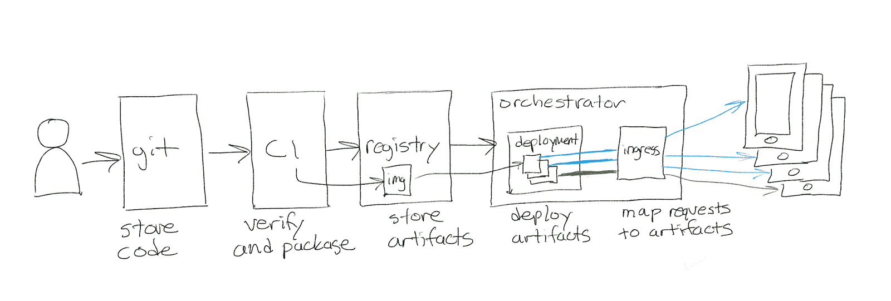
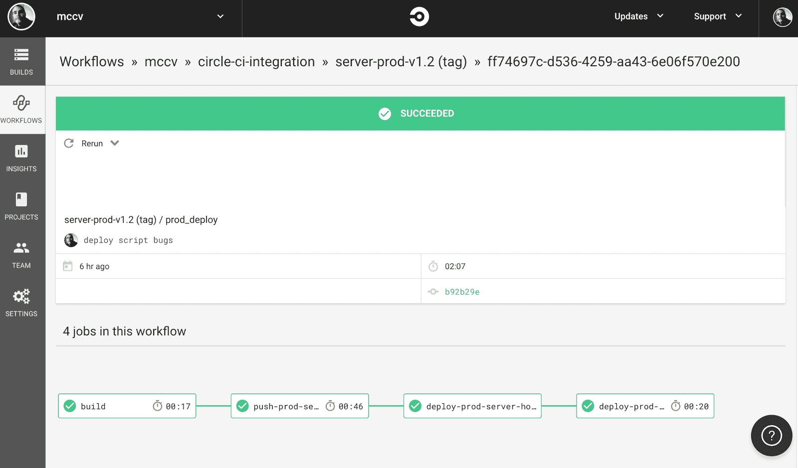
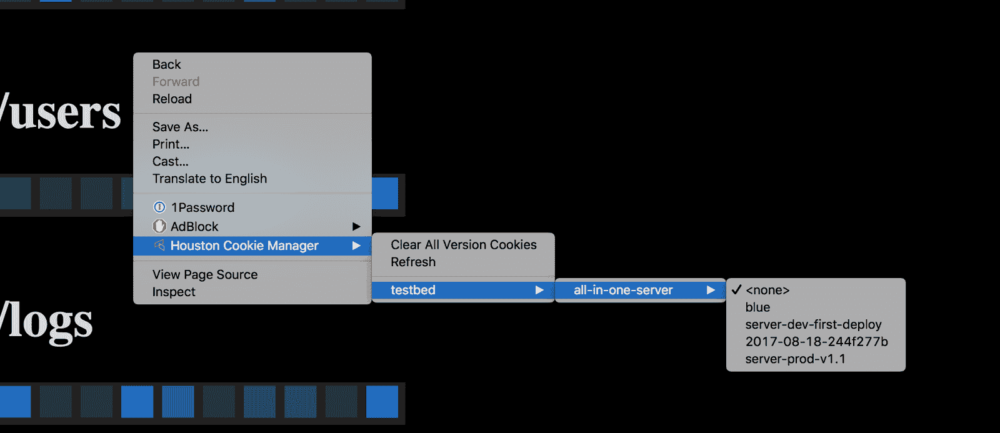
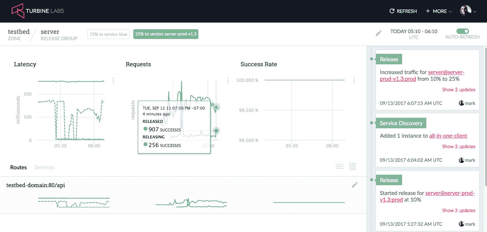

# CircleCI 和休斯顿- CircleCI 连续发布

> 原文：<https://circleci.com/blog/continuous-release-with-circleci-and-houston/>

**来自出版商的说明:**您已经找到了我们的一些旧内容，这些内容可能已经过时和/或不正确。尝试在[我们的文档](https://circleci.com/docs/)或[博客](https://circleci.com/blog/)中搜索最新信息。

* * *

## 将 CircleCI、GKE 和休斯顿结合起来，简单、安全、快速地将代码提供给客户。

*本文由 Turbine Labs，Inc .首席执行官 Mark McBride 撰写*

### 概观

工程团队的存在不是为了手动执行发布过程或紧张地盯着生产指标；他们的存在是为了制造并向客户交付产品。我们开发发布过程以确保我们构建的产品是好的，理解花费在这种保证上的时间是有代价的:花费在考虑发布上的时间就是花费在不考虑产品上的时间。在[涡轮实验室](https://www.turbinelabs.io/)，我们花了很多时间思考如何改善这种平衡，这也是我们建造休斯顿的原因。在这里，我们将向您展示如何使用 CircleCI、GKE 和休斯顿的组合为 web 应用程序创建高质量、低开销的连续发布管道。

发布过程的目标是快速安全地将新代码提供给客户。在理想情况下，这一过程是即时的，没有风险。在现实世界中，[每一次发布都伴随着一些风险](https://blog.turbinelabs.io/every-release-is-a-production-test-b31d80f2bc74)，所有的过程都需要时间。这是一种微妙的平衡。花太多时间来增加你对一个版本的信心，你的执行速度会慢得像爬行一样。过分热衷于发布，产品质量会受到影响，这也会使执行陷入停顿。

几十年前，代码/构建/验证/部署/发布周期被验证。这个过程中的大多数步骤都是由人来完成的，而且这个过程很慢。持续集成系统自动化单元测试和封装的兴起。最近，云和容器编排基础设施使得自动将代码推送到硬件变得前所未有的容易。[但是正如我们已经看到的](https://blog.turbinelabs.io/deploy-not-equal-release-part-one-4724bc1e726b)，如果没有单独的发布流程，持续部署会增加客户面临的巨大风险。

传统发布流程中的压力和谨慎源于几个因素:

1.  发布新代码的成本
2.  恢复失败版本的成本
3.  难以确定一个版本的质量
4.  发布缺陷的广泛范围

正确的工具有助于建立一个工作流程来解决这些问题。执行成本低、恢复成本低、检查简单且影响有限的版本极大地加速了工程团队。

我们将通过一个具体的例子，使用 CircleCI 进行持续集成， [GKE](https://cloud.google.com/container-engine/) 进行持续部署，以及[休斯顿](https://www.turbinelabs.io/)进行高可信度发布。这个例子中的所有代码都可以在 https://github.com/turbinelabs/circle-ci-integration/的[获得。您可以派生这个 repo，并按照自述文件中的说明自己完成示例。](https://github.com/turbinelabs/circle-ci-integration/)



释放管道

在我们的工作流中，开发人员推送由 CircleCI 构建、测试和打包的分支，circle ci 会自动将它们作为部署推送到 GKE。工程师可以在向广大受众发布之前测试这些部署，在生产中验证代码，而不会向客户公开。发布工程师推送标签，这些标签也由 CircleCI 打包，然后推送到 GKE。这些部署可以增量地发布给客户，并与现有代码进行行为比较。如果新部署看起来不好，可以立即关闭。从 git 推送到代码出现在生产环境中的总时间大约是 2 分钟。

### GKE 构型

这个例子基于我们的 [Kubernetes 集成指南](https://docs.turbinelabs.io/guides/kubernetes.html)。我们在 GKE 部署了一个简单的服务，使用休斯顿来管理入口流量。这种设置允许我们将[部署与](https://blog.turbinelabs.io/deploy-not-equal-release-part-one-4724bc1e726b)发布分开，支持增量蓝绿色部署、生产中的验证以及跨不同代码版本的应用行为的轻松比较。就其本身而言，这解决了我们的两个挑战:[休斯顿以客户为中心的方法来衡量应用健康](https://blog.turbinelabs.io/customer-centric-metrics-3acec880ae4d)意味着它可以直接确定新代码是否表现良好，休斯顿的发布控制意味着[恢复发布就像扳动开关一样简单](https://blog.turbinelabs.io/beyond-observing-behavior-a0887fe0d3ca)。

### 要求

我们希望它易于部署和发布代码，但我们不一定要将每个提交都推送到 git。在本例中，我们使用以下约定:

*   每次提交都有自动化测试运行。

*   与/server-dev-命名方案匹配的分支。*/被推到 GKE，每个分支都有自己的部署。当对分支进行修改时，相应的部署也会更新。这使得开发人员可以在不污染 GKE 环境的情况下迭代正在进行的分支。

*   与/server-prod-命名方案匹配的标记。*/被推送到 GKE，每个标签都有自己的部署。

CircleCI 2.0 提供了[工作流](https://circleci.com/docs/workflows/)，可以让您为不同的 git 活动编写不同的执行步骤。在我们的 [config.yml](https://github.com/turbinelabs/circle-ci-integration/blob/master/.circleci/config.yml) 中，我们定义了三个工作流:

*   “构建”工作流在每次提交时执行，并且只运行自动化测试。

*   “dev_deploy”工作流是在对匹配 regex /server-dev-的分支进行更新时触发的。*/.它运行自动化测试，构建 docker 映像，将其推送到 GCR，然后创建一个标有“开发”阶段的 kubernetes 部署。

*   “prod_deploy”工作流在表单/server-prod-的标签推送时触发。*/.它像 dev_deploy 一样测试、打包和推送映像到 GCR。但是，在创建部署之前，它还包括一个批准步骤，并将其部署标记为“生产”阶段。



运行中的工作流

### 连续累计

我们的示例项目是一个简单的节点应用程序，因此集成只是执行一个自动化测试套件。CircleCI 2.0 引入了使用定制容器映像的能力，通过允许用户从预先配置的映像开始，极大地缩短了构建/测试时间，从而节省了每次构建时下载和安装所需软件的成本。我们从正式的 node:8.4.0 映像开始，运行 npm install 和 npm test，而不是从普通的 Linux 安装开始。

```
# note: the docker image versions here are almost certainly out of date.
# See https://github.com/turbinelabs/circle-ci-integration/blob/master/.circleci/config.yml
jobs:
  build:
    docker:
      - image: node:8.4.0
        environment:
          DEBIAN_FRONTEND: noninteractive
          steps:
            - checkout
            - run: cd server && npm install && npm test 
```

### 连续交货

持续交付更加复杂，因为我们需要配置 CircleCI 来与 GKE 一起工作。我们使用项目环境变量来将秘密保存在我们的存储库中，设置以下值

1.  GCLOUD_CLUSTER_NAME —可在 GCLOUD 容器集群列表中找到
2.  GCLOUD_COMPUTE_ZONE —也可以在 GCLOUD 容器集群列表中找到
3.  GCLOUD_PROJECT ID —此处描述了
4.  谷歌地球

为了避免每次构建都从一个新的 Ubuntu 映像开始，这需要每次构建都下载、安装和配置 GCloudSDK 和 Docker，我们将它打包到一个映像[中，这个映像](https://github.com/turbinelabs/gcloud-build)已经预装了软件，通过环境变量进行了配置。这在每次构建过程中节省了大量时间。有了这些，我们的推送开发服务器作业运行 docker build，标记构建的映像，并将其推送到 GCR。

```
# note: the docker image versions here are almost certainly out of date.
# See https://github.com/turbinelabs/circle-ci-integration/blob/master/.circleci/config.yml
  push-dev-server:
    docker:
      - image: turbinelabs/gcloud-build:0.12.0
    environment:
      DEBIAN_FRONTEND: noninteractive
    steps:
      - checkout
      - setup_remote_docker
      - run: openrc boot
      - run: docker build -t gcr.io/${GCLOUD_PROJECT_ID}/all-in-one-server:$CIRCLE_BRANCH server
      - run: docker tag gcr.io/${GCLOUD_PROJECT_ID}/all-in-one-server:$CIRCLE_BRANCH gcr.io/${GCLOUD_PROJECT_ID}/all-in-one-server:la
      - run: gcloud docker -- push gcr.io/${GCLOUD_PROJECT_ID}/all-in-one-server:$CIRCLE_BRANCH 
```

### 持续部署

既然我们的代码已经打包并发送到 GCR，我们就可以在 GKE 创建部署了。我们已经为开发和生产部署构建了 yaml 模板，替换了分支、标记、git sha、stage(开发或生产)和部署版本的字符串。一个简单的 shell 脚本使用 CircleCI 环境提供的信息将模板转换成有效的 kubernetes 规范。我们使用相同的 gcloud-build-base 映像来调用 kubectl，我们的部署在 GKE 创建或更新。

```
 ```
  # note: the docker image versions here are almost certainly out of date. # See https://github.com/turbinelabs/circle-ci-integration/blob/master/.circleci/config.yml   deploy-dev-server:
docker:
  - image: turbinelabs/gcloud-build:0.12.0
steps:
  - checkout
  - run: openrc boot
  - run: ./deploy.sh dev server/dev-deploy-template.yaml

 ``` 
```

请注意，这将[部署代码，而不是发布代码](https://blog.turbinelabs.io/deploy-not-equal-release-part-one-4724bc1e726b)。

### 在生产中验证

现在我们的工作流已经就绪，我们可以创建一个开发分支，进行更改，推动它，并在大约 2 分钟内看到生产中的新部署。部署完成后，我们可以使用休斯顿来预览新的变更，并在它们发布给客户之前进行验证。为了简化这个过程，我们的前端开发人员创建了一个 [chrome 插件](https://chrome.google.com/webstore/detail/houston-cookie-manager/bhigicedeaekhgjpgmpigofebngokpip?hl=en-US)(源代码也可以从 github 上的[获得)让你选择一个服务版本来查看。](https://github.com/turbinelabs/houston-crx)

我们首先将休斯顿配置为寻找名为“Tbn-All-in-one-server-Version”的 cookie，如果这样的 cookie 存在，则将流量路由到版本标签与 cookie 值匹配的服务实例。有了它，我们的插件可以向休斯顿 API 请求一个已部署服务版本的列表，并设置一个 cookie，将浏览器会话固定到该版本的代码。这让您可以与其他团队成员共享推送的代码，而没有干扰客户的风险。如果你需要改变，只需在你的分支上做出改变，然后推动它。CI 管道构建、打包并推送新代码。



选择已部署但未发布的代码版本进行验证

### 放

生产版本略有不同。当您想要创建一个可发布的版本时，创建一个标签并将其推送到您的 git 源。

```
git tag server-prod-v1.1
git push origin server-prod-v1.1 
```

这将触发 CircleCI 中的 prod_deploy 工作流。这遵循与 dev_deploy 工作流相同的步骤，但是在 GKE 中创建部署之前包括一个额外的批准步骤。这不是必需的，但是如果您希望在创建生产实例之前有一个轻量级的批准步骤，CircleCI 提供了一个很好的解决方案。

创建部署后，您可以使用 Houston 向客户逐步发布新版本。从一个小的百分比开始，以最小化一个缺陷漏过的影响。然后，比较新旧版本的延迟和成功率。如果出现任何问题，只需关闭新版本，客户就会回到以前的版本。



轻松实现蓝色/绿色增量发布

### 包裹

有了这条管道，我们可以轻松安全地构建、测试、部署、验证和发布软件。创建部署就像推送分支或标记一样简单。这些部署可以发布给单独的开发人员，或者逐渐地发布给用户群的一部分，极大地减少了缺陷的影响。当事故发生时，恢复到以前的状态就像按动电灯开关一样简单。所有这一切意味着工程团队花更少的时间强调做出改变，而更多的时间专注于构建产品。